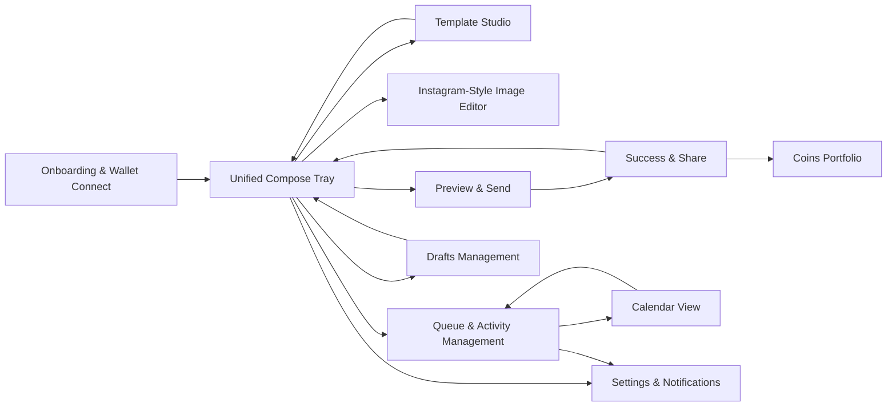
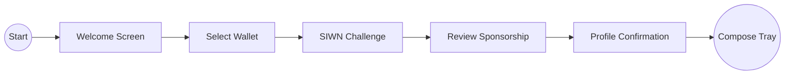
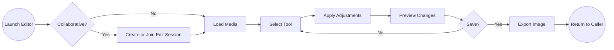
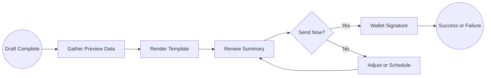
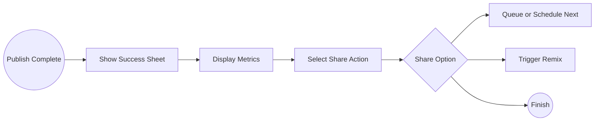

# Comprehensive Design Document

## Executive Summary
- Product vision: Deliver a mobile-first Neynar-powered planner that lets creators compose, template, schedule, and publish Farcaster casts with optional Zora coin drops in a single create -> preview -> send -> share loop while honoring all eleven end-to-end journeys.
- Success criteria: Median draft-to-schedule time <=45s, share card adoption >=40%, measurable uplift in Zora coin mint conversions, repeat scheduling rituals that drive weekly active creator retention, and post-launch SUS >=80.
- Technical architecture: Next.js application under `web/` backed by the existing Express API (`src/index.ts`) with SIWN-authenticated REST, WebSocket, and SSE channels; shadcn/ui component system mapped through Tailwind tokens; Pinata-powered media uploads; Neynar and Zora integrations for social graph, casting, and coin orchestration; worker-driven template rendering and scheduling queues.
- Performance and accessibility commitments: Template preview render <300ms, final template render <1s, ticker availability responses <200ms, calendar drag feedback <150ms, mobile TTI <3s, offline-first compose and draft resilience, WCAG 2.1 AA compliance, Dynamic Type support up to 130 percent, and 4.5:1 contrast minimums across light and dark themes.
- Growth and retention targets: 70 percent of success screens trigger at least one downstream action (share, schedule next, open portfolio), streak success rate >=65 percent, challenge participation >=35 percent, and measurable uplift from friend discovery modules surfaced across queue, calendar, and portfolio experiences.

## Architectural Overview and Build Context
- The production frontend lives in the Next.js app under web/. All Template Studio, calendar, queue, compose, and social proof interfaces ship here using shadcn/ui primitives extended with project-specific patterns.
- The existing Express backend remains the canonical API surface, with `src/neynarClient.ts`, `src/zoraService.ts`, Pinata upload routes, and worker queues orchestrating renders, scheduling, and analytics. All new endpoints adopt bearer tokens derived from SIWN.
- Real-time collaboration, status updates, and ticker availability updates flow through `GET /api/realtime` (WebSocket) and `/api/realtime/sse` (Server-Sent Events fallback).
  - Envelope fields:
    - `id`
    - `type`
    - `payload`
    - `ts` (ISO timestamp or epoch milliseconds)
    - `scope` (for example `user:<fid>` or `session:<id>`)
    - `requestId`
    - `retry` (count/backoff hint)
- State management leans on React Query for optimistic updates, offline caching, and synchronization with WebSocket pushes. IndexedDB backs draft persistence, template previews, and image editor offline queues.
- Build tooling enforces performance (bundle analyzer, web vitals budgets), accessibility (axe and Lighthouse checks, focus-visible utilities), and cross-platform device matrices (iPhone, Pixel, iPad, mid-tier Android) per roadmap milestones.

## Research Source Mapping
- Product strategy, personas, success metrics, social mechanics, and validation plans sourced from docs/full_frontend_research_ux_design_plan_onchain_mini_app_final_merged_compose_v_3.md.
- Detailed journey flows, wireframes, accessibility guidance, component requirements, and edge cases consolidated from docs/user-journeys/journey-specifications.md.
- API surface extensions, WebSocket envelopes, idempotency semantics, and error contracts defined in docs/technical-specifications/api-contracts.md.
- shadcn/ui migration paths, component variants, design tokens, spacing and typography scales, and performance expectations described in docs/design-system/shadcn-component-mapping.md.
- Phase-by-phase delivery plan, dependencies, success criteria, and risk mitigation captured in docs/implementation-roadmap.md.
- Instagram-style editor integration patterns, performance budgets, mobile gestures, and accessibility rules defined in docs/integration-guides/tui-image-editor-integration.md.
## User Journey Topology


| # | Journey | Primary Persona | Outcome | Real-time and Growth Hooks |
|---|---------|-----------------|---------|----------------------------|
| 1 | Onboarding & Wallet Connect | New Onchain Poster | Complete SIWN, confirm sponsorship, reach compose tray | Progressive disclosure, sponsorship education, reuse via success CTA |
| 2 | Unified Compose Tray | Creator Pro | Draft cast or coin with media, templates, scheduling | Autosave, ticker validation <200ms, WebSocket draft sync |
| 3 | Template Studio | Creator Pro | Create and manage reusable visual templates | Live preview loop <300ms, collaborative edit gating |
| 4 | Instagram-Style Image Editor | Creator Pro | Apply advanced edits with gesture support | Collaborative sessions, offline queueing |
| 5 | Preview & Send | Creator Pro | Validate post plus coin, confirm wallet | Template render streaming, failure fallbacks |
| 6 | Success & Share | Creator Pro | Share success assets, trigger growth loop | Friend tagging prompts, streak updates |
| 7 | Queue & Activity Management | Creator Pro | Monitor and manage scheduled work | WebSocket status feed, bulk action telemetry |
| 8 | Calendar View | Creator Pro | Visualize and reorganize planned content | Drag-drop with conflict suggestions, auto-queue slots |
| 9 | Drafts Management | Creator Pro | Resume, organize, and bulk manage drafts | Offline reconciliation, revision tokens |
|10 | Coins Portfolio | Coin-Curious Follower | Track performance, share or trade | Live analytics refresh, social proof prompts |
|11 | Settings & Notifications | All personas | Configure defaults, notifications, integrations | Preference sync, reminder enrollment |
## Journey Specifications

### Journey 1: Onboarding & Wallet Connect
#### Flow Diagram

#### Key Screens and States
- Welcome hero, wallet modal, SIWN approval, sponsorship summary, success handoff.
- States: loading config, wallet connecting, success confirmation, wallet rejected, SIWN error, sponsorship unavailable, help expanded, offline fallback messaging.
#### Data and API Integrations
- GET /config for SIWN client IDs, SIWN challenge via Neynar, sponsorship eligibility service, session token issuance, analytics events (onboarding_start, siwn_success).
#### Components and Accessibility
- shadcn Button, Dialog, Tabs, Alert, Progress; modal focus traps, passkey hints, live-region updates for status changes, Dynamic Type scaling to 130 percent.
#### Wireframe and Layout Notes
- 12-column desktop grid (24px margins, 16px gutters); tablet collapses hero layout; mobile uses full-height sheet with sticky CTA and back swipe support.
#### Edge Cases and Offline Handling
- SIWN token expiry triggers automatic re-challenge, unsupported wallet path surfaces alternative flows, sponsorship timeout provides retry with exponential backoff, passkey denied surfaces manual connect, offline state defers sponsorship check with cached guidance.
#### Performance and Instrumentation
- Target SIWN handshake <3s at P75, sponsorship eligibility response <400ms, log retries with reason codes, capture analytics drop-off per stage.

#### Accessibility Acceptance
- [ ] Confirm Onboarding & Wallet Connect primary heading exposes `<h1>` semantics with a programmatic name.
- [ ] Verify Onboarding & Wallet Connect provides landmark roles (`header`, `nav`, `main`, `footer`) for screen reader wayfinding.
- [ ] Ensure Onboarding & Wallet Connect skip navigation link focuses the main content container when triggered.
- [ ] Validate focus order in Onboarding & Wallet Connect follows the visual flow for all interactive controls.
- [ ] Check Onboarding & Wallet Connect ensures no keyboard traps; Tab and Shift+Tab cycle through all controls.
- [ ] Confirm Onboarding & Wallet Connect primary CTA announces its purpose via accessible name and `aria-describedby` hints.
- [ ] Ensure all buttons in Onboarding & Wallet Connect expose discernible text or `aria-label`.
- [ ] Validate inputs in Onboarding & Wallet Connect pair `<label>` elements or `aria-labelledby` to announce context.
- [ ] Confirm helper copy in Onboarding & Wallet Connect links to inputs through `aria-describedby` for screen readers.
- [ ] Ensure error messages in Onboarding & Wallet Connect meet 4.5:1 contrast and remain visible until resolved.
- [ ] Verify error states in Onboarding & Wallet Connect move focus to the first invalid field and announce via `aria-live` polite.
- [ ] Check asynchronous status banners in Onboarding & Wallet Connect register with `aria-live` to announce progress updates.
- [ ] Ensure success confirmations in Onboarding & Wallet Connect use `role=alert` or `aria-live` polite announcements.
- [ ] Validate all icons in Onboarding & Wallet Connect used as controls include `aria-hidden=true` or accessible labels.
- [ ] Confirm tooltip triggers in Onboarding & Wallet Connect open via keyboard (Enter/Space) and close with Escape.
- [ ] Ensure modal dialogs in Onboarding & Wallet Connect trap focus, restore focus on close, and expose `aria-modal=true`.
- [ ] Verify all dismiss buttons in Onboarding & Wallet Connect modals and sheets have keyboard focus and accessible names.
- [ ] Confirm tablists in Onboarding & Wallet Connect support arrow key navigation per WAI-ARIA Authoring Practices.
- [ ] Ensure Onboarding & Wallet Connect segmented controls expose `aria-pressed` or `role=tab` semantics consistently.
- [ ] Validate chart summaries in Onboarding & Wallet Connect include adjacent textual descriptions for non-visual users.
- [ ] Confirm real-time updates in Onboarding & Wallet Connect toggle `aria-busy` on containers during data refresh.
- [ ] Ensure loading skeletons in Onboarding & Wallet Connect announce `Loading Onboarding & Wallet Connect` via `aria-live` polite.
- [ ] Verify offline banners in Onboarding & Wallet Connect receive focus on appearance and explain recovery steps.
- [ ] Check that Onboarding & Wallet Connect ensures minimum 4.5:1 contrast in both light and dark themes for body text.
- [ ] Confirm high contrast or forced colors mode retains legible borders and outlines in Onboarding & Wallet Connect.
- [ ] Ensure reduced motion preference in Onboarding & Wallet Connect disables non-essential animations and transitions.
- [ ] Validate dynamic type scaling at 130% in Onboarding & Wallet Connect preserves layout without content loss.
- [ ] Confirm drag-and-drop alternatives in Onboarding & Wallet Connect expose keyboard move actions and announce outcomes.
- [ ] Ensure live validation hints in Onboarding & Wallet Connect announce changes politely without interrupting typing.
- [ ] Verify table or list rows in Onboarding & Wallet Connect include `aria-setsize`/`aria-posinset` when necessary.
- [ ] Check that link text in Onboarding & Wallet Connect is descriptive and avoids generic phrases like 'click here'.
- [ ] Confirm badges or status pills in Onboarding & Wallet Connect expose `aria-label` describing their significance.
- [ ] Ensure toggles in Onboarding & Wallet Connect use `role=switch` with `aria-checked` reflecting state.
- [ ] Validate image or avatar elements in Onboarding & Wallet Connect include descriptive alt text or hidden when decorative.
- [ ] Confirm keyboard shortcuts in Onboarding & Wallet Connect have documented alternatives and can be disabled.

### Journey 2: Unified Compose Tray
#### Flow Diagram
```mermaid
flowchart LR
    start((Start)) --> mode[Select Mode]
    mode --> draft[Draft Content]
    draft --> media[Edit Media or Template]
    media --> schedule[Schedule or Send]
    schedule --> preview[Preview]
    preview --> publish[Send or Queue]
    publish --> end((Success or Queue))
```
#### Key Screens and States
- Compose tray main, media upload dialog, template selector sheet, scheduling drawer, offline warning banner.
- States: wrong chain, disconnected wallet, upload in progress, validation errors, preview ready, autosave idle, autosave failure, offline cached draft.
#### Data and API Integrations
- Pinata uploads (/uploads/pinata/sign, /uploads/pinata/direct, /uploads/pinata/legacy), /zora/coins/metadata, /api/templates CRUD, /api/templates/render, scheduling endpoints, React Query ticker availability checks (<200ms SLA) with optimistic updates.
#### Components and Accessibility
- shadcn Tabs, Textarea, Dropzone wrapper, Popover calendar, Command template selector, Toast notifications, Form primitives for validation, autosave announcements via aria-live.
#### Wireframe and Layout Notes
- Desktop: text composer columns 1-7, media panel columns 8-12, scheduling drawer overlay width 360px with 24px padding; mobile collapses sections with sticky action bar and drag handle bottom sheets.
#### Edge Cases and Offline Handling
- Wrong chain surfaces chain switch inline, autosave conflict prompts review, template missing falls back to default, offline compose stores updates in IndexedDB, queue publish degrades to local draft when API unreachable.
#### Performance and Instrumentation
- Template selector fetch <=250ms, autosave debounce 1.5s with network-aware throttling, track compose_autosave_status, enforce CPU budget via virtualization when template library >50 items.

#### Accessibility Acceptance
- [ ] Confirm Unified Compose Tray primary heading exposes `<h1>` semantics with a programmatic name.
- [ ] Verify Unified Compose Tray provides landmark roles (`header`, `nav`, `main`, `footer`) for screen reader wayfinding.
- [ ] Ensure Unified Compose Tray skip navigation link focuses the main content container when triggered.
- [ ] Validate focus order in Unified Compose Tray follows the visual flow for all interactive controls.
- [ ] Check Unified Compose Tray ensures no keyboard traps; Tab and Shift+Tab cycle through all controls.
- [ ] Confirm Unified Compose Tray primary CTA announces its purpose via accessible name and `aria-describedby` hints.
- [ ] Ensure all buttons in Unified Compose Tray expose discernible text or `aria-label`.
- [ ] Validate inputs in Unified Compose Tray pair `<label>` elements or `aria-labelledby` to announce context.
- [ ] Confirm helper copy in Unified Compose Tray links to inputs through `aria-describedby` for screen readers.
- [ ] Ensure error messages in Unified Compose Tray meet 4.5:1 contrast and remain visible until resolved.
- [ ] Verify error states in Unified Compose Tray move focus to the first invalid field and announce via `aria-live` polite.
- [ ] Check asynchronous status banners in Unified Compose Tray register with `aria-live` to announce progress updates.
- [ ] Ensure success confirmations in Unified Compose Tray use `role=alert` or `aria-live` polite announcements.
- [ ] Validate all icons in Unified Compose Tray used as controls include `aria-hidden=true` or accessible labels.
- [ ] Confirm tooltip triggers in Unified Compose Tray open via keyboard (Enter/Space) and close with Escape.
- [ ] Ensure modal dialogs in Unified Compose Tray trap focus, restore focus on close, and expose `aria-modal=true`.
- [ ] Verify all dismiss buttons in Unified Compose Tray modals and sheets have keyboard focus and accessible names.
- [ ] Confirm tablists in Unified Compose Tray support arrow key navigation per WAI-ARIA Authoring Practices.
- [ ] Ensure Unified Compose Tray segmented controls expose `aria-pressed` or `role=tab` semantics consistently.
- [ ] Validate chart summaries in Unified Compose Tray include adjacent textual descriptions for non-visual users.
- [ ] Confirm real-time updates in Unified Compose Tray toggle `aria-busy` on containers during data refresh.
- [ ] Ensure loading skeletons in Unified Compose Tray announce `Loading Unified Compose Tray` via `aria-live` polite.
- [ ] Verify offline banners in Unified Compose Tray receive focus on appearance and explain recovery steps.
- [ ] Check that Unified Compose Tray ensures minimum 4.5:1 contrast in both light and dark themes for body text.
- [ ] Confirm high contrast or forced colors mode retains legible borders and outlines in Unified Compose Tray.
- [ ] Ensure reduced motion preference in Unified Compose Tray disables non-essential animations and transitions.
- [ ] Validate dynamic type scaling at 130% in Unified Compose Tray preserves layout without content loss.
- [ ] Confirm drag-and-drop alternatives in Unified Compose Tray expose keyboard move actions and announce outcomes.
- [ ] Ensure live validation hints in Unified Compose Tray announce changes politely without interrupting typing.
- [ ] Verify table or list rows in Unified Compose Tray include `aria-setsize`/`aria-posinset` when necessary.
- [ ] Check that link text in Unified Compose Tray is descriptive and avoids generic phrases like 'click here'.
- [ ] Confirm badges or status pills in Unified Compose Tray expose `aria-label` describing their significance.
- [ ] Ensure toggles in Unified Compose Tray use `role=switch` with `aria-checked` reflecting state.
- [ ] Validate image or avatar elements in Unified Compose Tray include descriptive alt text or hidden when decorative.
- [ ] Confirm keyboard shortcuts in Unified Compose Tray have documented alternatives and can be disabled.

### Journey 3: Template Studio
#### Flow Diagram
```mermaid
flowchart LR
    start((Start)) --> library[Browse Templates]
    library --> create[Create or Edit Template]
    create --> preview[Render Preview]
    preview --> save[Save or Version]
    save --> assign[Set Default or Share]
    assign --> end((Return to Compose))
```
#### Key Screens and States
- Library grid (My, Shared, Recent), canvas workspace, save confirmation, version history drawer.
- States: empty library, editing, preview rendering, save success, validation error, version conflict, offline edit mode.
#### Data and API Integrations
- /api/templates CRUD, /api/templates/render preview pipeline keyed by {styleId, titleHash}, Pinata asset uploads, version history metadata, WebSocket template:render-progress events.
#### Components and Accessibility
- shadcn Tabs, Command, Slider, custom ColorPicker, ResizablePanel, Dialog, embedded TUI editor, keyboard shortcuts list, layer ordering via arrow keys, color inputs with text fallback.
#### Wireframe and Layout Notes
- Desktop split view: toolbar columns 1-2, canvas columns 3-8, properties columns 9-12; mobile uses top toolbar with horizontal scroll and collapsible sheet for properties.
#### Edge Cases and Offline Handling
- Active schedule lock prompts duplicate flow, collaboration without permission blocked with share guidance, render service downtime reuses last preview, font upload failures fall back to default with descriptive errors, offline edits queue until sync.
#### Performance and Instrumentation
- Live preview budget <300ms, final render <1s via worker queue, analytics for template_save_success, monitor render retries, enforce concurrency caps to avoid thrash.

#### Accessibility Acceptance
- [ ] Confirm Template Studio primary heading exposes `<h1>` semantics with a programmatic name.
- [ ] Verify Template Studio provides landmark roles (`header`, `nav`, `main`, `footer`) for screen reader wayfinding.
- [ ] Ensure Template Studio skip navigation link focuses the main content container when triggered.
- [ ] Validate focus order in Template Studio follows the visual flow for all interactive controls.
- [ ] Check Template Studio ensures no keyboard traps; Tab and Shift+Tab cycle through all controls.
- [ ] Confirm Template Studio primary CTA announces its purpose via accessible name and `aria-describedby` hints.
- [ ] Ensure all buttons in Template Studio expose discernible text or `aria-label`.
- [ ] Validate inputs in Template Studio pair `<label>` elements or `aria-labelledby` to announce context.
- [ ] Confirm helper copy in Template Studio links to inputs through `aria-describedby` for screen readers.
- [ ] Ensure error messages in Template Studio meet 4.5:1 contrast and remain visible until resolved.
- [ ] Verify error states in Template Studio move focus to the first invalid field and announce via `aria-live` polite.
- [ ] Check asynchronous status banners in Template Studio register with `aria-live` to announce progress updates.
- [ ] Ensure success confirmations in Template Studio use `role=alert` or `aria-live` polite announcements.
- [ ] Validate all icons in Template Studio used as controls include `aria-hidden=true` or accessible labels.
- [ ] Confirm tooltip triggers in Template Studio open via keyboard (Enter/Space) and close with Escape.
- [ ] Ensure modal dialogs in Template Studio trap focus, restore focus on close, and expose `aria-modal=true`.
- [ ] Verify all dismiss buttons in Template Studio modals and sheets have keyboard focus and accessible names.
- [ ] Confirm tablists in Template Studio support arrow key navigation per WAI-ARIA Authoring Practices.
- [ ] Ensure Template Studio segmented controls expose `aria-pressed` or `role=tab` semantics consistently.
- [ ] Validate chart summaries in Template Studio include adjacent textual descriptions for non-visual users.
- [ ] Confirm real-time updates in Template Studio toggle `aria-busy` on containers during data refresh.
- [ ] Ensure loading skeletons in Template Studio announce `Loading Template Studio` via `aria-live` polite.
- [ ] Verify offline banners in Template Studio receive focus on appearance and explain recovery steps.
- [ ] Check that Template Studio ensures minimum 4.5:1 contrast in both light and dark themes for body text.
- [ ] Confirm high contrast or forced colors mode retains legible borders and outlines in Template Studio.
- [ ] Ensure reduced motion preference in Template Studio disables non-essential animations and transitions.
- [ ] Validate dynamic type scaling at 130% in Template Studio preserves layout without content loss.
- [ ] Confirm drag-and-drop alternatives in Template Studio expose keyboard move actions and announce outcomes.
- [ ] Ensure live validation hints in Template Studio announce changes politely without interrupting typing.
- [ ] Verify table or list rows in Template Studio include `aria-setsize`/`aria-posinset` when necessary.
- [ ] Check that link text in Template Studio is descriptive and avoids generic phrases like 'click here'.
- [ ] Confirm badges or status pills in Template Studio expose `aria-label` describing their significance.
- [ ] Ensure toggles in Template Studio use `role=switch` with `aria-checked` reflecting state.
- [ ] Validate image or avatar elements in Template Studio include descriptive alt text or hidden when decorative.
- [ ] Confirm keyboard shortcuts in Template Studio have documented alternatives and can be disabled.

### Journey 4: Instagram-Style Image Editor
#### Flow Diagram

#### Key Screens and States
- Full-screen canvas, toolbars (left or right desktop, bottom mobile), layer list, export confirmation.
- States: initial loading, collaborative session syncing, tool active, unsaved changes, export success, export failure, offline edit queue.
#### Data and API Integrations
- POST /api/images/edit-session, POST /api/images/save-edit, GET /api/images/templates, Pinata upload flow, WebSocket image-editor.progress and image-editor.complete, analytics (image_editor.tool_used).
#### Components and Accessibility
- TUI image editor wrapper with dynamic import (next/dynamic), shadcn Dialog, custom Toolbar, Tooltip, Badge, keyboard shortcuts, descriptive ARIA labels, high contrast toolbar theme, Dynamic Type safeguards.
#### Wireframe and Layout Notes
- Desktop: 32px padding, left toolbar 80px, right property panel 320px with tabbed sections; mobile: full-screen sheet, bottom toolbar with horizontal scroll, sticky header for undo, redo, and save.
#### Edge Cases and Offline Handling
- Large GIF prompts conversion guidance, undo stack overflow trims history with alert, sticker CDN fallback to local pack, network loss queues export with offline banner, collaborative disconnect invalidates session gracefully.
#### Performance and Instrumentation
- Preview updates <300ms, export <1s with web worker offload, downscale images >4096px, throttle filters, capture memory telemetry for low-end devices.

#### Accessibility Acceptance
- [ ] Confirm Instagram-Style Image Editor primary heading exposes `<h1>` semantics with a programmatic name.
- [ ] Verify Instagram-Style Image Editor provides landmark roles (`header`, `nav`, `main`, `footer`) for screen reader wayfinding.
- [ ] Ensure Instagram-Style Image Editor skip navigation link focuses the main content container when triggered.
- [ ] Validate focus order in Instagram-Style Image Editor follows the visual flow for all interactive controls.
- [ ] Check Instagram-Style Image Editor ensures no keyboard traps; Tab and Shift+Tab cycle through all controls.
- [ ] Confirm Instagram-Style Image Editor primary CTA announces its purpose via accessible name and `aria-describedby` hints.
- [ ] Ensure all buttons in Instagram-Style Image Editor expose discernible text or `aria-label`.
- [ ] Validate inputs in Instagram-Style Image Editor pair `<label>` elements or `aria-labelledby` to announce context.
- [ ] Confirm helper copy in Instagram-Style Image Editor links to inputs through `aria-describedby` for screen readers.
- [ ] Ensure error messages in Instagram-Style Image Editor meet 4.5:1 contrast and remain visible until resolved.
- [ ] Verify error states in Instagram-Style Image Editor move focus to the first invalid field and announce via `aria-live` polite.
- [ ] Check asynchronous status banners in Instagram-Style Image Editor register with `aria-live` to announce progress updates.
- [ ] Ensure success confirmations in Instagram-Style Image Editor use `role=alert` or `aria-live` polite announcements.
- [ ] Validate all icons in Instagram-Style Image Editor used as controls include `aria-hidden=true` or accessible labels.
- [ ] Confirm tooltip triggers in Instagram-Style Image Editor open via keyboard (Enter/Space) and close with Escape.
- [ ] Ensure modal dialogs in Instagram-Style Image Editor trap focus, restore focus on close, and expose `aria-modal=true`.
- [ ] Verify all dismiss buttons in Instagram-Style Image Editor modals and sheets have keyboard focus and accessible names.
- [ ] Confirm tablists in Instagram-Style Image Editor support arrow key navigation per WAI-ARIA Authoring Practices.
- [ ] Ensure Instagram-Style Image Editor segmented controls expose `aria-pressed` or `role=tab` semantics consistently.
- [ ] Validate chart summaries in Instagram-Style Image Editor include adjacent textual descriptions for non-visual users.
- [ ] Confirm real-time updates in Instagram-Style Image Editor toggle `aria-busy` on containers during data refresh.
- [ ] Ensure loading skeletons in Instagram-Style Image Editor announce `Loading Instagram-Style Image Editor` via `aria-live` polite.
- [ ] Verify offline banners in Instagram-Style Image Editor receive focus on appearance and explain recovery steps.
- [ ] Check that Instagram-Style Image Editor ensures minimum 4.5:1 contrast in both light and dark themes for body text.
- [ ] Confirm high contrast or forced colors mode retains legible borders and outlines in Instagram-Style Image Editor.
- [ ] Ensure reduced motion preference in Instagram-Style Image Editor disables non-essential animations and transitions.
- [ ] Validate dynamic type scaling at 130% in Instagram-Style Image Editor preserves layout without content loss.
- [ ] Confirm drag-and-drop alternatives in Instagram-Style Image Editor expose keyboard move actions and announce outcomes.
- [ ] Ensure live validation hints in Instagram-Style Image Editor announce changes politely without interrupting typing.
- [ ] Verify table or list rows in Instagram-Style Image Editor include `aria-setsize`/`aria-posinset` when necessary.
- [ ] Check that link text in Instagram-Style Image Editor is descriptive and avoids generic phrases like 'click here'.
- [ ] Confirm badges or status pills in Instagram-Style Image Editor expose `aria-label` describing their significance.
- [ ] Ensure toggles in Instagram-Style Image Editor use `role=switch` with `aria-checked` reflecting state.
- [ ] Validate image or avatar elements in Instagram-Style Image Editor include descriptive alt text or hidden when decorative.
- [ ] Confirm keyboard shortcuts in Instagram-Style Image Editor have documented alternatives and can be disabled.

### Journey 5: Preview & Send
#### Flow Diagram

#### Key Screens and States
- Preview modal or sheet, coin and fee summary accordion, schedule adjustments, error handoff.
- States: loading preview, template rendering, validation error, wallet awaiting signature, success, partial success, offline fallback (queue for resend).
#### Data and API Integrations
- POST /api/casts/preview, POST /api/templates/render, /zora/coins/create, wallet signature via wagmi, WebSocket template:render-progress, analytics events preview_open and send_confirmed.
#### Components and Accessibility
- shadcn Dialog, Card, Accordion, Alert, Toast, confirm button focus management, aria-live fee summary.
#### Wireframe and Layout Notes
- Desktop width 720px, preview asset columns 1-6, detail stack columns 7-12; mobile full-screen sheet with CTA pinned bottom (16px safe padding).
#### Edge Cases and Offline Handling
- Partial success (cast posted, coin failed) surfaces retry, signature rejection allows wallet swap without losing context, render latency shows progress indicator with fallback plain preview, schedule in past prompts suggested next slot.
#### Performance and Instrumentation
- Preview assembly <500ms, render streaming feedback every 250ms, wallet confirmation telemetry (signature_attempts), queue fallback triggered when network unavailable.

#### Accessibility Acceptance
- [ ] Confirm Preview & Send primary heading exposes `<h1>` semantics with a programmatic name.
- [ ] Verify Preview & Send provides landmark roles (`header`, `nav`, `main`, `footer`) for screen reader wayfinding.
- [ ] Ensure Preview & Send skip navigation link focuses the main content container when triggered.
- [ ] Validate focus order in Preview & Send follows the visual flow for all interactive controls.
- [ ] Check Preview & Send ensures no keyboard traps; Tab and Shift+Tab cycle through all controls.
- [ ] Confirm Preview & Send primary CTA announces its purpose via accessible name and `aria-describedby` hints.
- [ ] Ensure all buttons in Preview & Send expose discernible text or `aria-label`.
- [ ] Validate inputs in Preview & Send pair `<label>` elements or `aria-labelledby` to announce context.
- [ ] Confirm helper copy in Preview & Send links to inputs through `aria-describedby` for screen readers.
- [ ] Ensure error messages in Preview & Send meet 4.5:1 contrast and remain visible until resolved.
- [ ] Verify error states in Preview & Send move focus to the first invalid field and announce via `aria-live` polite.
- [ ] Check asynchronous status banners in Preview & Send register with `aria-live` to announce progress updates.
- [ ] Ensure success confirmations in Preview & Send use `role=alert` or `aria-live` polite announcements.
- [ ] Validate all icons in Preview & Send used as controls include `aria-hidden=true` or accessible labels.
- [ ] Confirm tooltip triggers in Preview & Send open via keyboard (Enter/Space) and close with Escape.
- [ ] Ensure modal dialogs in Preview & Send trap focus, restore focus on close, and expose `aria-modal=true`.
- [ ] Verify all dismiss buttons in Preview & Send modals and sheets have keyboard focus and accessible names.
- [ ] Confirm tablists in Preview & Send support arrow key navigation per WAI-ARIA Authoring Practices.
- [ ] Ensure Preview & Send segmented controls expose `aria-pressed` or `role=tab` semantics consistently.
- [ ] Validate chart summaries in Preview & Send include adjacent textual descriptions for non-visual users.
- [ ] Confirm real-time updates in Preview & Send toggle `aria-busy` on containers during data refresh.
- [ ] Ensure loading skeletons in Preview & Send announce `Loading Preview & Send` via `aria-live` polite.
- [ ] Verify offline banners in Preview & Send receive focus on appearance and explain recovery steps.
- [ ] Check that Preview & Send ensures minimum 4.5:1 contrast in both light and dark themes for body text.
- [ ] Confirm high contrast or forced colors mode retains legible borders and outlines in Preview & Send.
- [ ] Ensure reduced motion preference in Preview & Send disables non-essential animations and transitions.
- [ ] Validate dynamic type scaling at 130% in Preview & Send preserves layout without content loss.
- [ ] Confirm drag-and-drop alternatives in Preview & Send expose keyboard move actions and announce outcomes.
- [ ] Ensure live validation hints in Preview & Send announce changes politely without interrupting typing.
- [ ] Verify table or list rows in Preview & Send include `aria-setsize`/`aria-posinset` when necessary.
- [ ] Check that link text in Preview & Send is descriptive and avoids generic phrases like 'click here'.
- [ ] Confirm badges or status pills in Preview & Send expose `aria-label` describing their significance.
- [ ] Ensure toggles in Preview & Send use `role=switch` with `aria-checked` reflecting state.
- [ ] Validate image or avatar elements in Preview & Send include descriptive alt text or hidden when decorative.
- [ ] Confirm keyboard shortcuts in Preview & Send have documented alternatives and can be disabled.

### Journey 6: Success & Share
#### Flow Diagram

#### Key Screens and States
- Success sheet with celebratory hero, metric cards, share tabs, queue and portfolio shortcuts.
- States: generating share card, success, copy failure, remix loading, offline (queue share for later).
#### Data and API Integrations
- GET /api/queue/stats, share asset renderer, Neynar share endpoint, streaks update API, analytics event success_share_select.
#### Components and Accessibility
- shadcn Sheet, Tabs, Button, Toast, accessible metric summaries, labelled share buttons, optional haptics on mobile.
#### Wireframe and Layout Notes
- Desktop width 640px, 28px padding, two-column metrics with 16px gap; mobile stacks metrics and presents share carousel with quick actions.
#### Edge Cases and Offline Handling
- Share asset generator failure falls back to text share and schedules retry, clipboard permission issues provide manual copy field, remix action without templates redirects to Template Studio with context, stale queue stats show timestamp and refresh control.
#### Performance and Instrumentation
- Share card render <400ms, share actions tracked with conversion funnels, success sheet load <=150ms to maintain delight loop.

#### Accessibility Acceptance
- [ ] Confirm Success & Share primary heading exposes `<h1>` semantics with a programmatic name.
- [ ] Verify Success & Share provides landmark roles (`header`, `nav`, `main`, `footer`) for screen reader wayfinding.
- [ ] Ensure Success & Share skip navigation link focuses the main content container when triggered.
- [ ] Validate focus order in Success & Share follows the visual flow for all interactive controls.
- [ ] Check Success & Share ensures no keyboard traps; Tab and Shift+Tab cycle through all controls.
- [ ] Confirm Success & Share primary CTA announces its purpose via accessible name and `aria-describedby` hints.
- [ ] Ensure all buttons in Success & Share expose discernible text or `aria-label`.
- [ ] Validate inputs in Success & Share pair `<label>` elements or `aria-labelledby` to announce context.
- [ ] Confirm helper copy in Success & Share links to inputs through `aria-describedby` for screen readers.
- [ ] Ensure error messages in Success & Share meet 4.5:1 contrast and remain visible until resolved.
- [ ] Verify error states in Success & Share move focus to the first invalid field and announce via `aria-live` polite.
- [ ] Check asynchronous status banners in Success & Share register with `aria-live` to announce progress updates.
- [ ] Ensure success confirmations in Success & Share use `role=alert` or `aria-live` polite announcements.
- [ ] Validate all icons in Success & Share used as controls include `aria-hidden=true` or accessible labels.
- [ ] Confirm tooltip triggers in Success & Share open via keyboard (Enter/Space) and close with Escape.
- [ ] Ensure modal dialogs in Success & Share trap focus, restore focus on close, and expose `aria-modal=true`.
- [ ] Verify all dismiss buttons in Success & Share modals and sheets have keyboard focus and accessible names.
- [ ] Confirm tablists in Success & Share support arrow key navigation per WAI-ARIA Authoring Practices.
- [ ] Ensure Success & Share segmented controls expose `aria-pressed` or `role=tab` semantics consistently.
- [ ] Validate chart summaries in Success & Share include adjacent textual descriptions for non-visual users.
- [ ] Confirm real-time updates in Success & Share toggle `aria-busy` on containers during data refresh.
- [ ] Ensure loading skeletons in Success & Share announce `Loading Success & Share` via `aria-live` polite.
- [ ] Verify offline banners in Success & Share receive focus on appearance and explain recovery steps.
- [ ] Check that Success & Share ensures minimum 4.5:1 contrast in both light and dark themes for body text.
- [ ] Confirm high contrast or forced colors mode retains legible borders and outlines in Success & Share.
- [ ] Ensure reduced motion preference in Success & Share disables non-essential animations and transitions.
- [ ] Validate dynamic type scaling at 130% in Success & Share preserves layout without content loss.
- [ ] Confirm drag-and-drop alternatives in Success & Share expose keyboard move actions and announce outcomes.
- [ ] Ensure live validation hints in Success & Share announce changes politely without interrupting typing.
- [ ] Verify table or list rows in Success & Share include `aria-setsize`/`aria-posinset` when necessary.
- [ ] Check that link text in Success & Share is descriptive and avoids generic phrases like 'click here'.
- [ ] Confirm badges or status pills in Success & Share expose `aria-label` describing their significance.
- [ ] Ensure toggles in Success & Share use `role=switch` with `aria-checked` reflecting state.
- [ ] Validate image or avatar elements in Success & Share include descriptive alt text or hidden when decorative.
- [ ] Confirm keyboard shortcuts in Success & Share have documented alternatives and can be disabled.

### Journey 7: Queue & Activity Management
#### Flow Diagram
```mermaid
flowchart LR
    start((Open Queue)) --> load[Load Items]
    load --> filter[Filter or Segment]
    filter --> inspect[Inspect Item]
    inspect --> action{Take Action?}
    action -- Bulk --> bulk[Execute Bulk Action]
    action -- Single --> detail[Open Detail Drawer]
    bulk --> update[Update Status]
    detail --> update
    update --> refresh[Refresh View]
    refresh --> end((Monitor Status))
```
#### Key Screens and States
- Queue overview table or cards, filter bar, bulk action toolbar, detail drawer with timeline, worker health indicators.
- States: loading, empty, real-time update, failure (worker error), bulk action pending, offline cached view, partial success highlight.
#### Data and API Integrations
- /casts/queue, /zora/coins/queue, GET /api/calendar/view (legacy `/api/queue/calendar` deprecated Q4 2025), /api/queue/bulk-action, /api/queue/stats, WebSocket queue:update, SSE fallback, analytics for queue_bulk_action.
#### Components and Accessibility
- shadcn DataTable, Card, Badge, DropdownMenu, Toast, Skeleton, keyboard navigation across rows, live results announcements, high contrast status chips.
#### Wireframe and Layout Notes
- Desktop: responsive table with sticky header, 12-column mapping (status, title, schedule, actions), row height 72px; mobile: cards with nested action menu and bottom sheet for bulk actions.
#### Edge Cases and Offline Handling
- Worker retry loops throttle UI updates with info banner, bulk cancel on publishing item defers gracefully, offline refresh disables destructive actions, duplicate on deleted template prompts replacement, WebSocket drop triggers SSE fallback.
#### Performance and Instrumentation
- Real-time events apply within 200ms, bulk action processing window <1.5s, track queue depth, worker latency, and error codes.

#### Accessibility Acceptance
- [ ] Confirm Queue & Activity Management primary heading exposes `<h1>` semantics with a programmatic name.
- [ ] Verify Queue & Activity Management provides landmark roles (`header`, `nav`, `main`, `footer`) for screen reader wayfinding.
- [ ] Ensure Queue & Activity Management skip navigation link focuses the main content container when triggered.
- [ ] Validate focus order in Queue & Activity Management follows the visual flow for all interactive controls.
- [ ] Check Queue & Activity Management ensures no keyboard traps; Tab and Shift+Tab cycle through all controls.
- [ ] Confirm Queue & Activity Management primary CTA announces its purpose via accessible name and `aria-describedby` hints.
- [ ] Ensure all buttons in Queue & Activity Management expose discernible text or `aria-label`.
- [ ] Validate inputs in Queue & Activity Management pair `<label>` elements or `aria-labelledby` to announce context.
- [ ] Confirm helper copy in Queue & Activity Management links to inputs through `aria-describedby` for screen readers.
- [ ] Ensure error messages in Queue & Activity Management meet 4.5:1 contrast and remain visible until resolved.
- [ ] Verify error states in Queue & Activity Management move focus to the first invalid field and announce via `aria-live` polite.
- [ ] Check asynchronous status banners in Queue & Activity Management register with `aria-live` to announce progress updates.
- [ ] Ensure success confirmations in Queue & Activity Management use `role=alert` or `aria-live` polite announcements.
- [ ] Validate all icons in Queue & Activity Management used as controls include `aria-hidden=true` or accessible labels.
- [ ] Confirm tooltip triggers in Queue & Activity Management open via keyboard (Enter/Space) and close with Escape.
- [ ] Ensure modal dialogs in Queue & Activity Management trap focus, restore focus on close, and expose `aria-modal=true`.
- [ ] Verify all dismiss buttons in Queue & Activity Management modals and sheets have keyboard focus and accessible names.
- [ ] Confirm tablists in Queue & Activity Management support arrow key navigation per WAI-ARIA Authoring Practices.
- [ ] Ensure Queue & Activity Management segmented controls expose `aria-pressed` or `role=tab` semantics consistently.
- [ ] Validate chart summaries in Queue & Activity Management include adjacent textual descriptions for non-visual users.
- [ ] Confirm real-time updates in Queue & Activity Management toggle `aria-busy` on containers during data refresh.
- [ ] Ensure loading skeletons in Queue & Activity Management announce `Loading Queue & Activity Management` via `aria-live` polite.
- [ ] Verify offline banners in Queue & Activity Management receive focus on appearance and explain recovery steps.
- [ ] Check that Queue & Activity Management ensures minimum 4.5:1 contrast in both light and dark themes for body text.
- [ ] Confirm high contrast or forced colors mode retains legible borders and outlines in Queue & Activity Management.
- [ ] Ensure reduced motion preference in Queue & Activity Management disables non-essential animations and transitions.
- [ ] Validate dynamic type scaling at 130% in Queue & Activity Management preserves layout without content loss.
- [ ] Confirm drag-and-drop alternatives in Queue & Activity Management expose keyboard move actions and announce outcomes.
- [ ] Ensure live validation hints in Queue & Activity Management announce changes politely without interrupting typing.
- [ ] Verify table or list rows in Queue & Activity Management include `aria-setsize`/`aria-posinset` when necessary.
- [ ] Check that link text in Queue & Activity Management is descriptive and avoids generic phrases like 'click here'.
- [ ] Confirm badges or status pills in Queue & Activity Management expose `aria-label` describing their significance.
- [ ] Ensure toggles in Queue & Activity Management use `role=switch` with `aria-checked` reflecting state.
- [ ] Validate image or avatar elements in Queue & Activity Management include descriptive alt text or hidden when decorative.
- [ ] Confirm keyboard shortcuts in Queue & Activity Management have documented alternatives and can be disabled.

### Journey 8: Calendar View
#### Flow Diagram
```mermaid
flowchart LR
    start((Open Calendar)) --> month[Month Grid]
    month --> select[Select or Drag Item]
    select --> conflict{Conflict?}
    conflict -- Yes --> resolve[Resolve Options]
    resolve --> month
    conflict -- No --> update[Update Schedule]
    update --> sync[Sync with Queue]
    sync --> end((Confirmed))
```
#### Key Screens and States
- Month grid, week timeline, agenda list, side panel summary, conflict resolution modal.
- States: loading, drag placeholder, conflict warning, offline agenda, heatmap overlay, auto-queue suggestion applied.
#### Data and API Integrations
- GET /api/calendar/view (heatmaps and auto-slots), PUT /api/queue/:id/reschedule with suggestedSlots, GET /api/queue/stats, WebSocket calendar:sync, analytics event calendar_drag.
#### Components and Accessibility
- shadcn Calendar, Popover, Tooltip, Dialog, Badge, ScrollArea, @dnd-kit/core drag interactions, keyboard navigation, live-region announcements, color-coded status paired with text or icon.
#### Wireframe and Layout Notes
- Month grid desktop: 7-column layout, 12px padding, side panel columns 11-12; week timeline uses horizontal blocks; mobile converts to agenda list with sticky action bar.
#### Edge Cases and Offline Handling
- DST boundary adjustments prompt confirmation, overlapping schedule surfaces suggested slots, timezone changes recalc display with warnings, offline drag prevented with reconnect prompt, worker backpressure surfaces banner.
#### Performance and Instrumentation
- Drag feedback <150ms, auto-queue suggestions computed <400ms, agenda virtualization via @tanstack/react-virtual (overscan 6 mobile, 8 desktop), monitor calendar_conflict_resolution_rate.

#### Accessibility Acceptance
- [ ] Confirm Calendar View primary heading exposes `<h1>` semantics with a programmatic name.
- [ ] Verify Calendar View provides landmark roles (`header`, `nav`, `main`, `footer`) for screen reader wayfinding.
- [ ] Ensure Calendar View skip navigation link focuses the main content container when triggered.
- [ ] Validate focus order in Calendar View follows the visual flow for all interactive controls.
- [ ] Check Calendar View ensures no keyboard traps; Tab and Shift+Tab cycle through all controls.
- [ ] Confirm Calendar View primary CTA announces its purpose via accessible name and `aria-describedby` hints.
- [ ] Ensure all buttons in Calendar View expose discernible text or `aria-label`.
- [ ] Validate inputs in Calendar View pair `<label>` elements or `aria-labelledby` to announce context.
- [ ] Confirm helper copy in Calendar View links to inputs through `aria-describedby` for screen readers.
- [ ] Ensure error messages in Calendar View meet 4.5:1 contrast and remain visible until resolved.
- [ ] Verify error states in Calendar View move focus to the first invalid field and announce via `aria-live` polite.
- [ ] Check asynchronous status banners in Calendar View register with `aria-live` to announce progress updates.
- [ ] Ensure success confirmations in Calendar View use `role=alert` or `aria-live` polite announcements.
- [ ] Validate all icons in Calendar View used as controls include `aria-hidden=true` or accessible labels.
- [ ] Confirm tooltip triggers in Calendar View open via keyboard (Enter/Space) and close with Escape.
- [ ] Ensure modal dialogs in Calendar View trap focus, restore focus on close, and expose `aria-modal=true`.
- [ ] Verify all dismiss buttons in Calendar View modals and sheets have keyboard focus and accessible names.
- [ ] Confirm tablists in Calendar View support arrow key navigation per WAI-ARIA Authoring Practices.
- [ ] Ensure Calendar View segmented controls expose `aria-pressed` or `role=tab` semantics consistently.
- [ ] Validate chart summaries in Calendar View include adjacent textual descriptions for non-visual users.
- [ ] Confirm real-time updates in Calendar View toggle `aria-busy` on containers during data refresh.
- [ ] Ensure loading skeletons in Calendar View announce `Loading Calendar View` via `aria-live` polite.
- [ ] Verify offline banners in Calendar View receive focus on appearance and explain recovery steps.
- [ ] Check that Calendar View ensures minimum 4.5:1 contrast in both light and dark themes for body text.
- [ ] Confirm high contrast or forced colors mode retains legible borders and outlines in Calendar View.
- [ ] Ensure reduced motion preference in Calendar View disables non-essential animations and transitions.
- [ ] Validate dynamic type scaling at 130% in Calendar View preserves layout without content loss.
- [ ] Confirm drag-and-drop alternatives in Calendar View expose keyboard move actions and announce outcomes.
- [ ] Ensure live validation hints in Calendar View announce changes politely without interrupting typing.
- [ ] Verify table or list rows in Calendar View include `aria-setsize`/`aria-posinset` when necessary.
- [ ] Check that link text in Calendar View is descriptive and avoids generic phrases like 'click here'.
- [ ] Confirm badges or status pills in Calendar View expose `aria-label` describing their significance.
- [ ] Ensure toggles in Calendar View use `role=switch` with `aria-checked` reflecting state.
- [ ] Validate image or avatar elements in Calendar View include descriptive alt text or hidden when decorative.
- [ ] Confirm keyboard shortcuts in Calendar View have documented alternatives and can be disabled.

### Journey 9: Drafts Management
#### Flow Diagram
```mermaid
flowchart LR
    start((Autosave)) --> store[Store Draft]
    store --> list[List Drafts]
    list --> open[Open Draft]
    open --> edit[Edit or Schedule]
    edit --> sync{Online?}
    sync -- Yes --> update[Sync Draft]
    sync -- No --> cache[Keep Local]
    update --> end((Ready))
    cache --> end
```
#### Key Screens and States
- Draft library (table or cards), search and filter controls, bulk action bar, draft detail modal.
- States: local-only draft, synced, conflict detected, delete pending, offline view, restore success, empty state.
#### Data and API Integrations
- /api/casts/drafts with cursor pagination and revision tokens, IndexedDB cache, template associations, analytics draft_restore, WebSocket draft:update for cross-device sync.
#### Components and Accessibility
- shadcn Table, Command search, Checkbox, Dialog, Toast, accessible status text, keyboard bulk operations, offline badge semantics.
#### Wireframe and Layout Notes
- Desktop table columns (title, mode, last edited, status) with 16px row padding; mobile cards with headline, status chips, icon actions spaced 12px; detail modal 680px width with sticky action bar.
#### Edge Cases and Offline Handling
- Revision conflicts show diff and allow choose-local or choose-remote, bulk delete prompts when drafts open elsewhere, missing template suggests replacement, IndexedDB quota warnings prompt cleanup, offline edits queue until reconnect.
#### Performance and Instrumentation
- Autosave writes <=150ms, draft list fetch <=300ms, conflict detection instrumentation, offline cache health metrics.

#### Accessibility Acceptance
- [ ] Confirm Drafts Management primary heading exposes `<h1>` semantics with a programmatic name.
- [ ] Verify Drafts Management provides landmark roles (`header`, `nav`, `main`, `footer`) for screen reader wayfinding.
- [ ] Ensure Drafts Management skip navigation link focuses the main content container when triggered.
- [ ] Validate focus order in Drafts Management follows the visual flow for all interactive controls.
- [ ] Check Drafts Management ensures no keyboard traps; Tab and Shift+Tab cycle through all controls.
- [ ] Confirm Drafts Management primary CTA announces its purpose via accessible name and `aria-describedby` hints.
- [ ] Ensure all buttons in Drafts Management expose discernible text or `aria-label`.
- [ ] Validate inputs in Drafts Management pair `<label>` elements or `aria-labelledby` to announce context.
- [ ] Confirm helper copy in Drafts Management links to inputs through `aria-describedby` for screen readers.
- [ ] Ensure error messages in Drafts Management meet 4.5:1 contrast and remain visible until resolved.
- [ ] Verify error states in Drafts Management move focus to the first invalid field and announce via `aria-live` polite.
- [ ] Check asynchronous status banners in Drafts Management register with `aria-live` to announce progress updates.
- [ ] Ensure success confirmations in Drafts Management use `role=alert` or `aria-live` polite announcements.
- [ ] Validate all icons in Drafts Management used as controls include `aria-hidden=true` or accessible labels.
- [ ] Confirm tooltip triggers in Drafts Management open via keyboard (Enter/Space) and close with Escape.
- [ ] Ensure modal dialogs in Drafts Management trap focus, restore focus on close, and expose `aria-modal=true`.
- [ ] Verify all dismiss buttons in Drafts Management modals and sheets have keyboard focus and accessible names.
- [ ] Confirm tablists in Drafts Management support arrow key navigation per WAI-ARIA Authoring Practices.
- [ ] Ensure Drafts Management segmented controls expose `aria-pressed` or `role=tab` semantics consistently.
- [ ] Validate chart summaries in Drafts Management include adjacent textual descriptions for non-visual users.
- [ ] Confirm real-time updates in Drafts Management toggle `aria-busy` on containers during data refresh.
- [ ] Ensure loading skeletons in Drafts Management announce `Loading Drafts Management` via `aria-live` polite.
- [ ] Verify offline banners in Drafts Management receive focus on appearance and explain recovery steps.
- [ ] Check that Drafts Management ensures minimum 4.5:1 contrast in both light and dark themes for body text.
- [ ] Confirm high contrast or forced colors mode retains legible borders and outlines in Drafts Management.
- [ ] Ensure reduced motion preference in Drafts Management disables non-essential animations and transitions.
- [ ] Validate dynamic type scaling at 130% in Drafts Management preserves layout without content loss.
- [ ] Confirm drag-and-drop alternatives in Drafts Management expose keyboard move actions and announce outcomes.
- [ ] Ensure live validation hints in Drafts Management announce changes politely without interrupting typing.
- [ ] Verify table or list rows in Drafts Management include `aria-setsize`/`aria-posinset` when necessary.
- [ ] Check that link text in Drafts Management is descriptive and avoids generic phrases like 'click here'.
- [ ] Confirm badges or status pills in Drafts Management expose `aria-label` describing their significance.
- [ ] Ensure toggles in Drafts Management use `role=switch` with `aria-checked` reflecting state.
- [ ] Validate image or avatar elements in Drafts Management include descriptive alt text or hidden when decorative.
- [ ] Confirm keyboard shortcuts in Drafts Management have documented alternatives and can be disabled.

### Journey 10: Coins Portfolio
#### Flow Diagram
```mermaid
flowchart LR
    start((Open Portfolio)) --> tabs[Select Tab]
    tabs --> summary[View Summary Metrics]
    summary --> detail[Open Coin Detail]
    detail --> action{Action?}
    action -- Share --> share[Share Coin]
    action -- Trade --> trade[Initiate Trade]
    action -- Back --> tabs
    share --> end((Updated))
    trade --> end
```
#### Key Screens and States
- Created and Holdings tabs with summary metrics banner, coin cards, detail modals, share, and trade shortcuts.
- Coin cards reveal price, circulating supply, 24h volume, performance sparklines, and milestone badges.
- States: metrics loading, empty holdings, partial data fallback, API failure message, offline cached snapshot, throttled analytics warning.
#### Data and API Integrations
- Portfolio Created/Holdings endpoints proxied through `ZoraService`, Neynar social overlays, analytics cache refresh loop, ticker availability feed, share prompts, and challenge stats overlays.
- Recharts adapters subscribe to `portfolio:update` and `ticker:availability` events with `requestId` matching and `retry` hints when analytics throttle.
#### Components and Accessibility
- shadcn `Tabs`, `Card`, `Badge`, `DropdownMenu`, segmented controls, and custom Recharts wrappers with `aria-describedby` summaries.
- Keyboard navigable share/trade buttons, managed focus across tab transitions, and narrative text alternatives describing chart trends for screen readers.
#### Wireframe and Layout Notes
- Desktop two-column layout (summary columns 1-4; coin list columns 5-12 with 20px card padding and sparkline occupying the top half).
- Mobile enables swipeable tabs, sticky summary metrics, and single-column cards with collapsible analytics sections.
- Coin detail modal spans 760px with transactions timeline left and actions plus analytics right; mobile renders as full-height sheet with anchor navigation.
#### Edge Cases and Offline Handling
- Analytics endpoint throttle surfaces cached timestamp and disables manual refresh until cooldown expires.
- Sparse price or volume data displays low-confidence badge while retaining last-known values; share is blocked until metadata is public.
- Holdings empty while Created tab populated prompts CTA cross-link; offline mode locks trade actions but allows share queueing.
#### Performance and Instrumentation
- Portfolio summary fetch budget <400ms, sparkline virtualization for histories beyond 90 days, instrumentation for streak badge engagement, share conversions, and throttled analytics counts.

#### Accessibility Acceptance
- [ ] Confirm Coins Portfolio primary heading exposes `<h1>` semantics with a programmatic name.
- [ ] Verify Coins Portfolio provides landmark roles (`header`, `nav`, `main`, `footer`) for screen reader wayfinding.
- [ ] Ensure Coins Portfolio skip navigation link focuses the main content container when triggered.
- [ ] Validate focus order in Coins Portfolio follows the visual flow for all interactive controls.
- [ ] Check Coins Portfolio ensures no keyboard traps; Tab and Shift+Tab cycle through all controls.
- [ ] Confirm Coins Portfolio primary CTA announces its purpose via accessible name and `aria-describedby` hints.
- [ ] Ensure all buttons in Coins Portfolio expose discernible text or `aria-label`.
- [ ] Validate inputs in Coins Portfolio pair `<label>` elements or `aria-labelledby` to announce context.
- [ ] Confirm helper copy in Coins Portfolio links to inputs through `aria-describedby` for screen readers.
- [ ] Ensure error messages in Coins Portfolio meet 4.5:1 contrast and remain visible until resolved.
- [ ] Verify error states in Coins Portfolio move focus to the first invalid field and announce via `aria-live` polite.
- [ ] Check asynchronous status banners in Coins Portfolio register with `aria-live` to announce progress updates.
- [ ] Ensure success confirmations in Coins Portfolio use `role=alert` or `aria-live` polite announcements.
- [ ] Validate all icons in Coins Portfolio used as controls include `aria-hidden=true` or accessible labels.
- [ ] Confirm tooltip triggers in Coins Portfolio open via keyboard (Enter/Space) and close with Escape.
- [ ] Ensure modal dialogs in Coins Portfolio trap focus, restore focus on close, and expose `aria-modal=true`.
- [ ] Verify all dismiss buttons in Coins Portfolio modals and sheets have keyboard focus and accessible names.
- [ ] Confirm tablists in Coins Portfolio support arrow key navigation per WAI-ARIA Authoring Practices.
- [ ] Ensure Coins Portfolio segmented controls expose `aria-pressed` or `role=tab` semantics consistently.
- [ ] Validate chart summaries in Coins Portfolio include adjacent textual descriptions for non-visual users.
- [ ] Confirm real-time updates in Coins Portfolio toggle `aria-busy` on containers during data refresh.
- [ ] Ensure loading skeletons in Coins Portfolio announce `Loading Coins Portfolio` via `aria-live` polite.
- [ ] Verify offline banners in Coins Portfolio receive focus on appearance and explain recovery steps.
- [ ] Check that Coins Portfolio ensures minimum 4.5:1 contrast in both light and dark themes for body text.
- [ ] Confirm high contrast or forced colors mode retains legible borders and outlines in Coins Portfolio.
- [ ] Ensure reduced motion preference in Coins Portfolio disables non-essential animations and transitions.
- [ ] Validate dynamic type scaling at 130% in Coins Portfolio preserves layout without content loss.
- [ ] Confirm drag-and-drop alternatives in Coins Portfolio expose keyboard move actions and announce outcomes.
- [ ] Ensure live validation hints in Coins Portfolio announce changes politely without interrupting typing.
- [ ] Verify table or list rows in Coins Portfolio include `aria-setsize`/`aria-posinset` when necessary.
- [ ] Check that link text in Coins Portfolio is descriptive and avoids generic phrases like 'click here'.
- [ ] Confirm badges or status pills in Coins Portfolio expose `aria-label` describing their significance.
- [ ] Ensure toggles in Coins Portfolio use `role=switch` with `aria-checked` reflecting state.
- [ ] Validate image or avatar elements in Coins Portfolio include descriptive alt text or hidden when decorative.
- [ ] Confirm keyboard shortcuts in Coins Portfolio have documented alternatives and can be disabled.

### Journey 11: Settings & Notifications
#### Flow Diagram
```mermaid
flowchart LR
    start((Open Settings)) --> category[Select Category]
    category --> edit[Edit Preference]
    edit --> validate{Valid?}
    validate -- Yes --> save[Save Changes]
    save --> confirm[Show Confirmation]
    confirm --> end((Done))
    validate -- No --> error[Show Error]
    error --> edit
```
#### Key Screens and States
- Settings hub with navigation list (Account, Templates, Notifications, Integrations), edit panels, confirmation toasts.
- States: loading preferences, save in progress, save success, save error, disconnected integration, offline pending sync.
#### Data and API Integrations
- /api/user/preferences, /api/templates default flag, notification service routes, wallet management API, analytics settings_update.
#### Components and Accessibility
- shadcn Tabs, Form, Switch, Select, Input, Alert, Toast, semantic grouping, toggle labels describing state, aria-live confirmations, Dynamic Type layout resilience.
#### Wireframe and Layout Notes
- Desktop navigation columns 1-3, content columns 4-12 with 24px vertical spacing on an 8px baseline grid; mobile converts navigation to top tabs with horizontal scroll and sticky save button.
#### Edge Cases and Offline Handling
- Timezone fallback to UTC on failure, notification toggle errors revert state with toast, API key regeneration warns integrations, wallet disconnect mid-save pauses submission, offline edits queued until reconnection.
#### Performance and Instrumentation
- Preference load <300ms, save commits <400ms with optimistic UI, instrumentation for 

#### Accessibility Acceptance
- [ ] Confirm Settings & Notifications primary heading exposes `<h1>` semantics with a programmatic name.
- [ ] Verify Settings & Notifications provides landmark roles (`header`, `nav`, `main`, `footer`) for screen reader wayfinding.
- [ ] Ensure Settings & Notifications skip navigation link focuses the main content container when triggered.
- [ ] Validate focus order in Settings & Notifications follows the visual flow for all interactive controls.
- [ ] Check Settings & Notifications ensures no keyboard traps; Tab and Shift+Tab cycle through all controls.
- [ ] Confirm Settings & Notifications primary CTA announces its purpose via accessible name and `aria-describedby` hints.
- [ ] Ensure all buttons in Settings & Notifications expose discernible text or `aria-label`.
- [ ] Validate inputs in Settings & Notifications pair `<label>` elements or `aria-labelledby` to announce context.
- [ ] Confirm helper copy in Settings & Notifications links to inputs through `aria-describedby` for screen readers.
- [ ] Ensure error messages in Settings & Notifications meet 4.5:1 contrast and remain visible until resolved.
- [ ] Verify error states in Settings & Notifications move focus to the first invalid field and announce via `aria-live` polite.
- [ ] Check asynchronous status banners in Settings & Notifications register with `aria-live` to announce progress updates.
- [ ] Ensure success confirmations in Settings & Notifications use `role=alert` or `aria-live` polite announcements.
- [ ] Validate all icons in Settings & Notifications used as controls include `aria-hidden=true` or accessible labels.
- [ ] Confirm tooltip triggers in Settings & Notifications open via keyboard (Enter/Space) and close with Escape.
- [ ] Ensure modal dialogs in Settings & Notifications trap focus, restore focus on close, and expose `aria-modal=true`.
- [ ] Verify all dismiss buttons in Settings & Notifications modals and sheets have keyboard focus and accessible names.
- [ ] Confirm tablists in Settings & Notifications support arrow key navigation per WAI-ARIA Authoring Practices.
- [ ] Ensure Settings & Notifications segmented controls expose `aria-pressed` or `role=tab` semantics consistently.
- [ ] Validate chart summaries in Settings & Notifications include adjacent textual descriptions for non-visual users.
- [ ] Confirm real-time updates in Settings & Notifications toggle `aria-busy` on containers during data refresh.
- [ ] Ensure loading skeletons in Settings & Notifications announce `Loading Settings & Notifications` via `aria-live` polite.
- [ ] Verify offline banners in Settings & Notifications receive focus on appearance and explain recovery steps.
- [ ] Check that Settings & Notifications ensures minimum 4.5:1 contrast in both light and dark themes for body text.
- [ ] Confirm high contrast or forced colors mode retains legible borders and outlines in Settings & Notifications.
- [ ] Ensure reduced motion preference in Settings & Notifications disables non-essential animations and transitions.
- [ ] Validate dynamic type scaling at 130% in Settings & Notifications preserves layout without content loss.
- [ ] Confirm drag-and-drop alternatives in Settings & Notifications expose keyboard move actions and announce outcomes.
- [ ] Ensure live validation hints in Settings & Notifications announce changes politely without interrupting typing.
- [ ] Verify table or list rows in Settings & Notifications include `aria-setsize`/`aria-posinset` when necessary.
- [ ] Check that link text in Settings & Notifications is descriptive and avoids generic phrases like 'click here'.
- [ ] Confirm badges or status pills in Settings & Notifications expose `aria-label` describing their significance.
- [ ] Ensure toggles in Settings & Notifications use `role=switch` with `aria-checked` reflecting state.
- [ ] Validate image or avatar elements in Settings & Notifications include descriptive alt text or hidden when decorative.
- [ ] Confirm keyboard shortcuts in Settings & Notifications have documented alternatives and can be disabled.

notification_opt_in and siwn_token_refresh events.
## Screen and State Patterns
- Every screen documents five baseline states: loading, success, error, empty, offline. Components expose consistent skeletons, empty-state messaging, and retry affordances mapped through shadcn Alert patterns.
- Validation adheres to shared form schema (Zod) returning stable error codes; inline errors pair with toasts for destructive actions; autosave and offline warnings broadcast through polite live regions.
- Mobile adaptations prioritize sticky action bars, gesture support (swipe, long press, drag handles), and adherence to 44x44px touch targets.
- Performance instrumentation emits *_duration_ms metrics per state transition, captured via web vitals hooks and custom analytics events.
## Component Library Mapping
- Card, Button, Input, and EmptyState migrate to shadcn primitives with documented variants, interactive states, and accessibility attributes. Buttons expose variants (primary, secondary, ghost, destructive, outline, link) and sizes (sm, md, lg, icon) with loading, success, and error affordances.
- Calendar suite combines shadcn Calendar, ScrollArea, and @dnd-kit/core for drag-drop with accessible handles, heatmap overlays, agenda virtualization via @tanstack/react-virtual, and keyboard navigation.
- Template Studio patterns include ResizablePanel layout, color and typography pickers, avatar masks, watermark toggles, and version history drawers.
- Queue, drafts, and analytics tables leverage the DataTable pattern (TanStack Table v8) with column virtualization, sticky headers, and context-aware cell renderers.
- Design tokens implemented through CSS custom properties and Tailwind extensions:
`css
:root {
  --background: 249 250 251;
  --foreground: 15 23 42;
  --primary: 37 99 235;
  --primary-foreground: 255 255 255;
  --secondary: 147 51 234;
  --secondary-foreground: 255 255 255;
  --accent: 249 115 22;
  --accent-foreground: 23 23 23;
  --success: 34 197 94;
  --success-foreground: 255 255 255;
  --warning: 245 158 11;
  --warning-foreground: 17 24 39;
  --destructive: 220 38 38;
  --destructive-foreground: 255 255 255;
  --muted: 243 244 246;
  --muted-foreground: 107 114 128;
}
```
- Tailwind configuration extends colors, spacing (8px baseline grid), radii (8, 12, 16px), box shadows, transition durations (150, 200, 250ms), Inter font family, and typography scale (display, title, body, caption).
- Motion guidelines favor standard easing (cubic-bezier(0.4, 0, 0.2, 1)), reduced-motion fallbacks, and transitions capped at 250ms.
## Integration Specifications
- Template Studio: Live preview bridge with <300ms render budget, version history, default template assignment, accessibility checks (contrast, safe zones), collaborative session guardrails, and integration back into the compose tray.
- TUI Image Editor: Dynamic import wrapper, Instagram-style workflow (crop, text, sticker, draw, filters), gesture support (pinch, rotate, swipe tool change), optional haptics, offline edit queue, EXIF stripping, edit sessions for collaboration, analytics instrumentation.
- Calendar Scheduling: Drag-drop rescheduling with collision detection, auto-queue suggestion pipeline, heatmap overlays, timezone and DST awareness, virtualization for agenda view, accessible keyboard controls, and WebSocket sync for multi-device updates.
- Real-time Updates: WebSocket and SSE channels for queue, calendar, ticker, template render, and collaboration cursors.
  - Envelope fields: `id`, `type`, `payload`, `ts` (ISO timestamp or epoch milliseconds), `scope` (for example `user:<fid>` or `session:<id>`), `requestId`, `retry` (count/backoff hint).
  - Client actions: `subscribe`, `unsubscribe`, `ping` with exponential backoff guidance and acknowledgment pointers.
  - Instrumentation: monitor connection health, retry counts, and subscription churn for each topic.
- Social Proof Features: Friend discovery surfaces via Neynar graph, streak system pipelines, challenge frameworks with leaderboards, reminder notifications integrated with queue and calendar success states, and share loops on success screens.
## API Contracts
- Realtime (`/api/realtime`, `/api/realtime/sse`): Authenticated via `Authorization: Bearer <token>` with idempotent session negotiation.
  - Envelope fields: `id`, `type`, `payload`, `ts` (ISO timestamp or epoch milliseconds), `scope` (for example `user:<fid>` or `session:<id>`), `requestId`, `retry` (count/backoff hint).
  - Event topics include `queue:update`, `calendar:sync`, `ticker:availability`, `template:render-progress`, `collab:session`.
  - Client actions: `subscribe`, `unsubscribe`, `ping` with exponential backoff and acknowledgment pointers.
  - Error codes include `FORBIDDEN_REALTIME` and `RATE_LIMITED`.
- Template Studio APIs: GET and POST /api/templates, POST /api/templates/render (accepts template payload, returns job ID, progress events), version history endpoints, idempotency via Idempotency-Key, accessibility validation results.
- Queue and Calendar: GET /casts/queue, GET /zora/coins/queue, PUT /api/queue/:id/reschedule, POST /api/queue/bulk-action, GET /api/calendar/view, all cursor-paginated with consistent status mappings and conflict response payloads (suggestedSlots).
- Ticker Management: /api/ticker/search, /api/ticker/reserve, WebSocket ticker:availability updates with alternative suggestions, reservation TTL metadata, optimistic locking to prevent collisions.
- Social Proof APIs: /api/social/friends, /api/social/streaks, /api/social/challenges, /api/social/reminders with privacy controls, opt-in flags, leaderboards, and reminder scheduling payloads.
- Image Editor APIs: /api/images/edit-session, /api/images/save-edit, /api/images/templates, collaborative session scopes (session:<id>), export metadata, and offline reconciliation endpoints.
- All APIs enforce bearer auth, cursor pagination (limit, cursor), consistent error envelope (code, message, metadata), and 24-hour idempotency windows for mutating operations.
### API Request and Response Examples
Refer to `docs/technical-specifications/api-contracts.md` for full parameter definitions, validation, and additional edge cases.

#### POST /api/templates/render
Request:
```json
{
  "templateId": "tmpl_123",
  "styleId": "style_futura",
  "titleHash": "hash_v3",
  "overrides": {
    "layers": [
      { "id": "headline", "text": "Mint now" }
    ]
  }
}
```
Response:
```json
{
  "renderId": "rnd_789",
  "status": "queued",
  "cdnUrl": null,
  "retry": 0,
  "ts": "2025-09-16T15:04:12.000Z"
}
```

#### PUT /api/queue/:id/reschedule
Request:
```json
{
  "scheduledAt": "2025-09-18T19:30:00Z",
  "force": false,
  "requestId": "req_resched_456"
}
```
409 Conflict Response with suggested slots:
```json
{
  "error": "QUEUE_CONFLICT",
  "message": "Slot overlaps with another scheduled cast",
  "suggestedSlots": [
    "2025-09-18T20:00:00Z",
    "2025-09-18T21:15:00Z"
  ],
  "retry": 1
}
```

#### POST /api/ticker/reserve
Request:
```json
{
  "ticker": "CASTME",
  "durationSeconds": 900,
  "requestId": "req_ticker_101"
}
```
409 Conflict Response:
```json
{
  "error": "TICKER_UNAVAILABLE",
  "message": "Ticker already reserved",
  "reservedBy": "fid:1234",
  "retry": 2,
  "ts": 1726493052000
}
```

#### WebSocket subscribe/message envelope
Subscribe Request:
```json
{
  "action": "subscribe",
  "topics": ["queue:update", "portfolio:update"],
  "scope": "user:1234",
  "requestId": "req_ws_sub_12"
}
```
Message Envelope:
```json
{
  "id": "msg_5678",
  "type": "queue:update",
  "payload": {
    "scheduledPostId": "sched_321",
    "status": "queued"
  },
  "ts": "2025-09-16T15:04:12.000Z",
  "scope": "user:1234",
  "requestId": "req_ws_sub_12",
  "retry": 0
}
```

## Data Models
```ts
interface TemplateLayer {
  id: string;
  kind: 'text' | 'image' | 'shape' | 'chart';
  props: Record<string, unknown>;
  zIndex: number;
  locked: boolean;
}

interface Template {
  id: string;
  ownerId: string;
  name: string;
  layers: TemplateLayer[];
  styleId: string;
  titleHash: string;
  version: number;
  isDefault: boolean;
  accessibilityMeta: {
    contrastWarnings: boolean;
    safeZones: Record<string, boolean>;
    lastAuditAt: string;
  };
  createdAt: string;
  updatedAt: string;
  renderCacheKey?: string;
}

interface ScheduledPost {
  id: string;
  userId: string;
  draftId: string;
  scheduledAt: string;
  status: 'pending' | 'queued' | 'sent' | 'failed';
  queueJobId: string;
  collisionFlags: string[];
  retryCount: number;
  templateVersion: number;
  timezoneWarnings: string[];
}

interface Draft {
  id: string;
  userId: string;
  content: string;
  mode: 'cast' | 'coin';
  templateId?: string;
  autosaveVersion: number;
  offlineRevision: number;
  syncedRevision: number;
  lastEditedAt: string;
  conflictState?: 'local' | 'remote' | 'resolved';
}

interface UserPreference {
  userId: string;
  defaultTemplateId?: string;
  timezone: string;
  notificationSettings: Record<string, boolean>;
  socialProofOptIn: boolean;
  dynamicTypeScale: number;
  calendarViewDefault: 'list' | 'grid';
}

interface Streak {
  userId: string;
  type: 'daily' | 'weekly';
  currentCount: number;
  longestCount: number;
  lastUpdatedAt: string;
}

interface ChallengeParticipation {
  challengeId: string;
  userId: string;
  status: 'joined' | 'in_progress' | 'completed';
  score: number;
  lastActionAt: string;
}

interface SocialConnection {
  userId: string;
  friendId: string;
  visibility: 'public' | 'followers' | 'private';
  lastInteraction: string;
}

interface AutoQueueSlot {
  userId: string;
  weekday: number;
  hour: number;
  confidenceScore: number;
  source: 'performance_heatmap' | 'manual';
}

interface TickerReservation {
  ticker: string;
  reservedBy: string;
  expiresAt: string;
  requestId: string;
}

interface EditSessionParticipant {
  userId: string;
  role: 'owner' | 'collaborator' | 'viewer';
  joinedAt: string;
}

interface EditSession {
  sessionId: string;
  templateId: string;
  participants: EditSessionParticipant[];
  activeRevision: number;
  lastHeartbeat: string;
}

interface CursorPosition {
  userId: string;
  layerId: string;
  x: number;
  y: number;
}

interface SelectionRange {
  userId: string;
  layerIds: string[];
}

interface CollaborativeState {
  cursorPositions: CursorPosition[];
  selectionRanges: SelectionRange[];
  lastBroadcastAt: string;
  retry: number;
}
```
## Design System Guidelines
- Color palette: Semantic tokens for primary, secondary, accent, success, warning, destructive, muted, background, and foreground with dark-mode inversions. Contrast validated to 4.5:1 minimum; status colors paired with icons or text for non-color cues.
- Typography: Inter family with responsive scale (display 28/32, title 20/24, body 16/22, caption 13/18). Dynamic Type scaling to 130 percent maintains layout via fluid type ramp.
- Spacing and layout: 8px baseline grid, spacing utilities (8, 12, 16, 20, 24, 32, 40, 48px), border radii (8, 12, 16px), shadows tuned for cards and modals. Layout grids maintain 12-column structure with responsive breakpoints (sm 640px, md 768px, lg 1024px, xl 1280px).
- Motion: Standard easing (cubic-bezier(0.4, 0, 0.2, 1)), durations 150-250ms, reduce motion preference respected (disable shake animations, convert fades to instant state swaps).
- Accessibility: Focus-visible outlines, keyboard navigation coverage, aria-labels for icon buttons, screen reader summaries for metric-heavy components, virtualization announcements via polite live regions, consistent error copy with actionable guidance.
## Technical Integration Points
- Neynar: SIWN authentication, social graph queries for friend discovery, cast creation, reminder notifications, share flows, and follower context chips across success, queue, and calendar surfaces.
- Zora: Coin creation, ticker validation and reservation, portfolio analytics, performance heatmaps, transaction monitoring, referral metadata injection, and trading shortcuts.
- Pinata: Media uploads via signed URL, direct upload, and legacy fallback, template preview caching, offline queue synchronization with exponential backoff and metadata tagging.
- Real-time infrastructure: WebSocket hub with SSE fallback, channel scopes (user:<fid>, session:<id>), heartbeat and acknowledgment handling, retry recommendations, and instrumentation for connection health.
- Analytics and feature flags: Event taxonomy covering compose, template, editor, calendar, social proof; PostHog or Segment pipelines; feature flag service for A/B testing social loops, reminder copy, and performance optimizations.
## Implementation Roadmap
- Phase 1 (Weeks 1-2): Install shadcn CLI, scaffold core components, define design tokens, enforce accessibility (Dynamic Type 130 percent, focus styles), configure performance tooling (bundle analyzer, Web Vitals). Deliverable: documented component library and CI checks.
- Phase 2 (Weeks 3-4): Refactor compose tray to shadcn structure, integrate template selector previews, real-time ticker validation, scheduling drawer with DST-safe conflict detection, Farcaster and Zora validation toasts.
- Phase 3 (Weeks 5-6): Template Studio CRUD, canvas editor with layer controls, performance caching (<300ms preview), accessibility checks, version history.
- Phase 4 (Weeks 7-8): TUI image editor integration (crop, text, sticker, draw, filters), mobile gestures with optional haptics, large image handling, offline editing.
- Phase 5 (Weeks 9-10): Calendar suite with drag-drop, auto-queue slots, performance heatmap overlays, worker health indicators, WebSocket updates, friend availability cues.
- Phase 6 (Weeks 11-12): Coins portfolio with analytics dashboards, streak badges, challenge prompts, share loops, export options.
- Phase 7 (Weeks 13-14): Streaks, challenges, reminders, drafts management polish, bundle optimization, full accessibility and usability testing, launch readiness review.
- Dependencies and prerequisites: Prisma schema for templates, queue, drafts, preferences, streaks, challenges; SIWN auth pipeline; real-time infrastructure; external service credentials; analytics stack; QA device matrix.
- Risk mitigation: Prototype TUI on low-end Android, cache template renders by {styleId, titleHash}, virtualize heavy calendars, monitor WebSocket backpressure, implement ticker reservation TTL, respect social graph privacy opt-ins, track external API quotas with backoff.
## Testing and Quality Assurance
- Cross-platform: Chromium, Safari, iOS Safari, Android Chrome across target devices; ensure gestures, drag-drop, and virtualization behave consistently.
- Accessibility: Screen reader validation (VoiceOver, TalkBack), keyboard navigation, focus visibility, Dynamic Type scaling, contrast audits, reduced-motion fallbacks.
- Performance: Measure render and export times, queue latency, calendar drag latency, bundle size trends, memory usage on TUI interactions, mobile TTI <3s.
- Usability: Storyboard tests (pre-code) with 4 of 5 success under 60s, beta invite cohort instrumentation, post-phase usability sessions (8-10 creators) with completion and time-on-task reporting.
- Security: SIWN auth hardening, bearer token validation, rate limiting for edit-intensive endpoints, audit trails for template edits and queue actions, EXIF stripping for media privacy.
- Quality gates: Each task moves todo -> doing -> review -> done with documented test evidence; review checklist includes performance metrics, accessibility results, analytics instrumentation.
## Social Proof and Growth Features
- Friend discovery: Surface Neynar follow graph, privacy-aware opt-ins, contextual CTAs (queue slots, calendar co-post suggestions, success share mentions), analytics on click-through and conversions.
- Streaks system: Daily and weekly milestones, badge rewards, celebratory animations, success sheet celebrations, WebSocket updates, reminder nudges before streak break.
- Challenges framework: Themed prompts, leaderboards, participation dashboards, reminder flows tied to calendar and notifications, A/B testing for prompts.
- Reminder system: Calendar notifications, streak alerts, challenge deadlines via email, push, or SMS; settings allow granular opt-in or opt-out, timezone-aware scheduling, fallback to in-app banners when push unavailable.
## Performance and Analytics Integration
- Monitoring: Real-time dashboards for template render times, queue latency, WebSocket health, bundle size trends, worker throughput.
- Event dictionary: Compose (compose_autosave, compose_publish), template (template_save_success), editor (image_editor.export), calendar (calendar_drag), social proof (streak_milestone, challenge_join), reminder interactions.
- A/B testing: Feature flags for social proof modules, reminder copy, template suggestions, queue auto-actions; capture variant-level metrics (conversion, retention).
- User feedback: In-app surveys, feedback widget, support triage linking to backlog; qualitative notes feed into roadmap adjustments.
- Continuous improvement: Instrumentation feeds nightly reports, performance regressions auto-create tasks, analytics completeness monitored against taxonomy.

This consolidated document is the definitive source of truth for implementing the social media planner mini app, ensuring every journey, component, integration, and roadmap milestone aligns with the research, technical requirements, and quality standards defined across the supporting documents.

## Appendices

### Appendix A: Persona Snapshot
- Creator Pro: Daily Farcaster poster focused on multi-channel reach. Goals: publish in under 45 seconds, maintain streaks, drive Zora coin engagement. Pain points: template management, schedule conflicts, wallet friction.
- Coin-Curious Follower: Engages with creator launches, prioritizes clarity and safety. Goals: quick coin insight, social context, low-friction participation. Pain points: jargon-heavy previews, lack of reminders.
- New Onchain Poster: Wants a guided first experience with minimal wallet complexity. Goals: complete SIWN onboarding, understand sponsorship, achieve first success share in-session. Pain points: gas explanations, trust in smart-wallet flows.

### Appendix B: Device and Browser Matrix
| Device | OS | Browser | Key Checks |
|--------|----|---------|------------|
| iPhone 15 Pro | iOS 18 | Safari | Dynamic Type 130%, TUI gestures, WebSocket reconnection |
| Pixel 8 | Android 15 | Chrome | Offline drafts, push notifications, template render latency |
| iPad Air | iPadOS 18 | Safari | Split view responsiveness, drag-drop calendar |
| MacBook Pro | macOS 15 | Chrome/Safari | Keyboard navigation, high contrast mode |
| Windows 11 Laptop | Windows 11 | Edge | Calendar virtualization, clipboard permissions |
| Mid-tier Android | Android 13 | Chrome | TUI memory usage, offline compose resilience |

### Appendix C: Analytics Event Reference
| Event Name | Trigger | Properties |
|------------|---------|------------|
| compose_autosave | Draft autosave completes | draftId, mode, latencyMs, status |
| compose_publish | User confirms send | draftId, scheduledAt, tickerStatus, success |
| template_save_success | Template version saved | templateId, durationMs, hasAccessibilityWarnings |
| image_editor.tool_used | User selects tool | toolType, durationMs, collaborativeSession |
| calendar_drag | Drag-drop completes | jobId, fromTime, toTime, conflictResolved |
| streak_milestone | Streak milestone reached | streakType, count, rewardIssued |
| challenge_join | User enrolls in challenge | challengeId, entryType, reminderEnabled |
| reminder_opt_in | User enables reminder | reminderType, channel, timezone |

### Appendix D: Accessibility Checklist Summary
- Provide semantic landmarks (header, main, nav, footer) across all primary screens.
- Ensure focus order matches visual flow and supports reverse navigation (Shift+Tab).
- Maintain color contrast 4.5:1 for text and 3:1 for large UI elements; run automated checks per build.
- Supply aria-live regions for async updates (autosave, queue status, calendar conflicts).
- Support keyboard-only operations for drag-drop via alternative controls (for example, move up or down buttons).
- Verify screen reader labels for templates, drafts, streak badges, and calendar slots.
- Include captions and text alternatives for analytics charts; provide summarized insights.

### Appendix E: Risk Register Snapshot
| Risk | Probability | Impact | Mitigation |
|------|-------------|--------|------------|
| TUI editor memory spikes on low-end Android | Medium | High | Profile early, enable downscaling, release offscreen canvases |
| WebSocket saturation during peak scheduling | Medium | Medium | Enforce backpressure, fallback to SSE, monitor connection health |
| Accessibility regressions during rapid UI updates | Low | High | Automated axe tests, manual audits per milestone, regression checklist |
| Template render worker backlog | Medium | Medium | Cache popular styles, scale workers, expose progress indicators |
| External API quota exhaustion | Low | Medium | Track usage, implement exponential backoff, surface admin alerts |
| Social proof fatigue from over-notification | Medium | Medium | A/B test reminder cadence, provide granular opt-outs |

### Appendix F: Glossary
- SIWN: Sign-In With Neynar authentication handshake for Farcaster identities.
- Auto-queue slot: Precomputed recommendation for future schedule based on performance heatmaps.
- Template safe zones: Overlay regions defining text and image boundaries that maintain accessibility and layout integrity.
- Streak badge: Visual reward tied to consecutive creator actions (posts, shares, challenges).
- Collaborative session: Real-time editing context shared across users for templates or image edits.
- Dynamic Type: iOS accessibility feature allowing font scaling; targeted support up to 130 percent.

### Appendix G: Reference Links
- Research dossier: docs/full_frontend_research_ux_design_plan_onchain_mini_app_final_merged_compose_v_3.md
- Journey specifications: docs/user-journeys/journey-specifications.md
- API contracts: docs/technical-specifications/api-contracts.md
- Design system: docs/design-system/shadcn-component-mapping.md
- Implementation roadmap: docs/implementation-roadmap.md
- TUI integration guide: docs/integration-guides/tui-image-editor-integration.md

### Appendix H: Change Log Guidelines
- Document significant UX, API, or integration updates in this section with date, author, summary, and impacted journeys.
- Maintain alignment between this master document and supporting specs; note cross-document updates for traceability.
- Use semantic versioning for major structural revisions (for example, v1.1 adds new journey, v1.2 revises roadmap).

## Future Considerations
- Evaluate adding collaborative cursors in Template Studio and Calendar once Phase 5 stability confirmed.
- Explore AI-assisted template suggestions leveraging user performance data and social graph signals.
- Investigate deeper Neynar social graph analytics for friend-of-friend growth loops.
- Plan localization strategy (copy keys, date formats) ahead of global expansion.
- Assess integration with Farcaster frames for share card interactivity in-feed.


