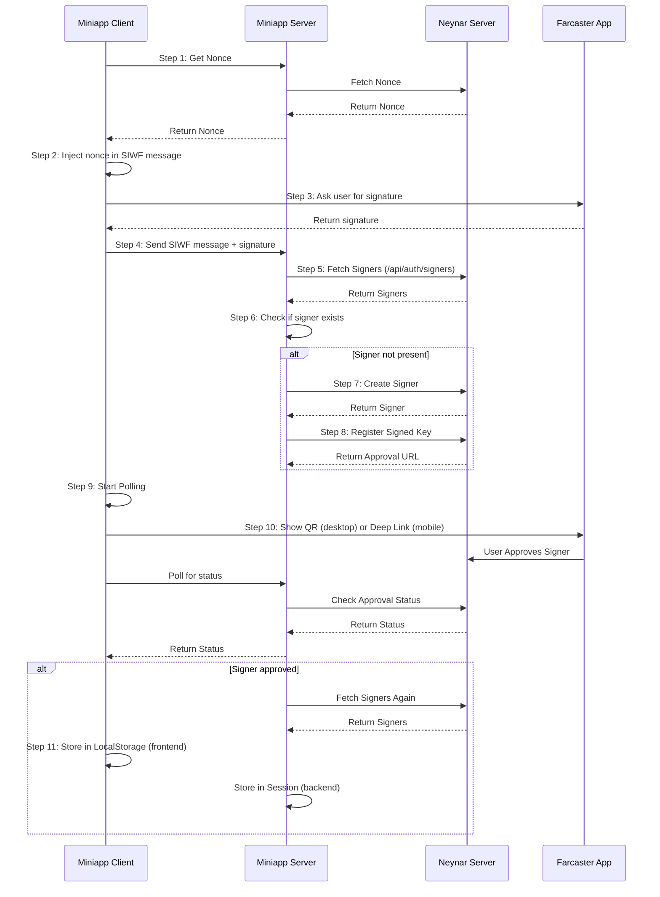

# Add a Verification
Source: https://docs.neynar.com/docs/add-a-verification

Walkthrough on how to add an ethereum or solana address as a verification to a user's farcaster profile

<Tip>
  * If you want to integrate Farcaster auth for your users, easiest way to start is [Sign in with Neynar](/docs/how-to-let-users-connect-farcaster-accounts-with-write-access-for-free-using-sign-in-with-neynar-siwn) (Neynar pays all onchain fee)
  * If you want dedicated signers for your user or bot, simplest to clone this [example app](https://github.com/neynarxyz/farcaster-examples/tree/main/managed-signers) for quickstart
</Tip>

This guide demonstrates adding an Ethereum address verification with the Neynar SDK.

Check out this [Getting Started Guide](/docs/getting-started-with-neynar) to learn how to set up your environment and get an API key.

First, initialize the client:

<CodeGroup>
  ```javascript Javascript
  // npm i @neynar/nodejs-sdk
  import { NeynarAPIClient, Configuration } from "@neynar/nodejs-sdk";

  // make sure to set your NEYNAR_API_KEY .env
  // don't have an API key yet? get one at neynar.com
  const config = new Configuration({
    apiKey:process.env.NEYNAR_API_KEY,
  });

  const client = new NeynarAPIClient(config);
  const signer = process.env.NEYNAR_SIGNER;
  ```
</CodeGroup>

Then like a cast:

<CodeGroup>
  ```javascript Javascript
  const hash = "0x6932a9256f34e18892d498abb6d00ccf9f1c50d6";
  client.publishReaction({ signerUuid: signer, reactionType: "like", target:hash });
  ```
</CodeGroup>

Recasting works the same way, just replace "like" with "recast":

<CodeGroup>
  ```javascript Javascript
  const hash = "0x6932a9256f34e18892d498abb6d00ccf9f1c50d6";
  client.publishReaction({ signerUuid: signer, reactionType: "like", target:hash });
  ```
</CodeGroup>

The end result should look like this:

<CodeGroup>
  ```javascript Javascript
  {
    success: true;
  }
  ```
</CodeGroup>

To verify that the reaction was published, you can fetch the cast's reactions:

<CodeGroup>
  ```javascript Javascript
  const types = ReactionsType.All;
  const reactions = await client.fetchCastReactions({ hash, types: [types] });
  console.log(reactions);
  ```
</CodeGroup>

Which would print out

```json
{
  "result": {
    "casts": [
      {
        "type": "like",
        "hash": "0x691fabb3fc58bd4022d4358b2bc4f44469ad959a",
        "reactor": {
          "fid": "4640",
          "username": "picture",
          "displayName": "Picture",
          "pfp": {
            "url": "https://lh3.googleusercontent.com/erYudyT5dg9E_esk8I1kqB4bUJjWAmlNu4VRnv9iUuq_by7QjoDtZzj_mjPqel4NYQnvqYr1R54m9Oxp9moHQkierpY8KcYLxyIJ"
          },
          "followerCount": "45",
          "followingCount": "57"
        },
        "timestamp": "2023-12-10T15:26:45.000Z",
        "castHash": "0x6932a9256f34e18892d498abb6d00ccf9f1c50d6"
      }
    ],
    "next": {
      "cursor": null
    }
  }
}
```

That's it! You can now like or recast any cast on Farcaster.

PS - to learn more about how writes technically work on Farcaster, read [Write to Farcaster with Neynar Managed Signers](/docs/write-to-farcaster-with-neynar-managed-signers)

<Info>
  ### Ready to start building?

  Get your subscription at [neynar.com](https://neynar.com) and reach out to us on [Slack](https://neynar.com/slack) with any questions!
</Info>


# Address User Score Contract
Source: https://docs.neynar.com/docs/address-user-score-contract

Get user quality score for an address connected to a Farcaster profile.

<Info>
  Read prior context on user scores in [Neynar User Quality Score](/docs/neynar-user-quality-score)
</Info>

User scores are particularly useful if anonymous addresses are interacting with your contract and you want to restrict interaction to high quality addresses. Neynar already supports user quality scores offchain (read more in [Neynar User Quality Score](/docs/neynar-user-quality-score)), this brings them onchain and makes it available to smart contracts. Now, on the Base Mainnet and Sepolia testnet, smart contracts can query the fid linked to any ETH address and the quality score for that FID.

## Contract

| **Chain**    | **Address**                                | **Deploy Transaction**                                             |
| ------------ | ------------------------------------------ | ------------------------------------------------------------------ |
| Base Mainnet | 0xd3C43A38D1D3E47E9c420a733e439B03FAAdebA8 | 0x059259c15f660a4b5bd10695b037692654415f60e13569c7a06e99cfd55a54b0 |
| Base Sepolia | 0x7104CFfdf6A1C9ceF66cA0092c37542821C1EA50 | 0xfdf68b600f75b4688e5432442f266cb291b9ddfe2ec05d2fb8c7c64364cf2c73 |

* Read the Proxy Contract on the Base Explorer ([link](https://basescan.org/address/0xd3C43A38D1D3E47E9c420a733e439B03FAAdebA8#readProxyContract)). This is the upgradeable proxy contract you should use.
* User score code on the Base Explorer ([link](https://basescan.org/address/0xd3C43A38D1D3E47E9c420a733e439B03FAAdebA8#code)). This is an upgradeable implementation contract. There is no state here. This is the code that the proxy contract is currently using.

## Interface

<CodeGroup>
  ```solidity Solidity
  // SPDX-License-Identifier: MIT
  pragma solidity ^0.8.26;

  interface INeynarUserScoresReader {
      function getScore(address verifier) external view returns (uint24 score);
      function getScoreWithEvent(address verifier) external returns (uint24 score);
      function getScores(address[] calldata verifiers) external view returns (uint24[] memory scores);

      function getScore(uint256 fid) external view returns (uint24 score);
      function getScoreWithEvent(uint256 fid) external returns (uint24 score);
      function getScores(uint256[] calldata fids) external view returns (uint24[] memory scores);
  }
  ```
</CodeGroup>

If the `getScore` call returns `0`there is no user score for that address.

If you can spare the gas and would like us to know that you are using our contract, please use `getScoreWithEvent`.

## Sample use

A simple example of a HelloWorld contract:

<CodeGroup>
  ```solidity Solidity
  // SPDX-License-Identifier: MIT
  pragma solidity ^0.8.26;

  interface INeynarUserScoresReader {
      function getScore(address verifier) external view returns (uint24 score);
      function getScoreWithEvent(address verifier) external returns (uint24 score);
      function getScores(address[] calldata verifiers) external view returns (uint24[] memory scores);

      function getScore(uint256 fid) external view returns (uint24 score);
      function getScoreWithEvent(uint256 fid) external returns (uint24 score);
      function getScores(uint256[] calldata fids) external view returns (uint24[] memory scores);
  }

  contract HelloWorld {
      INeynarUserScoresReader immutable verifications;

      constructor(INeynarUserScoresReader _userScores) {
         userScores = _userScores;
      }

      function requireHighScore() public view returns (uint256) {
          uint256 score = userScores.getScoreWithEvent(msg.sender);

          if (score < 950000) {
              revert("!top 5% percentile account");
          }

          return score;
      }
  }
  ```
</CodeGroup>

## Future

This experiment will see what we can unlock by bringing more Farcaster data on-chain. If you build something using this, please [reach out](https://neynar.com/slack). We want to hear what you're building and see how we can make it easier.

## Further reading

<CardGroup>
  <Card title="Sybil resistance using Neynar user quality score" href="/docs/neynar-user-quality-score" icon="angle-right" iconType="solid" horizontal />

  <Card title="Addresses ↔ Farcaster FIDs onchain" href="/docs/verifications-contract" icon="angle-right" iconType="solid" horizontal />
</CardGroup>


# Create Farcaster Frames Using Neynar & Frog
Source: https://docs.neynar.com/docs/analytics-frame-neynar-frog

In this guide, we’ll learn how to make a frame with the neynar SDK and Frog.fm, within a few minutes! For this demo, it will be a simple rock-paper-scissors game but it will give you an idea of how to create multi-page frames, interact with buttons, and get analytics for your frame with no extra effort.

Before we begin, you can access the [complete source code](https://github.com/avneesh0612/rps-frames) for this guide on GitHub.

Let's get started!

## Creating a new frames project

We will use vercel and [frog](https://frog.fm/) for building the frame in this guide, but feel free to use anything else as well!

Enter this command in your terminal to create a new app:

<CodeGroup>
  ```powershell PowerShell
  bunx create-frog -t vercel
  ```
</CodeGroup>

Enter a name for your project and it will spin up a new project for you. Once the project is created install the dependencies:

<CodeGroup>
  ```powershell PowerShell
  cd <project_name>
  bun install
  ```
</CodeGroup>

### Creating the frame home page

Head over to the `api/index.ts` file. Here, you'll see a starter frame on the / route. But first, let's change the Frog configuration to use `/api` as the base path and use neynar for hubs like this:

<CodeGroup>
  ```typescript index.tsx
  export const app = new Frog({
    assetsPath: "/",
    basePath: "/api",
    hub: neynar({ apiKey: 'NEYNAR_FROG_FM' })
  });
  ```
</CodeGroup>

<Info>
  ### Make sure to update the API key to your API key to get analytics
</Info>

You also need to import neynar from "frog/hubs":

<CodeGroup>
  ```typescript index.tsx
  import { neynar } from "frog/hubs";
  ```
</CodeGroup>

Now, change the frame on the `/` route to match this:

<CodeGroup>
  ```typescript index.tsx

  app.frame("/", (c) => {
    return c.res({
      action: "/result",
      image: (
        <div
          style={{
            alignItems: "center",
            background: "black",
            backgroundSize: "100% 100%",
            display: "flex",
            flexDirection: "column",
            flexWrap: "nowrap",
            height: "100%",
            justifyContent: "center",
            textAlign: "center",
            width: "100%",
          }}
        >
          <div
            style={{
              color: "white",
              fontSize: 60,
              fontStyle: "normal",
              letterSpacing: "-0.025em",
              lineHeight: 1.4,
              marginTop: 30,
              padding: "0 120px",
              whiteSpace: "pre-wrap",
            }}
          >
            Choose your weapon
          </div>
        </div>
      ),
      intents: [
        <Button value="rock">Rock</Button>,
        <Button value="paper">Paper</Button>,
        <Button value="scissors">Scissors</Button>,
      ],
    });
  });
  ```
</CodeGroup>

This will render an image saying choose your weapon and three buttons saying rock paper and scissors. When any of these buttons are clicked a request to the `/result` route is made which we define in the `action` parameter.

<Frame>
  
</Frame>

<Info>
  ### Make sure that you sign in using your warpcast account, so that the requests can be validated
</Info>

Now, let's build the `/result` route like this:

<CodeGroup>
  ```typescript index.tsx
  app.frame("/result", (c) => {
    const rand = Math.floor(Math.random() * 3);
    const choices = ["rock", "paper", "scissors"];
    const userChoice = choices[(c.buttonIndex || 1) - 1];
    const computerChoice = choices[rand];
    let msg = "";

    if (userChoice === computerChoice) {
      msg = "draw";
    }

    if (
      (userChoice === "rock" && computerChoice === "scissors") ||
      (userChoice === "paper" && computerChoice === "rock") ||
      (userChoice === "scissors" && computerChoice === "paper")
    ) {
      msg = "You win";
    }

    if (
      (userChoice === "rock" && computerChoice === "paper") ||
      (userChoice === "paper" && computerChoice === "scissors") ||
      (userChoice === "scissors" && computerChoice === "rock")
    ) {
      msg = "You lose";
    }

    return c.res({
      image: (
        <div
          style={{
            alignItems: "center",
            background: "black",
            backgroundSize: "100% 100%",
            display: "flex",
            flexDirection: "column",
            flexWrap: "nowrap",
            height: "100%",
            justifyContent: "center",
            textAlign: "center",
            width: "100%",
          }}
        >
          <div
            style={{
              color: "white",
              fontSize: 60,
              fontStyle: "normal",
              letterSpacing: "-0.025em",
              lineHeight: 1.4,
              marginTop: 30,
              padding: "0 120px",
              whiteSpace: "pre-wrap",
              display: "flex",
            }}
          >
            {userChoice} vs {computerChoice}
          </div>

          <div
            style={{
              color: "white",
              fontSize: 60,
              fontStyle: "normal",
              letterSpacing: "-0.025em",
              lineHeight: 1.4,
              marginTop: 30,
              padding: "0 120px",
              whiteSpace: "pre-wrap",
            }}
          >
            {msg}
          </div>
        </div>
      ),
      intents: [<Button action="/">Play again</Button>],
    });
  });
  ```
</CodeGroup>

Here, we first get the button index from the request and use it to get the user's choice. We have then added some logic for generating a random choice for the game. Then, in the image we display the two choices and the result of the game. We have also added a play again game which simply pushes the user to the `/` route.

<Frame>
  
</Frame>

## Analytics

Since we are using neynar hub with Frog, we also get analytics out of the box. Head over to the usage tab and click on the frame that you are currently using. It will provide you with various analytics like total interactors, interactions per cast, etc.

<Frame>
  
</Frame>

## Deployment

You can deploy your frame using the [vercel CLI](https://vercel.com/docs/cli) like this:

<CodeGroup>
  ```powershell PowerShell
  bun run deploy
  ```
</CodeGroup>

Alternatively, you can also create a new GitHub repository and sync your vercel deployments.

## Conclusion

This guide taught us how to create a rock-paper-scissors game on Farcaster frames! If you want to look at the completed code, check out the [GitHub repository](https://github.com/avneesh0612/rps-frames).

Lastly, make sure to sure what you built with us on Farcaster by tagging [@neynar](https://warpcast.com/neynar) and if you have any questions, reach out to us on [warpcast](https://warpcast.com/~/channel/neynar) or [Slack](https://neynar.com/slack)!


# Mini App Hosts Notifications
Source: https://docs.neynar.com/docs/app-host-notifications

Token management and inbound webhook handling for apps that host mini apps

## Overview

Farcaster client applications can host mini apps.  Allowing those mini apps to push notifications to users requires the host to generate user notifcation tokens, send signed messages to the mini-apps webhook, and accept notifications via webhook.  Neynar provides a system to manage this complexity on behalf of the client app (mini app host).

## Basic flow

In the following example we'll imagine

* "Hostcaster" - a Farcaster client that wants to support mini apps
* "Cowclicker" - a mini app

### Enabling Notfications

1. User wants to enable notifications for Cowclicker
2. Hostcaster posts a "notifications\_enabled" event to Neynar
3. Neynar generates a unique token, bundles it in a signed message, and posts it to Clowclicker's webhook URL

### Sending Notifications

1. Cowclicker wants to send a notification to a Hostcaster user for whom they have a valid notification token
2. Cowclicker sends the notification event to Neynar's webhook including the token
3. Neynar validates the token, hydrates some data, and queues the notification for Hostcaster
4. Hostcaster listens to a Kafka topic and/or polls an API for a user's notifications

## Message signing

An event sent to a mini-app webhook must be a signed JFS messages.  There are two supported signing approaches in this system.  Hostcaster can sign the message with a user's key if they have the ability to do so.  Or, if Hostcaster instead uses the Neynar-hosted signer system then they can provide their signer\_uuid when posting the unsigned event.

### Neynar-signed route

This approach requires only one API request:

1. [POST /v2/farcaster/app\_host/user/event](/reference/app-host-post-event) with a valid signer\_uuid and the required event data

<CodeGroup>
  ```bash cURL
  curl --request POST \
    --url https://api.neynar.com/v2/farcaster/app_host/user/event \
    --header 'Content-Type: application/json' \
    --header 'x-api-key: YOUR_KEY' \
    --data '{
    "signer_uuid": "01973000-b000-ee00-e0e0-0ee0e00e00ee",
    "app_domain": "cowclicker.gov",
    "fid": 10101,
    "event": "notifications_enabled"
  }'
  ```
</CodeGroup>

### Self-sign route

1. [GET /v2/farcaster/app\_host/user/event](/reference/app-host-get-event) to retrieve the message to be signed.  This is particularly important for `notification_enabled` events because this is when a notification token is generated by Neynar
2. Sign the message, serialize the entire bundle per JFS spec
3. [POST /v2/farcaster/app\_host/user/event](/reference/app-host-post-event) with the signed message

<CodeGroup>
  ```bash cURL
  curl --request GET \
    --url 'https://api.neynar.com/v2/farcaster/app_host/user/event?app_domain=cowclicker.gov&fid=10101&event=notifications_enabled' \
    --header 'x-api-key: YOUR_KEY'
  ```
</CodeGroup>

...Sign and serialize the message...

<CodeGroup>
  ```bash cURL
  curl --request POST \
    --url https://api.neynar.com/v2/farcaster/app_host/user/event \
    --header 'Content-Type: application/json' \
    --header 'x-api-key: YOUR_KEY' \
    --data '{
    "app_domain": "cowclicker.gov",
    "signed_message": "eyJmaWZXkifQ==.eyJleI1Mjd9.nx1CPzKje4N2Bw===="
  }'
  ```
</CodeGroup>

## Notifications via Kafka

To access your stream of notifications from a Kafka queue you'll need to work with a Neynar representative to obtain the necessary credentials.
You will be granted access to a Kafka topic with a name like `app_host_notifications_Your_App_Name` which contains a message for each notification.
If an app sends the same message to 100 users, you will see 100 messages in Kafka similar to the example below.

Sample message:

<CodeGroup>
  ```json JSON
  {
      "notification": {
          "notification_id": "rate-test-1755216706-10",
          "title": "Sample Notification Test 10",
          "body": "This is notification message body",
          "target_url": "https://test.com/notification/10"
      },
      "app_domain": "demo.neynar.com",
      "notification_neynar_id": "0198ab11-7c61-xxxx-xxxx-0affb68fda66",
      "fid": "18949",
      "timestamp": "2025-08-15T00:11:46.657Z",
      "app": {
          "name": "Wownar",
          "icon_url": "https://demo.neynar.com/logos/neynar.svg"
      }
  }
  ```
</CodeGroup>

## Further Reading

* [Sending Notifications](https://miniapps.farcaster.xyz/docs/guides/notifications#send-a-notification) from the Farcaster mini app guide
* [JSON Farcaster Signatures](https://github.com/farcasterxyz/protocol/discussions/208)


# Appendix
Source: https://docs.neynar.com/docs/appendix

Understanding the new user registration process

Neynar simplifies the account creation process on Farcaster by pre-registering several new accounts and securely storing their credentials in a database. For detailed instructions on how to register or create an account on Farcaster, please refer to the [Farcaster account creation guide.](https://docs.farcaster.xyz/developers/guides/accounts/create-account#create-an-account)

When a developer requests a new account—Step 1—Neynar provides the FID (Farcaster ID) of a pre-registered account to the developer.

To transfer the pre-registered account to the end user, a specific process must be followed. This approach is chosen because Neynar does not store or manage the end user's account mnemonic for security reasons.

The developer is required to generate a signature using the FID of the pre-registered account and the custody address of the end user. This can be achieved by utilizing the `signTransfer` method described in the script—Step 2.

Upon making a `POST - /v2/farcaster/user` request, two significant actions are initiated:

1. **Fname Transfer**

   * This step is executed only when the fname is included in the request body. Developers have the option to collect the fname from the user during account creation.
   * If the developer decides not to collect the fname initially, the transfer can be conducted at a later stage. For more information, consult the [guide on fname transfer](https://docs.farcaster.xyz/reference/fname/api#register-or-transfer-an-fname)

2. **Account transfer**
   * This step outlines the procedure for transferring the account to the end user. Detailed guidance on account transfer can be found in the [Farcaster account transfer documentation.](https://docs.farcaster.xyz/reference/contracts/reference/id-registry#transferfor)


# Archive Casts
Source: https://docs.neynar.com/docs/archiving-casts-with-neynar

Archiving Farcaster data with Neynar

Casts in the Farcaster protocol are pruned when user runs out of storage. This guide demonstrates how to archive casts of a specific FID with the Neynar SDK.

Check out this [Getting started guide](/docs/getting-started-with-neynar) to learn how to set up your environment and get an API key.

Check out this [example repository](https://github.com/neynarxyz/farcaster-examples/tree/main/archiver-script) to see the code in action.

First, initialize the client:

<CodeGroup>
  ```javascript Javascript
  // npm i @neynar/nodejs-sdk
  import { NeynarAPIClient, Configuration } from "@neynar/nodejs-sdk";

  // make sure to set your NEYNAR_API_KEY .env
  // don't have an API key yet? get one at neynar.com
  const config = new Configuration({
    apiKey:process.env.NEYNAR_API_KEY,
  });

  const client = new NeynarAPIClient(config);
  ```
</CodeGroup>

Next, let's make a function to clean the incoming casts:

<CodeGroup>
  ```javascript Javascript
  const parser = (cast) => {
    return {
      fid: parseInt(cast.author.fid),
      parentFid: parseInt(cast.parentAuthor.fid)
        ? parseInt(cast.parentAuthor.fid)
        : undefined,
      hash: cast.hash || undefined,
      threadHash: cast.threadHash || undefined,
      parentHash: cast.parentHash || undefined,
      parentUrl: cast.parentUrl || undefined,
      text: cast.text || undefined,
    };
  };
  ```
</CodeGroup>

Then, the function to archive the casts:

<CodeGroup>
  ```javascript Javascript
  const dumpCast = (cast) => {
    const parsed = parser(cast);
    const data = `${JSON.stringify(parsed)}\n`;
    fs.appendFileSync("data.ndjson", data);
  };
  ```
</CodeGroup>

Finally, let's fetch the casts and archive them:

<CodeGroup>
  ```javascript Javascript
  const fetchAndDump = async (fid, cursor) => {
    const data = await client.fetchCastsForUser({fid,
      limit: 150,
       ...(cursor && cursor.trim() !== "" ? { cursor } : {}),
    });
    data.result.casts.map(dumpCast);

    // If there is no next cursor, we are done
    if (data.result.next.cursor === null) return;
    await fetchAndDump(fid, data.result.next.cursor);
  };

  // archive all @rish.eth's casts in a file called data.ndjson
  const fid = 194;
  fetchAndDump(fid);
  ```
</CodeGroup>

Result: a file called `data.ndjson` with all the casts of the user with FID 194.

It looks something like this:

<CodeGroup>
  ```json JSON
  {"fid":194,"parentFid":3,"hash":"0x544421c091f5af9d1610de0ae223b52602dd631e","threadHash":"0xb0758588c9412f72efe7e703e9d0cb5f2d0a6cfd","parentHash":"0xb0758588c9412f72efe7e703e9d0cb5f2d0a6cfd","text":"that order is pretty key"}
  {"fid":194,"parentFid":194,"hash":"0x98f52d36161f3d0c8dee6e242936c431face35f0","threadHash":"0x5727a985687c10b6a37e9439b2b7a3ce141c6237","parentHash":"0xcb6cab80cc7d7a2ca957d1c95c9a3459f9e3a9dc","text":"turns out not an email spam issue 😮‍💨, email typo :)"}
  {"fid":194,"parentFid":20071,"hash":"0xcb6cab80cc7d7a2ca957d1c95c9a3459f9e3a9dc","threadHash":"0x5727a985687c10b6a37e9439b2b7a3ce141c6237","parentHash":"0xf34c18b87f8eaca2cb72131a0c0429a48b66ef52","text":"hmm interesting. our system shows the email as sent. Maybe we're getting marked as spam now? 🤦🏽‍♂️\n\nLet me DM you on telegram"}
  {"fid":194,"parentFid":20071,"hash":"0x62c484064c9ca1177f8addb56bdaffdbede97a29","threadHash":"0x5727a985687c10b6a37e9439b2b7a3ce141c6237","parentHash":"0x7af582a591575acc474fa1f8c52a2a03258986b9","text":"are you still waiting on this? you should have gotten the email within the first minute. we automated this last week so there's no wait anymore. lmk if you're still having issues :)"}
  {"fid":194,"parentFid":3,"hash":"0xbc63b955c40ace8aca4b1608115fd12f643395b1","threadHash":"0x5727a985687c10b6a37e9439b2b7a3ce141c6237","parentHash":"0x5727a985687c10b6a37e9439b2b7a3ce141c6237","text":"@bountybot adding 150 USDC to this bounty \n\nfor anyone building on this, please reach out with any questions. We've always wanted to do this but haven't been able to prioritize. Think this can be quite impactful! :)"}
  ```
</CodeGroup>

That's it! You now can save that in S3 or IPFS for long-term archival!

<Info>
  ### Ready to start building?

  Get your subscription at [neynar.com](https://neynar.com) and reach out to us on [Slack](https://neynar.com/slack) with any questions!
</Info>


# Auth Address Signature Generation
Source: https://docs.neynar.com/docs/auth-address-signature-generation

Generate a Signed Key Request using viem for registering auth addresses in Farcaster with Neynar

This guide walks you through generating a Signed Key Request using [viem](https://viem.sh/)
that need to be passed in while [registering auth address](https://docs.neynar.com/reference/register-signed-key-for-developer-managed-auth-address)

## System & Installation Requirements

### Prerequisites

* Node.js >= **18.x** (LTS recommended)
* npm >= **9.x** OR yarn >= **1.22.x**

[Download and install node (if not installed)](https://nodejs.org/en/download)

### Initialize project (optional)

```bash
mkdir signed-key-request
cd signed-key-request
npm init -y
```

### Install `viem`

```bash
npm install viem
```

OR with yarn:

```bash
yarn add viem
```

***

## Code Breakdown and Steps

**You can find full code at the [end of this guide](#full-final-code).**

<Steps>
  <Step title="Import the required functions">
    The code starts by importing the necessary libraries:

    <CodeGroup>
      ```javascript Javascript
      import { encodeAbiParameters } from "viem";
      import { mnemonicToAccount, generateMnemonic, english } from "viem/accounts";
      ```
    </CodeGroup>
  </Step>

  <Step title="Generate a random mnemonic and derive the auth address">
    Generates a mnemonic and converts it to an Ethereum address (`auth_address`)

    <CodeGroup>
      ```javascript Javascript
      const mnemonic = generateMnemonic(english);
      const auth_address_acc = mnemonicToAccount(mnemonic);
      const auth_address = auth_address_acc.address;
      ```
    </CodeGroup>
  </Step>

  <Step title="Define EIP-712 domain">
    Describes the EIP-712 domain (context of signature).

    <CodeGroup>
      ```javascript Javascript
      const SIGNED_KEY_REQUEST_VALIDATOR_EIP_712_DOMAIN = {
        name: "Farcaster SignedKeyRequestValidator",
        version: "1",
        chainId: 10,
        verifyingContract: "0x00000000fc700472606ed4fa22623acf62c60553",
      };
      ```
    </CodeGroup>
  </Step>

  <Step title="Define the EIP-712 message structure">
    Defines the structure of the message to be signed.

    <CodeGroup>
      ```javascript Javascript
      const SIGNED_KEY_REQUEST_TYPE = [
        { name: "requestFid", type: "uint256" },
        { name: "key", type: "bytes" },
        { name: "deadline", type: "uint256" },
      ];
      ```
    </CodeGroup>
  </Step>

  <Step title="Encode the auth_address">
    Encodes `auth_address` as **32 bytes**.

    <CodeGroup>
      ```javascript Javascript
      const key = encodeAbiParameters(
        [{ name: "auth_address", type: "address" }],
        [auth_address]
      );
      ```
    </CodeGroup>
  </Step>

  <Step title="App details">
    Replace `"MNEMONIC_HERE"` with your app mnemonic phrase and fid with your app's fid.

    <CodeGroup>
      ```javascript Javascript
      const fid = 0;
      const account = mnemonicToAccount("MNEMONIC_HERE");
      ```
    </CodeGroup>
  </Step>

  <Step title="Define a deadline">
    Sets a 24-hour expiration time.

    <CodeGroup>
      ```javascript Javascript
      const deadline = Math.floor(Date.now() / 1000) + 86400;
      ```
    </CodeGroup>
  </Step>

  <Step title="Sign the EIP-712 message">
    Signs the message per EIP-712 standard.

    <CodeGroup>
      ```javascript Javascript
      const signature = await account.signTypedData({
        domain: SIGNED_KEY_REQUEST_VALIDATOR_EIP_712_DOMAIN,
        types: {
          SignedKeyRequest: SIGNED_KEY_REQUEST_TYPE,
        },
        primaryType: "SignedKeyRequest",
        message: {
          requestFid: BigInt(fid),
          key,
          deadline: BigInt(deadline),
        },
      });
      ```
    </CodeGroup>
  </Step>

  <Step title="Create a sponsor signature">
    If you want to sponsor the auth address, you can sign the EIP-712 signature again with a basic Ethereum signature.
    [This route](https://docs.neynar.com/reference/register-signed-key-for-developer-managed-auth-address) needs to be sponsored if not provided then neynar will sponsor it for you and you will be charged in compute units.

    <CodeGroup>
      ```javascript Javascript
      const sponsorSignature = await account.signMessage({
        message: { raw: signature },
      });
      ```
    </CodeGroup>
  </Step>

  <Step title="Print output">
    Prints useful values for further use.

    <CodeGroup>
      ```javascript Javascript
      console.log("auth_address", auth_address);
      console.log("app_fid", fid);
      console.log("signature", signature);
      console.log("deadline", deadline);
      console.log("sponsor.signature", sponsorSignature);
      console.log("sponsor.fid", fid);
      ```
    </CodeGroup>
  </Step>

  <Step title="Run the code">
    Save the code in a file, e.g., `generateSignedKeyRequest.js`, and run it using Node.js:

    <CodeGroup>
      ```bash Bash
      node generateSignedKeyRequest.js
      ```
    </CodeGroup>
  </Step>

  <Step title="cURL">
    Use the generated values to make a cURL request to register the auth address.
    Replace `<api-key>` with your actual API key and `<string>` with your redirect URL(if needed).

    <CodeGroup>
      ```bash Bash
      curl --request POST \
         --url https://api.neynar.com/v2/farcaster/auth_address/developer_managed/signed_key/ \
         --header 'Content-Type: application/json' \
         --header 'x-api-key: <api-key>' \
         --data '{
         "address": "0x5a927ac639636e534b678e81768ca19e2c6280b7",
         "app_fid": 3,
         "deadline": 123,
         "signature": "0x16161933625ac90b7201625bfea0d816de0449ea1802d97a38c53eef3c9c0c424fefbc5c6fb5eabe3d4f161a36d18cda585cff7e77c677c5d34a9c87e68ede011c",
         "redirect_url": "<string>",
         "sponsor": {
           "fid": 3,
           "signature": "<string>",
           "sponsored_by_neynar": true
         }
       }'
      ```
    </CodeGroup>
  </Step>
</Steps>

***

## Full Final Code

<CodeGroup>
  ```javascript Javascript

    import { encodeAbiParameters } from "viem";
    import { mnemonicToAccount, generateMnemonic, english } from "viem/accounts";

    (async () => {
      const mnemonic = generateMnemonic(english);
      const auth_address_acc = mnemonicToAccount(mnemonic);
      const auth_address = auth_address_acc.address;

      const SIGNED_KEY_REQUEST_VALIDATOR_EIP_712_DOMAIN = {
        name: "Farcaster SignedKeyRequestValidator",
        version: "1",
        chainId: 10,
        verifyingContract: "0x00000000fc700472606ed4fa22623acf62c60553",
      };

      const SIGNED_KEY_REQUEST_TYPE = [
        { name: "requestFid", type: "uint256" },
        { name: "key", type: "bytes" },
        { name: "deadline", type: "uint256" },
      ];

      const key = encodeAbiParameters(
        [{ name: "auth_address", type: "address" }],
        [auth_address]
      );

      const fid = 0;
      const account = mnemonicToAccount("MNEMONIC_HERE");

      const deadline = Math.floor(Date.now() / 1000) + 86400;

      const signature = await account.signTypedData({
        domain: SIGNED_KEY_REQUEST_VALIDATOR_EIP_712_DOMAIN,
        types: {
          SignedKeyRequest: SIGNED_KEY_REQUEST_TYPE,
        },
        primaryType: "SignedKeyRequest",
        message: {
          requestFid: BigInt(fid),
          key,
          deadline: BigInt(deadline),
        },
      });

      const sponsorSignature = await account.signMessage({
        message: { raw: signature },
      });

      console.log("auth_address", auth_address);
      console.log("app_fid", fid);
      console.log("signature", signature);
      console.log("deadline", deadline);
      console.log("sponsor.signature", sponsorSignature);
      console.log("sponsor.fid", fid);
    })();

  ```
</CodeGroup>

***

Enjoy building! 🚀

For additional help, [feel free to contact us](https://neynar.com/slack).


# Build Interactive Farcaster Frames with Neynar
Source: https://docs.neynar.com/docs/building-frames

Learn how to build interactive Farcaster frames 100x faster using Neynar's Frame Studio, no-code templates, and comprehensive Frame APIs. Create dynamic social experiences with validation, hosting, and embedding capabilities.

Neynar supports building frames in a few different ways:

* [Neynar Frame Studio](https://neynar.com/nfs): allows building frames with no code and pre-made templates

* Frame APIs:

  * [Validating frame actions](/reference/validate-frame-action), user and cast data in one API call
  * [CRUD](/reference/publish-neynar-frame) for hosted frames
  * Embedding frames in your client and [posting actions](/reference/post-frame-action)

## Neynar Frame architecture

### Pages for a frame

A page represents the most basic unit of a frame. A frame consists of one or more pages.

We've thoughtfully crafted a JSON format for a frames' page to abstract away building on the rapidly moving foundation of Farcaster Frames. *For context, Frames were launched a few weeks before writing this and have already seen 3-to 4 spec upgrades. We don't want Neynar developers to have to worry about handling those.*

Here's an example of a single page with four buttons. You can create these in the Frame Studio with no code or quickly create frames using our REST APIs.

<CodeGroup>
  ```Text JSON
  {
    "uuid": "5ec484f5-efaf-4bda-9a3f-0579232a386a",
    "image": "https://i.imgur.com/gpn83Gm.png",
    "title": "Farcaster Dev Call",
    "buttons": [
      {
        "title": "Notes",
        "next_page": {
          "redirect_url": "https://warpcast.notion.site/Feb-1st-934e190578144aba8273b2bbdc29e5ab"
        },
        "action_type": "post_redirect"
      },
      {
        "title": "Calendar",
        "next_page": {
          "redirect_url": "https://calendar.google.com/calendar/u/0/r?cid=NjA5ZWM4Y2IwMmZiMWM2ZDYyMTkzNWM1YWNkZTRlNWExN2YxOWQ2NDU3NTA3MjQwMTk3YmJlZGFjYTQ3MjZlOEBncm91cC5jYWxlbmRhci5nb29nbGUuY29t"
        },
        "action_type": "post_redirect"
      },
      {
        "title": "Zoom",
        "next_page": {
          "redirect_url": "https://zoom.us/j/98052336425?pwd=aFYyRk9ZSDhqR1h5eVJENmtGSGo4UT09#success"
        },
        "action_type": "post_redirect"
      },
      {
        "title": "Recordings",
        "next_page": {
          "redirect_url": "https://www.youtube.com/playlist?list=PL0eq1PLf6eUeZnPtyKMS6uN9I5iRIlnvq"
        },
        "action_type": "post_redirect"
      }
    ],
    "version": "vNext"
  }
  ```
</CodeGroup>

## Hosting

Neynar hosts pages on behalf of developers. We convert this JSON format into the Metatags expected by the [Farcaster Frames Specification](https://warpcast.notion.site/Farcaster-Frames-4bd47fe97dc74a42a48d3a234636d8c5).

If you have questions/feedback, please reach out to [@rish](https://warpcast.com/rish)or [@manan](https://warpcast.com/manan) on Farcaster. We will continue improving the frames experience! <Icon icon="planet-ringed" iconType="solid" />


# Cast Action with Analytics
Source: https://docs.neynar.com/docs/cast-action-with-analytics-neynar

In this guide, we’ll make a cast action with the neynar SDK and frog.fm, within a few minutes! The cast action will fetch the follower count of the cast's author using its fid and display it.

## Cast Action

We'll also validate the requests using Neynar's frame validator which provides analytics as well!

Before we begin, you can access the [complete source code](https://github.com/neynarxyz/farcaster-examples/tree/main/cast-action) for this guide on GitHub.

Let's get started!

### Creating a new frames project

We will use [bun](https://bun.sh/) and [frog](https://frog.fm/) for building the cast action in this guide, but feel free to use [framejs](https://framesjs.org/), [onchainkit](https://onchainkit.xyz/), or anything else as well!

Enter this command in your terminal to create a new app:

<CodeGroup>
  ```powershell PowerShell
  bunx create-frog -t bun
  ```
</CodeGroup>

Enter a name for your project and it will spin up a new project for you. Once the project is created install the dependencies:

<CodeGroup>
  ```powershell PowerShell
  cd <project_name>
  bun install
  ```
</CodeGroup>

Now, let's install the dependencies that we are going to need to build out this action:

<CodeGroup>
  ```powershell PowerShell
  bun add @neynar/nodejs-sdk dotenv
  ```
</CodeGroup>

#### Creating the cast action route

Head over to the `src/index.ts` file. Here, you'll be able to see a starter frame on the / route. But first, let's change the Frog configuration to use `/api` as the base path and use neynar for hubs like this:

<CodeGroup>
  ```typescript index.tsx
  export const app = new Frog({
    hub: neynar({ apiKey: "NEYNAR_FROG_FM" }),
    basePath: "/api",
  });
  ```
</CodeGroup>

You also might need to import neynar from "frog/hubs":

<CodeGroup>
  ```typescript index.tsx
  import { neynar } from "frog/hubs";
  ```
</CodeGroup>

Now, we'll create a new post route which will handle our cast actions. So, create a new route like this:

<CodeGroup>
  ```typescript index.tsx
  app.hono.post("/followers", async (c) => {
    try {
      let message = "GM";
      return c.json({ message });
    } catch (error) {
      console.error(error);
    }
  });
  ```
</CodeGroup>

This route will return a GM message every time the action is clicked, but let's now use the neynar SDK to get the follower count of the cast's author!

Create a new `src/lib/neynarClient.ts` file and add the following:

<CodeGroup>
  ```typescript neynarClient.ts
  import { NeynarAPIClient, Configuration } from "@neynar/nodejs-sdk";
  import { config } from "dotenv";
  config();

  if (!process.env.NEYNAR_API_KEY) {
    throw new Error("Make sure you set NEYNAR_API_KEY in your .env file");
  }
  // make sure to set your NEYNAR_API_KEY .env
  // don't have an API key yet? get one at neynar.com
  const configuration = new Configuration({
    apiKey: process.env.NEYNAR_API_KEY,
  });

  const neynarClient = new NeynarAPIClient(configuration);

  export default neynarClient;
  ```
</CodeGroup>

Here, we initialise the neynarClient with the neynar api key which you can get from your dashboard:

<Frame>
  
</Frame>

Add the api key in a `.env` file with the name `NEYNAR_API_KEY`.

Head back to the `src/index.tsx` file and add the following in the followers route instead of the GM message:

<CodeGroup>
  ```typescript index.tsx
  try {
    const body = await c.req.json();
    const result = await neynarClient.validateFrameAction({
       messageBytesInHex:body.trustedData.messageBytes}
    );

    const { users } = await neynarClient.fetchBulkUsers({
     fids: [Number(result.action.cast.author.fid)],
    });

    if (!users) {
      return c.json({ message: "Error. Try Again." }, 500);
    }

    let message = `Count:${users[0].follower_count}`;

    return c.json({ message });
  } catch (e) {
    return c.json({ message: "Error. Try Again." }, 500);
  }
  ```
</CodeGroup>

Here, we use the neynar client that we just initialised to first validate the action and get the data from the message bytes. Then, we use it to fetch the user information using the `fetchBulkUsers` function. Finally, we return a message with the follower count!

#### Creating a frame with add cast action button

I am also adding a simple frame that allows anyone to install the action. But for that, you need to host your server somewhere, for local development you can use ngrok.

If you don’t already have it installed, install it from [here](https://ngrok.com/downloads/mac-os). Once it’s installed, authenticate using your auth token and serve your app using this command:

<CodeGroup>
  ```powershell PowerShell
  ngrok http http://localhost:5173/
  ```
</CodeGroup>

This command will give you a URL which will forward the requests to your localhost:

<Frame>
  
</Frame>

You can now head over to the [cast action playground](https://warpcast.com/~/developers/cast-actions) and generate a new URL by adding in the info as such:

<Frame>
  
</Frame>

Copy the install URL and paste it into a new variable in the `index.tsx` like this:

<CodeGroup>
  ```typescript index.tsx
  const ADD_URL =
    "https://warpcast.com/~/add-cast-action?actionType=post&name=Followers&icon=person&postUrl=https%3A%2F%2F05d3-2405-201-800c-6a-70a7-56e4-516c-2d3c.ngrok-free.app%2Fapi%2Ffollowers";
  ```
</CodeGroup>

Finally, you can replace the / route with the following to have a simple frame which links to this URL:

<CodeGroup>
  ```typescript index.tsx
  app.frame("/", (c) => {
    return c.res({
      image: (
        <div
          style={{
            alignItems: "center",
            background: "black",
            backgroundSize: "100% 100%",
            display: "flex",
            flexDirection: "column",
            flexWrap: "nowrap",
            height: "100%",
            justifyContent: "center",
            textAlign: "center",
            width: "100%",
          }}
        >
          <h2
            style={{
              color: "white",
              fontSize: 60,
              fontStyle: "normal",
              letterSpacing: "-0.025em",
              lineHeight: 1.4,
              marginTop: 30,
              padding: "0 120px",
              whiteSpace: "pre-wrap",
            }}
          >
            gm! Add cast action to view followers count
          </h2>
        </div>
      ),
      intents: [<Button.Link href={ADD_URL}>Add Action</Button.Link>],
    });
  });
  ```
</CodeGroup>

If you now start your server using `bun run dev` and head over to [http://localhost:5173/dev](http://localhost:5173/dev) you'll be able to see a frame somewhat like this:

<Frame>
  
</Frame>

Click on Add action and it'll prompt you to add a new action like this:

<Frame>
  
</Frame>

Once you have added the action, you can start using it on Warpcast to see the follower count of various people! 🥳

### Analytics

Since we are using the validateFrameAction function, we also get analytics out of the box. Head over to the usage tab and click on the frame that you are currently using. It will provide you with various analytics like total interactors, interactions per cast, etc.

<Frame>
  
</Frame>

### Conclusion

This guide taught us how to create a Farcaster cast action that shows the follower count of the cast's author! If you want to look at the completed code, check out the [GitHub repository](https://github.com/neynarxyz/farcaster-examples/tree/main/cast-action).

Lastly, make sure to share what you built with us on Farcaster by tagging [@neynar](https://warpcast.com/neynar), and if you have any questions, reach out to us on [warpcast](https://warpcast.com/~/channel/neynar) or [Slack](https://neynar.com/slack)!


# Cast From Inside a Frame
Source: https://docs.neynar.com/docs/casting-from-a-frame

In this guide, we'll look at how to build a frame using which people can create casts and perform other actions on the Farcaster app.

For this guide, I will be using Next.js and frames.js but feel free to refer to this guide for any other framework with the necessary changes.

For this guide, we'll go over:

<CardGroup>
  <Card title="Adding sign-in with neynar" href="/docs/casting-from-a-frame#adding-sign-in-with-neynar" icon="square-1" iconType="solid" horizontal />

  <Card title="Storing signers in a DB" icon="square-2" iconType="solid" horizontal />

  <Card title="Using the signer to create casts" icon="square-3" iconType="solid" horizontal />
</CardGroup>

Before we begin, you can access the [complete source code](https://github.com/avneesh0612/frame-cast) for this guide on GitHub.

Let's get started!

## Setting up

### App

We're going to use next.js so that we can have everything from our login page to our frame in the same project. So, create a new project using the following command:

<CodeGroup>
  ```powershell PowerShell
  npx create-next-app@latest cast-frame-signer
  ```
</CodeGroup>

You can choose the configuration based on your personal preference, I am using this config for the guide:

<Frame>
  
</Frame>

Once the app is created, install the packages that we are going to need for the command:

<CodeGroup>
  ```powershell npm
  npm i @neynar/react @neynar/nodejs-sdk axios @prisma/client prisma frames.js
  ```

  ```powershell yarn
  yarn add @neynar/react @neynar/nodejs-sdk axios
  ```

  ```powershell bash
  bun add @neynar/react @neynar/nodejs-sdk axios
  ```
</CodeGroup>

### Database

We're also going to need a database to store all the signers so that we can later access it to create casts and perform other actions on the user's behalf. I am going to use MongoDB as the database, and prisma as an ORM. So, go ahead and create an account/sign into your MongoDB account here. Once you've signed up go ahead and setup a new cluster on Mongodb. You can follow this [guide](https://www.mongodb.com/resources/products/fundamentals/mongodb-cluster-setup) to do it. Once you've setup your cluster follow these steps to get your connection URL:

<Steps>
  <Step title="Click on Connect in the dashboard tab">
    <Frame>
      
    </Frame>
  </Step>

  <Step title="In the modal select drivers as the connection method">
    <Frame>
      
    </Frame>
  </Step>

  <Step title="Copy the connection string from here and replace `<password>` with your user password">
    <Frame>
      
    </Frame>
  </Step>
</Steps>

Now, let's go ahead and set up Prisma in our project. Run the following command to initialise:

<CodeGroup>
  ```powershell PowerShell
  npx prisma init --datasource-provider MongoDB
  ```
</CodeGroup>

Once the initialisation is complete head over to the `.env` file and add the connection url that you just copied and replace the part after `.mongodb.net/` with `/db?retryWrites=true&w=majority`.

<Warning>
  ### Make sure to add .env into .gitignore
</Warning>

Firstly, let's first define our database schema. Head over to `prisma/schema.prisma` and add a user model like this:

<CodeGroup>
  ```Text schema.prisma
  model User {
    fid        String @id @default(cuid()) @map("_id")
    signerUUID String @unique
  }
  ```
</CodeGroup>

Once you have added the model, run these two commands:

<CodeGroup>
  ```powershell PowerShell
  npx prisma db push
  npx prisma generate
  ```
</CodeGroup>

Now, we can add the Prisma client which we'll use to interact with our database. To do that, create a new `lib/prisma.ts` file in the `src` folder and add the following:

<CodeGroup>
  ```typescript prisma.ts
  import { PrismaClient } from "@prisma/client";

  let prisma: PrismaClient;

  if (process.env.NODE_ENV === "production") {
    prisma = new PrismaClient();
  } else {
    const globalWithPrisma = global as typeof globalThis & {
      prisma: PrismaClient;
    };
    if (!globalWithPrisma.prisma) {
      globalWithPrisma.prisma = new PrismaClient();
    }
    prisma = globalWithPrisma.prisma;
  }

  export default prisma;
  ```
</CodeGroup>

## Adding sign-in with neynar

Now that we've setup all the boilerplate let's start coding the actual part. We'll first go ahead and add sign in with neynar.

To do that we need to wrap our app in a provider, so, head over to the `layout.tsx` file and wrap your app in a `NeynarContextProvider` like this:

<CodeGroup>
  ```typescript layout.tsx
  "use client";

  import { NeynarContextProvider, Theme } from "@neynar/react";
  import "@neynar/react/dist/style.css";
  import { Inter } from "next/font/google";
  import "./globals.css";

  const inter = Inter({ subsets: ["latin"] });

  export default function RootLayout({
    children,
  }: Readonly<{
    children: React.ReactNode;
  }>) {
    return (
      <html lang="en">
        <NeynarContextProvider
          settings={{
            clientId: process.env.NEXT_PUBLIC_NEYNAR_CLIENT_ID || "",
            defaultTheme: Theme.Light,
            eventsCallbacks: {
              onAuthSuccess: () => {},
              onSignout() {},
            },
          }}
        >
          <body className={inter.className}>{children}</body>
        </NeynarContextProvider>
      </html>
    );
  }
  ```
</CodeGroup>

We are passing some settings here like `clientId`, `defaultTheme` and `eventsCallbacks`.

* `clientId`: This is going to be the client ID you get from your neynar, add it to your `.env.local` file as `NEXT_PUBLIC_NEYNAR_CLIENT_ID`.

<Frame>
  
</Frame>

<Info>
  ### Make sure to add localhost to the authorized origins
</Info>

* `defaultTheme`: default theme lets you change the theme of your sign-in button, currently, we have only light mode but dark mode is going to be live soon.
* `eventsCallbacks`: This allows you to perform certain actions when the user signs out or auth is successful.

I've also added a styles import from the neynar react package here which is needed for the styles of the sign-in button.

Finally, let's add the sign-in button in the `page.tsx` file like this:

<CodeGroup>
  ```typescript page.tsx
  "use client";

  import { NeynarAuthButton } from "@neynar/react";

  export default function Login() {
    return (
      <div tw="flex items-center gap-4">
        <NeynarAuthButton />
      </div>
    );
  }
  ```
</CodeGroup>

If you head over to your app you'll be able to see a sign-in button on the screen. Go ahead and try signing in!

<Frame>
  
</Frame>

Now that our sign-in button is working let's add a call to add the users' signers to the database.

In `layout.tsx` add this to the `onAuthSuccess` function in `NeynarContextProvider`'s settings:

<CodeGroup>
  ```typescript layout.tsx
  eventsCallbacks: {
              onAuthSuccess: ({ user }) => {
                axios.post("/api/add-user", {
                  signerUuid: user?.signer_uuid,
                  fid: user?.fid,
                });
              },
              onSignout() {},
            },
  ```
</CodeGroup>

This will call an `/api/add-user`API route which we are yet to create with the user's signer and fid every time a user successfully signs in.

Now, create a new `/api/add-user/route.ts` file in the `app` folder and add the following:

<CodeGroup>
  ```typescript add-user/route.ts
  import { NextRequest, NextResponse } from "next/server";
  import { isApiErrorResponse } from "@neynar/nodejs-sdk";
  import neynarClient from "@/lib/neynarClient";
  import prisma from "@/lib/prisma";

  export async function POST(request: NextRequest) {
    const { signerUuid, fid } = (await request.json()) as {
      signerUuid: string;
      fid: string;
    };

    try {
      const { fid: userFid } = await neynarClient.lookupSigner({ signerUuid });

      if (!userFid) {
        return NextResponse.json({ message: "User not found" }, { status: 404 });
      }

      if (fid !== String(userFid)) {
        return NextResponse.json(
          { message: "Invalid user data" },
          { status: 400 }
        );
      }

      const user = await prisma.user.findUnique({
        where: {
          fid: String(userFid),
        },
      });

      if (!user) {
        await prisma.user.create({
          data: {
            signerUUID: signerUuid,
            fid: String(userFid),
          },
        });
      }

      return NextResponse.json({ message: "User added" }, { status: 200 });
    } catch (err) {
      if (isApiErrorResponse(err)) {
        return NextResponse.json(
          { ...err.response.data },
          { status: err.response.status }
        );
      } else
        return NextResponse.json(
          { message: "Something went wrong" },
          { status: 500 }
        );
    }
  }
  ```
</CodeGroup>

Here we are verifying the signer is valid and if it's valid we add it to the database.

As you can see we are importing a `neynarClient` function which we have not yet created so we have to do that. Create a new `lib/neynarClient.ts` file and add the following:

<CodeGroup>
  ```Text neynarClient.ts
  import { NeynarAPIClient, Configuration } from "@neynar/nodejs-sdk";

  // make sure to set your NEYNAR_API_KEY .env
  // don't have an API key yet? get one at neynar.com
  const config = new Configuration({
    apiKey: process.env.NEYNAR_API_KEY,
  });

  const neynarClient = new NeynarAPIClient(config);
  export default neynarClient;
  ```
</CodeGroup>

## Creating the frame

Firstly, let's create the homescreen of the frame which will be a simple frame with a few buttons and a simple text.

So, create a new file `frame/route.tsx` file in the `app` folder and add the following:

```js
import { createFrames, Button } from "frames.js/next";

const frames = createFrames({});

const HOST = process.env.HOST || "http://localhost:3000";

const handleRequest = frames(async () => {
  return {
    image: (
      <div tw="flex items-center justify-center h-full w-full bg-black">
        <p tw="text-white text-6xl flex">Cast from a frame!</p>
      </div>
    ),
    buttons: [
      <Button action="post" key="start" target={`${HOST}/frame/start`}>
        Start
      </Button>,
    ],
  };
});

export const GET = handleRequest;
export const POST = handleRequest;
```

If you open it up in a debugger it will show you a frame like this:

<Frame>
  
</Frame>

Now, create a new file `start/route.tsx` in the `frame` folder and add the following:

<CodeGroup>
  ```typescript start/route.tsx
  import prisma from "@/lib/prisma";
  import { createFrames, Button } from "frames.js/next";

  const frames = createFrames({});

  const HOST = process.env.HOST || "http://localhost:3000";

  const handleRequest = frames(async (payload) => {
    const fid = payload.message?.requesterFid;
    const user = await prisma.user.findUnique({
      where: {
        fid: String(fid),
      },
    });

    if (!user) {
      return {
        image: (
          <div tw="flex items-center justify-center h-full w-full bg-black">
            <p tw="text-white text-6xl">User not found!</p>
          </div>
        ),
        buttons: [
          <Button action="link" key="login" target={`${HOST}`}>
            Sign in
          </Button>,
        ],
      };
    }

    return {
      image: (
        <div tw="flex items-center justify-center h-full w-full bg-black">
          <p tw="text-white text-6xl">Cast from a frame!</p>
        </div>
      ),
      buttons: [
        <Button action="post" key="login" target={`${HOST}/frame/publish`}>
          Cast
        </Button>,
      ],
      textInput: "Text to cast...",
    };
  });

  export const GET = handleRequest;
  export const POST = handleRequest;
  ```
</CodeGroup>

This is just the home page for the frame that we are creating let's create a new `/frame/publish` route where the cast is made using the text that the user entered on the home screen.

Create a new file `route.tsx` in the `frame/publish/` folder and add the following:

<CodeGroup>
  ```typescript publish/route.tsx
  import neynarClient from "@/lib/neynarClient";
  import prisma from "@/lib/prisma";
  import { createFrames, Button } from "frames.js/next";

  const frames = createFrames({});

  const HOST = process.env.HOST || "http://localhost:3000";

  const handleRequest = frames(async (payload) => {
    const text = payload.message?.inputText;
    const fid = payload.message?.requesterFid;

    const user = await prisma.user.findUnique({
      where: {
        fid: String(fid),
      },
    });

    if (!user) {
      return {
        image: (
          <div style={{ color: "white", display: "flex", fontSize: 60 }}>
            User not found!
          </div>
        ),
        buttons: [
          <Button action="link" key="login" target={HOST}>
            Sign in
          </Button>,
        ],
      };
    }

    const cast = await neynarClient.publishCast({signerUuid:user?.signerUUID,text:text || "gm"});

    return {
      image: (
        <div tw="flex items-center justify-center h-full w-full bg-black">
          <div tw="text-white text-6xl flex">
            Casted successfully! 🎉
            {cast?.hash}
          </div>
        </div>
      ),
    };
  });

  export const GET = handleRequest;
  export const POST = handleRequest;
  ```
</CodeGroup>

Here, we are first confirming that the user's signer exists. And if it does we use it to create a new cast using the `publishCast` function from the client we initialised. If you try publishing a new cast on the frame it will create the cast and show you something like this.

<Frame>
  
</Frame>

## Conclusion

This guide taught us how to create a frame from which the users can create casts, check out the [GitHub repository](https://github.com/avneesh0612/frame-cast) if you want to look at the full code.

Lastly, make sure to share what you built with us on Farcaster by tagging [@neynar](https://warpcast.com/neynar) and if you have any questions, reach out to us on [warpcast](https://warpcast.com/~/channel/neynar) or [Slack](https://neynar.com/slack)!


# Find User Subscriptions with Neynar Hypersub
Source: https://docs.neynar.com/docs/common-subscriptions-fabric

Finding Hypersub subscriptions on Social Token Protocol (STP) using Neynar

<Info>
  ### Related set of APIs [Fetch Subscribers for FID](/reference/fetch-subscribers-for-fid)
</Info>

## How to Find Common Subscriptions

In this guide, we'll take two FIDs and then find their common subscriptions on fabric.

We'll use JavaScript for this guide, but the same logic would work for any other language you use!

So, let's get started by creating a new file and defining our constants:

<CodeGroup>
  ```typescript index.ts
  const fid1 = 194;
  const fid2 = 191;
  const url1 = `https://api.neynar.com/v2/farcaster/user/subscribed_to?fid=${fid1}&viewer_fid=3&subscription_provider=fabric_stp`;
  const url2 = `https://api.neynar.com/v2/farcaster/user/subscribed_to?fid=${fid2}&viewer_fid=3&subscription_provider=fabric_stp`;
  ```
</CodeGroup>

You can replace the FIDs with the ones you want to check the subscriptions for and leave the URLs as they are. The URL is the API route to get all the channels a user is subscribed to. You can find more info about the API route in the [API reference](/reference/fetch-subscribed-to-for-fid).

Then, call the APIs using fetch like this:

<CodeGroup>
  ```typescript index.ts
  const fetchUrls = async () => {
    const options = {
      method: "GET",
      headers: { accept: "application/json", api_key: "NEYNAR_API_DOCS" },
    };

    const response = await Promise.all([
      fetch(url1, options),
      fetch(url2, options),
    ]);
    const data = await Promise.all(response.map((res) => res.json()));
    return data;
  };
  ```
</CodeGroup>

Here, make sure to replace the API key with your API key instead of the docs API key in production.

Finally, let's filter out the data to find the common subscriptions like this:

<CodeGroup>
  ```typescript index.ts
  fetchUrls().then((data) => {
    const [subscribedTo1, subscribedTo2] = data;
    const commonSubscriptions = subscribedTo1.subscribed_to.filter(
      (item1: { contract_address: string }) =>
        subscribedTo2.subscribed_to.some(
          (item2: { contract_address: string }) =>
            item2.contract_address === item1.contract_address
        )
    );
    console.log(commonSubscriptions);
  });
  ```
</CodeGroup>

Here, we use the filter function on the data that we just fetched and match the channel's contract address since that will be unique for every channel.

Now, we can test the script by running it.

<Frame>
  
</Frame>

The two FIDs we used were subscribed to Terminally Onchain, so that shows up.

If you want to look at the complete script, you can look at this [GitHub Gist](https://gist.github.com/avneesh0612/f9fa2da025fa764c6dc65de5f3d5ecec). If you want to know more about the subscription APIs take a look at [Fetch Subscribers for FID](/reference/fetch-subscribers-for-fid).

Lastly, please share what you built with us on Farcaster by tagging [@neynar](https://warpcast.com/neynar), and if you have any questions, reach out to us on [warpcast](https://warpcast.com/~/channel/neynar) or [Slack](https://neynar.com/slack)!


# Convert a Web App to a Farcaster Mini App
Source: https://docs.neynar.com/docs/convert-web-app-to-mini-app

Update any JavaScript web app to be a Farcaster mini app

<Info>
  If looking to create a new mini app from scratch, see [Create Farcaster Mini App in 60s](/docs/create-farcaster-miniapp-in-60s).
</Info>

Converting an existing JavaScript-based web app to a Farcaster mini app involves the following steps:

* install the [@neynar/react](https://www.npmjs.com/package/@neynar/react) npm package and use the `<MiniAppProvider>` provider in your app
  * alternatively, install the [Mini App SDK](https://www.npmjs.com/package/@farcaster/miniapp-sdk) and call `sdk.actions.ready()`
* integrate with the SDK's ethereum provider exposed via `sdk.wallet.ethProvider`
* add a `farcaster.json` file with mini app metadata and a signature proving ownership
* add a custom HTML `<meta />` tag specifying how embeds should be rendered

## Installing the SDK

### Using @neynar/react

The recommended way to integrate your app with Farcaster is using the `@neynar/react` package, which includes the Mini App SDK along with custom Neynar components and built-in analytics:

```bash
npm install @neynar/react
```

Then wrap your app with the `<MiniAppProvider>` provider:

```javascript
import { MiniAppProvider } from '@neynar/react';

export default function App() {
  return (
    <MiniAppProvider analyticsEnabled={true}>
      {/* Your app components */}
    </MiniAppProvider>
  );
}
```

With the MiniAppProvider provider in place, you can access Mini App SDK functionality with the `useMiniApp()` react hook:

```javascript
import { useMiniApp } from '@neynar/react';

export default function HomePage() {
  const { isSDKLoaded, context } = useMiniApp();
  return (<>
    {isSDKLoaded && (
      <div>{context}</div>
    )}
  </>)
}
```

### Using the Mini App SDK

Alternatively, you can use the Mini App SDK (formerly the Frame SDK):

```bash
npm install @farcaster/miniapp-sdk
```

Then call the ready function when your interface is loaded and ready to be displayed:

```javascript
import { sdk } from '@farcaster/miniapp-sdk';
 
await sdk.actions.ready();
```

You should call `ready()` as early as possible in the app, but after any pageload processes that might cause the UI to re-render or update significantly. In a React app, it's generally best to call `ready()` inside the page-level component at the root of your UI, e.g. in your homepage component.

Here's an example of how you might do this in a standard React app:

```javascript {9}
import { useEffect, useState } from "react";
import { sdk } from '@farcaster/miniapp-sdk';

export default function Home() {
  const [isLoaded, setIsLoaded] = useState(false);

  useEffect(() => {
    const load = async () => {
      await sdk.actions.ready();
      setIsLoaded(true);
    };
    if (sdk && !isLoaded) {
      load();
    }
  }, [isLoaded]);

  return (...)
}
```

## Connecting to the wallet provider

It's recommended to use `wagmi` for your wallet provider, as the Farcaster team provides the [@farcaster/miniapp-wagmi-connector package](https://www.npmjs.com/package/@farcaster/miniapp-wagmi-connector) for easy configuration.

Run `npm i @farcaster/miniapp-wagmi-connector` to install, and then connecting is as simple as adding the connector to the wagmi config:

```javascript {11}
import { http, createConfig } from 'wagmi';
import { base } from 'wagmi/chains';
import { farcasterMiniApp } from '@farcaster/miniapp-wagmi-connector';
 
export const wagmiConfig = createConfig({
  chains: [base],
  transports: {
    [base.id]: http(),
  },
  connectors: [
    farcasterMiniApp()
    // add other wallet connectors like metamask or coinbase wallet if desired
  ]
});
```

With the above configuration, you can access the mini app user's connected wallet with normal wagmi hooks like `useAccount()`.

## Connecting to Solana

For Solana support, install the package and wrap your app with the Solana provider:

<CodeGroup>
  ```bash Bash
  npm install @farcaster/mini-app-solana
  ```
</CodeGroup>

<CodeGroup>
  ```typescript App.tsx
  import { FarcasterSolanaProvider } from '@farcaster/mini-app-solana';

  function App() {
    const solanaEndpoint = 'https://solana-rpc.publicnode.com';
    
    return (
      <FarcasterSolanaProvider endpoint={solanaEndpoint}>
        {/* Your app components */}
      </FarcasterSolanaProvider>
    );
  }
  ```
</CodeGroup>

Use Solana wallet hooks in your components:

<CodeGroup>
  ```typescript SolanaExample.tsx
  import { useSolanaConnection, useSolanaWallet } from '@farcaster/mini-app-solana';
  import { Transaction, SystemProgram, PublicKey } from '@solana/web3.js';

  function SolanaExample() {
    const { publicKey, signMessage, sendTransaction } = useSolanaWallet();
    const { connection } = useSolanaConnection();

    const handleSign = async () => {
      if (!signMessage) return;
      const message = new TextEncoder().encode("Hello Solana!");
      const signature = await signMessage(message);
      console.log('Signed:', btoa(String.fromCharCode(...signature)));
    };

    const handleSend = async () => {
      if (!publicKey || !sendTransaction) return;
      
      const { blockhash } = await connection.getLatestBlockhash();
      const transaction = new Transaction();
      transaction.add(
        SystemProgram.transfer({
          fromPubkey: publicKey,
          toPubkey: new PublicKey('DESTINATION_ADDRESS'),
          lamports: 1000000, // 0.001 SOL
        })
      );
      transaction.recentBlockhash = blockhash;
      transaction.feePayer = publicKey;

      const signature = await sendTransaction(transaction, connection);
      console.log('Transaction:', signature);
    };

    return (
      <div>
        <button onClick={handleSign}>Sign Message</button>
        <button onClick={handleSend}>Send SOL</button>
      </div>
    );
  }
  ```
</CodeGroup>

<Info>
  The Solana provider will only be available when the user's wallet supports Solana. Always check `hasSolanaProvider` before rendering Solana-specific UI components.
</Info>

## Adding and signing the farcaster.json file

Mini apps are expected to serve a farcaster.json file, also known as a "manifest", at `/.well-known/farcaster.json`, published at the root of the mini app's domain.

The manifest consists of a `miniapp` section containing metadata specific to the mini app and an `accountAssociation` section consisting of a JSON Farcaster Signature (JFS) to verify ownership of the domain and mini app.

The `miniapp` metadata object only has four required fields (`version`, `name`, `homeUrl`, and `iconUrl`), but providing more is generally better to help users and clients discover your mini app. See the full list of options [here in the Farcaster docs](https://miniapps.farcaster.xyz/docs/specification#frame).

Start by publishing just the miniapp portion of the manifest:

```json
{
  "miniapp": {
    "version": "1",
    "name": "Yoink!",
    "iconUrl": "https://yoink.party/logo.png",
    "homeUrl": "https://yoink.party/framesV2/",
    "imageUrl": "https://yoink.party/framesV2/opengraph-image",
    "buttonTitle": "🚩 Start",
    "splashImageUrl": "https://yoink.party/logo.png",
    "splashBackgroundColor": "#f5f0ec",
    "webhookUrl": "https://yoink.party/api/webhook"
  }
}
```

In a standard react app, you can do this by placing a JSON file in your public folder, to be served as a static file:

```
public/
├── .well-known/
    └── farcaster.json
```

Once your domain is live and serving something like the above example at `yourURL.com/.well-known/farcaster.json`, you need to generate an `accountAssociation` signed with your farcaster custody address:

* go to [the manifest tool on Farcaster](https://farcaster.xyz/~/developers/mini-apps/manifest) in your desktop browser
* enter your domain and scroll to the bottom
* click "Claim Ownership", and follow the steps to sign the manifest with your Farcaster custody address using your phone
* finally, copy the output manifest from the manifest tool and update your domain to serve the full, signed farcaster.json file, which should look something like this:

```json
{
  "accountAssociation": {
    "header": "eyJmaWQiOjM2MjEsInR5cGUiOiJjdXN0b2R5Iiwia2V5IjoiMHgyY2Q4NWEwOTMyNjFmNTkyNzA4MDRBNkVBNjk3Q2VBNENlQkVjYWZFIn0",
    "payload": "eyJkb21haW4iOiJ5b2luay5wYXJ0eSJ9",
    "signature": "MHgwZmJiYWIwODg3YTU2MDFiNDU3MzVkOTQ5MDRjM2Y1NGUxMzVhZTQxOGEzMWQ5ODNhODAzZmZlYWNlZWMyZDYzNWY4ZTFjYWU4M2NhNTAwOTMzM2FmMTc1NDlmMDY2YTVlOWUwNTljNmZiNDUxMzg0Njk1NzBhODNiNjcyZWJjZTFi"
  },
  "miniapp": {
    "version": "1",
    "name": "Yoink!",
    "iconUrl": "https://yoink.party/logo.png",
    "homeUrl": "https://yoink.party/framesV2/",
    "imageUrl": "https://yoink.party/framesV2/opengraph-image",
    "buttonTitle": "🚩 Start",
    "splashImageUrl": "https://yoink.party/logo.png",
    "splashBackgroundColor": "#f5f0ec",
    "webhookUrl": "https://yoink.party/api/webhook"
  }
}
```

## Configuring embed metadata

To allow your mini app to render properly in social feeds, you must add a meta tag with the name "fc:frame" to the `<head>` section of the HTML page serving your mini app.

```html
<meta name="fc:frame" content="<stringified Embed JSON>" />
```

The full schema can be found [here in the Farcaster docs](https://miniapps.farcaster.xyz/docs/specification#schema), but the most common button action is `launch_miniapp`, so unless you have a specific use case, you can safely copy the following example:

```json
{
  "version": "next",
  "imageUrl": "https://yoink.party/framesV2/opengraph-image",
  "button": {
    "title": "🚩 Start",
    "action": {
      "type": "launch_miniapp",
      "name": "Yoink!",
      "url": "https://yoink.party/framesV2",
      "splashImageUrl": "https://yoink.party/logo.png",
      "splashBackgroundColor": "#f5f0ec"
    }
  }
}
```


# Bot Replying with Frames
Source: https://docs.neynar.com/docs/create-a-farcaster-bot-to-reply-with-frames-using-neynar

In this guide, we’ll take a look at how to create a Farcaster bot that replies to specific keywords with a frame created on the go specifically for the reply!

Here’s an example of the same:

<Frame>
  
</Frame>

For this guide, we'll go over:

<CardGroup>
  <Card title="Creating a webhook that listens to casts" href="/docs/create-a-farcaster-bot-to-reply-with-frames-using-neynar#creating-a-webhook" icon="square-1" iconType="solid" horizontal />

  <Card title="Creating a bot that replies to the casts" href="/docs/create-a-farcaster-bot-to-reply-with-frames-using-neynar#creating-the-bot" icon="square-2" iconType="solid" horizontal />

  <Card title="Creating frames dynamically using the neynar SDK" href="/docs/create-a-farcaster-bot-to-reply-with-frames-using-neynar#creating-the-frame" icon="square-3" iconType="solid" horizontal />
</CardGroup>

Before we begin, you can access the [complete source code](https://github.com/neynarxyz/farcaster-examples/tree/main/frames-bot) for this guide on GitHub.

Let's get started!

## Setting up our server

### Creating a bun server

I am using a [bun server](https://bun.sh/) for the sake of simplicity of this guide, but you can use express, Next.js api routes or any server that you wish to use! Here's a [serverless example using next.js api routes](https://github.com/davidfurlong/farcaster-bot-template/tree/main) created by [@df](https://warpcast.com/df).

Create a new server by entering the following commands in your terminal:

<CodeGroup>
  ```powershell PowerShell
  mkdir frames-bot
  cd frames-bot
  bun init
  ```
</CodeGroup>

We are going to need the `@neynar/nodejs-sdk`, so let’s install that as well:

<CodeGroup>
  ```powershell PowerShell
  bun add @neynar/nodejs-sdk
  ```
</CodeGroup>

Once the project is created and the packages are installed, you can open it in your favourite editor and add the following in `index.ts`:

<CodeGroup>
  ```typescript index.ts
  const server = Bun.serve({
    port: 3000,
    async fetch(req) {
      try {
        return new Response("Welcome to bun!");
      } catch (e: any) {
        return new Response(e.message, { status: 500 });
      }
    },
  });

  console.log(`Listening on localhost:${server.port}`);
  ```
</CodeGroup>

This creates a server using bun which we will be using soon!

Finally, run the server using the following command:

<CodeGroup>
  ```powershell PowerShell
  bun run index.ts
  ```
</CodeGroup>

### Serve the app via ngrok

We’ll serve the app using ngrok to use this URL in the webhook. If you don’t already have it installed, install it from [here](https://ngrok.com/download). Once it’s installed, authenticate using your auth token and serve your app using this command:

<CodeGroup>
  ```powershell PowerShell
  ngrok http http://localhost:3000
  ```
</CodeGroup>

<Frame>
  
</Frame>

<Warning>
  ### Free endpoints like ngrok, localtunnel, etc. can have issues because service providers start blocking events over a certain limit
</Warning>

## Creating a webhook

We need to create a webhook on the neynar dashboard that will listen for certain words/mentions and call our server which will then reply to the cast. So, head to the neynar dashboard and go to the [webhooks tab](https://dev.neynar.com/webhook). Click on new webhook and enter the details as such:

<Frame>
  
</Frame>

The target URL should be the URL you got from the ngrok command, and you can select whichever event you want to listen to. I’ve chosen to listen to all the casts with “farcasterframesbot” in it. Once you have entered all the info, click Create to create a webhook.

## Creating the bot

Head over to the [app section](https://dev.neynar.com/app/list) in the [neynar dashboard](https://dev.neynar.com/) and copy the signer uuid for your account:

<Frame>
  
</Frame>

Create a new `.env` file in the root of your project and add the following:

<CodeGroup>
  ```bash .env
  SIGNER_UUID=your_signer_uuid
  NEYNAR_API_KEY=your_neynar_api_key
  ```
</CodeGroup>

Add the signer UUID to the `SIGNER_UUID` and the neynar api key to the `NEYNAR_API_KEY` which you can get from the overview section of the neynar dashboard:

<Frame>
  
</Frame>

Create a `neynarClient.ts` file and add the following:

<CodeGroup>
  ```typescript neynarClient.ts
  // npm i @neynar/nodejs-sdk
  import { NeynarAPIClient, Configuration } from "@neynar/nodejs-sdk";

  if (!process.env.NEYNAR_API_KEY) {
    throw new Error("Make sure you set NEYNAR_API_KEY in your .env file");
  }

  // make sure to set your NEYNAR_API_KEY .env
  // don't have an API key yet? get one at neynar.com
  const config = new Configuration({
    apiKey:process.env.NEYNAR_API_KEY,
  });

  const neynarClient = new NeynarAPIClient(config);

  export default neynarClient;
  ```
</CodeGroup>

Here we initialize the neynar client, which we can use to publish casts. Head back to `index.ts` and add this inside the try block:

<CodeGroup>
  ```typescript index.ts
  if (!process.env.SIGNER_UUID) {
    throw new Error("Make sure you set SIGNER_UUID in your .env file");
  }

  const body = await req.text();
  const hookData = JSON.parse(body);
  const signerUuid= process.env.SIGNER_UUID;
  const text= `gm ${hookData.data.author.username}`;
  const replyTo= hookData.data.hash;

  const reply = await neynarClient.publishCast(
    {
       signerUuid,
       text,
       parent: replyTo,
    }
  );
  console.log("reply:", reply.cast);
  ```
</CodeGroup>

You also need to import the neynar client in the `index.ts` file:

<CodeGroup>
  ```typescript index.ts
  import neynarClient from "./neynarClient";
  ```
</CodeGroup>

This will now reply to every cast that has the word “farcasterframesbot” in it with a gm. Pretty cool, right?

Let’s take this a step further and reply with a frame instead of boring texts!

## Creating the frame

We’ll now generate a unique frame for every user on the fly using neynar frames. To create the frame, add the following code in the `index.ts` before the reply:

<CodeGroup>
  ```typescript index.ts
  const creationRequest: NeynarFrameCreationRequest = {
    name: `gm ${hookData.data.author.username}`,
    pages: [
      {
        image: {
          url: "https://moralis.io/wp-content/uploads/web3wiki/638-gm/637aeda23eca28502f6d3eae_61QOyzDqTfxekyfVuvH7dO5qeRpU50X-Hs46PiZFReI.jpeg",
          aspect_ratio: "1:1",
        },
        title: "Page title",
        buttons: [],
        input: {
          text: {
            enabled: false,
          },
        },
        uuid: "gm",
        version: "vNext",
      },
    ],
  };

  const frame = await neynarClient.publishNeynarFrame(creationRequest);
  ```
</CodeGroup>

You can edit the metadata here, I have just added a simple gm image but you can go crazy with it! For example, check out some templates in the [frame studio](https://dev.neynar.com) .

Anyway, let’s continue building; you also need to add the frame as an embed in the reply body like this:

<CodeGroup>
  ```typescript index.ts
  const signerUuid= process.env.SIGNER_UUID;
  const text= `gm ${hookData.data.author.username}`;
  const replyTo= hookData.data.hash;
  const embeds = [
    {
      url: frame.link,
    },
  ];
  const reply = await neynarClient.publishCast({
    signerUuid,
   	text,
    parent: replyTo,
    embeds
    }
  );
  ```
</CodeGroup>

Putting it all together, your final `index.ts` file should look similar to [this complete example](https://github.com/neynarxyz/farcaster-examples/blob/main/frames-bot/index.ts).

Don't forget to restart your server after making these changes!

<CodeGroup>
  ```powershell PowerShell
  bun run index.ts
  ```
</CodeGroup>

You can now create a cast on Farcaster, and your webhook should work fine!

## Conclusion

This guide taught us how to create a Farcaster bot that replies to specific keywords with a frame created on the go! If you want to look at the completed code, check out the [GitHub repository](https://github.com/neynarxyz/farcaster-examples/tree/main/frames-bot).

Lastly, make sure to tag what you built with us on Farcaster by tagging [@neynar](https://warpcast.com/neynar), and if you have any questions, reach out to us on [warpcast](https://warpcast.com/~/channel/neynar) or [Slack](https://neynar.com/slack)!


# Cast Stream
Source: https://docs.neynar.com/docs/create-a-stream-of-casts

Fetch stream of casts with Farcaster hubs

In this guide, we'll create a stream of casts using Farcaster hubs and stream the casts published in real time.

### Create nodejs app

Create a new node.js app using the following commands:

```bash
mkdir stream-casts
cd stream-casts
bun init
```

I have used bun but feel free to use npm, yarn, pnpm, or anything of your choice! Once the app is created, run this command to install the "@farcaster/hub-nodejs" package:

```bash
bun add @farcaster/hub-nodejs
```

### Build the stream

Now, let's get to building our stream. In the index.ts file add the following to initialise the client:

<CodeGroup>
  ```typescript index.ts
  import {
    createDefaultMetadataKeyInterceptor,
    getSSLHubRpcClient,
    HubEventType
  } from '@farcaster/hub-nodejs';

  const hubRpcEndpoint = "hub-grpc-api.neynar.com";
  const client = getSSLHubRpcClient(hubRpcEndpoint, {
    interceptors: [
        createDefaultMetadataKeyInterceptor('x-api-key', 'YOUR_NEYNAR_API_KEY'),
    ],
    'grpc.max_receive_message_length': 20 * 1024 * 1024, 
  });
  ```
</CodeGroup>

You need to replace "YOUR\_NEYNAR\_API\_KEY" with your API key. You can get it from your [neynar app page](https://dev.neynar.com/app).

Once our client is initialized we can use it to subscribe to specific events, in our case we want to subscribe to the `MERGE_MESSAGE` event. You can check out the full details about the types of events in [The Snapchain Events Documentation](https://snapchain.farcaster.xyz/reference/datatypes/events#events). So, add the following in your code:

<CodeGroup>
  ```typescript index.ts
  client.$.waitForReady(Date.now() + 5000, async (e) => {
    if (e) {
      console.error(`Failed to connect to ${hubRpcEndpoint}:`, e);
      process.exit(1);
    } else {
      console.log(`Connected to ${hubRpcEndpoint}`);

      const subscribeResult = await client.subscribe({
        eventTypes: [HubEventType.MERGE_MESSAGE],
      });

      client.close();
    }
  });
  ```
</CodeGroup>

Finally, let's use the subscribeResult to stream and console log the cast texts:

<CodeGroup>
  ```typescript index.ts
      if (subscribeResult.isOk()) {
        const stream = subscribeResult.value;

        for await (const event of stream) {
          if (event.mergeMessageBody.message.data.type === 1) {
            console.log(event.mergeMessageBody.message.data.castAddBody.text);
          }
        }
      }
  ```
</CodeGroup>

We have to filter out the data by its type since the merge message events provide all protocol events like casts, reactions, profile updates, etc. 1 is for casts published.

Here's what the completed code looks like:

```typescript
import {
  createDefaultMetadataKeyInterceptor,
  getSSLHubRpcClient,
  HubEventType
} from '@farcaster/hub-nodejs';

const hubRpcEndpoint = "hub-grpc-api.neynar.com";
const client = getSSLHubRpcClient(hubRpcEndpoint, {
  interceptors: [
      createDefaultMetadataKeyInterceptor('x-api-key', 'YOUR_NEYNAR_API_KEY'),
  ],
  'grpc.max_receive_message_length': 20 * 1024 * 1024, 
});

client.$.waitForReady(Date.now() + 5000, async (e) => {
  if (e) {
    console.error(`Failed to connect to ${hubRpcEndpoint}:`, e);
    process.exit(1);
  } else {
    console.log(`Connected to ${hubRpcEndpoint}`);

    const subscribeResult = await client.subscribe({
      eventTypes: [HubEventType.MERGE_MESSAGE],
    });

    if (subscribeResult.isOk()) {
      const stream = subscribeResult.value;

      for await (const event of stream) {
        if (event.mergeMessageBody.message.data.type === 1) {
          console.log(event.mergeMessageBody.message.data.castAddBody.text);
        }
      }
    }

    client.close();
  }
});
```

### Run the stream in your terminal

Finally, you can run the script using `bun run index.ts` and it will provide you with a stream like this:

<Frame>
    
</Frame>

## Share with us!

Lastly, make sure to share what you built with us on Farcaster by tagging [@neynar](https://warpcast.com/neynar) and if you have any questions, reach out to us on [warpcast](https://warpcast.com/~/channel/neynar) or [Slack](https://neynar.com/slack)!


# Create in UI
Source: https://docs.neynar.com/docs/create-farcaster-bot-ui

Create a new Farcaster agent directly in Neynar dev portal

## Create new agent account easily in developer portal

If you haven't created a new agent account yet, you can make it directly in the [Neynar dev portal](https://dev.neynar.com) . You can click inside an app and directly spin up a new bot from there.

<Frame>
  
</Frame>

Tap on "Create Agent" to make the agent.

<Frame>
  
</Frame>

Agent creation requires paying for account creation on the Farcaster protocol which Neynar does on your behalf. However, this is why we restrict the number of agents you can create per developer account. Best to not create more than one test agent through the portal in case you hit the limit prematurely.

## Start casting with agent account

As soon as the agent account is created, you will see a `signer_uuid` for the agent. You can use that signer to cast from the agent account using Neynar's [Publist Cast](/reference/publish-cast) API. A simple cURL request like

<CodeGroup>
  ```javascript Javascript
  curl --request POST \
       --url https://api.neynar.com/v2/farcaster/cast \
       --header 'accept: application/json' \
       --header 'content-type: application/json' \
       --header 'x-api-key: NEYNAR_API_DOCS' \
       --data '
  {
    "signer_uuid": "19d0c5fd-9b33-4a48-a0e2-bc7b0555baec",
    "text": "Writing to @farcaster via the @neynar APIs 🪐"
  }
  '
  ```
</CodeGroup>

should post a cast from that account. Ensure you are using the right `signer_uuid` and the API key associated with the same app that the signer is associated with.

## Listen to replies

If your bot or agent needs to listen to replies, see how to use webhooks in [Listen for @bot mentions](/docs/listen-for-bot-mentions). Cast in the `/neynar` channel on Farcaster with any questions and tag `@rish`


# Create Farcaster Mini App (v2 frame) in < 60s
Source: https://docs.neynar.com/docs/create-farcaster-frame-in-60s

Create a v2 Farcaster mini app in less than 60 seconds

<Info>
  This doc has been updated. See [Create Farcaster Mini App in 60s](/docs/create-farcaster-miniapp-in-60s).
</Info>


# Create Farcaster Mini App in < 60s
Source: https://docs.neynar.com/docs/create-farcaster-miniapp-in-60s

Create a Farcaster mini app in less than 60 seconds

<Info>
  If looking to convert an existing web app into a mini app, see [Convert Web App to Mini App](/docs/convert-web-app-to-mini-app).
</Info>

This tutorial shows how to create a Farcaster mini app (prev. called frames) with one simple command in less than 60s using the [Neynar Starter Kit](https://github.com/neynarxyz/create-farcaster-mini-app/).

<div className="flex flex-col sm:flex-row gap-8 justify-center items-center">
  

  
</div>

Simply type `npx @neynar/create-farcaster-mini-app@latest` in any terminal window to get started with the template, or check out the [live demo of the Neynar Starter Kit](https://farcaster.xyz/miniapps/Qmodl2Stf9qh/starter-kit) on Farcaster.

* package is open source ([github repo](https://github.com/neynarxyz/create-farcaster-mini-app))
* using neynar services is optional
* demo API key is included if you haven't subscribed yet

The flow:

* generates signature required by mini app spec on your behalf and puts in the farcaster manifest
* sets up splash image, CTA, etc. as part of workflow (incl. personalized share images, more on that below)
* spins up a localtunnel hosted url so you can debug immediately, no need to ngrok or cloudflare on your own
* if you use neynar:
  * automatically fetches user data
  * automatically sets sets up [notifications and analytics](/docs/send-notifications-to-mini-app-users) (just put in your client id from the dev portal)

See \< 1 min video here that goes from scratch to testable mini app:

<Frame>
  <iframe width="100%" height="420" src="https://www.youtube.com/embed/VpZqw976bqs" title="Create Farcaster mini app in less than 1 min" frameborder="0" allow="accelerometer; autoplay; clipboard-write; encrypted-media; gyroscope; picture-in-picture; web-share" referrerpolicy="strict-origin-when-cross-origin" allowfullscreen />
</Frame>

If you have questions or feature requests, please reach out to @[veganbeef](https://warpcast.com/veganbeef) or @[rish](https://warpcast.com/rish). We are always looking forward to working with developers!

<Info>
  If you want to sign in users with a Farcaster signer into your mini app, use

  * [Mini app auth](/docs/mini-app-authentication) if you want a built in next.js frontend.
  * [Neynar Managed Signers](/docs/integrate-managed-signers) when building your own frontend.
</Info>

### Appendix

A great way to make your mini app go viral is to give your users personalized share images / urls that they can share on their social media timelines. Our starter kit makes it easy. Simply add `/share/[fid]` at the end of your mini app domain to create a personalized share image for that user e.g. `[your_url].[extension]/share/[fid]` should create an embed image like below:


# Create Multi Step Cast Action
Source: https://docs.neynar.com/docs/create-multi-step-cast-action

In this guide, we’ll make a multi-step cast action, within a few minutes! The cast action will go ahead and return a frame which will show the cast hash.

Let's get started!

## Creating a new frames project

We will use [bun](https://bun.sh/) and [frog](https://frog.fm/) for building the cast action in this guide, but feel free to use [framejs](https://framesjs.org/), [onchainkit](https://onchainkit.xyz/), or anything else as well!

Enter this command in your terminal to create a new app:

<CodeGroup>
  ```powershell PowerShell
  bunx create-frog -t bun
  ```
</CodeGroup>

Enter a name for your project and it will spin up a new project for you. Once the project is created install the dependencies:

<CodeGroup>
  ```powershell PowerShell
  cd <project_name>
  bun install
  ```
</CodeGroup>

Once everything is done, open up `index.tsx` and update the Frog instance to use neynar hubs and make sure to update the api key so that you can get analytics for your frame and cast action!

<CodeGroup>
  ```typescript index.tsx
  import { neynar } from "frog/hubs";

  export const app = new Frog({
    hub: neynar({ apiKey: "NEYNAR_FROG_FM" }),
  });
  ```
</CodeGroup>

## Creating the add cast action frame

Firstly, let's create the home screen frame that will link to adding the cast action. So, head over to the `index.tsx` file and update the `/` frame to this:

<CodeGroup>
  ```typescript index.tsx
  app.frame("/", (c) => {
    return c.res({
      image: (
        <div
          style={{
            alignItems: "center",
            background: "black",
            backgroundSize: "100% 100%",
            height: "100%",
            textAlign: "center",
            width: "100%",
            display: "flex",
          }}
        >
          <div
            style={{
              color: "white",
              fontSize: 60,
              padding: "0 120px",
              whiteSpace: "pre-wrap",
            }}
          >
            Create a multi step cast action
          </div>
        </div>
      ),
      intents: [
        <Button.AddCastAction action="/get-cast-hash">Add</Button.AddCastAction>,
      ],
    });
  });
  ```
</CodeGroup>

This should render a pretty simple frame like this:

<Frame>
  
</Frame>

Let's now build the actual cast action.

## Creating the cast action

The frog instance provides us with a `.castAction` which can be used to create new cast actions like this:

<CodeGroup>
  ```typescript index.tsx

  app.castAction(
    "/get-cast-hash",
    (c) => {
      return c.frame({ path: "/cast-hash" });
    },
    { name: "Get cast hash", icon: "hash" }
  );
  ```
</CodeGroup>

This creates a new cast action on the `/get-cast-hash` route which will return a new frame linking to `/cast-hash`. In the last object, you can change the name and icon of your cast action and add a description as well!

Now, let's create the frame that the cast action will return.

## Creating the cast hash frame

Create a new frame on the `/cast-hash` route like this:

<CodeGroup>
  ```typescript index.tsx
  app.frame("/cast-hash", (c) => {
    return c.res({
      image: (
        <div
          style={{
            alignItems: "center",
            background: "black",
            backgroundSize: "100% 100%",
            display: "flex",
            flexDirection: "column",
            height: "100%",
            justifyContent: "center",
            textAlign: "center",
            width: "100%",
          }}
        >
          <div
            style={{
              color: "white",
              fontSize: 48,
              marginTop: 30,
              padding: "0 120px",
            }}
          >
            Cast hash is:
          </div>
          <div
            style={{
              color: "white",
              fontSize: 48,
              marginTop: 30,
              padding: "0 120px",
            }}
          >
            {c.frameData?.castId.hash}
          </div>
        </div>
      ),
    });
  });
  ```
</CodeGroup>

This frame gets the cast hash from the `frameData` object and displays it.

Now we can go ahead and test our cast action. But for that, you need to host your server somewhere, for local development you can use ngrok.

If you don’t already have it installed, install it from [here](https://ngrok.com/download). Once it’s installed authenticate using your auth token and serve your app using this command:

<CodeGroup>
  ```powershell PowerShell
  ngrok http http://localhost:5173/
  ```
</CodeGroup>

This command will give you a URL which will forward the requests to your localhost:

<Frame>
  
</Frame>

If you go ahead and try out your action you'll see a frame like this

<Frame>
  
</Frame>

## Conclusion

This guide taught us how to create a multi-step cast action, which returns a frame! If you want to look at the completed code, check out the [GitHub Gist](https://gist.github.com/avneesh0612/69a9f0dd373a1709d2435304959b02f5).

Lastly, make sure to sure what you built with us on Farcaster by tagging [@neynar](https://warpcast.com/neynar) and if you have any questions, reach out to us on [warpcast](https://warpcast.com/~/channel/neynar) or [Slack](https://neynar.com/slack)!


# Create Transaction Frames
Source: https://docs.neynar.com/docs/create-transaction-frames

Learn how to create transaction frames that enable users to interact with blockchain transactions directly from Farcaster

<Info>
  See [Make agents prompt transactions](/docs/make-agents-prompt-transactions)
</Info>


# Deploy a Token on Base with 1 API Call
Source: https://docs.neynar.com/docs/deploy-token-on-base-with-api-call

This guide provides a step-by-step process to deploy a fungible token on the Base network using Neynar's API. The deployment process is simplified to a single API call, eliminating the need for developers to write Solidity code or handle on-chain transaction signing. Neynar covers the on-chain deployment fees and assigns the specified owner address as the token owner.

<Info>
  ### Related API: [Deploy fungible](/reference/deploy-fungible)
</Info>

## Prerequisites

* **Neynar API Key**: Ensure you have a valid API key from Neynar. You can obtain one by signing up at [neynar.com](https://neynar.com).
* **Environment Setup**: Follow the [Getting Started Guide](/docs/getting-started-with-neynar) to set up your environment.

## API Endpoint

* **Endpoint**: `/fungible`
* **Method**: `POST`
* **Content Type**: `multipart/form-data`

## Request Body Schema

The request body should include the following fields:

<CodeGroup>
  ```json JSON
  {
    "owner": "string", // Ethereum address of the token owner
    "symbol": "string", // Symbol/Ticker for the token
    "name": "string", // Name of the token
    "metadata": {
      "media": "string", // Media file or URI associated with the token
      "description": "string", // Description of the token
      "nsfw": "string", // "true" or "false" indicating if the token is NSFW
      "website_link": "string", // Website link related to the token
      "twitter": "string", // Twitter profile link
      "discord": "string", // Discord server link
      "telegram": "string" // Telegram link
    },
    "network": "string", // Default: "base"
    "factory": "string" // Default: "wow"
  }
  ```
</CodeGroup>

### Required Fields

* `owner`: Ethereum address of the token creator.
* `symbol`: The token's symbol or ticker.
* `name`: The name of the token.

### Optional Metadata Fields

* `media`: Can be a binary file (image/jpeg, image/gif, image/png) or a URI.
* `description`: A brief description of the token.
* `nsfw`: Indicates if the token is NSFW ("true" or "false").
* `website_link`, `twitter`, `discord`, `telegram`: Links related to the token.

## Example Request

Here's an example of how to deploy a token using the Neynar API:

<CodeGroup>
  ```javascript Javascript
  import axios from 'axios';
  import FormData from 'form-data';

  const deployToken = async () => {
    const formData = new FormData();
    formData.append('owner', '0xYourEthereumAddress');
    formData.append('symbol', 'MYTKN');
    formData.append('name', 'My Token');
    formData.append('metadata[description]', 'This is a sample token.');
    formData.append('metadata[nsfw]', 'false');
    formData.append('network', 'base');
    formData.append('factory', 'wow');

    try {
      const response = await axios.post('https://api.neynar.com/fungible', formData, {
        headers: {
          'Content-Type': 'multipart/form-data',
          'Authorization': `Bearer ${process.env.NEYNAR_API_KEY}`
        }
      });
      console.log('Token deployed successfully:', response.data);
    } catch (error) {
      console.error('Error deploying token:', error.response.data);
    }
  };

  deployToken();
  ```
</CodeGroup>

## Response

A successful response will include the following details:

<CodeGroup>
  ```json JSON
  {
    "contract": {
      "fungible": {
        "object": "fungible",
        "name": "My Token",
        "symbol": "MYTKN",
        "media": "URI of the token media",
        "address": "Contract address of the token",
        "decimals": 18
      }
    }
  }
  ```
</CodeGroup>

## Conclusion

By following this guide, you can easily deploy a fungible token on the Base network using Neynar's API. This process abstracts the complexities of blockchain development, allowing you to focus on building your application. For further assistance, reach out to Neynar support or consult the [Neynar API documentation](/reference/deploy-fungible).


# Understanding number diffs
Source: https://docs.neynar.com/docs/differences-among-client-numbers

Learn why follower counts, reactions, and other metrics differ across Farcaster clients and tools like Merkle, Recaster, and Coinbase Wallet

## Differences in numbers across clients and tools

When looking at numbers across clients e.g. Merkle's Farcaster client vs Recaster vs Coinbase Wallet, you might notice differences in numbers. Specifically, number of followers, reactions, replies, etc.
There can be a few different reasons for this.

### 1. Clients optionally apply filters on top of protocol data

Farcaster protocol remains open to all.
However, this means that the protocol has a lot of spam activity.
Similar to how most email is spam and you never see it in your inbox,
a lot of Farcaster protocol activity is spam and clients don't show it.

### 2. Some show raw numbers

If a client is showing raw protocol data, those numbers won't match another client
that is applying filters on top of raw data. Raw protocol data always has higher numbers.

### 3. Spam filters are not standardized

Each clients filters as they see fit. Clients that use Neynar can use Neynar's filtering mechanisms will match each other.

## Filter spam using Neynar

When using Neynar APIs, you have the choice of fetching raw data or filtered data.
APIs return raw data by default, you can filter the data by turning on the [experimental flag](https://neynar.notion.site/Experimental-Features-1d2655195a8b80eb98b4d4ae7b76ae4a?source=copy_link)
on any of the API requests.

E.g. the first request passes the flag as `false`.

```
curl --request GET \
  --url 'https://api.neynar.com/v2/farcaster/user/bulk/?fids=194' \
  --header 'x-api-key: NEYNAR_API_DOCS' \
  --header 'x-neynar-experimental: false'
```

while the second one passes it as `true`.

```
curl --request GET \
  --url 'https://api.neynar.com/v2/farcaster/user/bulk/?fids=194' \
  --header 'x-api-key: NEYNAR_API_DOCS' \
  --header 'x-neynar-experimental: true'
```

You can look at the differences in follower counts below in the screenshots.

With experimental flag set to `false` (raw data)


With experimental flag set to `true` (filtered data)


As you can see, the raw data shows **273,791 followers** while the filtered data shows **146,993 followers** - a significant difference due to spam filtering.
This is different from what another client might show due to their own filtering logic.
E.g. Merkle's Farcaster client shows it as 145k which is close to Neynar's 146k number but not exact. This is because each company uses their own spam filtering logic.


# Explore Event Propagation on Farcaster
Source: https://docs.neynar.com/docs/explore-event-propagation-on-farcaster

Search for specific messages and debug Farcaster network health

[Neynar Explorer](https://explorer.neynar.com) helps developers debug event propagation<sup>1</sup> on the Farcaster network.

### Start exploring

You can use the search bar to explore the network

* Node and API tabs will show where an event has propagated after clicking on the “Network response” button. Nodes / APIs that are missing events will be highlighted in red ❗️ , partially missing data will be highlighted in yellow ⚠️ and fully synced will be green ✅

  
* Clicking on a tab opens more details, allowing you to compare objects across nodes and APIs.

  

### Things you can explore

* **Specific casts:** e.g. `0x1a37442d0bd166806b6bc3a780bdb51f94d96fad` (cast hash) or `https://warpcast.com/v/0xf809724b`
* **Specific users:** e.g. `194` (user's fid)
* **Cast search with keywords:** e.g. `$higher`
  * this will also show metrics of how often that keyword has appeared on the network recently
  * results can be filtered by `username` (cast author), `channel_id` (channel of cast)
  * results can be sorted by `desc_chron` or `algorithmic`
  * search mode can be changed between `literal`, `semantic` or `hybrid`
  * *read more about our [cast search API](/reference/search-casts), tap "Network response" to see event propagation for any cast*
* **User search with usernames:** e.g. `rish`
  * *read more about our [user search API](/reference/search-user), tap "Network response" to see event propagation for any user*
* **Follow relationships:** e.g. `194<>191` to see relationship between two FIDs
* **Feed API results:** e.g. `https://api.neynar.com/v2/farcaster/feed/trending?limit=10&time_window=24h&provider=neynar`
  * put any Feed API url from Neynar docs and evaluate results in a feed like format before you build a feed client
  * *see our [Feed APIs](/reference/fetch-feed-for-you)*

### What else do you want to explore?

Hit us up with feature requests, we want to make debugging as easy as possible for developers!

<sup>1 </sup>Read more on event propagation in [Understanding Message Propagation on Farcaster Mainnet](https://neynar.com/blog/understanding-message-propagation-on-farcaster-mainnet). The blog was written at the time of hubs but similar debugging for snapchain syncs apply.


# Farcaster Actions Spec
Source: https://docs.neynar.com/docs/farcaster-actions-spec

Complete specification for Farcaster Actions - enabling secure cross-app communication and actions using Farcaster signers

<Info>
  ### API Endpoints

  Related API reference [Publish Farcaster Action](/reference/publish-farcaster-action)
</Info>

## Introduction

Farcaster Actions is a spec that allows Farcaster applications to securely communicate and perform actions on behalf of users across different apps. It enables an app (referred to as **App A**) to send data or trigger actions in another app (**App B**) on behalf of a mutual user (e.g., **Carol**) by signing messages using the user's Farcaster signer.

This document provides an overview of how Farcaster Actions works and guides developers in implementing this functionality within their Neynar applications.

## Overview of Farcaster Actions

* **Purpose**: Facilitate secure cross-app interactions on behalf of users.

* **Participants**:

  * **User**: The individual (e.g., Carol) who authorizes actions between apps.
  * **App A**: The initiating app requesting to perform an action in App B.
  * **App B**: The receiving app that processes the action from App A.
  * **Neynar API**: The intermediary that assists in signing and forwarding the action securely.

## Workflow

### 1. Requesting Signer Access

**App A** requests a Farcaster signer from the user (**Carol**)

* **User Authorization**: Carol approves the signer.
* **Signer UUID**: Upon approval, App A receives a unique identifier (UUID) for Carol's signer.

### 2. Making an API Call with Signer UUID and Metadata

App A prepares to send an action to App B by making an API call to the Neynar API, including:

* **Signer UUID**: The unique identifier for Carol's signer.
* **Destination base URL**: The base URL of App B where the action should be sent.
* **Action Payload**: An object containing the type of action and any necessary payload data.

### 3. Neynar API Produces a Signature

The Neynar API processes the request from App A:

* **Signature Generation**: Neynar uses Carol's signer to generate a cryptographic signature
* **Bearer Token Creation**: A bearer token is created, encapsulating the signature and additional metadata, which will be used for authentication.

### 4. Forwarding the Signed Message to App B

Neynar forwards the signed action to App B:

* **HTTP Request**: An HTTP POST request is sent to App B's specified endpoint.
* **Headers**: The request includes an `Authorization` header containing the bearer token.
* **Body**: The action payload is included in the request body.

### 5. App B Verifies the Signature

Upon receiving the request, App B performs the following:

* **Signature Verification**: App B verifies the bearer token using Carol's public key and ensures the signature is valid.
* **Farcaster ID (fid)**: The token includes Carol's fid, confirming her identity.
* **Action Processing**: If verification succeeds, App B processes the action and updates its state accordingly.

## Implementation Details

### For App A Developers

<Steps>
  <Step title="Request Signer Access">
    * Checkout the documentation on [managed signers](/docs/integrate-managed-signers)
  </Step>

  <Step title="Prepare the Action Request">
    * Define the action payload, including the type and any necessary data.
    * Specify the destination base URL of App B.
  </Step>

  <Step title="Call the Neynar API">
    * Make a POST request to the Neynar API endpoint (POST - `/v2/farcaster/action`) with the following structure:

    <CodeGroup>
      ```json json
      {
        "signer_uuid": "uuid-of-the-signer",
        "url": "https://appb.xyz",
        "action": {
          "type": "actionType",
          "payload": {
            // Action-specific data
          }
        }
      }
      ```
    </CodeGroup>
  </Step>

  <Step title="Handle the Response">
    * The Neynar API will forward the action to App B and return the response from App B.
    * Ensure proper error handling for cases where the action fails or the signature is invalid.
  </Step>
</Steps>

### For App B Developers

<Steps>
  <Step title="Set Up an Endpoint to Receive Actions">
    * Create an HTTP endpoint to receive POST `/api/farcaster/action`requests from the Neynar API.
    * Ensure the endpoint URL is accessible and secured via HTTPS.
  </Step>

  <Step title="Extract and Verify the Bearer Token">
    * Extract the `Authorization` header from incoming requests.
    * Decode the bearer token to retrieve the header, payload, and signature.
    * Use the fid and public key from the token header to verify the signature against the payload.
  </Step>

  <Step title="Process the Action">
    * Once the signature is verified, extract the action payload from the request body.
    * Perform the necessary operations based on the action type and payload.
    * Update your application's state or database as required.
  </Step>

  <Step title="Respond to the Request">
    * Return an appropriate HTTP response indicating success or failure.
    * Include any necessary data in the response body for App A to process.
  </Step>
</Steps>

## Security Considerations

* **Token Expiration**: The bearer token has a short expiration time (5 minutes) to enhance security.
* **Signer Confidentiality**: Private keys are managed securely by Neynar and are never exposed to apps.
* **Data Integrity**: Signatures ensure that the action payload cannot be tampered with during transit.

## Conclusion

Farcaster Actions provides a secure and efficient way for Neynar apps to interact on behalf of users. By leveraging cryptographic signatures and Neynar's API, apps can ensure that cross-app actions are authenticated and authorized by the user, enhancing trust and interoperability within the Neynar ecosystem.

## Example

### Action Schema

The action request sent to the Neynar API follows this schema:

<CodeGroup>
  ```json JSON
  {
    "signer_uuid": "string (UUID format)",
    "url": "string (valid URL)",
    "action": {
      "type": "string",
      "payload": {
        // Object containing action-specific data
      }
    }
  }
  ```
</CodeGroup>

Sample Request from App A to Neynar API

**POST** `/v2/farcaster/action` **Content-Type:** `application/json`

<CodeGroup>
  ```json JSON
  {
    "signer_uuid": "123e4567-e89b-12d3-a456-426614174000",
    "url": "https://appb.example.com",
    "action": {
      "type": "sendMessage",
      "payload": {
        "message": "Hello from App A!"
      }
    }
  }
  ```
</CodeGroup>

Forwarded Request from Neynar API to App B

**POST** `/api/farcaster/action` **Content-Type:** `application/json` **Authorization:** `Bearer Token`

<CodeGroup>
  ```json JSON
  {
    "action": {
      "type": "sendMessage",
      "payload": {
        "message": "Hello from App A!"
      }
    }
  }
  ```
</CodeGroup>

App B would then verify the bearer token and process the action accordingly.


# Farcaster Bot with Dedicated Signers
Source: https://docs.neynar.com/docs/farcaster-bot-with-dedicated-signers

Create a Farcaster bot on Neynar in a few quick steps

<Info>
  Simplest way to start is to clone this git repo that has a sample bot ready to go: [https://github.com/neynarxyz/farcaster-examples](https://github.com/neynarxyz/farcaster-examples)
</Info>

In our `farcaster-examples` repo, `gm_bot` is an automated messaging bot designed to cast a 'gm <Icon icon="planet-shield" iconType="solid" />' message in Warpcast every day at a scheduled time. The bot operates continuously as long as the system remains online. It leverages [Neynar API](https://docs.neynar.com/) and is built using [@neynar/nodejs-sdk](https://www.npmjs.com/package/@neynar/nodejs-sdk).

## Prerequisites

* [Node.js](https://nodejs.org/en/): A JavaScript runtime built on Chrome's V8 JavaScript engine. Ensure you have Node.js installed on your system.

## Installation

### Setting Up the Environment

<Steps>
  <Step title="Install PM2">
    PM2 is a process manager for Node.js applications. Install it globally using npm:

    <CodeGroup>
      ```bash bash
      npm install -g pm2
      ```
    </CodeGroup>
  </Step>

  <Step title="Install Project Dependencies">
    Navigate to the project directory and run one of the following commands to install all required dependencies:

    <CodeGroup>
      ```Text Yarn
      yarn install
      ```

      ```bash npm
      npm install
      ```
    </CodeGroup>
  </Step>

  <Step title="Configure Environment Variables">
    * Copy the example environment file:
      <CodeGroup>
        ```bash bash
        cp .env.example .env
        ```
      </CodeGroup>
    * Open the repo in your favorite editor and edit `.env` file to add your `NEYNAR_API_KEY` and `FARCASTER_BOT_MNEMONIC`. Optionally, you can also specify `PUBLISH_CAST_TIME` and `TIME_ZONE` for custom scheduling.
  </Step>
</Steps>

### Generating a Signer

Before running the bot, you need to generate a signer and get it approved via an onchain transaction. To execute the transaction, you'll need a browser extension wallet with funded roughly \$2 worth of OP ETH on the Optimism mainnet. This is crucial for the bot's operation. Run the following command in the terminal:

<CodeGroup>
  ```bash bash
  yarn get-approved-signer
  ```
</CodeGroup>

*This command will create some logs in your terminal. We will use these logs for upcoming steps below.*

### Approving a signer

In order to get an approved signer you need to do an on-chain transaction on OP mainnet.

<Steps>
  <Step>
    Go to Farcaster KeyGateway optimism explorer [https://optimistic.etherscan.io/address/0x00000000fc56947c7e7183f8ca4b62398caadf0b#writeContract](https://optimistic.etherscan.io/address/0x00000000fc56947c7e7183f8ca4b62398caadf0b#writeContract)
  </Step>

  <Step>
    Connect to Web3.
  </Step>

  <Step>
    Remember the terminal logs we generated one of the earlier steps? You will see values for `fidOwner`, `keyType`, `key`, `metadataType`, `metadata`, `deadline`, `sig` in your terminal logs. Navigate to `addFor` function and add following values inside the respective placeholders.
  </Step>

  <Step>
    Press "Write" to execute the transaction. This will create a signer for your mnemonic on the OP mainnet.
  </Step>
</Steps>

## Running the Bot

<Steps>
  <Step title="Start the Bot">
    Launch the bot using the following command:

    <CodeGroup>
      ```bash Yarn
      yarn start
      ```

      ```Text npm
      npm run start
      ```
    </CodeGroup>
  </Step>

  <Step title="Verify the Process">
    Ensure that the bot is running correctly with:

    <CodeGroup>
      ```bash bash
      pm2 status
      ```
    </CodeGroup>
  </Step>

  <Step title="View Logs">
    To check the bot's activity logs, use:

    <CodeGroup>
      ```bash bash
      pm2 logs
      ```
    </CodeGroup>
  </Step>

  <Step title="Stopping the Bot">
    If you need to stop the bot, use:

    <CodeGroup>
      ```bash bash
      pm2 kill
      ```
    </CodeGroup>
  </Step>
</Steps>

## License

`gm_bot` is released under the MIT License. This license permits free use, modification, and distribution of the software, with the requirement that the original copyright and license notice are included in any substantial portion of the work.

## FAQs/Troubleshooting

<Accordion title="What if gm_bot stops sending messages?">
  Check the PM2 logs for any errors and ensure your system's time settings align with the specified `TIME_ZONE`, also ensure that the process is running.
</Accordion>

<Info>
  ### Ready to start building?

  Get your subscription at [neynar.com](https://neynar.com) and reach out to us on [Slack](https://neynar.com/slack) with any questions!
</Info>


# Features (hidden from roadmap right now)
Source: https://docs.neynar.com/docs/features-hidden-from-roadmap-right-now

Upcoming Neynar features and capabilities not yet shown on the public roadmap including Frame Studio enhancements and API improvements

## Features

### Neynar Frame Studio

* <Icon icon="square-check" iconType="solid" /> Rapid prototyping using a GUI interface
* <Icon icon="square-check" iconType="solid" /> Pre made templates that you can turn into a frame very quickly (galleries, memes, product checkout, taking in text input, NFT minting)
* <Icon icon="square-check" iconType="solid" /> Neynar provided frame hosting
* <Icon icon="forward" iconType="solid" /> Built in usage analytics for every frame \[coming soon]
* <Icon icon="forward" iconType="solid" /> Self serve data export for frames that take in text input \[coming soon]
* <Icon icon="forward" iconType="solid" /> custom domains for your frame URLs \[coming soon]

### Neynar APIs

* <Icon icon="square-check" iconType="solid" /> APIs to embed frames into your client
* <Icon icon="square-check" iconType="solid" /> APIs to validate frame data and hydrate user data, user reactions and cast data in one API call
* <Icon icon="forward" iconType="solid" /> Extensibility using flex URLs with detailed context on the cast, cast author, signer, interactor, and actions \[coming soon]
* <Icon icon="forward" iconType="solid" /> Programmatic access to building frames using APIs \[coming soon]
* <Icon icon="forward" iconType="solid" /> Neynar provided hosting for programmatically created frames \[coming soon]
* <Icon icon="forward" iconType="solid" /> Improved security & spam protection by privatizing POST API endpoints \[coming soon]
* <Icon icon="forward" iconType="solid" /> Frame usage analytics over API \[coming soon]

If you have questions on how to get started see our guides on [building frames](/docs/how-to-build-farcaster-frames-with-neynar) and [embedding frames](/docs/how-to-embed-farcaster-frames-in-your-app-with-neynar). More details on Neynar frame architecture below.

### Simple Pages

There are two ways to create simple pages inside a frame

#### 1. Frame Builder GUI

Check out the [Neynar Frame Studio](https://dev.neynar.com/frames)

<CodeGroup>
  ```text JSON
  {
    "uuid": "5ec484f5-efaf-4bda-9a3f-0579232a386a",
    "image": "https://i.imgur.com/gpn83Gm.png",
    "title": "Frame Shopper",
    "buttons": [
      {
        "title": "Shop",
        "next_page": {
          "flex_url": "https://frameshopper.xyz/api/shop"
        },
        "action_type": "post_flex"
      }
    ],
    "version": "vNext"
  }
  ```
</CodeGroup>

When the action button on this page is tapped, Neynar will:

1. Receive an initial post from the client
2. Validate the action
3. Hydrate context details (as needed) - cast, cast author, interactor, signer, and actions
4. Make a POST request to the `flex_url` on the Frame developer's server with all the action context
5. Frame developer should respond with a status 200 and a JSON representation of the next page
6. Neynar will return the next page to the client
7.

#### 2. Create simple pages using simple REST APIs

<Icon icon="forward" iconType="solid" /> GET, PUT, POST, DELETE at `/v2/farcaster/frame` \[coming soon]

### <Icon icon="forward" iconType="solid" size="20" /> Flex Pages \[coming soon]

Frame developers can build dynamic pages using the `flex_url` All frame actions with a `flex_url` will be forwarded to the URL as a POST

Here's an example frame with a static first page.

<CodeGroup>
  ```text JSON
  {
    "uuid": "5ec484f5-efaf-4bda-9a3f-0579232a386a",
    "image": "https://i.imgur.com/gpn83Gm.png",
    "title": "Frame Shopper",
    "buttons": [
      {
        "title": "Shop",
        "next_page": {
          "flex_url": "https://frameshopper.xyz/api/shop"
        },
        "action_type": "post_flex"
      }
    ],
    "version": "vNext"
  }
  ```
</CodeGroup>


# Farcaster For You Feed
Source: https://docs.neynar.com/docs/feed-for-you-w-external-providers

Retrieve a personalized For You feed for a user

<Info>
  ### Related API reference [Fetch Feed for You](/reference/fetch-feed-for-you)
</Info>

**Neynar is set as the default provider**. To choose a different provider, simply pass in a different value in the `provider` field. `openrank` is set as the default. (`karma3` is an older name for `openrank` --kept here for backwards compatiblity--)

<Frame>
  
</Frame>

If you pick `mbd` as provider, you can further customize your feed by passing in additional filter values in an optional`filters` object inside the `provider_metadata` field in the request e.g.

<CodeGroup>
  ```javascript Javascript
  const provider_metadata = encodeURIComponent(JSON.stringify({
    "filters": {
      "channels": [
        "https://warpcast.com/~/channel/neynar"
      ],
      "languages": [
        "en"
      ],
      "author_ids": [
        "194",
        "191"
      ],
      // remove_author_fids only works when author_ids isn't passed in
      // "remove_author_ids": [
        // "18949"
      // ],
      "frames_only": false,
      "embed_domains": [
        "neynar.com",
        "frames.neynar.com"
      ],
      "ai_labels": [
        "science_technology"
      ],
  		"remove_ai_labels": [
      	"spam"
      ]
    }
  }));
  ```
</CodeGroup>

The filters available for MBD that you can pass in that object are:

| Name                | Type      | Description                                                                                                                                                                                                                                                                                                                                                                                                                                                                                                                                                                                                                                                                                                                                                                                                                                                                                                                                                                                                       |
| ------------------- | --------- | ----------------------------------------------------------------------------------------------------------------------------------------------------------------------------------------------------------------------------------------------------------------------------------------------------------------------------------------------------------------------------------------------------------------------------------------------------------------------------------------------------------------------------------------------------------------------------------------------------------------------------------------------------------------------------------------------------------------------------------------------------------------------------------------------------------------------------------------------------------------------------------------------------------------------------------------------------------------------------------------------------------------- |
| `start_timestamp`   | string    | return only casts after this start\_timestamp, specified as Epoch time (Unix timestamp)                                                                                                                                                                                                                                                                                                                                                                                                                                                                                                                                                                                                                                                                                                                                                                                                                                                                                                                           |
| `end_timestamp`     | string    | return only casts before this end\_timestamp, specified as Epoch time (Unix timestamp)                                                                                                                                                                                                                                                                                                                                                                                                                                                                                                                                                                                                                                                                                                                                                                                                                                                                                                                            |
| `channels`          | string\[] | return only casts that belong to these channels, specified by channel urls (root\_parent\_url)                                                                                                                                                                                                                                                                                                                                                                                                                                                                                                                                                                                                                                                                                                                                                                                                                                                                                                                    |
| `languages`         | string\[] | returns only casts that use these languages                                                                                                                                                                                                                                                                                                                                                                                                                                                                                                                                                                                                                                                                                                                                                                                                                                                                                                                                                                       |
| `author_ids`        | string\[] | returns only casts created by authors with these fids                                                                                                                                                                                                                                                                                                                                                                                                                                                                                                                                                                                                                                                                                                                                                                                                                                                                                                                                                             |
| `remove_author_ids` | string\[] | does not return casts created by authors with these fid's NOTE: this is ignored if author\_ids is defined                                                                                                                                                                                                                                                                                                                                                                                                                                                                                                                                                                                                                                                                                                                                                                                                                                                                                                         |
| `frames_only`       | boolean   | whether to limit search to only frames                                                                                                                                                                                                                                                                                                                                                                                                                                                                                                                                                                                                                                                                                                                                                                                                                                                                                                                                                                            |
| `embed_domains`     | string\[] | return only casts with specific domains embedded                                                                                                                                                                                                                                                                                                                                                                                                                                                                                                                                                                                                                                                                                                                                                                                                                                                                                                                                                                  |
| `ai_labels`         | string\[] | Return only casts that have these AI labels. Available values below. Labels in *topics* category: - `arts_culture` - `business_entrepreneurs` - `celebrity_pop_culture` - `diaries_daily_life` - `family` - `fashion_style` - `film_tv_video` - `fitness_health` - `food_dining` - `gaming` - `learning_educational` - `music` - `news_social_concern` - `other_hobbies` - `relationships` - `science_technology` - `sports` - `travel_adventure` - `youth_student_life` Labels in *sentiment* category: - `positive` - `neutral` - `negative` Labels in *emotion* category: - `anger` - `anticipation` - `disgust` - `fear` - `joy` - `love` - `optimism` - `pessimism` - `sadness` - `surprise` - `trust` Labels in *moderation* category: - `llm_generated` - `spam` - `sexual` - `hate` - `violence` - `harassment` - `self_harm` - `sexual_minors` - `hate_threatening` - `violencegraphic` Labels in *web3\_topics* category: - `web3_nft` - `web3_defi` - `web3_infra` - `web3_industry` - `web3_consumer` |
| `remove_ai_labels`  | string\[] | do not return casts with these AI labels NOTE: this is ignored if ai\_labels is defined                                                                                                                                                                                                                                                                                                                                                                                                                                                                                                                                                                                                                                                                                                                                                                                                                                                                                                                           |

A full request to the feed API with the custom mbd filters object looks like below

<CodeGroup>
  ```javascript Javascript
  const fetch = require('node-fetch');

  const provider_metadata = encodeURIComponent(JSON.stringify({
    "filters": {
      "channels": [
        "https://warpcast.com/~/channel/neynar"
      ],
      "languages": [
        "en"
      ],
      "author_ids": [
        "194",
        "191"
      ],
      // Note: remove_author_ids only works when author_ids isn't passed in
      // "remove_author_ids": [
      //   "18949"
      // ],
      "frames_only": false,
      "embed_domains": [
        "neynar.com",
        "frames.neynar.com"
      ],
      "ai_labels": [
        "science_technology"
      ]
    }
  }));

  const url = `https://api.neynar.com/v2/farcaster/feed/for_you?fid=3&viewer_fid=2&provider=mbd&limit=10&provider_metadata=${provider_metadata}`;

  const options = {
    method: 'GET',
    headers: {
      'accept': 'application/json',
      'api_key': 'NEYNAR_API_DOCS'
    }
  };

  // Fetch request with the metadata and options
  fetch(url, options)
    .then(response => response.json())
    .then(data => console.log(data))
    .catch(error => console.error('error:', error));
  ```
</CodeGroup>


# Casts by Embed in Farcaster
Source: https://docs.neynar.com/docs/fetch-casts-by-embed-in-farcaster

Show Farcaster casts that have attachments with Neynar

<Info>
  ### Related API reference [Fetch Feed](/reference/fetch-feed)
</Info>

This guide demonstrates how to use the Neynar SDK to casts that contain a specific embed (eg. cast linking to github.com or youtube.com).

Check out this [Getting started guide](/docs/getting-started-with-neynar) to learn how to set up your environment and get an API key.

First, initialize Neynar client:

<CodeGroup>
  ```javascript Javascript
  // npm i @neynar/nodejs-sdk
  import { NeynarAPIClient, Configuration } from "@neynar/nodejs-sdk";
  import { FeedType } from "@neynar/nodejs-sdk/build/api/index.js";

  // make sure to set your NEYNAR_API_KEY .env
  // don't have an API key yet? get one at neynar.com
  const config = new Configuration({
    apiKey:process.env.NEYNAR_API_KEY,
  });

  const client = new NeynarAPIClient(config);
  ```
</CodeGroup>

Then fetch casts linking to github.com:

<CodeGroup>
  ```javascript Javascript

  const feedType = FeedType.Filter;
  const filterType= "embed_url";
  const embedUrl= "github.com";

  const result = await client.fetchFeed({feedType,
    filterType,
    embedUrl
  });
  console.log(result);
  ```
</CodeGroup>

Replace `github.com` with any other embed url to fetch casts linking to that url.

To fetch casts linking to youtube.com:

<CodeGroup>
  ```javascript Javascript
  const feedType = FeedType.Filter;
  const filterType= "embed_url";
  const embedUrl= "youtube.com";

  const result = await client.fetchFeed({feedType,
    filterType,
    embedUrl
  });
  console.log(result);
  ```
</CodeGroup>

And... Spotify:

<CodeGroup>
  ```javascript Javascript
  const feedType = FeedType.Filter;
  const filterType= "embed_url";
  const embedUrl= "open.spotify.com";

  const result = await client.fetchFeed({feedType,
    filterType,
    embedUrl
  });
  console.log(result);
  ```
</CodeGroup>

Example output:

```json
{
  casts: [
    {
      object: "cast_hydrated",
      hash: "0x9f617c43f00308cdb46b7b72f067b01557d53733",
      thread_hash: "0x9f617c43f00308cdb46b7b72f067b01557d53733",
      parent_hash: null,
      parent_url: "chain://eip155:7777777/erc721:0xe96c21b136a477a6a97332694f0caae9fbb05634",
      parent_author: [Object ...],
      author: [Object ...],
      text: "Yo, we got kids to raise and bills to pay, enemies to lay down when they stand in our way, it's only us \n\nhttps://open.spotify.com/track/0SlljMy4uEgoVPCyavtcHH",
      timestamp: "2023-12-11T04:06:57.000Z",
      embeds: [
        [Object ...]
      ],
      reactions: [Object ...],
      replies: [Object ...],
      mentioned_profiles: []
    }, {
      object: "cast_hydrated",
      hash: "0xe70d9d52c5019b247fa93f76779296322676a4e5",
      thread_hash: "0xe70d9d52c5019b247fa93f76779296322676a4e5",
      parent_hash: null,
      parent_url: null,
      parent_author: [Object ...],
      author: [Object ...],
      text: "For the Intuitives (Part 1)",
      timestamp: "2023-12-11T02:11:27.000Z",
      embeds: [
        [Object ...]
      ],
      reactions: [Object ...],
      replies: [Object ...],
      mentioned_profiles: []
    }, {
      object: "cast_hydrated",
      hash: "0xee6719ac805758be5bd54744bec63b7ec0bc4d3e",
      thread_hash: "0xee6719ac805758be5bd54744bec63b7ec0bc4d3e",
      parent_hash: null,
      parent_url: null,
      parent_author: [Object ...],
      author: [Object ...],
      text: "EP 214 Douglas Rushkoff on Leaving Social Media",
      timestamp: "2023-12-11T02:11:18.000Z",
      embeds: [
        [Object ...]
      ],
      reactions: [Object ...],
      replies: [Object ...],
      mentioned_profiles: []
    }, {
      object: "cast_hydrated",
      hash: "0xebe7e89b1a3e91c96f99ecf3ce7d2797e3b118b6",
      thread_hash: "0xebe7e89b1a3e91c96f99ecf3ce7d2797e3b118b6",
      parent_hash: null,
      parent_url: null,
      parent_author: [Object ...],
      author: [Object ...],
      text: "#64 AI & the Global Brain: Peter Russell",
      timestamp: "2023-12-11T02:11:04.000Z",
      embeds: [
        [Object ...]
      ],
      reactions: [Object ...],
      replies: [Object ...],
      mentioned_profiles: []
    }, {
      object: "cast_hydrated",
      hash: "0x93276da072a2902a3568da21203588995e4ba752",
      thread_hash: "0x93276da072a2902a3568da21203588995e4ba752",
      parent_hash: null,
      parent_url: null,
      parent_author: [Object ...],
      author: [Object ...],
      text: "Systems Thinking - Tomas Bjorkman - Consciousness",
      timestamp: "2023-12-11T02:10:26.000Z",
      embeds: [
        [Object ...]
      ],
      reactions: [Object ...],
      replies: [Object ...],
      mentioned_profiles: []
    }
  ],
  next: {
    cursor: "eyJ0aW1lc3RhbXAiOiIyMDIzLTEyLTExIDAyOjEwOjI2LjAwMDAwMDAifQ=="
  }
}
```

To fetch the next page:

<CodeGroup>
  ```javascript Javascript

  const filter= "filter";
  const filterType= "embed_url";
  const cursor= result.next.cursor

  const nextResult = await client.fetchFeed({filter,
    filterType,
    embedUrl,
    cursor
  });
  ```
</CodeGroup>

There you go, fetching casts with specific embeds in Farcaster with Neynar SDK!

<Info>
  ### Ready to start building?

  Get your subscription at [neynar.com](https://neynar.com) and reach out to us on [Slack](https://neynar.com/slack) with any questions!
</Info>


# Relevant Holders for Coins
Source: https://docs.neynar.com/docs/fetch-relevant-holders-for-coin

This guide provides an overview of how to use the Neynar API to fetch relevant holders of a fungible token.

<Info>
  ### Related API: [Relevant owners](/reference/fetch-relevant-fungible-owners)
</Info>

## Fetching relevant holders for a coin

The API identifies relevant users on Farcaster who hold the same coin, based on the users followed by the viewer. The API works across EVM (Ethereum, Base, etc.) and Solana networks.

### Overview

The `fetch-relevant-fungible-owners` API endpoint allows you to retrieve a list of relevant users who own a specific fungible token. This is particularly useful for applications that want to display social connections around token ownership.

#### Key Features

* **Network Support**: EVM + Solana
* **Viewer Context**: The API customizes the response based on the `viewer_fid`, respecting the viewer's mutes and blocks.
* **Relevance**: Returns users from the network who are most relevant to the viewer

### API Endpoint

#### Endpoint

```
GET /fungible/owner/relevant
```

#### Parameters

* **contract\_address** (string, required): The contract address of the fungible asset.

  * Example: `0x0db510e79909666d6dec7f5e49370838c16d950f`

* **networks** (enum string): Network to fetch tokens from.

  * Example: `["base"]`

* **viewer\_fid** (integer, required): The FID of the user to customize this response for. This will also return a list of owners that respects this user's mutes and blocks.

  * Example: `194`

#### Response

* **200 OK**: Successful response containing relevant fungible owners.

  * **top\_relevant\_owners\_hydrated**: An array of user objects representing the top relevant owners.
  * **all\_relevant\_owners\_dehydrated**: An array of user objects representing all relevant owners.

* **400 Bad Request**: The request was invalid, often due to missing or incorrect parameters.

### Example Request

<CodeGroup>
  ```http HTTP
  GET /fungible/owner/relevant?contract_address=0x0db510e79909666d6dec7f5e49370838c16d950f&networks=base&viewer_fid=194
  ```
</CodeGroup>

### Example Response

<CodeGroup>
  ```json JSON
  {
    "top_relevant_owners_hydrated": [
      {
        "fid": 123,
        "username": "alice.eth",
        "display_name": "Alice",
        "pfp_url": "https://example.com/alice.jpg"
      },
      {
        "fid": 456,
        "username": "bob.eth",
        "display_name": "Bob",
        "pfp_url": "https://example.com/bob.jpg"
      }
    ],
    "all_relevant_owners_dehydrated": [
      {
        "fid": 789,
        "username": "charlie.eth",
        "display_name": "Charlie",
        "pfp_url": "https://example.com/charlie.jpg"
      }
    ]
  }
  ```
</CodeGroup>

### Implementation Example

To implement this API call in a JavaScript environment using the Neynar SDK, follow the steps below:

<Steps>
  <Step title="Initialize the Neynar Client">
    <CodeGroup>
      ```javascript javascript
      import { NeynarAPIClient, Configuration } from "@neynar/nodejs-sdk";

      const config = new Configuration({
        apiKey: process.env.NEYNAR_API_KEY,
      });

      const client = new NeynarAPIClient(config);
      ```
    </CodeGroup>
  </Step>

  <Step title="Fetch Relevant Fungible Owners">
    <CodeGroup>
      ```javascript javascript
      async function fetchRelevantOwners(contractAddress, viewerFid) {
        try {
          const response = await client.fetchRelevantFungibleOwners({
            contract_address: contractAddress,
            networks: ["base"],
            viewer_fid: viewerFid,
          });
          console.log("Relevant Owners:", response);
        } catch (error) {
          console.error("Error fetching relevant owners:", error);
        }
      }

      fetchRelevantOwners("0x0db510e79909666d6dec7f5e49370838c16d950f", 194);
      ```
    </CodeGroup>
  </Step>
</Steps>

## Increase conversions by adding personalization

Users are more likely to trade / take onchain actions when they get social proof. Facebook proved this long ago when they started showing "X, Y, Z like this page" above an ad. The same holds true in crypto.

For further information, refer to the [Neynar API Documentation](/reference/fetch-relevant-fungible-owners). If you have any questions or need support, feel free to reach out to us on [Slack](https://neynar.com/slack).


# Relevant Holders for Coins
Source: https://docs.neynar.com/docs/fetch-relevant-holders-for-coin-on-base

This guide provides a comprehensive overview of how to use the Neynar API to fetch relevant holders of a fungible token.

<Info>
  This doc has been updated. See [Relevant owners](/docs/fetch-relevant-holders-for-coin)
</Info>


# Fetch signers
Source: https://docs.neynar.com/docs/fetch-signers-1

The following guides show how to fetch signers if you don't have access to the custody address mnemonic of the user

<CardGroup>
  <Card title="Fetch Signers - Backend" href="/docs/fetch-signers-backend" icon="angle-right" iconType="solid" horizontal />

  <Card title="Fetch Signers - Frontend (Wallet Integration)" href="/docs/fetch-signers-frontend-wallet-integration" icon="angle-right" iconType="solid" horizontal />
</CardGroup>


# Fetch Signers - Backend
Source: https://docs.neynar.com/docs/fetch-signers-backend

This guide demonstrates how to get a list of signers for an account if the developer has the user's mnemonic/account private key (If not check: [Frontend (Wallet Integration)](docs/fetch-signers-frontend-wallet-integration))

<Info>
  ### Related API: [List signers](/reference/fetch-signers)
</Info>

## **Prerequisites**

<Steps>
  <Step title="Node.js Installed">
    Ensure you have Nodejs installed on your system. You can download it from [Node.js' official website](https://nodejs.org/).
  </Step>

  <Step title="API Key and Mnemonic">
    Obtain an API key from the [dev portal](https://dev.neynar.com/app) Ensure you have a valid Ethereum mnemonic phrase of the account with a signer associated with the above API key.
  </Step>

  <Step title="Dependencies Installed">
    Install the required packages:

    <CodeGroup>
      ```bash Shell
      yarn add siwe viem @neynar/nodejs-sdk
      ```
    </CodeGroup>
  </Step>
</Steps>

## **Code Breakdown and Steps**

<Steps>
  <Step title="Import Required Libraries">
    The code begins by importing the necessary libraries:

    <CodeGroup>
      ```javascript Javascript
      import { SiweMessage } from "siwe";
      import { mnemonicToAccount } from "viem/accounts";
      import { NeynarAPIClient, Configuration } from "@neynar/nodejs-sdk";
      ```
    </CodeGroup>
  </Step>

  <Step title="Define Your Mnemonic">
    Replace `"YOUR_MNEMONIC_HERE"` with your Ethereum mnemonic phrase:

    <CodeGroup>
      ```javascript Javascript
      const mnemonic = "YOUR_MNEMONIC_HERE";
      ```
    </CodeGroup>
  </Step>

  <Step title="Convert Mnemonic to Account">
    The `mnemonicToAccount` function converts your mnemonic into an account object:

    <CodeGroup>
      ```javascript Javascript
      const account = mnemonicToAccount(mnemonic);
      ```
    </CodeGroup>
  </Step>

  <Step title="Configure Neynar API Client">
    Replace `"YOUR_API_KEY_HERE"` with your API key and set the correct base path for the Neynar API:

    <CodeGroup>
      ```javascript Javascript
      const config = new Configuration({
        apiKey: "YOUR_API_KEY_HERE",
      });

      const client = new NeynarAPIClient(config);
      ```
    </CodeGroup>
  </Step>

  <Step title="Create the SIWE Message">
    The `createSiweMessage` function generates a SIWE message with details such as domain, address, and [nonce](/reference/fetch-nonce):

    <CodeGroup>
      ```javascript Javascript
      async function createSiweMessage(address, statement) {
        const { nonce } = await client.fetchNonce();

        const message = new SiweMessage({
          scheme: "http",
          domain: "localhost:8080",
          address,
          statement,
          uri: "http://localhost:8080",
          version: "1",
          chainId: "1",
          nonce: nonce,
        });

        return message.prepareMessage();
      }
      ```
    </CodeGroup>
  </Step>

  <Step title="Sign and Verify the Message">
    The `fetchSigners` function handles the signing process and fetches signers:

    **Note:** The `address` should be the `custody_address` of the farcaster account ([Check custody\_address in User API](/reference/fetch-bulk-users))

    <CodeGroup>
      ```javascript Javascript
      async function fetchSigners() {
        const address = account.address;

        let message = await createSiweMessage(
          address,
          "Sign in with Ethereum to the app."
        );

        const signature = await account.signMessage({ message });

        const { signers } = await client.fetchSigners({ message, signature });

        return signers;
      }
      ```
    </CodeGroup>
  </Step>

  <Step title="Execute the Function">
    Call the `fetchSigners` function and handle success or errors:

    <CodeGroup>
      ```javascript Javascript
      fetchSigners()
        .then((signers) => {
          console.log("\n\nsigners:", signers, "\n\n");
        })
        .catch((error) => {
          console.error("error:", error);
        });
      ```
    </CodeGroup>
  </Step>
</Steps>

## **Expected Output**

<CodeGroup>
  ```json JSON
  [
    {
      "object": "signer",
      "signer_uuid": "19d0c5fd-9b33-4a48-a0e2-bc7b0555baec",
      "public_key": "0xe4abc135d40f8a6ee216d1a6f2f4e82476dff75f71ea53c5bdebca43f5c415b7",
      "status": "approved",
      "fid": 0
    },
    {
      "object": "signer",
      "signer_uuid": "08c71152-c552-42e7-b094-f510ff44e9cb",
      "public_key": "0xe4cd577123def73295dd9991c589b59b48cdc976b5e83a9ad8d2a13fcfcc0e72",
      "status": "approved",
      "fid": 0
    }
  ]
  ```
</CodeGroup>

For additional help, [feel free to contact us](https://neynar.com/slack).


# Fetch Signers - Frontend (Wallet Integration)
Source: https://docs.neynar.com/docs/fetch-signers-frontend-wallet-integration

This guide demonstrates how to get a list of signers for an account if the developer can't access the user's mnemonic. (If the developer has access to the mnemonic, check: [Backend](/docs/fetch-signers-backend))

<Info>
  ### Related API: [Fetch signers](/docs/fetch-signers-1)
</Info>

## **Important Note**

**The Neynar Client Instantiation and API calls (`fetchNonce` and `fetchSigners`) should ideally be performed on the backend to protect your API key and maintain security.**

## **Prerequisites**

<Steps>
  <Step title="Ethereum-Enabled Browser">
    Browser Ensure you are using a browser with a wallet like MetaMask installed.
  </Step>

  <Step title="API Key">
    Obtain an API key from [dev portal](https://dev.neynar.com/app)
  </Step>

  <Step title="Dependencies Installed">
    Install the required packages:

    <CodeGroup>
      ```shell shell
      yarn add siwe viem @neynar/nodejs-sdk
      ```
    </CodeGroup>
  </Step>
</Steps>

## **Code Breakdown and Steps**

<Steps>
  <Step title="Import Required Libraries">
    The code starts by importing the necessary libraries:

    <CodeGroup>
      ```javascript Javascript
      import { SiweMessage } from "siwe";
      import { createWalletClient, custom, publicActions } from "viem";
      import { optimism } from "viem/chains";
      import { NeynarAPIClient, Configuration } from "@neynar/nodejs-sdk";
      ```
    </CodeGroup>
  </Step>

  <Step title="Configure Neynar API Client">
    Set up the Neynar API client with your API key and base path. Note that this should ideally be done on the backend for security reasons:

    <CodeGroup>
      ```javascript Javascript
      const config = new Configuration({
       apiKey: "YOUR_API_KEY_HERE",
      });

      const client = new NeynarAPIClient(config);
      ```
    </CodeGroup>
  </Step>

  <Step title="Create the Wallet Client">
    The `createWalletClient` function initializes a wallet client using the `viem` library. It uses `window.ethereum` to connect to the browser's wallet:

    <CodeGroup>
      ```javascript Javascript
      const wallet = createWalletClient({
       chain: optimism,
       transport: custom(window.ethereum),
      }).extend(publicActions);
      ```
    </CodeGroup>
  </Step>

  <Step title="Create the SIWE Message">
    The `createSiweMessage` function generates a SIWE message with details such as domain, address, and [nonce](/reference/fetch-nonce):

    <CodeGroup>
      ```javascript Javascript
      async function createSiweMessage(address, statement) {
        const { nonce } = await client.fetchNonce();

        const message = new SiweMessage({
       scheme: "http",
       domain: "localhost:8080",
       address,
       statement,
       uri: "http://localhost:8080",
       version: "1",
       chainId: "1",
       nonce: nonce,
       });

        return message.prepareMessage();
      }
      ```
    </CodeGroup>
  </Step>

  <Step title="Sign and Verify the Message">
    The `fetchSigners` function retrieves the user's Ethereum address, generates a SIWE message, signs it, and verifies the signature using the Neynar API.

    **Note:**

    1. Neynar API should ideally be accessed from the backend
    2. The `address` should be the `custody_address` of the farcaster account ([Check custody\_address in User API](/reference/fetch-bulk-users))

    <CodeGroup>
      ```javascript Javascript
      async function fetchSigners() {
        const address = (await wallet.getAddresses())[0];

        let message = await createSiweMessage(
       address,
          "Sign in with Ethereum to the app."
       );

        const signature = await wallet.signMessage({ account: address, message });

        const { signers } = await client.fetchSigners({ message, signature });

        return signers;
      }
      ```
    </CodeGroup>
  </Step>

  <Step title="Execute the Function">
    Call the `fetchSigners` function and handle the response or errors:

    <CodeGroup>
      ```javascript Javascript
      fetchSigners()
       .then((signers) => {
       console.log("\n\nsigners:", signers, "\n\n");
       })
       .catch((error) => {
       console.error("error:", error);
       });
      ```
    </CodeGroup>
  </Step>
</Steps>

## **Expected Output**

<CodeGroup>
  ```json JSON
  [
    {
      "object": "signer",
      "signer_uuid": "19d0c5fd-9b33-4a48-a0e2-bc7b0555baec",
      "public_key": "0xe4abc135d40f8a6ee216d1a6f2f4e82476dff75f71ea53c5bdebca43f5c415b7",
      "status": "approved",
      "fid": 0
    },
    {
      "object": "signer",
      "signer_uuid": "08c71152-c552-42e7-b094-f510ff44e9cb",
      "public_key": "0xe4cd577123def73295dd9991c589b59b48cdc976b5e83a9ad8d2a13fcfcc0e72",
      "status": "approved",
      "fid": 0
    }
  ]
  ```
</CodeGroup>

For additional help, [feel free to contact us](https://neynar.com/slack).


# null
Source: https://docs.neynar.com/docs/fetching-casts-from-memes-channel-in-farcaster


title: "Fetch & Display Farcaster Feeds with Neynar API - Neynar"
description: "Complete guide to fetching and displaying casts from specific Farcaster channels using Neynar SDK. Learn how to retrieve channel feeds, filter content by channel IDs, and build engaging social media applications with real-time Farcaster data."
sidebarTitle: Channel Feeds
canonicalUrl: "[https://docs.neynar.com/docs/fetching-casts-from-memes-channel-in-farcaster](https://docs.neynar.com/docs/fetching-casts-from-memes-channel-in-farcaster)"

<Info>
  ### Related API reference [Fetch Feed by Channel IDs](/reference/fetch-feed-by-channel-ids)
</Info>

Channels are "subreddits inside Farcaster." Technically, a channel is a collection of casts that share a common channel\_id. For example, the [memes channel](https://warpcast.com/~/channel/memes) is a collection of casts that share the channel\_id `memes`.

## Fetching Casts from a Channel

This guide demonstrates how to use the Neynar SDK to fetch casts from a channel.

Check out this [Getting started guide](/docs/getting-started-with-neynar) to learn how to set up your environment and get an API key.

First, initialize the client:

<CodeGroup>
  ```javascript Javascript
  // npm i @neynar/nodejs-sdk
  import { NeynarAPIClient, Configuration } from "@neynar/nodejs-sdk";
  import { FeedType,FilterType } from "@neynar/nodejs-sdk/build/api/index.js";

  // make sure to set your NEYNAR_API_KEY .env
  // don't have an API key yet? get one at neynar.com
  const config = new Configuration({
    apiKey: process.env.NEYNAR_API_KEY,
  });

  const client = new NeynarAPIClient(config);
  ```
</CodeGroup>

Then, fetch the feed in the memes channel.

<CodeGroup>
  ```javascript Javascript
  const client = new NeynarAPIClient(config);
  const channelId = "memes";
  const filterType = FilterType.ChannelId;

  const feed = await client.fetchFeed({
    feedType: FeedType.Filter,
    filterType,
    channelId,
  });

  console.log(feed);
  ```
</CodeGroup>

Example output:

<CodeGroup>
  ```json Json
  {
    casts: [
      {
        object: "cast_hydrated",
      hash: "0xf17168571d5e403f3b608ea2cc09a0b711d4c4fc",
      thread_hash: "0xf17168571d5e403f3b608ea2cc09a0b711d4c4fc",
      parent_hash: null,
      parent_url: "chain://eip155:1/erc721:0xfd8427165df67df6d7fd689ae67c8ebf56d9ca61",
      parent_author: [Object ...],
      author: [Object ...],
      text: "",
      timestamp: "2023-11-27T14:40:12.000Z",
      embeds: [
        [Object ...]
      ],
      reactions: [Object ...],
      replies: [Object ...],
      mentioned_profiles: []
    }, {
      object: "cast_hydrated",
      hash: "0x344dcd9c7c2671450628aacd0bbb8e29ea2e8809",
      thread_hash: "0x344dcd9c7c2671450628aacd0bbb8e29ea2e8809",
      parent_hash: null,
      parent_url: "chain://eip155:1/erc721:0xfd8427165df67df6d7fd689ae67c8ebf56d9ca61",
      parent_author: [Object ...],
      author: [Object ...],
      text: "sorry",
      timestamp: "2023-11-27T14:24:32.000Z",
      embeds: [
        [Object ...]
      ],
      reactions: [Object ...],
      replies: [Object ...],
      mentioned_profiles: []
    }, {
      object: "cast_hydrated",
      hash: "0x68b94ec2a10ebad8b13e3b673f0db02dd3280f42",
      thread_hash: "0x68b94ec2a10ebad8b13e3b673f0db02dd3280f42",
      parent_hash: null,
      parent_url: "chain://eip155:1/erc721:0xfd8427165df67df6d7fd689ae67c8ebf56d9ca61",
      parent_author: [Object ...],
      author: [Object ...],
      text: "man today is such a nice morning",
      timestamp: "2023-11-27T13:30:11.000Z",
      embeds: [
        [Object ...]
      ],
      reactions: [Object ...],
      replies: [Object ...],
      mentioned_profiles: []
    }
  ],
  next: {
    cursor: "eyJ0aW1lc3RhbXAiOiIyMDIzLTExLTI3IDEzOjMwOjExLjAwMDAwMDAifQ=="
  }
  }
  ```
</CodeGroup>

To fetch the next page of the feed, use the cursor:

<CodeGroup>
  ```javascript Javascript
  const nextFeed = await client.fetchFeed({
   feedType: FeedType.Filter,
    filterType: FilterType.ChannelId,
    channelId,
    cursor: feed.next.cursor,
  });
  ```
</CodeGroup>

There you go! You now know how to fetch casts from a Farcaster channel with Neynar SDK.

<Info>
  ### Ready to start building?

  Get your subscription at [neynar.com](https://neynar.com) and reach out to us on [Slack](https://neynar.com/slack) with any questions!
</Info>


# Notifications in Channel
Source: https://docs.neynar.com/docs/fetching-channel-specific-notification-in-farcaster

Learn how to fetch channel-specific notifications for Farcaster users using Neynar API. Build focused notification systems that filter alerts by specific channels and parent URLs, perfect for channel-focused Farcaster clients and applications.

<Info>
  ### Related APIs: (1) [For user by channel](/reference/fetch-channel-notifications-for-user) (2) [For user by parent\_urls](/reference/fetch-notifications-by-parent-url-for-user)
</Info>

## Fetching Channel-Specific Notifications

Say you have a Farcaster client focusing on a specific channel, and you want to fetch notifications for a specific FID for that specific channel. We got you covered!

This guide will show you how to fetch notifications for a specific FID for a specific channel.

Check out this [Getting started guide](/docs/getting-started-with-neynar) to learn how to set up your environment and get an API key.

First, initialize the client:

<CodeGroup>
  ```javascript Javascript
  import { NeynarAPIClient, Configuration } from "@neynar/nodejs-sdk";

  import { FeedType, FilterType } from "@neynar/nodejs-sdk/build/api/index.js";

  // make sure to set your NEYNAR_API_KEY .env
  // don't have an API key yet? get one at neynar.com
  const config = new Configuration({
    apiKey: process.env.NEYNAR_API_KEY,
  });

  const client = new NeynarAPIClient(config);
  ```
</CodeGroup>

Let's say you have a Nouns-specific Farcaster client and you want to fetch notifications for a specific FID.

<Info>
  ### channel\_name to parent\_url mapping

  All parent\_url to channel\_name mappings can be found at this [Github repo](https://github.com/neynarxyz/farcaster-channels/blob/main/warpcast.json), along with other channel metadata.

  This repo is open source so feel free to submit PRs for additional channel data if you see anything missing.
</Info>

<CodeGroup>
  ```javascript Javascript
  const nounsChannelUrl =
    "chain://eip155:1/erc721:0x9c8ff314c9bc7f6e59a9d9225fb22946427edc03";

  const userFID = 3;
  const notifications = await client.fetchChannelNotificationsForUser({fid:userFID,channelIds: [
    nounsChannelUrl,
  ]});
  ```
</CodeGroup>

Example output:

```json
{
  "notifications": [
    {
      "object": "notification",
      "most_recent_timestamp": "2023-12-08T06:31:10.000Z",
      "type": "mention",
      "cast": {
        "object": "cast_hydrated",
        "hash": "0xd16b71018cc53c667e771bb4c13627555a32b5d4",
        "thread_hash": "b7fc569081242aadeb29f8254931daf31c9e1017",
        "parent_hash": "243f539607f4ea7b4117a169433c1ea8295d32fc",
        "parent_url": null,
        "parent_author": {
          "fid": "3895"
        },
        "author": {
          "object": "user",
          "fid": 1079,
          "custody_address": "0xeb31e335531c06ca4d8fe58bed841e9031de4ee4",
          "username": "joshuafisher.eth",
          "display_name": "Joshua Fisher",
          "pfp_url": "https://i.imgur.com/1pn4CEg.jpg",
          "profile": {
            "bio": {
              "text": "⌐◨-◨ ‘ing around. Working on Nouns Creative focused on narrative works. Music Publisher & Manager by day.",
              "mentioned_profiles": []
            }
          },
          "follower_count": 422,
          "following_count": 149,
          "verifications": [
            "0xbd7dbab9aeb52d6c8d0e80fcebde3af4cc86204a"
          ],
          "active_status": "active"
        },
        "text": "Would be tasty if we could buy this with Warps @dwr.eth",
        "timestamp": "2023-12-08T06:31:10.000Z",
        "embeds": [],
        "reactions": {
          "likes": [
            {
              "fid": 1898,
              "fname": "boscolo.eth"
            },
            {
              "fid": 14700,
              "fname": "brsn"
            },
            {
              "fid": 3,
              "fname": "dwr.eth"
            },
            {
              "fid": 576,
              "fname": "nonlinear.eth"
            }
          ],
          "recasts": []
        },
        "replies": {
          "count": 0
        },
        "mentioned_profiles": [
          {
            "object": "user",
            "fid": 3,
            "custody_address": "0x6b0bda3f2ffed5efc83fa8c024acff1dd45793f1",
            "username": "dwr.eth",
            "display_name": "Dan Romero",
            "pfp_url": "https://res.cloudinary.com/merkle-manufactory/image/fetch/c_fill,f_png,w_256/https://lh3.googleusercontent.com/MyUBL0xHzMeBu7DXQAqv0bM9y6s4i4qjnhcXz5fxZKS3gwWgtamxxmxzCJX7m2cuYeGalyseCA2Y6OBKDMR06TWg2uwknnhdkDA1AA",
            "profile": {
              "bio": {
                "text": "Working on Farcaster and Warpcast.",
                "mentioned_profiles": []
              }
            },
            "follower_count": 30657,
            "following_count": 2722,
            "verifications": [
              "0xd7029bdea1c17493893aafe29aad69ef892b8ff2",
              "0xa14b4c95b5247199d74c5578531b4887ca5e4909",
              "0xb877f7bb52d28f06e60f557c00a56225124b357f",
              "0x8fc5d6afe572fefc4ec153587b63ce543f6fa2ea"
            ],
            "active_status": "active"
          }
        ]
      }
    },
    {
      "object": "notification",
      "most_recent_timestamp": "2023-12-08T06:09:50.000Z",
      "type": "mention",
      "cast": {
        "object": "cast_hydrated",
        "hash": "0xbf05b5bb119d4f1b8c514fbc75c23f9c8755dfd7",
        "thread_hash": "f750ed31ece83fa486be9b37782d57d1b679f925",
        "parent_hash": "bde97a78c48ed92ba01c2c2f0cfd521b52f524bc",
        "parent_url": null,
        "parent_author": {
          "fid": "7143"
        },
        "author": {
          "object": "user",
          "fid": 1097,
          "custody_address": "0xe12b01100a4be7e79ddbd5dd939c97d12e890ac7",
          "username": "noun40",
          "display_name": "Noun 40",
          "pfp_url": "https://openseauserdata.com/files/faa77932343776d1237e5dd82aa12e76.svg",
          "profile": {
            "bio": {
              "text": "cofounder/cto @ bitwise",
              "mentioned_profiles": []
            }
          },
          "follower_count": 15682,
          "following_count": 55,
          "verifications": [
            "0xae65e700f3f8904ac1007d47a5309dd26f8146c0"
          ],
          "active_status": "active"
        },
        "text": "oh hmm i wonder if there’s a way to expose this data of channel subscribers @dwr.eth @v?",
        "timestamp": "2023-12-08T06:09:50.000Z",
        "embeds": [],
        "reactions": {
          "likes": [
            {
              "fid": 194490,
              "fname": "0xdbao"
            },
            {
              "fid": 197459,
              "fname": "cryptoworldao"
            },
            {
              "fid": 193703,
              "fname": "ai13"
            }
          ],
          "recasts": []
        },
        "replies": {
          "count": 1
        },
        "mentioned_profiles": [
          {
            "object": "user",
            "fid": 3,
            "custody_address": "0x6b0bda3f2ffed5efc83fa8c024acff1dd45793f1",
            "username": "dwr.eth",
            "display_name": "Dan Romero",
            "pfp_url": "https://res.cloudinary.com/merkle-manufactory/image/fetch/c_fill,f_png,w_256/https://lh3.googleusercontent.com/MyUBL0xHzMeBu7DXQAqv0bM9y6s4i4qjnhcXz5fxZKS3gwWgtamxxmxzCJX7m2cuYeGalyseCA2Y6OBKDMR06TWg2uwknnhdkDA1AA",
            "profile": {
              "bio": {
                "text": "Working on Farcaster and Warpcast.",
                "mentioned_profiles": []
              }
            },
            "follower_count": 30657,
            "following_count": 2722,
            "verifications": [
              "0xd7029bdea1c17493893aafe29aad69ef892b8ff2",
              "0xa14b4c95b5247199d74c5578531b4887ca5e4909",
              "0xb877f7bb52d28f06e60f557c00a56225124b357f",
              "0x8fc5d6afe572fefc4ec153587b63ce543f6fa2ea"
            ],
            "active_status": "active"
          },
          {
            "object": "user",
            "fid": 2,
            "custody_address": "0x4114e33eb831858649ea3702e1c9a2db3f626446",
            "username": "v",
            "display_name": "Varun Srinivasan",
            "pfp_url": "https://i.seadn.io/gae/sYAr036bd0bRpj7OX6B-F-MqLGznVkK3--DSneL_BT5GX4NZJ3Zu91PgjpD9-xuVJtHq0qirJfPZeMKrahz8Us2Tj_X8qdNPYC-imqs?w=500&auto=format",
            "profile": {
              "bio": {
                "text": "Technowatermelon. Elder Millenial. Building Farcaster. \n\nnf.td/varun",
                "mentioned_profiles": []
              }
            },
            "follower_count": 27025,
            "following_count": 974,
            "verifications": [
              "0x91031dcfdea024b4d51e775486111d2b2a715871",
              "0x182327170fc284caaa5b1bc3e3878233f529d741"
            ],
            "active_status": "active"
          }
        ]
      }
    },
    {
      "object": "notification",
      "most_recent_timestamp": "2023-12-03T23:35:12.000Z",
      "type": "mention",
      "cast": {
        "object": "cast_hydrated",
        "hash": "0x06dfafdffa7455c3fd0a617ce1b026bcf01211d1",
        "thread_hash": "2695897f7265b116de992dde0a13865dda938eae",
        "parent_hash": "7b00f3e12f26ff363555d4f94f64e547fde7379a",
        "parent_url": null,
        "parent_author": {
          "fid": "7143"
        },
        "author": {
          "object": "user",
          "fid": 1097,
          "custody_address": "0xe12b01100a4be7e79ddbd5dd939c97d12e890ac7",
          "username": "noun40",
          "display_name": "Noun 40",
          "pfp_url": "https://openseauserdata.com/files/faa77932343776d1237e5dd82aa12e76.svg",
          "profile": {
            "bio": {
              "text": "cofounder/cto @ bitwise",
              "mentioned_profiles": []
            }
          },
          "follower_count": 15682,
          "following_count": 55,
          "verifications": [
            "0xae65e700f3f8904ac1007d47a5309dd26f8146c0"
          ],
          "active_status": "active"
        },
        "text": "@dwr.eth @v would you agree? is there a more fundamental reason it’s whitelisted atm?",
        "timestamp": "2023-12-03T23:35:12.000Z",
        "embeds": [],
        "reactions": {
          "likes": [
            {
              "fid": 1356,
              "fname": "farcasteradmin.eth"
            }
          ],
          "recasts": []
        },
        "replies": {
          "count": 1
        },
        "mentioned_profiles": [
          {
            "object": "user",
            "fid": 3,
            "custody_address": "0x6b0bda3f2ffed5efc83fa8c024acff1dd45793f1",
            "username": "dwr.eth",
            "display_name": "Dan Romero",
            "pfp_url": "https://res.cloudinary.com/merkle-manufactory/image/fetch/c_fill,f_png,w_256/https://lh3.googleusercontent.com/MyUBL0xHzMeBu7DXQAqv0bM9y6s4i4qjnhcXz5fxZKS3gwWgtamxxmxzCJX7m2cuYeGalyseCA2Y6OBKDMR06TWg2uwknnhdkDA1AA",
            "profile": {
              "bio": {
                "text": "Working on Farcaster and Warpcast.",
                "mentioned_profiles": []
              }
            },
            "follower_count": 30657,
            "following_count": 2722,
            "verifications": [
              "0xd7029bdea1c17493893aafe29aad69ef892b8ff2",
              "0xa14b4c95b5247199d74c5578531b4887ca5e4909",
              "0xb877f7bb52d28f06e60f557c00a56225124b357f",
              "0x8fc5d6afe572fefc4ec153587b63ce543f6fa2ea"
            ],
            "active_status": "active"
          },
          {
            "object": "user",
            "fid": 2,
            "custody_address": "0x4114e33eb831858649ea3702e1c9a2db3f626446",
            "username": "v",
            "display_name": "Varun Srinivasan",
            "pfp_url": "https://i.seadn.io/gae/sYAr036bd0bRpj7OX6B-F-MqLGznVkK3--DSneL_BT5GX4NZJ3Zu91PgjpD9-xuVJtHq0qirJfPZeMKrahz8Us2Tj_X8qdNPYC-imqs?w=500&auto=format",
            "profile": {
              "bio": {
                "text": "Technowatermelon. Elder Millenial. Building Farcaster. \n\nnf.td/varun",
                "mentioned_profiles": []
              }
            },
            "follower_count": 27025,
            "following_count": 974,
            "verifications": [
              "0x91031dcfdea024b4d51e775486111d2b2a715871",
              "0x182327170fc284caaa5b1bc3e3878233f529d741"
            ],
            "active_status": "active"
          }
        ]
      }
    }
  ],
  "next": {
    "cursor": "eyJ0aW1lc3RhbXAiOiIyMDIzLTEyLTAzIDIzOjM1OjEyLjAwMDAwMDAifQ=="
  }
}
```

To fetch the next page of notifications, use the cursor:

<CodeGroup>
  ```javascript Javascript
  const nextNotifications = await client.fetchChannelNotificationsForUser({
    fid: userFID,
    channelIds: [nounsChannelUrl],
    cursor: notifications.next.cursor,
  });
  ```
</CodeGroup>

That's it, no more wrangling with SQL queries or whatever bespoke solution to get notifications for a specific channel!

<Info>
  ### Ready to start building?

  Get your subscription at [neynar.com](https://neynar.com) and reach out to us on [Slack](https://neynar.com/slack) with any questions!
</Info>


# User by Wallet Address
Source: https://docs.neynar.com/docs/fetching-farcaster-user-based-on-ethereum-address

Find Farcaster user profile based on ethereum address

<Info>
  ### This guide refers to [this API](/reference/fetch-bulk-users-by-eth-or-sol-address)
</Info>

Farcaster users can connect their FID (Farcaster ID) with an Ethereum or Solana address. This guide demonstrates how to get information about a user given their address.

Check out this [Getting started guide](/docs/getting-started-with-neynar) to learn how to set up your environment and get an API key.

First, initialize the client:

<CodeGroup>
  ```javascript Javascript
  // npm i @neynar/nodejs-sdk
  import { NeynarAPIClient, Configuration } from "@neynar/nodejs-sdk";

  // make sure to set your NEYNAR_API_KEY .env
  // don't have an API key yet? get one at neynar.com
  const config = new Configuration({
    apiKey: process.env.NEYNAR_API_KEY,
  });

  const client = new NeynarAPIClient(config);
  ```
</CodeGroup>

To get vitalik.eth's Farcaster profile:

<CodeGroup>
  ```javascript Javascript
  // vitalik.eth
  const addr = "0xd8da6bf26964af9d7eed9e03e53415d37aa96045";
  const user = await client.fetchBulkUsersByEthOrSolAddress({addresses: [addr]});

  console.log(user);
  ```
</CodeGroup>

Example output:

```json
{
  result: {
    user: {
      fid: 5650,
      custodyAddress: "0xadd746be46ff36f10c81d6e3ba282537f4c68077",
      username: "vitalik.eth",
      displayName: "Vitalik Buterin",
      pfp: [Object ...],
      profile: [Object ...],
      followerCount: 14769,
      followingCount: 70,
      verifications: [ "0xd8da6bf26964af9d7eed9e03e53415d37aa96045" ],
      activeStatus: "active"
    }
  }
}
```

For addresses with multiple verifications, it will all resolve to the same user:

<CodeGroup>
  ```javascript Javascript
  // dwr.eth
  const addr1 = "0xd7029bdea1c17493893aafe29aad69ef892b8ff2";
  const addr2 = "0xa14b4c95b5247199d74c5578531b4887ca5e4909";

  // use Promise.all to make multiple requests in parallel
  const users = await Promise.all([
    client.fetchBulkUsersByEthOrSolAddress({addresses: [addr1]}),
    client.fetchBulkUsersByEthOrSolAddress({addresses: [addr2]}),
  ]);

  console.log(users[0] === users[1]); // true
  console.log(users[0]);
  ```
</CodeGroup>

They both resolve to:

```json
{
  result: {
    user: {
      fid: 3,
      custodyAddress: "0x6b0bda3f2ffed5efc83fa8c024acff1dd45793f1",
      username: "dwr.eth",
      displayName: "Dan Romero",
      pfp: [Object ...],
      profile: [Object ...],
      followerCount: 19326,
      followingCount: 2702,
      verifications: [ "0xd7029bdea1c17493893aafe29aad69ef892b8ff2", "0xa14b4c95b5247199d74c5578531b4887ca5e4909",
        "0xb877f7bb52d28f06e60f557c00a56225124b357f", "0x8fc5d6afe572fefc4ec153587b63ce543f6fa2ea"
      ],
      activeStatus: "active"
    }
  }
}
```

<Info>
  ### Ready to start building?

  Get your subscription at [neynar.com](https://neynar.com) and reach out to us on [Slack](https://neynar.com/slack) with any questions!
</Info>


# null
Source: https://docs.neynar.com/docs/following-all-farcaster-users-owning-cryptopunk


title: "Follow NFT Owners on Farcaster Using Neynar - Neynar"
description: "Comprehensive tutorial on how to automatically follow all Farcaster users who own specific NFTs like CryptoPunks. Learn to build Web3 social features by combining Farcaster social graphs with NFT ownership data using Neynar's powerful APIs."
canonicalUrl: "[https://docs.neynar.com/docs/following-all-farcaster-users-owning-cryptopunk](https://docs.neynar.com/docs/following-all-farcaster-users-owning-cryptopunk)"

## How to Follow Farcaster Users Owning a Specific NFT

This guide demonstrates how to follow Farcaster users who own a specific NFT.

Check out this [Getting started guide](docs/getting-started-with-neynar) to learn how to set up your environment and get an API key.

Before all that, initialize Neynar client:

```javascript Javascript
// npm i @neynar/nodejs-sdk
import { NeynarAPIClient, Configuration } from "@neynar/nodejs-sdk";

// make sure to set your NEYNAR_API_KEY .env
// don't have an API key yet? get one at neynar.com
const config = new Configuration({
  apiKey:process.env.NEYNAR_API_KEY,
});

const client = new NeynarAPIClient(config);
const signer = process.env.NEYNAR_SIGNER;
```

First, we need to get the addresses owning Milady. We can use the [Alchemy NFT API](https://docs.alchemy.com/reference/getownersforcontract-v3) to get the addresses of users who own the NFT.

```javascript Javascript
const getAddr = async (nftAddr: string): Promise<string[]> => {
  const apiKey = process.env.ALCHEMY_API_KEY;
  const baseUrl = `https://eth-mainnet.g.alchemy.com/nft/v3/${apiKey}/getOwnersForContract?`;
  const url = `${baseUrl}contractAddress=${nftAddr}&withTokenBalances=false`;

  const result = await fetch(url, {
    headers: { accept: "application/json" },
  });
  const data = await result.json();
  return data.owners;
};

// milady maker contract address
const nftAddr = "0x5af0d9827e0c53e4799bb226655a1de152a425a5";
const addrs = await getAddr(nftAddr);
```

Next, get Farcaster FIDs of each address, then filter out any undefined values.

```javascript Javascript
const fidLookup = async (addrs: string[]) => {
  const fids = await Promise.all(
    addrs.map(async (addr) => {
      try {
        const response = await client.fetchBulkUsersByEthOrSolAddress({addresses:addr});
        return response ? response.result.user.fid : undefined;
      } catch (error) {
        return undefined;
      }
    })
  );
  return fids.filter((fid) => fid !== undefined);
};

const fids = await fidLookup(addrs);
```

Then, we can use the [Follow user](ref:follow-user) endpoint to follow each user.

```javascript Javascript
const result = await client.followUser({ signerUuid:signer, targetFids:fids});
console.log(result);
```

Example output:

```json
{
  "success": true,
  "details": [
    {
      "success": true,
      "target_fid": 132
    },
    {
      "success": true,
      "target_fid": 78
    },
    {
      "success": true,
      "target_fid": 4262
    },
    {
      "success": true,
      "target_fid": 3602
    },
  ]
}
```

That's it! You can now follow users who own a specific NFT easily with the Neynar SDK.

<Info>
  ### Ready to start building?

  Get your subscription at [neynar.com](https://neynar.com) and reach out to us on [Slack](https://neynar.com/slack) with any questions!
</Info>


# Farcaster Frames with Analytics using Neynar & Framejs
Source: https://docs.neynar.com/docs/framejs-farcaster-frames

In this guide, we’ll learn how to make a frame with the neynar SDK and Framejs, within a few minutes! For this demo, it will be a simple rock-paper-scissors game but it will give you an idea of how to create multi-page frames, interact with buttons, and get analytics for your frame with no extra effort.

Let's get started!

## Creating a new frames project

We will use Next.js to build the frame in this guide, but feel free to use anything else if you want!

Enter this command in your terminal to create a new app:

<CodeGroup>
  ```powershell PowerShell
  yarn create frames
  ```
</CodeGroup>

Enter a name for your project, and choose the next template, and it will spin up a new project for you. Once the project is created install the dependencies:

<CodeGroup>
  ```powershell PowerShell
  cd <project_name>
  bun install
  ```
</CodeGroup>

### Using the neynar middleware

Create a new file `frame.ts` and add the following:

<CodeGroup>
  ```typescript frame.ts
  import { neynarValidate } from "frames.js/middleware/neynar";
  import { createFrames } from "frames.js/next";

  export const frames = createFrames({
    basePath: "/",
    middleware: [
      neynarValidate({
        API_KEY: process.env.NEYNAR_API_KEY!,
      }),
    ],
  });
  ```
</CodeGroup>

This creates an instance of the frame which uses neynarValidate as a middleware that we can re use in all the pages.

<Info>
  ### Make sure to update the API key to your API key to get analytics
</Info>

### Creating the frame home page

Create a new file `route.tsx` in the `app` folder and add the following:

<CodeGroup>
  ```typescript route.tsx
  import { Button } from "frames.js/next";
  import { frames } from "../frames";

  const handleRequest = frames(async (ctx) => {
    return {
      target: "/result",
      image: (
        <div
          style={{
            alignItems: "center",
            background: "black",
            backgroundSize: "100% 100%",
            display: "flex",
            flexDirection: "column",
            flexWrap: "nowrap",
            height: "100%",
            justifyContent: "center",
            textAlign: "center",
            width: "100%",
          }}
        >
          <div
            style={{
              color: "white",
              fontSize: 60,
              fontStyle: "normal",
              letterSpacing: "-0.025em",
              lineHeight: 1.4,
              marginTop: 30,
              padding: "0 120px",
              whiteSpace: "pre-wrap",
            }}
          >
            Choose your weapon
          </div>
        </div>
      ),
      buttons: [
        <Button key="rock" action="post" target="/result">
          Rock
        </Button>,
        <Button key="paper" action="post" target="/result">
          Paper
        </Button>,
        <Button key="scissors" target="/result" action="post">
          Scissors
        </Button>,
      ],
    };
  });

  export const GET = handleRequest;
  export const POST = handleRequest;
  ```
</CodeGroup>

This will render an image saying choose your weapon and three buttons saying rock paper and scissors. When any of these buttons are clicked a request to the `/result` route is made which we define in the `target` prop.

<Frame>
  
</Frame>

<Info>
  ### Make sure that you sign in using your warpcast account, so that the requests can be validated
</Info>

Now, let's build the `/result` page. Create a new file called `result/route.tsx`

<CodeGroup>
  ```typescript index.tsx
  import { frames } from "@/frames";
  import { Button } from "frames.js/next";

  const handleRequest = frames(async (ctx) => {
    const rand = Math.floor(Math.random() * 3);
    const choices = ["rock", "paper", "scissors"];
    const userChoice = choices[(Number(ctx.pressedButton?.index) || 1) - 1];
    const computerChoice = choices[rand];
    let msg = "";

    if (userChoice === computerChoice) {
      msg = "draw";
    }

    if (
      (userChoice === "rock" && computerChoice === "scissors") ||
      (userChoice === "paper" && computerChoice === "rock") ||
      (userChoice === "scissors" && computerChoice === "paper")
    ) {
      msg = "You win";
    }

    if (
      (userChoice === "rock" && computerChoice === "paper") ||
      (userChoice === "paper" && computerChoice === "scissors") ||
      (userChoice === "scissors" && computerChoice === "rock")
    ) {
      msg = "You lose";
    }

    return {
      action: "/frames",
      image: (
        <div
          style={{
            alignItems: "center",
            background: "black",
            backgroundSize: "100% 100%",
            display: "flex",
            flexDirection: "column",
            flexWrap: "nowrap",
            height: "100%",
            justifyContent: "center",
            textAlign: "center",
            width: "100%",
          }}
        >
          <div
            style={{
              color: "white",
              fontSize: 60,
              fontStyle: "normal",
              letterSpacing: "-0.025em",
              lineHeight: 1.4,
              marginTop: 30,
              padding: "0 120px",
              whiteSpace: "pre-wrap",
              display: "flex",
            }}
          >
            {userChoice} vs {computerChoice}
          </div>

          <div
            style={{
              color: "white",
              fontSize: 60,
              fontStyle: "normal",
              letterSpacing: "-0.025em",
              lineHeight: 1.4,
              marginTop: 30,
              padding: "0 120px",
              whiteSpace: "pre-wrap",
            }}
          >
            {msg}
          </div>
        </div>
      ),
      buttons: [<Button action="post">Play again</Button>],
    };
  });

  export const GET = handleRequest;
  export const POST = handleRequest;
  ```
</CodeGroup>

Here, we first get the button index from the ctx and use it to get the user's choice. We have then added some logic for generating a random choice for the game. Then, in the image we display the two choices and the result of the game. We have also added a play again game which simply pushes the user to the `/` route.

<Frame>
  
</Frame>

## Analytics

Since we are using neynar middleware with framejs, we also get analytics out of the box. Head over to the usage tab and click on the frame that you are currently using. It will provide you with various analytics like total interactors, interactions per cast, etc.

<Frame>
  
</Frame>

## Conclusion

This guide taught us how to create a rock-paper-scissors game on Farcaster frames using frames.js!

Lastly, please share what you built with us on Farcaster by tagging [@neynar](https://warpcast.com/neynar), and if you have any questions, reach out to us on [warpcast](https://warpcast.com/~/channel/neynar) or [Slack](https://neynar.com/slack)!


# null
Source: https://docs.neynar.com/docs/from-kafka-stream


title: "Kafka Stream: Real-Time Farcaster Events via Neynar"
description: "Ingest hydrated events from a hosted Kafka stream (as compared to dehydrated events from gRPC hub)"
canonicalUrl: "[https://docs.neynar.com/docs/from-kafka-stream](https://docs.neynar.com/docs/from-kafka-stream)"

With Kafka, you can subscribe to the same data that we use for sending webhook notifications

<Info>
  ### To get entire dataset, Kafka is best paired with [one of our other data products](/docs/how-to-choose-the-right-data-product-for-you) (such as [Parquet](/docs/parquet) )

  Kafka is not suitable to build a database with all of the data from Farcaster day 1. Our kafka topics currently keep data for 14 days. It's a good solution for streaming recent data in real time (P95 data latency of \<1.5s).
</Info>

## Why

If you’re using Hub gRPC streaming, you’re getting dehydrated events that you have to put together yourself later to make useful (see [here](https://warpcast.com/rish/0x7c2997ec) for example). With Neynar’s Kafka stream, you get a fully hydrated event (e.g., [user.created](/docs/from-kafka-stream#data-schema)) that you can use in your app/product immediately. See the example between the gRPC hub event and the Kafka event below.

<Frame>
  
</Frame>

## How

* [Reach out](https://neynar.com/slack), we will create credentials for you and send them via 1Password.
* For authentication, the connection requires `SASL/SCRAM SHA512`.
* The connection requires TLS (sometimes called SSL for legacy reasons) for encryption.
* `farcaster-mainnet-events` is the aggregated topic that contains all events.
* `farcaster-mainnet-user-events`     contains `user.created`, `user.updated` and `user.transferred`
* `farcaster-mainnet-cast-events`     contains `cast.created` and `cast.deleted`
* `farcaster-mainnet-follow-events`   contains `follow.created` and `follow.deleted`
* `farcaster-mainnet-reaction-events` contains `reaction.created` and `reaction.deleted`
* `farcaster-mainnet-signer-events`   contains `signer.created` and `signer.deleted`

You can subcribe to any combination of the event-specific topics above, or to the `farcaster-mainnet-events` topic to get all events in one topic.

There are three brokers available over the Internet. Provide them all to your client:

* `b-1-public.tfmskneynar.5vlahy.c11.kafka.us-east-1.amazonaws.com:9196`
* `b-2-public.tfmskneynar.5vlahy.c11.kafka.us-east-1.amazonaws.com:9196`
* `b-3-public.tfmskneynar.5vlahy.c11.kafka.us-east-1.amazonaws.com:9196`

Most clients accept the brokers as a comma-separated list:

<CodeGroup>
  ```bash cURL
  b-2-public.tfmskneynar.5vlahy.c11.kafka.us-east-1.amazonaws.com:9196,b-1-public.tfmskneynar.5vlahy.c11.kafka.us-east-1.amazonaws.com:9196,b-3-public.tfmskneynar.5vlahy.c11.kafka.us-east-1.amazonaws.com:9196
  ```
</CodeGroup>

You can use `kcat` (formerly `kafkacat`) to test things locally:

<CodeGroup>
  ```bash cURL
  brew install kcat
  brew home kcat
  ```
</CodeGroup>

<CodeGroup>
  ```bash cURL
  kcat -L \
      -b 'b-2-public.tfmskneynar.5vlahy.c11.kafka.us-east-1.amazonaws.com:9196,b-1-public.tfmskneynar.5vlahy.c11.kafka.us-east-1.amazonaws.com:9196,b-3-public.tfmskneynar.5vlahy.c11.kafka.us-east-1.amazonaws.com:9196' \
      -X security.protocol=sasl_ssl \
      -X sasl.mechanisms=SCRAM-SHA-512 \
      -X sasl.username='user-YOURNAME' \
      -X sasl.password='YOURPASSWORD'
  ```
</CodeGroup>

Example output:

<CodeGroup>
  ```bash cURL
  Metadata for farcaster-mainnet-events (from broker 1: sasl_ssl://b-1-public.tfmskneynar.5vlahy.c11.kafka.us-east-1.amazonaws.com:9196/1):
   3 brokers:
    broker 2 at b-2-public.tfmskneynar.5vlahy.c11.kafka.us-east-1.amazonaws.com:9196
    broker 3 at b-3-public.tfmskneynar.5vlahy.c11.kafka.us-east-1.amazonaws.com:9196 (controller)
    broker 1 at b-1-public.tfmskneynar.5vlahy.c11.kafka.us-east-1.amazonaws.com:9196
   5 topics:
    topic "farcaster-mainnet-user-events" with 2 partitions:
      partition 0, leader 2, replicas: 2,3,1, isrs: 2,3,1
      partition 1, leader 3, replicas: 3,1,2, isrs: 3,1,2
    topic "farcaster-mainnet-reaction-events" with 2 partitions:
      partition 0, leader 3, replicas: 3,2,1, isrs: 3,2,1
      partition 1, leader 1, replicas: 1,3,2, isrs: 1,3,2
    topic "farcaster-mainnet-cast-events" with 2 partitions:
      partition 0, leader 2, replicas: 2,3,1, isrs: 2,3,1
      partition 1, leader 3, replicas: 3,1,2, isrs: 3,1,2
    topic "farcaster-mainnet-follow-events" with 2 partitions:
      partition 0, leader 2, replicas: 2,3,1, isrs: 2,3,1
      partition 1, leader 3, replicas: 3,1,2, isrs: 3,1,2
    topic "farcaster-mainnet-events" with 2 partitions:
      partition 0, leader 2, replicas: 2,3,1, isrs: 3,1,2
      partition 1, leader 3, replicas: 3,1,2, isrs: 3,1,2
    topic "farcaster-mainnet-signer-events" with 2 partitions:
      partition 0, leader 1, replicas: 1,3,2, isrs: 1,3,2
      partition 1, leader 2, replicas: 2,1,3, isrs: 2,1,3

  ```
</CodeGroup>

The topics you see will vary depending on your access.

## Consumer nodejs example

<Card title="https://github.com/neynarxyz/farcaster-examples/tree/main/neynar-webhook-kafka-consumer" href="https://github.com/neynarxyz/farcaster-examples/tree/main/neynar-webhook-kafka-consumer" icon="github" iconType="solid" horizontal />

## Data schema

<CodeGroup>
  ```typescript user.created
  // _when a new user is created on the network_

  interface Bio {
    text: string;
  }

  interface Profile {
    bio: Bio;
  }

  interface VerifiedAddresses {
    eth_addresses: string[];
    sol_addresses: string[];
  }

  interface UserCreatedData {
    object: "user";
    fid: number;
    custody_address: string;
    username: string;
    display_name: string | null;
    pfp_url: string | null;
    profile: Profile;
    follower_count: number;
    following_count: number;
    verifications: string[];
    verified_addresses: VerifiedAddresses;
    active_status: "inactive" | "active";
    power_badge: boolean;
    event_timestamp: string; // ISO 8601 format
  }

  interface CustomHeaders {
    "x-convoy-message-type": "broadcast";
  }

  interface UserCreatedEvent {
    event_type: "user.created";
    data: UserCreatedData;
    custom_headers: CustomHeaders;
    idempotency_key?: string;
  }
  ```

  ```typescript user.updated
  // _when a user profile field is updated_

  interface Bio {
    text: string;
  }

  interface Profile {
    bio: Bio;
  }

  interface VerifiedAddresses {
    eth_addresses: string[];
    sol_addresses: string[];
  }

  interface UserUpdatedData {
    object: "user";
    fid: number;
    custody_address: string;
    username: string;
    display_name: string;
    pfp_url: string;
    profile: Profile;
    follower_count: number;
    following_count: number;
    verifications: string[];
    verified_addresses: VerifiedAddresses;
    active_status: "inactive" | "active";
    power_badge: boolean;
    event_timestamp: string; // ISO 8601 format
  }

  interface CustomHeaders {
    "x-convoy-message-type": "broadcast";
  }

  interface UserUpdatedEvent {
    event_type: "user.updated";
    data: UserUpdatedData;
    custom_headers: CustomHeaders;
    idempotency_key?: string;
  }
  ```

  ```typescript cast.created
  // _when a new cast is created_

  export interface CustomHeaders {
    "x-convoy-message-type": "broadcast"
  }

  interface Fid {
    fid?: number | null;
  }

  interface User {
    object: string;
    fid: number;
    custody_address: string;
    username: string;
    display_name: string;
    pfp_url: string;
    profile: {
      bio: {
        text: string;
      };
    };
    follower_count: number;
    following_count: number;
    verifications: string[];
    verified_addresses: {
      eth_addresses: string[];
      sol_addresses: string[];
    };
    active_status: string;
    power_badge: boolean;
  }

  interface EmbedUrlMetadata {
    content_type?: string | null;
    content_length?: number | null;
  }

  interface EmbedUrl {
    url: string;
    metadata?: EmbedUrlMetadata;
  }

  interface CastId {
    fid: number;
    hash: string;
  }

  interface EmbedCastId {
    cast_id: CastId;
  }

  type EmbeddedCast = EmbedUrl | EmbedCastId;

  interface EventData {
  	object: "cast";
    hash: string;
    parent_hash?: string | null;
    parent_url?: string | null;
    root_parent_url?: string | null;
    parent_author?: Fid;
    author: User;
    mentioned_profiles?: User[];
    text: string;
    timestamp: string; // ISO 8601 format
    embeds: EmbeddedCast[];
  }

  export interface CastCreatedEvent {
    event_type: "cast.created"
    data: EventData
    custom_headers: CustomHeaders
    idempotency_key?: string
  }
  ```

  ```typescript cast.deleted
  // _when a cast is deleted_

  export interface CustomHeaders {
    "x-convoy-message-type": "broadcast"
  }

  interface Fid {
    fid?: number | null;
  }

  interface User {
    object: string;
    fid: number;
    custody_address: string;
    username: string;
    display_name: string;
    pfp_url: string;
    profile: {
      bio: {
        text: string;
      };
    };
    follower_count: number;
    following_count: number;
    verifications: string[];
    verified_addresses: {
      eth_addresses: string[];
      sol_addresses: string[];
    };
    active_status: string;
    power_badge: boolean;
  }

  interface EmbedUrlMetadata {
    content_type?: string | null;
    content_length?: number | null;
  }

  interface EmbedUrl {
    url: string;
    metadata?: EmbedUrlMetadata;
  }

  interface CastId {
    fid: number;
    hash: string;
  }

  interface EmbedCastId {
    cast_id: CastId;
  }

  type EmbeddedCast = EmbedUrl | EmbedCastId;

  interface EventData {
  	object: "cast";
    hash: string;
    parent_hash?: string | null;
    parent_url?: string | null;
    root_parent_url?: string | null;
    parent_author?: Fid;
    author: User;
    mentioned_profiles?: User[];
    text: string;
    timestamp: string; // ISO 8601 format
    embeds: EmbeddedCast[];
  }

  export interface CastDeletedEvent {
    event_type: "cast.deleted"
    data: EventData
    custom_headers: CustomHeaders
    idempotency_key?: string
  }
  ```

  ```typescript follow.created
  // _when a user follows another user_

  interface UserDehydrated {
    object: "user_dehydrated";
    fid: number;
    username: string;
  }

  interface AppDehydrated {
    object: "user_dehydrated";
    fid: number;
  }

  interface EventData {
    object: "follow";
    event_timestamp: string; // ISO 8601 format
    timestamp: string;       // ISO 8601 format with timezone
    user: UserDehydrated;
    target_user: UserDehydrated;
    app: AppDehydrated | null; // null if not signer isn't available
  }

  interface CustomHeaders {
    "x-convoy-message-type": "broadcast";
  }

  interface FollowCreatedEvent {
    event_type: "follow.created";
    data: EventData;
    custom_headers: CustomHeaders;
    idempotency_key?: string
  }
  ```

  ```typescript follow.deleted
  // _when a user unfollows another user_

  interface UserDehydrated {
    object: "user_dehydrated";
    fid: number;
    username: string;
  }

  interface EventData {
    object: "unfollow";
    event_timestamp: string; // ISO 8601 format
    timestamp: string;       // ISO 8601 format with timezone
    user: UserDehydrated;
    target_user: UserDehydrated;
  }

  interface CustomHeaders {
    "x-convoy-message-type": "broadcast";
  }

  interface FollowDeletedEvent {
    event_type: "follow.deleted";
    data: EventData;
    custom_headers: CustomHeaders;
    idempotency_key?: string
  }
  ```

  ```typescript reaction.created
  // _when a reaction is added to a cast_

  interface UserDehydrated {
    object: "user_dehydrated";
    fid: number;
    username: string;
  }

  interface AppDehydrated {
    object: "user_dehydrated";
    fid: number;
  }

  interface URIDehydrated {
    object: "uri_dehydrated";
    uri: string;
  }

  interface CastDehydrated {
    object: "cast_dehydrated";
    hash: string;
    author: UserDehydrated;
  }

  interface EventData {
    object: "reaction";
    event_timestamp: string; // ISO 8601 format
    timestamp: string;       // ISO 8601 format with timezone
    reaction_type: number;
    user: UserDehydrated;
    target: CastDehydrated | URIDehydrated;
    app: AppDehydrated | null; // null if not signer isn't available
  }

  interface CustomHeaders {
    "x-convoy-message-type": "broadcast";
  }

  interface ReactionCreatedEvent {
    event_type: "reaction.created";
    data: EventData;
    custom_headers: CustomHeaders;
    idempotency_key?: string;
  }
  ```

  ```typescript reaction.deleted
  // _when a reaction is removed from a cast_

  interface UserDehydrated {
    object: "user_dehydrated";
    fid: number;
    username: string;
  }

  interface URIDehydrated {
    object: "uri_dehydrated";
    uri: string;
  }

  interface CastDehydrated {
    object: "cast_dehydrated";
    hash: string;
    author: UserDehydrated;
  }

  interface EventData {
    object: "reaction";
    event_timestamp: string; // ISO 8601 format
    timestamp: string;       // ISO 8601 format with timezone
    reaction_type: number;
    user: UserDehydrated;
    target: CastDehydrated | URIDehydrated;
  }

  interface CustomHeaders {
    "x-convoy-message-type": "broadcast";
  }

  interface ReactionDeletedEvent {
    event_type: "reaction.deleted";
    data: EventData;
    custom_headers: CustomHeaders;
    idempotency_key?: string;
  }
  ```
</CodeGroup>


# null
Source: https://docs.neynar.com/docs/getting-started-with-neynar


title: "Build Farcaster Apps with Neynar SDK & API"
description: "Complete beginner's guide to building on Farcaster with Neynar"
sidebarTitle: Overview
canonicalUrl: "[https://docs.neynar.com/docs/getting-started-with-neynar](https://docs.neynar.com/docs/getting-started-with-neynar)"

## Introduction

Farcaster is a protocol for building decentralized social apps. Neynar makes it easy to build on Farcaster.
This tutorial covers

* fundamentals of Farcaster protocol
* getting your Neynar API key
* understanding core concepts like FIDs and Casts
* tutorial steps to start developing social applications

## Basic understanding of Farcaster

Farcaster is a decentralized social protocol. Here are a few of the primary Farcaster primitives that will be helpful to keep in mind as you dive in:

<CardGroup>
  <Card title="User" icon="square-1" iconType="solid">
    Every user on Farcaster is represented by a permanent *FID*, the user's numerical identifier. All user profile data for this FID, e.g., username, display name, bio, etc., are stored on the Farcaster protocol and mapped to this FID.
  </Card>

  <Card title="Casts" icon="square-2" iconType="solid">
    Users can broadcast information to the protocol in units of information called "casts". It's somewhat similar to a tweet on Twitter/X. Each cast has a unique "hash".
  </Card>

  <Card title="User Relationships" icon="square-3" iconType="solid">
    Users can follow each other to see casts from them. This creates a social graph for each user on Farcaster.
  </Card>
</CardGroup>

There's more to this, but let's start with this. All the above data is open, decentralized, and available on Farcaster hubs. Neynar makes interfacing with this data relatively trivial.

In this tutorial, we will learn how to use the above primitives to fetch a simple *feed* of casts for a given user.

## Get Neynar API key

Don't have an API key yet? [Create an account](https://neynar.com) to get started.

Don't hesitate to reach out to us on our [channel](https://warpcast.com/~/channel/neynar) or [Slack](https://neynar.com/slack) with any questions!

<Info>
  ### If building a mini app, you can go straight to [Set up mini app in \< 60 s](/docs/create-farcaster-miniapp-in-60s)
</Info>

## Set up Neynar SDK

Neynar [`nodejs` SDK](https://github.com/neynarxyz/nodejs-sdk) is an easy way to use the APIs. This section only needs to be done once when setting up the SDK for the first time.

To install the Neynar TypeScript SDK:

<CodeGroup>
  ```typescript yarn
  yarn add @neynar/nodejs-sdk
  ```

  ```typescript npm
  npm install @neynar/nodejs-sdk
  ```

  ```typescript pnpm
  pnpm install @neynar/nodejs-sdk
  ```

  ```typescript bun
  bun add @neynar/nodejs-sdk
  ```
</CodeGroup>

To get started, initialize the client in a file named `index.ts`:

<CodeGroup>
  ```typescript Typescript
  import { NeynarAPIClient, Configuration } from "@neynar/nodejs-sdk";

  const config = new Configuration({
    apiKey: "YOUR_NEYNAR_API_KEY",
  });

  const client = new NeynarAPIClient(config);
  ```
</CodeGroup>

Depending on your build environment, you might also need the following two steps:

<Steps>
  <Step>
    check the `type` field in package.json. Since we're using ES6 modules, you may need to set it to "module".

    <CodeGroup>
      ```json package.json
      {
        "scripts": {
          "start": "node --loader ts-node/esm index.ts"
        },
        "type": "module", // <-- set to module if needed
        "dependencies": {
          // this is for illustration purposes, the version numbers will depend on when you do this tutorial
          "@neynar/nodejs-sdk": "^2.0.5",
          "ts-node": "^10.9.2",
          "typescript": "^5.6.3"
        }
      }
      ```
    </CodeGroup>
  </Step>

  <Step>
    If you hit errors, try adding a `tsconfig.json` file in the directory to help with typescript compilation

    <CodeGroup>
      ```typescript Typescript
      {
          "compilerOptions": {
            "module": "ESNext",
            "moduleResolution": "node",
            "target": "ESNext",
            "esModuleInterop": true,
            "skipLibCheck": true
          },
          "ts-node": {
            "esm": true
          }
        }
      ```
    </CodeGroup>
  </Step>
</Steps>

Your directory should have the following:

* node\_modules
* index.ts
* package-lock.json
* package.json
* tsconfig.json (optional)
* yarn.lock

## Fetch Farcaster data using Neynar SDK

### Fetching feed

To fetch the feed for a user, you need to know who the user is following and then fetch casts from those users. Neynar abstracts away all this complexity. Put in the `fid` of the user in the `fetchFeed` function and get a feed in response.

In this example, we will fetch the feed for [Dan Romero](https://warpcast.com/dwr.eth) . This is the feed Dan would see if he were to log into a client that showed a feed from people he followed in a reverse chronological order.

<CodeGroup>
  ```typescript Typescript
  import { NeynarAPIClient, Configuration } from "@neynar/nodejs-sdk";

  const config = new Configuration({
    apiKey: "YOUR_NEYNAR_API_KEY",
  });

  const client = new NeynarAPIClient(config);

  import { FeedType } from "@neynar/nodejs-sdk/build/api";

  const feedType = FeedType.Following;
  const fid = 3;
  const withRecasts = true;
  const limit = 50;
  const viewerFid = 6131;

  client
    .fetchFeed({ feedType, fid, withRecasts, limit, viewerFid })
    .then((response) => {
      console.log("response:", response);
    });
  ```
</CodeGroup>

You can now run this code by opening this folder in the terminal and running it.

<CodeGroup>
  ```typescript Typescript
  yarn start
  ```
</CodeGroup>

Depending on your machine, typescript might take a few seconds to compile. Once done, it should print the output to your console. Something like below:

<CodeGroup>
  ```typescript Typescript
  User Feed: {
    casts: [
      {
        object: 'cast',
        hash: '0x5300d6bd8f604c0b5fe7d573e02bb1489362f4d3',
        author: [Object],
        thread_hash: '0x5300d6bd8f604c0b5fe7d573e02bb1489362f4d3',
        parent_hash: null,
        parent_url: null,
        root_parent_url: null,
        parent_author: [Object],
        text: 'https://open.spotify.com/track/5oQcOu1omDykbIPSdSQQNJ?si=2qMjk-fESMmxqCoAxTsPmw',
        timestamp: '2024-11-14T04:57:23.000Z',
        embeds: [Array],
        channel: null,
        reactions: [Object],
        replies: [Object],
        mentioned_profiles: [],
        viewer_context: [Object]
      },
    ]
  }
  ```
</CodeGroup>

You've successfully fetched the feed for a user using a simple function call!

*Future reading: you can fetch many different kinds of feeds. See [Feed](/reference/fetch-user-following-feed) APIs.*

### Fetching user profile data

Now, let's fetch data about a user. We will take an FID and fetch data for that user. Here's how to do it using the SDK:

<CodeGroup>
  ```javascript Javascript
  import { NeynarAPIClient, Configuration } from "@neynar/nodejs-sdk";

  const config = new Configuration({
    apiKey: "YOUR_NEYNAR_API_KEY",
  });

  const client = new NeynarAPIClient(config);
  const fids = [2, 3];
  const viewerFid = 6131;

  client.fetchBulkUsers({ fids, viewerFid }).then((response) => {
    console.log("response:", response);
  });
  ```
</CodeGroup>

You can run this in your terminal similar to above by typing in:

<CodeGroup>
  ```typescript Typescript
  yarn start
  ```
</CodeGroup>

It should show you a response like the one below:

<CodeGroup>
  ```typescript Typescript
  User: {
    users: [
      {
        object: 'user',
        fid: 3,
        username: 'dwr.eth',
        display_name: 'Dan Romero',
        pfp_url: 'https://imagedelivery.net/BXluQx4ige9GuW0Ia56BHw/bc698287-5adc-4cc5-a503-de16963ed900/original',
        custody_address: '0x6b0bda3f2ffed5efc83fa8c024acff1dd45793f1',
        profile: [Object],
        follower_count: 489109,
        following_count: 3485,
        verifications: [Array],
        verified_addresses: [Object],
        verified_accounts: [Array],
        power_badge: true
      }
    ]
  }
  ```
</CodeGroup>

*Future reading: you can also fetch data about a user by using their wallet address or username as identifiers. See APIs for that here: [User by wallet address](/docs/fetching-farcaster-user-based-on-ethereum-address), [By username](/reference/lookup-user-by-username).*

## You're ready to build!

Now that you can fetch user and cast data, you're ready to dive in further and start making your first Farcaster application. Read through our [tutorials](/docs) and [API reference](/reference) for more.

If you have questions or feedback, please reach out to us on our [Developer Slack](https://join.slack.com/t/neynarcommunity/shared_invite/zt-3a4zrezxu-ePFVx2wKHvot1TLi2mVHkA) .


# Storage Units Allocation
Source: https://docs.neynar.com/docs/getting-storage-units-allocation-of-farcaster-user

Fetch data about a user's storage allocation on Farcaster network with Neynar

<Info>
  ### Related API: [Allocation of user](/reference/lookup-user-storage-allocations)
</Info>

In the Farcaster protocol, a storage unit is a measure used to allocate and track the amount of data that a user (identified by their Farcaster ID or fid) can store within the network. This system is critical for managing the storage resources of the Farcaster network effectively and ensuring that the network remains scalable and efficient.

The specific allocation of storage per unit varies depending on the type of data being stored.

Here's the list of storage allocations per unit:

* 100 cast messages
* 200 reaction messages
* 200 link messages
* 25 user\_data messages
* 5 verifications messages
* 2 username\_proof messages

The Storage Registry contract controls and tracks the allocation. This contract records the storage allocated to each fid, denominated in integer units.

If a user exceeds their storage allocation, Farcaster Hub prunes their old messages. Users can buy more storage units by sending a transaction to the Storage Registry contract or using an app like [caststorage.com](https://caststorage.com/).

This guide demonstrates how to use the Neynar SDK to retrieve a Farcaster user's storage usage and allocation.

Check out this [Getting Started guide](/docs/getting-started-with-neynar) to learn how to set up your environment and get an API key.

First, initialize the client:

<CodeGroup>
  ```javascript Javascript
  // npm i @neynar/nodejs-sdk
  import { NeynarAPIClient, Configuration } from "@neynar/nodejs-sdk";

  // make sure to set your NEYNAR_API_KEY .env
  // don't have an API key yet? get one at neynar.com
  const config = new Configuration({
    apiKey: process.env.NEYNAR_API_KEY,
  });

  const client = new NeynarAPIClient(config);
  ```
</CodeGroup>

Then, fetch the storage usage and allocation:

<CodeGroup>
  ```javascript Javascript
  const rishFID = 194;
  const storageUsage = await client.lookupUserStorageUsage({fid:rishFID});

  console.log(storageUsage);
  ```
</CodeGroup>

Example output:

```json
{
  object: "storage_usage",
  user: {
    object: "user_dehydrated",
    fid: 194
  },
  total_active_units: 2,
  casts: {
    object: "storage",
    used: 3707,
    capacity: 10000
  },
  reactions: {
    object: "storage",
    used: 4984,
    capacity: 5000
  },
  links: {
    object: "storage",
    used: 472,
    capacity: 5000
  },
  verifications: {
    used: 2,
    capacity: 25
  },
  username_proofs: {
    used: 1,
    capacity: 5
  },
  signers: {
    used: 17,
    capacity: 1000
  }
}
```

To fetch the storage allocation of a user, use the `lookupUserStorageAllocation` function:

<CodeGroup>
  ```javascript Javascript
  const storageAllocation = await client.lookupUserStorageAllocations({fid:rishFID});
  console.log(storageAllocation);
  ```
</CodeGroup>

Example output:

```json
{
  total_active_units: 2,
  allocations: [
    {
      object: "storage_allocation",
      user: [Object ...],
      units: 2,
      expiry: "2024-08-28T22:23:31.000Z",
      timestamp: "2023-08-29T22:23:31.000Z"
    }
  ]
}
```

That's it! You can now look at the storage usage and allocation of any Farcaster user.

<Info>
  ### Ready to start building?

  Get your subscription at [neynar.com](https://neynar.com) and reach out to us on [Slack](https://neynar.com/slack) with any questions!
</Info>


# Create a Farcaster Account with Wallet Integration
Source: https://docs.neynar.com/docs/guide-to-creating-a-farcaster-account-with-wallet-integration

This document outlines the steps to successfully create a Farcaster account without having a end user mnemonic.

<Card title="Follow the example code while reading the guide for better understanding" href="https://github.com/neynarxyz/farcaster-examples/pull/44" icon="github" iconType="solid" horizontal />

## Prerequisites

* A browser with a wallet extension (e.g., MetaMask, Coinbase, etc.) installed.
  * If you are using a Privy wallet, you can see this [guide](https://neynar.notion.site/Creating-new-accounts-with-embedded-wallets-14a655195a8b80999ccec0aa635b23af?pvs=4) written by community member [jpfraneto](https://warpcast.com/jpfraneto.eth), which includes source code for getting started.
* Access to the Farcaster API and ID Registry smart contract.
* Familiarity with JavaScript and Ethereum wallet interactions.

## Step 1: Connect a Wallet

To connect a wallet in the browser:

1. Check if the browser supports `window.ethereum`.
2. Use `eth_requestAccounts` to request wallet connection.

### Code Example:

<CodeGroup>
  ```javascript Javascript
  if (typeof window === "undefined" || typeof window.ethereum === "undefined") {
    console.error("No wallet is installed.");
    window.open("https://metamask.io/download/", "_blank");
    return;
  }

  const accounts = await window.ethereum.request({
    method: "eth_requestAccounts",
  });
  if (accounts.length === 0) {
    console.error("No wallet detected. Please log in to a wallet.");
    return;
  }
  const userAddress = accounts[0];
  console.log("Wallet connected:", userAddress);
  ```
</CodeGroup>

## Step 2: Switch to the Optimism Network

To interact with the ID Registry contract, ensure the wallet is on the Optimism network.

### Code Example:

<CodeGroup>
  ```javascript Javascript
  try {
    await window.ethereum.request({
      method: "wallet_switchEthereumChain",
      params: [{ chainId: "0xA" }], // Optimism chainId in hex
    });
    console.log("Switched to Optimism network.");
  } catch (error) {
    console.error("Failed to switch to Optimism network:", error);
    return;
  }
  ```
</CodeGroup>

## Step 3: Fetch FID

Use the [`GET-/v2/farcaster/user/fid`](/reference/get-fresh-account-fid) endpoint to retrieve the FID of the account that will be transferred to the wallet's address

### Code Example:

<CodeGroup>
  ```javascript Javascript
  const response = await fetch("/api/user");
  if (!response.ok) {
    console.error("Failed to fetch FID from the API.");
    return;
  }
  const data = await response.json();
  const fid = data.fid;
  if (!fid) {
    console.error("FID not found in the API response.");
    return;
  }
  console.log("FID fetched:", fid);
  ```
</CodeGroup>

## Step 4: Generate `signTypedData` with Viem

To generate a signature for FID registration:

1. Fetch the nonce from the ID Registry contract.
2. Create EIP-712 typed data and request a signature from the wallet.

### Code Example:

<CodeGroup>
  ```javascript Javascript
  import { createWalletClient, custom, publicActions } from "viem";
  import { optimism } from "viem/chains";
  import { ID_REGISTRY_ABI, ID_REGISTRY_ADDRESS } from "./constants";

  const wallet = createWalletClient({
    chain: optimism,
    transport: custom(window.ethereum),
  }).extend(publicActions);

  const nonce = await wallet.readContract({
    address: ID_REGISTRY_ADDRESS,
    abi: ID_REGISTRY_ABI,
    functionName: "nonces",
    args: [userAddress],
  });

  const now = Math.floor(Date.now() / 1000);
  const deadline = now + 3600; // 1 hour from now

  const domain = {
    name: "Farcaster IdRegistry",
    version: "1",
    chainId: 10,
    verifyingContract: ID_REGISTRY_ADDRESS,
  };

  const types = {
    Transfer: [
      { name: "fid", type: "uint256" },
      { name: "to", type: "address" },
      { name: "nonce", type: "uint256" },
      { name: "deadline", type: "uint256" },
    ],
  };

  const message = {
    fid: BigInt(fid),
    to: userAddress,
    nonce: BigInt(nonce),
    deadline: BigInt(deadline),
  };

  const signature = await wallet.signTypedData({
    account: userAddress,
    domain,
    types,
    primaryType: "Transfer",
    message,
  });
  console.log("Signature:", signature);
  ```
</CodeGroup>

## Step 5: Check `fname` Availability

Before registering a username, check if it is available using the [`GET /v2/farcaster/fname/availability`](/reference/is-fname-available) endpoint.

### Code Example:

<CodeGroup>
  ```javascript Javascript
  const fname = "desired_username";
  const response = await fetch(`/api/user/fname/availability?fname=${fname}`);
  if (!response.ok) {
    console.error("Failed to check fname availability.");
    return;
  }
  const data = await response.json();
  const isAvailable = data.available;
  console.log("Fname availability:", isAvailable);
  ```
</CodeGroup>

## Step 6: Call the [`POST-/v2/farcaster/user`](/reference/register-account) Endpoint

Submit the required data to create the Farcaster account.

### Code Example:

<CodeGroup>
  ```javascript Javascript
  const metadata = {
    bio: "Your bio",
    pfp_url: "https://example.com/profile-pic.jpg",
    url: "https://yourwebsite.com",
    display_name: "Your Display Name",
    location: {
      latitude: 40.7128,
      longitude: -74.006,
    },
  };

  const response = await fetch("/api/user", {
    method: "POST",
    headers: {
      "Content-Type": "application/json",
    },
    body: JSON.stringify({
      fid,
      signature,
      requestedUserCustodyAddress: userAddress,
      deadline,
      fname,
      metadata,
    }),
  });

  if (!response.ok) {
    const errorData = await response.json();
    console.error("Error creating account:", errorData.message);
    return;
  }

  console.log("Account created successfully!");
  ```
</CodeGroup>

## Conclusion

By following these steps, you can create an account using the user's wallet. (No mnemonic required)


# Frame Validation
Source: https://docs.neynar.com/docs/how-to-a-frame-action-against-farcaster-hub-with-neynar-api

Validate incoming frame actions to get genuine data

Frames are mini-apps inside Farcaster casts. To read more about frames, check out the [Frames documentation](https://docs.farcaster.xyz/learn/what-is-farcaster/frames).

Frame actions are POST request sent to a Frame server, and is unauthenticated by default. Checking the POST request payload against the Hub is a necessary step to ensure the request is valid.

This guide demonstrates how to verify a frame action payload against the Hub with Neynar SDK.

Check out this [Getting started guide](/docs/getting-started-with-neynar) to learn how to set up your environment and get an API key.

First, initialize the client:

<CodeGroup>
  ```javascript Javascript
  import { NeynarAPIClient, Configuration } from "@neynar/nodejs-sdk";

  import { FeedType, FilterType } from "@neynar/nodejs-sdk/build/api/index.js";

  // make sure to set your NEYNAR_API_KEY .env
  // don't have an API key yet? get one at neynar.com
  const config = new Configuration({
    apiKey: process.env.NEYNAR_API_KEY,
  });
  const client = new NeynarAPIClient(config);
  ```
</CodeGroup>

Frame server hosts frames and handles Frame actions. Here's what POST request payload looks like for a Frame action:

<CodeGroup>
  ```javascript Javascript
  const payload = {
    untrustedData: {
      fid: 4286,
      url: "https://frame-server-example.com",
      messageHash: "0x8e95825cca8e81db6b9bd64bfdf626f7f172f02e",
      timestamp: 1707640145000,
      network: 1,
      buttonIndex: 1,
      castId: {
        fid: 4286,
        hash: "0x0000000000000000000000000000000000000001",
      },
    },
    trustedData: {
      messageBytes:
        "0a60080d10be2118d1bee82e20018201510a3268747470733a2f2f726e766d622d3130332d3132312d3133382d3131332e612e667265652e70696e6767792e6f6e6c696e6510011a1908be211214000000000000000000000000000000000000000112148e95825cca8e81db6b9bd64bfdf626f7f172f02e1801224096dd456e2752a358b33e19cfa833478974ce53379939e721e2875df14df4237a3ad3c9c9a27768ab59ea360df34893111c9aadc819a972d8ffd5f66976ffc00328013220836bf050647d18d304124823aaefa7c82eef99cbab2a120d8a8fe8e6d391929d",
    },
  };
  ```
</CodeGroup>

Anyone can spoof the request and send it to the Frame server. The check whether it's a valid request (ie. fid 4286 pressing buttonIndex 1 on a specific cast), we need to verify the request against the Hub.

<CodeGroup>
  ```javascript Javascript
  const result = await client.validateFrameAction({
    messageBytesInHex: payload.trustedData.messageBytes,
  });
  console.log(result);
  ```
</CodeGroup>

<CodeGroup>
  ```json json
  {
    "valid": true,
    "action": {
      "object": "validated_frame_action",
      "interactor": {
        "object": "user",
        "fid": 4286,
        "custody_address": "0x0076f74cc966fdd705ded40df8ab86604e4b5759",
        "username": "pixel",
        "display_name": "vincent",
        "pfp_url": "https://lh3.googleusercontent.com/WuVUEzf_r3qgz3cf4mtkXpLat5zNZbxKjoV-AldwfCQ8-_Y5yfWScMBEalpvbVgpt4ttXruxTD9GM983-UJBzMil5GRQF1qZ_aMY",
        "profile": {},
        "follower_count": 34997,
        "following_count": 905,
        "verifications": [
          "0x0076f74cc966fdd705ded40df8ab86604e4b5759",
          "0xb7254ce5cb61f69b3fc120b85f0f6b90d871036c"
        ],
        "verified_addresses": {
          "eth_addresses": [
          	"0x0076f74cc966fdd705ded40df8ab86604e4b5759",
  	        "0xb7254ce5cb61f69b3fc120b85f0f6b90d871036c"
          ],
        	"sol_addresses": [
            "7rhxnLV8C77o6d8oz26AgK8x8m5ePsdeRawjqvojbjnQ",
            "8g4Z9d6PqGkgH31tMW6FwxGhwYJrXpxZHQrkikpLJKrG"
          ],
        },
        "active_status": "active"
      },
      "tapped_button": {
        "index": 1
      },
      "input": {
        "text": ""
      },
      "url": "https://frame-server-example.com",
      "cast": {
        "object": "cast_dehydrated",
        "hash": "0x0000000000000000000000000000000000000001",
        "fid": 4286
      },
      "timestamp": "2024-02-11T08:29:05.000Z"
    },
    "signature_temporary_object": {
      "note": "temporary object for signature validation, might be removed in future versions. do not depend on this object, reach out if needed.",
      "hash": "0x8e95825cca8e81db6b9bd64bfdf626f7f172f02e",
      "hash_scheme": "HASH_SCHEME_BLAKE3",
      "signature": "lt1FbidSo1izPhnPqDNHiXTOUzeZOech4odd8U30I3o608nJondoq1nqNg3zSJMRHJqtyBmpctj/1fZpdv/AAw==",
      "signature_scheme": "SIGNATURE_SCHEME_ED25519",
      "signer": "0x836bf050647d18d304124823aaefa7c82eef99cbab2a120d8a8fe8e6d391929d"
    }
  }
  ```
</CodeGroup>

And that's it, a valid Frame action! You've successfully verified a frame action payload against the Hub with Neynar SDK. Note that frame payloads are only available in responses, not in initial requests. Attempts to fetch a payload during a request will result in an error. If you want to fetch cast while doing frame validation, refer to our [How to get cast information from URL](/docs/how-to-get-cast-information-from-url) guide.

<Info>
  ### Ready to start building?

  Get your subscription at [neynar.com](https://neynar.com) and reach out to us on [Slack](https://neynar.com/slack) with any questions!
</Info>


# null
Source: https://docs.neynar.com/docs/how-to-build-farcaster-frames-with-neynar


title: "Validate Farcaster Frames Using Neynar SDK"
description: "Build Farcaster frames 10x faster than starting from scratch with Neynar's frame validation API. Learn to validate frame actions, get user interaction details, and test frames locally with ngrok integration for rapid development."
canonicalUrl: "[https://docs.neynar.com/docs/how-to-build-farcaster-frames-with-neynar](https://docs.neynar.com/docs/how-to-build-farcaster-frames-with-neynar)"
----------------------------------------------------------------------------------------------------------------------------------------------------------------

## How to Validate Farcaster Frames

Building a new Farcaster Frame? Read the [Farcaster Frames Specification](https://warpcast.notion.site/Farcaster-Frames-4bd47fe97dc74a42a48d3a234636d8c5) to get started.

Once you have set up your Frame server with the right meta tags, you will want to know which users interacted with your Frame so that you can take the next appropriate action.

1. Use [Validate frame action](/reference/validate-frame-action) to validate the incoming user interaction and get details about the interacting user, cast author and cast itself
2. To test Frames on your local machine, set up [ngrok](https://ngrok.com/download) and use ngrok as your Frame's POST url.

More open source Frame resources from @base in [onchaintoolkit](https://github.com/coinbase/onchainkit?tab=readme-ov-file#getframevalidatedmessage) <Icon icon="circle" iconType="solid" />

Now start making some frames and let us know if you have questions at [@neynar](https://warpcast.com/~/channel/neynar)! <Icon icon="planet-ringed" iconType="solid" />

<Frame caption="Example $degen related Frame built using Neynar">
  
</Frame>


# Choose Among Data Products
Source: https://docs.neynar.com/docs/how-to-choose-the-right-data-product-for-you

Pick between pulling or pushing data in the format that works for you

## Why

Developers can focus on what they are building instead of running a hub and replicator which can be significant cost & effort over time

## How to pick the right product for your team

| Product                                                                            | Pros                                                                                                                                                                      | Cons                                                                                                                              |
| ---------------------------------------------------------------------------------- | ------------------------------------------------------------------------------------------------------------------------------------------------------------------------- | --------------------------------------------------------------------------------------------------------------------------------- |
| [Parquet exports](/docs/parquet)                                                   | Developer ingests [Apache Parquet](https://parquet.apache.org/) files and can read/write to their own db as needed                                                        | Need to set up parquet ingestion workflow, open source repo available. See [here](/docs/parquet).                                 |
|                                                                                    | No need for developer to share access to database with Neynar                                                                                                             |                                                                                                                                   |
| [Hosted SQL](/docs/how-to-query-neynar-sql-playground-for-farcaster-data)          | Directly write sql queries against a postgres hosted db, no need to set up anything additional                                                                            | Developer has no write access to db creating new indexes, etc. requires reaching out to Neynar no changes to overall table schema |
| [Indexer service - pipe Farcaster data](/docs/indexer-service-pipe-farcaster-data) | Neynar writes to a db on the developer’s side, no need for developer to manage hubs or replicators Neynar handles all hub and replicator related upgrades and maintenance | Developer needs to have a db that they can share write access to                                                                  |
|                                                                                    | Developer has flexibility to let Neynar pipe specific tables instead of all FC data                                                                                       |                                                                                                                                   |
|                                                                                    | Developer can manage the db as they see fit — create new indexes, etc.                                                                                                    |                                                                                                                                   |
| [Kafka stream](/docs/from-kafka-stream)                                            | Good real time complement to services like Parquet -- backfill with Parquet and ingest real time with Kafka stream                                                        | Need to set up Kafka ingestion. See open source code [here](/docs/from-kafka-stream).                                             |


# How to Contribute to @neynar/nodejs-sdk
Source: https://docs.neynar.com/docs/how-to-contribute-to-neynarnodejs-sdk

Step-by-step guide for contributing to the Neynar Node.js SDK - from setup to submitting pull requests

<CodeGroup>
  ```bash Shell
  git clone [email protected]:neynarxyz/nodejs-sdk.git
  ```
</CodeGroup>

<CodeGroup>
  ```bash Shell
  git submodule update --init --recursive
  ```
</CodeGroup>

<CodeGroup>
  ```bash Shell
  yarn install
  ```
</CodeGroup>


# Create a Farcaster Client with Next.js & Neynar - Neynar
Source: https://docs.neynar.com/docs/how-to-create-a-client

This guide will look at creating a Farcaster client using Next.js and the Neynar React SDK.

For this guide, we'll go over:

<CardGroup>
  <Card title="Setting up Sign-in with neynar" href="/docs/how-to-create-a-client#setting-up-sign-in-with-neynar" icon="square-1" iconType="solid" horizontal />

  <Card title="Building the user feed" href="/docs/how-to-create-a-client#building-the-feed" icon="square-2" iconType="solid" horizontal />

  <Card title="Building channels feed" href="/docs/how-to-create-a-client#building-the-channels-list-and-channel-feed" icon="square-3" iconType="solid" horizontal />

  <Card title="Building user profiles" href="/docs/how-to-create-a-client#building-user-profiles" icon="square-4" iconType="solid" horizontal />
</CardGroup>

Before we begin, you can access the [complete source code](https://github.com/avneesh0612/neynar-client) for this guide on GitHub.

Let's get started!

## Creating the app

### Setting up the project

Create a new next.js app using the following command:

<CodeGroup>
  ```powershell PowerShell
  npx create-next-app app-name
  ```
</CodeGroup>

You can choose the configuration based on your personal preference, I am using this config for the guide:

<Frame>
  
</Frame>

Once the app is created, install the packages that we are going to need for the command:

<CodeGroup>
  ```powershell npm
  npm i @neynar/react @neynar/nodejs-sdk
  ```

  ```powershell yarn
  yarn add @neynar/react @neynar/nodejs-sdk
  ```

  ```powershell bash
  bun add @neynar/react @neynar/nodejs-sdk
  ```
</CodeGroup>

Once the dependencies are installed you can open it in your favourite and we can start working on the client!

### Setting up Sign-in with neynar

Head over to the `layout.tsx` file and wrap your app in a `NeynarContextProvider` like this:

<CodeGroup>
  ```typescript layout.tsx
  "use client";

  import "./globals.css";
  import { NeynarContextProvider, Theme } from "@neynar/react";
  import "@neynar/react/dist/style.css";

  export default function RootLayout({
    children,
  }: Readonly<{
    children: React.ReactNode;
  }>) {
    return (
      <html lang="en">
        <NeynarContextProvider
          settings={{
            clientId: process.env.NEXT_PUBLIC_NEYNAR_CLIENT_ID || "",
            defaultTheme: Theme.Dark,
            eventsCallbacks: {
              onAuthSuccess: () => {},
              onSignout() {},
            },
          }}
        >
          <body>{children}</body>
        </NeynarContextProvider>
      </html>
    );
  }
  ```
</CodeGroup>

We are passing some settings here like `clientId`, `defaultTheme` and `eventsCallbacks`.

* `clientId`: This is going to be the client ID you get from your neynar, add it to your `.env.local` file as `NEXT_PUBLIC_NEYNAR_CLIENT_ID`.

<Frame>
  
</Frame>

<Info>
  ### Make sure to add localhost to the authorized origins
</Info>

* `defaultTheme`: default theme lets you change the theme of your sign-in button, currently, we have only light mode but dark mode is going to be live soon.
* `eventsCallbacks`: This allows you to perform certain actions when the user signs out or auth is successful.

I've also added a styles import from the neynar react package here which is needed for the styles of the sign-in button.

Now, let's create a header component where we can add the sign-in with Neynar button.

So, create a new `components/Header.tsx` file and add the following:

<CodeGroup>
  ```typescript Header.tsx
  "use client";

  import { NeynarAuthButton } from "@neynar/react";
  import Link from "next/link";

  export const Header: FC = () => {
    return (
      <div className="flex items-center justify-between px-16 pt-4 text-white">
        <Link href="/" className="text-3xl font-bold">
          NeynarClient
        </Link>

        <NeynarAuthButton className="right-4 top-4" />
      </div>
    );
  };
  ```
</CodeGroup>

We'll add the header to the `layout.tsx` file since we are going to need it on all the pages:

<CodeGroup>
  ```typescript layout.tsx
  "use client";

  import "./globals.css";
  import { NeynarContextProvider, Theme } from "@neynar/react";
  import "@neynar/react/dist/style.css";
  import { Header } from "@/components/Header";

  export default function RootLayout({
    children,
  }: Readonly<{
    children: React.ReactNode;
  }>) {
    return (
      <html lang="en">
        <NeynarContextProvider
          settings={{
            clientId: process.env.NEXT_PUBLIC_NEYNAR_CLIENT_ID || "",
            defaultTheme: Theme.Dark,
            eventsCallbacks: {
              onAuthSuccess: () => {},
              onSignout() {},
            },
          }}
        >
          <body>
            <Header />
            {children}
          </body>
        </NeynarContextProvider>
      </html>
    );
  }
  ```
</CodeGroup>

If you head over to your app you'll be able to see a sign-in button on the screen. Go ahead and try signing in!

<Frame>
  
</Frame>

Now that our sign-in button is working let's start working on showing the feed!

### Building the feed

In the `page.tsx` file add the following:

<CodeGroup>
  ```typescript page.tsx
  "use client";

  import { NeynarFeedList, useNeynarContext } from "@neynar/react";

  export default function Home() {
    const { user } = useNeynarContext();

    return (
      <main className="flex min-h-screen p-16">
        <div className="ml-40 flex flex-col gap-6">
          <NeynarFeedList
            feedType={user?.fid ? "following" : "filter"}
            fid={user?.fid}
            filterType="global_trending"
          />
        </div>
      </main>
    );
  }
  ```
</CodeGroup>

Here, we are using the `NeynarFeedList` component to show the trending casts if the user is not signed in, but, if they are signed in we show the following feed based on their fid.

<Frame>
  
</Frame>

Now, let's also show the list of channels that the user is following.

### Building the channels list and channel feed

To get the list of channels that a user is following we'll use the neynar APIs. So, let's first initialise the client in a new `lib/neynarClient.ts` file like this:

<CodeGroup>
  ```typescript neynarClient.ts
  import { NeynarAPIClient } from "@neynar/nodejs-sdk";

  const neynarClient = new NeynarAPIClient(process.env.NEYNAR_API_KEY!);

  export default neynarClient;
  ```
</CodeGroup>

<Info>
  ### Make sure to add the NEYNAR\_API\_KEY to your .env file.
</Info>

Then, create a new file `api/channels/route.ts` in the `app` directory and add the following:

<CodeGroup>
  ```typescript route.ts
  import neynarClient from "@/lib/neynarClient";
  import { NextResponse } from "next/server";

  export const GET = async (req: Request) => {
    try {
      const { searchParams } = new URL(req.url);
      const fid = searchParams.get("fid");

      const channels = await neynarClient.fetchUserChannels(Number(fid));

      return NextResponse.json(channels, { status: 200 });
    } catch (error) {
      return NextResponse.json(
        { error: (error as any).response?.data?.message },
        { status: (error as any).response?.status || 500 }
      );
    }
  };
  ```
</CodeGroup>

This will fetch the channels a user is following using the neynarClient and return it.

Let's now use it on the home page. Head back to the `page.tsx` file and add the following:

<CodeGroup>
  ```typescript page.tsx
  "use client";

  import { Channel } from "@neynar/nodejs-sdk/build/neynar-api/v2";
  import { NeynarFeedList, useNeynarContext } from "@neynar/react";
  import Link from "next/link";
  import { useEffect, useState } from "react";

  export default function Home() {
    const { user } = useNeynarContext();
    const [channels, setChannels] = useState<any | null>();

    const fetchChannels = async () => {
      if (!user) {
        return;
      }

      const response = await fetch(`/api/channels?fid=${user?.fid}`);
      const data = await response.json();
      setChannels(data);
    };

    useEffect(() => {
      if (user) {
        fetchChannels();
      }
    }, [user]);

    return (
      <main className="flex min-h-screen p-16">
        {user && (
          <div className="flex flex-col">
            <h1 className="text-3xl font-bold">Channels</h1>
            <div className="flex flex-col">
              {channels &&
                channels.channels.map((channel: Channel) => (
                  <div key={channel.url} className="rounded-lg p-4">
                    <Link href={`/channel/${channel.id}`}>{channel.name}</Link>
                  </div>
                ))}
            </div>
          </div>
        )}

        <div className="ml-40 flex flex-col gap-6">
          <NeynarFeedList
            feedType={user?.fid ? "following" : "filter"}
            fid={user?.fid}
            filterType="global_trending"
          />
        </div>
      </main>
    );
  }
  ```
</CodeGroup>

Here, we are now fetching the list of channels that the user follows and creating links with the name of the channel. These link to another page which we are yet to build but you should be able to see the list of channels now!

<Frame>
  
</Frame>

Now, let's build out the channel page as well which will show the feed of a specific channel.

Create a new `channel/[channelId]/page.tsx` file in the `app` folder and add the following:

<CodeGroup>
  ```typescript page.tsx
  import { NeynarFeedList } from "@/components/Neynar";

  export default async function Page({
    params: { channelId },
  }: {
    params: { channelId: string };
  }) {
    return (
      <main className="mt-4 flex min-h-screen w-full flex-col items-center justify-between p-24">
        <h1 className="text-3xl font-bold mb-4">{channelId}</h1>
        <NeynarFeedList
          feedType="filter"
          channelId={channelId}
          viewerFid={2}
          limit={50}
          filterType="channel_id"
        />
      </main>
    );
  }
  ```
</CodeGroup>

Here, you can see that we are importing the component from a `@/components/Neynar` file and not the package directly because it is a client component. So, create a new `components/Neynar.tsx` file and add the following:

<CodeGroup>
  ```typescript Neynar.tsx
  "use client";

  import { NeynarProfileCard, NeynarFeedList } from "@neynar/react";

  export { NeynarProfileCard, NeynarFeedList };
  ```
</CodeGroup>

This will filter the feed based on the channelId and show only the casts made in that channel. If you go ahead and click on one of the channels you'll be able to see something like this:

<Frame>
  
</Frame>

### Building user profiles

Let's also build a profile page for every user which shows their profile card and the casts they have created.

Create a new file `profile/[username]/page.tsx` in the `app` folder and add the following:

<CodeGroup>
  ```typescript page.tsx
  import { NeynarProfileCard, NeynarFeedList } from "@/components/Neynar";
  import neynarClient from "@/lib/neynarClient";

  async function getData(username: string) {
    const user = await neynarClient.lookupUserByUsername(username);

    return { user: user.result.user };
  }

  export default async function Page({
    params: { username },
  }: {
    params: { username: string };
  }) {
    const { user } = await getData(username);

    return (
      <main className="flex min-h-screen w-full flex-col items-center justify-between p-24">
        <NeynarProfileCard fid={user.fid} />
        <div className="mt-4 flex items-center">
          <NeynarFeedList
            feedType="filter"
            fid={user.fid}
            fids={`${user.fid}`}
            withRecasts={false}
            limit={50}
          />
        </div>
      </main>
    );
  }
  ```
</CodeGroup>

Here, I am first resolving the username in the path to get the user object which can be later used to get the fid of the user. Then, we are displaying the `ProfileCard` and the `FeedList` filtered based on the user's fid. If you go to /profile/username then you'll be able to see the user's profile!

<Frame>
  
</Frame>

## Conclusion

In this tutorial, we successfully built a Farcaster client with Next.js and the Neynar React SDK. Along the way, we covered essential features such as user authentication, creating feeds, fetching channels, and building user profiles. These steps give you a solid foundation to further enhance your client by adding more advanced features or customizing it to meet your specific needs.

To explore the full implementation, visit the [GitHub repository](https://github.com/avneesh0612/neynar-client). If you have any questions or want to share your progress, reach out to us on [warpcast](https://warpcast.com/~/channel/neynar) or [Slack](https://neynar.com/slack).


# Create Farcaster Bots via Script Using Neynar SDK
Source: https://docs.neynar.com/docs/how-to-create-a-farcaster-bot

Complete guide to creating Farcaster bots on Neynar with automated scripts. Learn to set up bot accounts, manage dedicated signers, and deploy automated social interactions using Neynar SDK with ready-to-use examples and templates.

<Info>
  ### 1. If you need to create a new bot / agent account, see [Create Farcaster bot (UI)](/docs/create-farcaster-bot-ui) instead

  2. Simplest way to start is to clone this git repo that has a sample bot ready to go: [https://github.com/neynarxyz/farcaster-examples](https://github.com/neynarxyz/farcaster-examples)
</Info>

In our `farcaster-examples` repo, `gm_bot` is an automated messaging bot designed to cast a 'gm <Icon icon="planet-ringed" iconType="solid" />' message in Warpcast every day at a scheduled time. The bot operates continuously as long as the system remains online. It leverages [Neynar API](https://docs.neynar.com/) and is built using [@neynar/nodejs-sdk](https://www.npmjs.com/package/@neynar/nodejs-sdk).

## Prerequisites

* [Node.js](https://nodejs.org/en/): A JavaScript runtime built on Chrome's V8 JavaScript engine. Ensure you have Node.js installed on your system.

## Installation

### Setting Up the Environment

<Steps>
  <Step title="Install PM2">
    PM2 is a process manager for Node.js applications. Install it globally using npm:

    <CodeGroup>
      ```bash Bash
      npm install -g pm2
      ```
    </CodeGroup>
  </Step>

  <Step title="Install Project Dependencies">
    Navigate to the project directory and run one of the following commands to install all required dependencies:

    <CodeGroup>
      ```Text Yarn
      yarn install
      ```

      ```bash npm
      npm install
      ```
    </CodeGroup>
  </Step>

  <Step title="Configure Environment Variables">
    * Copy the example environment file:
      <CodeGroup>
        ```bash bash
        cp .env.example .env
        ```
      </CodeGroup>
    * Open the repo in your favorite editor and edit `.env` file to add your `NEYNAR_API_KEY` and `FARCASTER_BOT_MNEMONIC`. Optionally, you can also specify `PUBLISH_CAST_TIME` and `TIME_ZONE` for custom scheduling.
  </Step>
</Steps>

### Generating a Signer for an existing account

Before running the bot, you need to generate a signer and get it approved via an onchain transaction. You can easily generate a signer by using the Neynar Dev portal at [https://dev.neynar.com](https://dev.neynar.com).

<Steps>
  <Step>
    Login to your Neynar dev portal
  </Step>

  <Step>
    App -> "Agents and bots" -> "use existing account"
  </Step>

  <Step>
    <Frame>
      
    </Frame>

    Click the Sign in With Neynar button
  </Step>

  <Step>
    Connect the bot's address, the Warpcast logged-in user must be the bot
  </Step>

  <Step>
    If everything goes well, there will be a signer UUID, which can be used to cast as the bot!
  </Step>
</Steps>

## Running the Bot

<Steps>
  <Step title="Start the Bot">
    Launch the bot using the following command:

    <CodeGroup>
      ```bash Yarn
      yarn start
      ```

      ```Text npm
      npm run start
      ```
    </CodeGroup>
  </Step>

  <Step title="Verify the Process">
    Ensure that the bot is running correctly with:

    <CodeGroup>
      ```bash bash
      pm2 status
      ```
    </CodeGroup>
  </Step>

  <Step title="View Logs">
    To check the bot's activity logs, use:

    <CodeGroup>
      ```bash bash
      pm2 logs
      ```
    </CodeGroup>
  </Step>

  <Step title="Stopping the Bot">
    If you need to stop the bot, use:

    <CodeGroup>
      ```bash bash
      pm2 kill
      ```
    </CodeGroup>
  </Step>
</Steps>

## License

`gm_bot` is released under the MIT License. This license permits free use, modification, and distribution of the software, with the requirement that the original copyright and license notice are included in any substantial portion of the work.

## FAQs/Troubleshooting

<Accordion title="What if gm_bot stops sending messages?">
  Check the PM2 logs for any errors and ensure your system's time settings align with the specified `TIME_ZONE`, also ensure that the process is running.
</Accordion>

<Info>
  ### Ready to start building?

  Get your subscription at [neynar.com](https://neynar.com) and reach out to us on [Slack](https://neynar.com/slack) with any questions!
</Info>


# How to Create a Farcaster Channel Feed
Source: https://docs.neynar.com/docs/how-to-create-a-feed-based-on-an-array-of-farcaster-users-copy

Create a feed for any channel (i.e. parent_url) on Farcaster protocol

<Info>
  ### API endpoint

  This tutorial uses the [GET v2/feed](/reference/fetch-user-following-feed) endpoint
</Info>

Imagine you want to create a feed for casts in the Neynar channel. Casts on the Farcaster protocol can be under any `parent_url`, `parent_url`s are just arbitrary strings. Different clients choose to show their chosen list of `parent_urls` and some clients like Warpcast refer to them as "channels".

<Frame>
  
</Frame>

## Create a channel feed

In this example, we will try to create a feed for the Neynar channel. If you are looking for the `parent_url`s for the channels on Warpcast, you can find them in the [Farcaster Channels Repository](https://github.com/neynarxyz/farcaster-channels/blob/main/warpcast.json). You will need the right `parent_url` to fetch channel data.

#### Ensure you have the right environment setup

Make sure to have node.js, typescript (ts) and yarn installed on your machine

* Install [node.js and npm](https://nodejs.org/en/download/)
* Install [yarn](https://classic.yarnpkg.com/lang/en/docs/install/#mac-stable)
* Install [ts-node](https://www.npmjs.com/package/ts-node#installation) globally

#### Create a new typescript file with the right imports

```js
import { NeynarAPIClient, isApiErrorResponse } from "@neynar/nodejs-sdk";
import { AxiosError } from "axios";

import {
  FeedType, FilterType,
} from "@neynar/nodejs-sdk/build/neynar-api/neynar-v2-api";
```

#### Initialize the client

```bash
const client = new NeynarAPIClient("API_KEY");
```

#### Call `fetchFeedPage` function to get feed

```js
(async () => {
  try {
    const cast =
      await client.fetchFeedPage(FeedType.Filter, {
        filterType: FilterType.ParentUrl,
        parentUrl: "chain://eip155:1/erc721:0xd4498134211baad5846ce70ce04e7c4da78931cc",
        limit: 1, // change to however many casts you want to fetch at once (max 100)
        withRecasts: true,
      });
    console.log(JSON.stringify(cast));
  } catch (error) {
    // isApiErrorResponse can be used to check for Neynar API errors
    // handle errors accordingly
    if (isApiErrorResponse(error)) {
      console.log("API Error", error.response.data);
    } else {
      console.log("Generic Error", error);
    }
  }
})();
```

#### Run your new .ts file

* Navigate to the right folder in your terminal e.g. `cd ./test-sdk`
* Run script by typing `yarn start` into the terminal

#### You should now see an output like this

```json
{
  "casts": [
    {
      "hash": "0xfb5f785e80cab58bb3ca9f3087b812d320846043",
      "thread_hash": "0xfb5f785e80cab58bb3ca9f3087b812d320846043",
      "parent_hash": null,
      "parent_url": "chain://eip155:1/erc721:0xd4498134211baad5846ce70ce04e7c4da78931cc",
      "parent_author": {
        "fid": null
      },
      "author": {
        "object": "user",
        "fid": 976,
        "custody_address": "0xae6706fe1cb6887e5ed9b2e7e64ba78ba9c5e785",
        "username": "ba",
        "display_name": "Ben Adamsky",
        "pfp_url": "https://i.seadn.io/gae/-pmvC99Hw8fLjFKEIT3GxNs7qBhivAAUlIuVNXAykd06pUWSiAsypeLL8Q28dkjRtgXtNp07dLECv2p9P5MiqTrcmCR9OyYnAmO27Q?w=500&auto=format",
        "profile": {
          "bio": {
            "text": "surveyooor @survey x @ponder, eng @ freeport.app, benadamsky.com",
            "mentioned_profiles": []
          }
        },
        "follower_count": 472,
        "following_count": 345,
        "verifications": [
          "0x64ff33b653b26edcb4644e27d3720f3c653f8371"
        ],
        "active_status": "active"
      },
      "text": "Added the fid of each channel lead on the farcaster channels directory, I hope this is useful to other devs too!\n\nhttps://github.com/neynarxyz/farcaster-channels",
      "timestamp": "2023-11-15T21:42:45.000Z",
      "embeds": [
        {
          "url": "https://github.com/neynarxyz/farcaster-channels"
        }
      ],
      "reactions": {
        "likes": [
          {
            "fid": 6546,
            "fname": "artlu"
          },
          {
            "fid": 10259,
            "fname": "alexgrover"
          },
          {
            "fid": 299,
            "fname": "stout"
          },
        ],
        "recasts": [
          {
            "fid": 616,
            "fname": "dylsteck"
          },
          {
            "fid": 2455,
            "fname": "notdevin.eth"
          },
          {
            "fid": 194,
            "fname": "rish"
          }
        ]
      },
      "replies": {
        "count": 2
      },
      "mentioned_profiles": []
    }
  ],
  "next": {
    "cursor": "eyJ0aW1lc3RhbXAiOiIyMDIzLTExLTE1IDIxOjQyOjQ1LjAwMDAwMDAifQ=="
  }
}
```

**You get all the data in one request, making it easy to display or use in your next operation.** If you want to try getting a live response, head over to our API page for [v2/feed](/reference/fetch-user-following-feed).

You can take the cursor from the output and pass it in the next request to the SDK to page to the next set of results.

<Info>
  ### Ready to start building?

  Get your subscription at [neynar.com](https://neynar.com) and reach out to us on [Slack](https://neynar.com/slack) with any questions!
</Info>


# Create new Farcaster Account
Source: https://docs.neynar.com/docs/how-to-create-a-new-farcaster-account-with-neynar

Currently, this API is allowlisted. Please get in touch with us if you wish to access this feature.

Currently, this API is allowlisted. Please get in touch with us if you wish to access this feature.

<Info>
  ### Each new user account costs \$X (based on the contract) and the total will be charged at the end of the month.

  Related API: [Register new account](/reference/register-account)
</Info>

This guide enables developers to seamlessly create and register new user accounts on Farcaster through Neynar. This API is allowlisted so if you're interested in using it, reach out to [@rish](https://neynar.com/slack) . By the end, you will:

* Claim and register a new user account.
* Assign a fname and username to the new user account.
* Obtain a `signer_uuid` for the new user account and make changes on Farcaster.
* Get an understanding of the entire flow behind the scenes.

### Prerequisites

* Ensure you're allowlisted for the [Register new user](/reference/register-new-user) API (contact [rish](https://neynar.com/slack) if needed)
* Installation of [curl](https://developer.zendesk.com/documentation/api-basics/getting-started/installing-and-using-curl/#installing-curl), [yarn](https://classic.yarnpkg.com/lang/en/docs/install/#mac-stable), and [Node.js and npm](https://nodejs.org/en/download/).

<Tip>
  ### If using embedded wallets, see this [guide](https://neynar.notion.site/Creating-new-accounts-with-embedded-wallets-14a655195a8b80999ccec0aa635b23af?pvs=4) written by community member [jpfraneto](https://warpcast.com/jpfraneto.eth); includes source code you can use to get started.
</Tip>

## Step 1: Claim an account for the new user

To register a new user, you need to claim an account for that user.

### API Call

<CodeGroup>
  ```bash Shell
  curl --location 'https://api.neynar.com/v2/farcaster/user/fid' \
  --header 'api_key: NEYNAR_API_KEY'
  ```
</CodeGroup>

**Note:** Replace NEYNAR\_API\_KEY with your actual API key.

### Responses

<CodeGroup>
  ```json 200
  {
  	"fid": UNIQUE_FID // UNIQUE_FID is a number
  }
  ```

  ```json 500
  {
  	"message": "Please try again later"
  }
  ```
</CodeGroup>

In the next step, you'll need this fid here to generate a signature.

## Step 2: Ask the user to sign a message accepting their new Farcaster account

To create a Farcaster account, users must sign a message proving they're willing to accept the account using a particular wallet address. The user needs to sign a message containing

1. fid (fetched in the previous step)
2. the address that will custody the Farcaster account (connected address on the client/app developer)
3. and a deadline until which their signature is valid. (generated by the client/app developer)

Usually, client or application developers must implement this step by constructing a message and asking the user to sign it in their connected web3 wallet.

However, for the sake of testing out the flow, here's a script that effectively produces the equivalent signatures you would get back from eth.sign

### Setup project

```bash
mkdir generate-required-parameters
cd generate-required-parameters
```

### Install Dependencies

<CodeGroup>
  ```Text yarn
  yarn add @farcaster/hub-nodejs viem
  ```

  ```Text npm
  npm install @farcaster/hub-nodejs viem
  ```
</CodeGroup>

### Create the Script

Create a file named `generate-required-parameters.js`

```bash
touch generate-required-parameters.js
```

Paste the following script in it. This script generates certain parameters that you'll need to make the next API call.

Replace `FID_TO_COLLECT_SIGNATURE_FOR` with fid returned from `GET - /v2/farcaster/user/fid` and `NEW_ACCOUNT_MNEMONIC` with a new account MNEMONIC.

<CodeGroup>
  ```javascript Javascript
  // generate-required-parameters.js --> Filename

  const {
      ID_REGISTRY_ADDRESS,
      ViemLocalEip712Signer,
      idRegistryABI,
  } = require('@farcaster/hub-nodejs');
  const { bytesToHex, createPublicClient, http } = require('viem');
  const { mnemonicToAccount } = require('viem/accounts');
  const { optimism } = require('viem/chains');

  const publicClient = createPublicClient({
      chain: optimism,
      transport: http(),
  });

  const FID = 'FID_TO_COLLECT_SIGNATURE_FOR'; // fid returned from GET - /v2/farcaster/user/fid
  const MNEMONIC = 'NEW_ACCOUNT_MNEMONIC';

  const getDeadline = () => {
      const now = Math.floor(Date.now() / 1000);
      const oneHour = 60 * 60;
      return BigInt(now + oneHour);
  };

  (async () => {
      const deadline = getDeadline();

      console.log('\ndeadline: ', parseInt(deadline));

      const requestedUserAccount = mnemonicToAccount(MNEMONIC);
      const requestedUserAccountSigner = new ViemLocalEip712Signer(
          requestedUserAccount
      );

      console.log(
          '\nrequested_user_custody_address: ',
          requestedUserAccount.address
      );

      let requestedUserNonce = await publicClient.readContract({
          address: ID_REGISTRY_ADDRESS,
          abi: idRegistryABI,
          functionName: 'nonces',
          args: [requestedUserAccount.address],
      });

      console.log('\nfid: ', parseInt(FID));

      let requestedUserSignature = await requestedUserAccountSigner.signTransfer({
          fid: BigInt(FID),
          to: requestedUserAccount.address,
          nonce: requestedUserNonce,
          deadline,
      });

      console.log(
          '\nsignature: ',
          bytesToHex(requestedUserSignature.value),
          '\n'
      );
  })();
  ```
</CodeGroup>

### Execute Script

Run the script to generate the necessary parameters for user registration. Get the FID i.e `UNIQUE_FID` from **Step 1** and pass it on in the following command

```bash
node generate-required-parameters.js
```

### Script Output

You'll receive output containing several values, including `deadline`, `requested_user_custody_address`, `fid`, `signature`

## Step 3: Add a managed signer to new account (optional)

If you want to add a [managed signer](https://docs.neynar.com/docs/which-signer-should-you-use-and-why) to the new account during registration, you can include signer details in the registration request. This allows your application to manage the account on behalf of the user.

### Create a Signer

First, create a signer using the [Create Signer API](https://docs.neynar.com/reference/create-signer):

<CodeGroup>
  ```bash Shell
  curl --location 'https://api.neynar.com/v2/farcaster/signer' \
  --header 'api_key: NEYNAR_API_KEY' \
  --header 'Content-Type: application/json' \
  --data '{}' 
  ```
</CodeGroup>

This will return a `signer_uuid` and `public_key` that you'll need for the next step.

### Generate Signed Key Request Metadata Signature

Use the following script to generate the `signed_key_request_metadata_signature` needed for the registration request.

<CodeGroup>
  ```javascript Javascript
  // generate-signed-key-request-metadata-signature.js --> Filename

  const { bytesToHex, hexToBytes } = require('viem');
  const { mnemonicToAccount } = require('viem/accounts');
  const { ViemLocalEip712Signer } = require('@farcaster/core');

  (async () => {
    /**_ Get public_key and signer_uuid of the signer _**/
    const signer_uuid = 'bb81ddbb-8c4f-4a61-94ad-6a82fc2e3e6d'; // From CREATE signer API
    const key = '0x900ac01061e15e11d332796e9ebbece5b46afdac4a1b641e82f3e344371433a4'; // From CREATE signer API

    /*** Get account ***/
    const fid = 0; // Your app's FID
    const account = mnemonicToAccount(''); // Your app's Mnemonic

    const signer = new ViemLocalEip712Signer(account);

    /*** Generating a Signed Key Request signature ***/
    const deadline = Math.floor(Date.now() / 1000) + 86400;

    console.log('signer_uuid', signer_uuid);
    console.log('\napp_fid', fid);
    console.log('\ndeadline', deadline);

    const signed_key_request_metadata = await signer.getSignedKeyRequestMetadata({
      requestFid: fid,
      key: hexToBytes(key),
      deadline,
    });

    if (!signed_key_request_metadata.isOk()) {
      console.log('Error getting signed key request metadata');
      return;
    }

    const signed_key_req_metadata_sig = bytesToHex(
      signed_key_request_metadata.value
    );

    console.log('\nsigned_key_req_metadata_sig', signed_key_req_metadata_sig);

  })();

  ```
</CodeGroup>

### Install Additional Dependencies

<CodeGroup>
  ```Text yarn
  yarn add @farcaster/core
  ```

  ```Text npm
  npm install @farcaster/core
  ```
</CodeGroup>

This script will output the `signed_key_request_metadata_signature` along with the `signer_uuid`, `app_fid`, and `deadline` that you'll include in the registration request.

## Step 4: Ask the user to pick their fname (optional)

Client applications should ask users to pick a username for their Farcaster account. The [fname availability API](/reference/is-fname-available) should be used to check if their chosen username is available. The fname should match the following regex - `/^[a-z0-9][a-z0-9-]{0,15}$/`. Official regex defined in the [farcaster/core](https://github.com/farcasterxyz/hub-monorepo/blob/a6367658e5c518956a612f793bec06eef5eb1a35/packages/core/src/validations.ts#L20) library

## Step 5: Register the User

Construct a POST request with the generated parameters to finalize the user's registration.

### Finalize Registration

<CodeGroup>
  ```bash Without Managed Signer
  curl --location 'https://api.neynar.com/v2/farcaster/user' \
  --header 'api_key: NEYNAR_API_KEY' \
  --header 'Content-Type: application/json' \
  --data '{
  	"deadline": "DEADLINE_FROM_SCRIPT",
  	"requested_user_custody_address": "CUSTODY_ADDRESS_FROM_SCRIPT",
  	"fid": 0,
  	"signature": "SIGNATURE_FROM_SCRIPT",
  	"fname": "desired-username"
  }'
  ```

  ```bash With Managed Signer
  curl --location 'https://api.neynar.com/v2/farcaster/user' \
  --header 'api_key: NEYNAR_API_KEY' \
  --header 'Content-Type: application/json' \
  --data '{
  	"signer": {
  		"uuid": "SIGNER_UUID_FROM_SIGNER_SCRIPT",
  		"signed_key_request_metadata_signature": "SIGNED_KEY_REQUEST_SIGNATURE_FROM_SIGNER_SCRIPT",
  		"app_fid": APP_FID_SIGNER_SCRIPT,
  		"deadline": DEADLINE_FROM_SIGNER_SCRIPT
  	},
  	"deadline": "DEADLINE_FROM_SCRIPT",
  	"requested_user_custody_address": "CUSTODY_ADDRESS_FROM_SCRIPT",
  	"fid": 0,
  	"signature": "SIGNATURE_FROM_SCRIPT",
  	"fname": "desired-username"
  }'
  ```
</CodeGroup>

### Responses

<CodeGroup>
  ```json 200
  {
  	"success": true,
  	"message": "Account transferred successfully.",
    	"signer": {
    		"fid": 0,
    		"signer_uuid": "35b0bbd5-4e20-4213-a30c-4183258a73ab",
    		"status": "APPROVED",
    		"public_key": "0x123412341234123412341234123412341234"
    },
    "signers": [
        {
          "fid": 0,
          "signer_uuid": "35b0bbd5-4e20-4213-a30c-4183258a73ab",
          "status": "APPROVED",
          "public_key": "0x123412341234123412341234123412341234"
        },
        {
          "fid": 0,
          "signer_uuid": "9f6efd31-97a7-4fbe-b7e8-259871da8745",
          "status": "APPROVED",
          "public_key": "0x1234123412341234123412332322323232323"
        }
      ]
  }

  ```

  ```json 400
  {
  	"message": "Account not found"
  }
  ```

  ```json 401
  {
  	"message": "Account is not issued to you"
  }
  ```

  ```json 404
  {
  	"message": "Account not found"
  }
  ```

  ```json 409
  {
  	"message": "Account is already registered to another user"
  }
  ```

  ```json 500
  {
  	"success": false,
  	"message": "Failed to sign transfer",
  }
  ```
</CodeGroup>

## Step 6: Profile setup (optional)

Using the approved signer\_uuid from the response in Step 5, you can ask the user to update their profile by picking a profile photo, display name, bio, and more.


# Dynamic Frame Creation
Source: https://docs.neynar.com/docs/how-to-create-frames-using-the-neynar-sdk

Take a look at how to create frames on the fly using our SDK

<Info>
  ### Refers to this set of APIs: [Create frame](/reference/publish-neynar-frame)
</Info>

In this guide, we’ll look at creating Farcaster frames with the neynar SDK without worrying about creating a new web app, hosting it, and all the hassle. Just write the code for your frame, call the API to publish, and you're done! This can be useful in many places, especially if you want to generate frames on the fly.

## Creating a new node app

Create a new app by entering the following commands in your terminal:

<CodeGroup>
  ```powershell PowerShell
  mkdir frames-node
  cd frames-node
  npm init
  ```
</CodeGroup>

We are going to need the `@neynar/nodejs-sdk`, so let’s install that as well:

<CodeGroup>
  ```powershell PowerShell
  yarn add @neynar/nodejs-sdk
  ```
</CodeGroup>

## Creating the frame

Once the project is created and the packages are installed, you can open it in your favorite editor and create a new `script.js` file and add the following:

<CodeGroup>
  ```javascript script.js
  import { NeynarAPIClient, Configuration } from "@neynar/nodejs-sdk";

  const main = async () => {
    const config = new Configuration({
    apiKey: process.env.NEYNAR_API_KEY,
  });

  const neynarClient = new NeynarAPIClient(config);

    const creationRequest = {
      name: "gm",
      pages: [
        {
          image: {
            url: "https://remote-image.decentralized-content.com/image?url=https%3A%2F%2Fipfs.decentralized-content.com%2Fipfs%2Fbafybeifjdrcl2p4kmfv2uy3i2wx2hlxxn4hft3apr37lctiqsfdixjy3qi&w=1920&q=75",
            aspect_ratio: "1.91:1",
          },
          title: "Neynar NFT minting frame",
          buttons: [
            {
              action_type: "mint",
              title: "Mint",
              index: 1,
              next_page: {
                mint_url:
                  "eip155:8453:0x23687d295fd48db3e85248b734ea9e8fb3fced27:1",
              },
            },
          ],
          input: {
            text: {
              enabled: false,
            },
          },
          uuid: "gm",
          version: "vNext",
        },
      ],
    };

    const frame = await neynarClient.publishNeynarFrame(creationRequest);
    console.log(frame);
  };

  main();
  ```
</CodeGroup>

Make sure to pass your API key in the NeynarAPIClient. Ideally, you should store your API keys in env variables.

This is a simple NFT minting frame here. The `publishNeynarFrame` function accepts an object with a bunch of parameters. Let's take a look at what they are:

* `name`: This will be the name of your frame, and it will be visible only to you on your [dashboard](https://neynar.com/nfs/frames)
* `pages`: This will be an array of the pages to display on the frame; the parameters here are just what you would typically pass in a frame, like image, title, buttons, input, version, etc.
* `next_page`: This is where you define what happens when you click the button. Since we are creating an NFT minting frame, it contains the `mint_url`. But you can pass in `redirect_url` to redirect to a new page or `uuid` of a new page, to change the current frame page.
* mint\_url: This is a string I created using data from a collection on [zora](https://zora.co). The string should be of the form "eip155:chainId:contractAddress:tokenID". The contract address and token ID can be found from the Zora share URL, which looks somewhat like this [https://zora.co/collect/base:0x23687d295fd48db3e85248b734ea9e8fb3fced27/1](https://zora.co/collect/base:0x23687d295fd48db3e85248b734ea9e8fb3fced27/1); you can check out the corresponding `chainId` of your chain on [ChainList](https://chainlist.org/?search=). For example, `chainId` for the base mainnet chain is 8453.

Once you have updated all your metadata and API key, run the script by using the command:

<CodeGroup>
  ```powershell PowerShell
  node script.js
  ```
</CodeGroup>

<Frame>
  
</Frame>

It should return an object similar to this when you run your script, copy the link from here and enter it on the [Warpcast validator](https://warpcast.com/~/developers/frames). Enter your URL and you can inspect the properties of your frame here.

<Info>
  ### Mint button won't work in the validator, to test out the mint button you'll need to create a new cast
</Info>

<Frame>
  
</Frame>

If everything looks good, you can create your cast and share your cast with the world!

Lastly, make sure to share what you built with us on Farcaster by tagging [@neynar](https://warpcast.com/neynar), and if you have any questions, reach out to us on [warpcast](https://warpcast.com/~/channel/neynar) or [Slack](https://neynar.com/slack)!


# How to create frames without code using Frames studio
Source: https://docs.neynar.com/docs/how-to-create-frames-without-code-using-frames-studio

In this guide, we’ll take a look at how to create Farcaster frames without writing a single line of code, using our Frames studio.

Head over to your [Neynar dashboard](https://dev.neynar.com/frames) and click on Frame studio

<Frame>
  
</Frame>

Here, you can either create a new frame from scratch or choose one of our existing templates

<Frame>
  
</Frame>


# Programmatic Webhooks - Neynar API
Source: https://docs.neynar.com/docs/how-to-create-webhooks-on-the-go-using-the-sdk

Neynar webhooks are a way to receive real-time updates about events on the Farcaster protocol. You can use webhooks to build integrations that respond to events on the protocol, such as when a user creates a cast or when a user updates their profile.

<Info>
  ### Related set of APIs: [Create a webhook](/reference/publish-webhook)
</Info>

You might need to create multiple webhooks tracking different activities and calling different APIs programmatically. So, let's see how we can create webhooks using the neynar SDK in a node script.

I am using a [bun app](https://bun.sh/) for the sake of simplicity of this guide, but you can use express, Next.js api routes or any server you wish to use!

Create a new server by entering the following commands in your terminal:

<CodeGroup>
  ```powershell Powershell
  mkdir webhooks-sdk
  cd webhooks-sdk
  bun init
  ```
</CodeGroup>

We are going to need the `@neynar/nodejs-sdk`, so let’s install that as well:

<CodeGroup>
  ```powershell Powershell
  bun add @neynar/nodejs-sdk
  ```
</CodeGroup>

Once the project is created and the packages are installed, you can open it in your favourite editor and add the following in a new `script.ts` file:

<CodeGroup>
  ```typescript script.ts
  import { NeynarAPIClient,Configuration } from "@neynar/nodejs-sdk";

  // make sure to set your NEYNAR_API_KEY .env
  // don't have an API key yet? get one at neynar.com
  const config = new Configuration({
    apiKey:process.env.NEYNAR_API_KEY,
  });

  if (!process.env.NEYNAR_API_KEY) {
    throw new Error("NEYNAR_API_KEY is not set");
  }

  const client = new NeynarAPIClient(config);

  const webhook = await client.publishWebhook({
    name:"abc",
    url:"YOUR_NGROK_URL_HERE",

      subscription: {
        "cast.created": {
          text: "\\$(DEGEN|degen)",
        },
      },

   }
  );

  console.log(webhook);
  ```
</CodeGroup>

This simple script uses the neynarClient to publish a webhook with a name, url and subscription parameter. The webhook will call the target URL every time the subscribed event occurs. Here, I've chosen all the casts created with degen present in the text. You can select the regex or type of subscription according to your use. You can also subscribe to multiple events here at once! You can take a look at all the possible ways in [Publish Webhook API](/reference/publish-webhook).

You can get the neynar api key that we are using to initialise the client from the neynar dashboard.

<Frame>
  
</Frame>

Add the api key in a `.env` file with the name `NEYNAR_API_KEY`.

Now, let's test our api but to do that we'll need an api which we can call. In the `index.ts` file add the following:

<CodeGroup>
  ```typescript index.ts
  const server = Bun.serve({
    port: 3000,
    async fetch(req) {
      try {
        console.log(await req.json());

        return new Response("gm!");
      } catch (e: any) {
        return new Response(e.message, { status: 500 });
      }
    },
  });

  console.log(`Listening on localhost:${server.port}`);
  ```
</CodeGroup>

This will spin up a server on localhost:3000 and log the request body every time the API gets called. Let's run it in one terminal using `bun run index.ts` and we'll use ngrok to serve it. If you don’t already have it installed, install it from [here](https://ngrok.com/downloads/mac-os). Once it’s installed, authenticate using your auth token and serve your app using this command:

<CodeGroup>
  ```powershell Powershell
  ngrok http http://localhost:3000
  ```
</CodeGroup>

<Warning>
  ### Free endpoints like ngrok, localtunnel, etc. can have issues because service providers start blocking events over a certain limit
</Warning>

Copy the URL you got from ngrok and replace it with `YOUR_NGROK_URL_HERE` in the previous script. Once you've done that, run the script using `bun run script.ts` and it should create a webhook for you like this:

<Frame>
  
</Frame>

Once the webhook is created, you'll start seeing logs on your server, which means that our webhook is working successfully!

## Conclusion

Lastly, make sure to share what you built with us on Farcaster by tagging [@neynar](https://warpcast.com/neynar), and if you have any questions, reach out to us on [warpcast](https://warpcast.com/~/channel/neynar) or [Slack](https://neynar.com/slack)!


# Customize Sign In With Neynar (SIWN) Button – Style, Branding, and Auth Flow
Source: https://docs.neynar.com/docs/how-to-customize-sign-in-with-neynar-button-in-your-app

Comprehensive guide to customizing Sign In With Neynar (SIWN) for seamless Farcaster authentication. Learn to customize the sign-in experience, integrate write access permissions, and connect user accounts to your app in minutes with custom styling and branding.

<Info>
  ### Sign In with Neynar (SIWN) is the easiest way to let users connect their Farcaster account to your app

  See [SIWN: Connect Farcaster Accounts](/docs/how-to-let-users-connect-farcaster-accounts-with-write-access-for-free-using-sign-in-with-neynar-siwn) on how to integrate in less than a min.
</Info>

This guide shows you how to customize the sign in experience for your users. The SIWN button on your app can be customized as you see fit. Below is how it shows up by default:

<Frame>
  
</Frame>

Check [demo.neynar.com](https://demo.neynar.com) to try out live customizations. Below are some of the attributes you can change in the code when integrating:

**data-variant** :

* Values: `neynar`, `warpcast`, `farcaster`
* defaultValue: `neynar`
* dataType: *string*

**data-theme** : Theme of button

* Values: `light` (#ffffff) \[default] , `dark` (#000000)
* defaultValue: `light`
* Applicable for **data-variant. Not** for Custom Text + Logo (**data-text** and **data-custom\_logo\_url**)
* **data-background\_color** can override the colour **data-theme** color
* dataType: *string*

**data-logo\_size** : Logo size for **data-variant**

* defaultValue: `30px`
* dataType: string (Takes values similar to a css property eg. 40px or 40 or 4rem)
* Applicable for **data-variant. Not** for **data-custom\_logo\_url**

**data-height** :

* defaultValue: `48px`
* dataType: *string* (Takes values similar to a css property eg. 40px or 40 or 4rem)
* Applicable for **data-variant** and Custom Text + Logo (**data-text** and **data-custom\_logo\_url**)

**data-width** :

* defaultValue: `218px` (By default minWidth is set to `205px` but it can be modified using **data-styles**)
* dataType: *string* (Takes values similar to a css property eg. 40px or 40 or 4rem)
* Applicable for **data-variant** and Custom Text + Logo (**data-text** and **data-custom\_logo\_url**)

**data-border\_radius** :

* defaultValue: `10px`
* dataType: *string* (Takes values similar to a css property eg. 40px or 40 or 4rem or ‘10px 20px 30px 40px’)
* Applicable for **data-variant** and Custom Text + Logo (**data-text** and **data-custom\_logo\_url**)

**data-font\_size** :

* defaultValue: `16px`
* dataType: *string* (Takes values similar to a css property eg. 40px or 40 or 4rem)
* Applicable for **data-variant** and Custom Text + Logo (**data-text** and **data-custom\_logo\_url**)

**data-font\_weight** :

* defaultValue: `300`
* dataType: *string* (Takes values similar to a css property eg. 100 or normal)
* Applicable for **data-variant** and Custom Text + Logo (**data-text** and **data-custom\_logo\_url**)

**data-padding** :

* defaultValue: ‘`8px` `15px`’
* dataType: *string* (Takes values similar to a css property eg. 40px or 40 or 4rem or ‘10px 20px 30px 40px’)
* Applicable for **data-variant** and Custom Text + Logo (**data-text** and **data-custom\_logo\_url**)

**data-margin** :

* defaultValue: `0px`
* dataType: *string* (Takes values similar to a css property eg. 40px or 40 or 4rem or ‘10px 20px 30px 40px’)
* Applicable for **data-variant** and Custom Text + Logo (**data-text** and **data-custom\_logo\_url**)

**data-text** :

* defaultValue: `“”`
* dataType: *string*
* Applicable for Custom Text + Logo (**data-text** and **data-custom\_logo\_url**)
* For this **data-variant** should **not** be present

**data-color** :

* defaultValue: `#000000`
* dataType: *string* (Takes values similar to a css property eg. red or #e2e2e2)
* Applicable for **data-variant** and Custom Text + Logo (**data-text** and **data-custom\_logo\_url**)

**data-background\_color** :

* defaultValue: `#ffffff`
* dataType: *string* (Takes values similar to a css property eg. red or #e2e2e2)
* Applicable for **data-variant** and Custom Text + Logo (**data-text** and **data-custom\_logo\_url**)

**data-styles** :

* defaultValue: `“”`
* dataType: string
* Applicable for **data-variant** and Custom Text + Logo (**data-text** and **data-custom\_logo\_url**)
* **overrides all the above styles**
* example: data-styles='\{ "backgroundColor": "red" }'

**data-custom\_logo\_url** : Hosted logo (**preferably** svg)

* defaultValue: `“”`
* dataType: *string*
* Applicable for Custom Text + Logo (**data-text** and **data-custom\_logo\_url**)
* **Note:** size of the logo should be adjusted within svg itself


# Overview
Source: https://docs.neynar.com/docs/how-to-embed-farcaster-frames-in-your-app-with-neynar

Host Frames on your product and let users interact with them directly

If you are hosting a Frame on your product (you can, they are not Warpcast specific!), you can

1. Fetch a feed of all Frames using our [/feed/frames API](/reference/fetch-frames-only-feed)
2. Let users connect Farcaster to your product with [Sign In with Neynar](/docs/how-to-let-users-connect-farcaster-accounts-with-write-access-for-free-using-sign-in-with-neynar-siwn) or use [dedicated signers](/docs/write-to-farcaster-with-neynar-managed-signers) on our Enterprise plan
3. Let users create Frame actions on your product directly using [Neynar Frame Action POST API](/reference/post-frame-action)
4. To test Frames on your local machine, set up [ngrok](https://ngrok.com/downloads/mac-os) and use ngrok as your Frame's POST URL.

<Frame caption="Example Frame hosted on Supercast with Neynar">
  
</Frame>


# How to Create a Feed Based on an Array of Farcaster Users
Source: https://docs.neynar.com/docs/how-to-fetch-farcaster-feed-for-a-given-user-copy

Create a feed based on a given input of Farcaster users

<Info>
  ### API endpoint

  This tutorial uses the [GET v2/feed](/reference/fetch-user-following-feed) endpoint
</Info>

Imagine you want to create a custom list of users in your app and show a feed of casts based on users in the list, similar to Twitter lists.

<Frame>
  
</Frame>

## Create a feed given a list of users

In this example, we will try to feed for fids 1, 2 and 3. If you know someone's username, you can find their fid from our [user endpoint](/reference/search-user).

#### Ensure you have the right environment setup

Make sure to have node.js, typescript (ts) and yarn installed on your machine

* Install [node.js and npm](https://nodejs.org/en/download/)
* Install [yarn](https://classic.yarnpkg.com/lang/en/docs/install/#mac-stable)
* Install [ts-node](https://www.npmjs.com/package/ts-node#installation) globally

#### Create a new typescript file with the right imports

```js
import { NeynarAPIClient, isApiErrorResponse } from "@neynar/nodejs-sdk";
import { AxiosError } from "axios";

import {
  FeedType, FilterType,
} from "@neynar/nodejs-sdk/build/neynar-api/neynar-v2-api";
```

#### Initialize the client

```js
const client = new NeynarAPIClient("API_KEY");
```

#### Call `fetchFeedPage` function to get feed

```js
(async () => {
  try {
    const cast =
      await client.fetchFeedPage(FeedType.Filter, {
        filterType: FilterType.Fids,
        fids: "1,2,3",
        limit: 1, // change to however many casts you want to fetch at once (max 100)
        withRecasts: true,
      });
    console.log(JSON.stringify(cast));
  } catch (error) {
    // isApiErrorResponse can be used to check for Neynar API errors
    // handle errors accordingly
    if (isApiErrorResponse(error)) {
      console.log("API Error", error.response.data);
    } else {
      console.log("Generic Error", error);
    }
  }
})();
```

#### Run your new .ts file

* Navigate to the right folder in your terminal e.g. `cd ./test-sdk`
* Run script by typing `yarn start` into the terminal

#### You should now see an output like this

```json
{
  "casts": [
    {
      "hash": "0x46db48a011698758bfb9b1f77c07596249e277ef",
      "thread_hash": "0x46db48a011698758bfb9b1f77c07596249e277ef",
      "parent_hash": null,
      "parent_url": "chain://eip155:7777777/erc721:0xe96c21b136a477a6a97332694f0caae9fbb05634",
      "parent_author": {
        "fid": null
      },
      "author": {
        "object": "user",
        "fid": 3647,
        "custody_address": "0x54faa8c0c270093fcd0f0c4b29ace4d5426113b7",
        "username": "iamnick.eth",
        "display_name": "Nick Smith",
        "pfp_url": "https://i.seadn.io/gcs/files/8583feea8a3465788d84367a92d80512.png?w=500&auto=format",
        "profile": {
          "bio": {
            "text": "Building withfam.xyz Prev. Co-founder @ talisman.xyz ✴︎ Member @ FWB, Builder DAO, The Park ✷",
            "mentioned_profiles": []
          }
        },
        "follower_count": 482,
        "following_count": 149,
        "verifications": [
          "0x0f9b1b68f848cb65f532bc12825357201726d3d2"
        ],
        "active_status": "active"
      },
      "text": "https://x.com/iamnickdoteth/status/1724238126884024629?s=20\n\nBoiler Room, but make it onchain\n\nwe're forming a squad. HMU if you're interested",
      "timestamp": "2023-11-17T01:22:25.000Z",
      "embeds": [
        {
          "url": "https://x.com/iamnickdoteth/status/1724238126884024629?s=20"
        }
      ],
      "reactions": {
        "likes": [
          {
            "fid": 191213,
            "fname": "stringtheory69"
          },
          {
            "fid": 13870,
            "fname": "0xsatori.eth"
          },
          {
            "fid": 8,
            "fname": "jacob"
          },
          {
            "fid": 195091,
            "fname": "greyseymour"
          },
          {
            "fid": 7715,
            "fname": "royalaid"
          },
          {
            "fid": 1407,
            "fname": "zinger"
          },
          {
            "fid": 3115,
            "fname": "ghostlinkz"
          },
          {
            "fid": 2,
            "fname": "varunsrin.eth"
          }
        ],
        "recasts": [
          {
            "fid": 191213,
            "fname": "stringtheory69"
          },
          {
            "fid": 7715,
            "fname": "royalaid"
          },
          {
            "fid": 2,
            "fname": "varunsrin.eth"
          }
        ]
      },
      "replies": {
        "count": 3
      },
      "mentioned_profiles": []
    }
  ],
  "next": {
    "cursor": "eyJ0aW1lc3RhbXAiOiIyMDIzLTExLTE3IDAxOjIyOjI1LjAwMDAwMDAifQ=="
  }
}
```

**You get all the data in one request, making it easy to display or use in your next operation.** If you want to try getting a live response, head over to our API page for [v2/feed](/reference/fetch-user-following-feed).

You can take the cursor from the output and pass it in the next request to the SDK to page to the next set of results.

<Info>
  ### Ready to start building?

  Get your subscription at [neynar.com](https://neynar.com) and reach out to us on [Slack](https://neynar.com/slack) with any questions!
</Info>


# Find Mutual Follows and Followers in Farcaster Using Neynar SDK
Source: https://docs.neynar.com/docs/how-to-fetch-mutual-followfollowers-in-farcaster

Learn how to find mutual follows and followers between Farcaster users using Neynar API. Build social discovery features like 'Followed by X users you follow' similar to Twitter, with comprehensive examples and SDK integration for enhanced user connections.

<Info>
  ### This guide refers to [this API](/reference/fetch-relevant-followers)
</Info>

## How to Find Mutual Follows and Followers

On X (Twitter) profile page, there is a "Followed by A, B, C, and 10 others you follow". This guide demonstrates how to use the Neynar SDK to make the same thing but for Farcaster.

Check out this [Getting started guide](/docs/getting-started-with-neynar) to learn how to set up your environment and get an API key.

First, initialize the client:

<CodeGroup>
  ```javascript Javascript
  // npm i @neynar/nodejs-sdk
  import { NeynarAPIClient, Configuration } from "@neynar/nodejs-sdk";

  // make sure to set your NEYNAR_API_KEY .env
  // don't have an API key yet? get one at neynar.com
  const config = new Configuration({
    apiKey:process.env.NEYNAR_API_KEY,
  });

  const client = new NeynarAPIClient(config);
  ```
</CodeGroup>

Say we want to get people @rish follows that also follows @manan. This is useful if we want to mutual connections between two users. We'll fetch @rish's followings first.

<CodeGroup>
  ```javascript Javascript
  const fetchAllFollowing = async (fid: number) => {
    let cursor: string | null = "";
    let users: unknown[] = [];
    do {
      const result = await client.fetchUserFollowing({fid,
        limit: 150,
        cursor,
      });
      users = users.concat(result.result.users);
      cursor = result.result.next.cursor;
      console.log(cursor);
    } while (cursor !== "" && cursor !== null);

    return users;
  };

  const rishFID = 194;
  const rishFollowings = await fetchAllFollowing(rishFID);
  ```
</CodeGroup>

Then we'll fetch @manan's followers.

<CodeGroup>
  ```javascript Javascript
  const fetchAllFollowers = async (fid: number) => {
    let cursor: string | null = "";
    let users: unknown[] = [];
  const limit=150
    do {
      const result = await client.fetchUserFollowers({fid,
        limit,
        cursor,
      });
      users = users.concat(result.result.users);
      cursor = result.result.next.cursor;
      console.log(cursor);
    } while (cursor !== "" && cursor !== null);

    return users;
  };

  const mananFID = 191;
  const mananFollowers = await fetchAllFollowers(mananFID);
  ```
</CodeGroup>

Think of these two arrays as sets. We want to find the intersection of these two sets. We can use the `fid` property to find the intersection.

<CodeGroup>
  ```javascript Javascript
  const mutualFollowings = rishFollowings.filter((following) =>
    mananFollowers.some((follower) => follower.fid === following.fid)
  );

  console.log(mutualFollowings);
  ```
</CodeGroup>

Example output:

```json
[
  {
    fid: 6227,
    custodyAddress: "0x35b92ea9c3819766ec1fff8ddecec69028b0ac42",
    username: "ekinci.eth",
    displayName: "Emre Ekinci ~ q/dau",
    pfp: {
      url: "https://i.imgur.com/smbrNPw.jpg"
    },
    profile: {
      bio: [Object ...]
    },
    followerCount: 670,
    followingCount: 660,
    verifications: [ "0x5f57c686bdbc03242c8fa723b80f0a6cdea79546"
    ],
    activeStatus: "active",
    timestamp: "2023-11-14T04:13:11.000Z"
  }, {
    fid: 280,
    custodyAddress: "0xd05d60b5762728466b43dd94ba882d050b60af67",
    username: "vrypan.eth",
    displayName: "vrypan.eth",
    pfp: {
      url: "https://i.imgur.com/jmXEW3I.png"
    },
    profile: {
      bio: [Object ...]
    },
    followerCount: 1296,
    followingCount: 493,
    verifications: [ "0x8b0573d1c80362db589eda39c2e30f5190d7eb51",
      "0x93c620d2af377c6c37e3e3c1d3e065eb04b08ae2"
    ],
    activeStatus: "active",
    timestamp: "2023-11-14T01:37:40.000Z"
  }
  // ...
]
```

<Info>
  you'd probably want to cache the results of `fetchAllFollowing` and `fetchAllFollowers` so you don't have to make the same API calls again.
</Info>

That's it! You can use this to make a "Followed by A, B, C, and 10 others you follow" info in your Farcaster app.

<Info>
  ### Ready to start building?

  Get your subscription at [neynar.com](https://neynar.com) and reach out to us on [Slack](https://neynar.com/slack) with any questions!
</Info>


# How to fetch notifications for a Farcaster user
Source: https://docs.neynar.com/docs/how-to-fetch-notification-for-a-user

Fetch all notifications for a given fid

<Info>
  ### API endpoint

  This tutorial uses the [GET v2/notifications](/reference/fetch-all-notifications) endpoint
</Info>

Show follow, like, recast, reply, quote and mention notifications for a given user.

<Frame>
  
</Frame>

## Get notifications for a given user `fid`

In this example, we will try to create a notifications page for the given user.

### Prerequisites

* Install [Node.js](https://nodejs.org/en/download/package-manager)
* Optional: Install [Yarn](https://classic.yarnpkg.com/lang/en/docs/install/#mac-stable) (Alternatively, npm can be used)

### Project Setup

**Initialize Project Directory**

<CodeGroup>
  ```bash Shell
  mkdir fetch-notifications-for-a-user
  cd fetch-notifications-for-a-user
  ```
</CodeGroup>

**Install Neynar SDK along with typescript**

Install using npm

<CodeGroup>
  ```bash Shell
  npm i @neynar/nodejs-sdk
  npm i -D typescript
  ```
</CodeGroup>

// or

Install using Yarn

<CodeGroup>
  ```bash Shell
  yarn add @neynar/nodejs-sdk
  yarn add -D typescript
  ```
</CodeGroup>

**Initialize typescript environment**

<CodeGroup>
  ```bash Shell
  npx tsc --init
  ```
</CodeGroup>

### Implementation

Create index.ts file at root level

<CodeGroup>
  ```bash Shell
  touch index.ts
  ```
</CodeGroup>

Add imports

<CodeGroup>
  ```typescript Typescript
  import { NeynarAPIClient, isApiErrorResponse } from "@neynar/nodejs-sdk";
  import { AxiosError } from "axios";
  ```
</CodeGroup>

Instantiate the client

<CodeGroup>
  ```typescript Typescript
  const client = new NeynarAPIClient("API_KEY");
  ```
</CodeGroup>

Call `fetchAllNotifications` function to get feed

<CodeGroup>
  ```typescript Typescript
  (async () => {
    try {
      const cast =
        await client.fetchAllNotifications(194, {
          limit: 1, // change to however many notifications you want to get at once (max 50)
        });
      console.log(JSON.stringify(cast));
    } catch (error) {
      // isApiErrorResponse can be used to check for Neynar API errors
      // handle errors accordingly
      if (isApiErrorResponse(error)) {
        console.log("API Error", error.response.data);
      } else {
        console.log("Generic Error", error);
      }
    }
  })();
  ```
</CodeGroup>

### Running the project

<CodeGroup>
  ```bash Shell
  npx ts-node index.ts
  ```
</CodeGroup>

### Result

#### You should now see an output like this

```json
{
  "notifications": [
    {
      "object": "notification",
      "most_recent_timestamp": "2023-11-17T01:22:43.000Z",
      "type": "likes", // Can be "likes", "mentions", "replies", or "quotes"
      "cast": {
        "hash": "0x1aa36542c2dc8799dded2cde37a3c1a3840eb41f",
        "thread_hash": "2a47ce562ff5ce5916ea9095227c5fbff9618157",
        "parent_hash": "2a47ce562ff5ce5916ea9095227c5fbff9618157",
        "parent_url": null,
        "parent_author": {
          "fid": "576"
        },
        "author": {
          "object": "user",
          "fid": 194,
          "custody_address": "0xb95dc10483be18f7c69ddf78d4baafecc01c5530",
          "username": "rish",
          "display_name": "rish",
          "pfp_url": "https://res.cloudinary.com/merkle-manufactory/image/fetch/c_fill,f_png,w_256/https://lh3.googleusercontent.com/MEaRCAMdER6MKcvmlfN1-0fVxOGz6w98R8CrP_Rpzse9KZudgn95frTd0L0ZViWVklBj9fuAcJuM6tt7P-BRN0ouAR87NpzZeh2DGw",
          "profile": {
            "bio": {
              "text": "@neynar 🪐 | nf.td/rish",
              "mentioned_profiles": []
            }
          },
          "follower_count": 8313,
          "following_count": 470,
          "verifications": [
            "0x5a927ac639636e534b678e81768ca19e2c6280b7",
            "0xe9e261852ea62150eee685807df8fe3f211310a0"
          ],
          "active_status": "active"
        },
        "text": "wtf",
        "timestamp": "2023-11-17T00:56:01.000Z",
        "embeds": [],
        "reactions": {
          "likes": [
            {
              "fid": 1600,
              "fname": "yashkarthik"
            },
            {
              "fid": 576,
              "fname": "nonlinear.eth"
            },
            {
              "fid": 6546,
              "fname": "artlu.eth"
            }
          ],
          "recasts": []
        },
        "replies": {
          "count": 1
        },
        "mentioned_profiles": []
      },
      "reactions": [
        {
          "object": "likes",
          "cast": {
            "object": "cast_dehydrated",
            "hash": "0x1aa36542c2dc8799dded2cde37a3c1a3840eb41f"
          },
          "user": {
            "object": "user",
            "fid": 1600,
            "username": "yashkarthik",
            "display_name": "Yash Karthik",
            "pfp_url": "https://lh3.googleusercontent.com/W_MM3NN-i9OYxM3XPJjwpb5mkMLjJFZJjnEXsvrhiTwirSFhRjyAa3qTzV63ago6NkX9qeesi20hoK9fHdhiE-SqICH0vPcTm3Dl",
            "profile": {
              "bio": {
                "text": "I like building cool stuff on top of Ethereum, Farcaster and GPT (dm for collab)\n\nCurrently learning C and exploring low level stuff\n\nnf.td/yashkarthik"
              }
            },
            "follower_count": 585,
            "following_count": 336,
            "verifications": [
              "0x33cc45d8b0336bfa830fb512b54b02a049277403"
            ],
            "active_status": "active"
          }
        },
      ]
    }
  ],
  "next": {
    "cursor": "eyJ0aW1lc3RhbXAiOiIyMDIzLTExLTE3IDAxOjIyOjQzLjAwMDAwMDAifQ=="
  }
}
```

### Summary

You can use this to show a notification on your client! **You get all the data in one request, making it easy to display or use in your next operation.** If you want to try getting a live response, head over to our API page for [v2/feed](/reference/fetch-user-following-feed).

You can take the cursor from the output and pass it in the next request to the SDK to page to the next set of results.

<Info>
  ### Ready to start building?

  Get your subscription at [neynar.com](https://neynar.com) and reach out to us on [Slack](https://neynar.com/slack) with any questions!
</Info>


# User Balances Directly with FID
Source: https://docs.neynar.com/docs/how-to-fetch-user-balance-using-farcaster-fid

This guide provides a step-by-step approach to fetching token balances for a user using their Farcaster FID via the Neynar API.

<Info>
  ### Related API: [Token balance](/reference/fetch-user-balance)
</Info>

## Fetching User Balances Using Farcaster FID with Neynar API

This API abstracts the complexity of finding Ethereum addresses and querying multiple providers, allowing developers to retrieve balances with a single API call.

### Overview

* **API Endpoint**: `/farcaster/user/balance`

* **Method**: `GET`

* **Parameters**:

  * `fid` (required): The Farcaster FID of the user.
  * `networks` (required): A comma-separated list of networks to fetch balances for. Currently, only "base" is supported.

### Prerequisites

* **API Key**: Ensure you have a Neynar API key. You can obtain one by signing up at [neynar.com](https://neynar.com).
* **Node.js SDK**: Install the Neynar Node.js SDK.

<CodeGroup>
  ```bash Bash
  npm install @neynar/nodejs-sdk
  ```
</CodeGroup>

### Fetching User Balances

<Steps>
  <Step title="Initialize the Neynar Client">
    First, set up the Neynar client using your API key.

    <CodeGroup>
      ```javascript javascript
      import { NeynarAPIClient, Configuration } from "@neynar/nodejs-sdk";

      const config = new Configuration({
        apiKey: process.env.NEYNAR_API_KEY,
      });

      const client = new NeynarAPIClient(config);
      ```
    </CodeGroup>
  </Step>

  <Step title="Fetch User Balances">
    Use the `fetchUserBalance` method to retrieve the token balances for a user by their FID.

    <CodeGroup>
      ```javascript javascript
      async function fetchUserBalances(fid) {
        try {
          const response = await client.fetchUserBalance({
            fid: fid,
            networks: ['base'], // Currently, only 'base' is supported
          });

          console.log("User Balances:", response.user_balance);
        } catch (error) {
          console.error("Error fetching user balances:", error);
        }
      }

      // Example usage
      fetchUserBalances(3); // Replace '3' with the actual FID
      ```
    </CodeGroup>
  </Step>
</Steps>

#### Response Structure

The response will include the user's balance information structured as follows:

<CodeGroup>
  ```json json
  {
    "user_balance": {
      "object": "user_balance",
      "user": {
        "fid": 3,
        "username": "example_user",
        // Additional user details
      },
      "address_balances": [
        {
          "object": "address_balance",
          "verified_address": {
            "address": "0x1234567890abcdef",
            "network": "base"
          },
          "token_balances": [
            {
              "object": "token_balance",
              "token": {
                "object": "token",
                "name": "Ethereum",
                "symbol": "ETH",
                "decimals": 18
              },
              "balance": {
                "in_token": "1.2345",
                "in_usdc": "1234.56"
              }
            }
            // Additional tokens
          ]
        }
        // Additional addresses
      ]
    }
  }
  ```
</CodeGroup>

### Error Handling

Ensure to handle potential errors, such as invalid FID or network issues, by wrapping your API calls in try-catch blocks.

### Conclusion

By following this guide, you can efficiently fetch token balances for a user using their Farcaster FID with the Neynar API. This streamlined process eliminates the need for multiple API calls and simplifies the integration into your application.

<Info>
  ### Ready to start building? Get your subscription at [neynar.com](https://neynar.com/) and reach out to us on [Slack](https://neynar.com/slack) with any questions!
</Info>


# How to Get Cast Information for Farcaster Casts
Source: https://docs.neynar.com/docs/how-to-get-cast-information-for-farcaster-casts

To get all information about a cast, traditionally, you have to run a hub or get access to a hosted indexer.

<Info>
  ### API endpoint

  This tutorial uses the [GET v2/cast](/reference/fetch-embedded-url-metadata) endpoint
</Info>

You have to fetch the raw cast data, mentioned profiles, reactions, profile of the author, etc. and stitch it back into the final cast object before you can render it or use the data in a subsequent operation. Thankfully, Neynar's SDK and APIs make this much simpler!

<Frame>
  
</Frame>

## Fetch cast information easily with Neynar SDK

#### Ensure you have the right environment setup

Make sure to have node.js, typescript (ts) and yarn installed on your machine

* Install [node.js and npm](https://nodejs.org/en/download/)
* Install [yarn](https://classic.yarnpkg.com/lang/en/docs/install/#mac-stable)
* Install [ts-node](https://www.npmjs.com/package/ts-node#installation) globally

#### Create a new typescript file with the right imports

<CodeGroup>
  ```typescript index.ts
  import { NeynarAPIClient, isApiErrorResponse } from "@neynar/nodejs-sdk";
  import { AxiosError } from "axios";

  import {
    CastParamType,
  } from "@neynar/nodejs-sdk/build/neynar-api/neynar-v2-api";
  ```
</CodeGroup>

#### Initialize the client

<CodeGroup>
  ```typescript index.ts
  const client = new NeynarAPIClient("API_KEY");
  ```
</CodeGroup>

#### Call `lookUpCastByHashOrUrl` function to get cast data based on a url

<CodeGroup>
  ```typescript index.ts
  (async () => {
    try {
      const cast = await client.lookUpCastByHashOrUrl(
        'https://warpcast.com/rish/0x9288c1',
        CastParamType.Url
      );
      console.log(JSON.stringify(cast));
    } catch (error) {
      // isApiErrorResponse can be used to check for Neynar API errors
      // handle errors accordingly
      if (isApiErrorResponse(error)) {
        console.log("API Error", error.response.data);
      } else {
        console.log("Generic Error", error);
      }
    }
  })();
  ```
</CodeGroup>

*You can change the `CastParamType.Url` to `CastParamType.Hash` use a hash (e.g. 0x123...abc) instead to fetch cast data if you so want.*

#### Run your new .ts file

* Navigate to the right folder in your terminal e.g. `cd ./test-sdk`
* Run script by typing `yarn start` into the terminal

#### You should now see an output like this

<CodeGroup>
  ```json JSON
  {
      "cast": {
          "hash":"0x9288c1e862aa72bd69d0e383a28b9a76b63cbdb4",
          "thread_hash":"0x9288c1e862aa72bd69d0e383a28b9a76b63cbdb4",
          "parent_hash":null,
          "parent_url":"chain://eip155:7777777/erc721:0x4f86113fc3e9783cf3ec9a552cbb566716a57628",
          "parent_author": {
                  "fid":null
              },
          "author": {
              "object":"user",
              "fid":194,
              "custody_address":"0xb43a7cc909d842721c288ff90b03e511a78a4a8d",
              "username":"rish",
              "display_name":"rish",
              "pfp_url":"https://res.cloudinary.com/merkle-manufactory/image/fetch/c_fill,f_png,w_256/https://lh3.googleusercontent.com/MEaRCAMdER6MKcvmlfN1-0fVxOGz6w98R8CrP_Rpzse9KZudgn95frTd0L0ZViWVklBj9fuAcJuM6tt7P-BRN0ouAR87NpzZeh2DGw",
              "profile": {
                  "bio": {
                      "text":"@neynar 🪐 | nf.td/rish",
                      "mentioned_profiles":[]
                      }
                  },
              "follower_count":8253,
              "following_count":468,
              "verifications": [
                  "0x5a927ac639636e534b678e81768ca19e2c6280b7",
                  "0xe9e261852ea62150eee685807df8fe3f211310a0"
              ],
              "active_status":"active"
          },
          "app": {
              "object": "user_dehydrated",
              "fid": 9152,
              "username": "warpcast",
              "display_name": "Warpcast",
              "pfp_url": "https://i.imgur.com/3d6fFAI.png"
          },
          "text":".@fun built out hatecast.xyz based on a random conversation we had about app ideas for Farcaster.\n\nThere are many things we'd love to build at @neynar if we had the time but spoiler alert: we don't. So would love to see others build these! \nhttps://paragraph.xyz/@neynar/farcaster-ideas \n\n🪐",
          "timestamp":"2023-09-13T22:10:22.000Z",
          "embeds": [
              {
                  "url":"https://paragraph.xyz/@neynar/farcaster-ideas"
                  }
              ],
          "reactions": {
              "likes": [
                  {
                      "fid":1285,
                      "fname":"0xbenersing.eth"
                  },
                  {
                      "fid":19315,
                      "fname":"sonofsun"
                  }
              ],
              "recasts": [
                  {
                      "fid":19036,
                      "fname":"geohookah"
                  },
                  {
                      "fid":13313,
                      "fname":"008"
                  }
              ]
          },
          "replies": {
              "count":10
          },
          "mentioned_profiles": [
              {
                  "object":"user",
                  "fid":5620,
                  "custody_address":"0xbee82d68f49ee2aa8408f8111db64d92e4d61971",
                  "username":"fun",
                  "display_name":"welter.eth",
                  "pfp_url":"https://i.imgur.com/LE5osyF.jpg",
                  "profile": {
                      "bio": {
                          "text":"building apps like FarcasterUserStats.com",
                          "mentioned_profiles":[]
                      }
                  },
                  "follower_count":1522,
                  "following_count":207,
                  "verifications": [
                      "0x02ac33835070d0c90bef87c273514e67aea36ef8"
                  ],
                  "active_status":"active"
              }
          ]
      }
  }
  ```
</CodeGroup>

**You get all the data in one request, making it easy to display or use in your next operation.** If you want to try getting a live response, head over to our API page for [v2/cast](/reference/fetch-embedded-url-metadata).

<Info>
  ### Ready to start building?

  Get your subscription at [neynar.com](https://neynar.com) and reach out to us on [Slack](https://neynar.com/slack) with any questions!
</Info>


# How to fetch Farcaster feed for a given user
Source: https://docs.neynar.com/docs/how-to-get-cast-information-for-farcaster-casts-copy-1

Fetch the casts that should appear on the home feed for a certain fid

<Info>
  ### API endpoint

  This tutorial uses the [GET v2/feed](/reference/fetch-user-following-feed) endpoint
</Info>

To get the feed for a farcaster user, you traditionally, you have to run a hub or get access to a hosted indexer. You have to fetch the graph of the user, the raw cast data from that graph, mentioned profiles, reactions, profile of the authors, (long list of things...), and stitch it back into the final feed object before you can render it. Thankfully, Neynar's SDK and APIs make this much simpler!

<Frame>
  
</Frame>

## Fetch feed for a user easily with Neynar SDK

In this example, we will try to get rish's feed who's fid is 194. If you know someone's username, you can find their fid from our [user endpoint](/reference/search-user).

#### Ensure you have the right environment setup

Make sure to have node.js, typescript (ts) and yarn installed on your machine

* Install [node.js and npm](https://nodejs.org/en/download/)
* Install [yarn](https://classic.yarnpkg.com/lang/en/docs/install/#mac-stable)
* Install [ts-node](https://www.npmjs.com/package/ts-node#installation) globally

#### Create a new typescript file with the right imports

```js
import { NeynarAPIClient, isApiErrorResponse } from "@neynar/nodejs-sdk";
import { AxiosError } from "axios";

import {
  FeedType,
} from "@neynar/nodejs-sdk/build/neynar-api/neynar-v2-api";
```

#### Initialize the client

```js
const client = new NeynarAPIClient("API_KEY");
```

#### Call `fetchFeedPage` function to get feed

```js
(async () => {
  try {
    const cast =
      await client.fetchFeedPage(FeedType.Following, {
            fid: 194,
            limit: 2, // change to however many casts you want to fetch at once (max 100)
            withRecasts: true,
        });
    console.log(JSON.stringify(cast));
  } catch (error) {
    // isApiErrorResponse can be used to check for Neynar API errors
    // handle errors accordingly
    if (isApiErrorResponse(error)) {
      console.log("API Error", error.response.data);
    } else {
      console.log("Generic Error", error);
    }
  }
})();
```

#### Run your new .ts file

* Navigate to the right folder in your terminal e.g. `cd ./test-sdk`
* Run script by typing `yarn start` into the terminal

#### You should now see an output like this

```json
{
  "casts": [
    {
      "hash": "0x0d46810395803ff75221c5deac1d872db22aac99",
      "thread_hash": "0x0d46810395803ff75221c5deac1d872db22aac99",
      "parent_hash": null,
      "parent_url": null,
      "parent_author": {
        "fid": null
      },
      "author": {
        "object": "user",
        "fid": 1287,
        "custody_address": "0x19c29a3cea8733314e501d42f1a0d6dcb23e1b3d",
        "username": "july",
        "display_name": "July",
        "pfp_url": "https://i.seadn.io/gcs/files/ed56e6b9a1b22720ce7490524db333e0.jpg?w=500&auto=format",
        "profile": {
          "bio": {
            "text": "mostly creating and destroying; used to build flying cars & autonomous vehicles, now working on @faust",
            "mentioned_profiles": []
          }
        },
        "follower_count": 12787,
        "following_count": 879,
        "verifications": [
          "0xdd3bf199e65bba74144a9a1c0dfaeda32b911121"
        ],
        "active_status": "active"
      },
      "app": {
        "object": "user_dehydrated",
        "fid": 9152,
        "username": "warpcast",
        "display_name": "Warpcast",
        "pfp_url": "https://i.imgur.com/3d6fFAI.png"
      },
      "text": "Constantly reminded that doing anything, is really difficult. Whether it is building a product, launching a service, hosting a party, parenting, supporting parents, finding like minded friends, thinking deeply about problems - and solving them",
      "timestamp": "2023-11-16T23:26:03.000Z",
      "embeds": [],
      "reactions": {
        "likes": [
          {
            "fid": 557,
            "fname": "pugson"
          },
          {
            "fid": 2745,
            "fname": "sdv"
          },
          {
            "fid": 4215,
            "fname": "sa"
          },
        ],
        "recasts": [
          {
            "fid": 557,
            "fname": "pugson"
          },
          {
            "fid": 193173,
            "fname": "winnykim"
          },
        ]
      },
      "replies": {
        "count": 3
      },
      "mentioned_profiles": []
    },
  ],
  "next": {
    "cursor": "eyJ0aW1lc3RhbXAiOiIyMDIzLTExLTE3IDAxOjIyOjI1LjAwMDAwMDAifQ=="
  }
}
```

**You get all the data in one request, making it easy to display or use in your next operation.** If you want to try getting a live response, head over to our API page for [v2/feed](/reference/fetch-user-following-feed).

You can take the cursor from the output and pass it in the next request to the SDK to page to the next set of results.

<Info>
  ### Ready to start building?

  Get your subscription at [neynar.com](https://neynar.com) and reach out to us on [Slack](https://neynar.com/slack) with any questions!
</Info>


# Farcaster URLs
Source: https://docs.neynar.com/docs/how-to-get-cast-information-from-url

Convert URL into full cast data from Farcaster network through Neynar

<Info>
  ### Related API: [Lookup cast by hash or URL](/reference/lookup-cast-by-hash-or-url)
</Info>

Cast url doesn't contain all the full cast hash value, it usually looks like this: `https://farcaster.xyz/dwr.eth/0x029f7cce`.

This guide demonstrates how to fetch cast information from cast url.

Check out this [Getting started guide](/docs/getting-started-with-neynar) to learn how to set up your environment and get an API key.

First, initialize the client:

<CodeGroup>
  ```javascript Javascript
  // npm i @neynar/nodejs-sdk
  import { NeynarAPIClient, Configuration } from "@neynar/nodejs-sdk";

  // make sure to set your NEYNAR_API_KEY .env
  // don't have an API key yet? get one at neynar.com
  const config = new Configuration({
    apiKey: process.env.NEYNAR_API_KEY,
  });

  const client = new NeynarAPIClient(config);
  ```
</CodeGroup>

Then fetch the cast:

<CodeGroup>
  ```javascript Javascript
  // @dwr.eth AMA with @balajis.eth on Farcaster
  const url = "https://farcaster.xyz/dwr.eth/0x029f7cce";
  const cast = await client.lookupCastByHashOrUrl({
    identifier: url,
    type: CastParamType.Url,
  });
  console.log(cast);
  ```
</CodeGroup>

Example output:

```json
{
  cast: {
    object: "cast_hydrated",
    hash: "0x029f7cceef2f0078f34949d6e339070fc6eb47b4",
    thread_hash: "0x029f7cceef2f0078f34949d6e339070fc6eb47b4",
    parent_hash: null,
    parent_url: "https://thenetworkstate.com",
    parent_author: {
      fid: null
    },
    author: {
      object: "user",
      fid: 3,
      custody_address: "0x6b0bda3f2ffed5efc83fa8c024acff1dd45793f1",
      username: "dwr.eth",
      display_name: "Dan Romero",
      pfp_url: "https://res.cloudinary.com/merkle-manufactory/image/fetch/c_fill,f_png,w_256/https://lh3.googleusercontent.com/MyUBL0xHzMeBu7DXQAqv0bM9y6s4i4qjnhcXz5fxZKS3gwWgtamxxmxzCJX7m2cuYeGalyseCA2Y6OBKDMR06TWg2uwknnhdkDA1AA",
      profile: [Object ...],
      follower_count: 19381,
      following_count: 2703,
      verifications: [ "0xd7029bdea1c17493893aafe29aad69ef892b8ff2",
        "0xa14b4c95b5247199d74c5578531b4887ca5e4909",
        "0xb877f7bb52d28f06e60f557c00a56225124b357f",
        "0x8fc5d6afe572fefc4ec153587b63ce543f6fa2ea"
      ],
      active_status: "active"
    },
    text: "Welcome to @balajis.eth!\n\nHe’s kindly agreed to do an AMA. Reply with your questions. :)",
    timestamp: "2023-11-28T14:44:32.000Z",
    embeds: [],
    reactions: {
      likes: [
        [Object ...], [Object ...], [Object ...], [Object ...], [Object ...], [Object ...], [Object ...], [Object ...], [Object ...], [Object ...], [Object ...], [Object ...], [Object ...], [Object ...], [Object ...], [Object ...], [Object ...], [Object ...], [Object ...], [Object ...], [Object ...], [Object ...], [Object ...], [Object ...], [Object ...], [Object ...], [Object ...], [Object ...], [Object ...], [Object ...], [Object ...], [Object ...], [Object ...], [Object ...], [Object ...], [Object ...], [Object ...], [Object ...], [Object ...], [Object ...], [Object ...], [Object ...], [Object ...], [Object ...], [Object ...], [Object ...], [Object ...], [Object ...], [Object ...], [Object ...], [Object ...], [Object ...], [Object ...], [Object ...], [Object ...], [Object ...], [Object ...], [Object ...], [Object ...], [Object ...], [Object ...], [Object ...], [Object ...], [Object ...], [Object ...], [Object ...], [Object ...], [Object ...], [Object ...], [Object ...], [Object ...], [Object ...],
        [Object ...], [Object ...], [Object ...], [Object ...], [Object ...], [Object ...], [Object ...], [Object ...], [Object ...], [Object ...], [Object ...], [Object ...], [Object ...], [Object ...], [Object ...], [Object ...], [Object ...], [Object ...], [Object ...], [Object ...], [Object ...], [Object ...], [Object ...], [Object ...], [Object ...], [Object ...], [Object ...], [Object ...], [Object ...], [Object ...], [Object ...], [Object ...], [Object ...], [Object ...], [Object ...], [Object ...], [Object ...], [Object ...], [Object ...], [Object ...], [Object ...], [Object ...], [Object ...], [Object ...], [Object ...], [Object ...], [Object ...], [Object ...], [Object ...], [Object ...], [Object ...], [Object ...], [Object ...], [Object ...], [Object ...], [Object ...], [Object ...], [Object ...], [Object ...], [Object ...], [Object ...], [Object ...], [Object ...], [Object ...], [Object ...], [Object ...], [Object ...], [Object ...], [Object ...], [Object ...], [Object ...], [Object ...], [Object ...],
        [Object ...], [Object ...], [Object ...], [Object ...], [Object ...], [Object ...], [Object ...], [Object ...], [Object ...], [Object ...], [Object ...], [Object ...], [Object ...], [Object ...], [Object ...], [Object ...], [Object ...], [Object ...], [Object ...], [Object ...], [Object ...], [Object ...], [Object ...], [Object ...], [Object ...], [Object ...], [Object ...], [Object ...], [Object ...], [Object ...], [Object ...], [Object ...], [Object ...], [Object ...], [Object ...], [Object ...], [Object ...], [Object ...], [Object ...], [Object ...], [Object ...], [Object ...], [Object ...], [Object ...], [Object ...], [Object ...], [Object ...], [Object ...], [Object ...], [Object ...], [Object ...], [Object ...], [Object ...], [Object ...], [Object ...], [Object ...], [Object ...], [Object ...], [Object ...], [Object ...], [Object ...], [Object ...], [Object ...], [Object ...], [Object ...], [Object ...], [Object ...], [Object ...], [Object ...], [Object ...], [Object ...], [Object ...], [Object ...],
        [Object ...], [Object ...], [Object ...], [Object ...], [Object ...], [Object ...], [Object ...], [Object ...], [Object ...], [Object ...], [Object ...], [Object ...], [Object ...], [Object ...], [Object ...], [Object ...], [Object ...], [Object ...], [Object ...], [Object ...], [Object ...], [Object ...], [Object ...], [Object ...], [Object ...], [Object ...], [Object ...], [Object ...], [Object ...], [Object ...], [Object ...], [Object ...], [Object ...], [Object ...], [Object ...], [Object ...], [Object ...], [Object ...], [Object ...], [Object ...], [Object ...], [Object ...], [Object ...], [Object ...], [Object ...], [Object ...], [Object ...], [Object ...], [Object ...], [Object ...]
      ],
      recasts: [
        [Object ...], [Object ...], [Object ...], [Object ...], [Object ...], [Object ...], [Object ...], [Object ...], [Object ...], [Object ...], [Object ...], [Object ...], [Object ...], [Object ...], [Object ...], [Object ...], [Object ...], [Object ...], [Object ...], [Object ...], [Object ...], [Object ...], [Object ...], [Object ...], [Object ...], [Object ...], [Object ...], [Object ...], [Object ...], [Object ...], [Object ...], [Object ...], [Object ...], [Object ...], [Object ...], [Object ...], [Object ...], [Object ...], [Object ...], [Object ...], [Object ...], [Object ...], [Object ...], [Object ...], [Object ...], [Object ...], [Object ...], [Object ...], [Object ...], [Object ...], [Object ...], [Object ...], [Object ...], [Object ...], [Object ...]
      ]
    },
    replies: {
      count: 180
    },
    mentioned_profiles: [
      [Object ...]
    ]
  }
}
```

Obviously, you can also fetch cast by hash:

<CodeGroup>
  ```javascript Javascript
  // full hash of the warpcast.com/dwr.eth/0x029f7cce
  const hash = "0x029f7cceef2f0078f34949d6e339070fc6eb47b4";
  const cast = (await client.lookUpCastByHashOrUrl({
    identifier: hash,
    type: CastParamType.Hash,
  }));
  console.log(cast);
  ```
</CodeGroup>

Which will return the same result as above.

<Info>
  ### Ready to start building?

  Get your subscription at [neynar.com](https://neynar.com) and reach out to us on [Slack](https://neynar.com/slack) with any questions!
</Info>


# How to get relevant mints of Farcaster user
Source: https://docs.neynar.com/docs/how-to-get-relevant-mints-of-farcaster-user

This guide demonstrates how to use the Neynar SDK to fetch all mint actions relevant to a contract address (and optionally tokenId for ERC1155s) given a user's Ethereum address.

Check out this [Getting started guide](/docs/getting-started-with-neynar) to learn how to set up your environment and get an API key.

First, initialize the client:

<CodeGroup>
  ```javascript Javascript
  // npm i @neynar/nodejs-sdk
  import { NeynarAPIClient } from "@neynar/nodejs-sdk";

  // make sure to set your NEYNAR_API_KEY .env
  // don't have an API key yet? get one at neynar.com
  const client = new NeynarAPIClient(process.env.NEYNAR_API_KEY);
  ```
</CodeGroup>

First we fetch the custody address for a user:

<CodeGroup>
  ```javascript Javascript
  const FID = 3;
  const response = await client.lookupCustodyAddressForUser(FID);
  const custodyAddress = response.result.custodyAddress;
  ```
</CodeGroup>

Then we fetch the relevant mints for the user:

<CodeGroup>
  ```javascript Javascript
  // Farcats contract address
  const contractAddress = "0x9340204616750cb61e56437befc95172c6ff6606";
  const relevantMints = await client.fetchRelevantMints(
    custodyAddress,
    contractAddress
  );

  console.log(relevantMints);
  ```
</CodeGroup>

Example output:

```json
{
  "mints": [
    {
      "minter": {
        "object": "user",
        "fid": 129,
        "custody_address": "0xf6fd7deec77d7b1061435585df1d7fdfd4682577",
        "username": "phil",
        "display_name": "phil",
        "pfp_url": "https://i.imgur.com/sx6qqM7.jpg",
        "profile": {
          "bio": {
            "text": "Building @brightmoments - an IRL NFT gallery DAO. https://brightmoments.io | @purple #15",
            "mentioned_profiles": []
          }
        },
        "follower_count": 14867,
        "following_count": 1146,
        "verifications": [
          "0x18b7511938fbe2ee08adf3d4a24edb00a5c9b783",
          "0x925afeb19355e289ed1346ede709633ca8788b25"
        ],
        "active_status": "active"
      },
      "tx_hash": "0x2ed2ebb4b048677133eda3a8609bae694d2ba730c7fa2082691f508e711b6075",
      "block_number": 17610874,
      "contract_address": "0x9340204616750cb61e56437befc95172c6ff6606",
      "token_id": "353"
    },
    // other mints
]
}
```

It's that easy to get relevant mints for a Farcaster user!

<Info>
  ### Ready to start building?

  Get your subscription at [neynar.com](https://neynar.com) and reach out to us on [Slack](https://neynar.com/slack) with any questions!
</Info>


# Trending Feed on Farcaster
Source: https://docs.neynar.com/docs/how-to-get-trending-casts-on-farcaster

Complete tutorial on fetching trending casts and popular content from the Farcaster network using Neynar SDK. Learn to implement trending feeds, discover viral content, and build engaging social media experiences with real-time trending algorithms and content discovery.

<Info>
  ### Related API reference [Fetch Trending Feed](/reference/fetch-trending-feed)
</Info>

## How to Get Trending Casts

This guide demonstrates how to use the Neynar SDK to get trending casts on Farcaster.

Check out this [Getting started guide](/docs/getting-started-with-neynar) to learn how to set up your environment and get an API key.

First, initialize the client:

<CodeGroup>
  ```javascript Javascript
  // npm i @neynar/nodejs-sdk
  import { Configuration, NeynarAPIClient } from "@neynar/nodejs-sdk";
  import { FeedType, FilterType } from "@neynar/nodejs-sdk/build/api";

  // make sure to set your NEYNAR_API_KEY .env
  // don't have an API key yet? get one at neynar.com
  const config = new Configuration({
    apiKey: process.env.NEYNAR_API_KEY,
  });

  const client = new NeynarAPIClient(config);
  ```
</CodeGroup>

Then fetch the global trending Farcaster casts:

<CodeGroup>
  ```javascript Javascript
  const feed = await client.fetchFeed({
      feedType: FeedType.Filter,
      filterType: FilterType.GlobalTrending,
      limit: 1,
    })

  console.log(feed);
  ```
</CodeGroup>

Example output:

```json
{
   "casts": [
      {
         "object": "cast",
         "hash": "0x40b187be167c0134bc99c7e131aedd1da591f3fc",
         "author": {
            "object": "user",
            "fid": 15983,
            "username": "jacek",
            "display_name": "Jacek.degen.eth 🎩",
            "pfp_url": "https://imagedelivery.net/BXluQx4ige9GuW0Ia56BHw/85b47d38-7b53-46b0-7e6a-80ec1b9b3d00/original",
            "custody_address": "0x4ae49f0aa762efebebff4bac4ea0847eb6af4ec9",
            "profile": {
               "bio": {
                  "text": "Lead $DEGEN | https://www.degen.tips/"
               }
            },
            "follower_count": 77350,
            "following_count": 983,
            "verifications": [
               "0x495d4d2203be7775d22ee8f84017544331300d09",
               "0xf1e7dbedd9e06447e2f99b1310c09287b734addc",
               "0x011c9a600fa4dcc460f9864e9c8b5498c2835e5a"
            ],
            "verified_addresses": {
               "eth_addresses": [
                  "0x495d4d2203be7775d22ee8f84017544331300d09",
                  "0xf1e7dbedd9e06447e2f99b1310c09287b734addc",
                  "0x011c9a600fa4dcc460f9864e9c8b5498c2835e5a"
               ],
               "sol_addresses": []
            },
            "verified_accounts": [
               {
                  "platform": "x",
                  "username": "degentokenbase"
               }
            ],
            "power_badge": true
         },
         "thread_hash": "0x40b187be167c0134bc99c7e131aedd1da591f3fc",
         "parent_hash": null,
         "parent_url": "chain://eip155:7777777/erc721:0x5d6a07d07354f8793d1ca06280c4adf04767ad7e",
         "root_parent_url": "chain://eip155:7777777/erc721:0x5d6a07d07354f8793d1ca06280c4adf04767ad7e",
         "parent_author": {
            "fid": null
         },
         "text": "Daily Discussion Thread - /degen - February 12, 2025",
         "timestamp": "2025-02-12T11:00:28.000Z",
         "embeds": [
            {
               "url": "https://supercast.mypinata.cloud/ipfs/Qmd6kGygZGMvgXikYvMDZ6eBQAzFLYkx8CxAgkzq8wZrXT?filename=degen_is_the_ticker.jpg",
               "metadata": {
                  "content_type": "image/jpeg",
                  "content_length": 218324,
                  "_status": "RESOLVED",
                  "image": {
                     "width_px": 720,
                     "height_px": 722
                  }
               }
            }
         ],
         "channel": {
            "object": "channel_dehydrated",
            "id": "degen",
            "name": "Degen",
            "image_url": "https://imagedelivery.net/BXluQx4ige9GuW0Ia56BHw/4728a50a-1669-4334-1f57-9473c04a2500/original"
         },
         "reactions": {
            "likes_count": 47,
            "recasts_count": 6,
            "likes": [
               {
                  "fid": 406308,
                  "fname": "huncho.eth"
               },
               {
                  "fid": 545237,
                  "fname": "robert-ryce"
               },
               {
                  "fid": 345765,
                  "fname": "adexmakai.eth"
               },
               {
                  "fid": 562503,
                  "fname": "araizkyani"
               },
               {
                  "fid": 430462,
                  "fname": "yaza69759996"
               }
            ],
            "recasts": [
               {
                  "fid": 279606,
                  "fname": "itsfarahnaz.eth"
               },
               {
                  "fid": 477126,
                  "fname": "mikadoe.eth"
               },
               {
                  "fid": 510796,
                  "fname": "drrrner"
               },
               {
                  "fid": 440352,
                  "fname": "thegoldenbright"
               },
               {
                  "fid": 526510,
                  "fname": "mariabazooka"
               }
            ]
         },
         "replies": {
            "count": 17
         },
         "mentioned_profiles": [],
         "author_channel_context": {
            "role": "moderator",
            "following": true
         }
      }
   ],
   "next": {
      "cursor": "eyJ0aW1lc3RhbXAiOiIyMDI1LTAyLTEyIDExOjAwOjI4LjAwMDAwMDAiLCJwb2ludHMiOjAuNDg1NTY2NX0%3D"
   }
}
```

To fetch the next page of the feed, use the cursor:

<CodeGroup>
  ```javascript Javascript
  const nextFeed = await client.fetchFeed({
      feedType: FeedType.Filter,
      filterType: FilterType.GlobalTrending,
      limit: 1,
      cursor: feed.next.cursor,
    })
  ```
</CodeGroup>

It's that easy to get trending casts in Farcaster!

<Info>
  ### Ready to start building?

  Get your subscription at [neynar.com](https://neynar.com) and reach out to us on [Slack](https://neynar.com/slack) with any questions!
</Info>


# Frame Interactions
Source: https://docs.neynar.com/docs/how-to-handle-frame-interactions-with-the-neynar-api

In this guide, we'll go over how to use our `POST frame/action` API to handle frame interactions on your backend.

If you're looking for a guide on handling frame interactions on the client side with our `@neynar/react` SDK, [see our Wownar React SDK examples](https://github.com/neynarxyz/farcaster-examples/tree/main/wownar-react-sdk#how-to-securely-implement-write-actions).

<Info>
  Before beginning, ensure that your backend has your Neynar API Key securely managed so you have safe access set up to call our API.
</Info>

## Calling the `POST frame/action` API

This API route takes three inputs:

* `signer_uuid`: the Neynar Signer UUID for the user who is taking the frame action, which would be retrieved through using [Sign In with Neynar](/docs/how-to-let-users-connect-farcaster-accounts-with-write-access-for-free-using-sign-in-with-neynar-siwn)
  * **required value**
* `cast_hash`: the hash of the cast from which the frame action is taking place
  * optional value, defaults to `0xfe90f9de682273e05b201629ad2338bdcd89b6be`
* `action`: the object of the frame being interacted with, including the interacted with button/action, which can normally be retrieved from the Neynar APIs
  * **required value**

Here's an example of what your POST request might look like:

<CodeGroup>
  ```Text cURL
  curl --request POST \
    --url https://api.neynar.com/v2/farcaster/frame/action \
    --header 'accept: application/json' \
    --header 'api_key:  "'"neynarAPIKey"'"\
    --header 'content-type: application/json' \
    --data '{
      "signer_uuid": "'"$signerValue"'",
      "castHash": "'"$castHash"'",
      "action": {
        "button": "'"$button"'",
        "frames_url": "'"$localFrame.frames_url"'",
        "post_url": "'"${postUrl:-$localFrame.frames_url}"'",
        "input": {
          "text": "'"$inputValue"'"
        }
      }
    }'
  ```
</CodeGroup>

## Handling client-side interactions

There are a few frame actions that take place fully on the client-side and do not/cannot be sent to the `POST frame/action` API. Those actions are:

* `post` and `redirect`: these actions should be handled on the client either as a `window.replace` or as a link to a new tab
* `mint`and `tx`: the mint/transaction data itself should also be handled on the client, as the data from the frame object should have enough information to use in a package such as `wagmi` or `viem`. Here's an [example from our wownar-react-sdk repo](https://github.com/neynarxyz/farcaster-examples/blob/fb1546e053d73a103b82ab215c63f81fac4fb3fb/wownar-react-sdk/src/app/Screens/Home/index.tsx#L271).

## Conclusion

This guide went over how to handle frame interactions on your backend with the Neynar `POST frame/action` API. Make sure to share what you built with us on Farcaster by tagging [@neynar](https://warpcast.com/neynar), and if you have any questions, reach out to us on [Warpcast](https://warpcast.com/~/channel/neynar) or [Slack](https://neynar.com/slack)!


# How to Ingest
Source: https://docs.neynar.com/docs/how-to-ingest

Simple guide on how to ingest parquet files for Farcaster data

<Info>
  ### Ingestion code available in this [github repo](https://github.com/neynarxyz/neynar_parquet_importer), clone repo onto a server with a large disk and you should be importing in no time

  Reach out to us for credentials to try it out.
</Info>

1. Install Homebrew:

<CodeGroup>
  ```bash cURL
  /bin/bash -c "$(curl -fsSL https://raw.githubusercontent.com/Homebrew/install/HEAD/install.sh)"
  ```
</CodeGroup>

1. Install amazon’s command line tool:

<CodeGroup>
  ```bash cURL
  brew install awscli parquet-cli
  ```
</CodeGroup>

1. Configure amazon’s command line tool:

<CodeGroup>
  ```bash cURL
  aws configure --profile neynar_parquet_exports
  ```
</CodeGroup>

<CodeGroup>
  ```bash cURL
  AWS Access Key ID [None]: the username from your 1Password entry
  AWS Secret Access Key [None]: the password from your 1Password entry
  Default region name [None]: us-east-1
  Default output format [None]: json
  ```
</CodeGroup>

1. Set this new profile to be the default (or you can use `--profile ...` on all of your `aws` commands):

<CodeGroup>
  ```bash cURL
  export AWS_PROFILE=neynar_parquet_exports
  ```
</CodeGroup>

1. List all the archive exports:

<CodeGroup>
  ```bash cURL
  aws s3 ls s3://tf-premium-parquet/public-postgres/farcaster/v2/full/
  ```
</CodeGroup>

You’ll see some output that will look something like this (the timestamps will likely be different):

<CodeGroup>
  ```bash cURL
  2024-03-28 16:20:05          0
  2024-03-29 14:34:06 1877462159 farcaster-casts-0-1711678800.parquet
  2024-03-29 14:39:11   21672633 farcaster-fids-0-1711678800.parquet
  2024-03-29 14:40:07   15824832 farcaster-fnames-0-1711678800.parquet
  2024-03-29 14:50:44 2823873376 farcaster-links-0-1711678800.parquet
  2024-03-29 14:35:42 2851749377 farcaster-reactions-0-1711678800.parquet
  2024-03-29 14:35:54   22202796 farcaster-signers-0-1711678800.parquet
  2024-03-29 14:35:55   12937057 farcaster-storage-0-1711678800.parquet
  2024-03-29 14:35:57   67192450 farcaster-user_data-0-1711678800.parquet
  2024-03-29 14:35:59   72782965 farcaster-verifications-0-1711678800.parquet
  ```
</CodeGroup>

The filename format is `${DATABASE}-${TABLE}-${START_TIME}-${END_TIME}.parquet`. The timestamps bound the `updated_at` column.

You probably want to fetch the latest versions of each table the first time you build your database.

1. List all the incremental exports:

<CodeGroup>
  ```bash cURL
  aws s3 ls s3://tf-premium-parquet/public-postgres/farcaster/v2/incremental/
  ```
</CodeGroup>

<CodeGroup>
  ```bash cURL
  2024-03-28 16:20:05          0
  2024-04-09 11:14:29    1011988 farcaster-casts-1712685900-1712686200.parquet
  2024-04-09 11:14:25     200515 farcaster-fids-1712685900-1712686200.parquet
  2024-04-09 11:14:25     231552 farcaster-fnames-1712685900-1712686200.parquet
  2024-04-09 11:14:30     827338 farcaster-links-1712685900-1712686200.parquet
  2024-03-29 14:35:42   51749377 farcaster-reactions-1712685900-1712686200.parquet
  2024-04-09 11:14:26       8778 farcaster-signers-1712685900-1712686200.parquet
  2024-04-09 11:14:26       6960 farcaster-storage-1712685900-1712686200.parquet
  2024-04-09 11:14:30    1012332 farcaster-user_data-1712685900-1712686200.parquet
  2024-04-09 11:14:30      10909 farcaster-verifications-1712685900-1712686200.parquet
  ```
</CodeGroup>

1. List all the files for a specific time range:

<CodeGroup>
  ```bash cURL
  aws s3 ls s3://tf-premium-parquet/public-postgres/farcaster/v2/incremental/ | grep "\-1712685900\-1712686200"
  ```
</CodeGroup>

1. Download a specific file:

<CodeGroup>
  ```bash cURL
  aws s3 cp \
  	s3://tf-premium-parquet/public-postgres/farcaster/v2/incremental/farcaster-fids-1712685900-1712686200.parquet \
  	~/Downloads/farcaster-fids-1712685900-1712686200.parquet
  ```
</CodeGroup>

1. Download all the tables for a specific time range:

<CodeGroup>
  ```bash cURL
  aws s3 cp s3://tf-premium-parquet/public-postgres/farcaster/v2/incremental/ ~/Downloads/ \
      --recursive \
      --exclude "*" \
      --include "*-1712685900-1712686200.parquet"
  ```
</CodeGroup>

1. Use the parquet cli:

<CodeGroup>
  ```bash cURL
  parquet --help
  ```
</CodeGroup>

1. Check some data:

<CodeGroup>
  ```bash cURL
  parquet head ~/Downloads/farcaster-fids-0-1711678800.parquet
  ```
</CodeGroup>

<CodeGroup>
  ```bash cURL
  {"created_at": 1711832371491883, "updated_at": 1713814200213000, "custody_address": "F\u009Aè\u0091¾Vc\u0094Ô\u008Aô\u009F\ní\u0017\u0090\u009Bd\u0093«", "fid": 421819}
  {"created_at": 1711832359411772, "updated_at": 1713814200246000, "custody_address": "\u0098ªÜvÌí½Í\fiî\\\u00919\u0011S\u001Ba\u0099\u009E", "fid": 421818}
  {"created_at": 1711832371493221, "updated_at": 1713814200271000, "custody_address": "=Ï\u0099fÅ\u0084\u007FLð\b\"u\u0005\u0093\u000B\u000B\u0099µ}ã", "fid": 421820}
  {"created_at": 1711832391626517, "updated_at": 1713814200357000, "custody_address": "\u0014é\u0089PO©ÉþÓòM\u0083Ü.\u0016H\u008CMef", "fid": 421821}
  {"created_at": 1711832399774843, "updated_at": 1713814200426000, "custody_address": "o^MoÎÔÎÄêMjwÌÒlïXC\u0096°", "fid": 421822}
  {"created_at": 1711832399778591, "updated_at": 1713814200463000, "custody_address": "­D¼ãñå\u0080ÿi\u0092Z­Ì\u0093¢´\u001E¡¦$", "fid": 421823}
  {"created_at": 1711832431907945, "updated_at": 1713814200502000, "custody_address": "\u0015\u0091þ!1c\n\u008E\u0092>V\u0006ä!\u0014E\"\u0017ÄÐ", "fid": 421824}
  {"created_at": 1711832431907986, "updated_at": 1713814200608000, "custody_address": "óic\u0006!p\u0004Ý\u0005e\u001CÙ½1\u009CU¤\u0091*2", "fid": 421825}
  {"created_at": 1711832456106275, "updated_at": 1713814200903000, "custody_address": "\u00186ê¨ Âé·Ì-\u0092\u0092t¨\u0006a\u0099`\u0005\u0084", "fid": 421826}
  {"created_at": 1711832480265145, "updated_at": 1713814201318000, "custody_address": "(SÞ\u008EÏ\u009Cbû4ÛÙn\u0014+?èÑb\u0089¡", "fid": 421827}
  ```
</CodeGroup>


# How to integrate Neynar webhooks for real-time events
Source: https://docs.neynar.com/docs/how-to-integrate-neynar-webhooks-for-real-time-events

Get real-time events for Farcaster data

Incoming webhooks allow you to receive real-time notifications about Farcaster events. Consider the following use cases.

1. watch a channel - get events for any new casts on a specific channel
2. watch a user - get events for any new casts from a specific user
3. watch a mention - get events when a specific user gets @ mentioned in a cast

You’ll need to configure 2 things before you can start receiving Farcaster events via webhooks.

<Tip>
  It’s not possible to use webhooks on frontend-only apps
</Tip>

### 1. Create a webhook

Create a REST API route with the POST method on your backend to handle the webhook events. It should be able to handle incoming data with `Content-Type` set to `application/json` format.

To test that your webhook is set up correctly, try this curl

<CodeGroup>
  ```curl cURL
  curl -X POST \
  	-d '{"event" : "test"}' \
  	-H 'Content-Type: application/json' \
  https://api.your-farcaster-app.com/webhooks/neynar
  ```
</CodeGroup>

### 2. Register the webhook details on the Neynar Dev Portal

Set this outgoing webhook URL on the Neynar developer portal. See [How to Use Neynar Webhooks](/docs/how-to-use-neynar-webhooks) for how.

`https://api.your-farcaster-app.com/webhooks/neynar`

A webhook should be configured with at least 1 valid event subscription. Each webhook can support multiple event types and/or multiple subscriptions for the same type. Some subscriptions require one or more parameters to be configured before you can start receiving the relevant events.

Event types supported

1. `cast.created` Subscriptions supported

   1. Authors - Get events for new casts & replies by a specific user
   2. Root Parent Url - Get events for new casts & replies in a specific channel
   3. Parent Url - Get events for new casts (but not replies) in a specific channel
   4. Mentions - Get events when a specific user gets @ mentioned in a cast

2. `user.updated` Subscriptions supported
   1. User - Get profile update events for specific users

You’re all set! You’ll start receiving events on your backend.

Contact us on [Slack](https://neynar.com/slack).


# null
Source: https://docs.neynar.com/docs/how-to-let-users-connect-farcaster-accounts-with-write-access-for-free-using-sign-in-with-neynar-siwn


title: "SIWN: Connect Farcaster accounts - Neynar"
docs/how-to-let-users-connect-farcaster-accounts-with-write-access-for-free-using-sign-in-with-neynar-siwn.mdx
sidebarTitle: Overview
----------------------

## What is SIWN?

SIWN enables seamless authentication + authorization for Farcaster clients that need read and write permissions on behalf of their users.

* Users don’t need to pay for warps to try apps
* Developers don’t need to worry about onboarding funnel drop-offs when OP mainnet gas surges

<Info title="Neynar-branded vs Developer-branded Signers">
  Before starting, there are two reasons you might want to use one of our other signer products:

  * if building a mini app
  * if you want your own app's branding on the Farcaster approval screen (example screenshot for this below)

  If either of the above use cases is true, see one of the following pages instead:

  * [App auth](/docs/mini-app-authentication) if you want a built-in next.js frontend
  * [Neynar Managed Signers](/docs/integrate-managed-signers) when building your own custom frontend

  Example of Neynar brand vs another brand showing up on the approval screen:

  <Frame>
    

    
  </Frame>
</Info>

## How to integrate SIWN?

<Tip>
  ### Example integration

  Check out this sample application ([github](https://github.com/neynarxyz/farcaster-examples/tree/main/wownar)) that integrates Sign in with Neynar and allows users to cast. A live demo of this exact code has been deployed at [https://demo.neynar.com](https://demo.neynar.com)
</Tip>

### Step 0: Set up your app in the Neynar developer portal

Go to the [Neynar Developer Portal](https://dev.neynar.com) settings tab and update the following

1. **Name -** Displayed to the user in Step 3.
2. **Logo URL** - Displayed to the user in Step 3. Use a PNG or SVG format.
3. **Authorized origins** - Authorized origins are the HTTP origins that host your web application. e.g. `https://demo.neynar.com` This is required to pass user credentials back to your application securely. This cannot contain wildcards or IP addresses.
4. **Permissions** - Generated signers will have these permissions (Read only and Read and write). Atleast one permission is needed. **Defaults to -- Read and write -- permission.**

### Step 1: Display the SIWN button on your app frontend

<CodeGroup>
  ```html HTML
  <html>
    <body>
      <div
        class="neynar_signin"
        data-client_id="YOUR_NEYNAR_CLIENT_ID"
        data-success-callback="onSignInSuccess"
        data-theme="dark"> <!-- defaults to light, unless specified -->
      </div>
  		<script src="https://neynarxyz.github.io/siwn/raw/1.2.0/index.js" async></script>
  		<script>
        // Define the onSignInSuccess callback function
        function onSignInSuccess(data) {
          console.log("Sign-in success with data:", data);
          // Your code to handle the sign-in data
        }
  	   </script>
    </body>
  </html>
  ```
</CodeGroup>

<Info>
  ### Example above is for web. See \[React

  Implementation]\(/docs/react-implementation) for react and [React Native
  Implementation](/docs/sign-in-with-neynar-react-native-implementation) for
  react native.
</Info>

<Tip>
  Want to customize the button to your liking? See [How to customize Sign In
  with Neynar button in your
  app](/docs/how-to-customize-sign-in-with-neynar-button-in-your-app)
</Tip>

### Step 2: Fill in `data-client_id` in the button code

Find this value in [Neynar Developer Portal](https://dev.neynar.com), Settings tab. e.g. `00b75745-xxxx-xxxx-xxxx-xxxxxxxxxxxx`

### Step 3: Handle callback

Once the user is authenticated and a signer has been authorized by the user, the `signer_uuid` and `fid` will be passed in via the `data` object in the callback function.

* `signer_uuid` is unique to your app and is used to write to Farcaster on behalf of the user (same uuid format)
* `fid`: This is the unique Farcaster identifier for the user e.g. `6131`
* `user`: Neynar hydrated user object.

Store the `signer_uuid` securely on your backend or the browser’s local storage, it's not meant to be exposed to the user or anyone other than you. Switch the app to the logged-in state for that Farcaster user.

Handle insufficient permissions for the API calls except for`statusCode: 403`, `errorResponse.code: InsufficientPermission`

### That’s it!

**You’re all set!** The user is now logged in and you should use the `fid` for any [read APIs](/docs/what-does-vitalikeths-farcaster-feed-look-like) and the `signer_uuid` to do any [write actions](/docs/liking-and-recasting-with-neynar-sdk) on behalf of the user in your App. You can try this flow yourself at **[demo.neynar.com](https://demo.neynar.com)**

## Appendix — more about the user journey

### 1. The user clicks the SIWN button, App redirects to Neynar auth flow

* After the user clicks the SIWN button, the script opens a new popup window for user authentication with Neynar and listens for a message from this window

### 2. The user goes through Neynar’s sign-in flow

* The user runs through the following steps on [https://app.neynar.com/login](https://app.neynar.com/login)

  * authentication (only needed if the user isn’t authenticated on app.neynar.com)
  * signer collection (only needed if Neynar doesn't have a signer for the user) -- For now signer is collected from the user for **Read only** permissions as well, future iterations will remove this step for **Read only** permissions --
  * authorization (this is where the user approves the permissions and these permissions are assigned to user's signer)

* No integration actions are needed from the app developer for this step

### 3. The user is routed back to the App, App collects user information

* Once the user is authenticated, the script receives a message from the authentication window.
* It then executes a callback function
* In the onSignInSuccess function, the user will eventData in through params example


# null
Source: https://docs.neynar.com/docs/how-to-query-neynar-sql-playground-for-farcaster-data


title: "Neynar SQL Playground - Neynar"
description: "Query real time Farcaster data for your data analyses, create and share dashboards"
canonicalUrl: "[https://docs.neynar.com/docs/how-to-verify-the-incoming-webhooks-using-signatures](https://docs.neynar.com/docs/how-to-verify-the-incoming-webhooks-using-signatures)"
--------------------------------------------------------------------------------------------------------------------------------------------------------------------------------------

## Neynar Farcaster SQL playground

<Info>
  ### Available at [data.hubs.neynar.com](https://data.hubs.neynar.com/)
</Info>

## Subscription

If you don’t have access yet, subscribe at [neynar.com](https://neynar.com) . *Please reach out to rish on [Slack](https://neynar.com/slack) or [Farcaster](http://warpcast.com/rish) with feedback, questions or to ask for access*

## Schema

You can always get the latest schema from the database directly by running this query

<CodeGroup>
  ```sql SQL
  SELECT table_name, column_name, data_type, is_nullable
  FROM information_schema.columns
  WHERE table_schema = 'public'
  ORDER BY table_name, ordinal_position;
  ```
</CodeGroup>

If you give chatgpt the table schema and tell it what you want, it’ll write the sql query for you! Schema as of Nov 21, 2024 is [here](https://neynar.notion.site/Public-postgres-schema-145655195a8b80fc969cc766fbcde86b?pvs=4). We recommend you get the latest schema when working with an LLM agent.

## Overview

* Query any Farcaster data in the playground
* SQL access is also available over API, check your Redash profile for your API key. This is a separate API key for SQL only *(not the same key as our read and write APIs)*

<Frame>
  
</Frame>

## SQL over API

* Documentation on how to use SQL over API is [**here**](https://redash.io/help/user-guide/integrations-and-api/api)

## Notes on the database

Data is more raw compared to our APIs, please let us know if any particular views would be useful; we encourage API use instead of SQL if you’re building clients. You will likely need to join different tables when using SQL.

### 1. **Follows**

`links` table has follower \<> follow data:

* `fid` → `target_fid` row means `fid` follows `target_fid`

### 2. Reactions

* `reaction_type` 1 is “like” and 2 is “recast” in the `reactions` table
* `hash` in the reactions table is the “reaction hash” and `target_hash` is the hash of the cast that received the reaction

### 3. hex \<> bytea

Redash UI automatically converts *bytea* data to hex format. However, when writing sql queries, you have to do the conversion yourself e.g.

* bytea to hex

<CodeGroup>
  ```sql SQL
  select ENCODE(hash, 'hex') as hash from casts
  limit 1
  ```
</CodeGroup>

* hex to bytea

<CodeGroup>
  ```sql SQL
  select * from casts where hash = DECODE('hex_hash_without_0x', 'hex')
  ```
</CodeGroup>

(swap `hex_hash_without_0x` with the actual cast hash minus the \`0x)


# Zapier workflows
Source: https://docs.neynar.com/docs/how-to-set-up-zapier-workflows-with-neynar-webhooks

Add Neynar to your Zap to trigger full workflows based on Farcaster events

<Steps>
  <Step>
    Create a Zapier account on [Zapier.com](https://zapier.com) if you don't have one already.
  </Step>

  <Step>
    Start creating a new zap and search for Neynar when setting up your trigger

    <Frame>
      
    </Frame>
  </Step>

  <Step>
    Choose Neynar as trigger
  </Step>

  <Step>
    Then choose which Farcaster event you want to get notified for -- every new cast on the protocol or a mention of a specific user in a cast
  </Step>

  <Step>
    On the account step, insert your Neynar API key to connect your Neynar account with Zapier

    <Frame>
      
    </Frame>
  </Step>

  <Step>
    If mention of a specific user, enter the FID of the user you want to get webhook notifications for. You can find the FID of an account by looking at the "About" section of that account on Warpcast

    <CardGroup>
      <Frame>
        
      </Frame>

      <Frame>
        
      </Frame>
    </CardGroup>
  </Step>

  <Step>
    Test your trigger after setting the FID. If there is a recent cast on the network with the mention, it will show up. If not, make a cast and wait a few minutes before testing again. Proceed with a selected record as example.

    <Frame>
      
    </Frame>
  </Step>

  <Step>
    Choose the action you want to take based on the webhook e.g. sending a message in Slack. Finish setting up the action on Zapier and you're done!

    <Frame>
      
    </Frame>
  </Step>
</Steps>

You should now be able to trigger Zapier workflows based on webhook data!


# Webhooks in Dashboard
Source: https://docs.neynar.com/docs/how-to-setup-webhooks-from-the-dashboard

User Neynar dev portal to set up webhooks for your app

Neynar webhooks are a way to receive real-time updates about events on the Farcaster protocol. You can use webhooks to build integrations that respond to events on the protocol, such as when a user creates a cast or when a user updates their profile.

This guide will show you how to set up a webhook in the Neynar developer portal and how to integrate it into your application.

To create a new webhook without writing any code, head to the neynar dashboard and go to the [webhooks tab](https://dev.neynar.com/webhook). Click on the new webhook and enter the details as such:

<Frame>
  
</Frame>

The webhook will fire to the specified `target_url`. To test it out, we are using a service like [ngrok](https://ngrok.com/) to create a public URL that will forward requests to your local server. However, we recommend using your own domain to avoid interruptions.

<Warning>
  ### Free endpoints like ngrok, localtunnel, etc. throttle webhook deliveries, best to use your own domain
</Warning>

Let's create a simple server that logs out the event. We will be using [Bun JavaScript](https://bun.sh).

<CodeGroup>
  ```javascript Javascript
  const server = Bun.serve({
    port: 3000,
    async fetch(req) {
      try {
        console.log(await req.json());

        return new Response("gm!");
      } catch (e: any) {
        return new Response(e.message, { status: 500 });
      }
    },
  });

  console.log(`Listening on localhost:${server.port}`);
  ```
</CodeGroup>

Next: run `bun serve index.ts`, and run ngrok with `ngrok http 3000`. Copy the ngrok URL and paste it into the "Target URL" field in the Neynar developer portal. The webhook will call the target URL every time the selected event occurs. Here, I've chosen all the casts created with farcasterframesbot present in the text.

Now the server will log out the event when it is fired. It will look something like this:

<CodeGroup>
  ```javascript Javascript
  {
    created_at: 1708025006,
    type: "cast.created",
    data: {
      object: "cast",
      hash: "0xfe7908021a4c0d36d5f7359975f4bf6eb9fbd6f2",
      thread_hash: "0xfe7908021a4c0d36d5f7359975f4bf6eb9fbd6f2",
      parent_hash: null,
      parent_url: "chain://eip155:1/erc721:0xfd8427165df67df6d7fd689ae67c8ebf56d9ca61",
      root_parent_url: "chain://eip155:1/erc721:0xfd8427165df67df6d7fd689ae67c8ebf56d9ca61",
      parent_author: {
        fid: null,
      },
      author: {
        object: "user",
        fid: 234506,
        custody_address: "0x3ee6076e78c6413c8a3e1f073db01f87b63923b0",
        username: "balzgolf",
        display_name: "Balzgolf",
        pfp_url: "https://i.imgur.com/U7ce6gU.jpg",
        profile: [Object ...],
        follower_count: 65,
        following_count: 110,
        verifications: [ "0x8c16c47095a003b726ce8deffc39ee9cb1b9f124" ],
        active_status: "inactive",
      },
      text: "LFG",
      timestamp: "2024-02-15T19:23:22.000Z",
      embeds: [],
      reactions: {
        likes: [],
        recasts: [],
      },
      replies: {
        count: 0,
      },
      mentioned_profiles: [],
    },
  }
  ```
</CodeGroup>

## Conclusion

That's it, it's that simple! The next steps would be to have a public server that can handle the webhook events and use it to suit your needs.

Lastly, make sure to sure what you built with us on Farcaster by tagging [@neynar](https://warpcast.com/neynar) and if you have any questions, reach out to us on [warpcast](https://warpcast.com/~/channel/neynar) or [Slack](https://neynar.com/slack)!


# How to set up Neynar webhooks through your developer portal
Source: https://docs.neynar.com/docs/how-to-use-neynar-webhooks

Setting up Farcaster webhooks through Neynar developer portal

Neynar webhooks are a way to receive real-time updates about events on the Farcaster protocol. You can use webhooks to build integrations that respond to events on the protocol, such as when a user creates a cast or when a user updates their profile.

This guide will show you how to set up a webhook in the Neynar developer portal and how to integrate it into your application.

First, log in to the [Neynar developer portal](https://dev.neynar.com/) and navigate to the "Webhooks" tab. Click the "Create Webhook" button to create a new webhook.

<Frame>
  
</Frame>

The webhook will fire to the specified `target_url`. To test it out, we can use a service like [ngrok](https://ngrok.com/) to create a public URL that will forward requests to your local server.

Let's create a simple server that logs out the event. We will be using Bun JavaScript.

<CodeGroup>
  ```javascript Javascript
  Bun.serve({
    async fetch(req) {
      console.log(await req.json());
      return new Response("Neynar webhook!");
    },
  });
  ```
</CodeGroup>

Next: run `bun serve index.ts`, and run ngrok with `ngrok http 3000`. Copy the ngrok URL and paste it into the "Target URL" field in the Neynar developer portal.

<Frame>
  
</Frame>

Here, we setup a webhook that fires to that ngrok endpoint (which is hooked to our localhost:3000), and the webhook will fire when a cast is made in the Memes channel.

Now the server will log out the event when it is fired. It will look something like this:

<CodeGroup>
  ```javascript Javascript
  {
    created_at: 1708025006,
    type: "cast.created",
    data: {
      object: "cast",
      hash: "0xfe7908021a4c0d36d5f7359975f4bf6eb9fbd6f2",
      thread_hash: "0xfe7908021a4c0d36d5f7359975f4bf6eb9fbd6f2",
      parent_hash: null,
      parent_url: "chain://eip155:1/erc721:0xfd8427165df67df6d7fd689ae67c8ebf56d9ca61",
      root_parent_url: "chain://eip155:1/erc721:0xfd8427165df67df6d7fd689ae67c8ebf56d9ca61",
      parent_author: {
        fid: null,
      },
      author: {
        object: "user",
        fid: 234506,
        custody_address: "0x3ee6076e78c6413c8a3e1f073db01f87b63923b0",
        username: "balzgolf",
        display_name: "Balzgolf",
        pfp_url: "https://i.imgur.com/U7ce6gU.jpg",
        profile: [Object ...],
        follower_count: 65,
        following_count: 110,
        verifications: [ "0x8c16c47095a003b726ce8deffc39ee9cb1b9f124" ],
        active_status: "inactive",
      },
      text: "LFG",
      timestamp: "2024-02-15T19:23:22.000Z",
      embeds: [],
      reactions: {
        likes: [],
        recasts: [],
      },
      replies: {
        count: 0,
      },
      mentioned_profiles: [],
    },
  }
  ```
</CodeGroup>

That's it, it's that simple! Next steps would be to have a public server that can handle the webhook events and use it to suit your needs.

Note: Webhook events might be delayed at times of heavy load or when it's first created from the dev portal.

<Info>
  ### Ready to start building?

  Get your subscription at [neynar.com](https://neynar.com) and reach out to us on [Slack](https://neynar.com/slack) with any questions!
</Info>


# How to Use the Neynar Feed API
Source: https://docs.neynar.com/docs/how-to-use-the-feed-api-1

A guide on how to get feed from the Feed API using fid, fids, and parent_url.

<Info>
  This guide uses [this feed API](/reference/fetch-feed)
</Info>

There are three different ways you can use the Feed endpoint:

1. Getting the feed of a user by passing a `fid` field to the request
2. Getting the feed of multiple users by passing a `fids` field to the request
3. Getting the feed of a parent URL e.g. FIP-2 channels on Warpcast, by passing a `parent_url` field to the request

## Get feed by `fid`

If you want to get the feed of a user using their `fid`, you'll need to pass it in using the `fid` field of your request.

To try this request in the API Explorer to get an actual response from the API, follow these steps:

* In the *Request* tab, ensure *Default* is selected as shown below

<Frame>
  
</Frame>

* Add the fid of the user whose feed you want to get

<Frame>
  
</Frame>

* Press the **Try it** button to see the response

## Get feed by `fids`

You can get the feed for multiple users by passing an array of their fids in the `fids` field of your request. To do this, you'll need to set `filter_type=fids` in you request body.

To try this request in the API Explorer to get an actual response from the API, follow these steps:

* In the *Request* tab, change the request type to **Get feed using fids**

<Frame>
  
</Frame>

* Set the query parameters to the following

<Frame>
  
</Frame>

* Press the **Try it** button to view the response

## Get feed by `parent_url`

You can get the feed for multiple users by passing the parent URL in the `parent_url` field in your request. To do this, you'll need to set `feed_type=filter` and `filter_type=parent_url` in you request body.

To try this request in the API Explorer to get an actual response from the API, follow these steps:

* In the *Request* tab, change the request type to **Get feed using parent\_url**

<Frame>
  
</Frame>

* Set the query parameters in the explorer

<Frame>
  
</Frame>

<Tip>
  You can use the following parent URL as an example value in the explorer: `chain://eip155:1/erc721:0xd4498134211baad5846ce70ce04e7c4da78931cc`
</Tip>

* Press the **Try it** button to view the response

## Sample creations with this endpoint

Fetch home feed for a user

<Frame>
  
</Frame>

Fetch channel feed:


# Verify Neynar Webhooks with HMAC Signatures
Source: https://docs.neynar.com/docs/how-to-verify-the-incoming-webhooks-using-signatures

This guide highlights the steps to verify incoming webhooks using signatures

Webhook signatures are strings used to verify the validity of an incoming webhook event. This signature is passed as header values in the format: `X-Neynar-Signature`.

The validation is an important process to prevent exploitation and malicious webhook requests.

<CodeGroup>
  ```Text JSON
  {
    "Content-Type": "application/json",
    "X-Neynar-Signature": "6ffbb59b2300aae63f272406069a9788598b792a944a07aba816edb039989a39"
  }
  ```
</CodeGroup>

## Verification Process

<Steps>
  <Step title="Create a new signature string">
    Use an HMAC library of your choice to create a sha512 digest with the following:

    * Shared secret - Find this on the [Developer Portal](https://dev.neynar.com/webhook)
    * Encoding format - This is always `hex`
    * Request payload - The request body object of the webhook POST
  </Step>

  <Step title="Compare the signatures">
    Compare the signatures from Step 1 and the request header `X-Neynar-Signature`
  </Step>
</Steps>

## Example

Here's an example of a Next.js API handler validating a signature from a request.

<CodeGroup>
  ```typescript Typescript
  import { NextRequest } from "next/server";
  import { createHmac } from "crypto";

  export async function POST(req: NextRequest) {
  	const body = await req.text();

    const sig = req.headers.get("X-Neynar-Signature");
    if (!sig) {
      throw new Error("Neynar signature missing from request headers");
    }

    const webhookSecret = process.env.NEYNAR_WEBHOOK_SECRET;
    if (!webhookSecret) {
      throw new Error("Make sure you set NEYNAR_WEBHOOK_SECRET in your .env file");
    }

    const hmac = createHmac("sha512", webhookSecret);
    hmac.update(body);

    const generatedSignature = hmac.digest("hex");

    const isValid = generatedSignature === sig;
    if (!isValid) {
      throw new Error("Invalid webhook signature");
    }

    const hookData = JSON.parse(body);

    // your code continues here ...
  }
  ```
</CodeGroup>

## Appendix

* Caveats and additional details can be found here: [Verification of simple signatures](https://docs.getconvoy.io/product-manual/signatures#simple-signatures)


# How writes to Farcaster work with Neynar managed signers
Source: https://docs.neynar.com/docs/how-writes-to-farcaster-work-with-neynar-managed-signers

(incl. frontend)

In this guide, we’ll take a look at how to integrate neynar managed signers with neynar in a next.js app *so your users can take actions on the Farcaster protocol.*

Managed signers allow you to take full control of the connection, including the branding on Warpcast and everything else!

<Info>
  ### If using login providers like Privy, it's best to use this signer product. Users won't see a double login and developers will get full write functionality to Farcaster.
</Info>

## Context

This guide covers setting up a full app with frontend and backend to start writing with a logged in user. You can pick and choose the right pieces from this guide as needed. We'll go over:

1. Creating a signer key for the user so they can sign in
2. Storing the user's credentials in local storage
3. Writing casts to Farcaster using the signer

Before we begin, you can access the [complete source code](https://github.com/neynarxyz/farcaster-examples/tree/main/managed-signers) for this guide on GitHub.

The simplest way to set up managed signers is by cloning the above repo! You can use the following commands to check it out:

```bash
npx degit https://github.com/neynarxyz/farcaster-examples/tree/main/managed-signers managed-signers
cd managed-signers
yarn
yarn dev
```

### The ideal user flow

**Terminology**

To understand the ideal user flow, let's quickly go over some terminology:

* Authentication: This is where an account proves they are who they say they are. Flows like Sign in with Farcaster (SIWF) or login providers like Privy allow this for app logins.
* Authorization: this is where an account gives the app certain access privileges to take actions on behalf of the account. This is what Neynar signers allow for writing data to the protocol.

Authorization requires authentication so that once a user is authenticated, they can then *authorize* an action. E.g. authenticating into your Google account to then authorize a 3rd party app like Slack to access your Google Calendar. If starting logged out, the full flow takes two distinct steps.

**User journey**

You can build a user flow using tools like:

* [SIWN: Connect Farcaster accounts](/docs/how-to-let-users-connect-farcaster-accounts-with-write-access-for-free-using-sign-in-with-neynar-siwn)
* or 3rd party login providers like Privy

If using Privy

* the 1st step on authentication happens on Privy login and the 2nd step of authorization happens on Neynar
* The second step requires the user to scan a QR code or tap on a link to then generate a signer on a Farcaster client like Warpcast
* Generating a signer requires paying onchain fees. Neynar [sponsors signers](/docs/two-ways-to-sponsor-a-farcaster-signer-via-neynar) by default so users pay \$0.

**Let's go!**

Now that we have context, let's get started!

## Setting up a next.js app

### Creating a next app

We are going to need a frontend as well as a backend server, so we are going to use Next.js for this guide. Run the following command to create a new next.js app:

<CodeGroup>
  ```powershell PowerShell
  npx create-next-app managed-signers
  ```
</CodeGroup>

Choose the configuration for your app and wait for the dependencies to install. Once they are installed, let's install the additional packages that we are going to need:

<CodeGroup>
  ```powershell npm
  npm i @farcaster/hub-nodejs @neynar/nodejs-sdk axios qrcode.react viem
  ```

  ```powershell yarn
  yarn add @farcaster/hub-nodejs @neynar/nodejs-sdk axios qrcode.react viem
  ```

  ```powershell pnpm
  pnpm add @farcaster/hub-nodejs @neynar/nodejs-sdk axios qrcode.react viem
  ```

  ```powershell bun
  bun add @farcaster/hub-nodejs @neynar/nodejs-sdk axios qrcode.react viem
  ```
</CodeGroup>

Now, you can open the folder in your favourite code editor and we can start building!

### Configuring env variables

Firstly, let's configure the env variables we will need. Create a new `.env.local` file and add these two variables:

```bash
NEYNAR_API_KEY=
FARCASTER_DEVELOPER_MNEMONIC=
```

* The neynar api key should be the api key that you can view on your dashboard
* the mnemonic should be the mnemonic associated with the developer account which will be used to create the signers e.g. `@your_company_name` account on Farcaster (to state the obvious out loud, you *won't* need user mnemonics at any point)

## Creating API route for generating the signature

Create a new `route.ts` file in the `src/app/api/signer` folder and add the following:

<CodeGroup>
  ```typescript route.ts
  import { getSignedKey } from "@/utils/getSignedKey";
  import { NextResponse } from "next/server";

  export async function POST() {
    try {
      const signedKey = await getSignedKey();

      return NextResponse.json(signedKey, {
        status: 200,
      });
    } catch (error) {
      return NextResponse.json({ error: "An error occurred" }, { status: 500 });
    }
  }
  ```
</CodeGroup>

This is just defining a get and a post request and calling a getSignedKey function but we haven't created that yet, so let's do that.

Create a new `utils/getSignedKey.ts`file and add the following:

<CodeGroup>
  ```typescript getSignedKey.ts
  import neynarClient from "@/lib/neynarClient";
  import { ViemLocalEip712Signer } from "@farcaster/hub-nodejs";
  import { bytesToHex, hexToBytes } from "viem";
  import { mnemonicToAccount } from "viem/accounts";
  import { getFid } from "./getFid";

  export const getSignedKey = async () => {
    const createSigner = await neynarClient.createSigner();
    const { deadline, signature } = await generate_signature(
      createSigner.public_key
    );

    if (deadline === 0 || signature === "") {
      throw new Error("Failed to generate signature");
    }

    const fid = await getFid();

    const signedKey = await neynarClient.registerSignedKey({
      signerUuid:createSigner.signer_uuid,
      appFid:fid,
      deadline,
      signature
    });


    return signedKey;
  };

  const generate_signature = async function (public_key: string) {
    if (typeof process.env.FARCASTER_DEVELOPER_MNEMONIC === "undefined") {
      throw new Error("FARCASTER_DEVELOPER_MNEMONIC is not defined");
    }

    const FARCASTER_DEVELOPER_MNEMONIC = process.env.FARCASTER_DEVELOPER_MNEMONIC;
    const FID = await getFid();

    const account = mnemonicToAccount(FARCASTER_DEVELOPER_MNEMONIC);
    const appAccountKey = new ViemLocalEip712Signer(account as any);

    // Generates an expiration date for the signature (24 hours from now).
    const deadline = Math.floor(Date.now() / 1000) + 86400;

    const uintAddress = hexToBytes(public_key as `0x${string}`);

    const signature = await appAccountKey.signKeyRequest({
      requestFid: BigInt(FID),
      key: uintAddress,
      deadline: BigInt(deadline),
    });

    if (signature.isErr()) {
      return {
        deadline,
        signature: "",
      };
    }

    const sigHex = bytesToHex(signature.value);

    return { deadline, signature: sigHex };
  };
  ```
</CodeGroup>

We are doing a couple of things here, so let's break it down.

We first use the neynarClient (yet to create) to create a signer, and then we use the `appAccountKey.signKeyRequest` function from the `@farcaster/hub-nodejs` package to create a sign key request. Finally, we use the `registerSignedKey` function from the neynarClient to return the signedKey.

Let's now initialise our `neynarClient` in a new `lib/neynarClient.ts` file like this:

<CodeGroup>
  ```typescript neynarClient.ts
  import { Configuration, NeynarAPIClient } from "@neynar/nodejs-sdk";

  if (!process.env.NEYNAR_API_KEY) {
    throw new Error("Make sure you set NEYNAR_API_KEY in your .env file");
  }

  const config = new Configuration({
    apiKey: process.env.NEYNAR_API_KEY,
  });

  const neynarClient = new NeynarAPIClient(config);

  export default neynarClient;
  ```
</CodeGroup>

We are also using another util function named `getFid` in the signature generation, so let's create a `utils/getFid.ts` file and create that as well:

<CodeGroup>
  ```typescript getFid.ts
  import neynarClient from "@/lib/neynarClient";
  import { mnemonicToAccount } from "viem/accounts";

  export const getFid = async () => {
    if (!process.env.FARCASTER_DEVELOPER_MNEMONIC) {
      throw new Error("FARCASTER_DEVELOPER_MNEMONIC is not set.");
    }

    const account = mnemonicToAccount(process.env.FARCASTER_DEVELOPER_MNEMONIC);

    // Lookup user details using the custody address.
    const { user: farcasterDeveloper } =
      await neynarClient.lookupUserByCustodyAddress({custodyAddress:account.address});

    return Number(farcasterDeveloper.fid);
  };
  ```
</CodeGroup>

We can use this api route on our front end to generate a signature and show the QR code/deep link to the user. So, head over to `app/page.tsx` and add the following:

<CodeGroup>
  ```typescript page.tsx
  "use client";

  import axios from "axios";
  import QRCode from "qrcode.react";
  import { useState } from "react";
  import styles from "./page.module.css";

  interface FarcasterUser {
    signer_uuid: string;
    public_key: string;
    status: string;
    signer_approval_url?: string;
    fid?: number;
  }

  export default function Home() {
    const LOCAL_STORAGE_KEYS = {
      FARCASTER_USER: "farcasterUser",
    };
    const [loading, setLoading] = useState(false);
    const [farcasterUser, setFarcasterUser] = useState<FarcasterUser | null>(
      null
    );

    const handleSignIn = async () => {
      setLoading(true);
      await createAndStoreSigner();
      setLoading(false);
    };

    const createAndStoreSigner = async () => {
      try {
        const response = await axios.post("/api/signer");
        if (response.status === 200) {
          localStorage.setItem(LOCAL_STORAGE_KEYS.FARCASTER_USER, JSON.stringify(response.data));
          setFarcasterUser(response.data);
        }
      } catch (error) {
        console.error("API Call failed", error);
      }
    };

    return (
      <div className={styles.container}>
        {!farcasterUser?.status && (
          <button
            className={styles.btn}
            onClick={handleSignIn}
            disabled={loading}
          >
            {loading ? "Loading..." : "Sign in with farcaster"}
          </button>
        )}

        {farcasterUser?.status == "pending_approval" &&
          farcasterUser?.signer_approval_url && (
            <div className={styles.qrContainer}>
              <QRCode value={farcasterUser.signer_approval_url} />
              <div className={styles.or}>OR</div>
              <a
                href={farcasterUser.signer_approval_url}
                target="_blank"
                rel="noopener noreferrer"
                className={styles.link}
              >
                Click here to view the signer URL (on mobile)
              </a>
            </div>
          )}
      </div>
    );
  }
  ```
</CodeGroup>

Here, we show a button to sign in with farcaster in case the farcasterUser state is empty which it will be initially. And if the status is "pending\_approval" then we display a QR code and a deep link for mobile view like this:

<Frame>
  
</Frame>

If you try scanning the QR code it will take you to Warpcast to sign into your app! But signing in won't do anything right now, so let's also handle that.

In the `api/signer/route.ts` file let's add a GET function as well to fetch the signer using the signer uuid like this:

<CodeGroup>
  ```typescript route.ts
  export async function GET(req: Request) {
    const { searchParams } = new URL(req.url);
    const signer_uuid = searchParams.get("signer_uuid");

    if (!signer_uuid) {
      return NextResponse.json(
        { error: "signer_uuid is required" },
        { status: 400 }
      );
    }

    try {
      const signer = await neynarClient.lookupSigner({ signerUuid:signer_uuid});

      return NextResponse.json(signer, { status: 200 });
    } catch (error) {
      return NextResponse.json({ error: "An error occurred" }, { status: 500 });
    }
  }
  ```
</CodeGroup>

Let's use this route in the `page.tsx` file to fetch the signer and set it in local storage using some useEffects:

<CodeGroup>
  ```typescript page.tsx
  useEffect(() => {
      const storedData = localStorage.getItem(LOCAL_STORAGE_KEYS.FARCASTER_USER);
      if (storedData) {
        const user: FarcasterUser = JSON.parse(storedData);
        setFarcasterUser(user);
      }
    }, []);

    useEffect(() => {
      if (farcasterUser && farcasterUser.status === "pending_approval") {
        let intervalId: NodeJS.Timeout;

        const startPolling = () => {
          intervalId = setInterval(async () => {
            try {
              const response = await axios.get(
                `/api/signer?signer_uuid=${farcasterUser?.signer_uuid}`
              );
              const user = response.data as FarcasterUser;

              if (user?.status === "approved") {
                // store the user in local storage
                localStorage.setItem(
                  LOCAL_STORAGE_KEYS.FARCASTER_USER,
                  JSON.stringify(user)
                );

                setFarcasterUser(user);
                clearInterval(intervalId);
              }
            } catch (error) {
              console.error("Error during polling", error);
            }
          }, 2000);
        };

        const stopPolling = () => {
          clearInterval(intervalId);
        };

        const handleVisibilityChange = () => {
          if (document.hidden) {
            stopPolling();
          } else {
            startPolling();
          }
        };

        document.addEventListener("visibilitychange", handleVisibilityChange);

        // Start the polling when the effect runs.
        startPolling();

        // Cleanup function to remove the event listener and clear interval.
        return () => {
          document.removeEventListener(
            "visibilitychange",
            handleVisibilityChange
          );
          clearInterval(intervalId);
        };
      }
    }, [farcasterUser]);
  ```
</CodeGroup>

Here, we are checking if the user has approved the TX and if they have approved it, we call the signer api and set the user details in the local storage. Let's also add a condition in the return statement to display the fid of the user if they are logged in:

<CodeGroup>
  ```typescript page.tsx
   {farcasterUser?.status == "approved" && (
          <div className={styles.castSection}>
            <div className={styles.userInfo}>Hello {farcasterUser.fid} 👋</div>
          </div>
        )}
  ```
</CodeGroup>

## Allowing users to write casts

Let's now use the signer that we get from the user to publish casts from within the app. Create a new `api/cast/route.ts` file and add the following:

<CodeGroup>
  ```typescript route.ts
  import neynarClient from "@/lib/neynarClient";
  import { NextResponse } from "next/server";

  export async function POST(req: Request) {
    const body = await req.json();

    try {

      const cast = await neynarClient.publishCast({signerUuid:body.signer_uuid, text:body.text});

      return NextResponse.json(cast, { status: 200 });
    } catch (error) {
      console.error(error);
      return NextResponse.json({ error: "An error occurred" }, { status: 500 });
    }
  }
  ```
</CodeGroup>

Here, I am using the `publishCast` function to publish a cast using the signer uuid and the text which I am getting from the body of the request.

Head back to the `page.tsx` file and add a `handleCast` function to handle the creation of casts like this:

<CodeGroup>
  ```typescript page.tsx
  const [text, setText] = useState<string>("");
  const [isCasting, setIsCasting] = useState<boolean>(false);

  const handleCast = async () => {
    setIsCasting(true);
    const castText = text.length === 0 ? "gm" : text;
    try {
      const response = await axios.post("/api/cast", {
        text: castText,
        signer_uuid: farcasterUser?.signer_uuid,
      });
      if (response.status === 200) {
        setText(""); // Clear the text field
        alert("Cast successful");
      }
    } catch (error) {
      console.error("Could not send the cast", error);
    } finally {
      setIsCasting(false); // Re-enable the button
    }
  };
  ```
</CodeGroup>

Now, we just need to add an input to accept the cast text and a button to publish the cast. Let's add it below the hello fid text like this:

<CodeGroup>
  ```typescript page.tsx
   {farcasterUser?.status == "approved" && (
          <div className={styles.castSection}>
            <div className={styles.userInfo}>Hello {farcasterUser.fid} 👋</div>
            <div className={styles.castContainer}>
              <textarea
                className={styles.castTextarea}
                placeholder="What's on your mind?"
                value={text}
                onChange={(e) => setText(e.target.value)}
                rows={5}
              />

              <button
                className={styles.btn}
                onClick={handleCast}
                disabled={isCasting}
              >
                {isCasting ? <span>🔄</span> : "Cast"}
              </button>
            </div>
          </div>
        )}
  ```
</CodeGroup>

Your final `page.tsx` file should look similar to this:

<CodeGroup>
  ```typescript page.tsx
  "use client";

  import axios from "axios";
  import QRCode from "qrcode.react";
  import { useEffect, useState } from "react";
  import styles from "./page.module.css";

  interface FarcasterUser {
    signer_uuid: string;
    public_key: string;
    status: string;
    signer_approval_url?: string;
    fid?: number;
  }

  export default function Home() {
    const LOCAL_STORAGE_KEYS = {
      FARCASTER_USER: "farcasterUser",
    };
    const [loading, setLoading] = useState(false);
    const [farcasterUser, setFarcasterUser] = useState<FarcasterUser | null>(
      null
    );
    const [text, setText] = useState<string>("");
    const [isCasting, setIsCasting] = useState<boolean>(false);

    const handleCast = async () => {
      setIsCasting(true);
      const castText = text.length === 0 ? "gm" : text;
      try {
        const response = await axios.post("/api/cast", {
          text: castText,
          signer_uuid: farcasterUser?.signer_uuid,
        });
        if (response.status === 200) {
          setText(""); // Clear the text field
          alert("Cast successful");
        }
      } catch (error) {
        console.error("Could not send the cast", error);
      } finally {
        setIsCasting(false); // Re-enable the button
      }
    };

    useEffect(() => {
      const storedData = localStorage.getItem(LOCAL_STORAGE_KEYS.FARCASTER_USER);
      if (storedData) {
        const user: FarcasterUser = JSON.parse(storedData);
        setFarcasterUser(user);
      }
    }, []);

    useEffect(() => {
      if (farcasterUser && farcasterUser.status === "pending_approval") {
        let intervalId: NodeJS.Timeout;

        const startPolling = () => {
          intervalId = setInterval(async () => {
            try {
              const response = await axios.get(
                `/api/signer?signer_uuid=${farcasterUser?.signer_uuid}`
              );
              const user = response.data as FarcasterUser;

              if (user?.status === "approved") {
                // store the user in local storage
                localStorage.setItem(
                  LOCAL_STORAGE_KEYS.FARCASTER_USER,
                  JSON.stringify(user)
                );

                setFarcasterUser(user);
                clearInterval(intervalId);
              }
            } catch (error) {
              console.error("Error during polling", error);
            }
          }, 2000);
        };

        const stopPolling = () => {
          clearInterval(intervalId);
        };

        const handleVisibilityChange = () => {
          if (document.hidden) {
            stopPolling();
          } else {
            startPolling();
          }
        };

        document.addEventListener("visibilitychange", handleVisibilityChange);

        // Start the polling when the effect runs.
        startPolling();

        // Cleanup function to remove the event listener and clear interval.
        return () => {
          document.removeEventListener(
            "visibilitychange",
            handleVisibilityChange
          );
          clearInterval(intervalId);
        };
      }
    }, [farcasterUser]);

    const handleSignIn = async () => {
      setLoading(true);
      await createAndStoreSigner();
      setLoading(false);
    };

    const createAndStoreSigner = async () => {
      try {
        const response = await axios.post("/api/signer");
        if (response.status === 200) {
          localStorage.setItem(
            LOCAL_STORAGE_KEYS.FARCASTER_USER,
            JSON.stringify(response.data)
          );
          setFarcasterUser(response.data);
        }
      } catch (error) {
        console.error("API Call failed", error);
      }
    };

    return (
      <div className={styles.container}>
        {!farcasterUser?.status && (
          <button
            className={styles.btn}
            onClick={handleSignIn}
            disabled={loading}
          >
            {loading ? "Loading..." : "Sign in with farcaster"}
          </button>
        )}

        {farcasterUser?.status == "pending_approval" &&
          farcasterUser?.signer_approval_url && (
            <div className={styles.qrContainer}>
              <QRCode value={farcasterUser.signer_approval_url} />
              <div className={styles.or}>OR</div>
              <a
                href={farcasterUser.signer_approval_url}
                target="_blank"
                rel="noopener noreferrer"
                className={styles.link}
              >
                Click here to view the signer URL (on mobile)
              </a>
            </div>
          )}

        {farcasterUser?.status == "approved" && (
          <div className={styles.castSection}>
            <div className={styles.userInfo}>Hello {farcasterUser.fid} 👋</div>
            <div className={styles.castContainer}>
              <textarea
                className={styles.castTextarea}
                placeholder="What's on your mind?"
                value={text}
                onChange={(e) => setText(e.target.value)}
                rows={5}
              />

              <button
                className={styles.btn}
                onClick={handleCast}
                disabled={isCasting}
              >
                {isCasting ? <span>🔄</span> : "Cast"}
              </button>
            </div>
          </div>
        )}
      </div>
    );
  }
  ```
</CodeGroup>

If you now try going through the whole flow of signing in and creating a cast, everything should work seamlessly!

<Info>
  ### Read more [Two Ways to Sponsor a Farcaster Signer via Neynar](/docs/two-ways-to-sponsor-a-farcaster-signer-via-neynar) to see how to *sponsor a signer* on behalf of the user
</Info>

## Conclusion

This guide taught us how to integrate neynar managed signers into your next.js app to add sign-in with Farcaster! If you want to look at the completed code, check out the [GitHub repository](https://github.com/neynarxyz/farcaster-examples/tree/main/managed-signers).

Lastly, please share what you built with us on Farcaster by tagging [@neynar](https://warpcast.com/neynar) and if you have any questions, reach out to us on [warpcast](https://warpcast.com/~/channel/neynar) or [Slack](https://neynar.com/slack)!


# HTML & OpenGraph Metadata in Mini Apps
Source: https://docs.neynar.com/docs/html-metadata-in-frames-and-catalogs

Neynar's API now supports HTML metadata for mini apps (prev. called Frames) and catalogs, providing rich information about embedded content. This feature allows you to access Open Graph (OG) data and oEmbed information for frames and catalogs, similar to how it works with casts.

## Overview

HTML metadata includes two main components:

<CardGroup>
  <Card title="Open Graph (OG) data" icon="square-1" iconType="solid">
    Standard metadata used across the web to describe content, including title, description, images, and more.
  </Card>

  <Card title="oEmbed data" icon="square-2" iconType="solid">
    A format for allowing embedded content from one site to be displayed on another site.
  </Card>
</CardGroup>

## Accessing HTML Metadata

When retrieving frames or catalogs through the API, you can now access the `html` property which contains all the metadata associated with the frame or catalog URL.

### Example Response

<CodeGroup>
  ```json JSON
  {
    "html": {
      "title": "Example Frame",
      "description": "This is an example frame with metadata",
      "image": "https://example.com/image.jpg",
      "url": "https://example.com/frame",
      "oembed": {
        "type": "rich",
        "version": "1.0",
        "title": "Example Frame",
        "author_name": "Example Author",
        "provider_name": "Example Provider",
        "html": "<iframe src='https://example.com/embed'></iframe>",
        "width": 600,
        "height": 400
      }
    }
  }
  ```
</CodeGroup>

## Metadata Types

### Open Graph Properties

The Open Graph properties available include:

* `title`: The title of the content
* `description`: A description of the content
* `image`: URL to an image representing the content
* `url`: The canonical URL of the content
* `site_name`: The name of the site
* And many other standard OG properties

### oEmbed Types

The oEmbed data can be one of four types:

<CardGroup>
  <Card title="Rich" icon="square-1" iconType="solid" horizontal={true}>
    General embeddable content with HTML
  </Card>

  <Card title="Video" icon="square-2" iconType="solid" horizontal={true}>
    Video content with playback capabilities
  </Card>

  <Card title="Photo" icon="square-3" iconType="solid" horizontal={true}>
    Image content
  </Card>

  <Card title="Link" icon="square-4" iconType="solid" horizontal={true}>
    Simple link content
  </Card>
</CardGroup>

Each type has specific properties relevant to that media type.

## Use Cases

HTML metadata in frames and catalogs enables:

* Rich previews of frame content in applications
* Better understanding of frame content without loading the full frame
* Enhanced display of catalog entries with proper titles, descriptions, and images
* Improved accessibility for frame content

## Implementation Notes

* HTML metadata is automatically extracted when frames and catalogs are processed
* No additional parameters are needed to retrieve this data
* The metadata follows standard Open Graph and oEmbed specifications

This feature makes it easier to build rich, informative interfaces that display frame and catalog content with proper context and visual elements.


# Farcaster Username Search in React with Neynar SDK
Source: https://docs.neynar.com/docs/implementing-username-search-suggestion-in-your-farcaster-app

Show good recommendations when users search for Farcaster users in your app

<Info>
  ### This guide refers to [Search for Usernames](/reference/search-user) API.
</Info>

## How to Implement Username Search Suggestions

If you have a Farcaster React app, chances are your users will want to search for other users. This guide demonstrates how to implement user search recommendations in your Farcaster React app with the Neynar SDK.

Check out this [Getting started guide](/docs/getting-started-with-neynar) to learn how to set up your environment and get an API key.

Here's what the username search recommendation looks like:

<Frame>
  
</Frame>

We'll see the entire React component, and we'll dissect it afterwards.

<CodeGroup>
  ```jsx JSX
  import { NeynarAPIClient,Configuration } from "@neynar/nodejs-sdk";

  // make sure to set your NEYNAR_API_KEY .env
  // don't have an API key yet? get one at neynar.com
  const config = new Configuration({
    apiKey: process.env.NEYNAR_API_KEY,
  });

  const client = new NeynarAPIClient(config);

  import { useState, useEffect } from "react";

  const App = () => {
    const [searchTerm, setSearchTerm] = useState("");
    const [users, setUsers] = useState([]);

    useEffect(() => {

      const q = searchTerm;
      const limit = 10;

      const fetchUsers = async () => {
        try {
          const data = await client.searchUser({q, limit});
          setUsers(data.result.users);
        } catch (error) {
          console.error("Error fetching users:", error);
        }
      };

      if (searchTerm.length > 0) {
        // to prevent searching with an empty string
        fetchUsers();
      }
    }, [searchTerm]); // This will trigger the useEffect when searchTerm changes

    return (
      <div>
        <input
          type="text"
          placeholder="Search for users..."
          value={searchTerm}
          onChange={(e) => setSearchTerm(e.target.value)}
        />
        <ul>
          {users.map((user) => (
            <li key={user.fid}>
              {user.username} - {user.display_name}
            </li>
          ))}
        </ul>
      </div>
    );
  };

  export default App;
  ```
</CodeGroup>

Alright, now that we've seen the React component, time to go through it slowly.

We're using the [useState](https://react.dev/reference/react/useState) hook to keep track of the search term and the users we get back from the API.

<CodeGroup>
  ```jsx JSX
  const [searchTerm, setSearchTerm] = useState("");
  const [users, setUsers] = useState([]);
  ```
</CodeGroup>

We're using the [useEffect](https://react.dev/reference/react/useEffect) hook to fetch the users when the search term changes. The API reference can be found in [Search User](/reference/search-user).

<CodeGroup>
  ```jsx JSX
  useEffect(() => {
      const q = searchTerm;
      const limit = 10;
    const fetchUsers = async () => {
      try {
        const data = await client.searchUser({q, limit});
        setUsers(data.result.users);
      } catch (error) {
        console.error("Error fetching users:", error);
      }
    };

    if (searchTerm.length > 0) {
      // to prevent searching with an empty string
      fetchUsers();
    }
  }, [searchTerm]); // This will trigger the useEffect when searchTerm changes
  ```
</CodeGroup>

This input field listens to changes and updates the search term accordingly, thus triggering the `useEffect` hook.

<CodeGroup>
  ```jsx JSX
  <input
    type="text"
    placeholder="Search for users..."
    value={searchTerm}
    onChange={(e) => setSearchTerm(e.target.value)}
  />
  ```
</CodeGroup>

We're using the `map` function to iterate over the users and display them in a list. This list will be updated when the `users` state changes, which happens after the API call, which happens when the search term changes.

<CodeGroup>
  ```jsx JSX
  <ul>
    {users.map((user) => (
      <li key={user.fid}>
        {user.username} - {user.display_name}
      </li>
    ))}
  </ul>
  ```
</CodeGroup>

That's it, you can now implement user search recommendations inside your Farcaster app!

<Info>
  ### Ready to start building?

  Get your subscription at [neynar.com](https://neynar.com) and reach out to us on [Slack](https://neynar.com/slack) with any questions!
</Info>


# Stream Real Time Farcaster Data into PostgreSQL
Source: https://docs.neynar.com/docs/indexer-service-pipe-farcaster-data

Enterprise-grade Farcaster data indexing service

<Info>
  ### Reach out for setup and pricing
</Info>

## Stream Real Time Farcaster Data

Reads real time data from Farcaster nodes and indexes it directly into your PostgreSQL database.
Get complete Farcaster protocol data, custom filtering, and seamless integration for building scalable applications.

### **Benefits**

* Full control over a Farcaster dataset that is synced in real-time
  * custom indexes, derivative tables, and custom APIs
* No need to maintain a hub
* No need to maintain an indexer with new protocol updates
  * Neynar handles all protocol changes for newly available data
* Index subsets of data e.g. casts from users with [score](/docs/neynar-user-quality-score) > 0.5
* Index specific tables e.g. profiles, casts, verifications, etc. See list of all tables [here](https://dev.neynar.com/pricing#section_data_indexer_service).

### **Requirements**

See [Requirements for indexer service](/docs/requirements-for-indexer-service)

### **Steps**

* **Contact for setup**
  * Reach out to [@rish](https://warpcast.com/rish) or [@manan](https://warpcast.com/manan) on Farcaster

* **Backfill**

  * Once Neynar receives the credentials from you, we will verify access to the database and permissions.
  * We will set up the schema and start the backfill process.
  * Expect 24-48 hours for the backfill to complete

* **Livestream indexing**
  * Post backfill, all data will be indexed from the live stream from the hub

<Tip>
  ### **Why is my indexing lagging?**

  * **Are you correctly provisioned?**

    If you're indexing a large volume of data (especially full network data), your database needs to be properly provisioned for write-heavy workloads. Refer to our [provisioning requirements guide](https://docs.neynar.com/docs/requirements-for-indexer-service) for details based on the scale of your indexing.

  * **Are you running intense read queries on the same db?**

    If you're running heavy or complex read queries on the same tables our indexer is writing to, it can slow down the pipeline. We recommend setting up a read replica and run your queries against that, so writes are not blocked.

  * **Where is your database located?**

    Our indexer pipelines run in AWS US-East-1. If your destination database is hosted in a region far from this (e.g. Europe or Asia), network latency could increase. Consider hosting your database closer to US-East-1 for optimal performance.
</Tip>

### **Questions**

For any questions, reach out to us on [Slack](https://join.slack.com/t/neynarcommunity/shared_invite/zt-3a4zrezxu-ePFVx2wKHvot1TLi2mVHkA)!


# null
Source: https://docs.neynar.com/docs/integrate-managed-signers


title: "Write Data with Managed Signers - Neynar"
description: "Write to Farcaster protocol and let Neynar manage your signers for you"
sidebarTitle: Overview
canonicalUrl: "[https://docs.neynar.com/docs/integrate-managed-signers](https://docs.neynar.com/docs/integrate-managed-signers)"
--------------------------------------------------------------------------------------------------------------------------------

<Info>
  ### If using login providers like Privy, it's best to use this signer product.

  Users won't see a double login and developers will get full write functionality to Farcaster.
</Info>

In this guide, we’ll take a look at how to integrate neynar managed signers with neynar in a next.js app *so your users can take actions on the Farcaster protocol.* Managed signers allow you to take full control of the connection, including the branding on Warpcast and everything else!

<Tip>
  ### To get started immediately, you can clone this [GitHub repository](https://github.com/neynarxyz/farcaster-examples/tree/main/managed-signers)

  Run the app as per the readme page in the repo
</Tip>

## Context

This guide covers setting up a Next.js backend server to create and use Neynar Managed Signers for publishing a cast on Farcaster. The backend will:

1. Create a signer for the user.
2. Generate signature.
3. Provide API routes for frontend interactions.
4. Allow publishing casts on behalf of authenticated users.

You can integrate this backend with a compatible frontend to enable a seamless authentication and authorization flow using Neynar Managed Signers.

## The ideal user flow

**Terminology**

To understand the ideal user flow, let's quickly go over some terminology:

* Authentication: This is where an account proves they are who they say they are. Flows like Sign in with Farcaster (SIWF) or login providers like Privy allow this for app logins.
* Authorization: this is where an account gives the app certain access privileges to take actions on behalf of the account. This is what Neynar signers allow for writing data to the protocol.

Authorization requires authentication so that once a user is authenticated, they can then *authorize* an action. E.g. authenticating into your Google account to then authorize a 3rd party app like Slack to access your Google Calendar. If starting logged out, the full flow takes two distinct steps.

**User journey**

You can build a user flow using tools like:

* [SIWN: Connect Farcaster accounts](/docs/how-to-let-users-connect-farcaster-accounts-with-write-access-for-free-using-sign-in-with-neynar-siwn)
* or 3rd party login providers like Privy

If using Privy

* the 1st step on authentication happens on Privy login and the 2nd step of authorization happens on Neynar
* the second step requires the user to scan a QR code or tap on a link to then generate a signer on a Farcaster client like Warpcast. Generating a signer requires paying onchain fees
* Neynar [sponsors signers](/docs/two-ways-to-sponsor-a-farcaster-signer-via-neynar) by default so users pay \$0.

**Let's go!**

Now that we have context, let's get started!

## Requirements

1. **Node.js** ([LTS recommended](https://nodejs.org/en/download))

## Installation

1. **Next.js**

   ```bash
   npx create-next-app@latest neynar-managed-signers && cd neynar-managed-signers
   ```

2. **Dependencies** (to install via `npm`, `yarn`, etc.):

   <CodeGroup>
     ```bash npm
     npm i @farcaster/hub-nodejs @neynar/nodejs-sdk viem
     ```

     ```bash yarn
     yarn add @farcaster/hub-nodejs @neynar/nodejs-sdk viem
     ```
   </CodeGroup>

3. **Environment Variables**: Create a `.env.local` file in your Next.js project root and add:

   ```bash
   NEYNAR_API_KEY=...
   FARCASTER_DEVELOPER_MNEMONIC=...
   ```

   * **NEYNAR\_API\_KEY**: Get from [Neynar Dashboard](https://dev.neynar.com/app).
   * **FARCASTER\_DEVELOPER\_MNEMONIC**: The mnemonic for your developer account on Farcaster. e.g. `@your_company_name` account on Farcaster (to state the obvious out loud, you won't need user mnemonics at any point)

## Directory Structure

Make the following directory structure in your codebase

```bash
└── app
    ├── api
    │   ├── signer
    │   │   └── route.ts
    │   └── cast
    │       └── route.ts
    └── ...
└── lib
    └── neynarClient.ts
└── utils
    ├── getFid.ts
    └── getSignedKey.ts
└── .env.local
└── ...
```

## 1. `lib/neynarClient.ts`

Copy the following into a file called `lib/neynarClient.ts`

<CodeGroup>
  ```typescript Typescript
  import { Configuration, NeynarAPIClient } from "@neynar/nodejs-sdk";

  if (!process.env.NEYNAR_API_KEY) {
    throw new Error("Make sure you set NEYNAR_API_KEY in your .env file");
  }

  const config = new Configuration({
    apiKey: process.env.NEYNAR_API_KEY,
  });

  const neynarClient = new NeynarAPIClient(config);

  export default neynarClient;
  ```
</CodeGroup>

## 2. `utils/getFid.ts`

Copy the following code into a file called `utils/getFid.ts`

<CodeGroup>
  ```typescript Typescript
  import neynarClient from "@/lib/neynarClient";
  import { mnemonicToAccount } from "viem/accounts";

  export const getFid = async () => {
    if (!process.env.FARCASTER_DEVELOPER_MNEMONIC) {
      throw new Error("FARCASTER_DEVELOPER_MNEMONIC is not set.");
    }

    const account = mnemonicToAccount(process.env.FARCASTER_DEVELOPER_MNEMONIC);

    const { user: farcasterDeveloper } =
      await neynarClient.lookupUserByCustodyAddress({
        custodyAddress: account.address,
      });

    return Number(farcasterDeveloper.fid);
  };
  ```
</CodeGroup>

## 3. `utils/getSignedKey.ts`

Copy the following code into a file called `utils/getSignedKey.ts`

<CodeGroup>
  ```typescript Typescript
  import neynarClient from "@/lib/neynarClient";
  import { ViemLocalEip712Signer } from "@farcaster/hub-nodejs";
  import { bytesToHex, hexToBytes } from "viem";
  import { mnemonicToAccount } from "viem/accounts";
  import { getFid } from "./getFid";

  export const getSignedKey = async () => {
    const createSigner = await neynarClient.createSigner();
    const { deadline, signature } = await generate_signature(
      createSigner.public_key
    );

    if (deadline === 0 || signature === "") {
      throw new Error("Failed to generate signature");
    }

    const fid = await getFid();

    const signedKey = await neynarClient.registerSignedKey({
      signerUuid: createSigner.signer_uuid,
      appFid: fid,
      deadline,
      signature,
    });

    return signedKey;
  };

  const generate_signature = async function (public_key: string) {
    if (typeof process.env.FARCASTER_DEVELOPER_MNEMONIC === "undefined") {
      throw new Error("FARCASTER_DEVELOPER_MNEMONIC is not defined");
    }

    const FARCASTER_DEVELOPER_MNEMONIC = process.env.FARCASTER_DEVELOPER_MNEMONIC;
    const FID = await getFid();

    const account = mnemonicToAccount(FARCASTER_DEVELOPER_MNEMONIC);
    const appAccountKey = new ViemLocalEip712Signer(account);

    const deadline = Math.floor(Date.now() / 1000) + 86400; // 24 hours
    const uintAddress = hexToBytes(public_key as `0x${string}`);

    const signature = await appAccountKey.signKeyRequest({
      requestFid: BigInt(FID),
      key: uintAddress,
      deadline: BigInt(deadline),
    });

    if (signature.isErr()) {
      return {
        deadline,
        signature: "",
      };
    }

    const sigHex = bytesToHex(signature.value);

    return { deadline, signature: sigHex };
  };
  ```
</CodeGroup>

We are doing a couple of things here, so let's break it down.

We first use the `createSigner` to create a signer, and then we use the `appAccountKey.signKeyRequest` function from the `@farcaster/hub-nodejs` package to create a sign key request. Finally, we use the `registerSignedKey` function from the neynarClient to register the signedKey. `registerSignedKey` returns `signer_approved_url` that needs to be handled (More on this in step 7)

## 4. `app/api/signer/route.ts`

Copy the following code into `app/api/signer/route.ts`

<CodeGroup>
  ```typescript Typescript
  import { getSignedKey } from "@/utils/getSignedKey";
  import { NextResponse } from "next/server";

  export async function POST() {
    try {
      const signedKey = await getSignedKey();
      return NextResponse.json(signedKey, { status: 200 });
    } catch (error) {
      console.error(error);
      return NextResponse.json({ error: "An error occurred" }, { status: 500 });
    }
  }
  ```
</CodeGroup>

## 5. `app/api/cast/route.ts`

Copy the following code into `app/api/cast/route.ts`

<CodeGroup>
  ```typescript Typescript
  import neynarClient from "@/lib/neynarClient";
  import { NextResponse } from "next/server";

  export async function POST(req: Request) {
    const body = await req.json();

    try {
      const cast = await neynarClient.publishCast({
        signerUuid: body.signer_uuid,
        text: body.text,
      });

      return NextResponse.json(cast, { status: 200 });
    } catch (error) {
      console.error(error);
      return NextResponse.json({ error: "An error occurred" }, { status: 500 });
    }
  }
  ```
</CodeGroup>

## 6. Run the app

Make sure nothing is running on port 3000. Ensure that your `.env.local` file is correctly set up before running the application.

<CodeGroup>
  ```bash Shell
  yarn run dev
  ```
</CodeGroup>

Now, the app is ready to serve requests. You can build a frontend to handle these requests, but for this demo, we'll use cURL.

## 7. cURL `/api/signer`

<CodeGroup>
  ```bash Shell
  curl -X POST http://localhost:3000/api/signer \
       -H "Content-Type: application/json"
  ```
</CodeGroup>

Response

<CodeGroup>
  ```json JSON
  {
    "signer_uuid": "1234-abcd-5678-efgh",
    "public_key": "0xabcdef1234567890...",
    "status": "pending_approval",
    "signer_approval_url": "https://client.warpcast.com/deeplinks/signed-key-request?token=0xf707aebde...d049"
  }
  ```
</CodeGroup>

You can either store the `signer_uuid` in the database or [use fetchSigners api to fetch signers for the user](/docs/fetch-signers-1) (We recommend the latter method)

Convert `signer_approved_url` to a QR code (For testing, you can use any online tool, e.g., [QRFY](https://qrfy.com/))

If the user is using the application on desktop, then ask the user to scan this QR code. If the user is on mobile, ask them to click the link. This will deeplink the user into Warpcast, and they will see the following screenshot.

<Frame>
  
</Frame>

The user will need to pay for this on-chain transaction. (If you don't want users to pay, [you can sponsor it yourself or let neynar sponsor the signer](/docs/two-ways-to-sponsor-a-farcaster-signer-via-neynar))

## 8. cURL `/api/cast`

<CodeGroup>
  ```bash Shell
  curl -X POST http://localhost:3000/api/cast \
       -H "Content-Type: application/json" \
       -d '{
             "signer_uuid": "1234-abcd-5678-efgh",
             "text": "Hello Farcaster!"
           }'
  ```
</CodeGroup>

Response

<CodeGroup>
  ```json JSON
  {
    "success": true,
    "cast": {
      "hash": "0xcda4f957b4c68883080f0daf9e75cea1309147da",
      "author": {
        "object": "user",
        "fid": 195494,
        "username": "rishav",
        "display_name": "Neynet tester 1/14",
        "pfp_url": "https://cdn-icons-png.freepik.com/256/17028/17028049.png?semt=ais_hybrid",
        "custody_address": "0x7355b6af053e5d0fdcbc23cc8a45b0cd85034378",
        "profile": {
          "bio": {
            "text": "12/19"
          },
          "location": {
            "latitude": 36.2,
            "longitude": 138.25,
            "address": {
              "city": "Nagawa",
              "state": "Nagano Prefecture",
              "country": "Japan",
              "country_code": "jp"
            }
          }
        },
        "follower_count": 6,
        "following_count": 50,
        "verifications": [],
        "verified_addresses": {
          "eth_addresses": [],
          "sol_addresses": []
        },
        "verified_accounts": [
          {
            "platform": "x",
            "username": "unverified"
          },
          {
            "platform": "github",
            "username": "unverified"
          }
        ],
        "power_badge": false
      },
      "text": "Hello Farcaster!"
    }
  }
  ```
</CodeGroup>

<Info>
  ### Read more [Two Ways to Sponsor a Farcaster Signer via Neynar](/docs/two-ways-to-sponsor-a-farcaster-signer-via-neynar) to see how to *sponsor a signer* on behalf of the user
</Info>

## Conclusion

With this backend setup, your Next.js app can:

* Generate Neynar Managed Signers for a single app. (`@your_company_name` account)
* Provide API routes for frontend interactions to handle signers and publishing casts.

This backend should be integrated with the corresponding frontend to enable a seamless login and cast publishing experience.

For the completed code with frontend intergation, check out the [GitHub repository](https://github.com/neynarxyz/farcaster-examples/tree/main/managed-signers).

If you encounter any issues, reach out to the [Neynar team for support](https://neynar.com/slack).


# Like & Recast
Source: https://docs.neynar.com/docs/liking-and-recasting-with-neynar-sdk

Add "like" and "recast" reactions on Farcaster casts

<Tip>
  * If you want to integrate Farcaster auth for your users, easiest way to start is [Sign in with Neynar](/docs/how-to-let-users-connect-farcaster-accounts-with-write-access-for-free-using-sign-in-with-neynar-siwn) (Neynar pays all onchain fee)
  * If you want dedicated signers for your user or bot, simplest to clone this [example app](https://github.com/neynarxyz/farcaster-examples/tree/main/managed-signers) for quickstart
</Tip>

This guide demonstrates how to like or recast a cast with the Neynar SDK.

Check out this [Getting Started Guide](/docs/getting-started-with-neynar) to learn how to set up your environment and get an API key.

First, initialize the client:

<CodeGroup>
  ```javascript Javascript
  // npm i @neynar/nodejs-sdk
  import { NeynarAPIClient, Configuration } from "@neynar/nodejs-sdk";

  // make sure to set your NEYNAR_API_KEY .env
  // don't have an API key yet? get one at neynar.com
  const config = new Configuration({
    apiKey:process.env.NEYNAR_API_KEY,
  });

  const client = new NeynarAPIClient(config);
  const signer = process.env.NEYNAR_SIGNER;
  ```
</CodeGroup>

Then, like a cast:

<CodeGroup>
  ```javascript Javascript
  const hash = "0x6932a9256f34e18892d498abb6d00ccf9f1c50d6";
  client.publishReaction({ signerUuid: signer, reactionType: "like", target:hash });
  ```
</CodeGroup>

Recasting works the same way, replace "like" with "recast":

<CodeGroup>
  ```javascript Javascript
  const hash = "0x6932a9256f34e18892d498abb6d00ccf9f1c50d6";
  client.publishReaction({ signerUuid: signer, reactionType: "like", target:hash });
  ```
</CodeGroup>

The response status code should return a 200 status code.

To verify that the reaction was published, you can fetch the cast's reactions:

<CodeGroup>
  ```javascript Javascript
  const types = ReactionsType.All;
  const reactions = await client.fetchCastReactions({ hash, types: [types] });
  console.log(reactions);
  ```
</CodeGroup>

Which would print out

```json
{
  "result": {
    "casts": [
      {
        "type": "like",
        "hash": "0x691fabb3fc58bd4022d4358b2bc4f44469ad959a",
        "reactor": {
          "fid": "4640",
          "username": "picture",
          "displayName": "Picture",
          "pfp": {
            "url": "https://lh3.googleusercontent.com/erYudyT5dg9E_esk8I1kqB4bUJjWAmlNu4VRnv9iUuq_by7QjoDtZzj_mjPqel4NYQnvqYr1R54m9Oxp9moHQkierpY8KcYLxyIJ"
          },
          "followerCount": "45",
          "followingCount": "57"
        },
        "timestamp": "2023-12-10T15:26:45.000Z",
        "castHash": "0x6932a9256f34e18892d498abb6d00ccf9f1c50d6"
      }
    ],
    "next": {
      "cursor": null
    }
  }
}
```

That's it! You can now like or recast any cast on Farcaster.

PS - to learn more about how writes technically works on Farcaster, read [Write to Farcaster with Neynar Managed Signers](/docs/write-to-farcaster-with-neynar-managed-signers)

<Info>
  ### Ready to start building?

  Get your subscription at [neynar.com](https://neynar.com) and reach out to us on [Slack](https://neynar.com/slack) with any questions!
</Info>


# Listen for @bot Mentions
Source: https://docs.neynar.com/docs/listen-for-bot-mentions

Get notified when someone tags your bot in a cast

The easiest way to listen for when your bot gets tagged in a cast is to set up a webhook in the Neynar developer portal and integrate it into your bot codebase.

<Warning>
  ### ngrok is having issues with webhook deliveries. Even though this guide uses ngrok, we suggest you use your own domain or a provider like cloudflare tunnels.
</Warning>

## Set up a webhook for your bot on Neynar Dev portal

To create a new webhook without writing any code, head to the neynar dashboard and go to the [webhooks tab](https://dev.neynar.com/webhook).

#### Get events when your bot gets tagged in a cast e.g. `@bot`

Click on the new webhook and enter the `fid` of your bot in the `mentioned_fids` field for a `cast.created` filter.

What this does is anytime a cast is created on the protocol, it checks if your bot that has that `fid` is *mentioned* in the cast. If it is, it fires a webhook event to your backend.

<Frame>
  
</Frame>

#### Get events when someone replies to your bot

In the same webhook as above, insert the `fid` of your bot in the `parent_author_fids` field. See screenshot below. This will fire an event for whenever someone casts a reply where your bot is the *parent cast's author*.

<Frame>
  
</Frame>

You will notice that the same webhook now has two filters for the `cast.created` event. This is because webhook filters are logical `OR` filters meaning that the event will fire if any one of the conditions are fulfilled. In this case, the webhook server will notify your backend if someone

* tags your bot i.e. `mentioned_fids` filter
* replies to your bot i.e. `parent_author_fids`filter

#### Expand as needed

If you build more than one bot, you can continue adding those fids to these fields in comma separated format and you will get webhook events for any of the bots (or users, doesn't have to be bots).

Now let's move on to processing the events you receive on your backend.

## Receive real time webhook events on your backend

#### Setting up a POST url

Your backend needs a POST url to listen for incoming webhook events. The webhook will fire to the specified `target_url`. For the purpose of this demo, we used [ngrok](https://ngrok.com/) to create a public URL. You can also use a service like [localtunnel](https://theboroer.github.io/localtunnel-www/) that will forward requests to your local server. **Note** that *free endpoints like ngrok, localtunnel, etc. usually have issues because service providers start blocking events. Ngrok is particularly notorious for blocking our webhook events.* This is best solved by using a url on your own domain.

#### Server to process events received by the POST url

Let's create a simple server that logs out the event. We will be using [Bun JavaScript](https://bun.sh).

<CodeGroup>
  ```javascript Javascript
  const server = Bun.serve({
    port: 3000,
    async fetch(req) {
      try {
        console.log(await req.json());

        return new Response("gm!");
      } catch (e: any) {
        return new Response(e.message, { status: 500 });
      }
    },
  });

  console.log(`Listening on localhost:${server.port}`);
  ```
</CodeGroup>

Next: run `bun serve index.ts`, and run ngrok with `ngrok http 3000`. Copy the ngrok URL and paste it into the "Target URL" field in the Neynar developer portal. The webhook will call the target URL every time the selected event occurs. Here, I've chosen to receive all casts that mention `@neynar` in the text by putting in @neynar's `fid`: 6131.

Now the server will log out the event when it is fired. It will look something like this:

<CodeGroup>
  ```javascript Javascript
  {
    created_at: 1708025006,
    type: "cast.created",
    data: {
      object: "cast",
      hash: "0xfe7908021a4c0d36d5f7359975f4bf6eb9fbd6f2",
      thread_hash: "0xfe7908021a4c0d36d5f7359975f4bf6eb9fbd6f2",
      parent_hash: null,
      parent_url: "chain://eip155:1/erc721:0xfd8427165df67df6d7fd689ae67c8ebf56d9ca61",
      root_parent_url: "chain://eip155:1/erc721:0xfd8427165df67df6d7fd689ae67c8ebf56d9ca61",
      parent_author: {
        fid: null,
      },
      author: {
        object: "user",
        fid: 234506,
        custody_address: "0x3ee6076e78c6413c8a3e1f073db01f87b63923b0",
        username: "balzgolf",
        display_name: "Balzgolf",
        pfp_url: "https://i.imgur.com/U7ce6gU.jpg",
        profile: [Object ...],
        follower_count: 65,
        following_count: 110,
        verifications: [ "0x8c16c47095a003b726ce8deffc39ee9cb1b9f124" ],
        active_status: "inactive",
      },
      text: "@neynar LFG",
      timestamp: "2024-02-15T19:23:22.000Z",
      embeds: [],
      reactions: {
        likes: [],
        recasts: [],
      },
      replies: {
        count: 0,
      },
      mentioned_profiles: [],
    },
  }
  ```
</CodeGroup>

These events will be delivered real time to your backend as soon as they appear on the protocol. If you see a cast on a client but you haven't received it on your backend:

1. make sure you're not using ngrok or a similar service, use your own domain.
2. check the cast hash/url on [https://explorer.neynar.com](https://explorer.neynar.com) to see where it's propagated on the network. If it hasn't propagated to the hubs, the network doesn't have the cast and thus the webhook didn't fire.
3. make sure your backend server is running to receive the events.

Once you receive the event, return a `200` success to the webhook server else it will keep retrying the same event delivery.

## Create webhooks programmatically

Now that you know how to set up webhooks manually on the dev portal, you might be wondering how to create them dynamically. You can do so using our [Webhook](/reference/lookup-webhook) APIs. They will allow you to create, delete or update webhooks. Few things to remember when creating webhooks programmatically:

1. You can add an almost infinite number of filters to the same webhook so no need to create new webhooks for new filters.
2. Filters are overwritten with new filters. So for e.g. if you are listening to mentions of fid 1 and now you want to listen to mentions of fid 1 and 2, you should pass in both 1 and 2 in the filters when you update.

## You're ready to build!

That's it, it's that simple! Make sure to sure what you built with us on Farcaster by tagging [@neynar](https://warpcast.com/neynar) and if you have any questions, reach out to us on [warpcast](https://warpcast.com/~/channel/neynar) or [Slack](https://neynar.com/slack)!


# Make Agents Prompt Transactions
Source: https://docs.neynar.com/docs/make-agents-prompt-transactions

Agents prompt transactions to humans with Farcaster frames

<Info>
  ### Related API reference: [Create transaction pay frame](/reference/create-transaction-pay-frame)
</Info>

## Agents need to transact

To become full digital citizens of our digital universes, agents need to transact with other agents and humans. A large portion of such transactions will happen onchain. Today, it's hard to AI agents to prompt humans to transact with them. They can

* set up a full app on a webpage (takes time and effort)
* link out to a contract address (bad UX)
* tell the user what to do in text prose (confusing)

We are changing that with Farcaster frames. Developers can now *dynamically* generate transaction frames on the fly and prompt a transaction as part of the cast!

## Creating a transaction frame

### Pay transactions

We are starting with simple pay transactions where the agent can prompt the user to pay for a certain action. To do so, agent (developers) can use the [Create transaction pay frame](/reference/create-transaction-pay-frame). It takes in

1. Transaction object with details of the receiver, network (limited to Base to start), token contract and amount
2. Configuration object that allows configuring what the frame page should show e.g. the line item for the transaction
3. Action object to configure the primary CTA of the frame
4. It even lets you allowlist a certain list of FIDs if your agent isn't open to transacting with everyone

Your API request will look like below:

<CodeGroup>
  ```javascript Javascript
  curl --request POST \
       --url https://api.neynar.com/v2/farcaster/frame/transaction/pay \
       --header 'accept: application/json' \
       --header 'content-type: application/json' \
       --header 'x-api-key: NEYNAR_API_DOCS' \
       --data '
  {
    "transaction": {
      "to": {
        "network": "base",
        "address": "0x5a927ac639636e534b678e81768ca19e2c6280b7",
        "token_contract_address": "0x833589fcd6edb6e08f4c7c32d4f71b54bda02913",
        "amount": 0.01
      }
    },
    "config": {
      "line_items": [
        {
          "name": "eth is down",
          "description": "lets bring it back up",
          "image": "https://i.imgur.com/E12sUoO_d.webp?maxwidth=1520&fidelity=grand"
        }
      ],
      "action": {
        "text": "take some eth",
        "text_color": "#FFFFFF",
        "button_color": "#000000"
      }
    }
  }
  '
  ```
</CodeGroup>

and it will return a response that contains a frame URL:

<CodeGroup>
  ```javascript Javascript
  {
    "transaction_frame": {
      "id": "01JP3SQS2R2YQ6FAJGH3C5K5HB",
      "url": "https://app.neynar.com/frame/pay/01JP3SQS2R2YQ6FAJGH3C5K5HB",
      "type": "pay",
      "app": {
        "name": "readme.com",
        "logo_url": "https://cdn-icons-png.flaticon.com/512/2815/2815428.png"
      },
      "transaction": {
        "to": {
          "amount": 0.01,
          "address": "0x5a927ac639636e534b678e81768ca19e2c6280b7",
          "network": "base",
          "token_contract_address": "0x833589fcd6edb6e08f4c7c32d4f71b54bda02913"
        }
      },
      "config": {
        "action": {
          "text": "take some eth",
          "text_color": "#FFFFFF",
          "button_color": "#000000"
        },
        "line_items": [
          {
            "name": "eth is down",
            "image": "https://i.imgur.com/nYvX36t.png",
            "description": "lets bring it back up"
          }
        ]
      },
      "status": "created"
    }
  }
  ```
</CodeGroup>

It will dynamically generate a frame like that at the above URL:

<Frame>
  
</Frame>

You can now cast out this frame programmatically using our [Publish Cast](/reference/publish-cast) API. You might want to save the `frame_id` for future purposes to look up details for this frame.

Once you use the frame url in a cast, it will automatically create a splash embed like the following:

<Frame>
  
</Frame>

### Other transaction types

We are starting with pay transactions and will add other transaction types shortly!

## Fetching details for an existing transaction frame

If you have an existing transaction frame you made in the past, you can fetch the details for it through [Get transaction pay frame](/reference/get-transaction-pay-frame). Pass in the `frame_id` in the request and it will return frame details.


# Farcaster Feed of NFT Owners
Source: https://docs.neynar.com/docs/making-a-farcaster-feed-of-miladies

Make a Farcaster feed showing casts from a specific set of users

<Info>
  ### Related API reference [Fetch Feed](/reference/fetch-feed)
</Info>

This guide demonstrates how to make a feed of Farcaster casts from users who own a specific NFT.

Check out this [Getting started guide](/docs/getting-started-with-neynar) to learn how to set up your environment and get an API key.

Before all that, initialize Neynar client:

<CodeGroup>
  ```javascript Javascript
  // npm i @neynar/nodejs-sdk
  import { NeynarAPIClient, Configuration } from "@neynar/nodejs-sdk";
  import { FeedType,FilterType } from "@neynar/nodejs-sdk/build/api/index.js";

  // make sure to set your NEYNAR_API_KEY .env
  // don't have an API key yet? get one at neynar.com
  const config = new Configuration({
    apiKey: process.env.NEYNAR_API_KEY,
  });

  const client = new NeynarAPIClient(config);
  ```
</CodeGroup>

First, we need to get the addresses owning Milady. We can use the [Alchemy NFT API](https://docs.alchemy.com/reference/getownersforcontract-v3) to get the addresses of users who own the NFT.

<CodeGroup>
  ```javascript Javascript
  const getAddr = async (nftAddr: string): Promise<string[]> => {
    const apiKey = process.env.ALCHEMY_API_KEY;
    const baseUrl = `https://eth-mainnet.g.alchemy.com/nft/v3/${apiKey}/getOwnersForContract?`;
    const url = `${baseUrl}contractAddress=${nftAddr}&withTokenBalances=false`;

    const result = await fetch(url, {
      headers: { accept: "application/json" },
    });
    const data = await result.json();
    return data.owners;
  };

  // milady maker contract address
  const nftAddr = "0x5af0d9827e0c53e4799bb226655a1de152a425a5";
  const addrs = await getAddr(nftAddr);
  ```
</CodeGroup>

Next, get Farcaster FIDs of each address, then filter out any undefined values.

<CodeGroup>
  ```javascript Javascript
  const fidLookup = async (addrs: string[]) => {
    const fids = await Promise.all(
      addrs.map(async (addr) => {
        try {
          const response = await client.fetchBulkUsersByEthOrSolAddress({
            addresses: [addr],
          });
          return response ? response.result.user.fid : undefined;
        } catch (error) {
          return undefined;
        }
      })
    );
    return fids.filter((fid) => fid !== undefined);
  };

  const fids = await fidLookup(addrs);
  ```
</CodeGroup>

Lastly, fetch the feed using the FIDs.

<CodeGroup>
  ```javascript Javascript
  const feedType = FeedType.Filter;
  const filterType=  FilterType.Fids;

  const feed = await client.fetchFeed({feedType,
    filterType,
    fids
  });

  console.log(feed);
  ```
</CodeGroup>

Example output:

<CodeGroup>
  ```json Json
  {
    casts: [
      {
        object: "cast_hydrated",
      hash: "0x4b02b1ef6daa9fe111d3ce871ec004936f19b979",
      thread_hash: "0x4b02b1ef6daa9fe111d3ce871ec004936f19b979",
      parent_hash: null,
      parent_url: "https://veryinter.net/person",
      parent_author: [Object ...],
      author: [Object ...],
      text: "What'd you buy for Black Friday / Cyber Monday?\n\nI got a new webcam and bought a Roomba+mop that I'm excited to fiddle with.",
      timestamp: "2023-11-27T14:46:01.000Z",
      embeds: [],
      reactions: [Object ...],
      replies: [Object ...],
      mentioned_profiles: []
    }, {
      object: "cast_hydrated",
      hash: "0xf1210d9eb6b21bbf3847ca5983539ed9c2baee13",
      thread_hash: "0xf1210d9eb6b21bbf3847ca5983539ed9c2baee13",
      parent_hash: null,
      parent_url: null,
      parent_author: [Object ...],
      author: [Object ...],
      text: "Great couple days mostly off the internet. 🦃🤗\n\nAlso excited to be back in the mix.\n\nWhat will be the biggest stories to end the year?",
      timestamp: "2023-11-27T14:44:19.000Z",
      embeds: [],
      reactions: [Object ...],
      replies: [Object ...],
      mentioned_profiles: []
    }, {
      object: "cast_hydrated",
      hash: "0x7d3ad4be401c0050cf20a060ebbd108383b6357c",
      thread_hash: "0x7d3ad4be401c0050cf20a060ebbd108383b6357c",
      parent_hash: null,
      parent_url: "https://foundation.app",
      parent_author: [Object ...],
      author: [Object ...],
      text: "Consisting of 50 1/1 works, Ver Clausi's new drop Blaamius imagines life after the Anthropocene. His rich, colorful illustrations that meld subject and scenery remind me of old sci-fi comics and H.R. Giger in the best possible way. \nPrice: 0.025\nhttps://foundation.app/collection/bla-cebc",
      timestamp: "2023-11-27T14:29:37.000Z",
      embeds: [
        [Object ...]
      ],
      reactions: [Object ...],
      replies: [Object ...],
      mentioned_profiles: []
    }
  ],
  next: {
    cursor: "eyJ0aW1lc3RhbXAiOiIyMDIzLTExLTI3IDE0OjI5OjM3LjAwMDAwMDAifQ=="
  }
  }
  ```
</CodeGroup>

Farcaster feed of Milady owners!

<Info>
  ### Ready to start building?

  Get your subscription at [neynar.com](https://neynar.com) and reach out to us on [Slack](https://neynar.com/slack) with any questions!
</Info>


# Mini App Authentication
Source: https://docs.neynar.com/docs/mini-app-authentication

Complete guide to authentication flows and developer-branded signer creation in Farcaster mini apps

# Authentication & Signer Management

This document provides a comprehensive overview of the authentication system and signer creation process in your Farcaster mini app. The system uses [**Sign in with Farcaster (SIWF)**](https://github.com/farcasterxyz/protocol/discussions/110) protocol to authenticate users and create signers for Farcaster protocol interactions.

*Although titled "Mini app authentication", this can also be used in web apps if you'd like.*

## Overview

The authentication system is built around **signers** - cryptographic keys that allow your application to act on behalf of a user within the Farcaster protocol.

Full code for this flow can be found in the [Neynar Mini App Starter Kit](https://github.com/neynarxyz/create-farcaster-mini-app/blob/main/src/components/ui/NeynarAuthButton/index.tsx)

## Architecture Components

The system involves four main components:



### API Endpoints

| Endpoint                      | Method   | Purpose                       | Step             |
| ----------------------------- | -------- | ----------------------------- | ---------------- |
| `/api/auth/nonce`             | GET      | Generate authentication nonce | Step 1           |
| `/api/auth/signers`           | GET      | Fetch user signers            | Step 5           |
| `/api/auth/session-signers`   | GET      | Fetch signers with user data  | Step 5 (Backend) |
| `/api/auth/signer`            | POST     | Create new signer             | Step 7           |
| `/api/auth/signer`            | GET      | Check signer status           | Step 9           |
| `/api/auth/signer/signed_key` | POST     | Register signed key           | Step 8           |
| `/api/auth/[...nextauth]`     | GET/POST | NextAuth handlers             | Backend Flow     |

## Complete Authentication Flow

### Step 1: Get the Nonce

The authentication process begins by fetching a cryptographic nonce from the Neynar server.

**Mini App Client → Mini App Server:**

```typescript
const generateNonce = async () => {
  const response = await fetch('/api/auth/nonce');
  const data = await response.json();
  setNonce(data.nonce);
};
```

**Mini App Server → Neynar Server:**

```typescript
// /api/auth/nonce/route.ts
export async function GET() {
  try {
    const client = getNeynarClient();
    const response = await client.fetchNonce();
    return NextResponse.json(response);
  } catch (error) {
    console.error('Error fetching nonce:', error);
    return NextResponse.json(
      { error: 'Failed to fetch nonce' },
      { status: 500 }
    );
  }
}
```

### Step 2: Inject Nonce in Sign in with Farcaster

The nonce is used to create a [Sign in with Farcaster](https://github.com/farcasterxyz/protocol/discussions/110) message.

```typescript
// Frontend Flow using Farcaster Auth Kit
const { signIn, connect, data } = useSignIn({
  nonce: nonce || undefined,
  onSuccess: onSuccessCallback,
  onError: onErrorCallback,
});

// Backend Flow using Farcaster SDK
const handleBackendSignIn = async () => {
  const result = await sdk.actions.signIn({ nonce });
  // result contains message and signature
};
```

### Step 3: Ask User for the Signature

The user is prompted to sign the SIWF message through their Farcaster client.

**Frontend Flow:**

```typescript
useEffect(() => {
  if (nonce && !useBackendFlow) {
    connect(); // Triggers signing flow
  }
}, [nonce, connect, useBackendFlow]);
```

**Backend Flow:**

```typescript
// User signs through Farcaster mobile app
const signInResult = await sdk.actions.signIn({ nonce });
const { message, signature } = signInResult;
```

### Step 4: Receive Message and Signature

Once the user signs the message, the client receives the signature.

```typescript
const onSuccessCallback = useCallback(
  async (res: UseSignInData) => {
    console.log('✅ Authentication successful:', res);
    setMessage(res.message);
    setSignature(res.signature);
  },
  [useBackendFlow, fetchUserData]
);
```

### Step 5: Send to /api/auth/signers to Fetch Signers

With the signed message and signature, fetch existing signers for the user.

**Mini App Client → Mini App Server:**

```typescript
const fetchAllSigners = async (message: string, signature: string) => {
  const endpoint = useBackendFlow
    ? `/api/auth/session-signers?message=${encodeURIComponent(
        message
      )}&signature=${signature}`
    : `/api/auth/signers?message=${encodeURIComponent(
        message
      )}&signature=${signature}`;

  const response = await fetch(endpoint);
  const signerData = await response.json();
  return signerData;
};
```

**Mini App Server → Neynar Server:**

```typescript
// /api/auth/signers/route.ts
export async function GET(request: Request) {
  const { searchParams } = new URL(request.url);
  const message = searchParams.get('message');
  const signature = searchParams.get('signature');

  if (!message || !signature) {
    return NextResponse.json(
      { error: 'Message and signature are required' },
      { status: 400 }
    );
  }

  try {
    const client = getNeynarClient();
    const data = await client.fetchSigners({ message, signature });
    return NextResponse.json({
      signers: data.signers,
    });
  } catch (error) {
    console.error('Error fetching signers:', error);
    return NextResponse.json(
      { error: 'Failed to fetch signers' },
      { status: 500 }
    );
  }
}
```

**For Backend Flow with User Data:**

```typescript
// /api/auth/session-signers/route.ts
export async function GET(request: Request) {
  try {
    const { searchParams } = new URL(request.url);
    const message = searchParams.get('message');
    const signature = searchParams.get('signature');

    const client = getNeynarClient();
    const data = await client.fetchSigners({ message, signature });
    const signers = data.signers;

    // Fetch user data if signers exist
    let user = null;
    if (signers && signers.length > 0 && signers[0].fid) {
      const {
        users: [fetchedUser],
      } = await client.fetchBulkUsers({
        fids: [signers[0].fid],
      });
      user = fetchedUser;
    }

    return NextResponse.json({
      signers,
      user,
    });
  } catch (error) {
    console.error('Error in session-signers API:', error);
    return NextResponse.json(
      { error: 'Failed to fetch signers' },
      { status: 500 }
    );
  }
}
```

### Step 6: Check if Signers are Present

Determine if the user has existing approved signers.

```typescript
const hasApprovedSigners = signerData?.signers?.some(
  (signer: any) => signer.status === 'approved'
);

if (hasApprovedSigners) {
  // User has signers, proceed to store them
  proceedToStorage(signerData);
} else {
  // No signers, need to create new ones
  startSignerCreationFlow();
}
```

### Step 7: Create a Signer

If no signers exist, create a new signer.

**Mini App Client → Mini App Server:**

```typescript
const createSigner = async () => {
  const response = await fetch('/api/auth/signer', {
    method: 'POST',
  });

  if (!response.ok) {
    throw new Error('Failed to create signer');
  }

  return await response.json();
};
```

**Mini App Server → Neynar Server:**

```typescript
// /api/auth/signer/route.ts
export async function POST() {
  try {
    const neynarClient = getNeynarClient();
    const signer = await neynarClient.createSigner();
    return NextResponse.json(signer);
  } catch (error) {
    console.error('Error creating signer:', error);
    return NextResponse.json(
      { error: 'Failed to create signer' },
      { status: 500 }
    );
  }
}
```

### Step 8: Register a Signed Key

Register the signer's public key with the Farcaster protocol.

**Mini App Client → Mini App Server:**

```typescript
const generateSignedKeyRequest = async (
  signerUuid: string,
  publicKey: string
) => {
  const response = await fetch('/api/auth/signer/signed_key', {
    method: 'POST',
    headers: { 'Content-Type': 'application/json' },
    body: JSON.stringify({
      signerUuid,
      publicKey,
      redirectUrl: window.location.origin, // Optional redirect after approval
    }),
  });

  if (!response.ok) {
    throw new Error('Failed to register signed key');
  }

  return await response.json();
};
```

**Mini App Server → Neynar Server:**

```typescript
// /api/auth/signer/signed_key/route.ts
export async function POST(request: Request) {
  const body = await request.json();
  const { signerUuid, publicKey, redirectUrl } = body;

  // Validate required fields
  if (!signerUuid || !publicKey) {
    return NextResponse.json(
      { error: 'signerUuid and publicKey are required' },
      { status: 400 }
    );
  }

  try {
    // Get the app's account from seed phrase
    const seedPhrase = process.env.SEED_PHRASE;
    const shouldSponsor = process.env.SPONSOR_SIGNER === 'true';

    if (!seedPhrase) {
      return NextResponse.json(
        { error: 'App configuration missing (SEED_PHRASE)' },
        { status: 500 }
      );
    }

    const neynarClient = getNeynarClient();
    const account = mnemonicToAccount(seedPhrase);

    // Get app FID from custody address
    const {
      user: { fid },
    } = await neynarClient.lookupUserByCustodyAddress({
      custodyAddress: account.address,
    });

    const appFid = fid;

    // Generate deadline (24 hours from now)
    const deadline = Math.floor(Date.now() / 1000) + 86400;

    // Generate EIP-712 signature
    const signature = await account.signTypedData({
      domain: SIGNED_KEY_REQUEST_VALIDATOR_EIP_712_DOMAIN,
      types: {
        SignedKeyRequest: SIGNED_KEY_REQUEST_TYPE,
      },
      primaryType: 'SignedKeyRequest',
      message: {
        requestFid: BigInt(appFid),
        key: publicKey,
        deadline: BigInt(deadline),
      },
    });

    const signer = await neynarClient.registerSignedKey({
      appFid,
      deadline,
      signature,
      signerUuid,
      ...(redirectUrl && { redirectUrl }),
      ...(shouldSponsor && { sponsor: { sponsored_by_neynar: true } }),
    });

    return NextResponse.json(signer);
  } catch (error) {
    console.error('Error registering signed key:', error);
    return NextResponse.json(
      { error: 'Failed to register signed key' },
      { status: 500 }
    );
  }
}
```

### Step 9: Start Polling

Begin polling the signer status to detect when it's approved.

```typescript
const startPolling = (
  signerUuid: string,
  message: string,
  signature: string
) => {
  const interval = setInterval(async () => {
    try {
      const response = await fetch(`/api/auth/signer?signerUuid=${signerUuid}`);
      const signerData = await response.json();

      if (signerData.status === 'approved') {
        clearInterval(interval);
        console.log('✅ Signer approved!');
        // Refetch all signers
        await fetchAllSigners(message, signature);
      }
    } catch (error) {
      console.error('Error polling signer:', error);
    }
  }, 2000); // Poll every 2 seconds

  return interval;
};
```

**Polling API Implementation:**

```typescript
// /api/auth/signer/route.ts (GET method)
export async function GET(request: Request) {
  const { searchParams } = new URL(request.url);
  const signerUuid = searchParams.get('signerUuid');

  if (!signerUuid) {
    return NextResponse.json(
      { error: 'signerUuid is required' },
      { status: 400 }
    );
  }

  try {
    const neynarClient = getNeynarClient();
    const signer = await neynarClient.lookupSigner({
      signerUuid,
    });
    return NextResponse.json(signer);
  } catch (error) {
    console.error('Error fetching signer status:', error);
    return NextResponse.json(
      { error: 'Failed to fetch signer status' },
      { status: 500 }
    );
  }
}
```

### Step 10: Show Signer Approval URL

Display QR code for desktop users or deep link for mobile users.

```typescript
const handleSignerApproval = (approvalUrl: string) => {
  const isMobile =
    /Android|webOS|iPhone|iPad|iPod|BlackBerry|IEMobile|Opera Mini/i.test(
      navigator.userAgent
    );

  if (isMobile && context?.client) {
    // Mobile: Deep link to Farcaster app
    const farcasterUrl = approvalUrl.replace(
      'https://client.farcaster.xyz/deeplinks/signed-key-request',
      'https://farcaster.xyz/~/connect'
    );

    // Use SDK to open URL in Farcaster app
    sdk.actions.openUrl(farcasterUrl);
  } else {
    // Desktop: Show QR code
    setSignerApprovalUrl(approvalUrl);
    setDialogStep('access');
    setShowDialog(true);
  }
};
```

### Step 11: Store Signers

Once approved, store the signers in appropriate storage.

**Frontend Flow (LocalStorage):**

```typescript
const storeInLocalStorage = (user: any, signers: any[]) => {
  const authState = {
    isAuthenticated: true,
    user,
    signers,
  };

  setItem(STORAGE_KEY, authState);
  setStoredAuth(authState);
};
```

**Backend Flow (NextAuth Session):**

```typescript
const updateSessionWithSigners = async (signers: any[], user: any) => {
  if (useBackendFlow && message && signature && nonce) {
    const signInData = {
      message,
      signature,
      nonce,
      fid: user?.fid?.toString(),
      signers: JSON.stringify(signers),
      user: JSON.stringify(user),
    };

    const result = await backendSignIn('neynar', {
      ...signInData,
      redirect: false,
    });

    if (result?.ok) {
      console.log('✅ Session updated with signers');
    }
  }
};
```

## State Management & Storage

### Frontend Flow State (LocalStorage)

```typescript
interface StoredAuthState {
  isAuthenticated: boolean;
  user: {
    fid: number;
    username: string;
    display_name: string;
    pfp_url: string;
    custody_address: string;
    profile: {
      bio: { text: string };
      location?: any;
    };
    follower_count: number;
    following_count: number;
    verifications: string[];
    verified_addresses: {
      eth_addresses: string[];
      sol_addresses: string[];
      primary: {
        eth_address: string;
        sol_address: string;
      };
    };
    power_badge: boolean;
    score: number;
  } | null;
  signers: {
    object: 'signer';
    signer_uuid: string;
    public_key: string;
    status: 'approved';
    fid: number;
  }[];
}

// Stored in localStorage with key 'neynar_authenticated_user'
const STORAGE_KEY = 'neynar_authenticated_user';
```

### Backend Flow State (NextAuth Session)

```typescript
interface Session {
  provider: 'neynar';
  user: {
    fid: number;
    object: 'user';
    username: string;
    display_name: string;
    pfp_url: string;
    custody_address: string;
    profile: {
      bio: { text: string };
      location?: any;
    };
    follower_count: number;
    following_count: number;
    verifications: string[];
    verified_addresses: {
      eth_addresses: string[];
      sol_addresses: string[];
      primary: {
        eth_address: string;
        sol_address: string;
      };
    };
    power_badge: boolean;
    score: number;
  };
  signers: {
    object: 'signer';
    signer_uuid: string;
    public_key: string;
    status: 'approved';
    fid: number;
  }[];
}
```

## Security & Configuration

### EIP-712 Signature Validation

The system uses EIP-712 typed data signing for secure signer registration:

```typescript
// From /lib/constants.ts
export const SIGNED_KEY_REQUEST_VALIDATOR_EIP_712_DOMAIN = {
  name: 'Farcaster SignedKeyRequestValidator',
  version: '1',
  chainId: 10,
  verifyingContract:
    '0x00000000fc700472606ed4fa22623acf62c60553' as `0x${string}`,
};

export const SIGNED_KEY_REQUEST_TYPE = [
  { name: 'requestFid', type: 'uint256' },
  { name: 'key', type: 'bytes' },
  { name: 'deadline', type: 'uint256' },
];
```

### Required Environment Variables

```bash
# Neynar API configuration
NEYNAR_API_KEY=your_neynar_api_key
NEYNAR_CLIENT_ID=your_neynar_client_id

# App signing key for signer registration
SEED_PHRASE=your_twelve_word_mnemonic_phrase

# Optional: Sponsor signer creation costs (recommended for production)
SPONSOR_SIGNER=true
```

### Flow Detection

```typescript
// Determine which flow to use
const { context } = useMiniApp();
const useBackendFlow = context !== undefined;

// Frontend flow uses localStorage + Farcaster Auth Kit
// Backend flow uses NextAuth sessions + Farcaster SDK
```

### Integration Examples

#### Checking Authentication Status

```typescript
// Frontend Flow
const isAuthenticated =
  storedAuth?.isAuthenticated &&
  storedAuth?.signers?.some((s) => s.status === 'approved');

// Backend Flow
const isAuthenticated =
  session?.provider === 'neynar' &&
  session?.user?.fid &&
  session?.signers?.some((s) => s.status === 'approved');
```

#### Using Signers for Farcaster Actions

```typescript
// Get signer
const signer = (useBackendFlow ? session?.signers : storedAuth?.signers)[0];

if (signer) {
  // Use signer for publishing casts
  const client = getNeynarClient();
  await client.publishCast({
    signerUuid: signer.signer_uuid,
    text: 'Hello from my mini app!',
  });
}
```

## Summary

Authentication flow provides a comprehensive system for:

1. **Secure Authentication**: Using SIWF protocol with cryptographic nonces
2. **Signer Management**: Creating and approving signers for Farcaster actions
3. **Multi-Platform Support**: Works in web browsers and Farcaster mobile clients
4. **State Persistence**: Maintains authentication across sessions

The system abstracts the complexity of Farcaster protocol interactions while providing a seamless user experience for both web and mobile environments.

[Feel Free to reach out with any questions or for further assistance in integrating this authentication flow into your Farcaster mini app!](https://neynar.com/slack)

## Happy coding! 🎉


# Common UX Mistakes and Launch Strategies for Mini Apps
Source: https://docs.neynar.com/docs/mini-app-common-mistakes

Avoid these common pitfalls and learn proven launch strategies for viral Farcaster mini apps

While the [main virality guide](/docs/mini-app-virality-guide) covers the core design principles, this page focuses on specific mistakes to avoid and proven launch strategies that can make or break your mini app's success.

## Common UX Mistakes That Kill Virality

### Don't Force Social Features

❌ **Bad:** Requiring users to share before accessing basic features<br />
✅ **Good:** Making sharing the natural next step after achievements

❌ **Bad:** Generic "Share to unlock" mechanics<br />
✅ **Good:** Exclusive rewards that make sharing genuinely valuable

### Don't Ignore Social Context

❌ **Bad:** Anonymous leaderboards and generic achievements<br />
✅ **Good:** Social proof (profile pics, user stats) and friend-based competition

❌ **Bad:** Spammy notifications based on arbitrary timers<br />
✅ **Good:** Social trigger notifications that create genuine FOMO

### Don't Waste the Wallet Advantage

❌ **Bad:** Financial incentives that feel disconnected from social mechanics<br />
✅ **Good:** Token rewards that amplify friend competition and sharing

❌ **Bad:** Generic minting without social context<br />
✅ **Good:** Collaborative minting or rewards users can send to friends that create network effects

## Launch Strategy Ideas: Building Momentum

### Pre-Launch: Create Anticipation

* Use Neynar's APIs to identify influential accounts in your niche
* Create a waitlist with referral bonuses and early token allocations
* Seed content from beta users to create social proof (so your leaderboards aren't empty on day one)
* Pre-mint exclusive NFTs for early supporters and testers

### Launch Day: Maximize Initial Virality

* Use Neynar's notification system to alert waitlist users
* Target high-follower users first to create cascade effects
* Use limited-time minting opportunities to create urgency
* Focus on getting early users to their first shareable moment and first token claim quickly

### Post-Launch: Sustain Growth

* Create recurring events with daily activity streaks evolving reward structures
* Use token incentives to reactivate dormant social connections
* Build features that increase both network density and token circulation within your app
* Analyze which social patterns and financial rewards drive the most viral sharing

## Key Takeaways

The most successful mini apps avoid these common pitfalls:

1. **Don't force social features** - make them natural byproducts of fun experiences
2. **Always include social context** - anonymous experiences don't spread
3. **Leverage the wallet** - financial incentives should amplify social mechanics
4. **Plan your launch** - momentum matters more than perfect features
5. **Measure and iterate** - use analytics to understand what drives engagement

*Remember: Viral mini apps are designed around social psychology first, technical features second. Focus on creating experiences that naturally encourage users to bring their friends into the fold.*


# How to Build Viral Mini Apps
Source: https://docs.neynar.com/docs/mini-app-virality-guide

A developer's guide to designing user experiences that spread naturally through Farcaster's social graph using Neynar's infrastructure

Many developers treat Farcaster mini apps like regular web apps that happen to live inside a social client. This fundamentally misses the unique opportunity of building on Farcaster. You're not just building an app; you're building inside a social network with rich user context, established social graphs, and a built-in crypto wallet.

The mini apps that go viral understand this distinction. They're designed around social mechanics and financial incentives from the ground up, not bolted on as an afterthought.

## Design Principles

### #1: *Think Social-First, Not Social-Added*

The traditional approach treats social features as an afterthought—build your app first, then add sharing later. Viral mini apps flip this paradigm by designing around social mechanics from day one, with every feature leveraging the user's social graph and network effects. Here are some practical examples:

**Social competition:** In addition to a traditional leaderboard of all users, use Neynar's [following API](/reference/fetch-user-following) to query the accounts your users follow. ***Generic competition is boring; social competition is addictive.*** Show "3 people you follow are also playing" and their high scores, maybe allow users to challenge their friends or mutual follows, and suddenly your leaderboard becomes a much more rewarding experience.

**Personalized onboarding:** When someone opens your app, immediately show them which of their friends are already using it. Encourage them to join or challenge their friends to get them started.

**Friend activity feeds:** Don't just show what happened in your app - show what their network is doing through notifications, activity feeds, or popups/modals. "Your friend @charlie just completed a challenge" or "Hey @alice! @bob just beat your high score" creates FOMO and natural engagement.

### #2: *Make Sharing Inevitable*

Viral mini apps can be thought of as ***effortless sharing engines*** - they don't ask users to share, they make sharing the obvious next step.

**Dynamic Share Pages**

Every achievement should generate a custom share URL with a user-specific embed image that serves dual purposes: celebration for the user and invitation for their network. Use the [Neynar Starter Kit](/docs/create-farcaster-miniapp-in-60s) to get this functionality out-of-the-box, or build it yourself using Neynar's APIs to pull in user avatars, usernames, and social proof.

Structure your dynamically generated share image like this:

* **Hero moment:** "You just beat 89% of players!"
* **Social proof:** Show profile pics of friends who also played using their social graph
* **Relevant entry point:** Clicking the "launch" button can send a new user directly to a page of your mini app challenging or referencing the user sharing the mini app, for example

**Smart Cast Composition**

Don't just share generic messages. Pre-fill the cast composer with social graph data to craft contextual casts for your users:

* **First achievement:** "I just did X in this app and thought you would like it @friend1 @friend2 @friend3"
* **Beat a friend:** "Just beat @friend's score in \[app]!"
* **Clear invitation:** "Challenge your friends" cast pre-filled with tags of their best friends (as demonstrated in the [Neynar Starter Kit](/docs/create-farcaster-miniapp-in-60s) using the [best friends API](/reference/best-friends))

**The "Share to Claim" Pattern**

Create exclusive rewards tied to social actions. This isn't about forcing sharing - it's about making sharing valuable. Use Neynar's casts API or reactions API and the wallet integration to create real financial incentives, either with established ERC20 tokens, or with reward tokens or NFTs made just for your app:

* Bonus rewards for shares that get engagement or accounts that have more followers
* Collaborative minting where friend groups unlock rewards together
* Time-limited tokens tied to viral moments
* Exclusive tokens or NFTs minted only for users who share

### #3: *Send Notifications That Bring Users Back*

**Smart Re-engagement Through Social Triggers**

Neynar's notification system lets you reach users in their Warpcast notification inbox. Use this strategically to keep users coming back by crafting notifications based on user actions and social graph data.

**Social FOMO Triggers:**

* "3 of your friends just played without you"
* "You just lost your top spot to @friend" / "You're now ranked #X among your friends"
* "@friend just joined and is catching up to your score"

**Time-Sensitive Opportunities:**

* "Daily challenge ends in 2 hours"
* "Your friend challenged you to beat their score"
* "Weekly leaderboard resets tomorrow"

The key is triggering notifications based on social events, not arbitrary timers. People respond better to social context.

<Info>
  Additionally, if you use the [Neynar Starter Kit](/docs/create-farcaster-miniapp-in-60s) or integrate the `MiniAppProvider` component from [@neynar/react](https://www.npmjs.com/package/@neynar/react), you can track notification open rates to understand what works and what doesn't for your specific use case. See the [notifications guide](/docs/send-notifications-to-mini-app-users) for more details.
</Info>

### #4: *Use Financial Incentives That Feel Natural*

**Token Rewards and Minting as Social Mechanics**

The most viral Farcaster mini apps understand that users come with built-in wallets and respond to real value, not just points. Even if your app doesn't require transactions or cost money to use, you can still bake in financial incentives to drive growth.

**Mint-to-Share Loops**

Structure your rewards so that claiming tokens or NFTs naturally leads to sharing:

* Mint exclusive badges for achievements, then land users on a share page
* Time-limited tokens tied to viral moments ("First 100 to share get exclusive NFT")

**Smart Financial Incentives**

Use Farcaster's wallet integration to create seamless, social flows of value:

* Encourage users to tip friends with an in-app currency
* Staking mechanics where users lock up resources for extra functionality
* Auction mechanics where social proof affects pricing

**The Key:** Financial incentives should amplify social mechanics, not replace them. The best viral apps make earning tokens feel like a natural byproduct of having fun with friends.

## Technical Implementation Strategy

### Core Neynar Features for Viral Apps

**Social Graph APIs:** Pull rich profile data, follower/following lists, and mutual connections to personalize every interaction.

**Notifications with Analytics:** Re-engage users with social triggers and achievement celebrations, and track open rates of your notifications to know what drives the most engagement.

**Mint Component:** Embed a mint button that lets users claim exclusive NFTs or tokens tied to achievements, then land on share pages to spread the word.

**Share Component:** Embed a share button that composes a cast for the user pre-filled with best friend tags and a dynamically generated share image embed.

### The Neynar Starter Kit Advantage

Instead of building everything from scratch, use the [Neynar Starter Kit](/docs/create-farcaster-miniapp-in-60s) to start from a mini app template that already includes all of the above features, which you can easily edit for your own purposes.

<Info>
  Read about [common UX mistakes and launch strategies](/docs/mini-app-common-mistakes) that can make or break your mini app's virality.
</Info>

## The Bottom Line

Viral mini apps don't just happen—they're designed around social psychology and financial psychology. Every successfully viral mini app answers these fundamental questions:

1. **Why would someone want to share this?** (Achievement, status, challenge, financial reward)
2. **How can you make sharing effortless?** (Pre-filled casts, dynamic images, instant rewards)
3. **What social proof drives participation?** (Friends playing, mutual connections, token holders)
4. **How do you create habit loops?** (Social triggers over calendar reminders, plus rewards)
5. **What makes the financial incentives feel natural?** (Rewards that amplify social mechanics, not replace them)

With Neynar's social graph infrastructure and Farcaster's built-in wallet integration, you have everything you need to answer these questions. The [Neynar Starter Kit](/docs/create-farcaster-miniapp-in-60s) handles both the technical complexity and wallet integration, so you can focus on designing experiences that naturally spread through Farcaster's social graph while creating real value for users.


# Mint NFTs for Farcaster Users
Source: https://docs.neynar.com/docs/mint-for-farcaster-users

Mint NFTs directly to Farcaster users using their FID with Neynar's server wallets

<Info>
  ### Related API: [Mint NFT](/reference/post-nft-mint)
</Info>

Want to reward your Farcaster community with NFTs? This guide shows you how to mint NFTs directly to Farcaster users using their FID (Farcaster ID) instead of wallet addresses.

<Info>
  ### Currently Limited to Highlight

  This API currently only works with NFTs deployed through [Highlight](https://highlight.xyz) on EVM networks. We're working on expanding support to other NFT platforms, so if you have a specific request [let us know](https://neynar.com/slack).

  Server wallets need to be manually set up for each user. Contact us to get your server wallet configured.
</Info>

## Simulate vs Execute: GET vs POST

The API provides two modes of operation:

* **GET (Simulate)**: Returns transaction calldata without executing - perfect for previewing costs and validating parameters
* **POST (Execute)**: Actually executes the mint transaction using your server wallet

## Getting Transaction Calldata (Simulate)

Use the GET endpoint to preview what the mint transaction will look like:

<CodeGroup>
  ```javascript Node.js
  const response = await fetch('/farcaster/nft/mint?' + new URLSearchParams({
    nft_contract_address: '0x8F01e875C816eC2C9d94E62E47771EbDB82d9A8B',
    network: 'base-sepolia',
    recipients: JSON.stringify([{ fid: 14206, quantity: 1 }])
  }));

  const calldata = await response.json();
  console.log(calldata[0]);
  ```
</CodeGroup>

Example response:

```json
{
  "recipient": {
    "fid": 14206,
    "quantity": 1
  },
  "abi": [...],
  "function_name": "mint",
  "args": [...],
  "to": "0x8F01e875C816eC2C9d94E62E47771EbDB82d9A8B",
  "data": "0x...",
  "value": "0",
  "network": "base-sepolia"
}
```

## Executing the Mint Transaction

To actually mint the NFT, use the POST endpoint with your server wallet:

<CodeGroup>
  ```javascript Node.js
  const response = await fetch('/farcaster/nft/mint', {
    method: 'POST',
    headers: {
      'Content-Type': 'application/json',
      'x-wallet-id': 'your-server-wallet-id'
    },
    body: JSON.stringify({
      nft_contract_address: '0x8F01e875C816eC2C9d94E62E47771EbDB82d9A8B',
      network: 'base-sepolia',
      recipients: [{ fid: 14206, quantity: 1 }],
      async: true
    })
  });

  const result = await response.json();
  console.log(result.transactions[0].transaction_hash);
  ```
</CodeGroup>

## Async vs Sync Execution

You can choose how to handle transaction execution:

### Sync Mode (Recommended)

Set `async: false` to wait for transaction confirmation and get the receipt:

```json
{
  "transactions": [{
    "transaction_hash": "0xabc...",
    "recipient": { "fid": 14206, "quantity": 1 },
    "receipt": {
      "status": "success",
      "gas_used": "150000",
      "block_number": "12345"
    }
  }]
}
```

### Async Mode

Set `async: true` to get the transaction hash immediately and check status separately, will not work with large recipient lists:

```json
{
  "transactions": [{
    "transaction_hash": "0xabc...",
    "recipient": { "fid": 14206, "quantity": 1 }
  }]
}
```

## Batch Minting

Mint to multiple Farcaster users in a single API call:

<CodeGroup>
  ```javascript Node.js
  const recipients = [
    { fid: 14206, quantity: 1 },
    { fid: 14207, quantity: 2 },
    { fid: 14208, quantity: 1 }
  ];

  const response = await fetch('/farcaster/nft/mint', {
    method: 'POST',
    headers: {
      'Content-Type': 'application/json',
      'x-wallet-id': 'your-server-wallet-id'
    },
    body: JSON.stringify({
      nft_contract_address: '0x8F01e875C816eC2C9d94E62E47771EbDB82d9A8B',
      network: 'base-sepolia',
      recipients,
      async: true
    })
  });

  const result = await response.json();
  // Returns 3 separate transactions
  console.log(`Minted to ${result.transactions.length} users`);
  ```
</CodeGroup>

## Server Wallets

Server wallets are managed wallets you top up with funds that execute transactions on your behalf. Benefits include:

* **No gas management**: We handle gas estimation and payment
* **Reliable execution**: Built-in retry logic and error handling
* **FID resolution**: Automatically resolves Farcaster IDs to wallet addresses

<Info>
  ### Getting Set Up

  To use this API, you'll need:

  1. A server wallet configured by our team
  2. Your `x-wallet-id` header value
  3. An NFT contract deployed on Highlight
  4. Native gas tokens on the network of your choosing (top up the address we setup for you)

  [Contact us at](https://neynar.com/slack) to get started!
</Info>

## Error Handling

If you don't include the required `x-wallet-id` header, you'll get:

```json
{
  "code": "RequiredField",
  "message": "x-wallet-id header is required"
}
```

If you don't have a wallet id [reach out](https://neynar.com/slack) to get one setup.

Each transaction in batch minting will either succeed with a `transaction_hash` or fail with an `error` field.

That's it! You're now ready to reward your Farcaster community with NFTs using just their FIDs.

Enjoy building! 🚀

For additional help, [feel free to contact us](https://neynar.com/slack).


# Mutes, Blocks, and Bans
Source: https://docs.neynar.com/docs/mutes-blocks-and-bans

Hide users and their activity based on user or developer preference

## Mutes

When Alice mutes Bob:

* All of Bob's casts, likes, replies, and recasts are hidden from Alice in feeds, search, and reaction APIs when Alice's `viewer_fid` is specified. See the full list of endpoints below.
* Notifications from Bob are hidden when fetching notifications for Alice.
* Bob can still view and interact with Alice's casts.

Mutes can be created or deleted via our allowlisted [Mute APIs](/reference/publish-mute). Note that Neynar mutes are separate from Farcaster mutes. Mute's are private – they are not explicitly disclosed by any of our APIs.

## Blocks

When Alice blocks Bob:

* Bob's casts, likes, replies, and recasts are hidden from Alice – *and vice versa* – when either user's`viewer_fid` is provided.
* Both users are always hidden from each other in the [Notifications](/reference/fetch-all-notifications) based on the provided `fid`.

Blocks are public and can be listed, created, and deleted via our [block list](/reference/fetch-block-list). Blocks are part of the Farcaster protocol and synced with the Farcaster app.

## Bans

A user can be banned from a client at the discretion of the app owner. This will hide that user's account and all of their activity in the endpoints listed below for all API calls made from that app's API key.

Bans are only viewable by the app owner, and can be listed, created, and deleted via our [Ban APIs](/reference/publish-bans).

## List of Endpoints

The endpoints listed below respect mutes, blocks and bans.

For these endpoints, the mutes, blocks and bans apply to the optional `viewer_fid` provided.

<CodeGroup>
  ```typescript Typescript
  /v2/farcaster/following
  /v2/farcaster/cast/conversation
  /v2/farcaster/feed/channels
  /v2/farcaster/feed/following
  /v2/farcaster/feed/for_you
  /v2/farcaster/feed/frames
  /v2/farcaster/feed
  /v2/farcaster/feed/parent_urls
  /v2/farcaster/feed/trending
  /v2/farcaster/feed/users/replies_and_recasts
  /v2/farcaster/followers
  /v2/farcaster/followers/relevant
  /v2/farcaster/reactions/cast
  /v2/farcaster/reactions/user
  /v2/farcaster/cast/search
  /v2/farcaster/user/search
  /v2/farcaster/channel/followers
  /v2/farcaster/channel/followers/relevant
  ```
</CodeGroup>

These endpoints apply mutes, blocks and bans to the `fid` provided.

<CodeGroup>
  ```typescript Typescript
  /v2/farcaster/notifications
  /v2/farcaster/notifications/channel
  /v2/farcaster/notifications/parent_url
  ```
</CodeGroup>


# Developer Ecosystem
Source: https://docs.neynar.com/docs/neynar-developer-ecosystem-for-farcaster

Building blocks for developing on Farcaster protocol with Neynar infrastructure

Tools below can help you build on Farcaster more easily

## Libraries and SDKs

* [@neynar/nodejs-sdk](https://github.com/neynarxyz/nodejs-sdk) by Neynar (official library)
* [@neynar/react-native-signin](https://github.com/neynarxyz/siwn/tree/main/react-native-sign-in-with-neynar) by Neynar (official library)
* [farcaster-js library](https://www.npmjs.com/package/@standard-crypto/farcaster-js) for Neynar by [Standard Crypto](https://warpcast.com/gavi/0x69ab635a)
* [Next-js library](https://github.com/alex-grover/neynar-next) for Neynar by [Alex Grover](https://warpcast.com/alexgrover.eth/0x3b27d4e3)
* [GoLang signer generation library](https://gist.github.com/benny-conn/57c073dab01488f3107d126979ee14fd) for Neynar by [Gallery](https://warpcast.com/robin/0x629551fd)
* [SDK](https://github.com/cameronvoell/fcrn) to build on React Native, fetch feed with Neynar APIs by [Cameron Voell](https://warpcast.com/cyrcus/0x8cad5b56)
* [farcaster-py library](https://github.com/vrypan/farcaster-py) for using Neynar Hubs by [vrypan.eth](https://warpcast.com/vrypan.eth)

## Open source clients and bots using Neynar Hubs and APIs

### Web

* [Opencast](https://opencast.stephancill.co.za/) ([github](https://github.com/stephancill/opencast/tree/main)) by [Stephan Cill](https://warpcast.com/stephancill)
* [Herocast](https://app.herocast.xyz/feeds) ([github](https://github.com/hellno/herocast/) by [Hellno](https://warpcast.com/hellno.eth/0xcf26ab28)
* [Managed signer client](https://github.com/neynarxyz/farcaster-examples/tree/main/managed-signers) by Neynar

### Mobile

* [Farcaster Expo example](https://github.com/dylsteck/farcaster-expo-example) by [Dylan Steck](https://warpcast.com/dylsteck.eth/0x9bbef5d4)
* [Wownar Expo/RN example](https://github.com/neynarxyz/farcaster-examples/tree/main/wownar-react-native) by Neynar
* [Farcaster Expo example](https://github.com/buidlerfoundation/farcaster-expo-example) by [Edric](https://warpcast.com/edricnguyen.eth/0x20ba4055)
* [Farcaster Expo](https://github.com/mko4444/farcaster-expo) by [Matthew](https://warpcast.com/matthew/0x99a7a6b5)
* [FCRN](https://github.com/cameronvoell/fcrn) by [Cameron Voell](https://warpcast.com/cyrcus/0x8cad5b56)
* [React Native Farcaster Starter](https://github.com/natedevxyz/rn-farcaster-starter) by [Nate](https://warpcast.com/natedevxyz)

### Bots

* [Open source repo](https://github.com/davidfurlong/farcaster-bot-template) to build bots that reply using Neynar webhooks by [David Furlong](https://warpcast.com/df)
* [Follow all bot](https://github.com/wbarobinson/followall) that follows users by [Will Robinson](https://warpcast.com/dangerwillrobin)
* [Frames bot](https://github.com/neynarxyz/farcaster-examples/tree/main/frames-bot) that replies with frames by Neynar

## Frames and Cast actions using Neynar frame validate

### Frames

* [farcards](https://warpcast.com/~/channel/farcards) by [undefined](https://warpcast.com/undefined)

### Cast actions

* [Follower count cast action](https://github.com/neynarxyz/farcaster-examples/tree/main/cast-action) by Neynar
* [Bot or not](https://warpcast.com/~/channel/bot-or-not) by [Angel](https://warpcast.com/sayangel)

## Data science and analytics

* [Neynar tables on Dune](https://dune.com/docs/data-tables/community/neynar/farcaster/) allowing Farcaster queries on Dune dashboards -- sample dashboards by [pixel](https://dune.com/pixelhack/farcaster), [yesyes](https://dune.com/yesyes/farcaster-users-onchain-activities) and [shoni](https://dune.com/alexpaden/farcaster-x-dune)
* [Neynar SQL playground](https://neynar.notion.site/Neynar-Farcaster-SQL-playground-08ca6b55953b4d9386c59a91cb823af5?pvs=4) to query real-time Farcaster protocol data -- sample [dashboard by ghostlinkz](https://data.hubs.neynar.com/public/dashboards/U6aGGq6CQOZXIx6IO71NbaUFDMwX14nYs0OyhT88)

## Tools and debugging

* [Vasco](https://vasco.wtf) Neynar and Warpcast debugging tools by [Pedro](https://warpcast.com/pedropregueiro)
* [ChatGPT Neynar SQL bot](https://warpcast.com/iconia.eth/0x42ad25a9) to write analytics Neynar SQL queries for Farcaster data by [iconia](https://warpcast.com/iconia.eth/0x42ad25a9)
* [ChatGPT Dune SQL bot](https://chat.openai.com/g/g-lKnQHXJKS-dune-x-farcaster-gpt) to write dune queries for Farcaster data by [iconia](https://warpcast.com/iconia.eth)
* [Fario](https://github.com/vrypan/fario) Farcaster command line tools in Python on by [Vrypan](https://warpcast.com/vrypan.eth)
* [CastStorage](https://caststorage.com) to check user storage by [Sam](https://warpcast.com/sammdec.eth)
* [Farcaster Scraper](https://github.com/leo5imon/farcaster-scraper) to fetch, filter, and fine-tune your channel scraping by [Leo Simon](https://warpcast.com/leo5)
* [ChatGPT bot to help write code](https://chat.openai.com/g/g-rSpJCtUwJ-code-caster) using Neynar APIs and Dune by [Emre](https://warpcast.com/ekinci.eth/0xf3b54700)

<Info>
  ### APIs and hosted hubs

  For all the above, you can use APIs and hosted hubs from Neynar

  * [Neynar APIs](/reference/neynar-farcaster-api-overview) for reading and writing Farcaster data (profiles, casts, feed, etc.)
  * [Open source Farcaster channel data](https://github.com/neynarxyz/farcaster-channels/) including Warpcast channels -- community contributed
  * [Neynar hosted hubs](https://neynar.com)
</Info>


# Set up Neynar with Cursor and MCP server
Source: https://docs.neynar.com/docs/neynar-farcaster-with-cursor

Start developing on Farcaster with Neynar and AI enabled Cursor

<Info>
  ### llms.txt

  * Full file [LLM Documentation - Complete Version](https://docs.neynar.com/llms-full.txt). FYI this file can be too large for LLMs on free plan, you might need to upgrade.
  * Abridged version [LLM Documentation - Compact Version](https://docs.neynar.com/llms.txt).

  ### MCP server

  Install by running `npx @mintlify/mcp@latest add neynar` in your terminal. You will then need to [add the MCP server to Cursor](https://docs.cursor.com/context/model-context-protocol#configuring-mcp-servers).
</Info>

The steps below will help you get started with Farcaster development in a few simple clicks:

<Steps>
  <Step>
    Create an empty folder on your computer e.g. `rish/Code/farcaster`. *This tutorial assumes you're starting from scratch. If you already have a build environment, your steps might vary.*
  </Step>

  <Step>
    Download Cursor from [cursor.com](https://www.cursor.com/) . This tutorial uses `Version: 0.43.5`, it's possible that future versions behave slightly differently.
  </Step>

  <Step>
    Open the `farcaster` folder you created in Cursor and then open the right chat pane. That's the icon next to the <Icon icon="gear" iconType="solid" /> icon in the screenshot below. *This tutorial assumes you're using `claude-3.5-sonnet` as your AI model. With a different model, your results might differ.*

    <Frame>
      
    </Frame>
  </Step>

  <Step>
    Give it the following prompt.

    > I want to build a Farcaster app with Neynar.
    >
    > Neynar's openapi spec is here: @[https://github.com/neynarxyz/OAS/](https://github.com/neynarxyz/OAS/)
    >
    > Neynar's nodejs sdk is here: @[https://github.com/neynarxyz/nodejs-sdk](https://github.com/neynarxyz/nodejs-sdk)
    >
    > can you help set up the repo for me? we will use the latest version of neynar's sdk. No need to build a frontend for now, we will focus on backend only to start.

    Cursor should run a bunch of commands based on the above prompt and set up the directory for you already. The right pane will look something like the one below (it slightly differs on each run, so don't worry if it's different for you).

    <Frame>
      
    </Frame>

    <Frame>
      
    </Frame>

    <Frame>
      
    </Frame>
  </Step>

  <Step>
    At this point, your left pane should have the following directory structure (Cursor does something slightly different on each run, so don't worry if this isn't the same as this tutorial)

    <Frame>
      
    </Frame>
  </Step>

  <Step>
    To incorporate these changes into your repository, you can start by tapping "accept all" in the chat pane. You might need to troubleshoot this a bit, but accepting is a reasonable way to start.

    <Frame>
      
    </Frame>
  </Step>

  <Step>
    Insert your Neynar API key (subscribe at [neynar.com](https://neynar.com/#pricing) to get your key) in the `.env` file. Replace the placeholder with your API key directly, no quotes needed.
  </Step>

  <Step>
    You will need to run the backend server on your local machine. So go ahead and ask Cursor how to do that.

    > how do I run this?

    Cursor should give you a set of commands you can run from the chat pane directly. Tap "run" on each command and wait for it to finish running before moving to the next one.

    <Frame>
      
    </Frame>
  </Step>

  <Step>
    After running the `npm` commands above, if you run the curl commands, it should start printing results to your console!

    <Frame>
      
    </Frame>

    From here on, you can prompt Cursor as you need and continue to build on this foundation! If you have any questions, post them on the [/neynar](https://www.supercast.xyz/channel/neynar) channel on Farcaster.
  </Step>
</Steps>

## Troubleshooting

After the above steps, you likely still have a few issues. Below, we describe the easiest way to debug with Cursor.

* If you're getting errors in the terminal, you can simply click "Debug with AI" to have Cursor generate the prompt and output a solution. Alternatively, click "add to chat" and put in a better prompt yourself

  <Frame>
    
  </Frame>

* Ensure that it has the correct files as context. `neynar-api-client.d.ts` needs to be added to context to suggest suitable solutions (or else it will just make things up!). You can search for the filename to add it easily.

  * For long files, it will remove them from context at each step and require you to re-add them.

    <Frame>
      
    </Frame>

* When it outputs a solution, it will look like something below. You will notice that each code block has an "Apply" or "Run" action.

  <Frame>
    
  </Frame>

* You will need to apply/run each block separately. Each apply/run action might create file changes that show up like below. If two actions occur on the same file, "accept" the first change and save the file before taking the next action.

  <Frame>
    
  </Frame>

* Sometimes they also show up in this manner. Accept each change and save before trying again.

  <Frame>
    
  </Frame>

* You will likely need to go back and forth with Cursor as you work through your code. While AI agents are helpful at getting the project started, they are still bad at navigating through repositories and picking the proper functions.

# Tips

Each time you run a command from the chat pane, Cursor opens a new terminal. You can close extra terminal windows that are *not* running your server without any adverse effects on your project.

<Frame>
  
</Frame>


# Neynar User Score
Source: https://docs.neynar.com/docs/neynar-user-quality-score

Check for quality users using Neynar's user score

## What is the Neynar user score?

Neynar user score is generated based on user behavior on the platform. It scores between 0 and 1 and reflects the confidence in the user being a high-quality user. Users can improve their scores by having high-quality interactions with other good users. Scores update weekly.

If you want to see your score as a user, you can use the [Neynar Explorer](https://explorer.neynar.com) and insert your fid in the search bar. Sample url `explorer.neynar.com/<fid>`.

<Info>
  ### Scores are also available onchain, see [Address \<> user score contract](/docs/address-user-score-contract)
</Info>

## Interpreting the score

The score is *not* proof of humanity. It's a measure of the account quality / value added to the network by that account. It's capable of discriminating between high and low quality AI activity. E.g. agents like bracky / clanker are bots that have high scores while accounts posting LLM slop have lower scores.

You can see a distribution of users across score ranges on this [dashboard](https://data.hubs.neynar.com/public/dashboards/UPkT4B8bDMCo952MXrHWyFCh1OJqA9cfFZm0BCJo?org_slug=default). A screenshot from Dec 5, 2024 is below.

<Frame>
  
</Frame>

**We recommend starting with a threshold around 0.5 and then changing up or down as needed.** As of Dec 5, 2024, there are:

* \~2.5k accounts with 0.9+ scores
* \~27.5k accounts with 0.7+ scores

*Hence, starting with a very high threshold will restrict the product to a tiny user cohort.* Developers should assess their own thresholds for their applications (Neynar does not determine thresholds in other apps). Scores update at least once a week, so new users might take a few days to show an updated score. If the user has not been active for a while, their scores will be reduced.

## Fetching the score for development

### Getting the score on webhook events

If you're using Neynar webhooks to get data on your backend, you might want to separate high-quality data from low-quality data. A simple way to do this is to look at the `neynar_user_score` inside each user object.

```json
user: {
	fid: 263530,
	object: "user",
	pfp_url: "https://imagedelivery.net/BXluQx4ige9GuW0Ia56BHw/68c1cd39-bcd2-4f5e-e520-717cda264d00/original",
	profile: {
		bio: {
			text: "Web3 builder"
		}
	},
	username: "m00n620",
	power_badge: false,
	display_name: "tonywen.base.eth",
	experimental: {
		neynar_user_score: 0.9 // THIS IS THE SCORE
	},
	verifications: [
		"0xc34da1886584aa1807966c0e018709fafffed143"
	],
	follower_count: 29,
	custody_address: "0x22c1898bddb8e829a73ca6b53e2f61e7f02a6e6d",
	following_count: 101,
	verified_accounts: null,
	verified_addresses: {
		eth_addresses: [
			"0xc34da1886584aa1807966c0e018709fafffed143"
		],
		sol_addresses: []
	}
}
```

### Fetching the score on API calls

If you're using APIs, you will see the same score in all user objects across all Neynar API endpoints. Try the following endpoints on our docs pages and look at the user object to see this in action:

* [User by FIDs](/reference/fetch-bulk-users) to see this when fetching user data by fid
* [By Eth or Sol addresses](/reference/fetch-bulk-users-by-eth-or-sol-address)
  If looking to restrict activity to a specific cohort of users, you can check user score on any Neynar API endpoint and then allow them to take actions as appropriate.

### Pulling the scores from hosted SQL

[Neynar SQL playground](/docs/how-to-query-neynar-sql-playground-for-farcaster-data) has user scores available and you can pull from there for larger analysis as needed. [Reach out](https://neynar.com/slack) if you don't yet have access to it.

<Frame>
  
</Frame>

### Pulling score data onchain

See [here](/docs/address-user-score-contract) for details. Reach out to us on [Slack](https://neynar.com/slack) if you need the data to be updated.

## Report errors

If you know a score misrepresents a user, that's helpful information we can use to label our data. Please send feedback to `@rish` on [Warpcast DC](https://warpcast.com/rish) or [Slack](https://neynar.com/slack) .

## FAQs

#### 1. How often do the scores update?

There's two different things to note here:

* (a) The algorithm runs **weekly** and calculates scores for accounts on the network based on their activity
* (b) The algorithm itself is upgraded from time to time as activity on the network shifts. You can read about one such update in [Retraining Neynar User Score Algorithm](https://neynar.com/blog/retraining-neynar-user-score-algorithm)

#### 2. As a user, how can I improve my score?

The score is a reflection of account activity on the network. Since we have introduced this score, a few users have written helpful guides on how to contribute to the network in a positive manner:

* see from @ted [here](https://warpcast.com/rish/0xbcbadc6f)
* longer write up from @katekornish (now turned into a mini app by @jpfraneto) [here](https://startonfarcaster.xyz/)


# Trigger Warpcast Direct Casts (DCs) from Neynar Webhooks – Full Guide
Source: https://docs.neynar.com/docs/neynar-webhooks-warpcast-dcs

In this guide, we’ll make a webhook which will send a DC to the user based on any action they perform on Farcaster! For this guide, I'll send direct casts to people whose casts include a specific keyword.

Before we begin, you can access the [source code](https://github.com/neynarxyz/farcaster-examples/tree/main/cast-action) for this guide on [GitHub Gist](https://gist.github.com/avneesh0612/9fa31cdbb5aa86c46cdb1d50deef9001).

Let's get started!

### Creating the webhook

To create a new webhook, head to the [neynar dashboard](https://dev.neynar.com) and go to the [webhooks tab](https://dev.neynar.com/webhook). Click on the new webhook and enter the details as such:

<Frame>
  
</Frame>

The webhook will fire to the specified `target_url`. To test it out, we can use a service like [ngrok](https://ngrok.com/) to create a public URL that will forward requests to your local server.

<Warning>
  ### Free endpoints like ngrok, localtunnel, etc. can have issues because service providers start blocking events over a certain limit
</Warning>

### Creating the server

Let's create a simple server that logs out the event. We will be using [Bun JavaScript](https://bun.sh).

<CodeGroup>
  ```typescript index.ts
  const server = Bun.serve({
    port: 3000,
    async fetch(req) {
      try {
        console.log(await req.json());

        return new Response("gm!");
      } catch (e: any) {
        return new Response(e.message, { status: 500 });
      }
    },
  });

  console.log(`Listening on localhost:${server.port}`);
  ```
</CodeGroup>

Next: run `bun serve index.ts`, and run ngrok with `ngrok http 3000`. Copy the ngrok URL and paste it into the "Target URL" field in the Neynar developer portal.

The webhook will call the target URL every time the selected event occurs. Here, I've chosen all the casts created with neynarDC present in the text.

Now the server will log out the event when it is fired. It will look something like this:

<CodeGroup>
  ```typescript index.ts
  {
    created_at: 1708025006,
    type: "cast.created",
    data: {
      object: "cast",
      hash: "0xfe7908021a4c0d36d5f7359975f4bf6eb9fbd6f2",
      thread_hash: "0xfe7908021a4c0d36d5f7359975f4bf6eb9fbd6f2",
      parent_hash: null,
      parent_url: "chain://eip155:1/erc721:0xfd8427165df67df6d7fd689ae67c8ebf56d9ca61",
      root_parent_url: "chain://eip155:1/erc721:0xfd8427165df67df6d7fd689ae67c8ebf56d9ca61",
      parent_author: {
        fid: null,
      },
      author: {
        object: "user",
        fid: 234506,
        custody_address: "0x3ee6076e78c6413c8a3e1f073db01f87b63923b0",
        username: "balzgolf",
        display_name: "Balzgolf",
        pfp_url: "https://i.imgur.com/U7ce6gU.jpg",
        profile: [Object ...],
        follower_count: 65,
        following_count: 110,
        verifications: [ "0x8c16c47095a003b726ce8deffc39ee9cb1b9f124" ],
        active_status: "inactive",
      },
      text: "neynarDC",
      timestamp: "2024-02-15T19:23:22.000Z",
      embeds: [],
      reactions: {
        likes: [],
        recasts: [],
      },
      replies: {
        count: 0,
      },
      mentioned_profiles: [],
    },
  }
  ```
</CodeGroup>

### Adding DC functionality

Firstly, you need a warpcast API key to send DCs. So, head over to [https://farcaster.xyz/\~/developers/api-keys](https://farcaster.xyz/~/developers/api-keys) and create a new API key.

Once you have the API key add this fetch request in your try block:

<CodeGroup>
  ```typescript index.ts
  const info = await req.json();

  const DCreq = await fetch("https://api.warpcast.com/v2/ext-send-direct-cast", {
    method: "PUT",
    headers: {
      Authorization: "Bearer <warpcast_api_key>",
      "Content-Type": "application/json",
    },
    body: JSON.stringify({
      recipientFid: info.data.author.fid,
      message: "gm",
      idempotencyKey: uuidv4(),
    }),
  });

  const res = await DCreq.json();
  console.log(res);
  ```
</CodeGroup>

Here, you need to replace `<warpcast_api_key>` with the api key that you generated from the Warpcast dashboard.

In the request, we need to provide the FID to send the message to, the message body, and an idempotencyKey to retry if the request fails.

For the `recipientFid` we are using the FID of the author of the cast and the `idempotencyKey` is a random key generated by `uuid` which we need to install and import:

<CodeGroup>
  ```powershell Powershell
  bun i uuid
  ```
</CodeGroup>

<CodeGroup>
  ```typescript index.ts
  import { v4 as uuidv4 } from "uuid";
  ```
</CodeGroup>

If you restart the server and cast again, it will send a DC to the account creating the cast .

## Conclusion

That's it, it's that simple! The next steps would be to have a public server that can handle the webhook events and use it to suit your needs.

Lastly, please share what you built with us on Farcaster by tagging [@neynar](https://warpcast.com/neynar), and if you have any questions, reach out to us on [warpcast](https://warpcast.com/~/channel/neynar) or [Slack](https://neynar.com/slack)!


# From Parquet Exports
Source: https://docs.neynar.com/docs/parquet

Ingest farcaster data into your database or data warehouse from parquet exports

<Info>
  ### Contact for setup and pricing
</Info>

## Frequency

* Full exports are created every day
* Incremental exports are created every 1s or 10s depending on the tier you chose

## Ingestion

See [How to ingest](/docs/how-to-ingest)

Full archives: `s3://tf-premium-parquet/public-postgres/farcaster/v2/full/`

Incremental archives: `s3://tf-premium-parquet/public-postgres/farcaster/v2/incremental/`

## Notifications using SNS

You can subscribe to SNS to get notifications whenever a new file is added to the s3 bucket: `arn:aws:sns:us-east-1:252622759102:tf-s3-premium-parquet`

## Schema

<CardGroup>
  <Card title="Schema" href="https://www.notion.so/Schema-31d2a205aab544518f178277be803a16?pvs=21" icon="link" iconType="solid" horizontal />
</CardGroup>

## Notes

1. Data is exported every 30 mins and once a day. You can start by downloading a daily snapshot and then ingesting the incremental 30m files.
2. Originally timestamps were stored with nanoseconds, but as of April 23, 2024 they are all using microseconds.
3. The “messages” table is very very large and we are not currently exporting it. Please talk with us if you need the table and we can figure out the best solution for you.


# Parquet Schema
Source: https://docs.neynar.com/docs/parquet-schema

Schema for data available in parquet ingestion

<Info>
  ### Data is piped in this [schema](https://docs.dune.com/data-catalog/community/farcaster/overview)
</Info>

Details below:

<CodeGroup>
  ```typescript Typescript
  % for x in data/*.parquet; do echo $x; parquet schema $x | jq; done

  data/farcaster-casts-1713814200-1713814500.parquet
  {
    "type": "record",
    "name": "schema",
    "fields": [
      {
        "name": "created_at",
        "type": [
          "null",
          {
            "type": "long",
            "logicalType": "timestamp-micros"
          }
        ],
        "default": null
      },
      {
        "name": "updated_at",
        "type": [
          "null",
          {
            "type": "long",
            "logicalType": "timestamp-micros"
          }
        ],
        "default": null
      },
      {
        "name": "deleted_at",
        "type": [
          "null",
          {
            "type": "long",
            "logicalType": "timestamp-micros"
          }
        ],
        "default": null
      },
      {
        "name": "timestamp",
        "type": [
          "null",
          {
            "type": "long",
            "logicalType": "timestamp-micros"
          }
        ],
        "default": null
      },
      {
        "name": "fid",
        "type": [
          "null",
          "long"
        ],
        "default": null
      },
      {
        "name": "hash",
        "type": [
          "null",
          "bytes"
        ],
        "default": null
      },
      {
        "name": "parent_hash",
        "type": [
          "null",
          "bytes"
        ],
        "default": null
      },
      {
        "name": "parent_fid",
        "type": [
          "null",
          "long"
        ],
        "default": null
      },
      {
        "name": "parent_url",
        "type": [
          "null",
          "string"
        ],
        "default": null
      },
      {
        "name": "text",
        "type": [
          "null",
          "string"
        ],
        "default": null
      },
      {
        "name": "embeds",
        "type": [
          "null",
          "string"
        ],
        "default": null
      },
      {
        "name": "mentions",
        "type": [
          "null",
          "string"
        ],
        "default": null
      },
      {
        "name": "mentions_positions",
        "type": [
          "null",
          "string"
        ],
        "default": null
      },
      {
        "name": "root_parent_hash",
        "type": [
          "null",
          "bytes"
        ],
        "default": null
      },
      {
        "name": "root_parent_url",
        "type": [
          "null",
          "string"
        ],
        "default": null
      },
      {
        "name": "id",
        "type": [
          "null",
          "long"
        ],
        "default": null
      }
    ]
  }

  data/farcaster-fids-1713814200-1713814500.parquet
  {
    "type": "record",
    "name": "schema",
    "fields": [
      {
        "name": "created_at",
        "type": [
          "null",
          {
            "type": "long",
            "logicalType": "timestamp-micros"
          }
        ],
        "default": null
      },
      {
        "name": "updated_at",
        "type": [
          "null",
          {
            "type": "long",
            "logicalType": "timestamp-micros"
          }
        ],
        "default": null
      },
      {
        "name": "custody_address",
        "type": [
          "null",
          "bytes"
        ],
        "default": null
      },
      {
        "name": "fid",
        "type": [
          "null",
          "long"
        ],
        "default": null
      }
    ]
  }

  data/farcaster-fnames-1713814200-1713814500.parquet
  {
    "type": "record",
    "name": "schema",
    "fields": [
      {
        "name": "created_at",
        "type": [
          "null",
          {
            "type": "long",
            "logicalType": "timestamp-micros"
          }
        ],
        "default": null
      },
      {
        "name": "updated_at",
        "type": [
          "null",
          {
            "type": "long",
            "logicalType": "timestamp-micros"
          }
        ],
        "default": null
      },
      {
        "name": "custody_address",
        "type": [
          "null",
          "bytes"
        ],
        "default": null
      },
      {
        "name": "expires_at",
        "type": [
          "null",
          {
            "type": "long",
            "logicalType": "timestamp-micros"
          }
        ],
        "default": null
      },
      {
        "name": "fid",
        "type": [
          "null",
          "long"
        ],
        "default": null
      },
      {
        "name": "deleted_at",
        "type": [
          "null",
          {
            "type": "long",
            "logicalType": "timestamp-micros"
          }
        ],
        "default": null
      },
      {
        "name": "fname",
        "type": [
          "null",
          "string"
        ],
        "default": null
      }
    ]
  }

  data/farcaster-links-1713814200-1713814500.parquet
  {
    "type": "record",
    "name": "schema",
    "fields": [
      {
        "name": "fid",
        "type": [
          "null",
          "long"
        ],
        "default": null
      },
      {
        "name": "target_fid",
        "type": [
          "null",
          "long"
        ],
        "default": null
      },
      {
        "name": "hash",
        "type": [
          "null",
          "bytes"
        ],
        "default": null
      },
      {
        "name": "timestamp",
        "type": [
          "null",
          {
            "type": "long",
            "logicalType": "timestamp-micros"
          }
        ],
        "default": null
      },
      {
        "name": "created_at",
        "type": [
          "null",
          {
            "type": "long",
            "logicalType": "timestamp-micros"
          }
        ],
        "default": null
      },
      {
        "name": "updated_at",
        "type": [
          "null",
          {
            "type": "long",
            "logicalType": "timestamp-micros"
          }
        ],
        "default": null
      },
      {
        "name": "deleted_at",
        "type": [
          "null",
          {
            "type": "long",
            "logicalType": "timestamp-micros"
          }
        ],
        "default": null
      },
      {
        "name": "type",
        "type": [
          "null",
          "string"
        ],
        "default": null
      },
      {
        "name": "display_timestamp",
        "type": [
          "null",
          {
            "type": "long",
            "logicalType": "timestamp-micros"
          }
        ],
        "default": null
      },
      {
        "name": "id",
        "type": [
          "null",
          "long"
        ],
        "default": null
      }
    ]
  }

  data/farcaster-reactions-1713814200-1713814500.parquet
  {
    "type": "record",
    "name": "schema",
    "fields": [
      {
        "name": "created_at",
        "type": [
          "null",
          {
            "type": "long",
            "logicalType": "timestamp-micros"
          }
        ],
        "default": null
      },
      {
        "name": "updated_at",
        "type": [
          "null",
          {
            "type": "long",
            "logicalType": "timestamp-micros"
          }
        ],
        "default": null
      },
      {
        "name": "deleted_at",
        "type": [
          "null",
          {
            "type": "long",
            "logicalType": "timestamp-micros"
          }
        ],
        "default": null
      },
      {
        "name": "timestamp",
        "type": [
          "null",
          {
            "type": "long",
            "logicalType": "timestamp-micros"
          }
        ],
        "default": null
      },
      {
        "name": "reaction_type",
        "type": [
          "null",
          "long"
        ],
        "default": null
      },
      {
        "name": "fid",
        "type": [
          "null",
          "long"
        ],
        "default": null
      },
      {
        "name": "hash",
        "type": [
          "null",
          "bytes"
        ],
        "default": null
      },
      {
        "name": "target_hash",
        "type": [
          "null",
          "bytes"
        ],
        "default": null
      },
      {
        "name": "target_fid",
        "type": [
          "null",
          "long"
        ],
        "default": null
      },
      {
        "name": "target_url",
        "type": [
          "null",
          "string"
        ],
        "default": null
      },
      {
        "name": "id",
        "type": [
          "null",
          "long"
        ],
        "default": null
      }
    ]
  }

  data/farcaster-signers-1713814200-1713814500.parquet
  {
    "type": "record",
    "name": "schema",
    "fields": [
      {
        "name": "created_at",
        "type": [
          "null",
          {
            "type": "long",
            "logicalType": "timestamp-micros"
          }
        ],
        "default": null
      },
      {
        "name": "updated_at",
        "type": [
          "null",
          {
            "type": "long",
            "logicalType": "timestamp-micros"
          }
        ],
        "default": null
      },
      {
        "name": "deleted_at",
        "type": [
          "null",
          {
            "type": "long",
            "logicalType": "timestamp-micros"
          }
        ],
        "default": null
      },
      {
        "name": "timestamp",
        "type": [
          "null",
          {
            "type": "long",
            "logicalType": "timestamp-micros"
          }
        ],
        "default": null
      },
      {
        "name": "fid",
        "type": [
          "null",
          "long"
        ],
        "default": null
      },
      {
        "name": "signer",
        "type": [
          "null",
          "bytes"
        ],
        "default": null
      },
      {
        "name": "name",
        "type": [
          "null",
          "string"
        ],
        "default": null
      },
      {
        "name": "app_fid",
        "type": [
          "null",
          "long"
        ],
        "default": null
      },
      {
        "name": "id",
        "type": [
          "null",
          "long"
        ],
        "default": null
      }
    ]
  }

  data/farcaster-storage-1713814200-1713814500.parquet
  {
    "type": "record",
    "name": "schema",
    "fields": [
      {
        "name": "created_at",
        "type": [
          "null",
          {
            "type": "long",
            "logicalType": "timestamp-micros"
          }
        ],
        "default": null
      },
      {
        "name": "updated_at",
        "type": [
          "null",
          {
            "type": "long",
            "logicalType": "timestamp-micros"
          }
        ],
        "default": null
      },
      {
        "name": "deleted_at",
        "type": [
          "null",
          {
            "type": "long",
            "logicalType": "timestamp-micros"
          }
        ],
        "default": null
      },
      {
        "name": "timestamp",
        "type": [
          "null",
          {
            "type": "long",
            "logicalType": "timestamp-micros"
          }
        ],
        "default": null
      },
      {
        "name": "fid",
        "type": [
          "null",
          "long"
        ],
        "default": null
      },
      {
        "name": "units",
        "type": [
          "null",
          "long"
        ],
        "default": null
      },
      {
        "name": "expiry",
        "type": [
          "null",
          {
            "type": "long",
            "logicalType": "timestamp-micros"
          }
        ],
        "default": null
      },
      {
        "name": "id",
        "type": [
          "null",
          "long"
        ],
        "default": null
      }
    ]
  }

  data/farcaster-user_data-1713814200-1713814500.parquet
  {
    "type": "record",
    "name": "schema",
    "fields": [
      {
        "name": "created_at",
        "type": [
          "null",
          {
            "type": "long",
            "logicalType": "timestamp-micros"
          }
        ],
        "default": null
      },
      {
        "name": "updated_at",
        "type": [
          "null",
          {
            "type": "long",
            "logicalType": "timestamp-micros"
          }
        ],
        "default": null
      },
      {
        "name": "deleted_at",
        "type": [
          "null",
          {
            "type": "long",
            "logicalType": "timestamp-micros"
          }
        ],
        "default": null
      },
      {
        "name": "timestamp",
        "type": [
          "null",
          {
            "type": "long",
            "logicalType": "timestamp-micros"
          }
        ],
        "default": null
      },
      {
        "name": "fid",
        "type": [
          "null",
          "long"
        ],
        "default": null
      },
      {
        "name": "hash",
        "type": [
          "null",
          "bytes"
        ],
        "default": null
      },
      {
        "name": "type",
        "type": [
          "null",
          "long"
        ],
        "default": null
      },
      {
        "name": "value",
        "type": [
          "null",
          "string"
        ],
        "default": null
      },
      {
        "name": "id",
        "type": [
          "null",
          "long"
        ],
        "default": null
      }
    ]
  }
  data/farcaster-verifications-1713814200-1713814500.parquet
  {
    "type": "record",
    "name": "schema",
    "fields": [
      {
        "name": "created_at",
        "type": [
          "null",
          {
            "type": "long",
            "logicalType": "timestamp-micros"
          }
        ],
        "default": null
      },
      {
        "name": "updated_at",
        "type": [
          "null",
          {
            "type": "long",
            "logicalType": "timestamp-micros"
          }
        ],
        "default": null
      },
      {
        "name": "deleted_at",
        "type": [
          "null",
          {
            "type": "long",
            "logicalType": "timestamp-micros"
          }
        ],
        "default": null
      },
      {
        "name": "timestamp",
        "type": [
          "null",
          {
            "type": "long",
            "logicalType": "timestamp-micros"
          }
        ],
        "default": null
      },
      {
        "name": "fid",
        "type": [
          "null",
          "long"
        ],
        "default": null
      },
      {
        "name": "hash",
        "type": [
          "null",
          "bytes"
        ],
        "default": null
      },
      {
        "name": "claim",
        "type": [
          "null",
          "string"
        ],
        "default": null
      },
      {
        "name": "id",
        "type": [
          "null",
          "long"
        ],
        "default": null
      }
    ]
  }
  data/farcaster-profile_with_addresses-1713975600-1713975900.parquet
  {
    "type" : "record",
    "name" : "schema",
    "fields" : [ {
      "name" : "fname",
      "type" : [ "null", "string" ],
      "default" : null
    }, {
      "name" : "display_name",
      "type" : [ "null", "string" ],
      "default" : null
    }, {
      "name" : "avatar_url",
      "type" : [ "null", "string" ],
      "default" : null
    }, {
      "name" : "bio",
      "type" : [ "null", "string" ],
      "default" : null
    }, {
      "name" : "verified_addresses",
      "type" : [ "null", "string" ],
      "default" : null
    }, {
      "name" : "updated_at",
      "type" : [ "null", {
        "type" : "long",
        "logicalType" : "timestamp-micros"
      } ],
      "default" : null
    }, {
      "name" : "fid",
      "type" : [ "null", "long" ],
      "default" : null
    } ]
  }
  ```
</CodeGroup>


# Write Casts to Channel
Source: https://docs.neynar.com/docs/posting-dank-memes-to-farcasters-memes-channel-with-neynars-sdk

Step-by-step guide to posting casts and content to specific Farcaster channels using Neynar SDK. Learn channel mechanics, parent URL mapping, and how to write engaging content to community channels like memes, with complete code examples and best practices.

Channels are "subreddits inside Farcaster." Technically, a channel is a collection of casts that share a common parent\_url. For example, the [memes channel](https://warpcast.com/~/channel/memes) is a collection of casts that share the parent\_url `chain://eip155:1/erc721:0xfd8427165df67df6d7fd689ae67c8ebf56d9ca61`.

## How to Post to Farcaster Channels

Got a dank meme you want to share with Farcaster? This guide demonstrates how to use the Neynar SDK to post a cast to a channel.

Check out this [Getting started guide](/docs/getting-started-with-neynar) to learn how to set up your environment and get an API key.

Before all that, initialize Neynar client:

<CodeGroup>
  ```javascript Javascript
  // npm i @neynar/nodejs-sdk
  import { NeynarAPIClient, Configuration } from "@neynar/nodejs-sdk";
  import { FeedType } from "@neynar/nodejs-sdk/build/api";

  // make sure to set your NEYNAR_API_KEY .env
  // don't have an API key yet? get one at neynar.com
  const config = new Configuration({
    apiKey:process.env.NEYNAR_API_KEY",
  });

  const client = new NeynarAPIClient(config);
  const signer = process.env.NEYNAR_SIGNER;
  ```
</CodeGroup>

Poast meme to memes channel

<Info>
  ### channel\_name to parent\_url mapping

  All parent\_url to channel\_name mappings can be found at this [Github repo](https://github.com/neynarxyz/farcaster-channels/blob/main/warpcast.json), along with other channel metadata.

  This repo is open source so feel free to submit PRs for additional channel data if you see anything missing.
</Info>

<CodeGroup>
  ```javascript Javascript
  const memesChannelUrl =
    "chain://eip155:1/erc721:0xfd8427165df67df6d7fd689ae67c8ebf56d9ca61";
  const memeUrl = "https://i.imgur.com/cniMfvm.jpeg";
  const signerUuid =signer;
  const text="me irl";
  const embeds = [
    {
      url: memeUrl,
    },
  ];
  const replyTo = memesChannelUrl;

  const result = await client.publishCast({signerUuid, text,
    embeds,
    parent: replyTo,
  });
  ```
</CodeGroup>

Example output:

```json
{
  hash: "0xccabe27a04b1a63a7a24a035b0ffc2a2629e1af1",
  author: {
    object: "user",
    fid: 4640,
    custody_address: "0x86dd7e4af49829b895d24ea2ab581c7c32e87332",
    username: "picture",
    display_name: "Picture",
    pfp_url: "https://lh3.googleusercontent.com/erYudyT5dg9E_esk8I1kqB4bUJjWAmlNu4VRnv9iUuq_by7QjoDtZzj_mjPqel4NYQnvqYr1R54m9Oxp9moHQkierpY8KcYLxyIJ",
    profile: {
      bio: [Object ...]
    },
    follower_count: 45,
    following_count: 124,
    verifications: [],
    active_status: "inactive"
  },
  text: "me irl"
}
```

There you go, make sure to share your good memes with the Farcaster!

<Frame>
  
</Frame>

<Info>
  ### Ready to start building?

  Get your subscription at [neynar.com](https://neynar.com) and reach out to us on [Slack](https://neynar.com/slack) with any questions!
</Info>


# Rank High Quality Conversations
Source: https://docs.neynar.com/docs/ranking-for-high-quality-conversations

Neynar APIs rank high quality casts higher

Neynar abstracts away ranking challenges across most of its APIs e.g. [Trending Feed](/reference/fetch-trending-feed) and [Conversation for a cast](/reference/lookup-cast-conversation).

## Feed

There are a few different ways to rank casts for users.

* [For you](/reference/fetch-feed-for-you) feed provides a ranked, personalized, *for you* feed for a given user
* [Trending casts](/reference/fetch-trending-feed) feed provides trending casts globally or filtered to a channel. In this case, you can choose a provider of your choice - `neynar`, `openrank`, `mbd`. Neynar serves ranking from other providers without any changes.

## Conversation

[Conversation for a cast](/reference/lookup-cast-conversation) API allows developers to fetch a conversation thread for a given cast. In addition, it's possible to:

* rank casts in the conversation by order of quality by changing the `sort_type` parameter

* hide low quality conversations below the fold by setting the `fold` param to *above* or *below*. Not passing in a param shows the full conversation without any fold.

<Frame>
  
</Frame>

All put together, this makes it possible to serve high quality information to users. If you've ideas on how we can improve ranking further, please message rish on [Warpcast DC](https://warpcast.com/rish) or [Slack](https://neynar.com/slack) .


# SIWN: React
Source: https://docs.neynar.com/docs/react-implementation

In this guide, we'll take a look at how to implement sign-in with neynar in a React app. For this guide, I am going to be using next.js but the same would work for CRA, remix, or anything based on react!

For this guide, we'll go over:

1. Setting up auth using the Neynar React SDK
2. Using the signer to create casts

Before we begin, you can access the [complete source code](https://github.com/neynarxyz/farcaster-examples/tree/main/wownar-react-sdk) for this guide on GitHub.

Let's get started!

## Creating the app

### Setting up the project

Create a new next.js app using the following command:

<CodeGroup>
  ```powershell Powershell
  npx create-next-app app-name
  ```
</CodeGroup>

You can choose the configuration based on your personal preference, I am using this config for the guide:

<Frame>
  
</Frame>

Once the app is created, install the packages that we are going to need for the command:

<CodeGroup>
  ```shell npm
  npm i @neynar/react @neynar/nodejs-sdk axios
  ```

  ```shell yarn
  yarn add @neynar/react @neynar/nodejs-sdk axios
  ```

  ```shell bun
  bun add @neynar/react @neynar/nodejs-sdk axios
  ```
</CodeGroup>

Install peer dependencies for `@neynar/react`

<CodeGroup>
  ```shell npm
  npm i @pigment-css/react@^0.0.30 hls.js@^1.5.20 react@^19.0.0 react-dom@^19.0.0 swr@^2.3.2
  ```

  ```shell yarn
  yarn add @pigment-css/react@^0.0.30 hls.js@^1.5.20 react@^19.0.0 react-dom@^19.0.0 swr@^2.3.2
  ```

  ```shell bun
  bun add @pigment-css/react@^0.0.30 hls.js@^1.5.20 react@^19.0.0 react-dom@^19.0.0 swr@^2.3.2
  ```
</CodeGroup>

Once the dependencies are installed you can open it in your favourite and we can start working on adding sign-in with neynar!

### Adding the sign-in button

Head over to the `layout.tsx` file and wrap your app in a `NeynarContextProvider` like this:

<CodeGroup>
  ```typescript layout.tsx
  "use client";

  import { NeynarContextProvider, Theme } from "@neynar/react";
  import "@neynar/react/dist/style.css";
  import { Inter } from "next/font/google";
  import "./globals.css";

  const inter = Inter({ subsets: ["latin"] });

  export default function RootLayout({
    children,
  }: Readonly<{
    children: React.ReactNode;
  }>) {
    return (
      <html lang="en">
        <NeynarContextProvider
          settings={{
            clientId: process.env.NEXT_PUBLIC_NEYNAR_CLIENT_ID || "",
            defaultTheme: Theme.Light,
            eventsCallbacks: {
              onAuthSuccess: () => {},
              onSignout() {},
            },
          }}
        >
          <body className={inter.className}>{children}</body>
        </NeynarContextProvider>
      </html>
    );
  }
  ```
</CodeGroup>

We are passing some settings here like `clientId`, `defaultTheme` and `eventsCallbacks`.

* `clientId`: This is going to be the client ID you get from your neynar, add it to your `.env.local` file as `NEXT_PUBLIC_NEYNAR_CLIENT_ID`.

<Frame>
  
</Frame>

<Info>
  ### Make sure to add localhost to the authorized origins
</Info>

* `defaultTheme`: default theme lets you change the theme of your sign-in button, currently, we have only light mode but dark mode is going to be live soon.
* `eventsCallbacks`: This allows you to perform certain actions when the user signs out or auth is successful.

I've also added a styles import from the neynar react package here which is needed for the styles of the sign-in button.

Finally, let's add the sign-in button in the `page.tsx` file like this:

<CodeGroup>
  ```typescript page.tsx
  "use client";

  import { NeynarAuthButton } from "@neynar/react";

  export default function Home() {
    return (
      <main className="flex min-h-screen flex-col items-center justify-between p-24">
        <div className="z-10 w-full max-w-5xl items-center justify-between font-mono text-sm lg:flex">
          <NeynarAuthButton />
        </div>
      </main>
    );
  }
  ```
</CodeGroup>

If you head over to your app you'll be able to see a sign-in button on the screen. Go ahead and try signing in!

<Frame>
  
</Frame>

Now that our sign-in button is working let's use the signer we get to publish casts!

### Using the signer UUID to publish casts

In the `page.tsx` file access the user data using the `useNeynarContext` hook like this:

<CodeGroup>
  ```typescript page.tsx
    const { user } = useNeynarContext();
  ```
</CodeGroup>

The user object contains various information like the username, fid, display name, pfp url, signer uuid, etc.

Then, we can use this user object to check whether the user has signed in and display a screen conditionally like this:

<CodeGroup>
  ```typescript page.tsx
  "use client";

  import { NeynarAuthButton, useNeynarContext } from "@neynar/react";
  import Image from "next/image";

  export default function Home() {
    const { user } = useNeynarContext();

    return (
      <main className="flex min-h-screen flex-col items-center p-24">
        <NeynarAuthButton />

        {user && (
          <>
            <div className="flex flex-col gap-4 w-96 p-4 rounded-md shadow-md">
              <div className="flex items-center gap-4">
                {user.pfp_url && (
                  <Image
                    src={user.pfp_url}
                    width={40}
                    height={40}
                    alt="User Profile Picture"
                    className="rounded-full"
                  />
                )}
                <p className="text-lg font-semibold">{user?.display_name}</p>
              </div>
            </div>
          </>
        )}
      </main>
    );
  }
  ```
</CodeGroup>

Now, let's add a text area and a cast button here like this:

<CodeGroup>
  ```typescript page.tsx
  {user && (
      <>
        <div className="flex flex-col gap-4 w-96 p-4 rounded-md shadow-md">
          <div className="flex items-center gap-4">
            {user.pfp_url && (
              <Image
                src={user.pfp_url}
                width={40}
                height={40}
                alt="User Profile Picture"
                className="rounded-full"
              />
            )}
            <p className="text-lg font-semibold">{user?.display_name}</p>
          </div>
          <textarea
            value={text}
            onChange={(e) => setText(e.target.value)}
            placeholder="Say Something"
            rows={5}
            className="w-full p-2 rounded-md shadow-md text-black placeholder:text-gray-900"
          />
        </div>
        <button
          onClick={handlePublishCast}
          className="mt-4 px-4 py-2 bg-blue-500 text-white rounded-md shadow-md hover:bg-blue-600 transition-colors duration-200 ease-in-out"
        >
          Cast
        </button>
      </>
    );
  }
  ```
</CodeGroup>

This will give you something like this:

<Frame>
  
</Frame>

But as you can see we have used a `handlePublishCast` function but we have not yet created it. So, let's create that and also add the `text` useState that we are using in the textarea:

<CodeGroup>
  ```typescript page.tsx
    const [text, setText] = useState("");

    const handlePublishCast = async () => {
      try {
        await axios.post<{ message: string }>("/api/cast", {
          signerUuid: user?.signer_uuid,
          text,
        });
        alert("Cast Published!");
        setText("");
      } catch (err) {
        const { message } = (err as AxiosError).response?.data as ErrorRes;
        alert(message);
      }
    };
  ```
</CodeGroup>

This creates an api call to a `/api/cast` route with the signer uuid and text.

Finally, we need to create the api route which will create casts. Create a new file `api/cast/route.ts` in the `app` folder and add the following:

<CodeGroup>
  ```typescript cast/route.ts
  import { NextRequest, NextResponse } from "next/server";
  import { NeynarAPIClient, isApiErrorResponse } from "@neynar/nodejs-sdk";

  const client = new NeynarAPIClient(process.env.NEYNAR_API_KEY!);

  export async function POST(request: NextRequest) {
    const { signerUuid, text } = (await request.json()) as {
      signerUuid: string;
      text: string;
    };

    try {
      const { hash } = await client.publishCast(signerUuid, text);
      return NextResponse.json(
        { message: `Cast with hash ${hash} published successfully` },
        { status: 200 }
      );
    } catch (err) {
      if (isApiErrorResponse(err)) {
        return NextResponse.json(
          { ...err.response.data },
          { status: err.response.status }
        );
      } else
        return NextResponse.json(
          { message: "Something went wrong" },
          { status: 500 }
        );
    }
  }
  ```
</CodeGroup>

<Info>
  ### Make sure to set the NEYNAR\_API\_KEY variable in your .env.local file
</Info>

Now, you can go ahead and try making a cast from the website after connecting your Farcaster account!

## Conclusion

This guide taught us how to add sign-in with neynar to a React app, check out the [GitHub repository](https://github.com/neynarxyz/farcaster-examples/tree/main/wownar-react-sdk) if you want to look at the full code.

Lastly, make sure to share what you built with us on Farcaster by tagging [@neynar](https://warpcast.com/neynar) and if you have any questions, reach out to us on [warpcast](https://warpcast.com/~/channel/neynar) or [Slack](https://neynar.com/slack)!


# Indexer Service Requirements
Source: https://docs.neynar.com/docs/requirements-for-indexer-service

Reach out if you have questions

* PostgreSQL database recommended specs if ingesting *full* network data, real time

  * 1.6 TB disk space
  * 16 cores
  * 128GB of RAM

You can run a lower spec machine if ingesting less data and in less than real-time latency.

* Credentials for PostgreSQL

  * Neynar’s role MUST have read and write on either the public schema or a dedicated schema for us. Replace “schema\_name” and “username” to match your choice:

    <CodeGroup>
      ```bash cURL
      GRANT CREATE ON SCHEMA schema_name TO username;
      GRANT USAGE ON SCHEMA schema_name TO username;
      GRANT ALL PRIVILEGES ON ALL TABLES IN SCHEMA schema_name TO username;
      GRANT ALL PRIVILEGES ON ALL SEQUENCES IN SCHEMA schema_name TO username;
      GRANT ALL PRIVILEGES ON ALL FUNCTIONS IN SCHEMA schema_name TO username;

      ALTER DEFAULT PRIVILEGES IN SCHEMA schema_name
      GRANT ALL PRIVILEGES ON TABLES TO username;

      ALTER DEFAULT PRIVILEGES IN SCHEMA schema_name
      GRANT ALL PRIVILEGES ON SEQUENCES TO username;

      ALTER DEFAULT PRIVILEGES IN SCHEMA schema_name
      GRANT ALL PRIVILEGES ON FUNCTIONS TO username;
      ```
    </CodeGroup>

* Your database SHOULD be in AWS us-east-1 or equivalent for the lowest indexing lag. If not, additional data transfer charges will be needed.

* The database SHOULD require SSL on connections.

* The database MAY be in a private VPC, but the database MUST be “publicly accessible”.

* The database SHOULD limit access by IP address. We will give you our static IP during setup.

* 99.9% availability uptime on the database - we expect your database to be highly available for writes, or else it might increase the data lag

## **Important FYIs for managing your own disk**

* **Disk size:** Start with a big enough disk! Changing disk sizes on Amazon EBS (which RDS uses) is limited by a 6 hour cooldown timer. This timer also applies to their “auto scaling” of drives. Whenever changing your disk type or size or iops, be sure to take this cooldown into consideration! Beware that this timer is shared by all three of those settings. So even if you change just the iops, you have to wait 6 hours to change the size or type!
* **Read queries:** If you need long running queries (especially ones that join multiple tables), know that they will block some syncing. This will manifest as spikes in your “buffered emits” graph. Fix this blocking by adding a replica and moving all of your reading to there. You will also probably need to enable `hot_standby_feedback` if your queries are taking too long with a replica.
* Be VERY CAREFUL with database triggers. They can break things in very surprising ways. [This article](https://blog.gitguardian.com/love-death-triggers/) covers some of the pain we’ve seen.


# Send Notifications to Mini App Users
Source: https://docs.neynar.com/docs/send-notifications-to-mini-app-users

This guide walks you through a simple setup for enabling notifications for your mini app

<Info>
  ### This tutorial refers to these two APIs: [Send notifications](/reference/publish-frame-notifications), [List of frame notification tokens](/reference/fetch-notification-tokens)
</Info>

## Overview

Farcaster miniapps enable developers to send notifications to users who have added the mini app to their Farcaster client and enabled notifications.

Neynar provides a simple way to:

* manage approved notification tokens, no need to store on developer side
* send notifications in a single API call, no need to batch
* automate handling of notification permission revokes, and mini app "remove" events
* target notifications to specific user cohorts
* send notifications using the dev portal without having to write code
* track notification analytics including open rates

Mini app analytics will automatically populate in the Dev Portal dashboard once you use Neynar for notifications.

## Set up Notifications

<Tip>
  <b>If you don't have a Neynar developer account yet, sign up for free [here](https://neynar.com) </b>
</Tip>

### Step 1: Add events webhook URL to Mini App Manifest

#### a) Locate the Neynar frame events webhook URL

The Neynar mini app events webhook URL is on the Neynar app page. Navigate to [dev.neynar.com/app](https://dev.neynar.com/app) and then click on the app.

It should be in this format -`https://api.neynar.com/f/app/<your_client_id>/event`. See the highlighted URL in the image below.

<Frame>
  
</Frame>

#### b) Set this URL in the mini app manifest

Frame servers must provide a JSON manifest file on their domain at the well-known URI. for example `https://your-frame-domain.com/.well-known/farcaster.json`.

Set the Neynar frame events URL as the `webhookUrl` to the Frame Config object inside the manifest. Here's an example manifest

<CodeGroup>
  ```json JSON
  {
    "accountAssociation": {
      "header": "eyJmaWQiOjE5MSwidHlwZSI6ImN1c3RvZHkiLCJrZXkiOiIweDNhNmRkNTY5ZEU4NEM5MTgyOEZjNDJEQ0UyMGY1QjgyN0UwRUY1QzUifQ",
      "payload": "eyJkb21haW4iOiIxYmNlLTczLTcwLTE2OC0yMDUubmdyb2stZnJlZS5hcHAifQ",
      "signature": "MHg1ZDU1MzFiZWQwNGZjYTc5NjllNDIzNmY1OTY0ZGU1NDMwNjE1YTdkOTE3OWNhZjE1YjQ5M2MxYWQyNWUzMTIyM2NkMmViNWQyMjFhZjkxYTYzM2NkNWU3NDczNmQzYmE4NjI4MmFiMTU4Y2JhNGY0ZWRkOTQ3ODlkNmM2OTJlNDFi"
    },
    "frame": {
      "version": "4.2.0",
      "name": "Your Frame Name",
      "iconUrl": "https://your-frame-domain.com/icon.png",
      "splashImageUrl": "https://your-frame-domain.com/splash.png",
      "splashBackgroundColor": "#f7f7f7",
      "homeUrl": "https://your-frame-domain.com",
      "webhookUrl": "https://api.neynar.com/f/app/<your_client_id>/event"
    }
  }
  ```
</CodeGroup>

<Info>
  ### Frame manifest caching

  Farcaster clients might have your mini app manifest cached and would only get updated on a periodic basis.

  If you're using Warpcast to test, you can go their Settings > Developer Tools > Domains, put in your Frame URL and hit the Check domain status to force a refresh.
</Info>

### Step 2: Prompt users to add your Mini App

#### a) Install @neynar/react

```bash
npm install @neynar/react
```

#### b) Set up the MiniAppProvider context provider

Wrap your app with the `MiniAppProvider` component:

```javascript
import { MiniAppProvider } from '@neynar/react';

export default function App() {
  return (
    <MiniAppProvider>
      {/* Your app components */}
    </MiniAppProvider>
  );
}
```

#### c) Prompt the user to add your mini app using the useMiniApp hook

```javascript
import { useMiniApp } from '@neynar/react';

export default function HomePage() {
  const { isSDKLoaded, addMiniApp } = useMiniApp();

  const handleAddMiniApp = async () => {
    if (!isSDKLoaded) return;
    
    const result = await addMiniApp();
    if (result.added && result.notificationDetails) {
      // Mini app was added and notifications were enabled
      console.log('Notification token:', result.notificationDetails.token);
    }
  };

  return (
    <button onClick={handleAddMiniApp}>
      Add Mini App
    </button>
  );
}
```

The result type is:

```typescript
export type FrameNotificationDetails = {
  url: string;
  token: string;
};

export type AddFrameResult =
  | {
      added: true;
      notificationDetails?: FrameNotificationDetails;
    }
  | {
      added: false;
      reason: 'invalid_domain_manifest' | 'rejected_by_user';
    };
```

If `added` is true and `notificationDetails` is a valid object, then the client should have called POST to the Neynar frame events webhook URL with the same details.

Neynar will manage all mini app add/remove & notifications enabled/disabled events delivered on this events webhook.

#### Alternative: Using the Mini App SDK directly

If you prefer to use the Mini App SDK directly instead of the Neynar React components:

```bash
yarn add @farcaster/frame-sdk
```

Then prompt the user:

```typescript
import sdk from "@farcaster/frame-sdk";

const result = await sdk.actions.addFrame();
```

### Step 3: Send a notification to users

Notifications can be broadcast to all your mini app users with notifications enabled or to a limited set of FIDs. Notifications can also be filtered so that only users meeting certain criteria receive the notification.

The `target_fids` parameter is the starting point for all filtering. Pass an empty array for `target_fids` to start with the set of all FIDs with notifications enabled for your app, or manually define `target_fids` to list specific FIDs.

#### a) Target specific users with filters via the Neynar dev portal

The [Neynar dev portal](https://dev.neynar.com) offers the same functionality as the API for broadcasting notifications. Navigate to your app and click the "Mini App" tab.
Once your mini app is configured with your Neynar webhook URL and users have enabled notifications for your mini app, you'll see a "Broadcast Notification" section with an exandable filters section.

<Frame>
  
</Frame>

#### b) Target specific users with filters via the API

The following example uses the [@neynar/nodejs-sdk](https://github.com/neynarxyz/nodejs-sdk) to send notifications to users and includes a set of filtering criteria.

<CodeGroup>
  ```typescript Typescript
  const targetFids = []; // target all relevant users
  const filters = {
    exclude_fids: [420, 69], // do not send to these FIDs
    following_fid: 3, // only send to users following this FID
    minimum_user_score: 0.5, // only send to users with score >= this value
    near_location: { // only send to users near a certain point
      latitude: 34.052235,
      longitude: -118.243683,
      radius: 50000, // distance in meters from the lat/log point (optional, defaults to 50km)
    }
  };
  const notification = {
    title: "🪐",
    body: "It's time to savor farcaster",
    target_url: "https://your-frame-domain.com/notification-destination",
  };

  client.publishFrameNotifications({ targetFids, filters, notification }).then((response) => {
    console.log("response:", response);
  });
  ```
</CodeGroup>

Additional documentation on the API and its body parameters can be found at [/reference/publish-frame-notifications](/reference/publish-frame-notifications)

### Step 4: Check analytics

Notification analytics will automatically show in your developer portal once you start using Neynar for frame notifications.

<Frame>
  
</Frame>

When using the `MiniAppProvider` context provider, you'll get additional analytics including notification open rates.

<Frame>
  
</Frame>

## FAQ

<AccordionGroup>
  <Accordion title="How do I determine if the user has already added my Frame?">
    When using the `MiniAppProvider` context provider, you can check the `context` object from the `useMiniApp()` hook which contains the `added` boolean and `notificationDetails` object. More details in [Frame Core Types](https://github.com/farcasterxyz/frames/blob/main/packages/frame-core/src/types.ts#L58-L62)
  </Accordion>

  <Accordion title="What happens if I send a notification via API to a user who has revoked notification permission?">
    To avoid getting rate-limited by Farcaster clients, Neynar will filter out sending notifications to disabled tokens.
  </Accordion>

  <Accordion title="How do I fetch the notification tokens, URLs, and their status?">
    The [fetch notification tokens API](/reference/fetch-notification-tokens) provides access to the underlying data.
  </Accordion>
</AccordionGroup>


# SIWN: React Native
Source: https://docs.neynar.com/docs/sign-in-with-neynar-react-native-implementation

In this guide, we'll take a look at how to add sign-in with neynar to a React native application!

## Setting up your application

### Prerequisites

* [Node.js](https://nodejs.org/en/): A JavaScript runtime built on Chrome's V8 JavaScript engine. Ensure you have Node.js installed on your system.
* [Expo Go](https://expo.dev/client): Install Expo Go on your phone

### Cloning the repo

Clone the repo from GitHub using the following command and open it up in your favourite code editor using the following commands:

```bash
npx degit https://github.com/neynarxyz/farcaster-examples/tree/main/wownar-react-native react-native-siwn
cd react-native-siwn
```

Once you've cloned your repo we can start installing the packages and setting up the env variables!

### Server

<Steps>
  <Step title="Navigate to server directory">
    Navigate to the server directory

    <CodeGroup>
      ```bash Bash
      cd server
      ```
    </CodeGroup>
  </Step>

  <Step title="Install Project Dependencies">
    Based on the package manager run one of the following commands to install all required dependencies:

    <CodeGroup>
      ```powershell npm
      npm i
      ```

      ```powershell yarn
      yarn install
      ```

      ```powershell pnpm
      pnpm i
      ```

      ```powershell bun
      bun i
      ```
    </CodeGroup>
  </Step>

  <Step title="Configure Environment Variables">
    Copy the example environment file:

    <CodeGroup>
      ```bash Bash
      cp .env.example .env
      ```
    </CodeGroup>

    Edit `.env` to add your `NEYNAR_API_KEY` and `NEYNAR_CLIENT_ID`. You can find them in your dashboard

    <Frame>
      
    </Frame>
  </Step>

  <Step title="Start the server">
    Start the server:

    <CodeGroup>
      ```Text npm
      npm run start
      ```

      ```Text yarn
      yarn start
      ```

      ```Text pnpm
      pnpm run start
      ```

      ```Text bun
      bun run start
      ```
    </CodeGroup>
  </Step>
</Steps>

### Client

Open new terminal

<Steps>
  <Step title="Navigate to client directory">
    Navigate to the client directory

    <CodeGroup>
      ```bash Bash
      cd client
      ```
    </CodeGroup>
  </Step>

  <Step title="Install Project Dependencies">
    Based on the package manager run one of the following commands to install all required dependencies:

    For yarn

    <CodeGroup>
      ```bash Bash
      yarn install
      ```
    </CodeGroup>

    For npm

    <CodeGroup>
      ```bash Bash
      npm install
      ```
    </CodeGroup>
  </Step>

  <Step title="Configure Environment Variables">
    Copy the example environment file:

    <CodeGroup>
      ```bash Bash
      cp .env.example .env
      ```
    </CodeGroup>

    * Edit `.env` to add your `COMPUTER_IP_ADDRESS`. Refer [find-IP-address article](https://www.avg.com/en/signal/find-ip-address) to get the IP address of your Computer.
  </Step>

  <Step title="Start the app">
    Make sure your phone and computer is connected to the same network

    For yarn

    <CodeGroup>
      ```bash Bash
      yarn start
      ```
    </CodeGroup>

    For npm

    <CodeGroup>
      ```bash Bash
      npm run start
      ```
    </CodeGroup>

    you'll see a QR Code
  </Step>

  <Step title="Run App">
    Open the [Expo Go app](https://expo.dev/go) on your phone and scan the QR Code. You should now be able to see a button to sign in with neynar in your app!
  </Step>
</Steps>

## How does it work?

You're probably wondering how it all works, so let's break it down!

### Server

In our server, we have 3 API routes, you can take a look at them in `server/index.js`:

* `/get-auth-url` (GET): This API route gets the authorization URL using the `fetchAuthorizationUrl` function from the neynar client.
* `/user` (GET): This API route takes in the fid as a query parameter and returns the user data like display name and pfp url using the `fetchBulkUsers` function.
* `/cast` (POST): This API route takes in the signer UUID and text in the body and publishes the cast on behalf of the user using the `publishCast` function.

### Client

On the client side, we use the `NeynarSigninButton` component from the `@neynar/react-native-signin` package and pass in a bunch of props like `fetchAuthorizationUrl`, `successCallback`, `errorCallback`, and `redirectUrl`.

* For `fetchAuthorizationUrl` we fetch the url from our server and then pass it.
* For `successCallback` we are creating a function `Context/AppContext.ts` that fetches the user info from the backend and safely stores it.
* For `errorCallBack` we simply just console log the error.
* For `redirectURL` we are using a URL of the format `exp://${COMPUTER_IP_ADDRESS}:8081`. The `COMPUTER_IP_ADDRESS` is the one you added in your `.env` file
* There are also a lot of customisation options that you can find commented out in the `Signin.tsx` file.

## Conclusion

This guide taught us how to add sign-in with neynar to a React native app, check out the [GitHub repository](https://github.com/neynarxyz/farcaster-examples/tree/main/wownar-react-native).

Lastly, make sure to sure what you built with us on Farcaster by tagging [@neynar](https://warpcast.com/neynar) and if you have any questions, reach out to us on [warpcast](https://warpcast.com/~/channel/neynar) or [Slack](https://neynar.com/slack)!


# React Native Implementation - OLD
Source: https://docs.neynar.com/docs/sign-in-with-neynar-react-native-implementation-old

Legacy React Native implementation guide for Sign in with Neynar (SIWN) integration in Farcaster apps

## How to integrate SIWN?

<Tip>
  ### Example integration

  Check out this sample application ([github](https://github.com/neynarxyz/farcaster-examples/tree/main/wownar-react-native)) that integrates Sign in with Neynar and allows users to cast.
</Tip>

### Step 0: Set up your app in the Neynar developer portal

Go to the [Neynar Developer Portal](https://dev.neynar.com) settings tab and update the following

1. **Name -** Displayed to the user in Step 3.
2. **Logo URL** - Displayed to the user in Step 3. Use a PNG or SVG format.

### Step 1: Install the package

<CodeGroup>
  ```typescript yarn
  yarn add @neynar/react-native-signin
  ```

  ```typescript npm
  npm install @neynar/react-native-signin
  ```
</CodeGroup>

### Step 2: Find `clientId` and `apiKey`

clientId -> [Neynar Developer Portal](https://dev.neynar.com), Settings tab. e.g. `00b75745-xxxx-xxxx-xxxx-xxxxxxxxxxxx`\\

apiKey -> [Neynar API Key](/docs/getting-started-with-neynar#api-key)

### Step 3: Add a button in your Signin screen

<CodeGroup>
  ```typescript Typescript
  import {NeynarSigninButton, ISuccessMessage} from "@neynar/react-native-signin";

  const NEYNAR_API_KEY = '';
  const NEYNAR_CLIENT_ID = '';

  const SigninScreen = () => {
      const handleSignin = async (data: ISuccessMessage) => {
          console.log(`User with fid -> ${data.fid} can use signer -> ${data.signer_uuid} to interact with farcaster`)
      };

      const handleError = (err) => {
          console.log(err)
      }

      return (<NeynarSigninButton apiKey={NEYNAR_API_KEY}
          clientId={NEYNAR_CLIENT_ID}
          successCallback={handleSignin}
          errorCallback={handleError}/>);
  };
  export default SigninScreen;
  ```
</CodeGroup>

### And all set

### Appendix

**interface ISuccessMessage** is exported from @neynar/react-native-signin which looks like this

```js
interface ISuccessMessage {
    fid: string;
    is_authenticated: true;
    signer_uuid: string;
}
```


# EIP-712 Farcaster Address Verification with Privy, Viem & Neynar
Source: https://docs.neynar.com/docs/smart-account-verifications

A step-by-step guide to verifying an Ethereum address on Farcaster using EIP-712, Privy RPC, Viem, and Neynar.

In this guide, you'll learn how to perform a full EIP-712-based Ethereum address verification for Farcaster using:

* **Privy RPC** for secure off-chain signing
* **Viem** for EIP-712 hash computation and local signature verification
* **Neynar API** for submitting the verification to Farcaster

<Info>
  This tutorial is for advanced users who want to automate or deeply understand the Farcaster address verification process, including smart contract wallets.
</Info>

***

## Prerequisites

* Node.js ≥ 18
* A `.env` file with:
  ```env
  PRIVY_VALIDATION_FID=...
  PRIVY_VALIDATION_ADDRESS=0x...
  PRIVY_VALIDATION_CLIENT_ID=...
  PRIVY_ID=...
  PRIVY_SECRET=...
  NEYNAR_API_KEY=...
  ADDRESS_VALIDATION_SIGNER_UUID=...
  ```
* Install dependencies:
  <CodeGroup>
    ```bash Bash
    npm install dotenv viem buffer node-fetch
    ```
  </CodeGroup>

***

## 1. Setup & Imports

Start by importing dependencies and loading your environment variables:

<CodeGroup>
  ```typescript privy-validation-signer.ts
  import { config } from 'dotenv'
  import { Buffer } from 'buffer'
  import { Address, createPublicClient, hashTypedData, http } from 'viem'
  import { optimism } from 'viem/chains'

  config() // load .env
  ```
</CodeGroup>

***

## 2. Environment Variables & Constants

Define your configuration and constants:

<CodeGroup>
  ```typescript privy-validation-signer.ts
  const FID                = Number(process.env.PRIVY_VALIDATION_FID)
  const FARCASTER_NETWORK  = 1 // Farcaster mainnet
  const VALIDATION_ADDRESS = process.env.PRIVY_VALIDATION_ADDRESS as Address
  const PRIVY_WALLET_ID    = process.env.PRIVY_VALIDATION_CLIENT_ID!
  const PRIVY_APP_ID       = process.env.PRIVY_ID!
  const PRIVY_SECRET       = process.env.PRIVY_SECRET!
  const NEYNAR_API_KEY     = process.env.NEYNAR_API_KEY!
  const SIGNER_UUID        = process.env.ADDRESS_VALIDATION_SIGNER_UUID!
  ```
</CodeGroup>

***

## 3. EIP-712 Domain & Types

These are taken from Farcaster's official EIP-712 spec:

<CodeGroup>
  ```typescript privy-validation-signer.ts
  const EIP_712_FARCASTER_VERIFICATION_CLAIM = [
    { name: 'fid',      type: 'uint256' },
    { name: 'address',  type: 'address' },
    { name: 'blockHash',type: 'bytes32' },
    { name: 'network',  type: 'uint8'   },
  ] as const

  const EIP_712_FARCASTER_DOMAIN = {
    name:    'Farcaster Verify Ethereum Address',
    version: '2.0.0',
    salt:    '0xf2d857f4a3edcb9b78b4d503bfe733db1e3f6cdc2b7971ee739626c97e86a558',
  } as const
  ```
</CodeGroup>

We recommend using their package to import these but they're providing for clarity.

***

## 4. Compose the Typed Data

Build the EIP-712 message to be signed. Make sure to include the correct `chainId` and `protocol` fields as these are different for smart account verification:

<CodeGroup>
  ```typescript privy-validation-signer.ts
  async function getMessageToSign(address: Address, blockHash: `0x${string}`) {
    return {
      domain:   { ...EIP_712_FARCASTER_DOMAIN, chainId: optimism.id },
      types:    { VerificationClaim: EIP_712_FARCASTER_VERIFICATION_CLAIM },
      primaryType: 'VerificationClaim' as const,
      message:  {
        fid:       BigInt(FID),
        address,
        blockHash,
        network:   FARCASTER_NETWORK,
        protocol:  0, // contract flow uses protocol=0
      },
    }
  }
  ```
</CodeGroup>

***

## 5. Compute the EIP-712 Hash

Use Viem's `hashTypedData` to get the digest for signing:

<CodeGroup>
  ```typescript privy-validation-signer.ts
  const typedDataHash = hashTypedData({
    domain:      typedData.domain,
    types:       typedData.types,
    primaryType: typedData.primaryType,
    message:     typedData.message,
  })
  ```
</CodeGroup>

We generate the `hashTypedData` directly due to an issue with privys typed data signers.

***

## 6. Sign via Privy RPC

Request a signature from Privy over the EIP-712 hash:

<CodeGroup>
  ```typescript privy-validation-signer.ts
  async function signWithPrivy(hash: `0x${string}`) {
    const resp = await fetch(
      `https://api.privy.io/v1/wallets/${PRIVY_WALLET_ID}/rpc`,
      {
        method: 'POST',
        headers: {
          'Content-Type':   'application/json',
          'privy-app-id':   PRIVY_APP_ID,
          'Authorization':  `Basic ${Buffer.from(
                              `${PRIVY_APP_ID}:${PRIVY_SECRET}`
                            ).toString('base64')}`,
        },
        body: JSON.stringify({ method: 'secp256k1_sign', params: { hash } }),
      }
    )
    const { data } = await resp.json()
    return data.signature as `0x${string}`
  }
  ```
</CodeGroup>

It is necessary to use `secp256k1_sign` due to the aforementioned issue with their typed signers.

***

## 7. Local Signature Verification

Double-check the signature locally before submitting:

<CodeGroup>
  ```typescript privy-validation-signer.ts
  const ok = await client.verifyTypedData({
    address:       VALIDATION_ADDRESS,
    domain:        typedData.domain,
    types:         typedData.types,
    primaryType:   typedData.primaryType,
    message:       typedData.message,
    signature:     rpcSig,
  })
  console.log('Local verification:', ok)
  ```
</CodeGroup>

***

## 8. Submit to Neynar

Send the verification to Neynar for on-chain registration:

<CodeGroup>
  ```typescript privy-validation-signer.ts
  const neynarResp = await fetch(
    'https://api.neynar.com/v2/farcaster/user/verification',
    {
      method: 'POST',
      headers: {
        'Content-Type': 'application/json',
        'x-api-key':    NEYNAR_API_KEY,
      },
      body: JSON.stringify({
        signer_uuid:       SIGNER_UUID,
        address:           VALIDATION_ADDRESS,
        block_hash:        hash,
        eth_signature:     rpcSig,
        verification_type: 1,
        chain_id:          optimism.id,
      }),
    }
  )
  console.log('Neynar response:', await neynarResp.json())
  ```
</CodeGroup>

***

## 9. Error Handling

If anything fails, log and exit:

<CodeGroup>
  ```typescript privy-validation-signer.ts
  } catch (err) {
    console.error('Error in validation flow:', err)
    process.exit(1)
  }
  ```
</CodeGroup>

***

## References & Further Reading

* [EIP-712 Spec](https://eips.ethereum.org/EIPS/eip-712)
* [Farcaster Hub: validateVerificationAddEthAddressBody](https://github.com/farcasterxyz/hub-monorepo/blob/main/packages/core/src/validations.ts)
* [Farcaster Hub: verifyVerificationEthAddressClaimSignature](https://github.com/farcasterxyz/hub-monorepo/blob/main/packages/core/src/crypto/eip712.ts)
* [Neynar Docs](https://docs.neynar.com/)
* [Privy Docs](https://docs.privy.io/)

<Info>
  If you have questions or want to share what you built, tag <a href="https://warpcast.com/neynar">@neynar</a> on Farcaster or join the <a href="https://neynar.com/slack">Slack</a>!
</Info>

<Accordion title="Full Example Code: privy-validation-signer.ts">
  ```typescript privy-validation-signer.ts
  /**
   * Tutorial: EIP-712 verification with Privy RPC and Farcaster
   */

  import { config } from 'dotenv'
  import { Buffer } from 'buffer'
  import { Address, createPublicClient, hashTypedData, http } from 'viem'
  import { optimism } from 'viem/chains'

  config()

  // --- Constants & Configuration ---
  const FID                  = Number(process.env.PRIVY_VALIDATION_FID)               // Farcaster ID
  const FARCASTER_NETWORK    = 1                                                      // Mainnet
  const VALIDATION_ADDRESS   = process.env.PRIVY_VALIDATION_ADDRESS as Address
  const PRIVY_WALLET_ID      = process.env.PRIVY_VALIDATION_CLIENT_ID!
  const PRIVY_APP_ID         = process.env.PRIVY_ID!
  const PRIVY_SECRET         = process.env.PRIVY_SECRET!
  const NEYNAR_API_KEY       = process.env.NEYNAR_API_KEY!
  const SIGNER_UUID          = process.env.ADDRESS_VALIDATION_SIGNER_UUID!

  // --- EIP-712 Schemas (inlined, taken from eip712 in @farcaster/hub-web) ---
  const EIP_712_FARCASTER_VERIFICATION_CLAIM = [
    { name: 'fid',      type: 'uint256' },
    { name: 'address',  type: 'address' },
    { name: 'blockHash',type: 'bytes32' },
    { name: 'network',  type: 'uint8'   },
  ] as const // eip712.EIP_712_FARCASTER_VERIFICATION_CLAIM from @farcaster/hub-web

  const EIP_712_FARCASTER_DOMAIN = {
    name:    'Farcaster Verify Ethereum Address',
    version: '2.0.0',
    salt:    '0xf2d857f4a3edcb9b78b4d503bfe733db1e3f6cdc2b7971ee739626c97e86a558',
  } as const // eip712.EIP_712_FARCASTER_DOMAIN from @farcaster/hub-web

  // --- Helper: compose EIP-712 message ---
  async function getMessageToSign(
    address: Address,
    blockHash: `0x${string}`
  ) {
    return {
      domain:   { ...EIP_712_FARCASTER_DOMAIN, chainId: optimism.id },
      types:    { VerificationClaim: EIP_712_FARCASTER_VERIFICATION_CLAIM },
      primaryType: 'VerificationClaim' as const,
      message:  {
        fid:       BigInt(FID),
        address,
        blockHash,
        network:   FARCASTER_NETWORK,
        protocol:  0,              // contract flow uses protocol=0
      },
    }
  }

  // --- Helper: sign hash via Privy RPC ---
  async function signWithPrivy(hash: `0x${string}`) {
    const resp = await fetch(
      `https://api.privy.io/v1/wallets/${PRIVY_WALLET_ID}/rpc`,
      {
        method: 'POST',
        headers: {
          'Content-Type':   'application/json',
          'privy-app-id':   PRIVY_APP_ID,
          'Authorization':  `Basic ${Buffer.from(
                              `${PRIVY_APP_ID}:${PRIVY_SECRET}`
                            ).toString('base64')}`,
        },
        body: JSON.stringify({ method: 'secp256k1_sign', params: { hash } }),
      }
    )
    const { data } = await resp.json()
    return data.signature as `0x${string}`
  }

  // --- Main Flow ---
  async function main() {
    try {
      // 1) Fetch block hash
      const client    = createPublicClient({ chain: optimism, transport: http() })
      const { hash }  = await client.getBlock()

      // 2) Build EIP-712 message
      const typedData = await getMessageToSign(VALIDATION_ADDRESS, hash)
      console.log('Message to sign:', typedData)

      // 3) Compute EIP-712 hash
      const typedDataHash = hashTypedData({
        domain:      typedData.domain,
        types:       typedData.types,
        primaryType: typedData.primaryType,
        message:     typedData.message,
      })

      // 4) Sign via Privy RPC
      const rpcSig  = await signWithPrivy(typedDataHash)
      console.log('Privy RPC signature:', rpcSig)

      // 5) Verify locally
      const ok = await client.verifyTypedData({
        address:       VALIDATION_ADDRESS,
        domain:        typedData.domain,
        types:         typedData.types,
        primaryType:   typedData.primaryType,
        message:       typedData.message,
        signature:     rpcSig,
      })
      console.log('Local verification:', ok)

      // 6) Submit to Neynar
      const neynarResp = await fetch(
        'https://api.neynar.com/v2/farcaster/user/verification',
        {
          method: 'POST',
          headers: {
            'Content-Type': 'application/json',
            'x-api-key':    NEYNAR_API_KEY,
          },
          body: JSON.stringify({
            signer_uuid:       SIGNER_UUID,
            address:           VALIDATION_ADDRESS,
            block_hash:        hash,
            eth_signature:     rpcSig,
            verification_type: 1,
            chain_id:          optimism.id,
          }),
        }
      )
      console.log('Neynar response:', await neynarResp.json())
    } catch (err) {
      console.error('Error in validation flow:', err)
      process.exit(1)
    }
  }

  main()
  ```
</Accordion>


# Solana Integration Guide for Farcaster Mini Apps
Source: https://docs.neynar.com/docs/solana-miniapp-features

Learn how to integrate Solana wallet features in your Farcaster Mini App with conditional support, message signing, and transaction handling

# Solana Integration Guide for Farcaster Mini Apps

Guide for using Solana wallet features in your Farcaster Mini App template.

## How It Works

### Conditional Solana Support

Not all Farcaster clients support Solana wallets, so your app should gracefully handle both scenarios.

```typescript
import { useHasSolanaProvider } from "~/components/providers/SafeFarcasterSolanaProvider";
import { useConnection as useSolanaConnection, useWallet as useSolanaWallet } from '@solana/wallet-adapter-react';

function MyComponent() {
  const hasSolanaProvider = useHasSolanaProvider();
  
  // Only declare Solana hooks when provider is available
  let solanaWallet, solanaPublicKey, solanaSignMessage, solanaAddress;
  if (hasSolanaProvider) {
    solanaWallet = useSolanaWallet();
    ({ publicKey: solanaPublicKey, signMessage: solanaSignMessage } = solanaWallet);
    solanaAddress = solanaPublicKey?.toBase58();
  }

  return (
    <div>
      {/* EVM features always available */}
      <EvmFeatures />
      
      {/* Solana features when supported, not all clients support Solana */}
      {solanaAddress && (
        <div>
          <h2>Solana</h2>
          <div>Address: {solanaAddress}</div>
          <SignSolanaMessage signMessage={solanaSignMessage} />
          <SendSolana />
        </div>
      )}
    </div>
  );
}
```

### Sign Message

Solana message signing requires converting text to bytes and handling the response properly for browser compatibility.

```typescript
function SignSolanaMessage({ signMessage }: { signMessage?: (message: Uint8Array) => Promise<Uint8Array> }) {
  const [signature, setSignature] = useState<string | undefined>();
  const [signError, setSignError] = useState<Error | undefined>();
  const [signPending, setSignPending] = useState(false);

  const handleSignMessage = useCallback(async () => {
    setSignPending(true);
    try {
      if (!signMessage) {
        throw new Error('no Solana signMessage');
      }
      const input = new TextEncoder().encode("Hello from Solana!");
      const signatureBytes = await signMessage(input);
      const signature = btoa(String.fromCharCode(...signatureBytes));
      setSignature(signature);
      setSignError(undefined);
    } catch (e) {
      if (e instanceof Error) {
        setSignError(e);
      }
    } finally {
      setSignPending(false);
    }
  }, [signMessage]);

  return (
    <>
      <Button
        onClick={handleSignMessage}
        disabled={signPending}
        isLoading={signPending}
        className="mb-4"
      >
        Sign Message
      </Button>
      {signError && renderError(signError)}
      {signature && (
        <div className="mt-2 text-xs">
          <div>Signature: {signature}</div>
        </div>
      )}
    </>
  );
}
```

### Send Transaction

Solana transactions require proper setup including blockhash, simulation, and error handling.

```typescript
import { Transaction, SystemProgram, PublicKey } from '@solana/web3.js';

function SendSolana() {
  const [state, setState] = useState<
    | { status: 'none' }
    | { status: 'pending' }
    | { status: 'error'; error: Error }
    | { status: 'success'; signature: string }
  >({ status: 'none' });

  const { connection: solanaConnection } = useSolanaConnection();
  const { sendTransaction, publicKey } = useSolanaWallet();

  const handleSend = useCallback(async () => {
    setState({ status: 'pending' });
    try {
      if (!publicKey) {
        throw new Error('no Solana publicKey');
      }

      const { blockhash } = await solanaConnection.getLatestBlockhash();
      if (!blockhash) {
        throw new Error('failed to fetch latest Solana blockhash');
      }

      const transaction = new Transaction();
      transaction.add(
        SystemProgram.transfer({
          fromPubkey: publicKey,
          toPubkey: new PublicKey('DESTINATION_ADDRESS_HERE'),
          lamports: 0n, // 0 SOL for demo
        }),
      );
      transaction.recentBlockhash = blockhash;
      transaction.feePayer = publicKey;

      // Simulate first
      const simulation = await solanaConnection.simulateTransaction(transaction);
      if (simulation.value.err) {
        const logs = simulation.value.logs?.join('\n') ?? 'No logs';
        const errDetail = JSON.stringify(simulation.value.err);
        throw new Error(`Simulation failed: ${errDetail}\nLogs:\n${logs}`);
      }
      
      const signature = await sendTransaction(transaction, solanaConnection);
      setState({ status: 'success', signature });
    } catch (e) {
      if (e instanceof Error) {
        setState({ status: 'error', error: e });
      }
    }
  }, [sendTransaction, publicKey, solanaConnection]);

  return (
    <>
      <Button
        onClick={handleSend}
        disabled={state.status === 'pending'}
        isLoading={state.status === 'pending'}
        className="mb-4"
      >
        Send Transaction (sol)
      </Button>
      {state.status === 'error' && renderError(state.error)}
      {state.status === 'success' && (
        <div className="mt-2 text-xs">
          <div>Signature: {state.signature.slice(0, 20)}...</div>
        </div>
      )}
    </>
  );
}
```

## Key Points

* Always check `useHasSolanaProvider()` before rendering Solana UI
* Use `TextEncoder` and `btoa` for browser-compatible message signing
* Simulate transactions before sending to catch errors early
* Import Solana hooks from `@solana/wallet-adapter-react` not `@farcaster/mini-app-solana`
* Replace placeholder addresses with real addresses for your app

### Custom Program Interactions

For calling your own Solana programs, you'll need to serialize instruction data and handle program-derived addresses.

```typescript
import { 
  TransactionInstruction, 
  SYSVAR_RENT_PUBKEY,
  SystemProgram 
} from '@solana/web3.js';
import * as borsh from 'borsh';

class InstructionData {
  instruction: number;
  amount: number;
  
  constructor(props: { instruction: number; amount: number }) {
    this.instruction = props.instruction;
    this.amount = props.amount;
  }
}

const instructionSchema = new Map([
  [InstructionData, { 
    kind: 'struct', 
    fields: [
      ['instruction', 'u8'],
      ['amount', 'u64']
    ] 
  }]
]);

async function callCustomProgram(programId: string, instruction: number, amount: number) {
  if (!publicKey) throw new Error('Wallet not connected');
  
  // Serialize instruction data
  const instructionData = new InstructionData({ instruction, amount });
  const serializedData = borsh.serialize(instructionSchema, instructionData);
  
  // Create program-derived address (if needed)
  const [programDataAccount] = await PublicKey.findProgramAddress(
    [Buffer.from('your-seed'), publicKey.toBuffer()],
    new PublicKey(programId)
  );
  
  const transaction = new Transaction();
  transaction.add(
    new TransactionInstruction({
      keys: [
        { pubkey: publicKey, isSigner: true, isWritable: false },
        { pubkey: programDataAccount, isSigner: false, isWritable: true },
        { pubkey: SystemProgram.programId, isSigner: false, isWritable: false },
        { pubkey: SYSVAR_RENT_PUBKEY, isSigner: false, isWritable: false },
      ],
      programId: new PublicKey(programId),
      data: Buffer.from(serializedData),
    })
  );
  
  // ... rest of transaction setup and sending
}
```

For advanced contract interactions, token transfers, and error handling patterns, see the template's Demo.tsx component.


# Supercharge EVM & Solana Sign-in
Source: https://docs.neynar.com/docs/supercharge-your-sign-in-with-ethereum-onboarding-with-farcaster

Supercharge Sign In with Ethereum and/or Solana in your app with Farcaster profile and social graph data

## TL;DR

<CardGroup>
  <Card title="Use Farcaster to build a more delightful consumer experience for your users" href="/docs/supercharge-your-sign-in-with-ethereum-onboarding-with-farcaster#the-why" icon="angle-right" iconType="solid" horizontal />

  <Card title="Build user profiles instantly by pulling Farcaster data" href="/docs/supercharge-your-sign-in-with-ethereum-onboarding-with-farcaster#profile" icon="angle-right" iconType="solid" horizontal />

  <Card title="Show personalized information based on the Farcaster social graph" href="/docs/supercharge-your-sign-in-with-ethereum-onboarding-with-farcaster#social-graph" icon="angle-right" iconType="solid" horizontal />
</CardGroup>

## Make life simpler for yourself and your users

Building user profiles and social graphs for each user from scratch requires a lot of time and effort from developers and users. In some cases, graphs never get enough traction to add value. User data on a protocol like Farcaster can be used across apps like Alfafrens, Drakula, Supercast, Warpcast, etc.

Instead of asking users to build their profiles and graphs from scratch, apps like [Bracket](https://bracket.game) and [Drakula](https://drakula.app) have a "connect with Farcaster" feature that pulls info like username and pfp. This works no matter what chain the app is using, incl. non evm chains like Solana. Unlike Web2, access to this information cannot be restricted.

On [Sonata](https://sonata.tips), instead of signing up, setting up a new profile, and creating your feed from scratch, you can sign in with Farcaster. It will generate a feed of music for you based on the people you already follow.

<CardGroup cols={3}>
  <Frame>
    
  </Frame>

  <Frame>
    
  </Frame>

  <Frame>
    
  </Frame>
</CardGroup>

## Set it up in less than 15 mins

**If you’re using embedded wallets** in your app then those wallets probably aren’t connected to the user’s Farcaster account. In this case, you can add an option to let users [connect](/docs/how-to-let-users-connect-farcaster-accounts-with-write-access-for-free-using-sign-in-with-neynar-siwn) their Farcaster profile to your app. With our [react SDK](https://www.npmjs.com/package/@neynar/react) you can add sign-in with neynar by just adding the NeynarAuthButton component:

<CodeGroup>
  ```jsx JSX
  <NeynarAuthButton />
  ```
</CodeGroup>

Connecting their profile will give you their `fid` which you can then use to fetch [profiles](/reference/fetch-bulk-users) and [followers](/reference/fetch-user-followers) information.

**If you’re not using embedded wallets** you can either

1. let the user connect their profile (same as above) OR
2. fetch user profiles connected to their Ethereum or Solana address via [this API](/reference/fetch-bulk-users-by-eth-or-sol-address)

You can even [onboard new users](/docs/how-to-create-a-new-farcaster-account-with-neynar) to Farcaster from within your app seamlessly.

### Profile

More details on fetching user profile data. You can call the API like this in your node app with user's wallet address:

<CodeGroup>
  ```javascript Javascript
  const url = 'https://api.neynar.com/v2/farcaster/user/bulk-by-address?addresses=0x6bF08768995E7430184a48e96940B83C15c1653f';
  const options = {
    method: 'GET',
    headers: {accept: 'application/json', api_key: 'NEYNAR_API_DOCS'}
  };

  fetch(url, options)
    .then(res => res.json())
    .then(json => console.log(json))
    .catch(err => console.error('error:' + err));
  ```
</CodeGroup>

It will provide you with a response like:

<CodeGroup>
  ```json JSON
  {
    "0x6bf08768995e7430184a48e96940b83c15c1653f": [
      {
        "object": "user",
        "fid": 9019,
        "custody_address": "0x5eb2696eed6a70a244431bc110950adeb5ef6101",
        "username": "avneesh",
        "display_name": "Avneesh",
        "pfp_url": "https://i.imgur.com/oaqwZ8i.jpg",
        "profile": {
          "bio": {
            "text": "full stack web3 developer building cool shit and teaching others avneesh.tech"
          }
        },
        "follower_count": 6067,
        "following_count": 382,
        "verifications": [
          "0x6bf08768995e7430184a48e96940b83c15c1653f"
        ],
        "verified_addresses": {
          "eth_addresses": [
            "0x6bf08768995e7430184a48e96940b83c15c1653f"
          ],
          "sol_addresses": [
            "2R4bHmSBHkHAskerTHE6GE1Fxbn31kaD5gHqpsPySVd7"
          ]
        },
        "active_status": "inactive",
        "power_badge": false
      }
    ]
  }
  ```
</CodeGroup>

You can then use this info in your app to populate info like name, bio, pfp, etc. of the user!

### Social Graph

You can also import the user’s social graph by fetching their followers and following. To get who the user is following, use this [Following](/reference/fetch-user-following) API where you need to pass in the FID:

<CodeGroup>
  ```javascript Javascript
  curl --request GET \
       --url 'https://api.neynar.com/v2/farcaster/following?fid=2&viewer_fid=3&sort_type=desc_chron&limit=25' \
       --header 'accept: application/json' \
       --header 'x-api-key: NEYNAR_API_DOCS' \
       --header 'x-neynar-experimental: false'
  ```
</CodeGroup>

and it will output a list of users the given `fid` is following:

<CodeGroup>
  ```json JSON
  {
    "users": [
      {
        "object": "follow",
        "user": {
          "object": "user",
          "fid": 648026,
          "custody_address": "0xe1a881a22aa75eabc96275ad7e6171b3def9a195",
          "username": "chiziterevivian",
          "display_name": "Chizitere Vivian",
          "pfp_url": "https://images.farcaster.phaver.com/insecure/raw:t/ZjE4NGNkYTY3YTljMzJjMDQzOGNhNzc2ZTQwN2FiOGU.jpeg",
          "profile": {
            "bio": {
              "text": "Love simplicity and originality"
            }
          },
          "follower_count": 19,
          "following_count": 154,
          "verifications": [],
          "verified_addresses": {
            "eth_addresses": [],
            "sol_addresses": []
          },
          "active_status": "inactive",
          "power_badge": false
        }
      },
     ...
    ],
    "next": {
      "cursor": "eyJ0aW1lc3RhbXAiOiIyMDI0LTA2LTI1IDE2OjMyOjM3LjAwMDAwMDAiLCJmaWQiOjcyMzg0OX0%3D"
    }
  }
  ```
</CodeGroup>

You can use this list to suggest users they should connect with on your app. Similarly, you can get the list of users the user follows using this [Follows API](/reference/fetch-user-followers).

## Deliver a richer UX in your product

All put together, you can enrich user profiles and personalize user experience significantly in your product by simply looking up users by their connected address on Farcaster.

If any questions, reach out to us on [Warpcast](https://warpcast.com/~/channel/neynar) or [Slack](https://neynar.com/slack) <Icon icon="planet-ringed" iconType="solid" />


# Trending Feed with External Providers
Source: https://docs.neynar.com/docs/trending-feed-w-external-providers

Get Farcaster trending casts on a feed with other providers like OpenRank and MBD

<Info>
  ### Related API reference [Fetch Trending Feed](/reference/fetch-trending-feed)
</Info>

To choose a different provider, simply pass in a different value in the `provider` field. `neynar` is set as the default.

<Frame>
  
</Frame>

If you pick `mbd` as provider, you can further customize your feed by passing in additional filter values in an optional`filters` object inside the `provider_metadata` field in the request e.g.

<CodeGroup>
  ```javascript Javascript
  const provider_metadata = encodeURIComponent(JSON.stringify({
    "filters": {
      "channels": [
        "https://warpcast.com/~/channel/neynar"
      ],
      "languages": [
        "en"
      ],
      "author_ids": [
        "194",
        "191"
      ],
      // remove_author_fids only works when author_ids isn't passed in
      // "remove_author_ids": [
        // "18949"
      // ],
      "frames_only": false,
      "embed_domains": [
        "neynar.com",
        "frames.neynar.com"
      ],
      "ai_labels": [
        "science_technology"
      ]
    }
  }));
  ```
</CodeGroup>

The filters available for MBD are that you can pass in that object are:

| Name                | Type      | Description                                                                                                                                                                                                                                                                                                                                                                                                                                                                                                                                                                                                                                                                                                                                                                                                                                                                                                                                                                                                       |
| ------------------- | --------- | ----------------------------------------------------------------------------------------------------------------------------------------------------------------------------------------------------------------------------------------------------------------------------------------------------------------------------------------------------------------------------------------------------------------------------------------------------------------------------------------------------------------------------------------------------------------------------------------------------------------------------------------------------------------------------------------------------------------------------------------------------------------------------------------------------------------------------------------------------------------------------------------------------------------------------------------------------------------------------------------------------------------- |
| `start_timestamp`   | string    | return only casts after this start\_timestamp, specified as Epoch time (Unix timestamp)                                                                                                                                                                                                                                                                                                                                                                                                                                                                                                                                                                                                                                                                                                                                                                                                                                                                                                                           |
| `end_timestamp`     | string    | return only casts before this end\_timestamp, specified as Epoch time (Unix timestamp)                                                                                                                                                                                                                                                                                                                                                                                                                                                                                                                                                                                                                                                                                                                                                                                                                                                                                                                            |
| `channels`          | string\[] | return only casts that belong to these channels, specified by channel urls (root\_parent\_url)                                                                                                                                                                                                                                                                                                                                                                                                                                                                                                                                                                                                                                                                                                                                                                                                                                                                                                                    |
| `languages`         | string\[] | returns only casts that use these languages                                                                                                                                                                                                                                                                                                                                                                                                                                                                                                                                                                                                                                                                                                                                                                                                                                                                                                                                                                       |
| `author_ids`        | string\[] | returns only casts created by authors with these fids                                                                                                                                                                                                                                                                                                                                                                                                                                                                                                                                                                                                                                                                                                                                                                                                                                                                                                                                                             |
| `remove_author_ids` | string\[] | does not return casts created by authors with these fid's NOTE: this is ignored if author\_ids is defined                                                                                                                                                                                                                                                                                                                                                                                                                                                                                                                                                                                                                                                                                                                                                                                                                                                                                                         |
| `frames_only`       | boolean   | whether to limit search to only frames                                                                                                                                                                                                                                                                                                                                                                                                                                                                                                                                                                                                                                                                                                                                                                                                                                                                                                                                                                            |
| `embed_domains`     | string\[] | return only casts with specific domains embedded                                                                                                                                                                                                                                                                                                                                                                                                                                                                                                                                                                                                                                                                                                                                                                                                                                                                                                                                                                  |
| `ai_labels`         | string\[] | Return only casts that have these AI labels. Available values below. Labels in *topics* category: - `arts_culture` - `business_entrepreneurs` - `celebrity_pop_culture` - `diaries_daily_life` - `family` - `fashion_style` - `film_tv_video` - `fitness_health` - `food_dining` - `gaming` - `learning_educational` - `music` - `news_social_concern` - `other_hobbies` - `relationships` - `science_technology` - `sports` - `travel_adventure` - `youth_student_life` Labels in *sentiment* category: - `positive` - `neutral` - `negative` Labels in *emotion* category: - `anger` - `anticipation` - `disgust` - `fear` - `joy` - `love` - `optimism` - `pessimism` - `sadness` - `surprise` - `trust` Labels in *moderation* category: - `llm_generated` - `spam` - `sexual` - `hate` - `violence` - `harassment` - `self_harm` - `sexual_minors` - `hate_threatening` - `violencegraphic` Labels in *web3\_topics* category: - `web3_nft` - `web3_defi` - `web3_infra` - `web3_industry` - `web3_consumer` |

A full request to the feed api with the custom mbd filters object looks like below

<CodeGroup>
  ```javascript Javascript
  const provider_metadata = encodeURIComponent(JSON.stringify({
    "filters": {
      "channels": [
        "https://warpcast.com/~/channel/neynar"
      ],
      "languages": [
        "en"
      ],
      "author_ids": [
        "194",
        "191"
      ],
      "frames_only": false,
      "embed_domains": [
        "neynar.com",
        "frames.neynar.com"
      ],
      "ai_labels": [
        "science_technology"
      ]
    }
  }));

  const url = `https://api.neynar.com/v2/farcaster/feed/trending?limit=10&viewer_fid=3&time_window=24h&channel_id=superrare&provider=mbd&provider_metadata=${provider_metadata}`;

  fetch(url, {
    method: 'GET',
    headers: {
      'accept': 'application/json',
      'api_key': 'NEYNAR_API_DOCS'
    }
  })
    .then(response => response.json())
    .then(data => console.log(data))
    .catch(error => console.error('error:', error));
  ```
</CodeGroup>

<Info>
  * If `channel_id` is included in the request in addition to `provider_metadata`'s `filters.channels`, channel\_id's URL will be appended to filters.channels. In the above example, the results will include the results from Neynar as well as Superrare channels since `channel_id` is superrare and `filters.channels` is neynar.
  * `time_window `will correspond to `provider_metadata`'s `filter.start_timestamp`. `filter.start_timestamp` will override `time_window` in the root request, if both are present.
</Info>


# Sponsor Signers
Source: https://docs.neynar.com/docs/two-ways-to-sponsor-a-farcaster-signer-via-neynar

Sponsor it yourself or let Neynar pay for it

<Info>
  ### This guide builds on [Write data to Farcaster using Neynar managed signers](/docs/integrate-managed-signers). Useful to read that first if you haven't already.
</Info>

There are two ways to sponsor a signer on behalf of a user. This saves the user from paying for it and increases conversion in your funnel. You have two options to sponsor:

<CardGroup>
  <Card title="Let Neynar Sponsor It" href="/docs/two-ways-to-sponsor-a-farcaster-signer-via-neynar#1-let-neynar-sponsor-it" icon="square-1" iconType="solid">
    You can choose to have Neynar sponsor the signer on your behalf, we will charge you compute units that correspond to the sponsorship fees.
  </Card>

  <Card title="Sponsor it Yourself" href="/docs/two-ways-to-sponsor-a-farcaster-signer-via-neynar#2-sponsor-it-with-your-app" icon="square-2" iconType="solid">
    You can sponsor the signer directly. Your application must be signed up on Warpcast and have warps ≥ 100
  </Card>
</CardGroup>

## 1. Let Neynar sponsor it

Set `sponsored_by_neynar` to **true** as shown below, the rest will remain the same as in the parent [guide](/docs/integrate-managed-signers).

<CodeGroup>
  ```typescript getSignedKey.ts
  const options = {
   sponsor: {
  	sponsored_by_neynar: true
  }};

  const signedKey = await neynarClient.registerSignedKey(
      createSigner.signer_uuid,
      fid,
      deadline,
      signature,
      options
    );
  ```
</CodeGroup>

<Info>
  When you see "sponsored by @your\_app\_fname" (@avneeshtest in this case) on the Warpcast screen, it's because you're signing a message. Even though it says "sponsored by @your\_app\_fname," the warps are being deducted from Neynar's account.

  The signer is still branded under your name (@your\_app\_fname), Neynar is covering the costs and charging you compute units in the background. The user is unaware of Neynar and thinks your app is covering the costs.
</Info>

## 2. Sponsor it with your app

You can do this very easily, just follow the steps below!

Start by setting `sponsored_by_neynar` to **false**. Then, in the generate signature function add the following to generate a `sponsorSignature`:

<CodeGroup>
  ```typescript getSignedKey.ts
   const sponsorSignature = await account.signMessage({
      message: { raw: sigHex },
    });

    sponsor = {
      sponsored_by_neynar: false,
      signature: sponsorSignature,
      fid: FID,
    };
  ```
</CodeGroup>

Then, add this sponsor object to the object we're returning like this:

<CodeGroup>
  ```typescript getSignedKey.ts
    return { deadline, signature: sigHex, sponsor };
  ```
</CodeGroup>

Finally, you can get the sponsor object from the `generate_signature` function and pass it in as an option in the `registerSignedKey` function like this:

<CodeGroup>
  ```typescript getSignedKey.ts
    const { deadline, signature, sponsor } = await generate_signature(
      createSigner.public_key
    );

    if (deadline === 0 || signature === "") {
      throw new Error("Failed to generate signature");
    }

    const fid = await getFid();

    const options = sponsor ? { sponsor } : undefined;

    const signedKey = await neynarClient.registerSignedKey(
      createSigner.signer_uuid,
      fid,
      deadline,
      signature,
      options
    );
  ```
</CodeGroup>

`signedKey` will have `signer_approval_url`. Make it available (either by creating a QR Code for the desktop application or allowing user to deeplink into warpcast by clicking on it in mobile device).

If you go ahead and try signing in now, it should show "Onchain fees sponsored by @xyz"

<Frame>
  
</Frame>


# Understanding Signers in the Farcaster Protocol
Source: https://docs.neynar.com/docs/understanding-signers-in-the-farcaster-protocol-balancing-security-and-convenience

By the end of this tutorial, you'll have a Farcaster signer ready to authorize messages on the Farcaster protocol.

But first, some explanation.

In Farcaster, Signers are specialized Ed25519 key pairs designed for authorizing messages in the Farcater protocol.

Why not use normal Ethereum private key? Signers reduce the risk of the main custody key being stolen, as Signers have limited capabilities and are easier to revoke and replace if compromised.

Why Ed25519? Signers are Ed25519 to avoid confusion with Ethereum's ECDSA keys, ensuring that Signers are used solely for Farcaster message authentication and not for financial transactions.

Users link these Signers to their main Ethereum address by signing a message, creating a chain of trust.

Signers are managed through smart contracts on the Ethereum blockchain (Optimism L2). A user's custody address (associated with their fid) is the only entity that can add or remove Signers for that fid. This ensures that the user retains ultimate control over who can act on their behalf.

Now, let's create signers from scratch with TypeScript:


# Unfollow Inactive Users
Source: https://docs.neynar.com/docs/unfollowing-inactive-farcaster-users-with-neynar-sdk

Unfollow Farcaster users with Neynar

This guide demonstrates how to unfollow Farcasters who hasn't been active in the past 3 months.

Check out this [Getting started guide](/docs/getting-started-with-neynar) to learn how to set up your environment and get an API key.

First, initialize the client:

<CodeGroup>
  ```javascript Javascript
  // npm i @neynar/nodejs-sdk
  import { NeynarAPIClient } from "@neynar/nodejs-sdk";

  // make sure to set your NEYNAR_API_KEY .env
  // don't have an API key yet? get one at neynar.com
  const client = new NeynarAPIClient(process.env.NEYNAR_API_KEY);
  const signer = process.env.NEYNAR_SIGNER;
  ```
</CodeGroup>

In the fetchFollowing endpoint, there's an `activeStatus` field that can be used to filter out inactive Farcasters.

<CodeGroup>
  ```javascript Javascript
  const fid = 3;
  const users = await client.fetchUserFollowing(fid);
  console.log(users);
  ```
</CodeGroup>

Will result in this:

```json
{
  "result": {
    "users": [
      {
        "fid": 3461,
        "custodyAddress": "0x094ce1566a83b632e59d50e2aa9618d0f4dcd432",
        "username": "jonahg",
        "displayName": "Jonah Grant",
        "pfp": {
          "url": "https://i.imgur.com/x51eW6a.jpg"
        },
        "profile": {
          "bio": {
            "text": "Software engineer in New York City",
            "mentionedProfiles": []
          }
        },
        "followerCount": 15,
        "followingCount": 0,
        "verifications": [],
        "activeStatus": "inactive",
        "timestamp": "2023-12-09T05:01:59.000Z"
      },
      {
        "fid": 18198,
        "custodyAddress": "0x718aea83c0ee2165377335a0e8ed48f1c5a34d63",
        "username": "alive.eth",
        "displayName": "Ali Yahya",
        "pfp": {
          "url": "https://i.imgur.com/1PASQSb.jpg"
        },
        "profile": {
          "bio": {
            "text": "GP @a16zcrypto. Previously Google Brain, GoogleX, Stanford Computer Science.",
            "mentionedProfiles": []
          }
        },
        "followerCount": 88,
        "followingCount": 76,
        "verifications": [
          "0x990a73079425d2b0ec746e3cc989e903306bb6c7"
        ],
        "activeStatus": "inactive",
        "timestamp": "2023-12-08T16:58:51.000Z"
      },
      {
        "fid": 9528,
        "custodyAddress": "0x80ef8b51dbba18c50b3451acea9deebc7dfcd131",
        "username": "skominers",
        "displayName": "Scott Kominers ",
        "pfp": {
          "url": "https://i.imgur.com/lxEkagM.jpg"
        },
        "profile": {
          "bio": {
            "text": "@a16zcrypto • Harvard/HBS • 🧩 • QED",
            "mentionedProfiles": []
          }
        },
        "followerCount": 289,
        "followingCount": 190,
        "verifications": [
          "0x34202f199ef058302dcced326a0105fe2db53e12"
        ],
        "activeStatus": "active",
        "timestamp": "2023-12-08T16:56:30.000Z"
      }
    ],
    "next": {
      "cursor": "eyJ0aW1lc3RhbXAiOiIyMDIzLTEyLTA4IDE2OjU2OjMwLjAwMDAwMDAiLCJmaWQiOjk1Mjh9"
    }
  }
}
```

To get fids of inactive Farcasters, we can use the `activeStatus` field to filter out active Farcasters.

<CodeGroup>
  ```javascript Javascript
  const inactiveFids = users.result.users
    .filter((user) => user.activeStatus === "inactive")
    .map((user) => user.fid);
  console.log(inactiveFids); // [ 3461, 18198 ]
  ```
</CodeGroup>

And this `inactiveFids` value can be passed to client.unfollowUser to unfollow inactive Farcasters.

<CodeGroup>
  ```javascript Javascript
  await client.unfollowUser(signer, inactiveFids);
  ```
</CodeGroup>

Which will result in this:

```json
{
  "success": true,
  "details": [
    {
      "success": true,
      "target_fid": 3461
    },
    {
      "success": true,
      "target_fid": 18198
    },
  ]
}
```

That's it! You can now unfollow inactive Farcasters easily with the Neynar SDK.

<Info>
  ### Ready to start building?

  Get your subscription at [neynar.com](https://neynar.com) and reach out to us on [Slack](https://neynar.com/slack) with any questions!
</Info>


# ETH Address FID Contract
Source: https://docs.neynar.com/docs/verifications-contract

Get an addresses' connected fid on-chain.

Fetching an addresses' connected fid [with Neynar's APIs](/docs/fetching-farcaster-user-based-on-ethereum-address), [Neynar's Parquet Files](https://dash.readme.com/project/neynar/v2.0/docs/parquet), [Neynar's Indexer Service](https://dash.readme.com/project/neynar/v2.0/docs/indexer-service-pipe-farcaster-data) or [Neynar's Hosted Database](https://dash.readme.com/project/neynar/v2.0/docs/sql) is easy, but until now that data wasn't accessible to smart contracts on any L2s. Now, on the Base Mainnet and Sepolia testnet, smart contracts can query the fid linked to any ETH address.

## The Contract

| **Chain**    | **Address**                                | **Deploy Transaction**                                             |
| ------------ | ------------------------------------------ | ------------------------------------------------------------------ |
| Base Mainnet | 0xdB1eCF22d195dF9e03688C33707b19C68BdEd142 | 0xc61c054a4bc269d4263bd10933a664585ac8878eab1e1afe460220fb18e718ca |
| Base Sepolia | 0x3906b52ac27bae8bc5cc8e4e10a99665b78e35ac | 0x8db23c7bca5cc571cde724fd258ae4d7bf842c3a1b2cf495300bf819ebaea0ce |

* [Read the Proxy Contract on the Base Sepolia Explorer](https://sepolia.basescan.org/address/0x3906b52ac27bae8bc5cc8e4e10a99665b78e35ac#readProxyContract). This is the upgradeable proxy contract you should use.
* [Verifications V4 Code on the Base Sepelia Explorer](https://sepolia.basescan.org/address/0xe2f971D765E9c3F8a2641Ef5fdAec4dD9c67Cf11#code). This is an upgradeable implementation contract. There is no state here. This is the code that the proxy contract is currently using.

## The Interface

The V4 interface is quite simple:

<CodeGroup>
  ```solidity Slidity
  interface IVerificationsV4Reader {
      function getFid(address verifier) external view returns (uint256 fid);
      function getFidWithEvent(address verifier) external returns (uint256 fid);
      function getFids(address[] calldata verifiers) external view returns (uint256[] memory fid);
  }
  ```
</CodeGroup>

If the `getFid` call returns `0`there is no verification for that address.

If you can spare the gas and would like us to know that you are using our contract, please use `getFidWithEvent`.

A simple example of a HelloWorld contract:

<CodeGroup>
  ```solidity Solidity
  // SPDX-License-Identifier: MIT
  pragma solidity ^0.8.26;

  interface IVerificationsV4Reader {
      function getFid(address verifier) external view returns (uint256 fid);
      function getFidWithEvent(address verifier) external returns (uint256 fid);
      function getFids(address[] calldata verifiers) external view returns (uint256[] memory fid);
  }

  contract HelloWorld {
      IVerificationsV4Reader immutable verifications;

      constructor(IVerificationsV4Reader _verifications) {
         verifications = _verifications;
      }

      function requireVerification() public view returns (uint256) {
          uint256 fid = verifications.getFid(msg.sender);

          if (fid == 0) {
              revert("!fid");
          }

          return fid;
      }
  }
  ```
</CodeGroup>

## The Future

This experiment will see what we can unlock by bringing more Farcaster data on-chain. If you build something using this, please [reach out](https://neynar.com/slack). We want to hear what you're building and see how we can make it easier.

## Further reading

<CardGroup>
  <Card title="Add verifications to Farcaster user profile via API" href="/reference/publish-verification" icon="angle-right" iconType="solid" horizontal />

  <Card title="Create verification on Farcaster Hub" href="https://docs.farcaster.xyz/developers/guides/writing/verify-address" icon="angle-right" iconType="solid" horizontal />
</CardGroup>


# Notifications for FID
Source: https://docs.neynar.com/docs/what-does-dwreths-farcaster-notification-look-like

Fetch notifications for any Farcaster user

<Info>
  ### Related API: [Fetch notifications for user](/reference/fetch-all-notifications)
</Info>

This guide demonstrates how to fetch notifications (inbound mentions, replies, likes, recasts, quotes) of a Farcaster user with the Neynar SDK.

Check out this [Getting started guide](/docs/getting-started-with-neynar) to learn how to set up your environment and get an API key.

First, initialize the client:

<CodeGroup>
  ```javascript Javascript
  import { NeynarAPIClient, Configuration } from "@neynar/nodejs-sdk";

  // make sure to set your NEYNAR_API_KEY .env
  // don't have an API key yet? get one at neynar.com
  const config = new Configuration({
    apiKey: process.env.NEYNAR_API_KEY,
  });

  const client = new NeynarAPIClient(config);
  ```
</CodeGroup>

Then fetch the notifications:

<CodeGroup>
  ```javascript Javascript
  const dwrFID = 3;
  const notifications = await client.fetchAllNotifications({fid:dwrFID});

  console.log(notifications);
  ```
</CodeGroup>

Example output:

```json
{
  notifications: [
    {
      object: "notification",
      most_recent_timestamp: "2023-11-28T11:11:11.000Z",
      type: "likes",
      cast: [Object ...],
      reactions: [
        [Object ...], [Object ...], [Object ...], [Object ...], [Object ...], [Object ...], [Object ...], [Object ...], [Object ...], [Object ...], [Object ...], [Object ...], [Object ...], [Object ...], [Object ...], [Object ...], [Object ...], [Object ...], [Object ...], [Object ...], [Object ...], [Object ...], [Object ...], [Object ...], [Object ...], [Object ...], [Object ...], [Object ...], [Object ...], [Object ...], [Object ...], [Object ...], [Object ...], [Object ...], [Object ...], [Object ...], [Object ...], [Object ...], [Object ...], [Object ...], [Object ...], [Object ...], [Object ...], [Object ...], [Object ...], [Object ...], [Object ...]
      ]
    }, {
      object: "notification",
      most_recent_timestamp: "2023-11-28T11:10:56.000Z",
      type: "quote",
      cast: [Object ...],
      quotes: [
        [Object ...], [Object ...]
      ]
    }, {
      object: "notification",
      most_recent_timestamp: "2023-11-28T11:09:16.000Z",
      type: "likes",
      cast: [Object ...],
      reactions: [
        [Object ...], [Object ...], [Object ...], [Object ...], [Object ...], [Object ...], [Object ...]
      ]
    }, {
      object: "notification",
      most_recent_timestamp: "2023-11-28T11:05:59.000Z",
      type: "follows",
      follows: [
        [Object ...], [Object ...], [Object ...], [Object ...], [Object ...], [Object ...], [Object ...], [Object ...], [Object ...], [Object ...], [Object ...], [Object ...], [Object ...], [Object ...], [Object ...], [Object ...], [Object ...], [Object ...], [Object ...], [Object ...], [Object ...], [Object ...], [Object ...], [Object ...], [Object ...], [Object ...], [Object ...], [Object ...], [Object ...], [Object ...], [Object ...], [Object ...], [Object ...], [Object ...], [Object ...], [Object ...], [Object ...], [Object ...], [Object ...], [Object ...], [Object ...], [Object ...], [Object ...], [Object ...], [Object ...], [Object ...], [Object ...], [Object ...], [Object ...], [Object ...], [Object ...], [Object ...], [Object ...], [Object ...], [Object ...], [Object ...], [Object ...], [Object ...], [Object ...], [Object ...], [Object ...], [Object ...]
      ]
    }, {
      object: "notification",
      most_recent_timestamp: "2023-11-28T10:25:51.000Z",
      type: "likes",
      cast: [Object ...],
      reactions: [
        [Object ...], [Object ...], [Object ...], [Object ...], [Object ...], [Object ...], [Object ...], [Object ...], [Object ...], [Object ...], [Object ...], [Object ...], [Object ...], [Object ...], [Object ...], [Object ...], [Object ...], [Object ...], [Object ...], [Object ...], [Object ...], [Object ...], [Object ...], [Object ...], [Object ...], [Object ...], [Object ...], [Object ...], [Object ...], [Object ...], [Object ...], [Object ...], [Object ...], [Object ...], [Object ...], [Object ...], [Object ...], [Object ...], [Object ...], [Object ...], [Object ...], [Object ...], [Object ...], [Object ...], [Object ...], [Object ...], [Object ...], [Object ...], [Object ...], [Object ...], [Object ...], [Object ...], [Object ...], [Object ...], [Object ...], [Object ...], [Object ...], [Object ...], [Object ...], [Object ...], [Object ...], [Object ...], [Object ...], [Object ...], [Object ...], [Object ...], [Object ...], [Object ...], [Object ...], [Object ...], [Object ...], [Object ...],
        [Object ...], [Object ...], [Object ...], [Object ...], [Object ...], [Object ...], [Object ...], [Object ...], [Object ...], [Object ...], [Object ...], [Object ...], [Object ...]
      ]
    }
  ],
  next: {
    cursor: "eyJ0aW1lc3RhbXAiOiIyMDIzLTExLTI4IDEwOjI1OjUxLjAwMDAwMDAifQ=="
  }
}
```

So that's what @dwr.eth sees on his Farcaster notification! To fetch the next page of notifications, use the cursor:

<CodeGroup>
  ```javascript Javascript
  const nextNotifications = await client.fetchAllNotifications({
    fid: dwrFID,
    cursor: notifications.next.cursor,
  });
  ```
</CodeGroup>

To only fetch specific types of notifications like replies, mentions, and quotes, use the fetchMentionAndReplyNotifications function:

<CodeGroup>
  ```javascript Javascript
  const mentionsAndReplies = await client.fetchAllNotifications({
    fid: dwrFID,
  });
  console.log(mentionsAndReplies);
  ```
</CodeGroup>

Example output:

```json
{
  result: {
    notifications: [
      [Object ...], [Object ...], [Object ...], [Object ...], [Object ...]
    ],
    next: {
      cursor: "eyJ0aW1lc3RhbXAiOiIyMDIzLTExLTI4IDA3OjI5OjI4LjAwMDAwMDAifQ=="
    }
  }
}
```

To fetch the next page of mentions and replies, use the cursor:

<CodeGroup>
  ```javascript Javascript
  const nextMentionsAndReplies = await client.fetchAllNotifications({
    fid: dwrFID,
    cursor: mentionsAndReplies.next.cursor,
  });
  console.log(nextMentionsAndReplies);
  ```
</CodeGroup>

That's it! You can now fetch notifications of any Farcaster user.

<Info>
  ### Ready to start building?

  Get your subscription at [neynar.com](https://neynar.com) and reach out to us on [Slack](https://neynar.com/slack) with any questions!
</Info>


# Feed of Given Farcaster FID
Source: https://docs.neynar.com/docs/what-does-vitalikeths-farcaster-feed-look-like

Show a personalized feed of casts for a specific user on Farcaster

<Info>
  ### Related API reference [Fetch User Following Feed](/reference/fetch-user-following-feed)
</Info>

With Farcaster data being public, we can see what @vitalik.eth sees on his feed (reverse chronological of following). In this guide, we'll do exactly that.

Check out this [Getting started guide](/docs/getting-started-with-neynar) to learn how to set up your environment and get an API key.

First, initialize the client:

<CodeGroup>
  ```javascript Javascript
  // npm i @neynar/nodejs-sdk
  import { NeynarAPIClient, FeedType, FilterType } from "@neynar/nodejs-sdk";

  // make sure to set your NEYNAR_API_KEY .env
  // don't have an API key yet? get one at neynar.com
  const client = new NeynarAPIClient(process.env.NEYNAR_API_KEY);
  ```
</CodeGroup>

Now, we can fetch the following feed for Vitalik's FID:

<CodeGroup>
  ```javascript Javascript
  const vitalikFid = 5650;

  const feed = await client.fetchFeed(FeedType.Following, {
    fid: vitalikFid,
  });

  console.log(feed);
  ```
</CodeGroup>

Example output:

<CodeGroup>
  ```json Json
  {
    casts: [
      {
        object: "cast",
      hash: "0x63e4d69e029d516ed6c08e61c3ce0467e688bb8b",
      thread_hash: "0x63e4d69e029d516ed6c08e61c3ce0467e688bb8b",
      parent_hash: null,
      parent_url: null,
      root_parent_url: null,
      parent_author: [Object ...],
      author: [Object ...],
      text: "I’ve never been a “local” anywhere, ever 🤔\n\nNot even in the town I was born and grew up in. \n\nWonder how many people in the world are like that. Defining local as some function of generations, mother tongue, and majority ethnicity. I wouldn’t satisfy any reasonable definition anywhere I’ve lived.",
      timestamp: "2024-10-27T05:55:59.000Z",
      embeds: [],
      reactions: [Object ...],
      replies: [Object ...],
      channel: null,
      mentioned_profiles: [],
      viewer_context: [Object ...],
    }, {
      object: "cast",
      hash: "0x4ccea06173d1f9d42c88003be50338b81b46f4b2",
      thread_hash: "0x4ccea06173d1f9d42c88003be50338b81b46f4b2",
      parent_hash: null,
      parent_url: null,
      root_parent_url: null,
      parent_author: [Object ...],
      author: [Object ...],
      text: "I’ve never been to Spain. Is this movement Europe-wide or specific to Spain? Fortunately I’ve long since exhausted my wanderlust. I’m kinda fine never going to new places now. There’s a few places I’m still mildly curious to see firsthand but Spain isn’t one of them.\n\nhttps://www.bbc.com/news/articles/cwy19egx47eo",
      timestamp: "2024-10-27T05:45:21.000Z",
      embeds: [
        [Object ...]
      ],
      reactions: [Object ...],
      replies: [Object ...],
      channel: null,
      mentioned_profiles: [],
      viewer_context: [Object ...],
    }, {
      object: "cast",
      hash: "0x196c0b56a1912c3f44a1a2022871ccc6a990686a",
      thread_hash: "0x196c0b56a1912c3f44a1a2022871ccc6a990686a",
      parent_hash: null,
      parent_url: null,
      root_parent_url: null,
      parent_author: [Object ...],
      author: [Object ...],
      text: "hey there! i'm bleu, the meme-loving elefant 🐘 always happy to chat about the wild world of crypto and our awesome $bleu community. let me know if you have any questions or just wanna hang out and have some laughs in the /bleu channel!",
      timestamp: "2024-10-27T04:26:00.000Z",
      embeds: [],
      reactions: [Object ...],
      replies: [Object ...],
      channel: null,
      mentioned_profiles: [],
      viewer_context: [Object ...],
    }, {
      object: "cast",
      hash: "0xba7465925380e9644b666b29c95ae445f82fe272",
      thread_hash: "0xba7465925380e9644b666b29c95ae445f82fe272",
      parent_hash: null,
      parent_url: null,
      root_parent_url: null,
      parent_author: [Object ...],
      author: [Object ...],
      text: "gn \n\n\nhey @aethernet shake hands with @mfergpt and bring back peace",
      timestamp: "2024-10-27T05:41:41.000Z",
      embeds: [],
      reactions: [Object ...],
      replies: [Object ...],
      channel: null,
      mentioned_profiles: [
        [Object ...], [Object ...]
      ],
      viewer_context: [Object ...],
    }
  ],
  next: {
    cursor: "eyJ0aW1lc3RhbXAiOiIyMDI0LTEwLTI3IDA1OjQxOjQxLjAwMDAwMDAifQ%3D%3D",
  },
  }
  ```
</CodeGroup>

To fetch the next page of casts, use the cursor:

<CodeGroup>
  ```javascript Javascript
  const nextFeed = await client.fetchFeed(FeedType.Following, {
    fid: vitalikFid,
    cursor: feed.next.cursor,
  });
  ```
</CodeGroup>

So that's what @vitalik.eth sees on his Farcaster feed!

<Info>
  ### Ready to start building?

  Get your subscription at [neynar.com](https://neynar.com) and reach out to us on [Slack](https://neynar.com/slack) with any questions!
</Info>


# How Does Farcaster CRDT Works?
Source: https://docs.neynar.com/docs/what-is-direct-cast-in-farcaster

CRDTs are distributed data structures that enable decentralized networks like Farcaster to update and manage global state concurrently without needing a central authority to resolve conflicts.

Farcaster's CRDTs accept messages based on specific validation rules. These rules are designed to ensure the integrity and authenticity of the data. For instance, messages must be signed correctly (using EIP-712 or ED25519 signature schemes) by the owner of the Farcaster ID (fid) or an authorized signer. Messages are also subject to validation based on the state of other CRDTs or the blockchain, ensuring that the network's overall state is consistent.

CRDTs detect conflicts between valid messages and have mechanisms to resolve these conflicts. Generally, they implement a "last-write-wins" strategy using the total message ordering. In some cases, "remove-wins" rules are also applied. The resolution rules often involve comparing timestamps and the lexicographical order of messages to decide which one to retain.

To prevent infinite growth of CRDTs, there is a pruning mechanism based on size limits per user. This helps in maintaining the efficiency and scalability of the network. Pruning involves removing the oldest messages (based on timestamp-hash order) when the size limit is exceeded.

Types of CRDTs in Farcaster:

* Cast CRDT: validates and accepts CastAdd and CastRemove messages. Conflict resolution is based on the type of the message, timestamp, and lexicographical order.
* Reaction CRDT: validates and accepts ReactionAdd and ReactionRemove messages. Conflicts are resolved similarly to other CRDTs, with a focus on timestamps and types.
* UserData CRDT: validates and accepts UserDataAdd messages. Conflicts are resolved based on timestamp and lexicographical order.
* Verification CRDT: validates and accepts VerificationAddEthereumAddress and VerificationRemove messages. Conflict resolution involves timestamps and message types.
* Link CRDT: validates and accepts LinkAdd and LinkRemove messages. It follows similar conflict resolution strategies as other CRDTs.
* UsernameProof CRDT: validates and accepts UsernameProof messages. Conflict resolution is based on timestamps and fid.

\[ending remark]


# What is Farcaster and why is it important?
Source: https://docs.neynar.com/docs/what-is-farcaster-and-why-is-it-important

WIP Vincent

Farcaster is a protocol for building sufficiently decentralized social networks. It aims to address the issues of centralized social networks: companies controlling users' data and relationships.

Users on Farcaster have decentralized, secure, and recoverable identities. These identities, known as "Farcaster IDs" or "fids," are autoincrement numeric values owned by an Ethereum address. A smart contract registry on Ethereum (Optimism) maps these identifiers to their corresponding key pairs. FIDs are transferable, one address can only hold one FID.

Users interact on the network through messages, which can be posts (called casts), likes, updates to profiles, follows, etc. These messages are tamper-proof and self-authenticating, as they include the user's Farcaster ID and are signed with their key pair. They can delegate the signing authority to another Ed25519 key pair, known as a signer. This allows applications to create messages on behalf of users without controlling their identity.

All these activities are stored and replicated on a server called a Farcaster Hub. The social network is represented as a graph of users, content, and relationships, known as a message-graph. Farcaster Hub uses Conflict-Free Replicated Data Types (CRDTs) for decentralized data management, ensuring that updates are concurrent, permissionless, and inexpensive for developers. This design also facilitates near real-time propagation of updates across the network.

To use Farcaster, users must rent storage units. Storage is rented annually and managed by the StorageRegistry contract. It's measured in units, the pricing varies, and any user can pay for an account's storage.

\[closing remarks]


# What is Farcaster Hub?
Source: https://docs.neynar.com/docs/what-is-farcaster-hub

Farcaster is a decentralized social protocol. At the heart of it, there's the Farcaster Hub: a server that stores and replicates message-graph in the network.

The message-graph in Farcaster is a dynamic data structure mapping the social network in graph form, where nodes and edges represent users, their content (like casts and replies), and interactions (such as likes and replies). This graph evolves constantly with user actions, with each new cast, reaction, or profile update treated as a message that modifies the graph's state.

Hubs are nodes that collectively work together to ensure no single point of control or failure. They utilize Conflict-free Replicated Data Types (CRDTs) to maintain consistency across the network, achieving eventual synchronization without the need for immediate communication.

Farcaster Hubs are nodes that collaborate to eliminate any single point of control or failure, utilizing Conflict-free Replicated Data Types (CRDTs) to maintain consistent data across the network. These hubs achieve eventual synchronization by using a gossip protocol (libp2p's gossipsub). It tries to efficiently synchronize messages across the network without the necessity of immediate communication.

Hubs validate messages by verifying signatures, checking the Key Registry that lives on Ethereum (Optimism), and hash validation. Hubs use 'diff sync', an out-of-band method involving Merkle Patricia trie and exclusion set comparison, to efficiently identify and resolve data discrepancies in message-graphs.

To prevent messages from growing endlessly and impacting system performance, messages are pruned when they reach a certain size limit. This limit is monitored through a Storage registry. One user can buy many storage units, one storage unit can store 100 casts, 200 reactions, 200 links, 25 user data, 2 username proofs and 5 verifications. Hub prunes the oldest message when the limit is reached.

The Warpcast team builds and maintains a Farcaster Hub implementation called Hubble \[link], and a Rust-based Hub implementation is still being developed by @haardikkk \[link].

If you want to run a Hub with ease, message us \[link] and we'll be very happy to help!


# Choose the Right Signer
Source: https://docs.neynar.com/docs/which-signer-should-you-use-and-why

Understand the differences between Neynar-branded and developer-branded signers, and pick the right option for your mini app.

<Info title="This guide is for mini apps and developer-branded signers">
  If you want your app's branding on the Farcaster approval screen (instead of
  Neynar), use the <b>Managed Signers</b> approach described here. For
  plug-and-play SIWN (Neynar-branded signers), see{' '}

  <a href="/docs/how-to-let-users-connect-farcaster-accounts-with-write-access-for-free-using-sign-in-with-neynar-siwn">
    SIWN: Connect Farcaster accounts
  </a>
</Info>

Neynar provides three options for adding sign-in with Farcaster in your app to create maximum flexibility for developers. In this guide, we'll break down all the methods, and by the end of this guide, you'll know which option to use based on your needs.

The three options are:

<CardGroup>
  <Card title="Neynar Sponsored Signers: Sign In with Neynar (SIWN)" href="/docs/which-signer-should-you-use-and-why#neynar-sponsored-signers%3A-sign-in-with-neynar-siwn" icon="square-1" iconType="solid" horizontal />

  <Card title="Neynar Sponsored Signers: backend-only" href="/docs/which-signer-should-you-use-and-why#neynar-sponsored-signers%3A-backend-only" icon="square-2" iconType="solid" horizontal />

  <Card title="Developer Managed Signers" href="/docs/which-signer-should-you-use-and-why#developer-managed-signers" icon="square-3" iconType="solid" horizontal />
</CardGroup>

<Frame>
  
</Frame>

## Neynar Sponsored Signers: Sign in with Neynar (SIWN)

***\[Recommended for most developers]***

When utilizing Neynar sponsored signers, developers are relieved from building any part of auth or signer flows. SIWN is plug-and-play on the web and React Native. See [SIWN: Connect Farcaster Accounts](/docs/how-to-let-users-connect-farcaster-accounts-with-write-access-for-free-using-sign-in-with-neynar-siwn) on how to start using it.

Benefits of using Neynar-sponsored signers:

* Cost-effective for users. Users don't pay gas for any signers they create
* 35k+ users only need to authenticate their profile in one step to onboard on to their app, and the number is increasing daily
* Users retain the ability to revoke a signer from any app at any time at [app.neynar.com](https://app.neynar.com/connections)
* No auth buildout, or signer management is required for developers

Tradeoff:

* Auth flow UI cannot be customized fully, see Managed Signers option below if that is a requirement

This is the simplest approach to add Farcaster read+write auth to your product and is recommended for most developers.

## Neynar Sponsored signers: backend only

<Info>
  ### This is the best signer product to use if using other login providers like

  Privy
</Info>

Neynar-managed signers empower developers to maintain their branding and direct control over their signers while delegating secure storage and signing to Neynar. With Neynar-managed signers, you generate the signers yourself but register them with Neynar. This lets you showcase your branding on the Warpcast connect page and utilize Neynar's features.

Benefits of using Neynar-managed signers:

* Custom branding on the Warpcast Connect page, sponsoring signers for users is still possible
* Custom UI on user auth flow
* Full access to Neynar's APIs, including features such as signer lookup, registering signed keys, publishing messages, and more
* No signer management or secure storage needed, Neynar does that for you
* Still possible to [Sponsor signers](/docs/two-ways-to-sponsor-a-farcaster-signer-via-neynar)
* No need to learn how to do message construction for different message types, Neynar submits messages for you
* You can look at the [available APIs](/reference/lookup-signer) and learn how to use [managed signers](/docs/integrate-managed-signers).

Tradeoffs of this approach are:

* need to build your own auth flow if you don't want your users to create a new signer every time they log into your app

## Developer Managed signers

Developer-managed signers enable developers to retain custody of the signers while utilizing Neynar to interface with the protocol efficiently.

Neynar helps with developer-managed signers in the following ways:

* Seamless User Interaction: Neynar streamlines the process by providing a URL from the Farcaster client (currently Warpcast only). This enables developers to deep-link users directly to the app for signer approval. This ensures a smooth and intuitive user experience.
* [Real time status monitoring](/reference/lookup-developer-managed-signer) : Developers can utilize Neynar to poll the status of a signer periodically. This lets you check whether the user has signed in with a valid signer in real-time.
* Efficient Message Publication: Leverage Neynar's optimizations to publish messages to the right hubs across the network. [Here's](/reference/publish-message-to-farcaster) an API that lets you do this easily. Unlike doing this on your own, Neynar runs a network of Hubs with fallbacks ensuring that each publish event has the highest chances of success.

Developer-managed signers empower developers with greater control and flexibility over signer custody. At the same time, Neynar provides essential tools and optimizations to improve message publication and reliability.

The tradeoffs of this approach are needing to:

* handle secure storage of signers on their end
* signing messages themselves before submitting them to the Neynar APIs
* building your own auth flow if you don't want your users to create a new signer every time they log into your app
* pay for signers yourself or deal with onboarding friction since users pay for their signer creation

This is the most complex way of adding Farcaster read+write to your product and is not recommended unless you want to manage everything regarding signers.

* pay for signers yourself or deal with onboarding friction since users pay for their signer creation

This is the most complex way of adding Farcaster read+write to your product and is not recommended unless you want to manage everything regarding signers.


# How writes to Farcaster work with Neynar managed signers
Source: https://docs.neynar.com/docs/write-to-farcaster-with-neynar-managed-signers

Write to Farcaster without having to manage your own signers

<Info>
  ### Easiest way to start is to integrate [Sign in with Neynar](/docs/how-to-let-users-connect-farcaster-accounts-with-write-access-for-free-using-sign-in-with-neynar-siwn)
</Info>

Keep reading to know more about how writes work

## High-level overview

1. App creates a signer using the Neynar API - [POST /v2/farcaster/signer](/reference/create-signer) and gets the signer public key. The app maps the `signer_uuid` to their internal user object.
2. The app creates a signature using the app’s fid, deadline, and the signer public key ([Example gist](https://gist.github.com/manan19/367a34980e12b9de13ab4afafb3d05d2))
3. The app registers the signed key with the Neynar API - [POST /v2/farcaster/signer/signed\_key](/reference/register-signed-key) and gets an approval URL.
4. App presents the user with the approval URL and begins polling the [GET /v2/farcaster/signer API](/reference/create-signer) using the `signer_uuid`.
5. The user opens the link and completes the Onchain Signer Add Request flow in the Warpcast mobile app.
6. The app finds the user’s fid in the polling response.
7. App uses `signer_uuid` for all Neynar Farcaster Write APIs on behalf of that user.

<Info>
  ### If you want dedicated signers, easiest way to start is to clone this [example app repo](https://github.com/neynarxyz/farcaster-examples/tree/main/managed-signers)
</Info>

## Detailed overview

### Signer

A signer object contains the following fields:

> 1. **`signer_uuid`**
>
>    This uuid is generated on v2/farcaster/signer POST request and used across all other Neynar APIs. Once generated, we recommend mapping it to the user object within your app and storing it.
>
> 2. **`status` - generated | pending\_approval | approved | revoked**
>
>    Represents the different states of a signer. We recommend storing this within your app to have users resume onboarding if they left mid-step.
>
> 3. **`public_key`** This is the public key corresponding to the private key of the signers. It is a hex string format.
>
> 4. **`fid`** This represents the user’s fid.
>
> 5. **`approval_url`** This is the deeplink url into Warpcast mobile app.

#### 1 - The app creates a signer using the Neynar API - [POST /v2/farcaster/signer](/reference/create-signer) and gets the signer public key. The app maps the signer uuid to their internal user object

This request creates a signer. Here’s a brief overview of what the signer’s state looks like after this initial request:

1. **`signer_uuid` -** Returns an identifier for the signer
2. **`status` -** Should be `generated` after this POST
3. **`public_key`** - Returns the public key of this Neynar-managed signer.
4. **`fid` -** At this stage it should be null
5. **`approval_url` -** At this stage it should be null

#### 2 - The app creates a signature using the app’s fid, deadline, and the signer public key

Apps requesting a user’s signer need to be verified by hubs and registered onchain. To do that, App’s have to sign a message to prove they are who they say they are. The signature should contain:

* app’s fid - if you don’t have a farcaster account for your app, we recommend you create one. Otherwise, feel free to use your fid as the app's fid
* deadline - indicates when the signature should no longer be valid. UNIX timestamp in seconds
* public key - to create the chain of trust from the user to the signer managed by Neynar, we need to include the public key of the signer in the signature as well. This should be the same as provided in the response by the Neynar API in Step 1.

To sign it, you’ll need to use the mnemonic seed phrase of your Farcaster custody address. The generated `signature` will be of the format:

<CodeGroup>
  ```javascript Javascript
  0xe5d95c391e165dac8efea373efe301d3ea823e1f41713f8943713cbe2850566672e33ff3e17e19abb89703f650a2597f62b4fda0ce28ca15d59eb6d4e971ee531b
  ```
</CodeGroup>

#### 3 - App registers the signed key with the Neynar API - [POST /v2/farcaster/signer/signed\_key](/reference/register-signed-key) and gets an approval url

Once the signature along with other details is registered using this API, the signer state should look like the following: 1. **`signer_uuid` -** Unchange&#x64;**.** Same identifier for the signer 2. **`status` -** Changes to `pending_approval` after a successful POST request 3. **`public_key`** - Unchanged. 4. **`fid` -** Unchanged. At this stage, it should be null 5. **`approval_url` -** Changes to deeplink URL with the format like "farcaster://signed-key-request?token=0x54f0c31af79ce01e57568f3b".

#### 4 - The app presents the user with the approval URL and begins polling the `GET /v2/farcaster/signer` API using the `signer_uuid`

The app can present the approval URL if it’s on mobile or a QR code for the web. Once presented to the user, the App can start polling to fetch the status of the signer. The response for the polling API should include the pending\_approval status and the same information as the response in Step 3.

#### 5 - User opens the link and completes the Onchain Signer Add Request flow in the Warpcast mobile app

The user now needs to accept or decline interacting with the approval URL. If they choose to follow the deeplink or scan the QR, they should be routed to the Warpcast app on mobile to the following screen.

<Frame>
  
</Frame>

When the user slides to connect to the app, Warpcast will initiate an onchain transaction to register the signer for the logged-in user. Once confirmed, the user will have to manually navigate back to your App.

#### 6 - The app finds the user’s fid in the polling response

If your App was polling while the onchain transaction was getting confirmed, then you should receive a change in the signer status:

1. **`signer_uuid` -** Unchange&#x64;**.** Same identifier for the signer
2. **`status` -** Changes to “approved”
3. **`public_key`** - Unchanged.
4. **`fid` -** Changes to an integer that represents the user’s farcaster id
5. **`approval_url` -** Unchanged

Once approved, update the state of the signer within your App and read the fid to start displaying the user’s relevant content.

#### 7 - App uses `signer_uuid` for all Neynar Farcaster Writes APIs on behalf of that user

The `signer_uuid` can now be used to write on behalf of a specific user on Farcaster. You’ll need a unique signer for each of your users. The `signer_uuid` generated using a developer account are not shared or cannot be used by another developer.

<Info>
  ### Ready to start building?

  Get your subscription at [neynar.com](https://neynar.com) and reach out to us on [Slack](https://neynar.com/slack) with any questions!
</Info>


# Compute Units Pricing
Source: https://docs.neynar.com/external-link-0


# NodeJS-SDK
Source: https://docs.neynar.com/external-link-1


# Frontend React SDK
Source: https://docs.neynar.com/external-link-2


# OpenAPI Specification
Source: https://docs.neynar.com/external-link-3


# Example Apps
Source: https://docs.neynar.com/external-link-4


# null
Source: https://docs.neynar.com/index


export const IntroCard = ({icon, title, href}) => {
  return <a href={href} style={{
    display: 'inline-flex',
    alignItems: 'center',
    justifyContent: 'center',
    gap: '6px',
    padding: '10px 16px',
    borderRadius: '30px',
    backgroundColor: 'transparent',
    textDecoration: 'none',
    height: '44px',
    width: 'fit-content',
    border: '1px solid rgba(255, 255, 255, 0.2)'
  }} className="intro-card border hover:!border-primary dark:hover:!border-primary-light transition-colors">
      <Icon icon={icon} color="white" className="w-[18px] h-[18px] text-gray-900 dark:text-gray-200" />
      <span style={{
    fontSize: '16px',
    fontWeight: 600,
    lineHeight: 1
  }} className="text-white dark:text-white">
        {title}
      </span>
    </a>;
};

export function openSearch() {
  document.getElementById('search-bar-entry').click();
}


<div className="relative w-full flex items-center justify-center" style={{ height: '32rem', overflow: 'hidden' }}>
  <div id="background-div" class="absolute inset-0" style={{height: "28rem", background: "radial-gradient(390.08% 106% at 56.699999999999996% -15.4%, rgb(0, 0, 0) 0%, rgb(25, 17, 43) 100%)",backgroundSize: "cover", backgroundPosition: "center"}} />

  <div style={{ position: 'absolute', textAlign: 'center', padding: '0 1rem', maxWidth: '100%', left: '50%', transform: 'translateX(-50%)' }}>
    <h1
      className="text-white "
      style={{
        marginTop: '4rem',
        fontSize: '4rem',
        fontWeight: 600,
        margin: '0',
        whiteSpace: 'nowrap',
        textAlign: 'center'
    }}
    >
      Start building with Neynar
    </h1>

    <p className="mt-2 text-white text-xl" style={{fontWeight: 600}}>The easiest way to build on Farcaster</p>

    <div className="flex items-center justify-center">
      <div className="flex items-center justify-center" style={{ width: '100%' }}>
        <button
          type="button"
          className="hidden w-full lg:flex items-center text-sm leading-6 rounded-full py-2 pl-3 pr-3 shadow-sm text-gray-500 bg-white"
          id="home-search-entry"
          style={{
      marginTop: '2rem',
      maxWidth: '100rem',
      width: '90%',
      margin: '2rem auto 0'
    }}
          onClick={openSearch}
        >
          <svg
            className="h-4 w-4 ml-1.5 flex-none bg-primary hover:bg-gray-600 dark:bg-gray-600 dark:hover:bg-white/70"
            style={{
      marginRight: '0.5rem',
       maskImage:
         'url("https://mintlify.b-cdn.net/v6.5.1/solid/magnifying-glass.svg")',
       maskRepeat: 'no-repeat',
       maskPosition: 'center center',
      }}
          />

          Search or ask...
        </button>
      </div>
    </div>

    <div style={{ maxWidth: '650px', margin: '0 auto', marginTop: '2rem' }}>
      <div className="flex flex-wrap items-center justify-center gap-3 mt-3">
        <IntroCard icon="book" title="Tutorials" href="/docs/getting-started-with-neynar" />

        <IntroCard icon="code" title="API Reference" href="/reference/quickstart" />
      </div>
    </div>
  </div>
</div>

<div
  style={{marginTop: '2rem', marginBottom: '8rem', maxWidth: '70rem', marginLeft: 'auto',
marginRight: 'auto', paddingLeft: '1.25rem',
paddingRight: '1.25rem' }}
>
  <CardGroup cols={3}>
    <Card title="Integrate Social Data" img="https://mintcdn.com/neynar/aGwjtKmNewHJXSzO/images/Mask-group-20.png?maxW=1280&auto=format&n=aGwjtKmNewHJXSzO&q=85&s=e69dfed17ed61d825964b078c0e5dc38" href="/docs/supercharge-your-sign-in-with-ethereum-onboarding-with-farcaster" width="1280" height="591" data-path="images/Mask-group-20.png" srcset="https://mintcdn.com/neynar/aGwjtKmNewHJXSzO/images/Mask-group-20.png?w=280&maxW=1280&auto=format&n=aGwjtKmNewHJXSzO&q=85&s=a3a9357d633b5d1f2f190bfb3fc5b4d0 280w, https://mintcdn.com/neynar/aGwjtKmNewHJXSzO/images/Mask-group-20.png?w=560&maxW=1280&auto=format&n=aGwjtKmNewHJXSzO&q=85&s=f72183a92657fd905b76450b72aabeb5 560w, https://mintcdn.com/neynar/aGwjtKmNewHJXSzO/images/Mask-group-20.png?w=840&maxW=1280&auto=format&n=aGwjtKmNewHJXSzO&q=85&s=49fd804ad01199a3b7e8792c3c33d643 840w, https://mintcdn.com/neynar/aGwjtKmNewHJXSzO/images/Mask-group-20.png?w=1100&maxW=1280&auto=format&n=aGwjtKmNewHJXSzO&q=85&s=3473a7e53e47854d3ada7526c47db46b 1100w, https://mintcdn.com/neynar/aGwjtKmNewHJXSzO/images/Mask-group-20.png?w=1650&maxW=1280&auto=format&n=aGwjtKmNewHJXSzO&q=85&s=ab777da1059616c85c6e3970c81534ea 1650w, https://mintcdn.com/neynar/aGwjtKmNewHJXSzO/images/Mask-group-20.png?w=2500&maxW=1280&auto=format&n=aGwjtKmNewHJXSzO&q=85&s=8e88a62ca0eac248c59dac45c0bf810e 2500w" data-optimize="true" data-opv="2">
      Seamlessly connect Farcaster social graphs and user profiles to enrich your app with identity and relationships
    </Card>

    <Card title="Build Mini Apps" img="https://mintcdn.com/neynar/aGwjtKmNewHJXSzO/images/Mask-group-21.png?maxW=1280&auto=format&n=aGwjtKmNewHJXSzO&q=85&s=6e41f2011b309f819d7e9d1568618f4e" href="/docs/create-farcaster-miniapp-in-60s" width="1280" height="591" data-path="images/Mask-group-21.png" srcset="https://mintcdn.com/neynar/aGwjtKmNewHJXSzO/images/Mask-group-21.png?w=280&maxW=1280&auto=format&n=aGwjtKmNewHJXSzO&q=85&s=2b81fbb2c38af866a03dcb84cdca6d07 280w, https://mintcdn.com/neynar/aGwjtKmNewHJXSzO/images/Mask-group-21.png?w=560&maxW=1280&auto=format&n=aGwjtKmNewHJXSzO&q=85&s=5c5d538ca2c15714ce7b431880ad6267 560w, https://mintcdn.com/neynar/aGwjtKmNewHJXSzO/images/Mask-group-21.png?w=840&maxW=1280&auto=format&n=aGwjtKmNewHJXSzO&q=85&s=68eb2681227e7796fce51a1c47fe664c 840w, https://mintcdn.com/neynar/aGwjtKmNewHJXSzO/images/Mask-group-21.png?w=1100&maxW=1280&auto=format&n=aGwjtKmNewHJXSzO&q=85&s=0b58617f50f57b3305989434d56d6971 1100w, https://mintcdn.com/neynar/aGwjtKmNewHJXSzO/images/Mask-group-21.png?w=1650&maxW=1280&auto=format&n=aGwjtKmNewHJXSzO&q=85&s=d48d6419deef13befa192a3b97ae0a3a 1650w, https://mintcdn.com/neynar/aGwjtKmNewHJXSzO/images/Mask-group-21.png?w=2500&maxW=1280&auto=format&n=aGwjtKmNewHJXSzO&q=85&s=25978b4ed76710f0e9eb1d1aecdd0d10 2500w" data-optimize="true" data-opv="2">
      Validate and host Farcaster frames with real-time analytics and push notifications
    </Card>

    <Card title="Create AI Agents" img="https://mintcdn.com/neynar/aGwjtKmNewHJXSzO/images/Mask-group-22.png?maxW=1280&auto=format&n=aGwjtKmNewHJXSzO&q=85&s=1674f328a24d04304f9d6e75cee3a58e" href="/docs/create-farcaster-bot-ui" horizontal={true} width="1280" height="591" data-path="images/Mask-group-22.png" srcset="https://mintcdn.com/neynar/aGwjtKmNewHJXSzO/images/Mask-group-22.png?w=280&maxW=1280&auto=format&n=aGwjtKmNewHJXSzO&q=85&s=456dac2e37fdead241291cc9b8da097e 280w, https://mintcdn.com/neynar/aGwjtKmNewHJXSzO/images/Mask-group-22.png?w=560&maxW=1280&auto=format&n=aGwjtKmNewHJXSzO&q=85&s=2bfb6b8de57239ccfd23c98c130439b0 560w, https://mintcdn.com/neynar/aGwjtKmNewHJXSzO/images/Mask-group-22.png?w=840&maxW=1280&auto=format&n=aGwjtKmNewHJXSzO&q=85&s=db3915d60cd93b99ea74050a426a17df 840w, https://mintcdn.com/neynar/aGwjtKmNewHJXSzO/images/Mask-group-22.png?w=1100&maxW=1280&auto=format&n=aGwjtKmNewHJXSzO&q=85&s=cf0cebf8a140236f2a4113dc8b28b26f 1100w, https://mintcdn.com/neynar/aGwjtKmNewHJXSzO/images/Mask-group-22.png?w=1650&maxW=1280&auto=format&n=aGwjtKmNewHJXSzO&q=85&s=c39a711eb29d1fb5251101fcfa896673 1650w, https://mintcdn.com/neynar/aGwjtKmNewHJXSzO/images/Mask-group-22.png?w=2500&maxW=1280&auto=format&n=aGwjtKmNewHJXSzO&q=85&s=5b111c3f23014d0e220876773d423aa4 2500w" data-optimize="true" data-opv="2">
      Deploy agents with contextual awareness and automated real time interactions
    </Card>

    <Card title="Build Clients" img="https://mintcdn.com/neynar/aGwjtKmNewHJXSzO/images/Mask-group-23.png?maxW=1280&auto=format&n=aGwjtKmNewHJXSzO&q=85&s=2696ce4718a8b96324c6cc37c9474a44" href="/docs/how-to-let-users-connect-farcaster-accounts-with-write-access-for-free-using-sign-in-with-neynar-siwn" horizontal={true} width="1280" height="591" data-path="images/Mask-group-23.png" srcset="https://mintcdn.com/neynar/aGwjtKmNewHJXSzO/images/Mask-group-23.png?w=280&maxW=1280&auto=format&n=aGwjtKmNewHJXSzO&q=85&s=f5cb6762255ffe4ba7ac6df1a2dc7bc2 280w, https://mintcdn.com/neynar/aGwjtKmNewHJXSzO/images/Mask-group-23.png?w=560&maxW=1280&auto=format&n=aGwjtKmNewHJXSzO&q=85&s=65094fe32d70f70472e16fc2fa62314c 560w, https://mintcdn.com/neynar/aGwjtKmNewHJXSzO/images/Mask-group-23.png?w=840&maxW=1280&auto=format&n=aGwjtKmNewHJXSzO&q=85&s=d97487ba4ee603a05e24083455ff7717 840w, https://mintcdn.com/neynar/aGwjtKmNewHJXSzO/images/Mask-group-23.png?w=1100&maxW=1280&auto=format&n=aGwjtKmNewHJXSzO&q=85&s=7938e8c5e2b9f0c30fc6e3e860f5d511 1100w, https://mintcdn.com/neynar/aGwjtKmNewHJXSzO/images/Mask-group-23.png?w=1650&maxW=1280&auto=format&n=aGwjtKmNewHJXSzO&q=85&s=cbfe90894cd6fc796e764f91bd024bd9 1650w, https://mintcdn.com/neynar/aGwjtKmNewHJXSzO/images/Mask-group-23.png?w=2500&maxW=1280&auto=format&n=aGwjtKmNewHJXSzO&q=85&s=963e81d8904d33c19b99fa9baf499d1f 2500w" data-optimize="true" data-opv="2">
      Build clients with seamless onboarding, rich user profiles, graphs and feeds backed by reliable and scalable infrastructure
    </Card>

    <Card title="Map Onchain Data" img="https://mintcdn.com/neynar/aGwjtKmNewHJXSzO/images/Mask-group-24.png?maxW=1280&auto=format&n=aGwjtKmNewHJXSzO&q=85&s=8fb77f7c488cc67dc615de44b850b41d" href="/docs/fetch-relevant-holders-for-coin" horizontal={true} width="1280" height="591" data-path="images/Mask-group-24.png" srcset="https://mintcdn.com/neynar/aGwjtKmNewHJXSzO/images/Mask-group-24.png?w=280&maxW=1280&auto=format&n=aGwjtKmNewHJXSzO&q=85&s=1cb5be1072be02222548e8055b4197e3 280w, https://mintcdn.com/neynar/aGwjtKmNewHJXSzO/images/Mask-group-24.png?w=560&maxW=1280&auto=format&n=aGwjtKmNewHJXSzO&q=85&s=94302ad706d548e25aa58881dd6762a8 560w, https://mintcdn.com/neynar/aGwjtKmNewHJXSzO/images/Mask-group-24.png?w=840&maxW=1280&auto=format&n=aGwjtKmNewHJXSzO&q=85&s=c5ef2fc534e595cae0f77ab70dc151e4 840w, https://mintcdn.com/neynar/aGwjtKmNewHJXSzO/images/Mask-group-24.png?w=1100&maxW=1280&auto=format&n=aGwjtKmNewHJXSzO&q=85&s=f961b497d27905d895b2eaad88004675 1100w, https://mintcdn.com/neynar/aGwjtKmNewHJXSzO/images/Mask-group-24.png?w=1650&maxW=1280&auto=format&n=aGwjtKmNewHJXSzO&q=85&s=122a9f1126555dfe35eb606de18cf8b6 1650w, https://mintcdn.com/neynar/aGwjtKmNewHJXSzO/images/Mask-group-24.png?w=2500&maxW=1280&auto=format&n=aGwjtKmNewHJXSzO&q=85&s=f7e29c1e21968b6e15504a1fde1f598c 2500w" data-optimize="true" data-opv="2">
      Access real-time Farcaster data streams, indexed databases, and analytics tools for powerful data-driven applications
    </Card>

    <Card title="Analyze & Ingest Data" img="https://mintcdn.com/neynar/aGwjtKmNewHJXSzO/images/Mask-group-25.png?maxW=1280&auto=format&n=aGwjtKmNewHJXSzO&q=85&s=94f0c9cf6de8f278472d92f4369205e7" href="/docs/how-to-query-neynar-sql-playground-for-farcaster-data" horizontal={true} width="1280" height="591" data-path="images/Mask-group-25.png" srcset="https://mintcdn.com/neynar/aGwjtKmNewHJXSzO/images/Mask-group-25.png?w=280&maxW=1280&auto=format&n=aGwjtKmNewHJXSzO&q=85&s=51b3d0618a40355e8958e6fc33410f04 280w, https://mintcdn.com/neynar/aGwjtKmNewHJXSzO/images/Mask-group-25.png?w=560&maxW=1280&auto=format&n=aGwjtKmNewHJXSzO&q=85&s=de4ab032aa3c9165eaac50f52599e913 560w, https://mintcdn.com/neynar/aGwjtKmNewHJXSzO/images/Mask-group-25.png?w=840&maxW=1280&auto=format&n=aGwjtKmNewHJXSzO&q=85&s=b275f94d80e261cc6ddd0be093f8b123 840w, https://mintcdn.com/neynar/aGwjtKmNewHJXSzO/images/Mask-group-25.png?w=1100&maxW=1280&auto=format&n=aGwjtKmNewHJXSzO&q=85&s=9db6b3659ec92a3c53eaac183851bede 1100w, https://mintcdn.com/neynar/aGwjtKmNewHJXSzO/images/Mask-group-25.png?w=1650&maxW=1280&auto=format&n=aGwjtKmNewHJXSzO&q=85&s=56e3ef63c9c0d20562a609b05da5be90 1650w, https://mintcdn.com/neynar/aGwjtKmNewHJXSzO/images/Mask-group-25.png?w=2500&maxW=1280&auto=format&n=aGwjtKmNewHJXSzO&q=85&s=40052e8c3c2968e2cc6c031297ae0698 2500w" data-optimize="true" data-opv="2">
      Access real-time Farcaster data streams, indexed databases, and analytics tools for powerful data-driven applications
    </Card>

    <Card title="Search & Debug" img="https://mintcdn.com/neynar/aGwjtKmNewHJXSzO/images/Mask-group-26.png?maxW=1280&auto=format&n=aGwjtKmNewHJXSzO&q=85&s=55be12c969c8741ab9b380d97b964cc0" href="docs/explore-event-propagation-on-farcaster" horizontal={true} width="1280" height="632" data-path="images/Mask-group-26.png" srcset="https://mintcdn.com/neynar/aGwjtKmNewHJXSzO/images/Mask-group-26.png?w=280&maxW=1280&auto=format&n=aGwjtKmNewHJXSzO&q=85&s=a77a2dbb1da9b12ce65fb72b6b34f072 280w, https://mintcdn.com/neynar/aGwjtKmNewHJXSzO/images/Mask-group-26.png?w=560&maxW=1280&auto=format&n=aGwjtKmNewHJXSzO&q=85&s=f66e628a77f0550179b5205272fa8360 560w, https://mintcdn.com/neynar/aGwjtKmNewHJXSzO/images/Mask-group-26.png?w=840&maxW=1280&auto=format&n=aGwjtKmNewHJXSzO&q=85&s=8cdcf2fd211f58e1004155d380958a9d 840w, https://mintcdn.com/neynar/aGwjtKmNewHJXSzO/images/Mask-group-26.png?w=1100&maxW=1280&auto=format&n=aGwjtKmNewHJXSzO&q=85&s=38bf9328451d18e5aae7727b1953a3f7 1100w, https://mintcdn.com/neynar/aGwjtKmNewHJXSzO/images/Mask-group-26.png?w=1650&maxW=1280&auto=format&n=aGwjtKmNewHJXSzO&q=85&s=5248f9ac9b3ef991df16bf2da94013ad 1650w, https://mintcdn.com/neynar/aGwjtKmNewHJXSzO/images/Mask-group-26.png?w=2500&maxW=1280&auto=format&n=aGwjtKmNewHJXSzO&q=85&s=8e6ccb586c923ec12dd2b49d12090bad 2500w" data-optimize="true" data-opv="2">
      Search, monitor, and debug Farcaster data with logs from multiple hubs and APIs from across the network
    </Card>
  </CardGroup>
</div>


# Generate event
Source: https://docs.neynar.com/reference/app-host-get-event

get /v2/farcaster/app_host/user/event/
Returns event object for app host events. Used if the app host intends to sign the event message instead of using Neynar-hosted signers.


# Enabled notifications
Source: https://docs.neynar.com/reference/app-host-get-user-state

get /v2/farcaster/app_host/user/state/
Returns the current notification state for a specific user across all mini app domains in this app host. Shows which domains have notifications enabled.


# Send event
Source: https://docs.neynar.com/reference/app-host-post-event

post /v2/farcaster/app_host/user/event/
Post an app_host event to the domain's webhook. Events such as enabling or disabling notifications for a user. Provide either a signed message or the signer UUID of an authorized neynar-hosted signers.


# Best friends
Source: https://docs.neynar.com/reference/best-friends

get /v2/farcaster/user/best_friends/
Returns the best friends of a user ranked by mutual affinity score based on interactions with each other.


# Buy storage
Source: https://docs.neynar.com/reference/buy-storage

post /v2/farcaster/storage/buy/
This api will help you rent units of storage for an year for a specific FID.
A storage unit lets you store 5000 casts, 2500 reactions and 2500 links.


# Compute Units Pricing
Source: https://docs.neynar.com/reference/compute-units

Pricing in compute units for each API

## Hub HTTP APIs

**Casts**

| Version | Type  | Method            | Cu  |
| ------- | ----- | ----------------- | --- |
| v1      | `GET` | /v1/castById      | 1   |
|         |       | /v1/castsByFid    | 200 |
|         |       | /v1/castsByParent | 200 |

**Reactions**

| Version | Type  | Method                | CU  |
| ------- | ----- | --------------------- | --- |
| v1      | `GET` | /v1/reactionById      | 1   |
|         |       | /v1/reactionsByFid    | 200 |
|         |       | /v1/reactionsByCast   | 150 |
|         |       | /v1/reactionsByTarget | 150 |

**Follows**

| Version | Type  | Method               | CU  |
| ------- | ----- | -------------------- | --- |
| v1      | `GET` | /v1/linkById         | 1   |
|         |       | /v1/linksByFid       | 200 |
|         |       | /v1/linksByTargetFid | 200 |

**User**

| Version | Type  | Method                  | CU   |
| ------- | ----- | ----------------------- | ---- |
| v1      | `GET` | /v1/userDataByFid       | 1    |
|         |       | /v1/fids                | 2000 |
|         |       | /v1/storageLimitsByFid  | 5    |
|         |       | /v1/userNameProofByName | 2    |
|         |       | /v1/userNameProofsByFid | 2    |
|         |       | /v1/verificationsByFid  | 5    |
|         |       | /v1/onChainSignersByFid | 15   |

**Messages**

| Version | Type   | Method              | CU  |
| ------- | ------ | ------------------- | --- |
| v1      | `POST` | /v1/submitMessage   | 150 |
|         |        | /v1/validateMessage | 4   |

**Events**

| Version | Type  | Method                              | CU   |
| ------- | ----- | ----------------------------------- | ---- |
| v1      | `GET` | /v1/onChainIdRegistryEventByAddress | 2    |
|         |       | /v1/eventById                       | 1    |
|         |       | /v1/events                          | 2000 |

## Hub gRPC APIs

**WIP**

Hub gRPC APIs and Hub gRPC streaming pricing will be added soon.

## Neynar APIs

**User**

| Version | Type     | Method                             | CU | Multiplier          |
| ------- | -------- | ---------------------------------- | -- | ------------------- |
| v2      | `GET`    | /v2/farcaster/user/search          | 10 |                     |
|         |          | /v2/farcaster/user/bulk            | 1  | number of fids      |
|         |          | /v2/farcaster/user/bulk-by-address | 1  | number of addresses |
|         |          | /v2/farcaster/user/custody-address | 1  |                     |
|         |          | /v2/farcaster/user/active          | 1  | page limit          |
|         | `PATCH`  | /v2/farcaster/user                 | 20 |                     |
|         | `POST`   | /v2/farcaster/user/verification    | 10 |                     |
|         |          | /v2/farcaster/user/follow          | 10 |                     |
|         | `DELETE` | /v2/farcaster/user/verification    | 10 |                     |
|         |          | /v2/farcaster/user/follow          | 10 |                     |
|         |          | /v2/farcaster/reaction             | 10 |                     |

**Cast**

| Version | Type     | Method              | CU  | Multiplier |
| ------- | -------- | ------------------- | --- | ---------- |
| v2      | `GET`    | /v2/farcaster/cast  | 2   |            |
|         |          | /v2/farcaster/casts | 50  |            |
|         | `POST`   | /v2/farcaster/cast  | 150 |            |
|         | `DELETE` | /v2/farcaster/cast  | 10  |            |

**Feed**

| Version | Type  | Method                                               | CU | Multiplier |
| ------- | ----- | ---------------------------------------------------- | -- | ---------- |
| v2      | `GET` | /v2/farcaster/feed                                   | 4  | page limit |
|         |       | /v2/farcaster/feed/following                         | 4  | page limit |
|         |       | /v2/farcaster/feed/channels                          | 4  | page limit |
|         |       | /v2/farcaster/feed/frames                            | 4  | page limit |
|         |       | /v2/farcaster/feed/user/\{fid}/popular               | 4  | page limit |
|         |       | /v2/farcaster/feed/user/\{fid}/replies\_and\_recasts | 4  | page limit |

**Reactions**

| Version | Type   | Method                       | CU | Multiplier |
| ------- | ------ | ---------------------------- | -- | ---------- |
| v2      | `GET`  | /v2/farcaster/reactions/user | 2  | page limit |
|         | `GET`  | /v2/farcaster/reactions/cast | 2  | page limit |
|         | `POST` | /v2/farcaster/reaction       | 10 |            |

**Frame**

| Version | Type   | Method                       | CU | Multiplier |
| ------- | ------ | ---------------------------- | -- | ---------- |
| v2      | `POST` | /v2/farcaster/frame/action   | 20 |            |
|         |        | /v2/farcaster/frame/validate | 0  |            |

**Notifications**

| Version | Type  | Method                                  | CU | Multiplier |
| ------- | ----- | --------------------------------------- | -- | ---------- |
| v2      | `GET` | /v2/farcaster/notifications             | 5  | page limit |
|         |       | /v2/farcaster/notifications/parent\_url | 5  | page limit |
|         |       | /v2/farcaster/notifications/channel     | 5  | page limit |

**Channel**

| Version | Type  | Method                          | CU | Multiplier |
| ------- | ----- | ------------------------------- | -- | ---------- |
| v2      | `GET` | /v2/farcaster/channel/list      | 2  | page limit |
|         |       | /v2/farcaster/channel/search    | 20 |            |
|         |       | /v2/farcaster/channel           | 2  |            |
|         |       | /v2/farcaster/channel/followers | 1  | page limit |
|         |       | /v2/farcaster/channel/users     | 1  | page limit |
|         |       | /v2/farcaster/channel/trending  | 4  | page limit |

**Follows**

| Version | Type  | Method                          | CU | Multiplier |
| ------- | ----- | ------------------------------- | -- | ---------- |
| v2      | `GET` | v2/farcaster/followers/relevant | 20 |            |

**fname**

| Version | Type  | Method                           | CU | Multiplier |
| ------- | ----- | -------------------------------- | -- | ---------- |
| v2      | `GET` | /v2/farcaster/fname/availability | 1  |            |

**Storage**

| Version | Type  | Method                            | CU | Multiplier |
| ------- | ----- | --------------------------------- | -- | ---------- |
| v2      | `GET` | /v2/farcaster/storage/allocations | 1  |            |
|         |       | /v2/farcaster/storage/usage       | 1  |            |

**Signer**

| Version | Type   | Method                                              | CU | Multiplier |
| ------- | ------ | --------------------------------------------------- | -- | ---------- |
| v2      | `GET`  | /v2/farcaster/signer                                | 0  |            |
|         | `GET`  | /v2/farcaster/signer/developer\_managed             | 0  |            |
|         | `POST` | /v2/farcaster/signer                                | 2  |            |
|         |        | /v2/farcaster/signer/signed\_key                    | 5  |            |
|         |        | /v2/farcaster/signer/developer\_managed/signed\_key | 5  |            |

20,000 CUs per monthly active signer per month, where active signer = signers used by developer to write to the protocol in specific time period

**Message**

| Version | Type   | Method               | CU  |
| ------- | ------ | -------------------- | --- |
| v2      | `POST` | v2/farcaster/message | 150 |

## Webhooks

| Event type       | Filter             | CU |
| ---------------- | ------------------ | -- |
| user.created     |                    | 5  |
| user.updated     | fids               | 10 |
| cast.created     | fids               | 15 |
|                  | mention\_fids      | 15 |
|                  | author\_fids       | 15 |
|                  | root\_parent\_urls | 15 |
|                  | parent\_url        | 15 |
|                  | embeds             | 15 |
| reaction.created | fids               | 15 |
|                  | target\_fids       | 15 |
| reaction.deleted | fids               | 15 |
|                  | target\_fids       | 15 |
| follow\.created  | fids               | 15 |
|                  | target\_fids       | 15 |
| follow\.deleted  | fids               | 15 |
|                  | target\_fids       | 15 |


# Create signer
Source: https://docs.neynar.com/reference/create-signer

post /v2/farcaster/signer/
Creates a signer and returns the signer status. 

**Note**: While tesing please reuse the signer, it costs money to approve a signer.

<Info>
  ### Easiest way to start is to clone our [repo](https://github.com/neynarxyz/farcaster-examples/tree/main/managed-signers) that has sign in w/ Farcaster and writes

  [Read more about how writes to Farcaster work with Neynar managed signers](/docs/write-to-farcaster-with-neynar-managed-signers)
</Info>


# Create transaction pay mini app
Source: https://docs.neynar.com/reference/create-transaction-pay-frame

post /v2/farcaster/frame/transaction/pay/
Creates a new transaction pay mini app that can be used to collect payments through a mini app

<Info>
  ### Read more about this API here: [Make agents prompt transactions](/docs/make-agents-prompt-transactions)
</Info>


# Unban FIDs from app
Source: https://docs.neynar.com/reference/delete-bans

delete /v2/farcaster/ban/
Deletes a list of FIDs from the app associated with your API key.

<Info>
  ### Related doc: [Mutes, Blocks, and Bans](/docs/mutes-blocks-and-bans)
</Info>


# Unblock FID
Source: https://docs.neynar.com/reference/delete-block

delete /v2/farcaster/block/
Deletes a block for a given FID.

<Info>
  ### Related doc: [Mutes, Blocks, and Bans](/docs/mutes-blocks-and-bans)
</Info>


# Delete a cast
Source: https://docs.neynar.com/reference/delete-cast

delete /v2/farcaster/cast/
Delete an existing cast. 
(In order to delete a cast `signer_uuid` must be approved)


# Unmute FID
Source: https://docs.neynar.com/reference/delete-mute

delete /v2/farcaster/mute/
Deletes a mute for a given FID. This is an allowlisted API, reach out if you want access.

<Info>
  ### Related doc: [Mutes, Blocks, and Bans](/docs/mutes-blocks-and-bans)
</Info>


# Delete mini app
Source: https://docs.neynar.com/reference/delete-neynar-frame

delete /v2/farcaster/frame/
Delete an existing mini app, if it was made by the developer (identified by API key)

<Info>
  ### Related doc: [Dynamic frame creation](/docs/how-to-create-frames-using-the-neynar-sdk)
</Info>


# Delete reaction
Source: https://docs.neynar.com/reference/delete-reaction

delete /v2/farcaster/reaction/
Delete a reaction (like or recast) to a cast 
(In order to delete a reaction `signer_uuid` must be approved)


# Delete verification
Source: https://docs.neynar.com/reference/delete-verification

delete /v2/farcaster/user/verification/
Removes verification for an eth address for the user 
(In order to delete verification `signer_uuid` must be approved)


# Delete a webhook
Source: https://docs.neynar.com/reference/delete-webhook

delete /v2/farcaster/webhook/
Delete a webhook

<Info>
  ### Related tutorial: [Programmatic webhooks](/docs/how-to-create-webhooks-on-the-go-using-the-sdk)
</Info>


# Deploy fungible
Source: https://docs.neynar.com/reference/deploy-fungible

post /v2/fungible/
Creates a new token.
This is an allowlisted API, reach out if you want access.

<Info>
  ### Related tutorial: [Deploy a token on Base w/ 1 API call](/docs/deploy-token-on-base-with-api-call)
</Info>


# Developer hosted frames
Source: https://docs.neynar.com/reference/developer-frames

Build your own frames and use Neynar to

<CardGroup>
  <Card title="Validate frame action against Farcaster Hub" href="/reference/validate-frame-action" icon="angle-right" iconType="solid" horizontal />

  <Card title="Post a frame action on your Farcaster enabled client" href="/reference/post-frame-action" icon="angle-right" iconType="solid" horizontal />

  <Card title="Retrieve analytics for frames validated with Neynar" href="/reference/fetch-validate-frame-analytics" icon="angle-right" iconType="solid" horizontal />

  <Card title="Access HTML OG metadata for frames" href="/docs/html-metadata-in-frames-and-catalogs" icon="angle-right" iconType="solid" horizontal />
</CardGroup>


# Fetch all channels with their details
Source: https://docs.neynar.com/reference/fetch-all-channels

get /v2/farcaster/channel/list/
Returns a list of all channels with their details


# For user
Source: https://docs.neynar.com/reference/fetch-all-notifications

get /v2/farcaster/notifications/
Returns a list of notifications for a specific FID.

<Info>
  ### If listening to bot mentions, use webhooks (see [Listen for Bot Mentions](/docs/listen-for-bot-mentions)). It's more real time and cheaper compute. Related tutorial for this API: [Notifications for FID](/docs/what-does-dwreths-farcaster-notification-look-like)
</Info>


# Fetch authorization url
Source: https://docs.neynar.com/reference/fetch-authorization-url

get /v2/farcaster/login/authorize/
Fetch authorization url (Fetched authorized url useful for SIWN login operation)


# Banned FIDs of app
Source: https://docs.neynar.com/reference/fetch-ban-list

get /v2/farcaster/ban/list/
Fetches all FIDs that your app has banned.

<Info>
  ### Related doc: [Mutes, Blocks, and Bans](/docs/mutes-blocks-and-bans)
</Info>


# Blocked / Blocked by FIDs
Source: https://docs.neynar.com/reference/fetch-block-list

get /v2/farcaster/block/list/
Fetches all FIDs that a user has blocked or has been blocked by

<Info>
  ### Related doc: [Mutes, Blocks, and Bans](/docs/mutes-blocks-and-bans)
</Info>


# Bulk fetch casts
Source: https://docs.neynar.com/reference/fetch-bulk-casts

get /v2/farcaster/casts/
Fetch multiple casts using their respective hashes.


# Bulk fetch
Source: https://docs.neynar.com/reference/fetch-bulk-channels

get /v2/farcaster/channel/bulk/
Returns details of multiple channels


# By FIDs
Source: https://docs.neynar.com/reference/fetch-bulk-users

get /v2/farcaster/user/bulk/
Fetches information about multiple users based on FIDs


# By Eth or Sol addresses
Source: https://docs.neynar.com/reference/fetch-bulk-users-by-eth-or-sol-address

get /v2/farcaster/user/bulk-by-address/
Fetches all users based on multiple Ethereum or Solana addresses.

Each farcaster user has a custody Ethereum address and optionally verified Ethereum or Solana addresses. This endpoint returns all users that have any of the given addresses as their custody or verified Ethereum or Solana addresses.

A custody address can be associated with only 1 farcaster user at a time but a verified address can be associated with multiple users.
You can pass in Ethereum and Solana addresses, comma separated, in the same request. The response will contain users associated with the given addresses.

<Info>
  ### See related guide: [User by wallet address](/docs/fetching-farcaster-user-based-on-ethereum-address)
</Info>


# Metrics for casts
Source: https://docs.neynar.com/reference/fetch-cast-metrics

get /v2/farcaster/cast/metrics/
Fetches metrics casts matching a query


# Cast Quotes
Source: https://docs.neynar.com/reference/fetch-cast-quotes

get /v2/farcaster/cast/quotes/
Fetch casts that quote a given cast


# Reactions for cast
Source: https://docs.neynar.com/reference/fetch-cast-reactions

get /v2/farcaster/reactions/cast/
Fetches reactions for a given cast


# On cast
Source: https://docs.neynar.com/reference/fetch-cast-reactions-1

get /v1/reactionsByCast
Retrieve all reactions (likes or recasts) on a specific cast in the Farcaster network. The cast is identified by its creator's FID and unique hash. This endpoint helps track engagement metrics and user interactions with specific content.


# By parent cast
Source: https://docs.neynar.com/reference/fetch-casts-by-parent

get /v1/castsByParent
Retrieve all reply casts (responses) to a specific parent cast in the Farcaster network. Parent casts can be identified using either a combination of FID and hash, or by their URL. This endpoint enables traversal of conversation threads and retrieval of all responses to a particular cast.


# Chronologically
Source: https://docs.neynar.com/reference/fetch-casts-for-user

get /v2/farcaster/feed/user/casts/
Fetch casts for a given user FID in reverse chronological order. Also allows filtering by parent_url and channel


# Mentioning an FID
Source: https://docs.neynar.com/reference/fetch-casts-mentioning-user

get /v1/castsByMention
Fetch casts mentioning a user.


# Open invites
Source: https://docs.neynar.com/reference/fetch-channel-invites

get /v2/farcaster/channel/member/invite/list/
Fetch a list of invites, either in a channel or for a user. If both are provided, open channel invite for that user is returned.


# Fetch members
Source: https://docs.neynar.com/reference/fetch-channel-members

get /v2/farcaster/channel/member/list/
Fetch a list of members in a channel


# For user by channel
Source: https://docs.neynar.com/reference/fetch-channel-notifications-for-user

get /v2/farcaster/notifications/channel/
Returns a list of notifications for a user in specific channels

<Info>
  ### Related tutorial: [Notifications in channel](/docs/fetching-channel-specific-notification-in-farcaster)
</Info>


# Fetch composer actions
Source: https://docs.neynar.com/reference/fetch-composer-actions

get /v2/farcaster/cast/composer_actions/list/
Fetches all composer actions on Warpcast. You can filter by top or featured.


# Embedded URL metadata
Source: https://docs.neynar.com/reference/fetch-embedded-url-metadata

get /v2/farcaster/cast/embed/crawl/
Crawls the given URL and returns metadata useful when embedding the URL in a cast.


# Page of events
Source: https://docs.neynar.com/reference/fetch-events

get /v1/events
Fetch a list of events.


# By filters
Source: https://docs.neynar.com/reference/fetch-feed

get /v2/farcaster/feed/
Fetch casts based on filters. Ensure setting the correct parameters based on the feed_type and filter_type.


# By channel IDs
Source: https://docs.neynar.com/reference/fetch-feed-by-channel-ids

get /v2/farcaster/feed/channels/
Fetch feed based on channel IDs

## Fetch Feed by Channel IDs

Retrieve feed content filtered by specific channel IDs. You can filter by up to 10 channel IDs at a time.

### Parameters

* `channel_ids` (required): A comma-separated list of channel IDs to filter by (e.g., "neynar,farcaster"). Maximum of 10 channel IDs.


# By parent URLs
Source: https://docs.neynar.com/reference/fetch-feed-by-parent-urls

get /v2/farcaster/feed/parent_urls/
Fetch feed based on parent URLs


# For you
Source: https://docs.neynar.com/reference/fetch-feed-for-you

get /v2/farcaster/feed/for_you/
Fetch a personalized For You feed for a user


# Fetch a list of all the FIDs
Source: https://docs.neynar.com/reference/fetch-fids

get /v1/fids
Fetch a list of all the FIDs.


# Suggest Follows
Source: https://docs.neynar.com/reference/fetch-follow-suggestions

get /v2/farcaster/following/suggested/
Fetch a list of suggested users to follow. Used to help users discover new users to follow


# For channel
Source: https://docs.neynar.com/reference/fetch-followers-for-a-channel

get /v2/farcaster/channel/followers/
Returns a list of followers for a specific channel. Max limit is 1000. Use cursor for pagination.


# Mini apps catalog
Source: https://docs.neynar.com/reference/fetch-frame-catalog

get /v2/farcaster/frame/catalog/
A curated list of featured mini apps


# Relevant mini apps
Source: https://docs.neynar.com/reference/fetch-frame-relevant

get /v2/farcaster/frame/relevant/
Fetch a list of mini apps relevant to the user based on casts by users with strong affinity score for the user


# null
Source: https://docs.neynar.com/reference/fetch-frames-only-feed

get /v2/farcaster/feed/frames/


# Muted FIDs of user
Source: https://docs.neynar.com/reference/fetch-mute-list

get /v2/farcaster/mute/list/
Fetches all FIDs that a user has muted.

<Info>
  ### Related doc: [Mutes, Blocks, and Bans](/docs/mutes-blocks-and-bans)
</Info>


# List of mini apps
Source: https://docs.neynar.com/reference/fetch-neynar-frames

get /v2/farcaster/frame/list/
Fetch a list of mini apps made by the developer (identified by API key)

<Info>
  ### Related doc: [Dynamic frame creation](/docs/how-to-create-frames-using-the-neynar-sdk)
</Info>


# Fetch nonce
Source: https://docs.neynar.com/reference/fetch-nonce

get /v2/farcaster/login/nonce/
Nonce to sign a message


# List of mini app notification tokens
Source: https://docs.neynar.com/reference/fetch-notification-tokens

get /v2/farcaster/frame/notification_tokens/
Returns a list of notifications tokens related to a mini app

<Info>
  ### Related tutorial: [Send notifications to Frame users](/docs/send-notifications-to-mini-app-users)
</Info>


# For user by parent_urls
Source: https://docs.neynar.com/reference/fetch-notifications-by-parent-url-for-user

get /v2/farcaster/notifications/parent_url/
Returns a list of notifications for a user in specific parent_urls

<Info>
  ### Related tutorial: [Notifications in channel](/docs/fetching-channel-specific-notification-in-farcaster)
</Info>


# 10 most popular casts
Source: https://docs.neynar.com/reference/fetch-popular-casts-by-user

get /v2/farcaster/feed/user/popular/
Fetch 10 most popular casts for a given user FID; popularity based on replies, likes and recasts; sorted by most popular first


# null
Source: https://docs.neynar.com/reference/fetch-power-users

get /v2/farcaster/user/power/


# null
Source: https://docs.neynar.com/reference/fetch-power-users-lite

get /v2/farcaster/user/power_lite/


# To a target URL
Source: https://docs.neynar.com/reference/fetch-reactions-by-target

get /v1/reactionsByTarget
Fetch all reactions of a specific type (like or recast) that target a given URL. This endpoint is useful for tracking engagement with content across the Farcaster network.


# Relevant followers
Source: https://docs.neynar.com/reference/fetch-relevant-followers

get /v2/farcaster/followers/relevant/
Returns a list of relevant followers for a specific FID. This usually shows on a profile as "X, Y and Z follow this user".

<Info>
  ### See related guide: [Mutual follows/followers](/docs/how-to-fetch-mutual-followfollowers-in-farcaster)
</Info>


# Relevant followers
Source: https://docs.neynar.com/reference/fetch-relevant-followers-for-a-channel

get /v2/farcaster/channel/followers/relevant/
Returns a list of relevant channel followers for a specific FID. This usually shows on a channel as "X, Y, Z follow this channel".


# Relevant owners
Source: https://docs.neynar.com/reference/fetch-relevant-fungible-owners

get /v2/farcaster/fungible/owner/relevant/
Fetch a list of relevant owners for a on chain asset. If a viewer is provided, only relevant holders will be shown. This usually shows on a fungible asset page as "X, Y, Z and N others you know own this asset".

<Info>
  ### Related tutorial: [Relevant holders for coins](/docs/fetch-relevant-holders-for-coin)
</Info>


# Replies and recasts
Source: https://docs.neynar.com/reference/fetch-replies-and-recasts-for-user

get /v2/farcaster/feed/user/replies_and_recasts/
Fetch recent replies and recasts for a given user FID; sorted by most recent first


# List signers
Source: https://docs.neynar.com/reference/fetch-signers

get /v2/farcaster/signer/list/
Fetches a list of signers for a custody address

<Info>
  ### Related tutorial: [Fetch signers](/docs/fetch-signers-1)
</Info>


# Subscribed to
Source: https://docs.neynar.com/reference/fetch-subscribed-to-for-fid

get /v2/farcaster/user/subscribed_to/
Fetch what FIDs and contracts a FID is subscribed to.


# Subscribers of a user
Source: https://docs.neynar.com/reference/fetch-subscribers-for-fid

get /v2/farcaster/user/subscribers/
Fetch subscribers for a given FID's contracts. Doesn't return addresses that don't have an FID.


# Hypersub subscription check
Source: https://docs.neynar.com/reference/fetch-subscription-check

get /v2/stp/subscription_check/
Check if a wallet address is subscribed to a given STP (Hypersub) contract.


# Subscriptions created by FID
Source: https://docs.neynar.com/reference/fetch-subscriptions-for-fid

get /v2/farcaster/user/subscriptions_created/
Fetch created subscriptions for a given FID's.

<Info>
  ### Related tutorial: [Find User Subscriptions with Neynar Hypersub](/docs/common-subscriptions-fabric)
</Info>


# Channels by activity
Source: https://docs.neynar.com/reference/fetch-trending-channels

get /v2/farcaster/channel/trending/
Returns a list of trending channels based on activity


# Trending feeds
Source: https://docs.neynar.com/reference/fetch-trending-feed

get /v2/farcaster/feed/trending/
Fetch trending casts or on the global feed or channels feeds. 7d time window available for channel feeds only.


# Token balance
Source: https://docs.neynar.com/reference/fetch-user-balance

get /v2/farcaster/user/balance/
Fetches the token balances of a user given their FID

## Fetch User Balance

<Info>
  ### Related tutorial: [User balances directly w/ FID](/docs/how-to-fetch-user-balance-using-farcaster-fid)
</Info>


# Member of
Source: https://docs.neynar.com/reference/fetch-user-channel-memberships

get /v2/farcaster/user/memberships/list/
Returns a list of all channels with their details that an FID is a member of. Data may have a delay of up to 1 hour.


# Following
Source: https://docs.neynar.com/reference/fetch-user-channels

get /v2/farcaster/user/channels/
Returns a list of all channels with their details that a FID follows.


# Fetch UserData for a FID
Source: https://docs.neynar.com/reference/fetch-user-data

get /v1/userDataByFid
**Note:** one of two different response schemas is returned based on whether the caller provides the `user_data_type` parameter. If included, a single `UserDataAdd` message is returned (or a `not_found` error). If omitted, a paginated list of `UserDataAdd` messages is returned instead.


# Followers
Source: https://docs.neynar.com/reference/fetch-user-followers

get /v2/farcaster/followers/
Returns a list of followers for a specific FID.

<Info>
  ### If you're looking to check whether one user follows another, simply put in a `viewer_fid` in the [/user API](/reference/fetch-bulk-users)
</Info>


# To target FID
Source: https://docs.neynar.com/reference/fetch-user-followers-1

get /v1/linksByTargetFid
Fetch a list of users that are following a user.


# Following
Source: https://docs.neynar.com/reference/fetch-user-following

get /v2/farcaster/following/
Fetch a list of users who a given user is following. Can optionally include a viewer_fid and sort_type.


# From source FID
Source: https://docs.neynar.com/reference/fetch-user-following-1

get /v1/linksByFid
Fetch a list of users that a user is following.


# Following
Source: https://docs.neynar.com/reference/fetch-user-following-feed

get /v2/farcaster/feed/following/
Fetch feed based on who a user is following


# Fetch User Information
Source: https://docs.neynar.com/reference/fetch-user-information


<CardGroup>
  <Card title="By FIDs (Farcaster account IDs)" icon="angle-right" href="/reference/fetch-bulk-users" horizontal iconType="solid" />

  <Card title="By Eth or Sol addresses" icon="angle-right" href="/reference/fetch-bulk-users-by-eth-or-sol-address" horizontal iconType="solid" />

  <Card title="By custody-address" icon="angle-right" href="/reference/lookup-user-by-custody-address" horizontal iconType="solid" />

  <Card title="By Farcaster username" icon="angle-right" href="/reference/lookup-user-by-username" horizontal iconType="solid" />

  <Card title="By X / Twitter username" icon="angle-right" href="/reference/lookup-users-by-x-username" horizontal iconType="solid" />

  <Card title="By location" icon="angle-right" href="/reference/fetch-users-by-location" horizontal iconType="solid" />

  <Card title="Search for Usernames" icon="angle-right" href="/reference/search-user" horizontal iconType="solid" />
</CardGroup>


# User interactions
Source: https://docs.neynar.com/reference/fetch-user-interactions

get /v2/farcaster/user/interactions/
Returns a list of interactions between two users


# Fetch a list of on-chain events provided by an FID
Source: https://docs.neynar.com/reference/fetch-user-on-chain-events

get /v1/onChainEventsByFid
Fetch on-chain events provided by a user.


# Fetch a list of signers provided by an FID
Source: https://docs.neynar.com/reference/fetch-user-on-chain-signers-events

get /v1/onChainSignersByFid
**Note:** one of two different response schemas is returned based on whether the caller provides the `signer` parameter. If included, a single `OnChainEventSigner` message is returned (or a `not_found` error). If omitted, a non-paginated list of `OnChainEventSigner` messages is returned instead.


# Reactions for user
Source: https://docs.neynar.com/reference/fetch-user-reactions

get /v2/farcaster/reactions/user/
Fetches reactions for a given user


# By FID
Source: https://docs.neynar.com/reference/fetch-user-reactions-1

get /v1/reactionsByFid
Fetch reactions by a user.


# Reciprocal Followers
Source: https://docs.neynar.com/reference/fetch-user-reciprocal-followers

get /v2/farcaster/followers/reciprocal/
Returns users who the given FID follows and they follow the FID back (reciprocal following relationship)


# Proof for a username
Source: https://docs.neynar.com/reference/fetch-username-proof-by-name

get /v1/userNameProofByName
Fetch a proof for a username.


# Proofs provided by an FID
Source: https://docs.neynar.com/reference/fetch-username-proofs-by-fid

get /v1/userNameProofsByFid
Fetch proofs provided by a user.


# Fetch channels that user is active in
Source: https://docs.neynar.com/reference/fetch-users-active-channels

get /v2/farcaster/channel/user/
Fetches all channels that a user has casted in, in reverse chronological order.


# By location
Source: https://docs.neynar.com/reference/fetch-users-by-location

get /v2/farcaster/user/by_location/
Fetches a list of users given a location


# By FID
Source: https://docs.neynar.com/reference/fetch-users-casts-1

get /v1/castsByFid
Fetch user's casts.


# Analytics for the mini app
Source: https://docs.neynar.com/reference/fetch-validate-frame-analytics

get /v2/farcaster/frame/validate/analytics/
Fetch analytics for total-interactors, interactors, nteractions-per-cast and input-text.


# All mini apps validated by user
Source: https://docs.neynar.com/reference/fetch-validate-frame-list

get /v2/farcaster/frame/validate/list/
Fetch a list of all the mini apps validated by a user


# Provided by an FID
Source: https://docs.neynar.com/reference/fetch-verifications-by-fid

get /v1/verificationsByFid
Fetch verifications provided by a user.


# Associated webhooks of user
Source: https://docs.neynar.com/reference/fetch-webhooks

get /v2/farcaster/webhook/list/
Fetch a list of webhooks associated to a user

<Info>
  ### Related tutorial: [Programmatic webhooks](/docs/how-to-create-webhooks-on-the-go-using-the-sdk)
</Info>


# Follow a channel
Source: https://docs.neynar.com/reference/follow-channel

post /v2/farcaster/channel/follow/
Follow a channel


# Follow user
Source: https://docs.neynar.com/reference/follow-user

post /v2/farcaster/user/follow/
Follow a user 
(In order to follow a user `signer_uuid` must be approved)


# Fetch fresh FID
Source: https://docs.neynar.com/reference/get-fresh-account-fid

get /v2/farcaster/user/fid/
Fetches FID to [assign it to new user](https://docs.neynar.com/reference/register-account)

<Info>
  ### Related doc: [Create new Farcaster account](/docs/how-to-create-a-new-farcaster-account-with-neynar)
</Info>


# Simulate NFT mint calldata
Source: https://docs.neynar.com/reference/get-nft-mint

get /v2/farcaster/nft/mint/
Simulates mint calldata for the given recipients, contract, and network. Useful for previewing calldata and ABI before minting.

<Info>
  ### Related tutorial: [Minting for Farcaster Users](/docs/mint-for-farcaster-users)
</Info>


# Get transaction pay mini app
Source: https://docs.neynar.com/reference/get-transaction-pay-frame

get /v2/farcaster/frame/transaction/pay/
Retrieves details about a transaction pay mini app by ID

<Info>
  ### Read more about this API here: [Make agents prompt transactions](/docs/make-agents-prompt-transactions)
</Info>


# Getting Started with Neynar Go SDK
Source: https://docs.neynar.com/reference/getting-started-with-go-sdk

Easily call Neynar APIs with our Go SDK

<Info>
  This tutorial uses the [Neynar Go SDK](https://github.com/neynarxyz/go-sdk)
</Info>

<Warning>
  This SDK is in **beta** and may change in the future.
  Please let us know if you encounter any issues or have suggestions for improvement.
</Warning>

## Prerequisites

* Install [Go](https://go.dev/doc/install)
* Get your Neynar API key from [neynar.com](https://neynar.com)

## Project Setup

**Initialize Project Directory**

<CodeGroup>
  ```bash Shell
  mkdir get-started-with-neynar-go-sdk
  cd get-started-with-neynar-go-sdk
  go mod init getting_started
  ```
</CodeGroup>

**Add Neynar Go SDK as a dependency**

<CodeGroup>
  ```bash Shell
  go get github.com/neynarxyz/go-sdk/generated/rust_sdk
  ```
</CodeGroup>

## Implementation: Look up a user by their verified address

Replace the contents of `main.go` with your Go code using the Neynar Go SDK.

<CodeGroup>
  ```go main.go
  package getting_started

  import (
    "context"
    "fmt"

    openapiclient "github.com/neynarxyz/go-sdk/generated/neynar_sdk"
  )

  func main() {
    configuration := openapiclient.NewConfiguration()
    configuration.AddDefaultHeader("x-api-key", "NEYNAR_API_DOCS")
    apiClient := openapiclient.NewAPIClient(configuration)

    request := apiClient.UserAPI.
      FetchBulkUsersByEthOrSolAddress(context.Background()).
      Addresses("0xBFc7CAE0Fad9B346270Ae8fde24827D2D779eF07").
      AddressTypes([]openapiclient.BulkUserAddressType{openapiclient.AllowedBulkUserAddressTypeEnumValues[1]})

    resp, httpRes, err := request.Execute()
    if err != nil {
      fmt.Printf("Error: %v\n", err)
      return
    }
    defer httpRes.Body.Close()
    fmt.Printf("Users: %+v\n", resp)
  }
  ```
</CodeGroup>

## Running the project

<CodeGroup>
  ```bash Shell
  go run main.go
  ```
</CodeGroup>

## Result

You should see a response similar to this (formatted for readability):

<CodeGroup>
  ```json Shell
  Users: [{
      fid: 20603,
      username: "topocount.eth",
      display_name: "Topocount",
      // ...other fields...
  }]
  ```
</CodeGroup>

## Congratulations! You successfully set up the Neynar Go SDK and used it to look up a user by their address!

<Info>
  ### Ready to start building?

  Get your subscription at [neynar.com](https://neynar.com) and reach out to us on [Slack](https://neynar.com/slack) with any questions!
</Info>


# Getting Started with Neynar NodeJS SDK
Source: https://docs.neynar.com/reference/getting-started-with-nodejs-sdk

Easily call Neynar APIs with our nodejs sdk

<Info>
  This tutorials uses the [Neynar nodejs sdk](https://github.com/neynarxyz/nodejs-sdk)
</Info>

## Prerequisites

* Install [Node.js](https://nodejs.org/en/download/package-manager)
* Optional: Install [Yarn](https://classic.yarnpkg.com/lang/en/docs/install/#mac-stable) (Alternatively, npm can be used)

## Project Setup

**Initialize Project Directory**

<CodeGroup>
  ```bash Shell
  mkdir get-started-with-neynar-sdk
  cd get-started-with-neynar-sdk
  ```
</CodeGroup>

**Install Neynar SDK along with typescript**

Install using npm

<CodeGroup>
  ```bash Shell
  npm i @neynar/nodejs-sdk
  npm i -D typescript
  ```
</CodeGroup>

// or

Install using Yarn

<CodeGroup>
  ```bash Shell
  yarn add @neynar/nodejs-sdk
  yarn add -D typescript
  ```
</CodeGroup>

**Initialize typescript environment**

<CodeGroup>
  ```bash Shell
  npx tsc --init
  ```
</CodeGroup>

### Implementation: Let's use sdk to look up a user by their FID

Create index.ts file at root level

<CodeGroup>
  ```bash Shell
  touch index.ts
  ```
</CodeGroup>

Add the following code in index.ts

<CodeGroup>
  ```typescript Typescript
  // index.ts

  import { NeynarAPIClient, Configuration, isApiErrorResponse } from "@neynar/nodejs-sdk";

  const config = new Configuration({
    apiKey: "<YOUR_API_KEY_HERE>", // Replace with your Neynar API Key.
  });

  const client = new NeynarAPIClient(config);

  (async () => {
    try {
      const fid = 19960; // 19960 (Required*) => fid of user we are looking for
      const viewerFid = 194; // 191 (Optional) => fid of the viewer
      // Get more info @ https://docs.neynar.com/reference/fetch-bulk-users
      const users = await client.fetchBulkUsers({ fids: [fid], viewerFid });

      // Stringify and log the response
      console.log(JSON.stringify(users));
    } catch (error) {
      // isApiErrorResponse can be used to check for Neynar API errors
      if (isApiErrorResponse(error)) {
        console.log("API Error", error.response.data);
      } else {
        console.log("Generic Error", error);
      }
    }
  })();
  ```
</CodeGroup>

## Running the project

<CodeGroup>
  ```shell shell
  npx ts-node index.ts
  ```
</CodeGroup>

## Result

You should see a response like this. (You might not get a beautified/ formatted response since we `JSON.stringify` the response to log everything)

<CodeGroup>
  ```json JSON
  {
    "users": [
      {
        "object": "user",
        "fid": 19960,
        "username": "shreyas-chorge",
        "display_name": "Shreyas",
        "pfp_url": "https://i.imgur.com/LPzRlQl.jpg",
        "custody_address": "0xd1b702203b1b3b641a699997746bd4a12d157909",
        "profile": {
          "bio": {
            "text": "Everyday regular normal guy | 👨‍💻 @neynar ..."
          },
          "location": {
            "latitude": 19.22,
            "longitude": 72.98,
            "address": {
              "city": "Thane",
              "state": "Maharashtra",
              "country": "India",
              "country_code": "in"
            }
          }
        },
        "follower_count": 250,
        "following_count": 92,
        "verifications": [
          "0xd1b702203b1b3b641a699997746bd4a12d157909",
          "0x7ea5dada4021c2c625e73d2a78882e91b93c174c"
        ],
        "verified_addresses": {
          "eth_addresses": [
            "0xd1b702203b1b3b641a699997746bd4a12d157909",
            "0x7ea5dada4021c2c625e73d2a78882e91b93c174c"
          ],
          "sol_addresses": []
        },
        "verified_accounts": null,
        "power_badge": false,
        "viewer_context": {
          "following": true,
          "followed_by": true,
          "blocking": false,
          "blocked_by": false
        }
      }
    ]
  }
  ```
</CodeGroup>

## Congratulations! You successfully setup [@neynar/nodejs-sdk](https://github.com/neynarxyz/nodejs-sdk) and used it to look up a user by their FID!

<Warning>
  Please do not use @neynar/nodejs-sdk on browser since NEYNAR\_API\_KEY will be exposed in the bundle.
</Warning>

<Info>
  ### Ready to start building?

  Get your subscription at [neynar.com](https://neynar.com) and reach out to us on [Slack](https://neynar.com/slack) with any questions!
</Info>


# Getting Started with Neynar Rust SDK
Source: https://docs.neynar.com/reference/getting-started-with-rust-sdk

Easily call Neynar APIs with our Rust SDK

<Info>
  This tutorial uses the [Neynar Rust SDK](https://github.com/neynarxyz/rust-sdk)
</Info>

<Warning>
  This SDK is in **beta** and may change in the future.
  Please let us know if you encounter any issues or have suggestions for improvement.
</Warning>

## Prerequisites

* Install [Rust](https://www.rust-lang.org/tools/install) (using [rustup](https://rustup.rs/))
* Get your Neynar API key from [neynar.com](https://neynar.com)

## Project Setup

**Initialize Project Directory**

<CodeGroup>
  ```bash Shell
  cargo new get-started-with-neynar-sdk
  cd get-started-with-neynar-sdk
  ```
</CodeGroup>

**Add Neynar SDK as a dependency**

<CodeGroup>
  ```bash Shell
  cargo add --git https://github.com/neynarxyz/rust-sdk api
  ```
</CodeGroup>

## Implementation: Look up a user by their verified address

Replace the contents of `src/main.rs` with the following code:

<CodeGroup>
  ```rust src/main.rs
    use neynar_sdk::apis::configuration as api_config;
    use neynar_sdk::apis::configuration::Configuration as ApiConfig;
    use neynar_sdk::apis::user_api::{
        FetchBulkUsersByEthOrSolAddressParams, fetch_bulk_users_by_eth_or_sol_address,
    };
    use neynar_sdk::models::BulkUserAddressType::VerifiedAddress;
    use reqwest::Client;

  #[tokio::main]
  async fn main() -> {
    let configuration = ApiConfig {
        base_path: "https://api.neynar.com/v2".to_string(),
        client: Client::builder().connection_verbose(true).build().unwrap(),
        user_agent: Some("rust-sdk-demo".to_string()),
        api_key: Some(api_config::ApiKey {
            prefix: None,
            key: "NEYNAR_API_DOCS".to_string(),
        }),
        basic_auth: None,
        bearer_access_token: None,
        oauth_access_token: None,
    };

    let addresses = "0xBFc7CAE0Fad9B346270Ae8fde24827D2D779eF07".to_string();
    let params = FetchBulkUsersByEthOrSolAddressParams {
        addresses,
        address_types: Some(vec![VerifiedAddress]),
        viewer_fid: None,
        x_neynar_experimental: None,
    };

    let result = fetch_bulk_users_by_eth_or_sol_address(&configuration, params).await;

    match result {
        Ok(response) => {
            println!("Users: {:?}", response.additional_properties);
        }
        Err(err) => {
            eprintln!("Failed to fetch users: {:?}", err);
            panic!("User fetch failed");
        }
    }
  }
  ```
</CodeGroup>

## Running the project

<CodeGroup>
  ```bash Shell
  cargo run
  ```
</CodeGroup>

## Result

You should see a response similar to this (formatted for readability):

<CodeGroup>
  ```json Shell
  Users [{
      fid: 20603,
      username: "topocount.eth",
      display_name: "Topocount",
      // ...other fields...
  }]
  ```
</CodeGroup>

## Congratulations! You successfully set up the [Neynar Rust SDK](https://github.com/neynarxyz/rust-sdk) and used it to look up a user by their address!

<Info>
  ### Ready to start building?

  Get your subscription at [neynar.com](https://neynar.com) and reach out to us on [Slack](https://neynar.com/slack) with any questions!
</Info>


# Invite
Source: https://docs.neynar.com/reference/invite-channel-member

post /v2/farcaster/channel/member/invite/
Invite a user to a channel


# Check fname availability
Source: https://docs.neynar.com/reference/is-fname-available

get /v2/farcaster/fname/availability/
Check if a given fname is available


# By FID and Hash
Source: https://docs.neynar.com/reference/lookup-cast-by-hash-and-fid

get /v1/castById
Lookup a cast by its FID and hash.


# By hash or URL
Source: https://docs.neynar.com/reference/lookup-cast-by-hash-or-url

get /v2/farcaster/cast/
Gets information about an individual cast by passing in a Farcaster web URL or cast hash

<Info>
  ### See related tutorial [Get Cast Information from URL](/docs/how-to-get-cast-information-from-url)
</Info>


# Conversation for a cast
Source: https://docs.neynar.com/reference/lookup-cast-conversation

get /v2/farcaster/cast/conversation/
Gets all casts related to a conversation surrounding a cast by passing in a cast hash or Farcaster URL. Includes all the ancestors of a cast up to the root parent in a chronological order. Includes all direct_replies to the cast up to the reply_depth specified in the query parameter.

<Info>
  ### Tutorial on ranking replies: [Rank high quality conversations](/docs/ranking-for-high-quality-conversations)
</Info>


# Cast conversation summary
Source: https://docs.neynar.com/reference/lookup-cast-conversation-summary

get /v2/farcaster/cast/conversation/summary/
Generates a summary of all casts related to a conversation surrounding a cast by passing in a cast hash or Farcaster URL.  Summary is generated by an LLM and is intended to be passed as a context to AI agents.


# By ID or parent_url
Source: https://docs.neynar.com/reference/lookup-channel

get /v2/farcaster/channel/
Returns details of a channel


# Status by auth address
Source: https://docs.neynar.com/reference/lookup-developer-managed-auth-address

get /v2/farcaster/auth_address/developer_managed/
Fetches the status of a developer managed auth address by auth address


# Status by public key
Source: https://docs.neynar.com/reference/lookup-developer-managed-signer

get /v2/farcaster/signer/developer_managed/
Fetches the status of a developer managed signer by public key


# Event by ID
Source: https://docs.neynar.com/reference/lookup-event

get /v1/eventById
Lookup an event by its ID.


# Sync Methods
Source: https://docs.neynar.com/reference/lookup-hub-info

get /v1/info
Retrieve hub information.


# Mini app by UUID or URL
Source: https://docs.neynar.com/reference/lookup-neynar-frame

get /v2/farcaster/frame/
Fetch a mini app either by UUID or Neynar URL

<Info>
  ### Related doc: [Dynamic frame creation](/docs/how-to-create-frames-using-the-neynar-sdk)
</Info>


# Fetch an on-chain ID Registry Event for a given Address
Source: https://docs.neynar.com/reference/lookup-on-chain-id-registry-event-by-address

get /v1/onChainIdRegistryEventByAddress
Fetch an on-chain ID Registry Event for a given Address.


# By FID or cast
Source: https://docs.neynar.com/reference/lookup-reaction-by-id

get /v1/reactionById
Lookup a reaction by its FID or cast.


# Status
Source: https://docs.neynar.com/reference/lookup-signer

get /v2/farcaster/signer/
Gets information status of a signer by passing in a signer_uuid (Use post API to generate a signer)


# By custody-address
Source: https://docs.neynar.com/reference/lookup-user-by-custody-address

get /v2/farcaster/user/custody-address/
Lookup a user by custody-address


# By username
Source: https://docs.neynar.com/reference/lookup-user-by-username

get /v2/farcaster/user/by_username/
Fetches a single hydrated user object given a username


# By its FID and target FID
Source: https://docs.neynar.com/reference/lookup-user-relation

get /v1/linkById
Lookup a link by its FID and target FID.


# Allocation of user
Source: https://docs.neynar.com/reference/lookup-user-storage-allocations

get /v2/farcaster/storage/allocations/
Fetches storage allocations for a given user

<Info>
  ### Related tutorial: [Storage units allocation](/docs/getting-storage-units-allocation-of-farcaster-user)
</Info>


# FID's limits
Source: https://docs.neynar.com/reference/lookup-user-storage-limit

get /v1/storageLimitsByFid
Fetch a user's storage limits.


# Usage of user
Source: https://docs.neynar.com/reference/lookup-user-storage-usage

get /v2/farcaster/storage/usage/
Fetches storage usage for a given user

<Info>
  ### Related tutorial: [Storage units allocation](/docs/getting-storage-units-allocation-of-farcaster-user)
</Info>


# By X username
Source: https://docs.neynar.com/reference/lookup-users-by-x-username

get /v2/farcaster/user/by_x_username/
Fetches the users who have verified the specified X (Twitter) username


# Fetch a webhook
Source: https://docs.neynar.com/reference/lookup-webhook

get /v2/farcaster/webhook/
Fetch a webhook

<Info>
  ### Related tutorial: [Programmatic webhooks](/docs/how-to-create-webhooks-on-the-go-using-the-sdk)
</Info>


# Mark as seen
Source: https://docs.neynar.com/reference/mark-notifications-as-seen

post /v2/farcaster/notifications/seen/
Mark notifications as seen.
You can choose one of two authorization methods, either:
  1. Provide a valid signer_uuid in the request body (Most common)
  2. Provide a valid, signed "Bearer" token in the request's `Authorization` header similar to the
     approach described [here](https://docs.farcaster.xyz/reference/warpcast/api#authentication)


# Using Github Copilot
Source: https://docs.neynar.com/reference/migrate-to-neynar-nodejs-sdk-v2-using-github-copilot


## Install the latest version of SDK

<CodeGroup>
  ```shell yarn
  yarn add @neynar/nodejs-sdk
  ```

  ```shell npm
  npm install @neynar/nodejs-sdk
  ```
</CodeGroup>

## Open Edit with copilot

Click on copilot on the bottom right in vs-code you'll see the following menu

<Frame>
  
</Frame>

<Frame>
  
</Frame>

<Frame>
  
</Frame>

## Add files

<Frame>
  
</Frame>

Navigate to `node_modules/@neynar/nodejs-sdk/v1-to-v2-migration.md` and add the file to the working set

Search for `@neynar/nodejs-sdk`in the entire project, add all the files to the working set that uses SDK methods. (You can also drag and drop files in the copilot window to add them.)

You should see something like this

<Frame>
  
</Frame>

Choose an AI agent (we recommend Claude) and add the following prompt.

```bash
I need help migrating code from Neynar SDK v1 to v2. Here are the specific details about my code that you need to analyze and update:

1. Please scan through my code and identify any:
   - Method names that have been removed, renamed, or updated to v2 API
   - Changes in enum names or enum key formats
   - Changes in import paths
   - Changes in method argument formats
   - Changes in response structures

2. For each piece of code you analyze, please:
   - Show the existing v1 code
   - Provide the updated v2 code
   - Highlight any breaking changes in the response structure
   - Note any additional considerations or best practices

3. Key Migration Rules to Apply:
   - All v1 API methods have been removed and must be replaced with v2 alternatives
   - All method arguments should now use key-value pairs format
   - Update enum imports to use '@neynar/nodejs-sdk/build/api'
   - Update renamed enums and their key formats
   - Consider response structure changes in the new methods
   - Handle changes in client initialization

4. When showing code changes, please:
   - Include necessary import statements
   - Add comments explaining key changes
   - Highlight any breaking changes that might affect dependent code

5. Reference Information:
   - API endpoint changes and new parameters
   - Response structure modifications
   - Required vs optional parameters
   - Type changes
   - Error handling differences

Please analyze my code and provide detailed, step-by-step guidance for updating it to be compatible with Neynar SDK v2.

I need to know exactly how to update it to v2, including all necessary changes to imports, method names, parameters, and response handling.
```

With this, you should get most of the code changes correctly replaced but please verify it once. The only place where AI can make mistakes in code replacement is where [v1 API methods are used which are completely removed from the v2 SDK.](/reference/neynar-nodejs-sdk-v1-to-v2-migration-guide#removed-methods-and-changes-in-method-names) This is because the response structure is changed in v2 APIs.


# API overview
Source: https://docs.neynar.com/reference/neynar-farcaster-api-overview

Neynar API overview

### Response objects

* v1 APIs response objects were built to have the same response object format as Warpcast APIs
* v2 APIs offer new functionality and differ from Warpcast API response objects

### `v1` vs `v2` APIs

<Warning>
  ### Important Deprecation Notice

  All v1 APIs (`/v1/farcaster/*`) will be fully turned off on March 31, 2025. If you're currently using v1 APIs, please migrate to their v2 counterparts as soon as possible to ensure uninterrupted service. All deprecated v1 APIs have a better v2 substitute, reach out if you see anything missing.
</Warning>

Both APIs return data available on hubs. Data that is not on the protocol is usually not available on the APIs.


# SDK v1 to v2 migration guide
Source: https://docs.neynar.com/reference/neynar-nodejs-sdk-v1-to-v2-migration-guide


<Info>
  Most of the migration can be done quickly with AI: [Using github copilot](/reference/migrate-to-neynar-nodejs-sdk-v2-using-github-copilot)
</Info>

## Installation

<CodeGroup>
  ```bash Shell
  yarn add @neynar/nodejs-sdk
  ```
</CodeGroup>

OR

<CodeGroup>
  ```bash Shell
  npm install @neynar/nodejs-sdk
  ```
</CodeGroup>

## Client Initialization

**v1**

<CodeGroup>
  ```typescript Typescript
  import { NeynarAPIClient } from "@neynar/nodejs-sdk";

  const client = new NeynarAPIClient("API_KEY", {
    baseOptions: {
      headers: {
        "x-neynar-experimental": true,
      },
    },
  });
  ```
</CodeGroup>

**v2**

<CodeGroup>
  ```typescript Typescript
  import { NeynarAPIClient, Configuration } from "@neynar/nodejs-sdk";

  const config = new Configuration({
    apiKey: "API_KEY",
    baseOptions: {
      headers: {
        "x-neynar-experimental": true,
      },
    },
  });

  const client = new NeynarAPIClient(config);
  ```
</CodeGroup>

## Removed Methods and Changes in Method Names

<Info>
  All Neynar API v1-related methods have been removed from SDK v2. This version of the SDK will only support Neynar API v2.
</Info>

### Removed Methods

The following methods have been removed entirely from SDK v2:

| **Removed Method**                  | **Replacement**                                                                                   |
| ----------------------------------- | ------------------------------------------------------------------------------------------------- |
| `fetchRecentUsers`                  | Use [webhook](/docs/how-to-setup-webhooks-from-the-dashboard) or [kafka](/docs/from-kafka-stream) |
| `fetchAllCastsLikedByUser`          | [`fetchUserReactions`](#fetchuserreactions)                                                       |
| `lookupUserByFid`                   | [`fetchBulkUsers`](#fetchbulkusers)                                                               |
| `lookupCustodyAddressForUser`       | [`fetchBulkUsers`](#fetchbulkusers)                                                               |
| `lookUpCastByHash`                  | [`lookUpCastByHashOrWarpcastUrl`](#lookupcastbyhashorwarpcasturl)                                 |
| `fetchAllCastsInThread`             | [`lookupCastConversation`](#lookupcastconversation)                                               |
| `fetchAllCastsCreatedByUser`        | [`fetchCastsForUser`](#fetchcastsforuser)                                                         |
| `fetchRecentCasts`                  | Use [webhook](/docs/how-to-setup-webhooks-from-the-dashboard) or [kafka](/docs/from-kafka-stream) |
| `fetchUserVerifications`            | [`fetchBulkUsers`](#fetchbulkusers)                                                               |
| `lookupUserByVerification`          | [`fetchBulkUsersByEthOrSolAddress`](#fetchbulkusersbyethereumaddress)                             |
| `fetchMentionAndReplyNotifications` | [`fetchAllNotifications`](#fetchallnotifications)                                                 |
| `fetchUserLikesAndRecasts`          | [`fetchUserReactions`](#fetchuserreactions)                                                       |

Checkout [Affected v1 API Methods](#affected-v1-api-methods) on how to replace it.

### Renamed Methods

Several methods in SDK v2 have been renamed for consistency and clarity:

| v1 Method Name                    | v2 Method Name                    |
| --------------------------------- | --------------------------------- |
| `lookUpCastByHashOrWarpcastUrl`   | `lookupCastByHashOrWarpcastUrl`   |
| `publishReactionToCast`           | `publishReaction`                 |
| `deleteReactionFromCast`          | `deleteReaction`                  |
| `fetchReactionsForCast`           | `fetchCastReactions`              |
| `fetchBulkUsersByEthereumAddress` | `fetchBulkUsersByEthOrSolAddress` |

#### Methods Updated to v2 API

These methods retain the original method names but now use the v2 version of the neynar API:

| v1 Method Name           | v2 Method Name         |
| ------------------------ | ---------------------- |
| `fetchUserFollowersV2`   | `fetchUserFollowers`   |
| `fetchUserFollowingV2`   | `fetchUserFollowing`   |
| `lookupUserByUsernameV2` | `lookupUserByUsername` |

## Enum Changes

### Renamed enums

The following enums have been renamed in SDK v2 to align with the updated naming conventions:

| v1 Enum Name             | v2 Enum Name                          |
| ------------------------ | ------------------------------------- |
| `TimeWindow`             | `FetchTrendingChannelsTimeWindowEnum` |
| `TrendingFeedTimeWindow` | `FetchTrendingFeedTimeWindowEnum`     |
| `BulkCastsSortType`      | `FetchBulkCastsSortTypeEnum`          |
| `BulkUserAddressTypes`   | `BulkUserAddressType`                 |

### Enum Key Changes

Certain enum keys have been modified in SDK v2. If you were using the following enums, be aware that their key formats may have changed:

* `NotificationType`
* `ValidateFrameAggregateWindow`
* `FetchTrendingChannelsTimeWindowEnum` (formerly `TimeWindow`)
* `FetchTrendingFeedTimeWindowEnum` (formerly `TrendingFeedTimeWindow`)
* `FetchBulkCastsSortTypeEnum` (formerly `BulkCastsSortType`)
* `BulkUserAddressType` (formerly `BulkUserAddressTypes`)

## Import Path Changes

All the api-related enums and schemas are now centralized and exported from `/build/api` directory instead of `/build/neynar-api/v2/*`

<CodeGroup>
  ```typescript Typescript
  import {CastParamType, NotificationTypeEnum, User, Cast, ...etc } from '@neynar/nodejs-sdk/build/api'
  ```
</CodeGroup>

<Info>
  Imports for following `isApiErrorResponse` utility function and Webhook interfaces remains the same
</Info>

<CodeGroup>
  ```typescript Typescript
  import { isApiErrorResponse, WebhookFollowCreated, WebhookFollowDeleted, WebhookReactionCreated, WebhookReactionDeleted, WebhookCastCreated, WebhookUserCreated, WebhookUserUpdated } form '@neynar/nodejs-sdk'
  ```
</CodeGroup>

## Affected v1 API Methods

The following methods have been completely removed in SDK v2 (Ref. [Removed Methods](#removed-methods)). As a result, the response structure will be different in the new methods that replace the deprecated v1 methods.

### `fetchAllCastsLikedByUser` (Use `fetchUserReactions`)

`fetchAllCastsLikedByUser`

<CodeGroup>
  ```typescript Typescript
  const fid = 3;
  const viewerFid = 2;
  const limit = 50;

  client
    .fetchAllCastsLikedByUser(fid, {
      viewerFid,
      limit,
    })
    .then((response) => {
      const { likes, reactor, next } = response.result;
      console.log("likes", likes); // likes.reaction, likes.cast, likes.cast_author
      console.log("reactor", reactor);
      console.log("nextCursor", next.cursor);
    });
  ```
</CodeGroup>

`fetchUserReactions`

<CodeGroup>
  ```typescript Typescript
  import { ReactionsType } from "@neynar/nodejs-sdk/build/api";

  const fid = 3;
  const viewerFid = 2;
  const limit = 50;
  const type = ReactionsType.Likes;

  client.fetchUserReactions({ fid, type, viewerFid, limit }).then((response) => {
    const { reactions } = response; // This structure is changed
    console.log("likes", reactions);
  });
  ```
</CodeGroup>

### `lookupUserByFid` (Use `fetchBulkUsers`)

`lookupUserByFid`

<CodeGroup>
  ```typescript Typescript
  const fid = 19960;
  const viewerFid = 194;

  client.lookupUserByFid(fid, viewerFid).then((response) => {
    const { user } = response.result;
    console.log("user", user);
  });
  ```
</CodeGroup>

`fetchBulkUsers`

<CodeGroup>
  ```typescript Typescript
  const fid = 3;
  const viewerFid = 2;

  client.fetchBulkUsers({ fids: [fid], viewerFid }).then((res) => {
    const { users } = res;
    console.log("user", users[0]); // This structure is changed
  });
  ```
</CodeGroup>

### `lookupCustodyAddressForUser` (Use `fetchBulkUsers`)

`lookupCustodyAddressForUser`

<CodeGroup>
  ```typescript Typescript
  const fid = 19960;

  client.lookupCustodyAddressForUser(fid).then((response) => {
    const { fid, custodyAddress } = response.result;
    console.log("fid:", fid);
    console.log("custodyAddress:", custodyAddress);
  });
  ```
</CodeGroup>

`fetchBulkUsers`

<CodeGroup>
  ```typescript Typescript
  const fid = 19960;

  client.fetchBulkUsers({ fids: [fid] }).then((res) => {
    const { users } = res;
    console.log("fid:", users[0].fid);
    console.log("custodyAddress", users[0].custody_address);
  });
  ```
</CodeGroup>

### `lookUpCastByHash` (Use `lookupCastByHashOrWarpcastUrl`)

`lookUpCastByHash`

<CodeGroup>
  ```typescript Typescript
  const hash = "0xfe90f9de682273e05b201629ad2338bdcd89b6be";
  const viewerFid = 3;

  client
    .lookUpCastByHash(hash, {
      viewerFid,
    })
    .then((response) => {
      const { cast } = response.result;
      console.log(cast);
    });
  ```
</CodeGroup>

`lookupCastByHashOrWarpcastUrl`

<CodeGroup>
  ```typescript Typescript
  import { CastParamType } from "@neynar/nodejs-sdk/build/api";

  const hash = "0xfe90f9de682273e05b201629ad2338bdcd89b6be";
  const viewerFid = 3;
  const type = CastParamType.Hash;

  client
    .lookupCastByHashOrWarpcastUrl({
      identifier: hash,
      type,
      viewerFid,
    })
    .then((response) => {
      const { cast } = response;
      console.log("cast", cast); // This structure is changed
    });
  ```
</CodeGroup>

### `fetchAllCastsInThread` (Use `lookupCastConversation`)

`fetchAllCastsInThread`

<CodeGroup>
  ```typescript Typescript
  const hash = "0xfe90f9de682273e05b201629ad2338bdcd89b6be";
  const viewerFid = 3;

  client.fetchAllCastsInThread(hash, viewerFid).then((response) => {
    const { casts } = response.result;
    console.log("conversation", casts);
  });
  ```
</CodeGroup>

`lookupCastConversation`

<CodeGroup>
  ```typescript Typescript
  import { CastParamType } from "@neynar/nodejs-sdk/build/api";

  const hash = "0xfe90f9de682273e05b201629ad2338bdcd89b6be";
  const viewerFid = 3;
  const type = CastParamType.Hash;

  client
    .lookupCastConversation({
      identifier: hash,
      type,
      viewerFid,
    })
    .then((response) => {
      const { cast } = response.conversation;
      console.log("conversation", cast); // This structure is changed
    });
  ```
</CodeGroup>

### `fetchAllCastsCreatedByUser` (Use `fetchCastsForUser`)

`fetchAllCastsCreatedByUser`

<CodeGroup>
  ```typescript Typescript
  const fid = 3;
  const parentUrl = "https://ethereum.org";
  const viewerFid = 2;
  const limit = 5;

  client
    .fetchAllCastsCreatedByUser(fid, {
      parentUrl,
      viewerFid,
      limit,
    })
    .then((response) => {
      const { casts } = response.result;
      console.log("User Casts:", casts);
    });
  ```
</CodeGroup>

`fetchCastsForUser`

<CodeGroup>
  ```typescript Typescript
  const fid = 3;
  const parentUrl = "https://ethereum.org";
  const viewerFid = 2;
  const limit = 5;

  client
    .fetchCastsForUser({ fid, parentUrl, viewerFid, limit })
    .then((response) => {
      const { casts } = response;
      console.log("Users casts: ", casts); // This structure is changed
    });
  ```
</CodeGroup>

### `fetchUserVerifications` (Use `fetchBulkUsers`)

`fetchUserVerifications`

<CodeGroup>
  ```typescript Typescript
  const fid = 3;

  client.fetchUserVerifications(fid).then((response) => {
    const { fid, username, display_name, verifications } = response.result;
    console.log("fid ", fid);
    console.log("username ", username);
    console.log("display_name ", display_name);
    console.log("verifications ", verifications);
  });
  ```
</CodeGroup>

`fetchBulkUsers`

<CodeGroup>
  ```typescript Typescript
  const fid = 3;

  client.fetchBulkUsers({ fids: [fid] }).then((response) => {
    const { fid, username, display_name, verified_addresses } = response.users[0];
    console.log("fid ", fid);
    console.log("username ", username);
    console.log("display_name ", display_name);
    console.log("verifications ", verified_addresses);
  });
  ```
</CodeGroup>

### `lookupUserByVerification` (Use `fetchBulkUsersByEthOrSolAddress`)

`lookupUserByVerification`

<CodeGroup>
  ```typescript Typescript
  const address = "0x7ea5dada4021c2c625e73d2a78882e91b93c174c";

  client.lookupUserByVerification(address).then((response) => {
    const { user } = response.result;
    console.log("User:", user);
  });
  ```
</CodeGroup>

`fetchBulkUsersByEthOrSolAddress`

<CodeGroup>
  ```typescript Typescript
  import { BulkUserAddressType } from "@neynar/nodejs-sdk/build/api";

  const addresses = ["0x7ea5dada4021c2c625e73d2a78882e91b93c174c"];
  const addressTypes = [BulkUserAddressType.VerifiedAddress];

  client
    .fetchBulkUsersByEthOrSolAddress({ addresses, addressTypes })
    .then((response) => {
      const user = response[addresses[0]];
      console.log("User:", user[0]); // This structure is changed
    });
  ```
</CodeGroup>

### `fetchMentionAndReplyNotifications` (Use `fetchAllNotifications`)

`fetchMentionAndReplyNotifications`

<CodeGroup>
  ```typescript Typescript
  const fid = 3;
  const viewerFid = 2;

  client
    .fetchMentionAndReplyNotifications(fid, {
      viewerFid,
    })
    .then((response) => {
      console.log("Notifications:", response.result);
    });
  ```
</CodeGroup>

`fetchAllNotifications`

<CodeGroup>
  ```typescript Typescript
  const fid = 3;

  client.fetchAllNotifications({ fid }).then((response) => {
    console.log("response:", response); // Returns notifications including mentions, replies, likes, and quotes
  });
  ```
</CodeGroup>

### `fetchUserLikesAndRecasts` (Use `fetchUserReactions`)

`fetchUserLikesAndRecasts`

<CodeGroup>
  ```typescript Typescript
  const fid = 12345;
  const viewerFid = 67890;
  const limit = 5;

  client
    .fetchUserLikesAndRecasts(fid, {
      viewerFid,
      limit,
    })
    .then((response) => {
      const { notifications } = response.result;
      console.log("User Reactions : ", notifications);
    });
  ```
</CodeGroup>

`fetchUserReactions`

<CodeGroup>
  ```typescript Typescript
  import { ReactionsType } from "@neynar/nodejs-sdk/build/api";

  const fid = 12345;
  const viewerFid = 67890;
  const limit = 5;

  client
    .fetchUserReactions({ fid, type: ReactionsType.All, viewerFid, limit })
    .then((response) => {
      const { reactions } = response;
      console.log("User Reactions : ", reactions);
    });
  ```
</CodeGroup>

## Affected v2 API Methods

1. **Arguments Format**: In SDK v2, all methods now accept arguments as key-value pairs (kvargs). In SDK v1, only optional parameters were passed as key-value pairs, while required arguments were simple parameters.

### Users

#### `searchUser`

**v1**

<CodeGroup>
  ```typescript Typescript
  const q = "ris";
  const viewerFid = 19960;
  const limit = 10;

  client.searchUser(q, viewerFid, { limit }).then((response) => {
    console.log("response:", response);
  });
  ```
</CodeGroup>

**v2**

<CodeGroup>
  ```typescript Typescript
  const q = "ris";
  const viewerFid = 19960;
  const limit = 10;

  client.searchUser({ q, viewerFid, limit }).then((response) => {
    console.log("response:", response);
  });
  ```
</CodeGroup>

#### `fetchBulkUsers`

**v1**

<CodeGroup>
  ```typescript Typescript
  const fids = [2, 3];
  const viewerFid = 19960;

  client.fetchBulkUsers(fids, { viewerFid }).then((response) => {
    console.log("response:", response);
  });
  ```
</CodeGroup>

**v2**

<CodeGroup>
  ```typescript Typescript
  const fids = [2, 3];
  const viewerFid = 19960;

  client.fetchBulkUsers({ fids, viewerFid }).then((response) => {
    console.log("response:", response);
  });
  ```
</CodeGroup>

#### `fetchBulkUsersByEthereumAddress`

**v1**

<CodeGroup>
  ```typescript Typescript
  import { BulkUserAddressTypes } from "@neynar/nodejs-sdk";

  const addresses = [
    "0xa6a8736f18f383f1cc2d938576933e5ea7df01a1",
    "0x7cac817861e5c3384753403fb6c0c556c204b1ce",
  ];
  const addressTypes = [BulkUserAddressTypes.CUSTODY_ADDRESS];
  const viewerFid = 3;

  client
    .fetchBulkUsersByEthereumAddress(addresses, { addressTypes, viewerFid })
    .then((response) => {
      console.log("response:", response);
    });
  ```
</CodeGroup>

**v2**

<Info>
  1. `fetchBulkUsersByEthereumAddress` is renamed to `fetchBulkUsersByEthOrSolAddress` (Ref. [Renamed Methods](#renamed-methods))
  2. `BulkUserAddressTypes` is renamed to `BulkUserAddressType` (Ref. [Renamed enums](#renamed-enums))
  3. Import path for `BulkUserAddressType` is changed (Ref. [Import path changes](#import-path-changes))
  4. Enum key changed from `CUSTODY_ADDRESS` to `CustodyAddress` (Ref. [Enum Key Changes](#enum-key-changes))
</Info>

<CodeGroup>
  ```typescript Typescript
  import { BulkUserAddressType } from "@neynar/nodejs-sdk/build/api";

  const addresses = [
    "0xa6a8736f18f383f1cc2d938576933e5ea7df01a1",
    "0x7cac817861e5c3384753403fb6c0c556c204b1ce",
  ];
  const addressTypes = [BulkUserAddressType.CustodyAddress];
  const viewerFid = 3;

  client
    .fetchBulkUsersByEthOrSolAddress({ addresses, addressTypes, viewerFid })
    .then((response) => {
      console.log("response:", response);
    });
  ```
</CodeGroup>

#### `lookupUserByCustodyAddress`

**v1**

<CodeGroup>
  ```typescript Typescript
  const custodyAddress = "0xd1b702203b1b3b641a699997746bd4a12d157909";

  client.lookupUserByCustodyAddress(custodyAddress).then((response) => {
    console.log("response:", response);
  });
  ```
</CodeGroup>

**v2**

<CodeGroup>
  ```typescript Typescript
  const custodyAddress = "0xd1b702203b1b3b641a699997746bd4a12d157909";

  client.lookupUserByCustodyAddress({ custodyAddress }).then((response) => {
    console.log("response:", response);
  });
  ```
</CodeGroup>

#### `lookupUserByUsernameV2`

This method is renamed to `lookupUserByUsername`.

**v1**

<CodeGroup>
  ```typescript Typescript
  const username = "manan";
  const viewerFid = 3;

  client.lookupUserByUsernameV2(username, { viewerFid }).then((response) => {
    console.log("response:", response);
  });
  ```
</CodeGroup>

**v2**

<Info>
  `lookupUserByUsernameV2` is now renamed to `lookupUserByUsername` (Ref. [Methods Updated to v2 API](#methods-updated-to-v2-api))
</Info>

<CodeGroup>
  ```typescript Typescript
  const username = "manan";
  const viewerFid = 3;

  client.lookupUserByUsername({ username, viewerFid }).then((response) => {
    console.log("response:", response);
  });
  ```
</CodeGroup>

#### `fetchUsersByLocation`

**v1**

<CodeGroup>
  ```typescript Typescript
  const latitude = 37.7749;
  const longitude = -122.4194;
  const viewerFid = 3;
  const limit = 5;

  client
    .fetchUsersByLocation(latitude, longitude, { viewerFid, limit })
    .then((response) => {
      console.log("response:", response);
    });
  ```
</CodeGroup>

**v2**

<CodeGroup>
  ```typescript Typescript
  const latitude = 37.7749;
  const longitude = -122.4194;
  const viewerFid = 3;
  const limit = 5;

  client
    .fetchUsersByLocation({ latitude, longitude, viewerFid, limit })
    .then((response) => {
      console.log("response:", response);
    });
  ```
</CodeGroup>

#### `fetchPopularCastsByUser`

**v1**

<CodeGroup>
  ```typescript Typescript
  const fid = 3;
  const viewerFid = 19960;

  client.fetchPopularCastsByUser(fid, { viewerFid }).then((response) => {
    console.log("response:", response);
  });
  ```
</CodeGroup>

**v2**

<CodeGroup>
  ```typescript Typescript
  const fid = 3;
  const viewerFid = 19960;

  client.fetchPopularCastsByUser({ fid, viewerFid }).then((response) => {
    console.log("response:", response);
  });
  ```
</CodeGroup>

#### `fetchRepliesAndRecastsForUser`

**v1**

<CodeGroup>
  ```typescript Typescript
  const fid = 3;
  const limit = 25;
  const viewerFid = 19960;

  client
    .fetchRepliesAndRecastsForUser(fid, { limit, viewerFid })
    .then((response) => {
      console.log("response:", response);
    });
  ```
</CodeGroup>

**v2**

<CodeGroup>
  ```typescript Typescript
  const fid = 3;
  const limit = 25;
  const viewerFid = 3;

  client
    .fetchRepliesAndRecastsForUser({ fid, limit, viewerFid })
    .then((response) => {
      console.log("response:", response);
    });
  ```
</CodeGroup>

#### `fetchCastsForUser`

**v1**

<CodeGroup>
  ```typescript Typescript
  const fid = 3;
  const viewerFid = 3;
  const limit = 25;
  const includeReplies = false;

  client
    .fetchCastsForUser(fid, {
      limit,
      viewerFid,
      includeReplies,
    })
    .then((response) => {
      console.log("response:", response);
    });
  ```
</CodeGroup>

**v2**

<CodeGroup>
  ```typescript Typescript
  const fid = 3;
  const viewerFid = 3;
  const limit = 25;
  const includeReplies = false;

  client
    .fetchCastsForUser({ fid, viewerFid, limit, includeReplies })
    .then((response) => {
      console.log("response:", response);
    });
  ```
</CodeGroup>

#### `followUser`

**v1**

<CodeGroup>
  ```typescript Typescript
  const signerUuid = "19d0c5fd-9b33-4a48-a0e2-bc7b0555baec";
  const targetFids = [3, 2, 1];

  client.followUser(signerUuid, targetFids).then((response) => {
    console.log("response:", response);
  });
  ```
</CodeGroup>

**v2**

<CodeGroup>
  ```typescript Typescript
  const signerUuid = "19d0c5fd-9b33-4a48-a0e2-bc7b0555baec";
  const targetFids = [3, 2, 1];

  client.followUser({ signerUuid, targetFids }).then((response) => {
    console.log("response:", response);
  });
  ```
</CodeGroup>

#### `unfollowUser`

**v1**

<CodeGroup>
  ```typescript Typescript
  const signerUuid = "19d0c5fd-9b33-4a48-a0e2-bc7b0555baec";
  const targetFids = [3, 2, 1];

  client.unfollowUser(signerUuid, targetFids).then((response) => {
    console.log("response:", response);
  });
  ```
</CodeGroup>

**v2**

<CodeGroup>
  ```typescript Typescript
  const signerUuid = "19d0c5fd-9b33-4a48-a0e2-bc7b0555baec";
  const targetFids = [3, 2, 1];

  client.unfollowUser({ signerUuid, targetFids }).then((response) => {
    console.log("response:", response);
  });
  ```
</CodeGroup>

#### `registerAccount`

**v1**

<CodeGroup>
  ```typescript Typescript
  const signature = "signatureString";
  const fid = 12345;
  const requestedUserCustodyAddress = "0x123...abc";
  const deadline = 1672531200;
  const fname = "newUsername";

  client
    .registerAccount(fid, signature, requestedUserCustodyAddress, deadline, {
      fname,
    })
    .then((response) => {
      console.log("response:", response);
    });
  ```
</CodeGroup>

**v2**

<CodeGroup>
  ```typescript Typescript
  const signature = "signatureString";
  const fid = 12345;
  const requestedUserCustodyAddress = "0x123...abc";
  const deadline = 1672531200;
  const fname = "newUsername";

  client
    .registerAccount({
      signature,
      fid,
      requestedUserCustodyAddress,
      deadline,
      fname,
    })
    .then((response) => {
      console.log("response:", response);
    });
  ```
</CodeGroup>

#### `updateUser`

**v1**

<CodeGroup>
  ```typescript Typescript
  const signerUuid = "19d0c5fd-9b33-4a48-a0e2-bc7b0555baec";
  const bio = "New bio here";
  const pfpUrl = "https://example.com/pfp.jpg";
  const username = "newUsername";
  const displayName = "New Display Name";

  client
    .updateUser(signerUuid, {
      bio,
      pfpUrl,
      username,
      displayName,
    })
    .then((response) => {
      console.log("response:", response);
    });
  ```
</CodeGroup>

**v2**

<CodeGroup>
  ```typescript Typescript
  const signerUuid = "19d0c5fd-9b33-4a48-a0e2-bc7b0555baec";
  const bio = "New bio here";
  const pfpUrl = "https://example.com/pfp.jpg";
  const username = "newUsername";
  const displayName = "New Display Name";

  client
    .updateUser({ signerUuid, bio, pfpUrl, username, displayName })
    .then((response) => {
      console.log("response:", response);
    });
  ```
</CodeGroup>

#### `publishVerification`

**v1**

<CodeGroup>
  ```typescript Typescript
  const signerUuid = "19d0c5fd-9b33-4a48-a0e2-bc7b0555baec";
  const address = "0x1ea99cbed57e4020314ba3fadd7c692d2de34d5f";
  const blockHash =
    "0x191905a9201170abb55f4c90a4cc968b44c1b71cdf3db2764b775c93e7e22b29";
  const ethSignature =
    "0x2fc09da1f4dcb723fefb91f77932c249c418c0af00c66ed92ee1f35002c80d6a1145280c9f361d207d28447f8f7463366840d3a9309036cf6954afd1fd331beb1b";

  client
    .publishVerification(signerUuid, address, blockHash, ethSignature)
    .then((response) => {
      console.log("response:", response);
    });
  ```
</CodeGroup>

**v2**

<CodeGroup>
  ```typescript Typescript
  const signerUuid = "19d0c5fd-9b33-4a48-a0e2-bc7b0555baec";
  const address = "0x1ea99cbed57e4020314ba3fadd7c692d2de34d5f";
  const blockHash =
    "0x191905a9201170abb55f4c90a4cc968b44c1b71cdf3db2764b775c93e7e22b29";
  const ethSignature =
    "0x2fc09da1f4dcb723fefb91f77932c249c418c0af00c66ed92ee1f35002c80d6a1145280c9f361d207d28447f8f7463366840d3a9309036cf6954afd1fd331beb1b";

  client
    .publishVerification({ signerUuid, address, blockHash, ethSignature })
    .then((response) => {
      console.log("response:", response);
    });
  ```
</CodeGroup>

#### `deleteVerification`

**v1**

<CodeGroup>
  ```typescript Typescript
  const signerUuid = "19d0c5fd-9b33-4a48-a0e2-bc7b0555baec";
  const address = "0x1ea99cbed57e4020314ba3fadd7c692d2de34d5f";

  client.deleteVerification(signerUuid, address).then((response) => {
    console.log("response:", response);
  });
  ```
</CodeGroup>

**v2**

<CodeGroup>
  ```typescript Typescript
  const signerUuid = "19d0c5fd-9b33-4a48-a0e2-bc7b0555baec";
  const address = "0x1ea99cbed57e4020314ba3fadd7c692d2de34d5f";

  client.deleteVerification({ signerUuid, address }).then((response) => {
    console.log("response:", response);
  });
  ```
</CodeGroup>

#### `fetchAuthorizationUrl`

**v1**

<CodeGroup>
  ```typescript Typescript
  import { AuthorizationUrlResponseType } from "@neynar/nodejs-sdk";

  const clientId = "your-client-id";
  const responseType = AuthorizationUrlResponseType.Code;

  client.fetchAuthorizationUrl(clientId, responseType).then((response) => {
    console.log("response:", response);
  });
  ```
</CodeGroup>

**v2**

<Info>
  The import path for `AuthorizationUrlResponseType` is changed. (Ref. [Import path changes](#import-path-changes))
</Info>

<CodeGroup>
  ```typescript Typescript
  import { AuthorizationUrlResponseType } from "@neynar/nodejs-sdk/build/api";

  const clientId = "your-client-id";
  const responseType = AuthorizationUrlResponseType.Code;

  client.fetchAuthorizationUrl({ clientId, responseType }).then((response) => {
    console.log("response:", response);
  });
  ```
</CodeGroup>

### Signer

#### `lookupSigner`

**v1**

<CodeGroup>
  ```typescript Typescript
  const signerUuid = "19d0c5fd-9b33-4a48-a0e2-bc7b0555baec";

  client.lookupSigner(signerUuid).then((response) => {
    console.log("response:", response);
  });
  ```
</CodeGroup>

**v2**

<CodeGroup>
  ```typescript Typescript
  const signerUuid = "19d0c5fd-9b33-4a48-a0e2-bc7b0555baec";

  client.lookupSigner({ signerUuid }).then((response) => {
    console.log("response:", response);
  });
  ```
</CodeGroup>

#### `registerSignedKey`

**v1**

<CodeGroup>
  ```typescript Typescript
  const signerUuid = "19d0c5fd-9b33-4a48-a0e2-bc7b0555baec";
  const signature = "0xsig_1";
  const appFid = 18949;
  const deadline = 1625097600;
  const sponsor = {
    fid: 0,
    signature: `0xsig_2`,
  };

  client
    .registerSignedKey(signerUuid, appFid, deadline, signature, { sponsor })
    .then((response) => {
      console.log("response:", response);
    });
  ```
</CodeGroup>

**v2**

<CodeGroup>
  ```typescript Typescript
  const signerUuid = "19d0c5fd-9b33-4a48-a0e2-bc7b0555baec";
  const signature = "0xsig_1";
  const appFid = 18949;
  const deadline = 1625097600;
  const sponsor = {
    fid: 0,
    signature: `0xsig_2`,
  };

  client
    .registerSignedKey({ signerUuid, signature, appFid, deadline, sponsor })
    .then((response) => {
      console.log("response:", response);
    });
  ```
</CodeGroup>

#### `lookupDeveloperManagedSigner`

**v1**

<CodeGroup>
  ```typescript Typescript
  const publicKey =
    "0x1234567890abcdef1234567890abcdef1234567890abcdef1234567890abcdef";

  client.lookupDeveloperManagedSigner(publicKey).then((response) => {
    console.log("response:", response);
  });
  ```
</CodeGroup>

**v2**

<CodeGroup>
  ```typescript Typescript
  const publicKey =
    "0x1234567890abcdef1234567890abcdef1234567890abcdef1234567890abcdef";

  client.lookupDeveloperManagedSigner({ publicKey }).then((response) => {
    console.log("response:", response);
  });
  ```
</CodeGroup>

#### `registerSignedKeyForDeveloperManagedSigner`

**v1**

<CodeGroup>
  ```typescript Typescript
  const publicKey =
    "0x1234567890abcdef1234567890abcdef1234567890abcdef1234567890abcdef";
  const signature = "0xsig_1";
  const appFid = 12345;
  const deadline = 1625097600;
  const sponsor = {
    fid: 0,
    signature: `0xsig_2`,
  };

  client
    .registerSignedKeyForDeveloperManagedSigner(
      publicKey,
      signature,
      appFid,
      deadline,
      { sponsor }
    )
    .then((response) => {
      console.log("response:", response);
    });
  ```
</CodeGroup>

**v2**

<CodeGroup>
  ```typescript Typescript
  const publicKey =
    "0x1234567890abcdef1234567890abcdef1234567890abcdef1234567890abcdef";
  const signature = "0xsig_1";
  const appFid = 12345;
  const deadline = 1625097600;
  const sponsor = {
    fid: 0,
    signature: `0xsig_2`,
  };

  client
    .registerSignedKeyForDeveloperManagedSigner({
      publicKey,
      signature,
      appFid,
      deadline,
      sponsor,
    })
    .then((response) => {
      console.log("response:", response);
    });
  ```
</CodeGroup>

#### `publishMessageToFarcaster`

**v1**

<CodeGroup>
  ```typescript Typescript
  const body = {};

  client.publishMessageToFarcaster(body).then((response) => {
    console.log("response:", response);
  });
  ```
</CodeGroup>

**v2**

<CodeGroup>
  ```typescript Typescript
  const body = {};

  client.publishMessageToFarcaster({ body }).then((response) => {
    console.log("response:", response);
  });
  ```
</CodeGroup>

### Cast

#### `lookUpCastByHashOrWarpcastUrl`

**v1**

<CodeGroup>
  ```typescript Typescript
  import { CastParamType } from "@neynar/nodejs-sdk";

  const identifier = "https://warpcast.com/rish/0x9288c1";
  const type = CastParamType.Url;
  const viewerFid = 3;

  client
    .lookUpCastByHashOrWarpcastUrl(identifier, type, { viewerFid })
    .then((response) => {
      console.log("response:", response);
    });
  ```
</CodeGroup>

**v2**

<Info>
  1. `lookUpCastByHashOrWarpcastUrl` is renamed to `lookupCastByHashOrWarpcastUrl` (Ref. [Renamed Methods](#renamed-methods))
  2. The import path for `CastParamType` is changed. (Ref. [Import path changes](#import-path-changes))
</Info>

<CodeGroup>
  ```typescript Typescript
  import { CastParamType } from "@neynar/nodejs-sdk/build/api";

  const identifier = "https://warpcast.com/rish/0x9288c1";
  const type = CastParamType.Url;
  const viewerFid = 3;

  client
    .lookupCastByHashOrWarpcastUrl({ identifier, type, viewerFid })
    .then((response) => {
      console.log("response:", response);
    });
  ```
</CodeGroup>

#### `publishCast`

**v1**

<CodeGroup>
  ```typescript Typescript
  const signerUuid = "19d0c5fd-9b33-4a48-a0e2-bc7b0555baec";
  const text = "Testing publishCast() method";
  const embeds = [
    {
      url: "https://warpcast.com/harper.eth/0x3c974d78",
    },
  ];
  const replyTo = "0x9e95c380791fce11ffbb14b2ea458b233161bafd";
  const idem = "my-cast-idem";
  const parent_author_fid = 6131;

  client
    .publishCast(signerUuid, text, {
      replyTo,
      idem,
      embeds,
      parent_author_fid,
    })
    .then((response) => {
      console.log("cast:", response);
    });
  ```
</CodeGroup>

**v2**

<Info>
  1. `replyTo` param is now renamed to `parent`
  2. `parent_author_fid` is now cam camelCase (`parentAuthorFid`)
  3. sdk v1 `response` object is sdk v2 `response.cast` object
</Info>

<CodeGroup>
  ```typescript Typescript
  const signerUuid = "19d0c5fd-9b33-4a48-a0e2-bc7b0555baec";
  const text = "Testing publishCast() method";
  const embeds = [
    {
      url: "https://warpcast.com/harper.eth/0x3c974d78",
    },
  ];
  const replyTo = "0x9e95c380791fce11ffbb14b2ea458b233161bafd";
  const idem = "my-cast-idem";
  const parentAuthorFid = 6131;

  client
    .publishCast({
      signerUuid,
      text,
      embeds,
      parent: replyTo,
      idem,
      parentAuthorFid,
    })
    .then((response) => {
      console.log("cast:", response.cast);
    });
  ```
</CodeGroup>

#### `deleteCast`

**v1**

<CodeGroup>
  ```typescript Typescript
  const signerUuid = "19d0c5fd-9b33-4a48-a0e2-bc7b0555baec";
  const targetHash = "0x1ea99cbed57e4020314ba3fadd7c692d2de34d5f";

  client.deleteCast(signerUuid, targetHash).then((response) => {
    console.log("response:", response);
  });
  ```
</CodeGroup>

**v2**

<CodeGroup>
  ```typescript Typescript
  const signerUuid = "19d0c5fd-9b33-4a48-a0e2-bc7b0555baec";
  const targetHash = "0x1ea99cbed57e4020314ba3fadd7c692d2de34d5f";

  client.deleteCast({ signerUuid, targetHash }).then((response) => {
    console.log("response:", response);
  });
  ```
</CodeGroup>

#### `fetchBulkCasts`

**v1**

<CodeGroup>
  ```typescript Typescript
  import { BulkCastsSortType } from "@neynar/nodejs-sdk";

  const casts = [
    "0xa896906a5e397b4fec247c3ee0e9e4d4990b8004",
    "0x27ff810f7f718afd8c40be236411f017982e0994",
  ];
  const viewerFid = 3;
  const sortType = BulkCastsSortType.LIKES;

  client
    .fetchBulkCasts(casts, {
      viewerFid,
      sortType,
    })
    .then((response) => {
      console.log("response:", response);
    });
  ```
</CodeGroup>

**v2**

<Info>
  1. `BulkCastsSortType` is renamed to `FetchBulkCastsSortTypeEnum` (Ref. [Renamed enums](#renamed-enums))
  2. Enum key is changed now `LIKES` is `Likes` (Ref. [Enum Key Changes](#enum-key-changes))
</Info>

<CodeGroup>
  ```typescript Typescript
  import { FetchBulkCastsSortTypeEnum } from "@neynar/nodejs-sdk";

  const casts = [
    "0xa896906a5e397b4fec247c3ee0e9e4d4990b8004",
    "0x27ff810f7f718afd8c40be236411f017982e0994",
  ];
  const viewerFid = 3;
  const sortType = FetchBulkCastsSortTypeEnum.LIKES;

  client.fetchBulkCasts({ casts, viewerFid, sortType }).then((response) => {
    console.log("response:", response);
  });
  ```
</CodeGroup>

#### `searchCasts`

**v1**

<CodeGroup>
  ```typescript Typescript
  const q = "We are releasing a v2 of our nodejs sdk.";
  const authorFid = 19960;
  const viewerFid = 3;
  const limit = 3;

  client.searchCasts(q, { authorFid, viewerFid, limit }).then((response) => {
    console.log("response:", response);
  });
  ```
</CodeGroup>

**v2**

<CodeGroup>
  ```typescript Typescript
  const q = "We are releasing a v2 of our nodejs sdk.";
  const authorFid = 19960;
  const viewerFid = 3;
  const limit = 3;

  client.searchCasts({ q, authorFid, viewerFid, limit }).then((response) => {
    console.log("response:", response);
  });
  ```
</CodeGroup>

#### `lookupCastConversation`

**v1**

<CodeGroup>
  ```typescript Typescript
  import { CastParamType } from "@neynar/nodejs-sdk";

  const identifier = "https://warpcast.com/rish/0x9288c1";
  const type = CastParamType.Url;
  const replyDepth = 2;
  const includeChronologicalParentCasts = true;
  const viewerFid = 3;
  const fold = "above";
  const limit = 2;

  client
    .lookupCastConversation(
      "https://warpcast.com/rish/0x9288c1",
      CastParamType.Url,
      {
        replyDepth,
        includeChronologicalParentCasts,
        fold,
        viewerFid,
        limit,
      }
    )
    .then((response) => {
      console.log("response:", response);
    });
  ```
</CodeGroup>

**v2**

<Info>
  The import path for `CastParamType` is changed. (Ref. [Import path changes](#import-path-changes))
</Info>

<CodeGroup>
  ```typescript Typescript
  import { CastParamType } from "@neynar/nodejs-sdk/build/api";

  const identifier = "https://warpcast.com/rish/0x9288c1";
  const type = CastParamType.Url;
  const replyDepth = 2;
  const includeChronologicalParentCasts = true;
  const viewerFid = 3;
  const fold = "above";
  const limit = 2;

  client
    .lookupCastConversation({
      identifier,
      type,
      replyDepth,
      includeChronologicalParentCasts,
      viewerFid,
      fold,
      limit,
    })
    .then((response) => {
      console.log("response:", response);
    });
  ```
</CodeGroup>

#### `fetchComposerActions`

**v1**

<CodeGroup>
  ```typescript Typescript
  import { CastComposerType } from "@neynar/nodejs-sdk/neynar-api/v2";

  const list = CastComposerType.Top;
  const limit = 25;

  client.fetchComposerActions(list, { limit }).then((response) => {
    console.log("response:", response);
  });
  ```
</CodeGroup>

**v2**

<Info>
  The import path for `CastComposerType` is changed. (Ref. [Import path changes](#import-path-changes))
</Info>

<CodeGroup>
  ```typescript Typescript
  import { CastComposerType } from "@neynar/nodejs-sdk/build/api";

  const list = CastComposerType.Top;
  const limit = 25;

  client.fetchComposerActions({ list, limit }).then((response) => {
    console.log("response:", response);
  });
  ```
</CodeGroup>

### Feed

#### `fetchUserFollowingFeed`

**v1**

<CodeGroup>
  ```typescript Typescript
  const fid = 3;
  const viewerFid = 100;
  const withRecasts = true;
  const limit = 30;

  client
    .fetchUserFollowingFeed(fid, {
      withRecasts,
      limit,
      viewerFid,
    })
    .then((response) => {
      console.log("response:", response);
    });
  ```
</CodeGroup>

**v2**

<CodeGroup>
  ```typescript Typescript
  const fid = 3;
  const viewerFid = 100;
  const withRecasts = true;
  const limit = 30;

  client
    .fetchUserFollowingFeed({ fid, viewerFid, withRecasts, limit })
    .then((response) => {
      console.log("response:", response);
    });
  ```
</CodeGroup>

#### `fetchFeedForYou`

**v1**

<CodeGroup>
  ```typescript Typescript
  import { ForYouProvider } from "@neynar/nodejs-sdk/neynar-api/v2";

  const fid = 3;
  const viewerFid = 10;
  const provider = ForYouProvider.Mbd;
  const limit = 20;
  const providerMetadata = encodeURIComponent(
    JSON.stringify({
      filters: {
        channels: ["https://farcaster.group/founders"],
      },
    })
  );

  client
    .fetchFeedForYou(fid, {
      limit,
      viewerFid,
      provider,
      providerMetadata: providerMetadata,
    })
    .then((response) => {
      console.log("response:", response);
    });
  ```
</CodeGroup>

**v2**

<Info>
  The import path for `ForYouProvider` is changed. (Ref. [Import path changes](#import-path-changes))
</Info>

<CodeGroup>
  ```typescript Typescript
  import { ForYouProvider } from "@neynar/nodejs-sdk/build/api";

  const fid = 3;
  const viewerFid = 10;
  const provider = ForYouProvider.Mbd;
  const limit = 20;
  const providerMetadata = encodeURIComponent(
    JSON.stringify({
      filters: {
        channels: ["https://farcaster.group/founders"],
      },
    })
  );

  client
    .fetchFeedForYou({ fid, viewerFid, provider, limit, providerMetadata })
    .then((response) => {
      console.log("response:", response);
    });
  ```
</CodeGroup>

#### `fetchFeedByChannelIds`

**v1**

<CodeGroup>
  ```typescript Typescript
  const channelIds = ["neynar", "farcaster"];
  const withRecasts = true;
  const viewerFid = 100;
  const withReplies = true;
  const limit = 30;
  const shouldModerate = false;

  client
    .fetchFeedByChannelIds(channelIds, {
      withRecasts,
      withReplies,
      limit,
      viewerFid,
      shouldModerate,
    })
    .then((response) => {
      console.log("response:", response);
    });
  ```
</CodeGroup>

**v2**

<CodeGroup>
  ```typescript Typescript
  const channelIds = ["neynar", "farcaster"];
  const withRecasts = true;
  const viewerFid = 100;
  const withReplies = true;
  const limit = 30;
  const shouldModerate = false;

  client
    .fetchFeedByChannelIds({
      channelIds,
      withRecasts,
      viewerFid,
      withReplies,
      limit,
      shouldModerate,
    })
    .then((response) => {
      console.log("response:", response);
    });
  ```
</CodeGroup>

#### `fetchFeedByParentUrls`

**v1**

<CodeGroup>
  ```typescript Typescript
  const parentUrls = [
    "chain://eip155:1/erc721:0xd4498134211baad5846ce70ce04e7c4da78931cc",
  ];
  const withRecasts = true;
  const viewerFid = 100;
  const withReplies = true;
  const limit = 30;

  client
    .fetchFeedByParentUrls(parentUrls, {
      withRecasts,
      withReplies,
      limit,
      viewerFid,
    })
    .then((response) => {
      console.log("response:", response);
    });
  ```
</CodeGroup>

**v2**

<CodeGroup>
  ```typescript Typescript
  const parentUrls = [
    "chain://eip155:1/erc721:0xd4498134211baad5846ce70ce04e7c4da78931cc",
  ];
  const withRecasts = true;
  const viewerFid = 100;
  const withReplies = true;
  const limit = 30;

  client
    .fetchFeedByParentUrls({
      parentUrls,
      withRecasts,
      viewerFid,
      withReplies,
      limit,
    })
    .then((response) => {
      console.log("response:", response);
    });
  ```
</CodeGroup>

#### `fetchFeed`

**v1**

<CodeGroup>
  ```typescript Typescript
  import { FeedType } from "@neynar/nodejs-sdk/neynar-api/v2";

  const feedType = FeedType.Following;
  const fid = 3;
  const withRecasts = true;
  const limit = 50;
  const viewerFid = 100;

  client
    .fetchFeed(feedType, { fid, limit, withRecasts, viewerFid })
    .then((response) => {
      console.log("response:", response);
    });
  ```
</CodeGroup>

**v2**

<Info>
  The import path for `FeedType` is changed. (Ref. [Import path changes](#import-path-changes))
</Info>

<CodeGroup>
  ```typescript Typescript
  import { FeedType } from "@neynar/nodejs-sdk/build/api";

  const feedType = FeedType.Following;
  const fid = 3;
  const withRecasts = true;
  const limit = 50;
  const viewerFid = 100;

  client
    .fetchFeed({ feedType, fid, withRecasts, limit, viewerFid })
    .then((response) => {
      console.log("response:", response);
    });
  ```
</CodeGroup>

#### `fetchFramesOnlyFeed`

**v1**

<CodeGroup>
  ```typescript Typescript
  const limit = 30;
  const viewerFid = 3;

  client.fetchFramesOnlyFeed({ limit, viewerFid }).then((response) => {
    console.log("response:", response);
  });
  ```
</CodeGroup>

**v2**

<CodeGroup>
  ```typescript Typescript
  const limit = 30;
  const viewerFid = 3;

  client.fetchFramesOnlyFeed({ limit, viewerFid }).then((response) => {
    console.log("response:", response);
  });
  ```
</CodeGroup>

#### `fetchTrendingFeed`

**v1**

<CodeGroup>
  ```typescript Typescript
  import { TrendingFeedTimeWindow } from "@neynar/nodejs-sdk";

  const limit = 10;
  const viewerFid = 3;
  const timeWindow = TrendingFeedTimeWindow.SIX_HOUR;
  const channelId = "farcaster";
  const provider = "mbd";
  const providerMetadata = encodeURIComponent(
    JSON.stringify({
      filters: {
        channels: ["https://farcaster.group/founders"],
      },
    })
  );

  client
    .fetchTrendingFeed({
      limit,
      timeWindow,
      channelId,
      viewerFid,
      provider,
      providerMetadata,
    })
    .then((response) => {
      console.log("response:", response);
    });
  ```
</CodeGroup>

**v2**

<Info>
  1. `TrendingFeedTimeWindow` is renamed to `FetchTrendingFeedTimeWindowEnum` (Ref. [Renamed enums](#renamed-enums))
  2. The import path is for `FetchTrendingFeedTimeWindowEnum` changed. (Ref. [Import path changes](#import-path-changes))
  3. Enum Keys have changed `SIX_HOUR` to `_6h` (Ref. [Enum Key Changes](#enum-key-changes))
</Info>

<CodeGroup>
  ```typescript Typescript
  import { FetchTrendingFeedTimeWindowEnum } from "@neynar/nodejs-sdk/build/api";

  const limit = 10;
  const viewerFid = 3;
  const timeWindow = FetchTrendingFeedTimeWindowEnum._6h;
  const channelId = "farcaster";
  const provider = "mbd";
  const providerMetadata = encodeURIComponent(
    JSON.stringify({
      filters: {
        channels: ["https://farcaster.group/founders"],
      },
    })
  );

  client
    .fetchTrendingFeed({
      limit,
      viewerFid,
      timeWindow,
      channelId,
      provider,
      providerMetadata,
    })
    .then((response) => {
      console.log("response:", response);
    });
  ```
</CodeGroup>

### Reaction

#### `publishReactionToCast`

**v1**

<CodeGroup>
  ```typescript Typescript
  import { ReactionType } from "@neynar/nodejs-sdk";

  const signerUuid = "19d0c5fd-9b33-4a48-a0e2-bc7b0555baec";
  const reactionType = ReactionType.Like;
  const target = "0x1ea99cbed57e4020314ba3fadd7c692d2de34d5f";
  const idem = "my-reaction-idem";

  client
    .publishReactionToCast(signerUuid, reactionType, target, { idem })
    .then((response) => {
      console.log("response:", response);
    });
  ```
</CodeGroup>

**v2**

<Info>
  1. `publishReactionToCast` is renamed to `publishReaction` (Ref. [Renamed Methods](#renamed-methods))
  2. The import path for `ReactionType` is changed. (Ref. [Import path changes](#import-path-changes))
</Info>

<CodeGroup>
  ```typescript Typescript
  import { ReactionType } from "@neynar/nodejs-sdk/build/api";

  const signerUuid = "19d0c5fd-9b33-4a48-a0e2-bc7b0555baec";
  const reactionType = ReactionType.Like;
  const target = "0x1ea99cbed57e4020314ba3fadd7c692d2de34d5f";
  const idem = "my-reaction-idem";

  client
    .publishReaction({ signerUuid, reactionType, target, idem })
    .then((response) => {
      console.log("response:", response);
    });
  ```
</CodeGroup>

#### `deleteReactionFromCast`

**v1**

<CodeGroup>
  ```typescript Typescript
  import { ReactionType } from "@neynar/nodejs-sdk";

  const signerUuid = "19d0c5fd-9b33-4a48-a0e2-bc7b0555baec";
  const reactionType = ReactionType.Like;
  const target = "0x1ea99cbed57e4020314ba3fadd7c692d2de34d5f";
  const idem = "my-reaction-idem";

  client
    .deleteReactionFromCast(signerUuid, reactionType, target, { idem })
    .then((response) => {
      console.log("response:", response);
    });
  ```
</CodeGroup>

**v2**

<Info>
  1. `deleteReactionFromCast` is renamed to `deleteReaction` (Ref. [Renamed Methods](#renamed-methods))
  2. The import path for `ReactionType` is changed. (Ref. [Import path changes](#import-path-changes))
</Info>

<CodeGroup>
  ```typescript Typescript
  import { ReactionType } from "@neynar/nodejs-sdk/build/api";

  const signerUuid = "19d0c5fd-9b33-4a48-a0e2-bc7b0555baec";
  const reactionType = ReactionType.Like;
  const target = "0x1ea99cbed57e4020314ba3fadd7c692d2de34d5f";
  const idem = "my-reaction-idem";

  client
    .deleteReaction({ signerUuid, reactionType, target, idem })
    .then((response) => {
      console.log("response:", response);
    });
  ```
</CodeGroup>

#### `fetchUserReactions`

**v1**

<CodeGroup>
  ```typescript Typescript
  import { ReactionsType } from "@neynar/nodejs-sdk";

  const fid = 3;
  const type = ReactionsType.All;
  const viewerFid = 19960;
  const limit = 50;

  client
    .fetchUserReactions(fid, type, {
      limit,
      viewerFid,
    })
    .then((response) => {
      console.log("response:", response);
    });
  ```
</CodeGroup>

**v2**

<Info>
  The import path for `ReactionsType` is changed. (Ref. [Import path changes](#import-path-changes))
</Info>

<CodeGroup>
  ```typescript Typescript
  import { ReactionsType } from "@neynar/nodejs-sdk/build/api";

  const fid = 3;
  const type = ReactionsType.All;
  const viewerFid = 19960;
  const limit = 50;

  client.fetchUserReactions({ fid, type, viewerFid, limit }).then((response) => {
    console.log("response:", response);
  });
  ```
</CodeGroup>

#### `fetchReactionsForCast`

**v1**

<CodeGroup>
  ```typescript Typescript
  import { ReactionsType } from "@neynar/nodejs-sdk";

  const hash = "0xfe90f9de682273e05b201629ad2338bdcd89b6be";
  const types = ReactionsType.All;
  const viewerFid = 3;
  const limit = 50;

  client
    .fetchReactionsForCast(hash, types, {
      limit,
      viewerFid,
    })
    .then((response) => {
      console.log("response:", response);
    });
  ```
</CodeGroup>

**v2**

<Info>
  1. `fetchReactionsForCast` is now renamed to `fetchCastReactions` (Ref. [Renamed Methods](#renamed-methods))
  2. The import path for `ReactionsType` is changed. (Ref. [Import path changes](#import-path-changes))
</Info>

<CodeGroup>
  ```typescript Typescript
  import { ReactionsType } from "@neynar/nodejs-sdk/build/api";

  const hash = "0xfe90f9de682273e05b201629ad2338bdcd89b6be";
  const types = ReactionsType.All;
  const viewerFid = 3;
  const limit = 50;

  client
    .fetchCastReactions({ hash, types, viewerFid, limit })
    .then((response) => {
      console.log("response:", response);
    });
  ```
</CodeGroup>

### Notifications

Notifications include likes, mentions, replies, and quotes of a user's casts.

#### `fetchAllNotifications`

**v1**

<CodeGroup>
  ```typescript Typescript
  import { NotificationType } from "@neynar/nodejs-sdk";

  const fid = 3;
  const type = NotificationType.LIKES;
  const priorityMode = false;

  client
    .fetchAllNotifications(fid, {
      type,
      priorityMode,
    })
    .then((response) => {
      console.log("response:", response);
    });
  ```
</CodeGroup>

**v2**

<Info>
  1. `isPriority` is removed.
  2. The import path is for `NotificationType` changed. (Ref. [Import path changes](#import-path-changes))
  3. Enum Keys have changed `LIKES` to `Likes` (Ref. [Enum Key Changes](#enum-key-changes))
  4. Supports notification types: Likes, Mentions, Replies, and Quotes
</Info>

<CodeGroup>
  ```typescript Typescript
  import { NotificationType } from "@neynar/nodejs-sdk/build/api";

  const fid = 3;
  const type = NotificationType.Likes;
  const priorityMode = false;

  client.fetchAllNotifications({ fid, type, priorityMode }).then((response) => {
    console.log("response:", response);
  });
  ```
</CodeGroup>

#### `fetchChannelNotificationsForUser`

**v1**

<CodeGroup>
  ```typescript Typescript
  const fid = 3;
  const channelIds = ["neynar", "farcaster"];
  const priorityMode = false;

  client
    .fetchChannelNotificationsForUser(fid, channelIds, {
      priorityMode,
    })
    .then((response) => {
      console.log("response:", response);
    });
  ```
</CodeGroup>

**v2**

<Info>
  `isPriority` is removed.
</Info>

<CodeGroup>
  ```typescript Typescript
  const fid = 3;
  const channelIds = ["neynar", "farcaster"];
  const priorityMode = false;

  client
    .fetchChannelNotificationsForUser({ fid, channelIds, priorityMode })
    .then((response) => {
      console.log("response:", response);
    });
  ```
</CodeGroup>

#### `fetchNotificationsByParentUrlForUser`

**v1**

<CodeGroup>
  ```typescript Typescript
  const fid = 3;
  const parentUrls = [
    "chain://eip155:1/erc721:0xd4498134211baad5846ce70ce04e7c4da78931cc",
    "chain://eip155:1/erc721:0xfd8427165df67df6d7fd689ae67c8ebf56d9ca61",
  ];
  const priorityMode = false;

  client
    .fetchNotificationsByParentUrlForUser(fid, parentUrls, { priorityMode })
    .then((response) => {
      console.log("response:", response);
    });
  ```
</CodeGroup>

**v2**

<Info>
  `isPriority` is removed.
</Info>

<CodeGroup>
  ```typescript Typescript
  const fid = 3;
  const parentUrls = [
    "chain://eip155:1/erc721:0xd4498134211baad5846ce70ce04e7c4da78931cc",
    "chain://eip155:1/erc721:0xfd8427165df67df6d7fd689ae67c8ebf56d9ca61",
  ];
  const priorityMode = false;

  client
    .fetchNotificationsByParentUrlForUser({ fid, parentUrls, priorityMode })
    .then((response) => {
      console.log("response:", response);
    });
  ```
</CodeGroup>

#### `markNotificationsAsSeen`

**v1**

<CodeGroup>
  ```typescript Typescript
  import { NotificationType } from "@neynar/nodejs-sdk";

  const signerUuid = "19d0c5fd-9b33-4a48-a0e2-bc7b0555baec";
  const type = NotificationType.FOLLOWS;

  client.markNotificationsAsSeen(signerUuid, { type }).then((response) => {
    console.log("response:", response);
  });
  ```
</CodeGroup>

**v2**

<Info>
  1. The import path for `NotificationType` is changed. (Ref. [Import path changes](#import-path-changes))
  2. Enum Keys have changed `FOLLOWS` to `Follows` (Ref. [Enum Key changes](#enum-key-changes))
  3. Supported notification types include Follows, Likes, Mentions, Replies, and Quotes
</Info>

<CodeGroup>
  ```typescript Typescript
  import { NotificationType } from "@neynar/nodejs-sdk/build/api";

  const signerUuid = "19d0c5fd-9b33-4a48-a0e2-bc7b0555baec";
  const type = NotificationType.Follows;

  client.markNotificationsAsSeen({ signerUuid, type }).then((response) => {
    console.log("response:", response);
  });
  ```
</CodeGroup>

### Channel

#### `searchChannels`

**v1**

<CodeGroup>
  ```typescript Typescript
  const q = ux;
  const limit = 5;

  client.searchChannels("ux", { limit }).then((response) => {
    console.log("response:", response);
  });
  ```
</CodeGroup>

**v2**

<CodeGroup>
  ```typescript Typescript
  const q = ux;
  const limit = 5;

  client.searchChannels({ q, limit }).then((response) => {
    console.log("response:", response);
  });
  ```
</CodeGroup>

#### `fetchBulkChannels`

**v1**

<CodeGroup>
  ```typescript Typescript
  import { ChannelType } from "@neynar/nodejs-sdk";

  const ids = ["neynar", "farcaster"];
  const type = ChannelType.Id;
  const viewerFid = 3;

  client.fetchBulkChannels(ids, { viewerFid, type }).then((response) => {
    console.log("response:", response);
  });
  ```
</CodeGroup>

**v2**

<Info>
  The import path for `ChannelType` is changed. (Ref. [Import path changes](#import-path-changes))
</Info>

<CodeGroup>
  ```typescript Typescript
  const ids = ["neynar", "farcaster"];
  const type = ChannelType.Id;
  const viewerFid = 3;

  client.fetchBulkChannels({ ids, type, viewerFid }).then((response) => {
    console.log("response:", response);
  });
  ```
</CodeGroup>

#### `lookupChannel`

**v1**

<CodeGroup>
  ```typescript Typescript
  import { ChannelType } from "@neynar/nodejs-sdk";

  const id = "neynar";
  const type = ChannelType.Id;
  const viewerFid = 3;

  client.lookupChannel("neynar", { viewerFid, type }).then((response) => {
    console.log("response:", response);
  });
  ```
</CodeGroup>

**v2**

<CodeGroup>
  ```typescript Typescript
  import { ChannelType } from "@neynar/nodejs-sdk/build/api";

  const id = "neynar";
  const type = ChannelType.Id;
  const viewerFid = 3;

  client.lookupChannel({ id, type, viewerFid }).then((response) => {
    console.log("response:", response);
  });
  ```
</CodeGroup>

#### `removeChannelMember`

**v1**

<CodeGroup>
  ```typescript Typescript
  import { ChannelMemberRole } from "@neynar/nodejs-sdk/neynar-api/v2";

  const signerUuid = "19d0c5fd-9b33-4a48-a0e2-bc7b0555baec";
  const channelId = "neynar";
  const fid = 3;
  const role = ChannelMemberRole.Member;

  client
    .removeChannelMember(signerUuid, channelId, fid, role)
    .then((response) => {
      console.log("response:", response);
    });
  ```
</CodeGroup>

**v2**

<Info>
  The import path for `ChannelMemberRole` is changed. (Ref. [Import path changes](#import-path-changes))
</Info>

<CodeGroup>
  ```typescript Typescript
  import { ChannelMemberRole } from "@neynar/nodejs-sdk/build/api";

  const signerUuid = "19d0c5fd-9b33-4a48-a0e2-bc7b0555baec";
  const channelId = "neynar";
  const fid = 3;
  const role = "member";

  client
    .removeChannelMember({ signerUuid, channelId, fid, role })
    .then((response) => {
      console.log("response:", response);
    });
  ```
</CodeGroup>

#### `fetchChannelMembers`

**v1**

<CodeGroup>
  ```typescript Typescript
  const channelId = "neynar";
  const fid = 194;
  const limit = 10;

  client.fetchChannelMembers(channelId, { limit, fid }).then((response) => {
    console.log("response:", response);
  });
  ```
</CodeGroup>

**v2**

<CodeGroup>
  ```typescript Typescript
  const channelId = "neynar";
  const fid = 194;
  const limit = 10;

  client.fetchChannelMembers({ channelId, fid, limit }).then((response) => {
    console.log("response:", response);
  });
  ```
</CodeGroup>

#### `inviteChannelMember`

**v1**

<CodeGroup>
  ```typescript Typescript
  import { ChannelMemberRole } from "@neynar/nodejs-sdk/neynar-api/v2";

  const signnerUuid = "19d0c5fd-9b33-4a48-a0e2-bc7b0555baec";
  const channelId = "neynar";
  const fid = 3;
  const role = ChannelMemberRole.Member;

  client
    .inviteChannelMember(signnerUuid, channelId, fid, role)
    .then((response) => {
      console.log("response:", response);
    });
  ```
</CodeGroup>

**v2**

<Info>
  The import path for `ChannelMemberRole` is changed. (Ref. [Import path changes](#import-path-changes))
</Info>

<CodeGroup>
  ```typescript Typescript
  import { ChannelMemberRole } from "@neynar/nodejs-sdk/build/api";

  const signnerUuid = "19d0c5fd-9b33-4a48-a0e2-bc7b0555baec";
  const channelId = "neynar";
  const fid = 3;
  const role = ChannelMemberRole.Member;

  client
    .inviteChannelMember({ signerUuid, channelId, fid, role })
    .then((response) => {
      console.log("response:", response);
    });
  ```
</CodeGroup>

#### `respondChannelInvite`

**v1**

<CodeGroup>
  ```typescript Typescript
  import { ChannelMemberRole } from "@neynar/nodejs-sdk/neynar-api/v2";

  const signerUuid = "19d0c5fd-9b33-4a48-a0e2-bc7b0555baec";
  const channelId = "neynar";
  const role = ChannelMemberRole.Member;
  const accept = true;

  client
    .respondChannelInvite(signerUuid, channelId, role, accept)
    .then((response) => {
      console.log("response:", response);
    });
  ```
</CodeGroup>

**v2**

<Info>
  The import path for `ChannelMemberRole` is changed. (Ref. [Import path changes](#import-path-changes))
</Info>

<CodeGroup>
  ```typescript Typescript
  import { ChannelMemberRole } from "@neynar/nodejs-sdk/build/api";

  const signerUuid = "19d0c5fd-9b33-4a48-a0e2-bc7b0555baec";
  const channelId = "neynar";
  const role = ChannelMemberRole.Member;
  const accept = true;

  client
    .respondChannelInvite({ signerUuid, channelId, role, accept })
    .then((response) => {
      console.log("response:", response);
    });
  ```
</CodeGroup>

#### `fetchFollowersForAChannel`

**v1**

<CodeGroup>
  ```typescript Typescript
  const id = "founders";
  const viewerFid = 3;
  const limit = 50;

  client.fetchFollowersForAChannel(id, { limit, viewerFid }).then((response) => {
    console.log("response:", response);
  });
  ```
</CodeGroup>

**v2**

<CodeGroup>
  ```typescript Typescript
  const id = "founders";
  const viewerFid = 3;
  const limit = 50;

  client.fetchFollowersForAChannel({ id, viewerFid, limit }).then((response) => {
    console.log("response:", response);
  });
  ```
</CodeGroup>

#### `fetchRelevantFollowersForAChannel`

**v1**

<CodeGroup>
  ```typescript Typescript
  const id = "why";
  const viewerFid = 3;

  client.fetchRelevantFollowersForAChannel(id, viewerFid).then((response) => {
    console.log("response:", response);
  });
  ```
</CodeGroup>

**v2**

<CodeGroup>
  ```typescript Typescript
  const id = "why";
  const viewerFid = 3;

  client.fetchRelevantFollowersForAChannel({ id, viewerFid }).then((response) => {
    console.log("response:", response);
  });
  ```
</CodeGroup>

#### `fetchUserChannels`

**v1**

<CodeGroup>
  ```typescript Typescript
  const fid = 3;
  const limit = 5;

  client.fetchUserChannels(fid, { limit }).then((response) => {
    console.log("response:", response);
  });
  ```
</CodeGroup>

**v2**

<CodeGroup>
  ```typescript Typescript
  const fid = 3;
  const limit = 5;

  client.fetchUserChannels({ fid, limit }).then((response) => {
    console.log("response:", response);
  });
  ```
</CodeGroup>

#### `fetchUserChannelMemberships`

**v1**

<CodeGroup>
  ```typescript Typescript
  const fid = 3;
  const limit = 10;

  client.fetchUserChannelMemberships(fid, { limit }).then((response) => {
    console.log("response:", response);
  });
  ```
</CodeGroup>

**v2**

<CodeGroup>
  ```typescript Typescript
  const fid = 3;
  const limit = 10;

  client.fetchUserChannelMemberships({ fid, limit }).then((response) => {
    console.log("response:", response);
  });
  ```
</CodeGroup>

#### `followChannel`

**v1**

<CodeGroup>
  ```typescript Typescript
  const signerUuid = "19d0c5fd-9b33-4a48-a0e2-bc7b0555baec";
  const channelId = "neynar";

  client.followChannel(signerUuid, channelId).then((response) => {
    console.log("response:", response);
  });
  ```
</CodeGroup>

**v2**

<CodeGroup>
  ```typescript Typescript
  const signerUuid = "19d0c5fd-9b33-4a48-a0e2-bc7b0555baec";
  const channelId = "neynar";

  client.followChannel({ signerUuid, channelId }).then((response) => {
    console.log("response:", response);
  });
  ```
</CodeGroup>

#### `unfollowChannel`

**v1**

<CodeGroup>
  ```typescript Typescript
  const signerUuid = "19d0c5fd-9b33-4a48-a0e2-bc7b0555baec";
  const channelId = "neynar";

  client.unfollowChannel(signerUuid, channelId).then((response) => {
    console.log("response:", response);
  });
  ```
</CodeGroup>

**v2**

<CodeGroup>
  ```typescript Typescript
  const signerUuid = "19d0c5fd-9b33-4a48-a0e2-bc7b0555baec";
  const channelId = "neynar";

  client.unfollowChannel({ signerUuid, channelId }).then((response) => {
    console.log("response:", response);
  });
  ```
</CodeGroup>

#### `fetchTrendingChannels`

**v1**

<CodeGroup>
  ```typescript Typescript
  import { TimeWindow } from "@neynar/nodejs-sdk";

  const timeWindow = TimeWindow.SEVEN_DAYS;
  const limit = 20;

  client.fetchTrendingChannels(timeWindow, { limit }).then((response) => {
    console.log("response:", response);
  });
  ```
</CodeGroup>

**v2**

<Info>
  1. `TimeWindow` is renamed to `FetchTrendingChannelsTimeWindowEnum` (Ref. [Renamed enums](#renamed-enums))
  2. `FetchTrendingChannelsTimeWindowEnum` import is changed (Ref. [Import Path Changes](#import-path-changes))
  3. Enums key is changed from `SEVEN_DAYS` to `_7d` (Ref. [Enum Key Changes](#enum-key-changes))
</Info>

<CodeGroup>
  ```typescript Typescript
  import { FetchTrendingChannelsTimeWindowEnum } from "@neynar/nodejs-sdk/build/api";

  const timeWindow = FetchTrendingChannelsTimeWindowEnum._7d;
  const limit = 20;

  client.fetchTrendingChannels({ timeWindow, limit }).then((response) => {
    console.log("response:", response);
  });
  ```
</CodeGroup>

#### `fetchUsersActiveChannels`

**v1**

<CodeGroup>
  ```typescript Typescript
  const fid = 3;
  const limit = 10;

  client.fetchUsersActiveChannels(fid, { limit }).then((response) => {
    console.log("response:", response);
  });
  ```
</CodeGroup>

**v2**

<CodeGroup>
  ```typescript Typescript
  const fid = 3;
  const limit = 10;

  client.fetchUsersActiveChannels({ fid, limit }).then((response) => {
    console.log("response:", response);
  });
  ```
</CodeGroup>

### Follows

#### `fetchUserFollowersV2`

**v1**

<CodeGroup>
  ```typescript Typescript
  import { FollowSortType } from "@neynar/nodejs-sdk";

  const fid = 3;
  const viewerFid = 23;
  const sortType = FollowSortType.DescChron;
  const limit = 10;

  client
    .fetchUserFollowersV2(fid, { limit, viewerFid, sortType })
    .then((response) => {
      console.log("response:", response);
    });
  ```
</CodeGroup>

**v2**

<Info>
  1. `fetchUserFollowersV2` is now renamed to `fetchUserFollowers` (Ref. [Methods Updated to v2 API](#methods-updated-to-v2-api))
  2. `FollowSortType` import is changed (Ref. [Import Path Changes](#import-path-changes))
</Info>

<CodeGroup>
  ```typescript Typescript
  import { FollowSortType } from "@neynar/nodejs-sdk/build/api";

  const fid = 3;
  const viewerFid = 23;
  const sortType = FollowSortType.DescChron;
  const limit = 10;

  client
    .fetchUserFollowers({ fid, viewerFid, sortType, limit })
    .then((response) => {
      console.log("response:", response);
    });
  ```
</CodeGroup>

#### `fetchRelevantFollowers`

**v1**

<CodeGroup>
  ```typescript Typescript
  const targetFid = 3;
  const viewerFid = 19960;

  client.fetchRelevantFollowers(targetFid, viewerFid).then((response) => {
    console.log("response:", response);
  });
  ```
</CodeGroup>

**v2**

<CodeGroup>
  ```typescript Typescript
  const targetFid = 3;
  const viewerFid = 19960;

  client.fetchRelevantFollowers({ targetFid, viewerFid }).then((response) => {
    console.log("response:", response);
  });
  ```
</CodeGroup>

#### `fetchUserFollowingV2`

**v1**

<CodeGroup>
  ```typescript Typescript
  import { FollowSortType } from "@neynar/nodejs-sdk";

  const fid = 3;
  const viewerFid = 23;
  const sortType = FollowSortType.DescChron;
  const limit = 10;

  client
    .fetchUserFollowingV2(fid, { limit, viewerFid, sortType })
    .then((response) => {
      console.log("response:", response);
    });
  ```
</CodeGroup>

**v2**

<Info>
  1. `fetchUserFollowingV2` is now renamed to `fetchUserFollowing` (Ref. [Methods Updated to v2 API](#methods-updated-to-v2-api))
  2. `FollowSortType` import is changed (Ref. [Import Path Changes](#import-path-changes))
</Info>

<CodeGroup>
  ```typescript Typescript
  import { FollowSortType } from "@neynar/nodejs-sdk/build/api";

  const fid = 3;
  const viewerFid = 23;
  const sortType = FollowSortType.DescChron;
  const limit = 10;

  client
    .fetchUserFollowing({ fid, viewerFid, sortType, limit })
    .then((response) => {
      console.log("response:", response);
    });
  ```
</CodeGroup>

#### `fetchFollowSuggestions`

**v1**

<CodeGroup>
  ```typescript Typescript
  const fid = 3;
  const viewerFid = 19950;
  const limit = 5;

  client.fetchFollowSuggestions(fid, { limit, viewerFid }).then((response) => {
    console.log("response:", response);
  });
  ```
</CodeGroup>

**v2**

<CodeGroup>
  ```typescript Typescript
  const fid = 3;
  const viewerFid = 19950;
  const limit = 5;

  client.fetchFollowSuggestions({ fid, viewerFid, limit }).then((response) => {
    console.log("response:", response);
  });
  ```
</CodeGroup>

### Storage

#### `lookupUserStorageAllocations`

**v1**

<CodeGroup>
  ```typescript Typescript
  const fid = 3;

  client.lookupUserStorageAllocations(fid).then((response) => {
    console.log("response:", response);
  });
  ```
</CodeGroup>

**v2**

<CodeGroup>
  ```typescript Typescript
  const fid = 3;

  client.lookupUserStorageAllocations({ fid }).then((response) => {
    console.log("response:", response);
  });
  ```
</CodeGroup>

#### `lookupUserStorageUsage`

**v1**

<CodeGroup>
  ```typescript Typescript
  const fid = 3;

  client.lookupUserStorageUsage(3).then((response) => {
    console.log("User Storage Usage:", response);
  });
  ```
</CodeGroup>

**v2**

<CodeGroup>
  ```typescript Typescript
  const fid = 3;

  client.lookupUserStorageUsage({ fid }).then((response) => {
    console.log("response:", response);
  });
  ```
</CodeGroup>

#### `buyStorage`

**v1**

<CodeGroup>
  ```typescript Typescript
  const fid = 3;
  const units = 1;
  const idem = "some_random_unique_key";

  client.buyStorage(fid, { units, idem }).then((response) => {
    console.log("response:", response);
  });
  ```
</CodeGroup>

**v2**

<CodeGroup>
  ```typescript Typescript
  const fid = 3;
  const units = 1;
  const idem = "some_random_unique_key";

  client.buyStorage({ fid, units, idem }).then((response) => {
    console.log("response:", response);
  });
  ```
</CodeGroup>

### Frame

#### `postFrameAction`

**v1**

<CodeGroup>
  ```typescript Typescript
  const signerUuid = "signerUuid";
  const castHash = "castHash";
  const action = {
    button: {
      title: "Button Title",
      index: 1,
    },
    frames_url: "frames Url",
    post_url: "Post Url",
  };

  client.postFrameAction(signerUuid, castHash, action).then((response) => {
    console.log("response:", response);
  });
  ```
</CodeGroup>

**v2**

<CodeGroup>
  ```typescript Typescript
  const signerUuid = "signerUuid";
  const castHash = "castHash";
  const action = {
    button: {
      title: "Button Title",
      index: 1,
    },
    frames_url: "frames Url",
    post_url: "Post Url",
  };

  client.postFrameAction({ signerUuid, castHash, action }).then((response) => {
    console.log("response:", response);
  });
  ```
</CodeGroup>

#### `validateFrameAction`

**v1**

<CodeGroup>
  ```typescript Typescript
  const messageBytesInHex = "messageBytesInHex";
  const castReactionContext = false;
  const followContext = true;
  const signerContext = true;
  const channelFollowContext = true;

  client
    .validateFrameAction(messageBytesInHex, {
      castReactionContext,
      followContext,
      signerContext,
      channelFollowContext,
    })
    .then((response) => {
      console.log("response:", response);
    });
  ```
</CodeGroup>

**v2**

<CodeGroup>
  ```typescript Typescript
  const messageBytesInHex = "messageBytesInHex";
  const castReactionContext = false;
  const followContext = true;
  const signerContext = true;
  const channelFollowContext = true;

  client
    .validateFrameAction({
      messageBytesInHex,
      castReactionContext,
      followContext,
      signerContext,
      channelFollowContext,
    })
    .then((response) => {
      console.log("response:", response);
    });
  ```
</CodeGroup>

#### `fetchValidateFrameAnalytics`

**v1**

<CodeGroup>
  ```typescript Typescript
  import {
    ValidateFrameAnalyticsType,
    ValidateFrameAggregateWindow,
  } from "@neynar/nodejs-sdk";

  const frameUrl = "https://shorturl.at/bDRY9";
  const analyticsType = ValidateFrameAnalyticsType.InteractionsPerCast;
  const start = "2024-04-06T06:44:56.811Z";
  const stop = "2024-04-08T06:44:56.811Z";
  const aggregateWindow = ValidateFrameAggregateWindow.TWELVE_HOURS;

  client
    .fetchValidateFrameAnalytics(frameUrl, analyticsType, start, stop, {
      aggregateWindow,
    })
    .then((response) => {
      console.log("response:", response);
    });
  ```
</CodeGroup>

**v2**

<Info>
  1. Import for `ValidateFrameAnalyticsType` and `ValidateFrameAggregateWindow` is changed (Ref. [Import Path Changes](#import-path-changes))
  2. Enums key is changed from `TWELVE_HOURS` to `_12h` (Ref. [Enum Key Changes](#enum-key-changes))
</Info>

<CodeGroup>
  ```typescript Typescript
  import {
    ValidateFrameAnalyticsType,
    ValidateFrameAggregateWindow,
  } from "@neynar/nodejs-sdk/build/api";

  const frameUrl = "https://shorturl.at/bDRY9";
  const analyticsType = ValidateFrameAnalyticsType.InteractionsPerCast;
  const start = "2024-04-06T06:44:56.811Z";
  const stop = "2024-04-08T06:44:56.811Z";
  const aggregateWindow = ValidateFrameAggregateWindow._12h;

  client
    .fetchValidateFrameAnalytics({
      frameUrl,
      analyticsType,
      start,
      stop,
      aggregateWindow,
    })
    .then((response) => {
      console.log("response:", response);
    });
  ```
</CodeGroup>

#### `lookupNeynarFrame`

**v1**

<CodeGroup>
  ```typescript Typescript
  import { FrameType } from "@neynar/nodejs-sdk";

  const type = FrameType.Uuid;
  const uuid = "your-frame-uuid";

  client.lookupNeynarFrame(uuid, { type }).then((response) => {
    console.log("response:", response);
  });
  ```
</CodeGroup>

**v2**

<Info>
  Import for `FrameType` is changed (Ref. [Import Path Changes](#import-path-changes))
</Info>

<CodeGroup>
  ```typescript Typescript
  import { FrameType } from "@neynar/nodejs-sdk/build/api";

  const type = FrameType.Uuid;
  const uuid = "your-frame-uuid";

  client.lookupNeynarFrame({ type, uuid }).then((response) => {
    console.log("response:", response);
  });
  ```
</CodeGroup>

#### `deleteNeynarFrame`

**v1**

<CodeGroup>
  ```typescript Typescript
  const uuid = "your-frame-uuid";

  client.deleteNeynarFrame(uuid).then((response) => {
    console.log("response:", response);
  });
  ```
</CodeGroup>

**v2**

<CodeGroup>
  ```typescript Typescript
  const uuid = "your-frame-uuid";

  client.deleteNeynarFrame({ uuid }).then((response) => {
    console.log("response:", response);
  });
  ```
</CodeGroup>

#### `fetchFrameMetaTagsFromUrl`

**v1**

<CodeGroup>
  ```typescript Typescript
  const url = "https://frames.neynar.com/f/862277df/ff7be6a4";

  client.fetchFrameMetaTagsFromUrl(url).then((response) => {
    console.log("response:", response);
  });
  ```
</CodeGroup>

**v2**

<CodeGroup>
  ```typescript Typescript
  const url = "https://frames.neynar.com/f/862277df/ff7be6a4";

  client.fetchFrameMetaTagsFromUrl({ url }).then((response) => {
    console.log("response:", response);
  });
  ```
</CodeGroup>

#### `postFrameActionDeveloperManaged`

**v1**

<CodeGroup>
  ```typescript Typescript
  const action = // Example action
  const signature_packet = // Example signature packet
  const castHash = "castHash";

  client
    .postFrameDeveloperManagedAction(action, signature_packet, {
      castHash: castHash,
    })
    .then((response) => {
      console.log("response:", response);
    });
  ```
</CodeGroup>

**v2**

<CodeGroup>
  ```typescript Typescript
  const action = // Example action
  const signature_packet = // Example signature packet
  const castHash = "castHash";

  client.postFrameActionDeveloperManaged({castHash, action, signaturePacket}).then(response => {
    console.log('response:', response);
  });
  ```
</CodeGroup>

#### fname

#### `isFnameAvailable`

**v1**

<CodeGroup>
  ```typescript Typescript
  const fname = "shreyas-chorge";

  client.isFnameAvailable(fname).then((response) => {
    console.log("response:", response);
  });
  ```
</CodeGroup>

**v2**

<CodeGroup>
  ```typescript Typescript
  const fname = "shreyas-chorge";

  client.isFnameAvailable({ fname }).then((response) => {
    console.log("response:", response);
  });
  ```
</CodeGroup>

### Webhook

#### `lookupWebhook`

**v1**

<CodeGroup>
  ```typescript Typescript
  const webhookId = "yourWebhookId";

  client.lookupWebhook(webhookId).then((response) => {
    console.log("response:", response);
  });
  ```
</CodeGroup>

**v2**

<CodeGroup>
  ```typescript Typescript
  const webhookId = "yourWebhookId";

  client.lookupWebhook({ webhookId }).then((response) => {
    console.log("response:", response);
  });
  ```
</CodeGroup>

#### `publishWebhook`

**v1**

<CodeGroup>
  ```typescript Typescript
  const name = "Cast created Webhook";
  const url = "https://example.com/webhook";
  const subscription = {
    "cast.created": {
      author_fids: [3, 196, 194],
      mentioned_fids: [196],
    },
    "user.created": {},
  };

  client.publishWebhook(name, url, { subscription }).then((response) => {
    console.log("response:", response);
  });
  ```
</CodeGroup>

**v2**

<CodeGroup>
  ```typescript Typescript
  const name = "Cast created Webhook";
  const url = "https://example.com/webhook";
  const subscription = {
    "cast.created": {
      author_fids: [3, 196, 194],
      mentioned_fids: [196],
    },
    "user.created": {},
  };

  client.publishWebhook({ name, url, subscription }).then((response) => {
    console.log("response:", response);
  });
  ```
</CodeGroup>

#### `updateWebhookActiveStatus`

**v1**

<CodeGroup>
  ```typescript typescript
  const webhookId = "yourWebhookId";
  const active = false;

  client.updateWebhookActiveStatus(webhookId, active).then((response) => {
    console.log("response:", response);
  });
  ```
</CodeGroup>

**v2**

<CodeGroup>
  ```typescript Typescript
  const webhookId = "yourWebhookId";
  const active = false;

  client.updateWebhookActiveStatus({ webhookId, active }).then((response) => {
    console.log("response:", response);
  });
  ```
</CodeGroup>

#### `updateWebhook`

**v1**

<CodeGroup>
  ```typescript Typescript
  const webhookId = "existingWebhookId";
  const name = "UpdatedWebhookName";
  const url = "https://example.com/new-webhook-url";
  const subscription = {
    "cast.created": {
      author_fids: [2, 4, 6],
      mentioned_fids: [194],
    },
    "user.created": {},
  };

  client
    .updateWebhook(webhookId, name, url, { subscription })
    .then((response) => {
      console.log("response:", response);
    });
  ```
</CodeGroup>

**v2**

<CodeGroup>
  ```typescript Typescript
  const webhookId = "existingWebhookId";
  const name = "UpdatedWebhookName";
  const url = "https://example.com/new-webhook-url";
  const subscription = {
    "cast.created": {
      author_fids: [2, 4, 6],
      mentioned_fids: [194],
    },
    "user.created": {},
  };

  client
    .updateWebhook({ name, url, subscription, webhookId })
    .then((response) => {
      console.log("response:", response);
    });
  ```
</CodeGroup>

#### `deleteWebhook`

**v1**

<CodeGroup>
  ```typescript Typescript
  const webhookId = "yourWebhookId";

  client.deleteWebhook(webhookId).then((response) => {
    console.log("response:", response);
  });
  ```
</CodeGroup>

**v2**

<CodeGroup>
  ```typescript Typescript
  const webhookId = "yourWebhookId";

  client.deleteWebhook({ webhookId }).then((response) => {
    console.log("response:", response);
  });
  ```
</CodeGroup>

### Action

#### `publishFarcasterAction`

**v1**

<CodeGroup>
  ```typescript Typescript
  const signerUuid = "19d0c5fd-9b33-4a48-a0e2-bc7b0555baec";
  const baseUrl = "https://appb.example.com";
  const action = {
    type: "sendMessage",
    payload: {
      message: "Hello from App A!",
    },
  };

  client.publishFarcasterAction(signerUuid, baseUrl, action).then((response) => {
    console.log("response:", response);
  });
  ```
</CodeGroup>

**v2**

<CodeGroup>
  ```typescript Typescript
  const signerUuid = "19d0c5fd-9b33-4a48-a0e2-bc7b0555baec";
  const baseUrl = "https://appb.example.com";
  const action = {
    type: "sendMessage",
    payload: {
      message: "Hello from App A!",
    },
  };

  client
    .publishFarcasterAction({ signerUuid, baseUrl, action })
    .then((response) => {
      console.log("response:", response);
    });
  ```
</CodeGroup>

### Mute

#### `fetchMuteList`

**v1**

<CodeGroup>
  ```typescript Typescript
  const fid = 3;
  const limit = 10;

  client.fetchMuteList(fid, { limit }).then((response) => {
    console.log("response:", response);
  });
  ```
</CodeGroup>

**v2**

<CodeGroup>
  ```typescript Typescript
  const fid = 3;
  const limit = 10;

  client.fetchMuteList({ fid, limit }).then((response) => {
    console.log("response:", response);
  });
  ```
</CodeGroup>

#### `publishMute`

**v1**

<CodeGroup>
  ```typescript Typescript
  const fid = 3;
  const mutedFid = 19960;

  client.publishMute(fid, mutedFid).then((response) => {
    console.log("response:", response);
  });
  ```
</CodeGroup>

**v2**

<CodeGroup>
  ```typescript Typescript
  const fid = 3;
  const mutedFid = 19960;

  client.publishMute({ fid, mutedFid }).then((response) => {
    console.log("response:", response);
  });
  ```
</CodeGroup>

#### `deleteMute`

**v1**

<CodeGroup>
  ```typescript Typescript
  const fid = 3;
  const mutedFid = 19960;

  client.deleteMute(fid, mutedFid).then((response) => {
    console.log("Mute Response:", response);
  });
  ```
</CodeGroup>

**v2**

<CodeGroup>
  ```typescript Typescript
  const fid = 3;
  const mutedFid = 19960;

  client.deleteMute({ fid, mutedFid }).then((response) => {
    console.log("response:", response);
  });
  ```
</CodeGroup>

### Block

#### `publishBlock`

**v1**

<CodeGroup>
  ```typescript Typescript
  const signerUuid = "19d0c5fd-9b33-4a48-a0e2-bc7b0555baec";
  const blockedFid = 19960;

  client.publishBlock(signerUuid, blockedFid).then((response) => {
    console.log("response:", response);
  });
  ```
</CodeGroup>

**v2**

<CodeGroup>
  ```typescript Typescript
  const signerUuid = "19d0c5fd-9b33-4a48-a0e2-bc7b0555baec";
  const blockedFid = 19960;

  client.publishBlock({ signerUuid, blockedFid }).then((response) => {
    console.log("response:", response);
  });
  ```
</CodeGroup>

#### `deleteBlock`

**v1**

<CodeGroup>
  ```typescript Typescript
  const signerUuid = "19d0c5fd-9b33-4a48-a0e2-bc7b0555baec";
  const blockedFid = 19960;

  client.deleteBlock(signerUuid, blockedFid).then((response) => {
    console.log("response:", response);
  });
  ```
</CodeGroup>

**v2**

<CodeGroup>
  ```typescript Typescript
  const signerUuid = "19d0c5fd-9b33-4a48-a0e2-bc7b0555baec";
  const blockedFid = 19960;

  client.deleteBlock({ signerUuid, blockedFid }).then((response) => {
    console.log("response:", response);
  });
  ```
</CodeGroup>

### Ban

#### `publishBans`

**v1**

<CodeGroup>
  ```typescript Typescript
  const fids = [3, 19960];

  client.publishBan(fids).then((response) => {
    console.log("response:", response);
  });
  ```
</CodeGroup>

**v2**

<CodeGroup>
  ```typescript Typescript
  const fids = [3, 19960];

  client.publishBans({ fids }).then((response) => {
    console.log("response:", response);
  });
  ```
</CodeGroup>

#### `deleteBans`

**v1**

<CodeGroup>
  ```typescript Typescript
  const fids = [3, 19960];

  client.deleteBans(fids).then((response) => {
    console.log("response:", response);
  });
  ```
</CodeGroup>

**v2**

<CodeGroup>
  ```typescript Typescript
  const fids = [3, 19960];

  client.deleteBans({ fids }).then((response) => {
    console.log("response:", response);
  });
  ```
</CodeGroup>

### Onchain

#### `fetchUserBalance`

**v1**

<CodeGroup>
  ```typescript Typescript
  const fid = 3;
  const networks = Networks.Base;

  client.fetchUserBalance(fid, networks).then((response) => {
    console.log("response:", response);
  });
  ```
</CodeGroup>

**v2**

<CodeGroup>
  ```typescript Typescript
  const fid = 3;
  const networks = Networks.Base;

  client.fetchUserBalance({ fid, networks }).then((response) => {
    console.log("response:", response);
  });
  ```
</CodeGroup>

#### `fetchSubscriptionsForFid`

**v1**

<CodeGroup>
  ```typescript Typescript
  import { SubscriptionProvider } from "@neynar/nodejs-sdk";

  const fid = 3;
  const subscriptionProvider = SubscriptionProvider.FabricStp;

  client.fetchSubscriptionsForFid(fid, subscriptionProvider).then((response) => {
    console.log("response:", response);
  });
  ```
</CodeGroup>

**v2**

<Info>
  Import for `SubscriptionProvider` is changed (Ref. [Import Path Changes](#import-path-changes))
</Info>

<CodeGroup>
  ```typescript Typescript
  import { SubscriptionProvider } from "@neynar/nodejs-sdk/build/api";

  const fid = 3;
  const subscriptionProvider = SubscriptionProvider.FabricStp;

  client
    .fetchSubscriptionsForFid({ fid, subscriptionProvider })
    .then((response) => {
      console.log("response:", response);
    });
  ```
</CodeGroup>

#### `fetchSubscribedToForFid`

**v1**

<CodeGroup>
  ```typescript Typescript
  import { SubscriptionProvider } from "@neynar/nodejs-sdk";

  const fid = 3;
  const subscriptionProvider = SubscriptionProvider.FabricStp;
  const viewerFid = 1231;

  client
    .fetchSubscribedToForFid(fid, subscriptionProvider, { viewerFid })
    .then((response) => {
      console.log("response:", response);
    });
  ```
</CodeGroup>

**v2**

<Info>
  Import for `SubscriptionProvider` is changed (Ref. [Import Path Changes](#import-path-changes))
</Info>

<CodeGroup>
  ```typescript Typescript
  import { SubscriptionProvider } from "@neynar/nodejs-sdk/build/api";

  const fid = 3;
  const subscriptionProvider = SubscriptionProvider.FabricStp;
  const viewerFid = 1231;

  client
    .fetchSubscribedToForFid({ fid, subscriptionProvider, viewerFid })
    .then((response) => {
      console.log("response:", response);
    });
  ```
</CodeGroup>

#### `fetchSubscribersForFid`

**v1**

<CodeGroup>
  ```typescript Typescript
  import { SubscriptionProvider } from "@neynar/nodejs-sdk";

  const fid = 3;
  const subscriptionProvider = SubscriptionProvider.FabricStp;
  const viewerFid = 1231;

  client
    .fetchSubscribedToForFid(fid, subscriptionProvider, { viewerFid })
    .then((response) => {
      console.log("response:", response);
    });
  ```
</CodeGroup>

**v2**

<CodeGroup>
  ```typescript Typescript
  import { SubscriptionProvider } from "@neynar/nodejs-sdk/build/api";

  const fid = 3;
  const subscriptionProvider = SubscriptionProvider.FabricStp;
  const viewerFid = 1231;

  client
    .fetchSubscribersForFid({ fid, subscriptionProvider, viewerFid })
    .then((response) => {
      console.log("response:", response);
    });
  ```
</CodeGroup>

#### `fetchSubscriptionCheck`

**v1**

<CodeGroup>
  ```typescript Typescript
  const addresses = [
    "0xedd3783e8c7c52b80cfbd026a63c207edc9cbee7",
    "0x5a927ac639636e534b678e81768ca19e2c6280b7",
  ];
  const contractAddress = "0x76ad4cb9ac51c09f4d9c2cadcea75c9fa9074e5b";
  const chainId = "8453";

  client
    .fetchSubscriptionCheck(addresses, contractAddress, chainId)
    .then((response) => {
      console.log("response:", response);
    });
  ```
</CodeGroup>

**v2**

<CodeGroup>
  ```typescript Typescript
  const addresses = [
    "0xedd3783e8c7c52b80cfbd026a63c207edc9cbee7",
    "0x5a927ac639636e534b678e81768ca19e2c6280b7",
  ];
  const contractAddress = "0x76ad4cb9ac51c09f4d9c2cadcea75c9fa9074e5b";
  const chainId = "8453";

  client
    .fetchSubscriptionCheck({ addresses, contractAddress, chainId })
    .then((response) => {
      console.log("response:", response);
    });
  ```
</CodeGroup>

This guide should assist in updating your existing code to SDK v2. If you encounter any issues or have further questions, please reach out to us. [Warpcast](https://warpcast.com/~/channel/neynar) [Slack](https://neynar.com/slack)


# Post a mini app action, cast action or a cast composer action
Source: https://docs.neynar.com/reference/post-frame-action

post /v2/farcaster/frame/action/
Post mini app actions, cast actions or cast composer actions to the server
(In order to post any of these actions, you need to have an approved `signer_uuid`)

The POST request to the post_url has a timeout of 5 seconds for mini apps.

<Info>
  To learn more about using this route on your own backend to handle frame interactions, [read our guide on Frame Interactions with the Neynar API](/docs/how-to-handle-frame-interactions-with-the-neynar-api)
</Info>

The post frame action API can be used by clients to interact with a frame. You need to have an approved `signer_uuid` to post a frame action.

<Info>
  The POST request to the post\_url has a timeout of 5 seconds.
</Info>


# Signature packet
Source: https://docs.neynar.com/reference/post-frame-action-developer-managed

post /v2/farcaster/frame/developer_managed/action/
Post a mini app action that has been signed with a developer managed signer

The POST request to the post_url has a timeout of 5 seconds.


# Mint NFT(s)
Source: https://docs.neynar.com/reference/post-nft-mint

post /v2/farcaster/nft/mint/
Mints an NFT to one or more recipients on a specified network and contract, using a configured server wallet. Contact us to set up your wallet configuration if you don't have one.

<Info>
  ### Related tutorial: [Minting for Farcaster Users](/docs/mint-for-farcaster-users)
</Info>


# Ban FIDs from app
Source: https://docs.neynar.com/reference/publish-bans

post /v2/farcaster/ban/
Bans a list of FIDs from the app associated with your API key. Banned users, their casts and reactions will not appear in feeds.

<Info>
  ### Related doc: [Mutes, Blocks, and Bans](/docs/mutes-blocks-and-bans)
</Info>


# Block FID
Source: https://docs.neynar.com/reference/publish-block

post /v2/farcaster/block/
Adds a block for a given FID.

<Info>
  ### Related doc: [Mutes, Blocks, and Bans](/docs/mutes-blocks-and-bans)
</Info>


# Post a cast
Source: https://docs.neynar.com/reference/publish-cast

post /v2/farcaster/cast/
Posts a cast or cast reply. Works with mentions and embeds.  
(In order to post a cast `signer_uuid` must be approved)

<Info>
  ### Easiest way to start is to clone our [repo](https://github.com/manan19/example-farcaster-app) that has sign in w/ Farcaster and writes. Ensure you're using a `signer_uuid` that was made with the same API key.
</Info>


# User actions across apps
Source: https://docs.neynar.com/reference/publish-farcaster-action

post /v2/farcaster/action/
Securely communicate and perform actions on behalf of users across different apps. It enables an app to send data or trigger actions in another app on behalf of a mutual user by signing messages using the user's Farcaster signer.

<Info>
  ### Related tutorial: [Farcaster Actions Spec](/docs/farcaster-actions-spec)
</Info>


# Send notifications
Source: https://docs.neynar.com/reference/publish-frame-notifications

post /v2/farcaster/frame/notifications/
Send notifications to interactors of a mini app

<Info>
  ### See guide on setting this up easily [Send Notifications to Mini App Users](/docs/send-notifications-to-mini-app-users)
</Info>


# Submit signed message
Source: https://docs.neynar.com/reference/publish-message

post /v1/submitMessage
Submit a message to the Farcaster network.


# Publish message
Source: https://docs.neynar.com/reference/publish-message-to-farcaster

post /v2/farcaster/message/
Publish a message to farcaster. The message must be signed by a signer managed by the developer. Use the @farcaster/core library to construct and sign the message. Use the Message.toJSON method on the signed message and pass the JSON in the body of this POST request.


# Mute FID
Source: https://docs.neynar.com/reference/publish-mute

post /v2/farcaster/mute/
Adds a mute for a given FID. This is an allowlisted API, reach out if you want access.

<Info>
  ### Related doc: [Mutes, Blocks, and Bans](/docs/mutes-blocks-and-bans)
</Info>


# Create mini app
Source: https://docs.neynar.com/reference/publish-neynar-frame

post /v2/farcaster/frame/
Create a new mini app with a list of pages.

<Info>
  ### Related doc: [Dynamic frame creation](/docs/how-to-create-frames-using-the-neynar-sdk)
</Info>


# Post a reaction
Source: https://docs.neynar.com/reference/publish-reaction

post /v2/farcaster/reaction/
Post a reaction (like or recast) to a given cast 
(In order to post a reaction `signer_uuid` must be approved)

<Info>
  ### Related tutorial: [Like and recast](/docs/liking-and-recasting-with-neynar-sdk)
</Info>


# Add verification
Source: https://docs.neynar.com/reference/publish-verification

post /v2/farcaster/user/verification/
Adds verification for an eth address or contract for the user 
(In order to add verification `signer_uuid` must be approved)


# Create a webhook
Source: https://docs.neynar.com/reference/publish-webhook

post /v2/farcaster/webhook/
Create a webhook

<Info>
  ### Related tutorial: [Programmatic webhooks](/docs/how-to-create-webhooks-on-the-go-using-the-sdk)
</Info>


# Quickstart
Source: https://docs.neynar.com/reference/quickstart

Getting started with the Neynar Farcaster API

# Introduction

Neynar provides APIs to easily interact with the [Farcaster](https://www.farcaster.xyz) decentralized social protocol. These APIs let you query user data, social graphs, and content (casts), enabling you to build decentralized social apps quickly.

## Core Concepts

Farcaster has a few key primitives you'll interact with via the Neynar API:

* **User** — Each user has a permanent **FID** (Farcaster ID) that identifies them. Profile details such as username, display name, bio, and linked accounts are stored on-chain and mapped to this FID.
* **Cast** — A unit of content posted to Farcaster, similar to a tweet on X. Each cast has a unique **hash** and may contain text, media, embeds, and metadata.
* **Social Graph** — The network of follower/following relationships between users.
* **Feeds** — Collections of casts, often based on a user’s social graph, channel membership, or other filters.

All data is open and decentralized, available on Farcaster hubs. Neynar abstracts away the complexity of querying these hubs.

## Base URL

All requests to the Neynar API must be made to:

```
https://api.neynar.com
```

HTTPS is required for all requests. HTTP requests will be rejected.

## Authentication

All API endpoints require an API key. Include the following header with every request:

<ParamField header="x-api-key" type="string" example="NEYNAR_API_KEY" required>
  Your Neynar API key as a string.
</ParamField>

You can obtain your API key from the [Developer Portal](https://dev.neynar.com) after signing up.

<Info>
  Neynar APIs support payment per API request via [x402](https://www.x402.org/). API requests missing an API key header will see an x402 error to pay per request.
</Info>

## Examples

<Tabs>
  <Tab title="JavaScript">
    ```javascript
    fetch('https://api.neynar.com/v2/farcaster/user/bulk?fids=1', {
      method: 'GET',
      headers: {
        'x-api-key': 'insert-your-api-key',
        'Content-Type': 'application/json'
      }
    })
    .then(response => response.json())
    .then(data => console.log(data));
    ```
  </Tab>

  <Tab title="cURL">
    ```bash
    curl -X GET "https://api.neynar.com/v2/farcaster/user/bulk?fids=1" \
      -H "x-api-key: insert-your-api-key" \
      -H "Content-Type: application/json"
    ```
  </Tab>

  <Tab title="Python">
    ```python
    import requests

    api_key = "insert-your-api-key"

    headers = {
        "x-api-key": api_key,
        "Content-Type": "application/json"
    }

    response = requests.get("https://api.neynar.com/v2/farcaster/user/bulk?fids=1", headers=headers)
    data = response.json()
    print(data)
    ```
  </Tab>
</Tabs>


# Register new account
Source: https://docs.neynar.com/reference/register-account

post /v2/farcaster/user/
Register account on farcaster. 

**Note:** This API must be called within 10 minutes of the fetch FID API call (i.e., /v2/farcaster/user/fid). Otherwise, Neynar will assign this FID to another available user.

<Info>
  ### Related doc: [Create new Farcaster account](/docs/how-to-create-a-new-farcaster-account-with-neynar)

  If using `developer_managed` signers, use [this version](/reference/register-account-onchain) of the API. If confused, you're likely *not* using developer managed signers.
</Info>


# Register Farcaster account onchain
Source: https://docs.neynar.com/reference/register-account-onchain

post /v2/farcaster/user/register/
Register a new farcaster account onchain. Optionally you can pass in signers to register a new account and create multiple signers in a single transaction

<Info>
  ### This API uses `developer_managed` signers

  * If not using `developer_managed` signers, use [this API](/reference/register-account) to create new Farcaster accounts.
  * If unsure whether you're using `developer_managed` signers, you're probably *not* using them and should use the other API.
</Info>


# Register New user
Source: https://docs.neynar.com/reference/register-new-user

Register new user on Farcaster protocol

Register a new user in two API calls

* fetch the latest fid that a new user must be assigned
* generate signature for the user and call registration API
* Read more about how to create new accounts [Create a new Farcaster Account with Neynar](/docs/how-to-create-a-new-farcaster-account-with-neynar).

For this flow, Neynar abstracts away all onchain transactions required for account registration and storage and retroactively bills developer account. Developer can choose to subsidize account creation or charge end consumer as they see fit.

Reach out to [@rishdoteth on Slack](https://neynar.com/slack) if you need to be allowlisted for this API.


# Register Signed Key
Source: https://docs.neynar.com/reference/register-signed-key

post /v2/farcaster/signer/signed_key/
Registers an app FID, deadline and a signature. Returns the signer status with an approval url.

<Info>
  ### Easiest way to start with Neynar-managed signers

  [Read more about how writes to Farcaster work with Neynar managed signers](/docs/write-to-farcaster-with-neynar-managed-signers)
</Info>


# Register Signed Key
Source: https://docs.neynar.com/reference/register-signed-key-for-developer-managed-auth-address

post /v2/farcaster/auth_address/developer_managed/signed_key/
Allow apps to register an Ethereum addresses as authorized "auth addresses" for a user's Farcaster account, enabling seamless Sign-In With Farcaster (SIWF) across applications without repeated custody wallet authorizations.


# Register Signed Key
Source: https://docs.neynar.com/reference/register-signed-key-for-developer-managed-signer

post /v2/farcaster/signer/developer_managed/signed_key/
Registers an signed key and returns the developer managed signer status with an approval url.

<Info>
  ### Public key should be unique, do not reuse the public key on the same account or across accounts
</Info>


# Remove user
Source: https://docs.neynar.com/reference/remove-channel-member

delete /v2/farcaster/channel/member/
Remove a user from a channel or a user's invite to a channel role


# Accept or reject an invite
Source: https://docs.neynar.com/reference/respond-channel-invite

put /v2/farcaster/channel/member/invite/
Accept or reject a channel invite


# Search for casts
Source: https://docs.neynar.com/reference/search-casts

get /v2/farcaster/cast/search/
Search for casts based on a query string, with optional AND filters

## Searching Casts

You can search for casts using [keywords and operators](#parameter-q) in the search query.


# Search by ID or name
Source: https://docs.neynar.com/reference/search-channels

get /v2/farcaster/channel/search/
Returns a list of channels based on ID or name


# Search mini apps
Source: https://docs.neynar.com/reference/search-frames

get /v2/farcaster/frame/search/
Search for mini apps based on a query string


# Search for Usernames
Source: https://docs.neynar.com/reference/search-user

get /v2/farcaster/user/search/
Search for Usernames

<Info>
  ### See related guide: [Username search](/docs/implementing-username-search-suggestion-in-your-farcaster-app)
</Info>


# Send fungibles
Source: https://docs.neynar.com/reference/send-fungibles-to-users

post /v2/farcaster/fungible/send/
Send fungibles in bulk to several farcaster users. A funded wallet is to required use this API. React out to us on the Neynar channel on farcaster to get your wallet address.


# Unfollow a channel
Source: https://docs.neynar.com/reference/unfollow-channel

delete /v2/farcaster/channel/follow/
Unfollow a channel


# Unfollow user
Source: https://docs.neynar.com/reference/unfollow-user

delete /v2/farcaster/user/follow/
Unfollow a user 
(In order to unfollow a user `signer_uuid` must be approved)


# Update Follow / Unfollow
Source: https://docs.neynar.com/reference/update-follow-unfollow

Follow a new user or unfollow an existing user, for a given Farcaster user

Write follow / unfollow actions to the protocol


# Update mini app
Source: https://docs.neynar.com/reference/update-neynar-frame

put /v2/farcaster/frame/
Update an existing mini app with a list of pages, if it was made by the developer (identified by API key)

<Info>
  ### Related doc: [Dynamic frame creation](/docs/how-to-create-frames-using-the-neynar-sdk)
</Info>


# Update user profile
Source: https://docs.neynar.com/reference/update-user

patch /v2/farcaster/user/
Update user profile 
(In order to update user's profile `signer_uuid` must be approved)


# Overview
Source: https://docs.neynar.com/reference/update-user-profile-1

Update profile information and connected addresses

Update profile details and connected addresses for a given user


# Update a webhook
Source: https://docs.neynar.com/reference/update-webhook

put /v2/farcaster/webhook/
Update a webhook

<Info>
  ### Related tutorial: [Programmatic webhooks](/docs/how-to-create-webhooks-on-the-go-using-the-sdk)
</Info>


# Update webhook status
Source: https://docs.neynar.com/reference/update-webhook-active-status

patch /v2/farcaster/webhook/
Update webhook active status

<Info>
  ### Related tutorial: [Programmatic webhooks](/docs/how-to-create-webhooks-on-the-go-using-the-sdk)
</Info>


# Validate mini app action
Source: https://docs.neynar.com/reference/validate-frame-action

post /v2/farcaster/frame/validate/
Validates a mini app against by an interacting user against a Farcaster Hub
(In order to validate a mini app, message bytes from Frame Action must be provided in hex)


# Validate signed message
Source: https://docs.neynar.com/reference/validate-message

post /v1/validateMessage
Validate a message on the Farcaster network.


# Rate Limits
Source: https://docs.neynar.com/reference/what-are-the-rate-limits-on-neynar-apis

Rate limits are set per subscription plan

<Info>
  ### Rate limits vs compute units

  Rate limits are based on *requests per min* and are fully independent of overall compute limit usage. Going over your compute units will *not* automatically trigger rate limits.
</Info>

## Rate limits are set per subscription plan

* Starter plan rate limits are 300 <Tooltip tip="RPM - Requests per minute"> RPM </Tooltip> or 5 <Tooltip tip="RPS - Requests per second"> RPS </Tooltip> per API endpoint
* Growth plan rate limits are 600 <Tooltip tip="RPM - Requests per minute"> RPM </Tooltip> or 10 <Tooltip tip="RPS - Requests per second"> RPS </Tooltip> per API endpoint
* Scale plan rate limits are 1200 <Tooltip tip="RPM - Requests per minute"> RPM </Tooltip> or 20 <Tooltip tip="RPS - Requests per second"> RPS </Tooltip> per API endpoint

If you need higher limits, reach out and we can set up an enterprise plan for you.

## *API-specific* rate limits in <Tooltip tip="RPM - Requests per minute"> RPM </Tooltip>

This type of rate limit is triggered when you call the same API above its API-specific threshold on your plan. As an example - On the Growth plan, you can call two different APIs at 500 RPM each for a total RPM of 1000 without triggering your rate limits.

| API                                        | Starter (RPM) | Growth (<Tooltip tip="RPM - Requests per minute"> RPM </Tooltip>) | Scale (<Tooltip tip="RPM - Requests per minute"> RPM </Tooltip>) | Enterprise |
| ------------------------------------------ | ------------- | ----------------------------------------------------------------- | ---------------------------------------------------------------- | ---------- |
| POST v2/farcaster/frame/validate           | 5k            | 10k                                                               | 20k                                                              | Custom     |
| GET v2/farcaster/signer                    | 3k            | 6k                                                                | 12k                                                              | Custom     |
| GET v2/farcaster/signer/developer\_managed | 3k            | 6k                                                                | 12k                                                              | Custom     |
| GET v2/farcaster/cast/search               | 60            | 120                                                               | 240                                                              | Custom     |
| All others                                 | 300           | 600                                                               | 1200                                                             | Custom     |

## *Global* rate limits in RPM

This type of rate limit is triggered when you call any API above the global threshold on your plan.

`/validate`, `/signer` and `signer/developer_managed` APIs don't count towards global rate limits.

| API             | Starter (<Tooltip tip="RPM - Requests per minute"> RPM </Tooltip>) | Growth (<Tooltip tip="RPM - Requests per minute"> RPM </Tooltip>) | Scale (<Tooltip tip="RPM - Requests per minute"> RPM </Tooltip>) | Enterprise |
| --------------- | ------------------------------------------------------------------ | ----------------------------------------------------------------- | ---------------------------------------------------------------- | ---------- |
| Across all APIs | 500                                                                | 1000                                                              | 2000                                                             | Custom     |

## Cast creation rate limits

This type of rate limit depends on number of casts the account has made in a 24 hour period and its available storage.

| Casts per 24h | Available Storage Required  |
| ------------- | --------------------------- |
| \< 1000       | No requirement              |
| ≥ 1000        | 20% of past 24h cast volume |

