# neynar-farcaster-backend UI/UX Specification

## 1. Introduction

This document defines the user experience goals, information architecture, user flows, and visual design specifications for the Neynar Planner's user interface. It serves as the foundation for visual design and frontend development, ensuring a cohesive and user-centered experience.

### 1.1. Overall UX Goals & Principles

#### 1.1.1. Target User Personas

*   **Creator Pro:** Daily Farcaster poster focused on multi-channel reach. Goals: publish in under 45 seconds, maintain streaks, drive Zora coin engagement. Pain points: template management, schedule conflicts, wallet friction.
*   **Coin-Curious Follower:** Engages with creator launches, prioritizes clarity and safety. Goals: quick coin insight, social context, low-friction participation. Pain points: jargon-heavy previews, lack of reminders.
*   **New Onchain Poster:** Wants a guided first experience with minimal wallet complexity. Goals: complete SIWN onboarding, understand sponsorship, achieve first success share in-session. Pain points: gas explanations, trust in smart-wallet flows.

#### 1.1.2. Usability Goals

*   **Efficiency:** Enable a median draft-to-schedule time of 45 seconds or less.
*   **Engagement:** Achieve a share card adoption rate of 40% or greater to drive growth loops.
*   **Satisfaction:** Target a post-launch System Usability Scale (SUS) score of 80 or higher.
*   **Retention:** Design intuitive, repeatable scheduling rituals that drive weekly active creator retention.

#### 1.1.3. Design Principles

1.  **Value First, Gate Last:** Deliver immediate value in a read-only or demo mode. Defer authentication and wallet connection until absolutely required by a user-initiated action.
2.  **Mobile-First, Natively Integrated:** Design for mobile as the primary platform, ensuring a seamless, responsive experience that feels native to the Base app environment.
3.  **Clarity and Performance:** Prioritize clear user flows and rapid, responsive feedback. Target sub-300ms previews and sub-second renders to make the app feel fast and reliable.
4.  **Progressive Disclosure:** Show only what is needed for the current step. Avoid overwhelming users by progressively revealing complexity as they engage with more advanced features.
5.  **Accessible by Default:** Adhere to WCAG 2.1 AA standards, ensuring the application is usable by people with a wide range of abilities from the outset.

---

## 2. Information Architecture (IA)

### 2.1. Site Map / Screen Inventory

The following diagram illustrates the primary screens and their relationships within the Neynar Planner application.

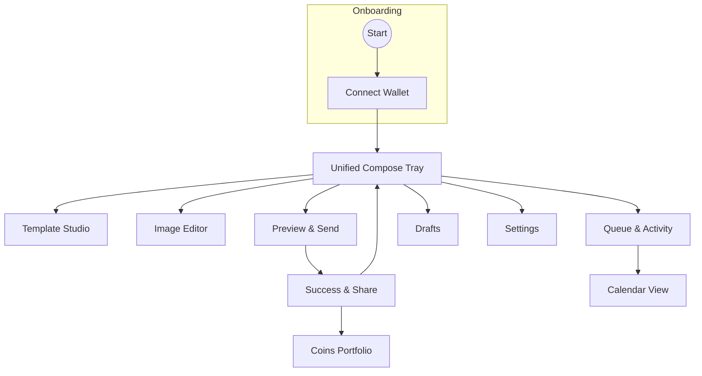

### 2.2. Navigation Structure

*   **Primary Navigation:** A main navigation bar (e.g., a bottom tab bar on mobile, a sidebar on desktop) will provide access to the core application areas:
    *   **Compose:** The central creation hub.
    *   **Queue:** Manage scheduled and sent items.
    *   **Calendar:** Visualize and organize content over time.
    *   **Portfolio:** Track coin performance and analytics.
    *   **Settings:** Configure user preferences.
*   **Secondary Navigation:** Within each primary section, navigation will be handled by tabs, toolbars, and contextual menus (e.g., filtering the queue, selecting tools in the editor).
*   **Breadcrumb Strategy:** For a mini-app of this nature, a formal breadcrumb trail is likely unnecessary. Navigation context will be maintained through clear headings, highlighted tabs in the primary navigation, and back buttons within modal flows (like exiting the Template Studio to return to the Compose Tray).

---

## 3. User Flows

### 3.1. Flow: Value-First Onboarding & Wallet Connection

*   **User Goal:** To understand the app's value instantly and connect their Farcaster account seamlessly when they are ready to create content.
*   **Entry Points:** The user opens the mini-app for the first time.
*   **Success Criteria:** The user successfully connects their account and is transitioned to the fully interactive compose tray, ready to create.

#### 3.1.1. Flow Diagram

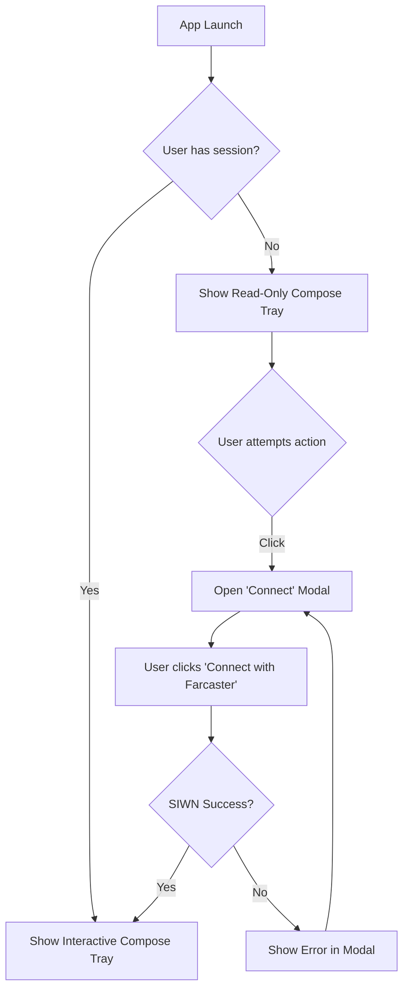

#### 3.1.2. Edge Cases & Error Handling

*   **SIWN Failure:** If the Sign-In with Neynar process fails, an error is displayed within the modal, allowing the user to try again without losing context.
*   **Unsupported Wallet:** If the user attempts to connect with a wallet that is not supported, the flow will guide them toward a supported option.
*   **Offline State:** If the user is offline when they first open the app, the read-only view is still displayed from a cache, with a banner indicating they are offline. Connection attempts will be disabled until the connection is restored.

### 3.2. Flow: Unified Compose Tray

*   **User Goal:** To draft a cast or a cast with a Zora coin, attach media or a template, and schedule it to be published.
*   **Entry Points:**
    *   Default screen after successful onboarding.
    *   Navigating to the "Compose" tab from primary navigation.
    *   Clicking a "Remix" or "Compose" call-to-action from another part of the app.
*   **Success Criteria:** The user successfully queues a post for sending or scheduling, and receives clear confirmation.

#### 3.2.1. Flow Diagram

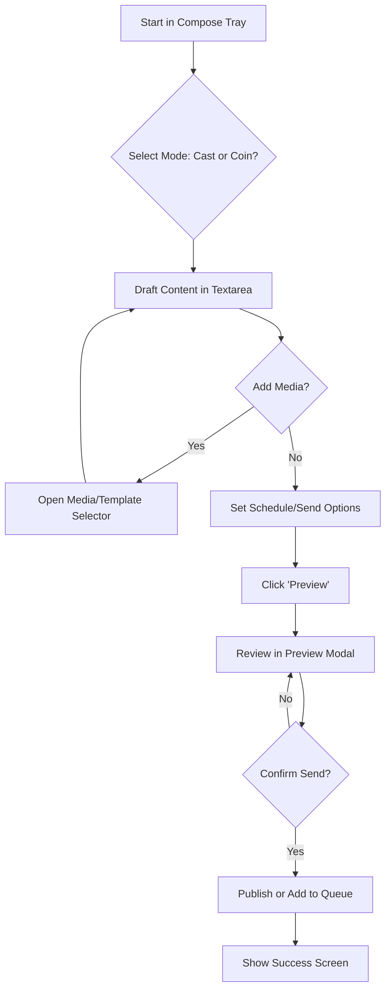

#### 3.2.2. Edge Cases & Error Handling

*   **Autosave Failure:** If the draft fails to save in the background, a toast notification appears, informing the user their latest changes are not saved.
*   **Offline Composing:** If the user goes offline, their draft is saved locally to IndexedDB. A banner indicates they are in offline mode. Publishing is disabled, but they can continue to edit.
*   **Template Not Found:** If a selected template is missing or deleted, a fallback to the default template is used, and the user is notified.
*   **Validation Errors:** If the user tries to preview with invalid data (e.g., a Zora coin ticker that is unavailable), inline validation errors appear on the form fields.

### 3.3. Flow: Template Studio

*   **User Goal:** To create, edit, and manage reusable visual templates for their casts.
*   **Entry Points:**
    *   Clicking the "Use Template" button from the Compose Tray.
    *   Selecting "Manage Templates" from the user's settings.
*   **Success Criteria:** The user saves a new template or a new version of an existing template, which then becomes available in their compose flow.

#### 3.3.1. Flow Diagram

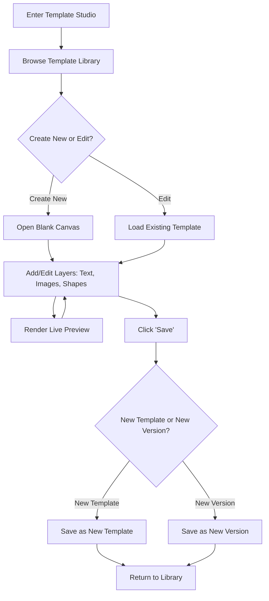

#### 3.3.2. Edge Cases & Error Handling

*   **Render Failure:** If the live preview fails to render, the last successful preview is shown with a warning icon, and an error is logged.
*   **Version Conflict:** If another session has edited the template since it was opened, the user is prompted to either overwrite the changes or save their work as a new template.
*   **Offline Editing:** In offline mode, edits are queued locally. The user is notified that their changes will sync once they are back online. Saving new versions is disabled offline.
*   **Asset Upload Failure:** If an image fails to upload for a template layer, a placeholder is shown, and a retry option is provided.

### 3.4. Flow: Instagram-Style Image Editor

*   **User Goal:** To apply advanced edits, filters, and text overlays to an image before attaching it to a cast.
*   **Entry Points:**
    *   Clicking the "Edit" button on an image in the Media/Template selector.
    *   Launching the editor from within the Template Studio for a specific image layer.
*   **Success Criteria:** The user exports a successfully edited image, which replaces the original in their compose flow.

#### 3.4.1. Flow Diagram

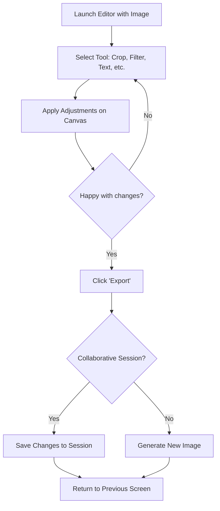

#### 3.4.2. Edge Cases & Error Handling

*   **Large Image Handling:** If a user uploads a very large image (>4096px), the system will prompt them to downscale it to ensure performance.
*   **Export Failure:** If the image fails to export, a toast notification is shown, and the user is given the option to retry. The original, unedited image is preserved.
*   **Offline Editing:** Edits made while offline are queued. The export action is disabled, but changes are saved locally and can be synced and exported when the user is back online.
*   **Collaborative Disconnect:** If a user in a collaborative edit session loses their connection, their session is gracefully invalidated, and they are notified. Their last-saved changes are preserved.

### 3.5. Flow: Preview & Send

*   **User Goal:** To review the final appearance of their cast and/or Zora coin, and to confirm the transaction to either send it immediately or add it to the schedule queue.
*   **Entry Points:**
    *   Clicking the "Preview" button from the Unified Compose Tray.
*   **Success Criteria:** The user confidently signs the transaction, and the post is successfully sent or queued.

#### 3.5.1. Flow Diagram

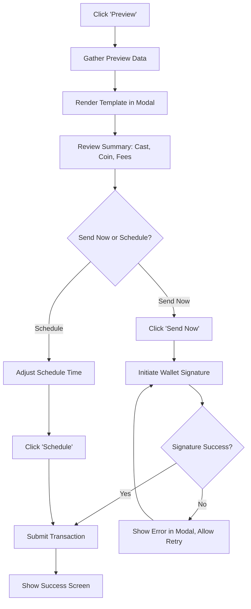

#### 3.5.2. Edge Cases & Error Handling

*   **Partial Success:** If the cast posts successfully but the Zora coin creation fails, the success screen will clearly indicate the partial failure and provide a one-click option to retry the coin creation.
*   **Signature Rejection:** If the user rejects the signature in their wallet, the flow returns to the preview modal, allowing them to make adjustments or try again.
*   **Render Latency:** If the template render is slow, a progress indicator is shown. If it fails, a fallback preview (e.g., plain text and an image URL) is displayed so the user is not blocked.
*   **Scheduling in the Past:** If the user accidentally sets a schedule time that is in the past, the system will automatically suggest the next available time slot and ask for confirmation.

### 3.6. Flow: Success & Share

*   **User Goal:** To receive clear confirmation that their action was successful and to easily share their new cast or coin to drive engagement.
*   **Entry Points:**
    *   Automatically shown after a successful send or schedule action.
*   **Success Criteria:** The user shares their success to at least one platform or takes a subsequent action (e.g., "Schedule Next"), driving a growth loop.

#### 3.6.1. Flow Diagram

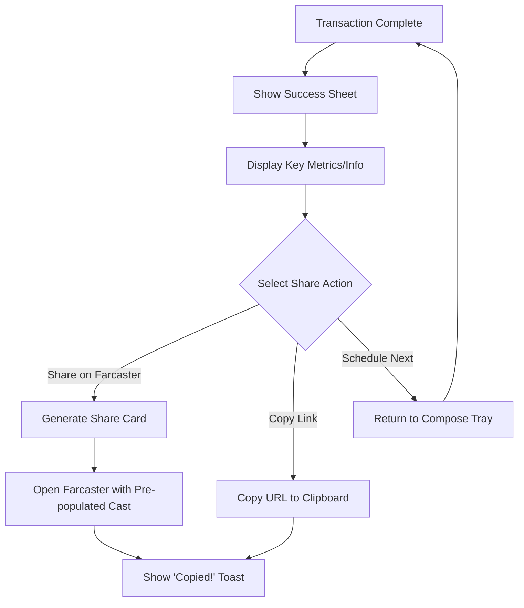

#### 3.6.2. Edge Cases & Error Handling

*   **Share Asset Generation Failure:** If the custom share card (e.g., an image) fails to generate, the system falls back to a simple text-based share and schedules a retry for the image generation in the background.
*   **Clipboard Permission Denied:** If the browser blocks clipboard access, the system will display the link in a read-only input field so the user can manually copy it.
*   **Stale Stats:** If the queue or coin statistics displayed on the success screen are stale, a timestamp is shown with a manual refresh control.

### 3.7. Flow: Queue & Activity Management

*   **User Goal:** To monitor, manage, and get an overview of their scheduled, queued, and sent casts.
*   **Entry Points:**
    *   Navigating to the "Queue" tab from the primary navigation.
*   **Success Criteria:** The user can successfully perform a bulk action (e.g., pause, delete) or find and edit a specific item in the queue.

#### 3.7.1. Flow Diagram

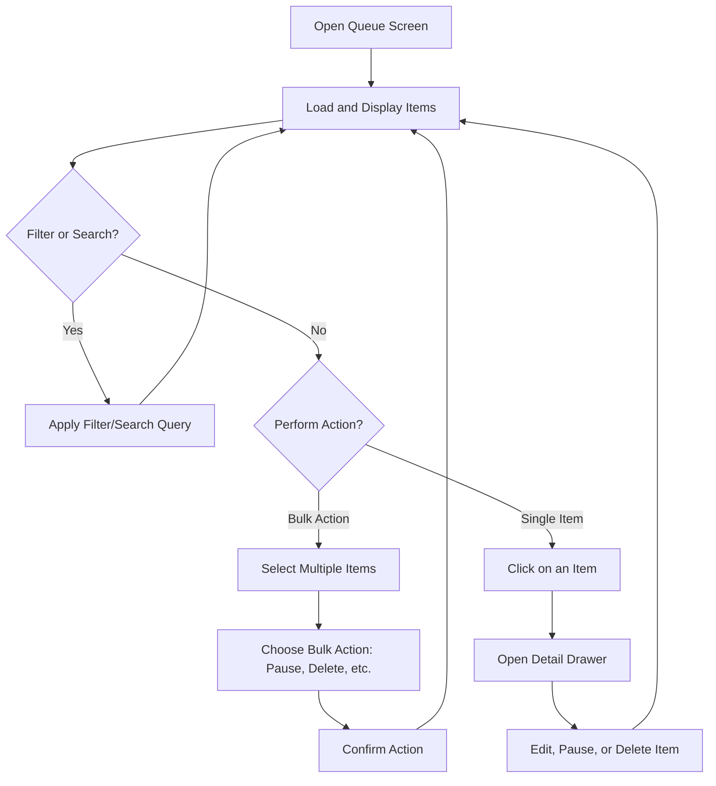

#### 3.7.2. Edge Cases & Error Handling

*   **Worker Retry Loops:** If a backend worker is failing to send a post, the UI will not get stuck in a loop. It will show an "error" status with an info banner explaining that the system is retrying.
*   **Bulk Action on Publishing Item:** If a user tries to cancel an item that is actively being published, the action will be deferred gracefully, and the user will be notified that the item could not be canceled at this time.
*   **Offline View:** When offline, the queue displays a cached view of the items. Destructive actions (like deleting) are disabled until the connection is restored, and a banner indicates the offline status.
*   **Real-time Sync Failure:** If the WebSocket connection for real-time updates is lost, the system falls back to periodic polling (SSE or manual refresh), and a visual indicator notifies the user that the view may not be live.

### 3.8. Flow: Calendar View

*   **User Goal:** To visualize their content schedule over a week or month and to easily reorganize planned content.
*   **Entry Points:**
    *   Navigating to the "Calendar" tab from the primary navigation.
    *   Switching from the Queue view to the Calendar view.
*   **Success Criteria:** The user successfully reschedules a post by dragging and dropping it to a new time slot.

#### 3.8.1. Flow Diagram

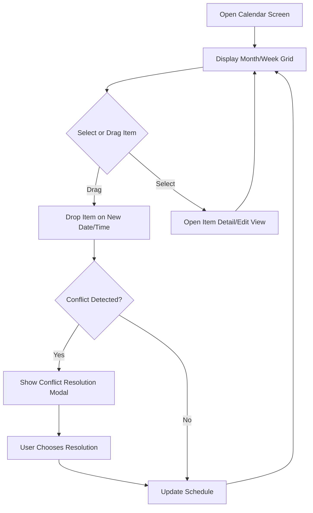

#### 3.8.2. Edge Cases & Error Handling

*   **Schedule Conflict:** If a user drags an item to a time slot that is already occupied, a modal appears suggesting the next available slot or allowing them to force the overlap.
*   **Timezone Changes:** If the user's device timezone changes, the calendar display is recalculated, and a subtle notification appears to confirm the change and prevent confusion.
*   **Offline Dragging:** Drag-and-drop rescheduling is disabled in offline mode to prevent data conflicts. The user is shown a notification if they attempt to do it.
*   **Performance on Heavy Schedules:** For users with hundreds of scheduled items, the calendar will use virtualization to ensure smooth scrolling and prevent the UI from freezing.

### 3.9. Flow: Drafts Management

*   **User Goal:** To view, resume editing, organize, and delete their saved, unpublished drafts.
*   **Entry Points:**
    *   Navigating to "Drafts" from the main application menu or settings.
    *   Triggered automatically when the app starts with unsynced offline drafts.
*   **Success Criteria:** The user can successfully find and either resume editing or delete a previously saved draft.

#### 3.9.1. Flow Diagram

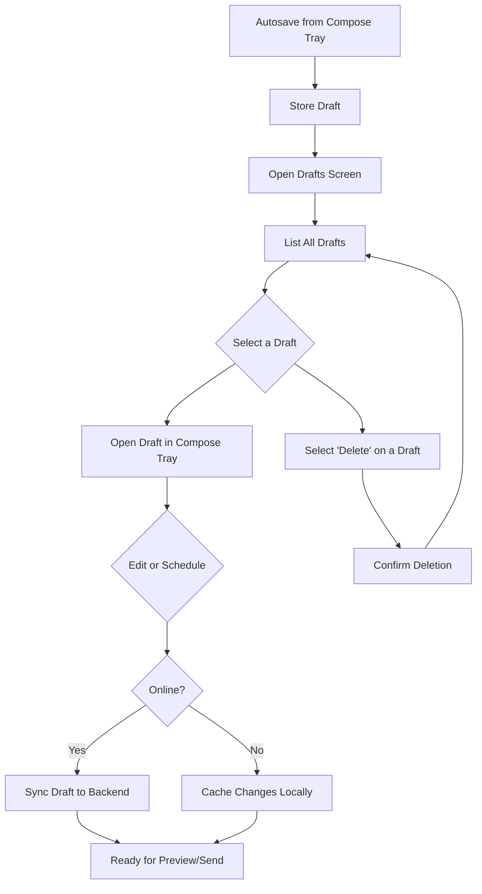

#### 3.9.2. Edge Cases & Error Handling

*   **Revision Conflict:** If a draft has been edited on another device since it was last opened, the user is shown a diff of the changes and can choose to keep the local version, accept the remote version, or merge them.
*   **Bulk Delete:** When a user attempts to bulk-delete drafts, a confirmation modal appears, warning them that the action is irreversible.
*   **Offline Caching:** When the user is offline, all drafts are available from the local cache. A "Local" badge indicates which drafts have not yet been synced.
*   **Missing Template:** If a draft is associated with a template that has since been deleted, the system prompts the user to select a new template before they can resume editing.

### 3.10. Flow: Coins Portfolio

*   **User Goal:** To track the performance of Zora coins they have created or hold, and to discover new coins.
*   **Entry Points:**
    *   Navigating to the "Portfolio" tab from the primary navigation.
    *   Clicking a "View Portfolio" call-to-action from a success screen.
*   **Success Criteria:** The user can find a specific coin, view its key performance metrics, and take a follow-up action like sharing or trading.

#### 3.10.1. Flow Diagram

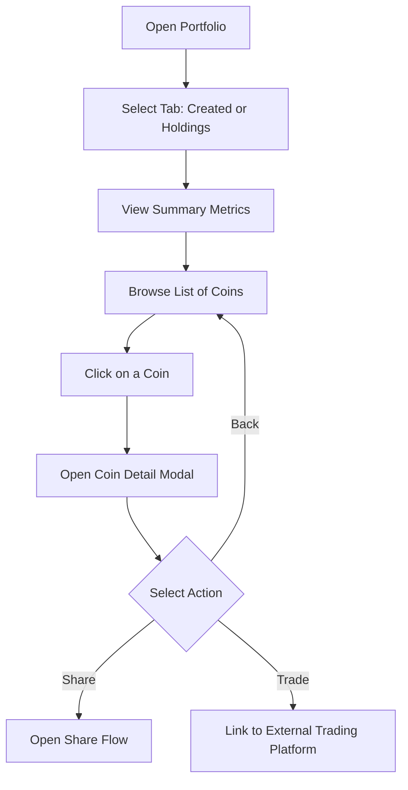

#### 3.10.2. Edge Cases & Error Handling

*   **Analytics Throttling:** If the analytics endpoint is rate-limited, the UI will display cached data with a timestamp and disable the manual refresh button until the cooldown period expires.
*   **Sparse Data:** If a new coin has very little price or volume data, a "Low Confidence" badge is displayed next to the metrics, and the last-known values are shown.
*   **Empty Holdings:** If a user has created coins but holds none, a contextual call-to-action will be displayed, encouraging them to explore the market.
*   **Offline Mode:** In offline mode, the portfolio displays a cached snapshot of the data. Actions that require a live connection, like "Trade," are disabled.

### 3.11. Flow: Settings & Notifications

*   **User Goal:** To customize their application experience, manage connected accounts, and configure their notification preferences.
*   **Entry Points:**
    *   Navigating to "Settings" from the main application menu.
*   **Success Criteria:** The user successfully updates a preference (e.g., default template, timezone) and receives confirmation that the change has been saved.

#### 3.11.1. Flow Diagram

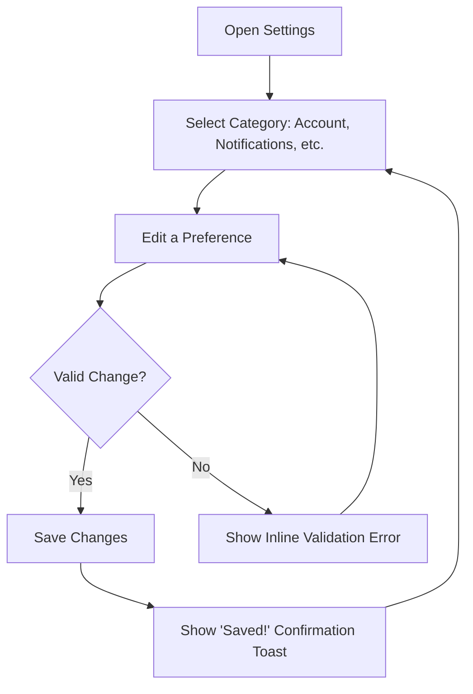

#### 3.11.2. Edge Cases & Error Handling

*   **Save Failure:** If a preference fails to save to the backend, the UI state reverts to what it was before the change, and a toast notification appears, explaining the failure and prompting a retry.
*   **Timezone Fallback:** If the application is unable to detect the user's timezone, it falls back to UTC and displays a banner prompting the user to set their timezone manually.
*   **Offline Edits:** Changes made to settings while offline are queued locally. A banner informs the user that their settings will be synced once they are back online.
*   **API Key Regeneration:** If a user regenerates an API key for an integration, a confirmation modal appears, warning them that this will break the existing integration and require them to update it elsewhere.
