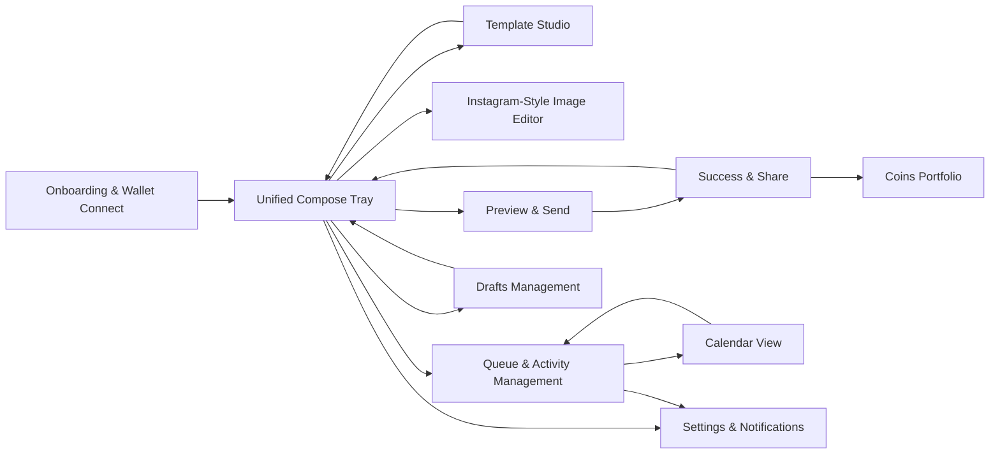
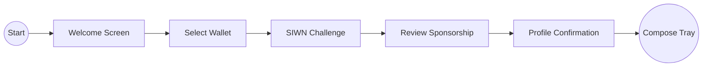
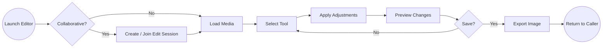
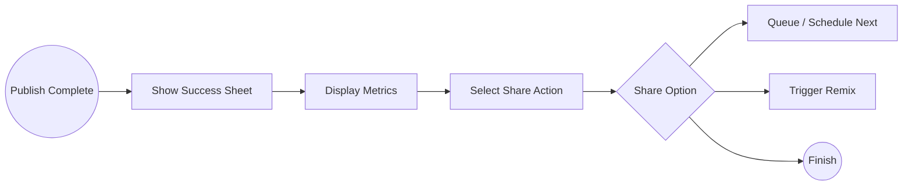

# Journey Specifications

## Technical Specifications (Component Migration)
- The component lists in each journey assume shadcn/ui primitives as foundations. Patterns such as `ResizablePanel`, `Toolbar`, `Chart`, and `ColorPicker` are custom wrappers composed from core primitives (`Dialog`, `Sheet`, `Popover`, `Slider`, canvas elements) and are detailed further in `docs/design-system/shadcn-component-mapping.md`.

## Journey Network Flow Diagram


## Journey 1: Onboarding & Wallet Connect
### Flow Diagram


### Entry Points
- Landing hero, deep link from Farcaster feed, revisit from success screen CTA.

### Flow Outline
1. Display welcome screen with value prop and CTA.
2. On CTA, open wallet selection modal (smart wallet + external connectors).
3. Trigger SIWN challenge, present signature prompt.
4. Run gas sponsorship eligibility check and explain results.
5. Complete account setup, route to compose tray.

### Key Screens
- Welcome hero, wallet modal, SIWN approval, sponsorship summary, success handoff.

### States
- Loading config, wallet rejected, SIWN failure, sponsorship unavailable, success.

### Data & API
- `GET /config`, SIWN challenge via Neynar, sponsorship service, session token storage.

### Components
- shadcn `Button`, `Dialog`, `Tabs` for wallet choices, `Alert` for eligibility messaging, `Progress` for multi-step indicator.

### Accessibility
- Focus trap in modal, screen reader announcements for connection status, passkey hint text.

### Mobile
- Full height Sheet for wallet connect, large tap targets, back swipe support.

### Wireframe Specification
- **Welcome Hero:** 12-column grid, 24px desktop margins, 16px gutters; hero text spans columns 2-7, illustration columns 8-12. Primary CTA aligned bottom-left with 24px vertical spacing between blocks. Mobile collapses to single column with illustration stacked below text and sticky bottom CTA.
- **Wallet Modal:** 6-column centered grid within modal, 32px padding, wallet list uses 16px vertical spacing. Toolbar with close icon aligns to top-right. Mobile switches to full-screen Sheet with segmented controls stacked vertically, maintaining 16px padding and sticky footer for CTA.
- **Sponsorship Summary:** Split layout with status card (columns 1-6) and help panel (columns 7-12), 20px gap. Mobile stacks sections with 12px spacing and converts help panel into accordion.

### Edge Cases
- SIWN token expires during sponsorship check, prompting automatic renewal without losing context.
- User switches to unsupported wallet mid-auth; display fallback instructions and reset state safely.
- Sponsorship API timeout; show retry with exponential backoff and allow manual proceed without sponsorship.
- Passkey permission denied; surface alternate wallet connect option while keeping SIWN progress indicator accurate.

## Journey 2: Unified Compose Tray
### Flow Diagram
```mermaid
flowchart LR
    start((Start)) --> mode[Select Mode]
    mode --> draft[Draft Content]
    draft --> media[Edit Media/Template]
    media --> schedule[Schedule or Send]
    schedule --> preview[Preview]
    preview --> publish[Send / Queue]
    publish --> end((Success or Queue))
```

### Reference
- Existing logic in `web/components/compose-form.tsx`.

### Flow Outline
1. Default to coin mode if prior selection stored, otherwise cast mode.
2. Provide text input, template picker, media uploader, scheduling trigger. Planned enhancement: when the user submits a text-only Zora post, auto-select the tweet-card template and surface quick style controls before render.
3. Allow mode toggle with preserved field values.
4. Autosave drafts per debounce interval.
5. Offer preview and send actions.

### States
- Wrong chain, disconnected wallet, upload in progress, validation error, preview ready.

### Data & API
- `/uploads/pinata/sign`, `/uploads/pinata/direct`, `/uploads/pinata/legacy`, `/zora/coins/metadata`, new templates API, scheduling endpoints. Planned: call `POST /api/templates/render` with the tweet-card template payload to generate shareable media for text-only submissions.

### Components
- shadcn `Tabs`, `Textarea`, `Dropzone` wrapper, `Popover` with calendar, `Command`-based template selector, `Toast` feedback.

### Accessibility
- Announce autosave, label template dropdown, keyboard accessible file input.

### Mobile
- Sticky action bar, collapsible sections for template and scheduling, drag handle for bottom sheets.

### Wireframe Specification
- **Compose Tray Desktop:** 12-column grid with 20px gutters; text composer spans columns 1-7, media panel columns 8-12. Header contains mode tabs with 16px spacing and quick stats pill. Scheduling drawer appears as overlay from right occupying columns 9-12 with 24px padding, layered over media panel. Spacing tokens: 24px between major regions, 12px between field groups. Breakpoints: at `md` (768px) media panel collapses below text area; at `sm` (640px) mode tabs convert to segmented control stacked above composer.
- **Media Panel:** Uses card with 16px padding, preview slots arranged with CSS grid two columns on desktop, one column mobile. Upload button anchored bottom-right with 12px offset. Media actions toolbar (edit, replace, remove) sits above preview with 8px icon spacing.
- **Scheduling Drawer:** Drawer width 360px, 24px internal padding, vertical stacking of timezone select, date picker, recurrence toggles with 16px vertical rhythm. On mobile, drawer becomes full-screen Sheet with sticky header and footer buttons, content scrollable with 12px padding.

### Edge Cases
- Media EXIF orientation mismatch causing rotated preview; auto-correct while surfacing toggle to preserve original orientation.
- Template enforces locked aspect ratio conflicting with uploaded media; prompt user to crop via editor before proceeding.
- Autosave request fails due to offline mode; store diff locally and retry when connection resumes.
- Switching between cast and coin modes mid-edit should retain shared fields while resetting coin-only metadata to avoid invalid state.
- Scheduling with mismatched timezone offset should prompt the user with the server-provided 	imezoneWarnings before confirming.
- Tweet-card render fallback (planned): if the render service is unavailable, submit plain text and queue share-card generation for later.

## Journey 3: Template Studio
### Flow Diagram
```mermaid
flowchart LR
    start((Start)) --> library[Browse Templates]
    library --> create[Create or Edit Template]
    create --> preview[Render Preview]
    preview --> save[Save / Version]
    save --> assign[Set Default / Share]
    assign --> end((Return to Compose))
```

### Flow Outline
1. Display template library with tabs for My Templates, Shared, Recent.
2. Create or open template in canvas workspace.
3. Customize layers (background, text blocks, avatar mask, accent shapes). Planned addition: ship a prebuilt tweet-card template with predefined slots for profile metadata and text content that teams can duplicate.
4. Preview renders and save versions.
5. Assign default status for compose tray, including the ability to mark the tweet-card template as the default for text-only Zora posts once implemented.

### States
- Empty library, editing, preview rendering, save success, conflict (template in use).

### Data & API
- `/api/templates`, `/api/templates/render`, Pinata uploads for assets, version history metadata.

### Components
- shadcn `Tabs`, `Command`, `Slider`, custom `ColorPicker`, custom `ResizablePanel`, `Dialog`, TUI image editor embed for advanced editing.

### Accessibility
- Provide keyboard shortcuts list, layer ordering via arrow keys, color picker with text input fallback.

### Mobile
- Dedicated full screen mode, simplified controls, vertical stacking of property panels.

### Wireframe Specification
- **Library Grid:** 12-column layout with template cards spanning 3 columns each, 24px gutter, 32px top padding. Filter toolbar aligned left with segmented controls and search `Command` input. Mobile uses two-column grid with 16px gutters.
- **Canvas Workspace:** Split view with toolbar column (columns 1-2), canvas center (columns 3-8), properties panel (columns 9-12). Toolbar vertical stack with 12px icon spacing; properties panel uses accordion sections with 16px spacing. Mobile reorganizes into top toolbar (horizontal scroll), canvas full width, properties in collapsible Sheet.

### Edge Cases
- Template locked because referenced by active schedule; show conflict modal with options to duplicate or schedule update.
- Multi-user collaboration attempt without permission; deny edit and surface share settings guidance.
- Preview render service unavailable; display fallback thumbnail using last saved preview and queue rerender.
- Uploaded custom font fails validation; offer fallback to default typography with descriptive error.

## Journey 4: Instagram-Style Image Editor
### Flow Diagram


### Flow Outline
1. Launch editor from compose or template studio.
2. Optionally create or join a collaborative edit session if multiple users are participating.
3. Load image with optional template overlay.
4. Offer tool selection (crop, text, sticker, draw, filters).
5. Allow undo/redo, resets, and preview.
6. Save to Pinata and return to caller.

### States
- Initial loading, tool active, unsaved changes, export success, export failure.

### Data & API
- `POST /api/images/edit-session` (only for collaborative sessions), `POST /api/images/save-edit` (accepts optional `sessionId`), `GET /api/images/templates`.

### Components
- TUI image editor, shadcn `Dialog`, custom `Toolbar`, `Tooltip`, `Badge` for active tools.

### Accessibility
- Provide text alternatives for icons, visible focus on tool buttons, high contrast toolbar theme.

### Mobile
- Gesture support (pinch, rotate), larger tool buttons, optional stylus mode.

### Wireframe Specification
- **Editor Canvas:** Full-bleed canvas centered with 32px padding desktop, toolbar docked left (80px width) with vertically stacked icons and 12px spacing. Right-side property panel 320px width using tabs for Text, Stickers, Draw, Filters. Mobile hides side panels, opting for bottom toolbar (horizontal scroll) and top bar containing undo/redo and save with 16px padding.

### Edge Cases
- Large GIF upload exceeding memory; prompt conversion to static frame or reduce resolution.
- Undo stack overflow after long edit session; provide notification and auto-trim history while preserving latest state.
- Sticker asset CDN unreachable; fallback to local emoji picker subset.
- Loss of network during save; queue export, show offline banner, retry automatically when reconnected, and flag collaborative sessions as invalid if peers disconnect.

## Journey 5: Preview & Send
### Flow Diagram
```mermaid
flowchart LR
    start((Trigger Preview)) --> collect[Collect Data]
    collect --> render[Render Template]
    render --> review[Review Details]
    review --> confirm{Confirm?}
    confirm -- Yes --> publish[Publish / Schedule]
    publish --> status[Show Status]
    status --> end((Success Sheet))
    confirm -- No --> adjust[Adjust Inputs]
    adjust --> collect
```

### Flow Outline
1. Trigger preview request combining text, template, media, coin data.
2. Display preview with coin economics, schedule summary, network info.
3. Present confirm button with wallet action copy.
4. Handle publish process and show status updates.
5. Surface errors with retry guidance.

### States
- Preview loading, ready, validation error, wallet error, publishing.

### Data & API
- `POST /api/casts/preview`, `POST /api/templates/render`, `/zora/coins/create`, wallet signature via wagmi client.

### Components
- shadcn `Dialog`, `Card`, `Accordion` for detail panels, `Alert` for errors.

### Accessibility
- Describe fee summary via aria-live region, ensure confirm button focus on load.

### Mobile
- Full screen dialog with swipe to close, sticky confirm button, summary accordion collapsed by default.

### Wireframe Specification
- **Preview Modal:** Desktop width 720px, 32px padding, two-column layout with preview asset on left (columns 1-6) and detail stack on right (columns 7-12). Breakdown cards spaced 16px apart, action buttons aligned bottom-right. Mobile uses full-screen Sheet with preview image occupying top 40% and detail accordion below, CTA pinned to bottom with 16px safe-area padding.

### Edge Cases
- Partial success where cast posts but coin mint fails; show warning with retry option for coin and queue follow-up.
- Wallet signature rejected after preview; allow immediate retry or switch wallet without losing preview state.
- Template render latency exceeding SLA; provide progress indicator with ability to continue waiting or fallback to plain preview.
- Scheduled time already passed due to slow review; prompt reschedule with suggested next available slot.

## Journey 6: Success & Share
### Flow Diagram


### Flow Outline
1. Show success sheet with cast hash, coin address, key metrics.
2. Generate dynamic share card preview.
3. Provide share actions (copy, cast, remix prompt).
4. Offer follow-up actions (schedule another, view queue, open portfolio).

### States
- Generating share card, success, copy failure, remix load.

### Data & API
- `GET /api/queue/stats`, share asset renderer, Neynar share endpoint.

### Components
- shadcn `Sheet`, `Tabs` for share destinations, `Button`, `Toast` for copy feedback.

### Accessibility
- Announce success message, provide textual summary of metrics, ensure share buttons labelled.

### Mobile
- Full screen sheet with horizontal scroll for share options, quick share icons.

### Wireframe Specification
- **Success Sheet:** Desktop width 640px, 28px padding, top area with celebratory icon and headline, middle region two-column metric cards (columns 1-6 and 7-12) with 16px gap, bottom share tabs with card preview on left and quick actions on right. Mobile reorganizes metrics into stacked cards with 12px spacing and share buttons in horizontal scroll carousel.

### Edge Cases
- Share asset generator fails; fall back to minimal text share with alert and async retry.
- Copy to clipboard blocked by browser permissions; display manual link field with select-all button.
- Remix action triggered without templates available; redirect to Template Studio with contextual message.
- Queue stats endpoint returns stale data; show timestamp and refresh control to avoid misleading metrics.

## Journey 7: Queue & Activity Management
### Flow Diagram
```mermaid
flowchart LR
    start((Open Queue)) --> load[Load Items]
    load --> filter[Filter / Segment]
    filter --> inspect[Inspect Item]
    inspect --> action{Take Action?}
    action -- Bulk --> bulk[Execute Bulk Action]
    action -- Single --> detail[Open Detail Drawer]
    bulk --> update[Update Status]
    detail --> update
    update --> refresh[Refresh View]
    refresh --> end((Monitor Status))
```

### Flow Outline
1. Load queue overview with segmented controls (Casts, Coins, All).
2. Present cards with status, schedule, linked template preview.
3. Enable bulk selection and actions (cancel, duplicate, publish now).
4. Stream status updates via polling or live feed.
5. Provide detail drawer for activity history and retries.

### States
- Loading, empty, live update, failure (worker error), bulk action pending.

### Data & API
- `/casts/queue`, `/zora/coins/queue`, `/api/queue/calendar`, `/api/queue/bulk-action`, `/api/queue/stats`.

### Components
- shadcn `DataTable`, `Card`, `Badge`, `DropdownMenu`, `Toast`, `Skeleton`.

### Accessibility
- Keyboard navigation within table rows, announce bulk action results, maintain high contrast status colors.

### Mobile
- Stack cards vertically, convert bulk actions to bottom sheet, collapse filters into `Command` search.

### Wireframe Specification
- **Queue Overview:** Responsive table on desktop with sticky header containing filters and stats chips; table uses 12-column grid mapping to columns for status, title, schedule, actions. Row height 72px with 16px padding. Mobile switches to card layout with status badge at top-left, schedule info centered, action menu as ellipsis bottom-right.
- **Detail Drawer:** Right-side drawer 400px width with timeline of events spaced 16px apart, summary card pinned at top. Mobile uses full-screen overlay with collapsible sections and sticky action bar.

### Status Mapping
- UI `Draft` → backend `pending_draft`
- UI `Scheduled` → backend `pending`
- UI `Sending` → backend `publishing`
- UI `Success` → backend `posted`
- UI `Failed` → backend `failed`
- UI `Partial Success` → backend `partial`
- *Note:* Exact API contracts are defined in `docs/technical-specifications/api-contracts.md`.

### Edge Cases
- Worker retry loop causes rapid status flips; throttle updates and show info banner explaining retries.
- Bulk cancel triggered while an item transitions to publishing; warn user and defer cancel until safe state.
- Queue refresh occurs during offline mode; display cached view with offline tag and disable destructive actions.
- Duplicate action invoked on job linked to deleted template; prompt user to select replacement template.

## Journey 8: Calendar View
### Flow Diagram
```mermaid
flowchart LR
    start((Open Calendar)) --> month[Month Grid]
    month --> select[Select or Drag Item]
    select --> conflict{Conflict?}
    conflict -- Yes --> resolve[Resolve Options]
    resolve --> month
    conflict -- No --> update[Update Schedule]
    update --> sync[Sync with Queue]
    sync --> end((Confirmed))
```

### Flow Outline
1. Render month grid with scheduler entries as badges.
2. Provide week switch and list view toggle.
3. Support drag-drop reschedule with conflict detection.
4. Allow new entry creation from empty slot or floating action button.
5. Sync changes with queue and show success toast.

### States
- Loading, drag placeholder, conflict warning, offline mode.

### Data & API
- `GET /api/calendar/view` (heatmaps + auto-slots), `PUT /api/queue/:id/reschedule` (supplies conflict `suggestedSlots`), `GET /api/queue/stats` for status overlays.

### Components
- shadcn `Calendar`, `Popover`, `Tooltip`, `Dialog`, `Badge` for status chips.

### Accessibility
- Provide keyboard navigation for grid, announce drag start/end, ensure color coding paired with icons or labels.

### Mobile
- Switch to agenda list view, long press to drag, present quick create modal.

### Wireframe Specification
- **Month Grid Desktop:** 7-column grid, each cell uses 12px padding with header row for weekdays. Event chips align top-left with 4px vertical spacing, limited to three visible chips with “+ more” indicator using badge. Side panel on right (columns 11-12) summarizes selected day with 20px padding. Mobile collapses side panel beneath grid and increases cell height to 96px for touch friendliness.
- **Week Timeline:** Horizontal timeline at top showing hours (columns 1-12) with sticky time labels on left. Events rendered as blocks with 8px gap; drag handles shown on hover. Mobile converts to vertical list view sorted by time with 12px spacing and inline badges for status. Breakpoints: `md` reveals split view (timeline + list); `sm` uses list only. Sticky action bar on mobile contains create button and filter chips.

### Edge Cases
- Dragging across daylight-saving boundary adjusts scheduled time; prompt confirmation displaying original and adjusted times.
- Overlapping scheduling on same wallet triggers conflict; surface the `suggestedSlots` returned by the reschedule API and allow one-tap apply.
- Timezone change after scheduling; recalculate display while preserving original UTC, surface `timezoneWarnings` per Scheduling Timezone semantics for user confirmation.
- Offline drag attempt; prevent drop and notify user to reconnect before modifying schedule.

## Journey 9: Drafts Management
### Flow Diagram
```mermaid
flowchart LR
    start((Autosave)) --> store[Store Draft]
    store --> list[List Drafts]
    list --> open[Open Draft]
    open --> edit[Edit / Schedule]
    edit --> sync{Online?}
    sync -- Yes --> update[Sync Draft]
    sync -- No --> cache[Keep Local]
    update --> end((Ready))
    cache --> end
```

### Flow Outline
1. Autosave drafts during compose and store offline fallback.
2. Display drafts list with search and filters.
3. Open draft detail to edit or schedule.
4. Provide bulk delete or archive actions.
5. Sync updates after online reconnection.

### States
- Local-only draft, synced, conflict detected, delete pending.

### Data & API
- `/api/casts/drafts` (cursor pagination + revision tokens), local storage or IndexedDB cache, template associations.

### Components
- shadcn `Table`, `Command` search, `Checkbox`, `Dialog`, `Toast`.

### Accessibility
- Indicate draft status via text, ensure checkboxes accessible, allow keyboard bulk operations.

### Mobile
- Card layout, swipe actions for delete/archive, offline indicator icons.

### Wireframe Specification
- **Draft Library:** Table with columns for title, mode, last edited, status. Uses 12-column grid with column spans 4/2/3/3 respectively, 16px row padding. Mobile transforms into cards with headline, last edited chip, actions row with icons spaced 12px.
- **Draft Detail:** Modal 680px wide containing summary header, content preview, action buttons aligned right. Mobile turns into full-screen Sheet with sections separated by 16px dividers and sticky footer.

### Edge Cases
- Conflict between local edits and synced draft; use `revision` + `If-Match` to detect mismatches, present comparison diff, and allow choose-local or keep-remote.
- Bulk delete includes drafts currently open in compose; prompt to confirm closing unsaved work first.
- Draft referencing deleted template; suggest selecting new template before scheduling.
- IndexedDB quota exceeded; alert user and offer cleanup suggestions.

## Journey 10: Coins Portfolio
### Flow Diagram
```mermaid
flowchart LR
    start((Open Portfolio)) --> tabs[Select Tab]
    tabs --> summary[View Summary Metrics]
    summary --> detail[Open Coin Detail]
    detail --> action{Action?}
    action -- Share --> share[Share Coin]
    action -- Trade --> trade[Initiate Trade]
    action -- Back --> tabs
    share --> end((Updated))
    trade --> end
```

### Flow Outline
1. Load Created and Holdings tabs with summary metrics.
2. Present coin cards with price, supply, volume, performance sparkline.
3. Enable detail drill-in with transaction history and share options.
4. Provide trading shortcuts (mint more, share, sell) if permissions allow.
5. Surface analytics trends and badges for milestones.

### States
- Loading metrics, empty holdings, API failure, refreshing.

### Data & API
- `ZoraService` portfolio endpoints, Neynar social signals, analytics cache.

### Components
- shadcn `Tabs`, `Card`, custom `Chart` integration (e.g., Recharts), `Badge`, `DropdownMenu`.

### Accessibility
- Provide text alternatives for charts, ensure tab focus order, describe share actions.

### Mobile
- Swipe between tabs, condensed metrics stacked vertically, sticky action buttons.

### Wireframe Specification
- **Portfolio Overview:** Two-column layout on desktop with summary stats panel (columns 1-4) and coin list (columns 5-12). Cards maintain 20px padding, chart sparkline occupies top half of card with summary details below. Mobile stacks summary first followed by cards with collapsible analytics section.
- **Coin Detail:** Modal 760px wide with header containing coin avatar and metrics; content area splits into left column (transactions timeline) and right column (actions + analytics). Mobile reorders sections into vertical stack with anchor navigation links.

### Edge Cases
- Analytics endpoint throttled; show cached values timestamped and disable refresh until cooldown.
- Performance chart receives sparse data; interpolate while flagging low-confidence indicator to user.
- Share action attempted on coin without public metadata; prompt user to publish metadata before sharing.
- Holdings tab empty but created coins exist; display cross-link to Created tab with explanatory message.

## Journey 11: Settings & Notifications
### Flow Diagram
```mermaid
flowchart LR
    start((Open Settings)) --> category[Select Category]
    category --> edit[Edit Preference]
    edit --> validate{Valid?}
    validate -- Yes --> save[Save Changes]
    save --> confirm[Show Confirmation]
    confirm --> end((Done))
    validate -- No --> error[Show Error]
    error --> edit
```

### Flow Outline
1. Display settings categories (Account, Templates, Notifications, Integrations).
2. Provide toggles, dropdowns, and input fields per category.
3. Support editing default template, timezone, notification cadence.
4. Offer API key or wallet management for advanced users.
5. Persist changes with confirmation toasts and fallback to last saved state.

### States
- Loading preferences, save in progress, save success, save error, disconnected integration.

### Data & API
- `/api/user/preferences`, `/api/templates` default flag, notification service endpoints, wallet management API.

### Components
- shadcn `Tabs`, `Form`, `Switch`, `Select`, `Input`, `Alert`, `Toast`.

### Accessibility
- Semantic grouping of settings, toggle labels describing state, confirm messages via aria-live.

### Mobile
- Accordion sections, sticky save button, auto collapse after save.

### Wireframe Specification
- **Settings Hub:** 12-column grid with navigation list occupying columns 1-3 and content panel columns 4-12. Content uses 24px vertical spacing between sections, form controls aligned on 8px baseline grid. Mobile converts nav into top tabs with horizontal scroll and content stacked with 16px spacing.

### Edge Cases
- Timezone selection fails due to unsupported locale; revert to UTC and prompt user to retry later.
- Notification toggle change rejected by backend; display error toast and reset switch to previous state.
- API key regeneration while integrations active; show modal explaining downstream impact before completion.
- Wallet disconnect triggered mid-save; pause submission and request reconnection before retrying.

## Cross-Journey Considerations
- **Analytics:** Track funnel metrics for each journey stage, event names aligned with roadmap (e.g., `compose_autosave`, `template_save_success`).
- **Localization:** Prepare copy keys for future localization; ensure date formats respect timezone setting.
- **Security:** Enforce bearer token on all new APIs, rate limit edit-intensive endpoints, log audit trail for template edits and queue actions.
- **Error Handling:** Provide consistent inline messages plus toasts, include retry options, degrade gracefully offline.


